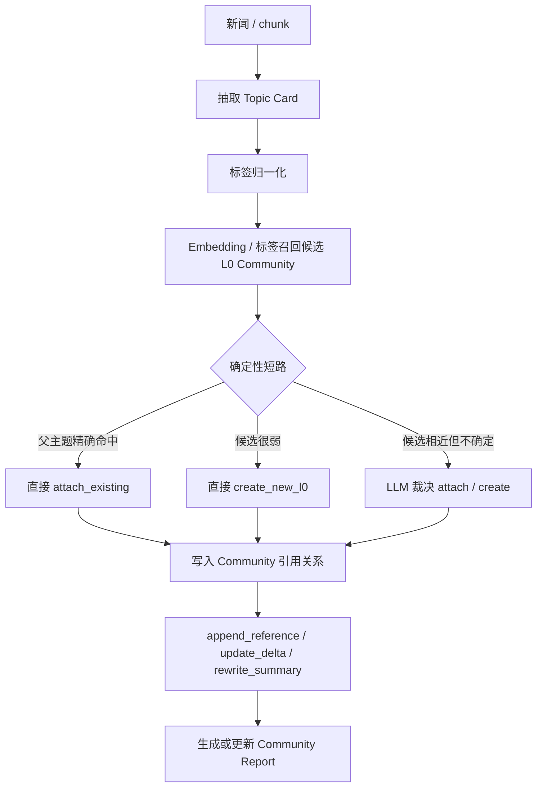
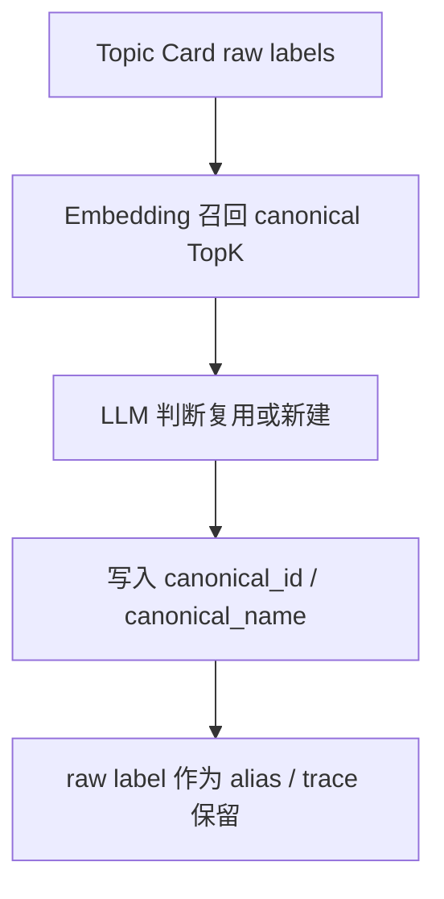

# Community Topic 高维信号提取验证方案

## 1. 本文定位

本文只记录当前最新结论：第一阶段先把 **Community Topic 高级索引** 跑通。

事件流、风险簇、影响链都可以复用同一套 Topic Card 材料，但它们不是第一阶段主目标。第一阶段的数据抽取可以提前保留这些字段，后续再使用；当前验收只看 community topic 是否能正确建立、归档、召回和概览。

## 2. 核心目标

Community Topic 是知识图谱认知层的高级索引。

它的作用不是简单分类新闻，而是把分散新闻归入可阅读、可追溯的主题索引：

```text
新闻 / 公告 / 研报
  -> Topic Card
  -> Community Topic
  -> Community Report
  -> cited evidence / chunks / relations
```

上层 Agent 或人先看主题概览，再决定是否展开证据和原文。

## 3. 当前核心结论

### 3.1 每条有效新闻都要进入 Community Topic

只要新闻不是重复数据，并且能抽出有效金融认知信号，就应该进入至少一个 community。

证据少不是不建索引的理由。证据少只影响成熟度：

```text
single_evidence: 单条证据线索
multi_evidence: 多条证据主题
mature_topic: 成熟主线
```

### 3.2 Community Title 必须是大词

新建 L0 community 不能直接使用新闻标题、公司项目名或单一交易名。

例如：

```text
不应新建: 海辰储能西班牙建厂
应新建或挂入: 新能源出海 / 海外产能布局
```

当前验证中已经使用更稳定的大词，例如：

```text
A股并购重组
并购重组政策与产业整合
```

### 3.3 一条新闻可以挂入多个 Community

一条新闻可能同时属于多个主题。

例如“储能企业海外建厂”可以挂入：

```text
新能源出海
储能海外产能
欧洲制造布局
```

但必须有一个 primary community，secondary community 数量要受控。

### 3.4 L1 / L2 不是第一条新闻就拆

L0 是大主题。L1 / L2 是当 L0 内容变多、内部出现稳定分支后再拆出的子索引。

第一条新闻通常直接进入 L0。只有当某个 L0 下内容足够多，并形成稳定分支，才考虑拆 L1 / L2。

## 4. Topic Card

Topic Card 是第一阶段的统一中间层。

它在关系抽取阶段生成，后续用于 community topic 构建。事件流字段也在这里提前保留，但第一阶段不以事件流构建为主目标。

### 4.1 字段

第一版 Topic Card 使用：

```text
market_theme
driver
impact_target
impact_direction
event_stage
risk_type
event_thread
event_action
actors
timeline_position
event_time
summary
title_candidates
```

### 4.2 第一阶段真正用于 Community Topic 的字段

当前 community topic 构建主要使用：

```text
market_theme
driver
impact_target
risk_type
event_thread
event_action
actors
title_candidates
summary
```

其中：

| 字段 | 当前作用 |
|---|---|
| market_theme | 判断主题主线 |
| driver | 判断主题驱动因素 |
| impact_target | 判断影响对象和行业/资产范围 |
| risk_type | 判断风险主题是否相近 |
| event_thread | 辅助识别同一连续事件线 |
| event_action | 辅助识别事件动作是否延续 |
| actors | 辅助识别主体是否相近 |
| title_candidates | 新建 L0 时提供大词标题候选 |
| summary | 作为候选召回和 report 的可读摘要 |

### 4.3 第一阶段先保留但不重点优化的字段

以下字段先提取出来，后续用于事件流、delta 和趋势分析；第一阶段不把它们作为 community topic 的主要验收点：

```text
impact_direction
event_stage
timeline_position
event_time
```

这些字段仍然有价值，因为未来做事件流时可以直接复用。

## 5. 构建流程

新文档入库后，community topic 的目标流程是：



### 5.1 候选召回

候选召回不让 LLM 在全量 community 中盲选。

第一版候选召回分两路：

| 候选类型 | 依据 | 默认数量 | 复杂新闻数量 |
|---|---|---:|---:|
| theme candidates | market_theme、impact_target、driver、risk_type、community title / summary | 5 | 8 |
| thread candidates | event_thread、actors、event_action、community title / summary | 3 | 7 |

合并去重后进入 LLM 裁决。

总量控制：

```text
min_top_k = 5
default_top_k = 8
max_top_k = 15
```

复杂新闻判断：

```text
market_theme >= 3
impact_target >= 4
actors >= 4
同时存在 risk_type 和 event_thread
```

挂载数量控制：

```text
默认 max_attach = 3
复杂新闻 max_attach = 5
```

### 5.2 LLM 裁决前的确定性短路

LLM 不应该处理所有归档问题。

第一版验证中已经看到，如果每条新闻都走 LLM 裁决，15 条真实样本在 2 分钟内无法完成；更重要的是，很多场景并不需要 LLM：

```text
Topic Card 父主题大词已经精确命中已有 community；
候选 community 分数很弱，本质上只是噪声候选；
当前批次没有任何候选 community。
```

因此归档裁决分三类：

| 场景 | 处理方式 |
|---|---|
| 父主题大词精确命中已有 community | 确定性 attach_existing |
| 候选为空或最高候选分数低于阈值 | 确定性 create_new_l0 |
| 候选相近但无法确定是否应合并 | 调用 LLM 裁决 |

这不是绕过 LLM，而是把确定性问题从 LLM 中剥离出来，让 LLM 只处理模糊边界。

验证脚本必须输出 `decision_source`，区分：

```text
deterministic_create
deterministic_parent_topic_attach
llm_assignment
```

### 5.3 LLM 裁决

LLM 只在候选范围内做归档裁决。

它不负责全局重构 community，也不负责图算法聚类。

裁决结果必须是可执行 JSON：

```json
{
  "schema_version": "community_assignment_v1_strict_20260606",
  "primary_assignment": {
    "action": "attach_existing",
    "community_id": "kg_community:...",
    "role": "primary",
    "confidence": 0.86,
    "matched_reason": "same_event_thread",
    "update_mode": "update_delta",
    "reason": "该新闻延续既有主题，并提供新的近期变化。"
  },
  "secondary_assignments": [],
  "new_community": null,
  "rejected_candidates": [],
  "maintenance_hints": {
    "suggest_split": false,
    "suggest_merge_community_ids": [],
    "reason": ""
  }
}
```

如果新建 L0：

```json
{
  "schema_version": "community_assignment_v1_strict_20260606",
  "primary_assignment": {
    "action": "create_new_l0",
    "community_id": null,
    "role": "primary",
    "confidence": 0.81,
    "matched_reason": "no_suitable_candidate",
    "update_mode": "rewrite_summary",
    "reason": "候选社区无法覆盖该新闻主线。"
  },
  "secondary_assignments": [],
  "new_community": {
    "level": 0,
    "title": "新能源海外产能布局",
    "scope": "围绕新能源企业海外建厂、供应链本地化、贸易政策和执行风险的主题。",
    "title_quality": "broad_topic"
  },
  "rejected_candidates": [],
  "maintenance_hints": {
    "suggest_split": false,
    "suggest_merge_community_ids": [],
    "reason": ""
  }
}
```

约束：

```text
不输出 uncertain；
不走人工 pending；
低置信也必须在 attach_existing 或 create_new_l0 中二选一；
最多一个 primary assignment；
secondary assignment 默认最多 2 个，复杂新闻最多 4 个；
new_community.title 必须是大词；
maintenance_hints 只做提示，不直接执行 split / merge。
```

### 5.4 更新模式

| update_mode | 含义 | 使用场景 |
|---|---|---|
| append_reference | 只追加引用 | 新文档只是补充材料，不改变主题理解 |
| update_delta | 记录近期变化 | 新文档代表新增、升级或反复出现的变化 |
| rewrite_summary | 重写概览 | 新文档改变了主题主线判断 |

## 6. Raw Label 与 Canonical Registry

LLM 输出的 raw label 不能直接作为索引键。

同一主题可能被表达为：

```text
中东地缘政治风险
霍尔木兹海峡局势升级
美伊冲突风险
伊朗战争风险
```

它们不一定完全相同，但可能应该挂入同一个 community。

因此正式链路必须引入 canonical registry：



第一阶段必须优先归一：

```text
market_theme
impact_target
event_thread
actors
```

其中 `market_theme` 和 `impact_target` 直接影响 community topic 质量；`event_thread` 和 `actors` 先保留，后续事件流会用。

## 7. 当前验证结果

验证脚本：

```text
docs/6. 使用说明/知识图谱/8_community_topic_validation_demo.py
```

当前使用 15 条真实 `ft_news` 样本跑通 community topic 归档验证。

本轮为了验证归档质量，关闭了 community report 生成：

```text
COMMUNITY_TOPIC_GENERATE_REPORTS=0
```

结果：

```text
15 条新闻 -> 11 个 community
耗时约 61 秒
single_evidence: 9
multi_evidence: 2
```

Community 归档结果：

| Community | 新闻数 | 判断 |
|---|---:|---|
| A股并购重组 | 1 | 合理，单条并购重组主线 |
| AI算力链 | 3 | 合理，AI 应用、AI 芯片、AI 算力港股上市被聚合 |
| 新能源出海 | 1 | 合理，储能海外建厂 |
| 企业出海服务 | 1 | 合理，金砖产业合作与出海服务 |
| 服务业政策支持 | 1 | 合理，服务业贷款贴息政策 |
| 资本市场监管 | 1 | 合理，证监会立案与信披监管 |
| 美联储政策路径 | 1 | 合理，美债与美联储人事/政策预期 |
| 大宗商品供应风险 | 1 | 合理，铜与硫酸供应扰动 |
| 区域资本市场建设 | 1 | 合理，区域股权市场培育 |
| 高端装备与机器人 | 1 | 合理，工业机器人与自动化业务 |
| 中东地缘政治风险 | 3 | 合理，美股风险、海湾融资、霍尔木兹海峡被聚合 |

决策来源：

| decision_source | 数量 | 含义 |
|---|---:|---|
| deterministic_create | 8 | 无强候选，按父主题创建 |
| deterministic_parent_topic_attach | 4 | 父主题精确命中已有 community，直接挂入 |
| llm_assignment | 3 | 候选存在但边界模糊，交给 LLM 裁决 |

关键验证点：

```text
Topic Card 抽取可行；
父主题大词能控制 community 粒度；
确定性短路可以把 15 条验证压到 2 分钟内；
AI 算力链和中东地缘政治风险可以形成 multi_evidence community；
铜供应风险不会再被误挂到 AI 或新能源；
LLM 裁决只在候选边界模糊时介入。
```

当前不足：

```text
候选召回仍是验证脚本里的 tag overlap + title hit，不是最终 embedding / registry 方案；
Topic Card raw label 尚未进入正式 canonical registry；
本轮未验证 Community Report 质量；
验证脚本尚未覆盖一条新闻多挂多个 community 的场景；
single_evidence community 较多，这是样本分布决定的，不代表正式数据一定如此。
```

## 8. 15 条真实样本

测试目标不是追求 community 数量越多越好，而是看系统能否把 15 条精选新闻归成合理主题，并能区分：

```text
新建 L0；
挂入已有 L0；
append_reference；
update_delta；
rewrite_summary；
single_evidence / multi_evidence；
大词标题是否稳定。
```

测试数据优先使用：

```text
docs/6. 使用说明/知识图谱/7_kg_write_path_demo.py
```

中已经记录的真实 `ft_news` 样本。

当前固定 15 条：

| ft_news id | 覆盖方向 |
|---:|---|
| 83904 | A股并购重组 / 产业整合 |
| 59604 | AI 应用 / 人工智能 ETF |
| 74425 | AI 芯片短缺 / 自建产能 |
| 66308 | 储能出海 / 海外建厂 |
| 76578 | 金砖产业合作 / 企业出海服务 |
| 68104 | 国务院生产性服务业贷款贴息 |
| 74339 | A股公司被证监会立案 |
| 59605 | 美债 / 美联储政策路径 |
| 74419 | 硫酸短缺 / 铜价 / 美伊风险 |
| 72799 | 广东区域股权市场培育企业 |
| 73304 | 拓斯达业绩 / 工业机器人 |
| 77551 | 美股午盘 / 中东风险 |
| 77549 | Pimco / 海湾地区借款 |
| 77547 | 霍尔木兹海峡 / 美伊风险 |
| 75461 | 华勤技术港股上市 / AI 算力 |

这批样本要覆盖：

```text
并购重组；
AI 算力；
半导体与芯片供给；
新能源出海；
政策监管；
资本市场风险；
宏观流动性；
大宗商品；
区域产业；
公司业绩；
中东地缘风险。
```

### 8.1 已完成的验证脚本优化

本轮已完成：

```text
1. 强化 Community title 大词约束；
2. 固定 15 条样本 ID，避免每次测试数据变化；
3. 输出每条新闻的候选 community、裁决理由、拒绝理由；
4. 输出 community 内 source_ids 和引用数量；
5. 输出 update_mode 分布；
6. 输出 single_evidence / multi_evidence / mature_topic 分布；
7. 对 schema 做强校验，禁止 LLM 返回旧格式或不完整字段。
8. Topic Card 并发抽取；
9. 父主题精确命中 / 弱候选确定性短路；
10. 修复短英文关键词误判，例如 supply_chain 误命中 ai。
```

## 9. 第一阶段验收口径

第一阶段只验收 community topic，不验收事件流完整能力。

必须满足：

```text
每条有效新闻至少进入一个 community；
community title 是大词，不是新闻标题；
相近主题能 attach 到已有 community；
不同主题不会被硬塞进已有 community；
Community Report 能给出可读概览；
每个 community 能追溯 source_id / evidence / chunk refs；
Topic Card 字段完整保留，后续事件流可复用；
raw label 不直接作为正式索引键，必须规划 canonical registry。
```

不接受：

```text
大量新闻长期停留在 unassigned；
只有多证据才创建 community；
community summary 只是复述单条新闻；
community title 使用公司项目名或新闻标题；
LLM 在全量 community 中盲选；
事件流目标污染第一阶段 community topic 验收。
```

## 10. 下一步

下一步不把验证脚本伪装成正式主链路，而是基于这轮验证结果继续收敛正式方案：

```text
1. 用同一批 15 条样本打开 Community Report 生成，验证 report 质量；
2. 设计正式 canonical registry，替换验证脚本里的静态父主题规则；
3. 将候选召回从 tag overlap 升级为 embedding / registry TopK；
4. 验证一条新闻多挂多个 community 的真实场景；
5. 根据验证结果再进入正式写入链路和 Milvus target 设计。
```
