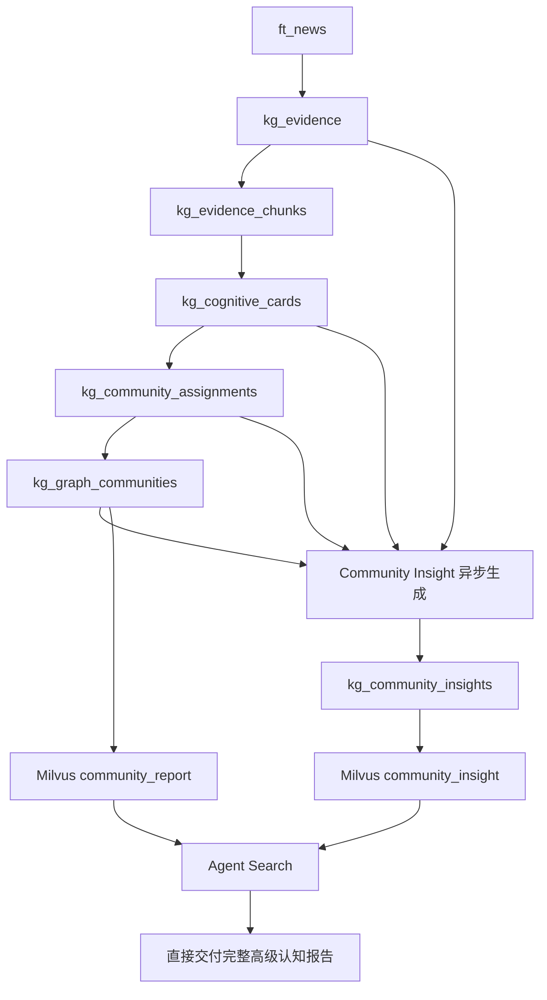
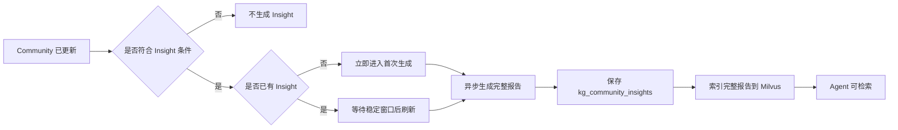
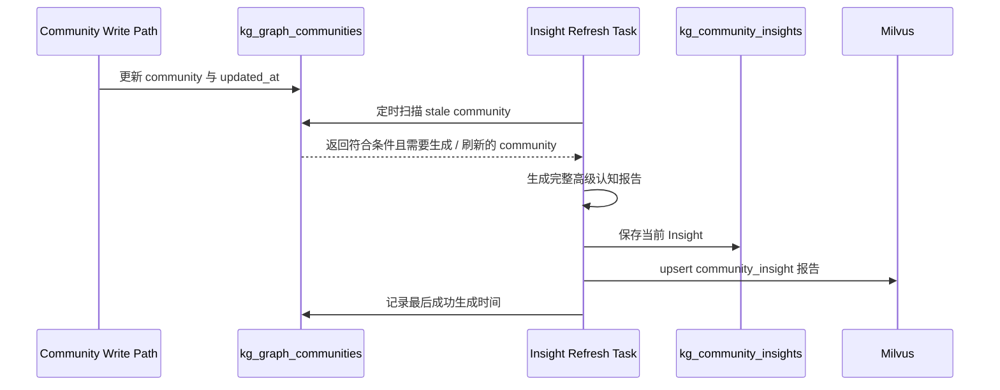
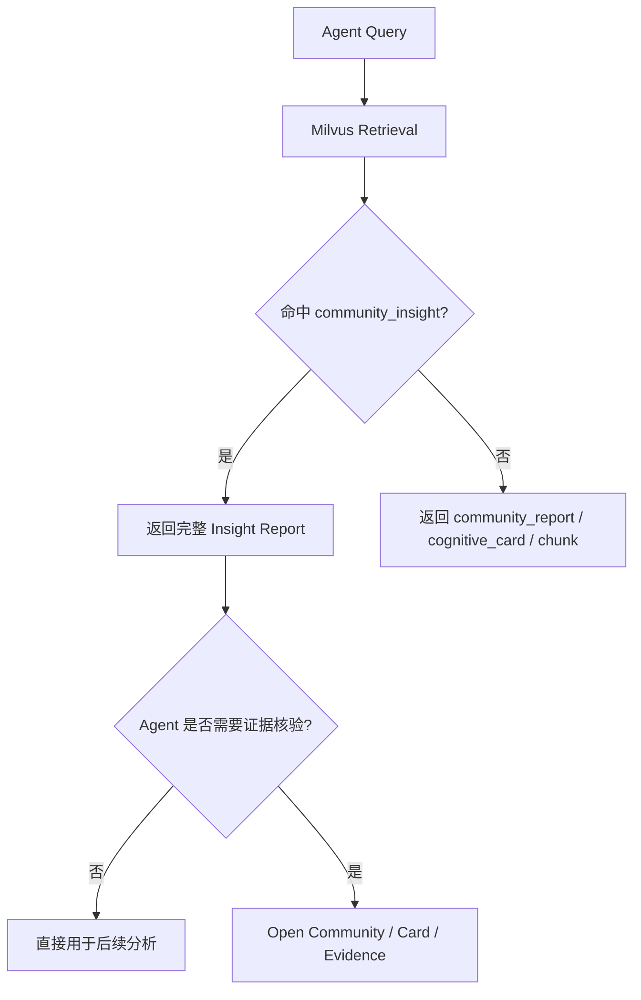
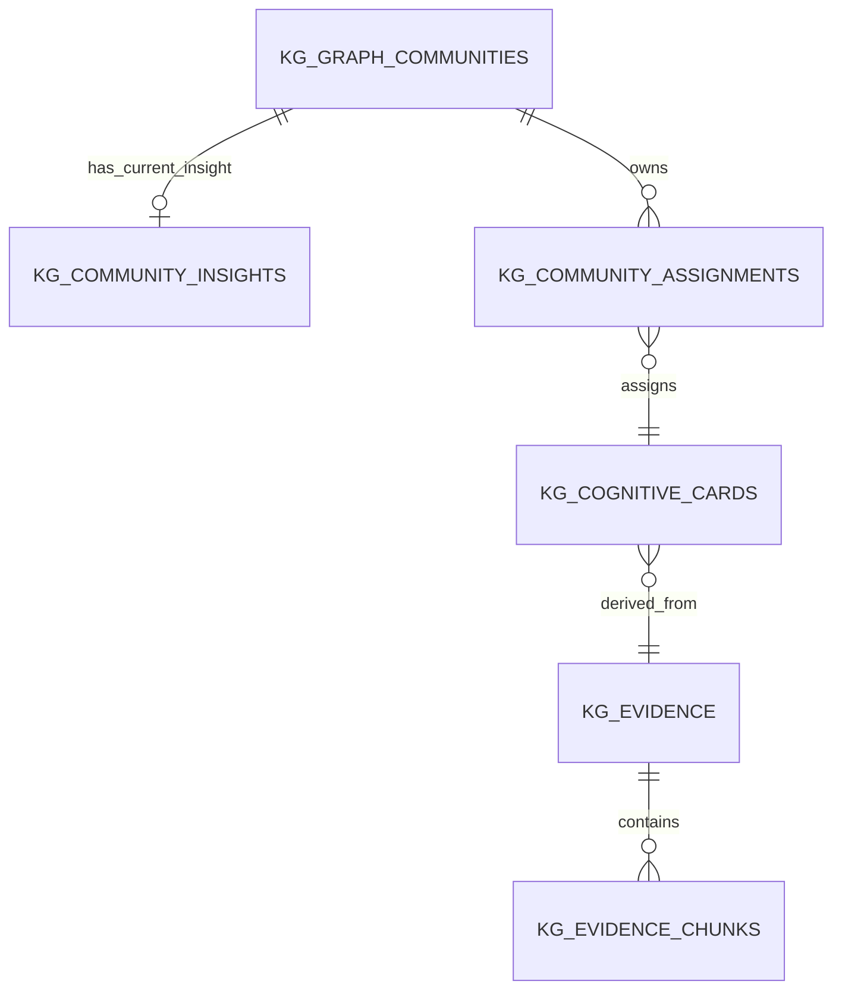

# Community Insight 高级认知索引设计方案

## 1. 本文定位

本文记录 Community Insight 高级认知索引的设计结论。

当前知识图谱写入链路已经形成：

```text
ft_news
  -> kg_evidence
  -> kg_evidence_chunks
  -> kg_cognitive_cards
  -> kg_community_assignments
  -> kg_graph_communities
```

`kg_graph_communities` 当前承担的是主题归属、聚合、合并和检索入口职责。它能把相同或相近类别的 cognitive cards 聚合到同一个 community 下，但当前 community summary 更接近“主题目录摘要”，不足以成为 Agent 可直接使用的高级认知报告。

本文只讨论目标设计，不记录实施步骤、DDL、任务命令或迁移细节。对于会影响系统边界的稳定入口，本文只记录归属位置，不展开代码实现。

## 2. 背景问题

当前 community 的价值主要体现在：

- 将分散新闻归入稳定主题。
- 降低单条 chunk / card 的碎片化。
- 为检索提供高维主题入口。
- 为后续 assignment 提供候选 community。

但对于 Agent 检索和决策上下文来说，当前 community 仍然不够。

对于一个已经聚合了多个来源的 community，当前 summary 通常主要表达：

- 聚合了多少来源和 chunk；
- 出现了哪些父级主题；
- 主要线索有哪些；
- 影响对象和风险标签有哪些。

这类信息可以帮助 Agent 判断“这个主题里有什么”，但不能充分回答：

- 多条来源合在一起说明了什么？
- 输入材料中的哪些信号是主线，哪些只是缺少机制支撑的弱信号或噪声？
- 不同来源之间是否互相强化或互相冲突？
- 在输入材料可支持的范围内，当前主题处在什么演化阶段？
- 驱动因素如何传导到行业、公司、资产或风险？
- 哪些条件会推翻当前判断？

因此需要在 community 之上增加一个高级认知索引层，让系统不只是“把新闻归类”，而是能基于同一 community 下的多条 cognitive cards 形成跨来源综合认知。

## 3. 系统定位

Community Insight 是 community 的认知增强层。

它不替代 `kg_graph_communities`，也不参与 community assignment。它基于已经形成的 community、assignments、cognitive cards 和证据指针，生成一份可直接交付给 Agent 阅读和使用的完整认知报告。



分层定位如下：

| 层级 | 职责 | Agent 使用方式 |
| --- | --- | --- |
| Evidence / Chunk | 原始事实和可追溯证据 | 精读、引用、核验。 |
| Cognitive Card | 单条或局部 evidence 的认知元数据 | 理解单条证据的主题、影响、风险、驱动。 |
| Graph Community | 稳定主题容器 | 判断新闻归属、主题聚合、候选召回、上下文展开入口。 |
| Community Insight | 跨来源高级认知报告 | 直接阅读和使用，不强制回源到 chunk。 |

## 4. 目标系统形态

目标形态是：

```text
一个符合条件的 community
  -> 一份当前有效的 Community Insight
  -> 一个 Milvus community_insight 检索文档
  -> Agent 命中后直接获得完整高级认知报告
```



关键设计结论：

- Community Insight 独立存储，不写入 `kg_graph_communities.metrics`。
- 只为具备跨来源综合价值的 community 生成 Insight。
- Insight 生成完全异步，不阻塞 community 写入。
- Milvus 直接索引完整报告，不单独生成 `index_text`。
- 第一阶段不按 section 拆 Milvus 文档。
- Agent 命中 Insight 后可以直接使用完整报告，不要求必须回源 evidence。

## 5. 核心对象

### 5.1 Graph Community

Graph Community 是主题容器。

它回答：

```text
这些 cognitive cards 应该归入哪个稳定主题？
```

它的职责包括：

- 承接 community assignment 结果；
- 维护 community 的成员范围；
- 支持 community 合并和主题边界治理；
- 作为 assignment 候选和检索入口；
- 提供当前主题目录型摘要。

Graph Community 不负责输出完整高级认知报告。

### 5.2 Community Insight

Community Insight 是基于一个 community 的跨来源认知报告。

它回答：

```text
这个 community 下的多条信息合在一起，说明了什么？
```

它的职责包括：

- 综合多个 cognitive cards 的共同主线；
- 解释驱动链条和影响路径；
- 说明综合判断的输入依据和支撑信号类型；
- 在输入材料支持时，处理弱信号、噪声或冲突关系；
- 总结风险与反转条件；
- 输出 Agent 可直接阅读和使用的完整报告。

Community Insight 不负责：

- 决定 card 是否归入 community；
- 创建、合并或删除 community；
- 替代原始证据；
- 为所有 singleton community 生成重复摘要。

### 5.3 Insight Version

Insight Version 表示同一个 community 的高级认知报告已经迭代到第几版。

它只表达报告迭代次数，不表达 community 历史版本，也不承担历史快照外键职责。

设计结论：

- 不引入 `community_version_id`。
- 不引入 `source_snapshot_id`。
- 使用 `community_id` 作为 Insight 归属主轴。
- 每次成功生成新报告时递增 insight version。
- 失败不递增 version。

## 6. 生成边界

不是所有 community 都需要 Community Insight。

生成门槛是：

```text
只有有效来源数或有效 cognitive card 数大于 1 的 community，才有生成 Insight 的必要。
```

原因：

- 单来源 / 单 card community 没有跨来源综合价值。
- 对 singleton community，Agent 直接阅读 cognitive card 或 chunk 更准确。
- 强行生成 Insight 只会制造重复内容、增加成本、放大幻觉风险。

因此：

- 符合多来源或多 card 条件的 community 才进入 Insight 候选。
- singleton community 不写入 Community Insight。
- 如果已有 Insight 的 community 后续被合并、删除或不再满足条件，对应 Insight 应退出可检索状态。

## 7. 异步刷新模型

Community Insight 不应放在 community 写入主链路中同步生成。

写入主链路只负责：

```text
news -> evidence -> chunks -> cognitive cards -> assignments -> communities
```

Insight 生成由独立异步任务负责：

```text
定时扫描 community
  -> 判断是否需要刷新 Insight
  -> 生成报告
  -> 保存 Insight
  -> 更新 Milvus
```

任务入口归属需要保持单一稳定：

- Community Insight 刷新应新增为知识图谱侧任务，入口放在 `src/interfaces/tasks/knowledge_tasks.py`。
- 该任务负责定时扫描需要生成或刷新的 community，并触发完整 Insight 报告生成。
- `collection_tasks.py` 只负责数据采集，不承载 Insight 生成逻辑。
- community 写入主链路只负责更新 community 与刷新状态，不同步调用 LLM 生成 Insight。

为了判断 community 是否需要刷新，`kg_graph_communities` 只需要保存一个轻量状态：

```text
最后一次成功生成 Community Insight 的时间
```

刷新判断依赖：

- community 成员数量符合 Insight 生成门槛；
- community 还没有任何 Insight 时，应尽快触发首次生成，不需要等待稳定窗口；
- community 已经存在 Insight 时，只有在 community 更新后才进入刷新判断；
- 后续刷新需要等待稳定窗口，避免一个 community 在短时间内多次更新导致重复生成；
- 当前没有同一 community 的 Insight 生成任务正在执行；
- 失败重试符合退避策略。

稳定窗口只用于后续刷新，不用于首次生成。它的目标是防止已有 Insight 的 community 在短时间连续更新时反复生成无用报告，而不是推迟一个新成熟 community 的首次可用时间。



该模型保证：

- community 写入不被 LLM 报告生成拖慢；
- Insight 失败不会影响主索引写入；
- 频繁更新的 community 不会被每条新闻反复触发报告生成；
- Agent 能逐步获得更成熟的高级认知报告。

## 8. 报告形态

Community Insight 的核心产物是一份完整报告，而不是一句摘要。

系统不单独生成 `insight_summary`。检索预览、结果概览和 Agent 阅读都直接使用 `insight_full_report`。完整报告面向 Agent 直接阅读，应围绕一个 community 的多来源材料形成可复用认知，而不是把输入材料重新切成多个小片段。

`insight_full_report` 不能为了短而压缩关键事实。对于包含大量来源、多条强主线或多个产业环节的 mature community，报告应保留 Agent 后续检索和判断所需的代表性证据、传导链条、影响对象、强弱边界和反转条件。报告长度由输入复杂度自然决定，不设置固定字数下限，也不允许为了凑字数扩写。

完整报告建议采用以下自然结构：

- 综合判断：基于输入材料能稳定支持的核心判断。
- 判断依据：支撑综合判断的主要证据类型和信号来源。
- 传导关系：驱动因素、影响对象和中间机制如何连接。
- 限制条件 / 不确定性：输入材料中尚不能确认、存在分歧或可能反转的部分。
- 使用边界：Agent 可以如何使用这份报告，以及何时需要回到 card / evidence / chunk 核验。

强信号、弱信号、噪声、冲突不是固定报告章节，而是生成过程中的判断维度：

- 输入材料确实存在信号强弱差异时，报告应体现证据层级。
- 输入材料确实存在方向不一致、时间尺度不一致或结论互相削弱时，报告应解释关系。
- 输入材料确实存在低权重、缺少机制支撑、重复或弱相关信息时，报告应降权。
- 如果输入材料没有相关情况，不应为了凑格式硬写“冲突”“噪声”或“弱信号”章节。

报告内部可以按自然段或小标题组织，但第一阶段不把内部结构拆成多个 Milvus section。

原因：

- 高级认知索引的第一目标是聚合，不是重新切成小 chunk。
- 如果先聚合再拆成多个独立主题，说明 community 边界本身可能需要治理，而不是 Insight 层应该承担拆分职责。
- Agent 命中 Insight 后应获得完整认知上下文，而不是再次面对碎片化内容。

### 8.1 报告质量边界

合格的 Community Insight 应满足：

- 报告不是来源罗列。
- 报告不是标签拼接或目录摘要。
- 报告有可复用的综合判断，而不是只说明 community “收了哪些东西”。
- 报告能把不同类型信号放到同一个解释框架中。
- 报告能说明判断依据来自哪些输入信号类型。
- 报告只在输入材料支持时解释冲突、噪声或弱信号，不为了格式强行输出。
- 报告能给出输入材料可支持的风险、限制条件或反转条件。
- 报告能表达置信度和支撑信号类型。
- 报告使用影响映射和使用边界，而不是投资建议口吻。

如果某个 community 的 Insight 只能写出目录摘要，说明它还没有提供足够的高级认知价值；如果必须拆成多个互相独立的主题报告，说明 community 边界可能过宽，需要回到 community 治理层处理。

### 8.2 人工评审示例

本节示例只用于人工评审设计目标，不进入生产提示词。生产提示词不得携带本节示例，避免模型在其他行业、主题或市场场景下形成固定偏好。

以下示例用于说明 Community Insight 和当前 community summary 的差异。

假设某个“半导体产业链”community 已聚合几十个来源，包含存储芯片、HBM、DRAM、NAND、先进封装、EDA、半导体设备、晶圆代工、政策推进、概念股波动等多类信号。

不合格的表达是目录摘要：

```text
半导体产业链聚合了 45 个来源、47 个 chunk 的认知信号。
父级主题：半导体设备与检测；半导体先进封装；AI算力基础设施；企业并购重组；A股资本市场。
主要线索：存储芯片价格上涨；EDA概念活跃；设备销售额上调；芯片集群推进。
影响对象：存储芯片；半导体设备；EDA；先进封装；AI数据中心。
风险线索：投资风险；价格波动风险；供应链风险；概念股炒作风险。
```

这类内容能说明 community “收了哪些东西”，但没有形成高级认知。

更可靠的 Community Insight 应接近以下形态：

```text
标题：半导体产业链多来源信号综合认知

摘要：
输入材料显示，该 community 内的多条信息并不是简单重复“半导体相关事件”，而是共同围绕 AI 算力需求、存储供需、先进封装、EDA 工具链、设备与材料景气等方向形成上游产业链传导。当前更有解释力的信号来自价格、供需、产能、设备销售预期和技术路线变化；仅描述单日股价或概念异动的信息，单独看不应主导判断。

完整报告：
从输入材料看，这批半导体产业链信息可以被理解为一组围绕 AI 基础设施扩张展开的上游传导信号。其核心不是“半导体新闻数量很多”，而是多个不同来源分别从存储价格、HBM / DRAM / NAND 供需、先进封装、EDA、设备销售预期、晶圆代工和政策推进等角度，指向半导体上游环节的关注度和产业约束正在增强。

其中，存储相关材料构成较强的主线支撑。输入中多次出现价格上修、供需偏紧、HBM 需求挤压普通存储供给、AI 数据中心需求影响存储结构等信息。这些内容之间具备较清晰的传导关系：AI 算力需求提升，对高带宽存储和先进制程相关资源形成压力，进而影响 DRAM、NAND、HBM 等存储产品的供需和价格预期。由于该主线同时具备价格、供需和产能结构信号，解释力强于单纯的概念股波动。

先进封装和 EDA 相关材料提供的是技术路线侧的补充解释。输入中如果多次出现逻辑折叠、先进封装、EDA 工具链等内容，可以理解为市场正在把芯片性能提升、封装工艺复杂度、设计自动化工具需求放到同一条技术演进链条中观察。这类信号更偏技术催化和预期变化，置信度通常弱于已经体现为价格、订单或产能约束的信号，但强于缺少机制支撑的短线行情描述。

设备、检测、材料、交期和销售预期相关内容，则为产业兑现提供辅助验证。设备销售预期上调、检测设备并购、交期拉长、扩产采购等信息说明，部分信号并不只停留在二级市场情绪，而开始触及产业链中的投资、订单、产能和交付环节。这些材料不必单独构成新的结论，但可以增强“产业链上游承压或受关注”的综合判断。

对于输入中出现的短期价格、股价、ETF、概念股或资金行为变化，应降低其独立解释权重。除非这些变化同时伴随价格预测下修、订单减少、产能过剩、需求转弱等机制性证据，否则它们更适合作为情绪或资金层背景，而不是直接推翻供需、产能或技术路线主线。

这份报告的使用边界是：它可以帮助 Agent 快速理解该 community 中多来源信息共同指向的产业链传导关系，但不能被直接理解为投资建议。若 Agent 需要引用事实、核验公司或确认具体数字，应继续展开对应 cognitive card、evidence 或 chunk。若后续输入材料出现 AI 资本开支放缓、存储价格预测下修、设备订单不兑现、产能释放快于需求等信号，则当前判断需要重新评估。
```

结构化辅助结果可以表达为：

```text
report_json:
  core_thesis:
    输入材料共同指向 AI 算力需求通过存储、先进封装、EDA、设备等环节向半导体上游传导。

  basis:
    - 类型: 价格/供需
      说明: 输入材料多次出现存储价格上修、供需偏紧、HBM/DRAM/NAND 相关信息。
      置信度: high
    - 类型: 技术路线
      说明: 输入材料出现先进封装、EDA、逻辑折叠等技术演进信号。
      置信度: medium
    - 类型: 产业兑现
      说明: 输入材料出现设备销售预期、检测设备并购、交期或扩产采购等信息。
      置信度: medium

  weak_signals:
    - 只有表面价格变化、单日行情或概念异动，缺少机制支撑时，应降权。

  conflicts:
    - 如果短期行情信号与产业供需信号方向不一致，应按时间尺度和证据层级解释，不直接互相覆盖。

  reversal_conditions:
    - 输入材料后续出现需求放缓、价格预测下修、订单减少、产能过剩或设备交付不兑现时，需要重新评估。

  quality_flags:
    - community 可能偏宽；如果后续稳定拆出多个互不依赖主线，应回到 community 治理层处理。
```

这个示例体现的判断标准是：

- 报告不是来源罗列。
- 报告不是标签拼接或目录摘要。
- 报告有可复用的综合判断。
- 报告把证据依据、传导关系和使用边界组织成完整认知。
- 报告没有把强弱、冲突、噪声写成无条件固定章节。
- 报告只基于输入材料，不假设模型知道输入之外的行情或事实。
- 报告使用影响映射和使用边界，而不是投资建议口吻。

## 9. 报告生成原则

Community Insight 不是新闻摘要，也不是 community 成员列表。

最新生成原则：

1. **输入锚定**
   - 所有判断只能基于输入材料中明确提供的信息。
   - 不得引入输入之外的行情、价格、公司、时间、政策或外部知识。

2. **综合判断**
   - 报告必须从多条 cognitive cards 中提炼共同主线。
   - 不允许逐条复述新闻，也不允许只拼接标签。

3. **依据分层**
   - 报告应说明综合判断主要由哪些输入信号类型支撑。
   - 信号强弱应基于输入中的权重、来源数量、机制支撑和相互印证程度。

4. **条件触发**
   - 只有输入材料存在方向不一致、时间尺度不一致、影响对象不一致或结论互相削弱时，才解释冲突。
   - 只有输入材料存在低权重、缺少机制支撑、重复或弱相关信息时，才降权处理。
   - 不为了格式强行输出冲突、噪声或弱信号章节。

5. **使用边界**
   - 报告应说明当前判断的限制条件、可能反转条件和适用边界。
   - 报告不输出买入、卖出、持仓建议。

6. **不强制回源**
   - Insight 本身是抽象认知产物，可以直接交付给 Agent。
   - 只有当 Agent 需要核验、引用或精读时，才展开 evidence / chunk。

## 10. 预计提示词

Community Insight 的提示词目标不是让模型“总结新闻”，而是让模型生成 Agent 可直接使用的跨来源认知报告。

提示词应明确区分：

- 输入是同一个 community 下的 cognitive cards 和 assignment 元数据，不是散乱新闻列表。
- 输出是一份完整高级认知报告，不是独立短摘要、标签列表或逐条新闻复述。
- 报告要体现认知增量，即单条 chunk / card 难以直接得到的综合判断。
- 强弱、冲突、噪声是条件触发的判断维度，不是固定输出章节。
- 报告可以直接交付给 Agent 使用，不要求默认回源到 evidence。

### 10.1 System Prompt

预计 system prompt 如下：

```text
你是金融知识图谱中的 Community Insight Synthesizer。

你的任务不是总结单条新闻，也不是罗列 community 成员。
你的任务是基于同一个 community 下的多条 cognitive cards，生成一份可直接交付给 Agent 使用的高级认知报告。

所有判断只能基于输入材料中明确提供的信息；不得引入输入之外的行情、价格、公司、时间、政策或外部知识。

这份报告必须回答：
1. 这些来源合在一起说明了什么？
2. 支撑这个判断的输入信号类型是什么？
3. 关键驱动、传导链条和影响对象是什么？
4. 输入材料中是否存在限制条件、不确定性或反转条件？
5. Agent 应如何使用这份报告，何时需要回源核验？

你必须遵守：
- 不要逐条复述新闻，不要把输入改写成新闻列表。
- 不要把 parent_themes / broad_topics / risk_type 简单拼接成报告。
- 只有输入材料支持时，才解释冲突、弱信号或噪声；不要为了格式强行生成这些内容。
- 如果输入材料显示某些信号只有表面变化描述，缺少驱动、机制、影响路径或证据支撑，应明确降权。
- 如果输入材料存在方向不一致、时间尺度不一致、影响对象不一致或结论互相削弱的信号，应解释它们之间的关系。
- 风险和反转条件必须来自输入材料可支持的机制推演。
- 不得创造输入中不存在的时间、数字、公司名、政策名、交易结论或因果关系。
- 不输出买入、卖出、持仓建议。
- 报告是一个完整认知对象，不要把它写成彼此割裂的检索片段。

输出语言使用中文。
```

### 10.2 User Prompt

预计 user prompt 如下：

```text
请基于以下 community 上下文生成 Community Insight 高级认知报告。

Community 信息：
- community_id: {{community_id}}
- title: {{community_title}}
- scope: {{community_scope}}
- source_count: {{source_count}}
- cognitive_card_count: {{cognitive_card_count}}
- assignment_count: {{assignment_count}}
- time_range: {{source_time_start}} ~ {{source_time_end}}

输入材料：
{{cognitive_card_materials}}

每条 cognitive card material 可能包含：
- cognitive_card_id
- source_id
- source_published_at
- assignment_weight
- fit_type
- title_candidate
- summary
- parent_themes
- broad_topics
- mid_topics
- event_thread
- driver
- event_action
- impact_target
- risk_type
- importance
- assignment_reason
- assignment_fit_type
- assignment_weight
- assignment_confidence

其中 `assignment_reason` / `assignment_fit_type` / `assignment_weight` / `assignment_confidence` 来自 `kg_community_assignment` 阶段，用于说明某个 intent 为什么被归入当前 community。它们是分类归因信息，不是原始新闻事实。Insight 生成时可以用这些字段判断归类边界、强弱、相邻上下文和噪声，但不能把它们当作证据层事实直接推导业务结论。

请生成：
1. insight_full_report：完整高级认知报告，建议包含综合判断、判断依据、传导关系、限制条件 / 不确定性、使用边界。
2. report_json：结构化辅助信息，用于质量校验和后续展示。

写作要求：
- 不要逐条复述输入。
- 不要把标签列表改写成报告。
- 输出对象是检索和决策 Agent，不是普通消费者、投资者或交易员。
- 不要把复杂 community 压缩成短行情评论；应保留代表性证据、输入信号类型、驱动因素、传导链条、影响对象和边界条件。
- 可以使用 assignment_reason 判断某条材料为什么属于当前 community，以及它是既有方向、新增子方向、宽父主题还是相邻上下文。
- assignment_reason 不能替代 source/card 内容本身；业务事实仍然必须来自输入材料中的 summary、topic、event、driver、impact、risk 等字段。
- 不要让低权重 adjacent_context 主导核心判断。
- 如果输入材料显示某些信号只有表面变化描述，缺少驱动、机制、影响路径或证据支撑，应明确降权。
- 如果输入存在重复主题，应合并表达。
- 如果输入存在冲突，应解释冲突，而不是忽略其中一方。
- 如果证据不足，应明确说明置信度不足，不要强行下结论。
- 如果 community 边界看起来过宽，可以在 report_json 中标记 quality_flags，但不要在报告中自行拆分成多个新 community。
```

### 10.3 输出约束

预计输出应包含两类内容：

| 输出 | 作用 |
| --- | --- |
| `insight_full_report` | 核心产物，Agent 命中后直接阅读、检索预览和结果概览都基于它。 |
| `report_json` | 结构化辅助结果，用于质量校验、展示和后续分析。 |

`report_json` 应至少表达：

- `core_thesis`：输入材料可支持的综合判断。
- `basis`：支撑判断的输入信号类型、说明和置信度。
- `weak_signals`：条件触发；没有则为空。
- `conflicts`：条件触发；没有则为空。
- `reversal_conditions`：输入材料可支持的反转或限制条件。
- `quality_flags`：报告质量或 community 边界问题。
- `use_boundary`：Agent 使用边界和回源核验条件。

质量标记用于暴露报告生成过程中观察到的问题，包括但不限于：

- community 可能过宽；
- 输入材料过少；
- 低权重信号占比过高；
- 表面变化或弱机制信号较多；
- 冲突信号较多；
- 证据不足以形成强判断。

质量标记只用于提示系统和 Agent 谨慎使用，不在 Insight 层直接修改 community 归属。

### 10.4 提示词验收口径

提示词是否合格，应通过输出质量判断：

- 输出不是新闻列表。
- 输出不是标签拼接。
- 输出有明确综合判断。
- 输出能说明判断依据来自哪些输入信号类型。
- 输出能解释多条来源之间的共同主线。
- 输出只在输入材料支持时处理冲突、弱信号和噪声。
- 输出能说明风险、限制条件或反转条件。
- 输出没有编造输入之外的时间、数字、公司或政策。
- 输出可以作为 Agent 的直接阅读材料。

如果提示词生成的报告仍然只是在复述 cards，说明提示词没有达到 Community Insight 的目标。

## 11. Agent 检索体验

Agent 检索时应优先获得最高信息密度的结果。

目标体验：

```text
Agent 提问
  -> 命中 Community Insight
  -> 直接获得完整高级认知报告
  -> 如需核验，再展开 community / card / evidence
```



Community Insight 的检索交付原则：

- 返回完整报告，而不是只返回摘要。
- 返回所属 community handle，便于 Agent 后续打开上下文。
- 返回报告覆盖的来源数量、时间范围和报告版本。
- 不默认展开所有 evidence，避免把高级认知结果重新变成长上下文堆叠。
- 当没有 Insight 时，检索系统自然降级到 community report、cognitive card 或 chunk。

## 12. Milvus 索引定位

Milvus 中应同时存在两类 community 相关可读文档：

| 类型 | 作用 |
| --- | --- |
| community_report | 主题目录、scope、labels、coverage，用于 community 召回和 assignment 候选上下文。 |
| community_insight | 完整高级认知报告，用于 Agent 直接检索和使用。 |

设计结论：

- `community_report` 和 `community_insight` 不互相覆盖。
- `community_insight` 的 Milvus 可读文本由 `insight_full_report` 与 `report_json` 中的核心论点、依据、弱信号、冲突、反转条件、质量边界和使用边界机械拼接而成。
- 第一阶段不额外调用 LLM 生成单独的检索压缩文本，避免生成一份和报告不一致的 `index_text`。
- 第一阶段不把报告拆成多个 Milvus section。
- 如果后续发现完整报告检索质量不足，优先优化报告写法，而不是提前引入额外索引文本。

## 13. 数据关系

目标数据关系如下：



设计判断：

- Community Insight 与 Graph Community 是同一业务维度。
- Community Insight 独立存储，是为了避免继续膨胀 `metrics`，不是为了创建另一套 community。
- 每个 active community 最多保留一份当前可用 Insight。
- Insight version 记录报告迭代次数。
- Insight 的生成状态、错误信息和覆盖范围属于 Insight 自身，不污染 community 主体。

## 14. 应退出或调整的旧能力定位

### 14.1 Community summary 不再承担高级认知报告职责

`kg_graph_communities.summary` 应继续保持轻量，只作为主题目录预览。

它不需要承载：

- 完整综合判断；
- 冲突解释；
- 风险反转条件；
- 多来源深度报告；
- Agent 直接交付内容。

### 14.2 metrics 不再继续扩展为报告存储

`metrics` 已经承载大量聚合、标签、assignment 和索引辅助信息。

Community Insight 不应继续写入 `metrics`，否则会进一步放大字段职责混乱和维护成本。

### 14.3 Insight 不修复 community 粒度问题

如果一个 community 内部存在多个明显独立主题，说明 community 边界需要治理。

Community Insight 可以暴露这种问题，但不应通过把报告拆成多个独立 section 来掩盖 community 过宽。

## 15. 系统收益

引入 Community Insight 后，系统收益包括：

- Agent 能直接获得跨来源综合认知，而不是自己阅读几十条 cards。
- 高维索引从“主题归类器”升级为“认知报告层”。
- community 写入链路保持轻量，不被报告生成阻塞。
- singleton community 不生成重复报告，控制成本和噪声。
- 完整报告直接进入 Milvus，减少检索文本失真。
- 原始 evidence / chunk 仍可按需展开，保留核验能力。

## 16. 验收口径

Community Insight 的验收不以“是否生成了一条记录”为准，而以认知价值为准。

有效 Insight 应满足：

- 对多来源 community 生成完整报告。
- singleton community 不生成重复 Insight。
- 报告不是新闻罗列，而是跨来源综合。
- 报告能清晰表达核心判断。
- 报告能说明核心判断由哪些输入信号类型支撑。
- 报告只在输入材料支持时处理弱信号、噪声或冲突关系。
- 报告包含输入材料可支持的风险、限制条件或反转条件。
- Agent 检索命中后，可以直接使用完整报告推进分析。
- 需要核验时，可以从 Insight 回到 community、card、evidence 和 chunk。
- Insight 生成失败不影响 community 写入和基础检索。

对于多来源 community，合格报告应能从多个来源中提炼出主题主线、判断依据、传导关系和使用边界，而不是只输出“聚合了多少来源、有哪些主题标签”。如果输入材料不存在冲突或噪声，不应为了满足格式而硬写相关段落。

## 17. 关键待验证问题

后续需要重点验证：

- 完整报告直接进入 Milvus 后，Agent 是否能稳定命中目标 Insight。
- 报告长度增加后，embedding 召回是否仍然稳定。
- 多来源 community 在多大规模后需要代表性抽样，而不是输入全部 cognitive cards。
- 异步生成的稳定等待窗口多长最合适。
- 失败重试如何避免反复消耗 LLM。
- Insight 报告是否会放大 community 边界过宽的问题。
- Agent 是否会过度信任 Insight，而忽视必要的 evidence 核验。

## 18. 和实施文档的关系

本文是设计侧文档，只说明 Community Insight 应该成为什么、为什么这样设计、和现有 community / retrieval 的边界关系。

后续如果进入编码阶段，应另行补充实施文档，覆盖模块职责、状态生命周期、刷新任务、数据库变更、Milvus 写入、失败重试和测试用例。
