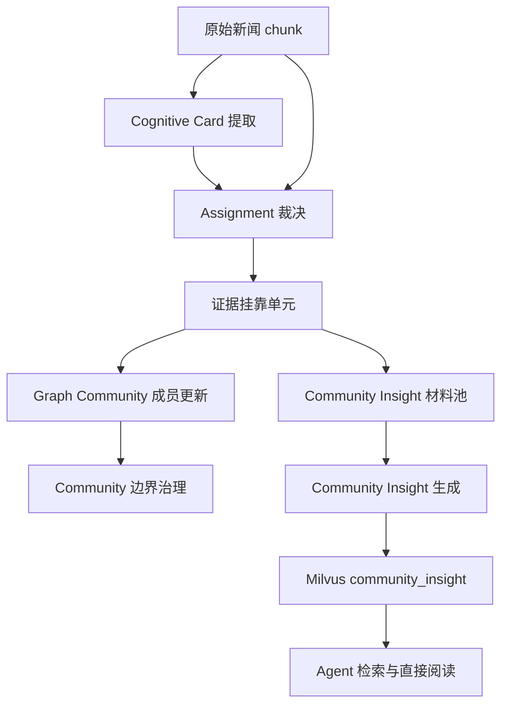
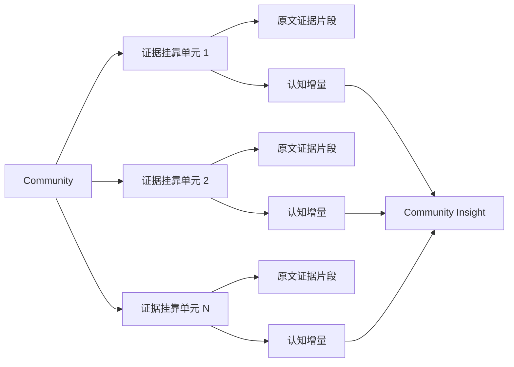

# Community Insight 高级认知索引设计方案

## 1. 本文定位

本文记录“如何正确生成高级认知索引”的目标设计。

当前知识图谱写入链路已经形成：


本文只讨论设计目标和系统边界，不记录 DDL、代码类名、命令或迁移步骤。对应实施侧细节见：

`docs/3. 实施方案/4. 知识图谱/20. Community Insight证据归属与高级认知索引实施方案.md`

## 2. 背景问题

`kg_graph_communities` 当前更像“主题目录”。它能把相似 cognitive cards 归到同一个 community，但生成的 summary 往往只是把来源、主题、影响对象和风险标签拼合起来。

这暴露出三个问题。

第一，Insight 阶段不应该再拆分 community。

如果一个 card 已经被合并进某个 community，后续 Insight 再把它拆成多个主线，本质是在补救上游归属错误。系统会变成“先合并、再拆分、再解释为什么拆分”，复杂度会持续增加。正确边界应该是：community 是最终聚合边界，Insight 不能重新分类或二次拆分。

第二，裁决阶段缺少原文证据。

当前 `kg_community_assignment` 基于 cognitive card 的结构化摘要裁决归属，输入里没有原始 chunk 文本，也没有支撑归属的原文片段。这样会导致两个风险：

- 如果 cognitive card 提取阶段已经失真，assignment 会基于失真信息继续裁决；
- assignment 即使做出正确归属，也无法说明“原文哪句话支撑这个归属”。

第三，多挂靠缺少关系语义。

一个新闻 chunk 可以挂靠到多个 community，这个规则本身合理，因为金融新闻天然可能同时涉及政策、行业、公司、价格、资金等多个方向。但当前问题是：只要挂靠进去，后续总结时就容易把整段内容都当成 community 正式材料。哪怕只是轻微沾边，也会污染 Insight 主体，形成割裂感。

## 3. 系统定位

Community Insight 是 community 的高级认知报告层，但它不负责修正 community 边界。

系统分层定位如下：

| 层级 | 职责 | 不负责 |
| --- | --- | --- |
| Evidence / Chunk | 保存原始事实和可追溯文本 | 判断主题归属 |
| Cognitive Card | 从单条证据中提取主题、驱动、影响、风险等认知元数据 | 最终决定 community 边界 |
| Community Assignment | 判断一个 card / intent 与 community 的归属关系，并指出支撑归属的原文证据 | 生成完整 Insight 报告 |
| Graph Community | 作为最终主题聚合边界，维护成员集合和主题 contract | 在 Insight 阶段被拆分 |
| Community Insight | 基于已裁决的证据挂靠单元，生成一个 community 的完整高级认知报告 | 重新分类、拆分、创建或合并 community |

目标系统不是“先按 community 聚合，再让 Insight 重新整理”，而是：

```text
在 assignment 阶段把每次挂靠的证据、理由和认知增量记录清楚；
在 Insight 阶段只聚合这些已经裁决过的证据挂靠单元。
```

## 4. 目标系统形态

目标形态如下：



关键变化是：assignment 阶段必须从“归属决策”升级为“归属决策 + 原文证据定位 + 认知增量说明”。

每一次挂靠都应该回答：

- 为什么这条 card 可以进入这个 community；
- 这个判断由原文中的哪段事实支撑；
- 这条事实对该 community 的认知增量是什么；
- 它是核心证据、关联背景，还是边界风险；
- 它是否需要影响 Insight 主体。

Insight 阶段不再拿整段新闻重新理解，而是消费这些已经被裁决过的证据挂靠单元。

## 5. 核心设计判断

### 5.1 community 是最终聚合边界

一个 community 一旦形成，就代表系统认可它是一个稳定主题容器。Insight 可以指出 community 边界存在风险，但不能在报告内部把它拆成多个独立主题。

如果 Insight 发现内容无法自然形成统一报告，正确处理方式不是二次拆分，而是把问题反馈给 assignment / merge 质量治理：

- 候选 community 的 scope 过宽；
- 多挂靠把弱相关内容当成核心证据；
- 父级合并过度；
- cognitive card 的主题提取失真；
- assignment 缺少原文证据导致误判。

### 5.2 原文证据必须进入 assignment 裁决

assignment 不能只看 cognitive card 的结构化摘要。结构化摘要是模型二次产物，可能已经有时间、实体、因果或主题失真。

目标状态下，assignment 输入需要同时包含：

- cognitive card 的主题意图；
- 候选 community 的 contract；
- 与该主题意图相关的有限原文证据上下文；
- 当前 community 候选账本。

这里不要求把完整 chunk 原文无限制塞进 prompt。更合理的是提供可审计的、受预算控制的原文证据上下文，让模型能够指出归属判断对应的原文片段。

### 5.3 多挂靠必须区分核心证据和关联引用

多挂靠仍然保留，但每个挂靠关系必须有语义角色。

核心证据表示：该 chunk 中的某个事实直接服务于 community 的主问题域，可以进入 Insight 主体。

关联引用表示：该 chunk 与 community 有背景、影响、上下游、市场情绪或相邻关系，但不应该作为 Insight 主体材料。

边界风险表示：该挂靠能够说明当前 community 可能过宽、过泛或被弱相关内容污染。它应进入质量治理，而不是强行进入报告主体。

这样可以保留多挂靠能力，同时避免“只要沾边就全量污染总结”。

### 5.4 Insight 是证据聚合，不是重新分类

Insight 的输入不应该是无差别的全文集合，而应该是 assignment 已经裁决过的证据挂靠单元。

Insight 要做的是：

- 聚合核心证据；
- 识别这些证据共同支持的判断；
- 解释驱动链条、影响对象、风险和反转条件；
- 对关联引用做有限背景说明；
- 对边界风险做质量提示。

Insight 不做：

- 新建 community；
- 拆分 community；
- 重新决定 card 属于哪里；
- 把低相关全文当成同等材料总结；
- 为了凑篇幅制造无证据判断。

### 5.5 高级认知报告应该可直接交付给 Agent

Community Insight 是抽象后的高级认知索引，Agent 命中后可以直接阅读和使用。

它不强制每句话回源到 chunk，但报告中的关键判断必须能追溯到证据挂靠单元。这样既保留高级抽象能力，又避免完全脱离证据。

## 6. 目标数据形态

目标数据形态不是“community + 一堆全文”，而是：



一个证据挂靠单元至少需要表达：

- 归属到哪个 community；
- 对应哪个 card / intent / chunk；
- 挂靠角色是核心证据、关联引用还是边界风险；
- 原文中支撑挂靠的证据片段；
- 从证据片段归纳出的 claim；
- 对 community 的认知增量；
- assignment 给出的归属理由、置信度和权重。

这个结构的目标不是增加复杂字段，而是把“为什么挂靠”和“依据是什么”固化下来，避免 Insight 阶段重新猜。

## 7. Insight 报告形态

Community Insight 只生成一份面向 Agent 的完整报告。

报告应该围绕 community 的同一问题域组织内容，而不是拆成多个独立主题。它可以有段落结构，但段落必须服务于同一个 community contract。

报告应该包含：

- 这个 community 当前可以被材料支持的核心判断；
- 核心证据之间如何互相强化；
- 主要驱动链条和传导路径；
- 对行业、公司、资产、风险的影响；
- 弱证据和关联引用应如何降权理解；
- 当前判断的边界和反转条件；
- 如果材料显示 community 边界可能被污染，应给出质量提示。

报告不要求固定字数。材料少就短，材料多且确实存在跨来源增量才展开。评价标准是信息密度和证据支撑，不是篇幅。

## 8. 应退出或调整的旧能力定位

### 8.1 Insight 阶段二次拆分应退出

如果一个 community 的材料在 Insight 阶段被拆成多个主线，说明上游聚合边界或多挂靠角色存在问题。Insight 不应该承担拆分职责。

### 8.2 整段全文无差别参与 Insight 应退出

Insight 不应直接把一个 community 下所有 chunk 全文作为同等材料输入。原文可以用于核验和证据摘取，但报告主体应基于证据挂靠单元。

### 8.3 `metrics` 不应继续承载报告内容

`kg_graph_communities.metrics` 已经承载了较多聚合字段，不应继续塞入高级认知报告。Insight 应独立存储和索引。

### 8.4 singleton community 不需要强制生成 Insight

单来源或单 card community 没有跨来源综合价值。Agent 直接看 card / chunk 更准确。

## 9. 系统收益

该设计带来的收益是：

- 降低 Insight 主题割裂感，因为输入已经是与 community 对齐的证据挂靠单元；
- 降低多挂靠污染，因为弱相关内容不会自动进入主体报告；
- 降低幻觉风险，因为 assignment 必须指出原文证据；
- 提升可审计性，因为每个 community 成员都能看到“为什么挂靠、依据是什么、贡献了什么认知增量”；
- 提升 Agent 使用价值，因为 Insight 不再只是主题目录摘要，而是有证据支撑的综合认知报告；
- 为上游质量治理提供信号，因为“不自然挂靠”和“边界风险”会被显式记录。

## 10. 验收口径

设计验收口径如下：

1. assignment 裁决输入能够访问受预算控制的原文证据上下文，而不是只看 cognitive card 摘要。
2. 每个挂靠关系都能说明原文证据片段、归属理由和认知增量。
3. 同一个 chunk 多挂靠到不同 community 时，不同 community 使用各自相关的证据片段，而不是共享整段全文。
4. Insight 主体只使用核心证据挂靠单元，关联引用不应等权影响报告结论。
5. Insight 不输出多个独立主线，不在报告内部二次拆分 community。
6. 当 community 边界过宽时，Insight 输出质量提示或触发治理信号，而不是自行拆分。
7. Agent 检索命中 Insight 后，可以直接获得一份有证据支撑的高级认知报告。

## 11. 关键待验证问题

仍需要通过实现和回放验证的问题：

- assignment 阶段引入原文证据后，prompt token 是否可控；
- 原文证据上下文应该由完整 chunk 截断、cognitive card supporting text、还是 Milvus 精准取回后的相关片段组成；
- 核心证据、关联引用、边界风险三类角色的判断是否足够稳定；
- 旧 assignment 数据缺少证据挂靠单元时，历史 community 的 Insight 如何过渡；
- Insight 报告是否能在不拆分 community 的前提下保持信息密度；
- 多挂靠场景下，弱相关内容是否能被稳定降权。

## 12. 和实施文档的关系

本文给出目标系统形态和边界结论。实施文档需要进一步说明：

- assignment 输入如何补充原文证据上下文；
- assignment 输出如何记录证据挂靠单元；
- Community Insight 生成如何消费证据挂靠单元；
- 现有 `knowledge_tasks.py` 如何承载异步刷新入口；
- PG 与 Milvus 如何分别保存结构化状态和可检索报告；
- 如何通过 Langfuse、回放脚本和数据库抽样验证质量。
