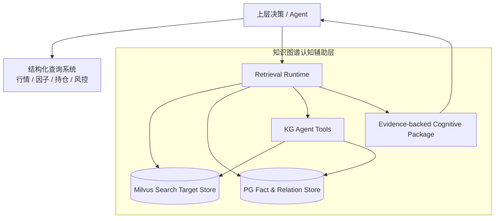
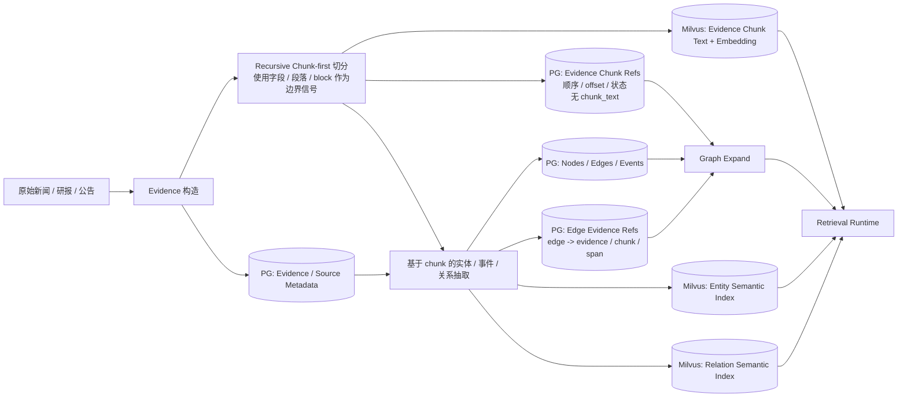
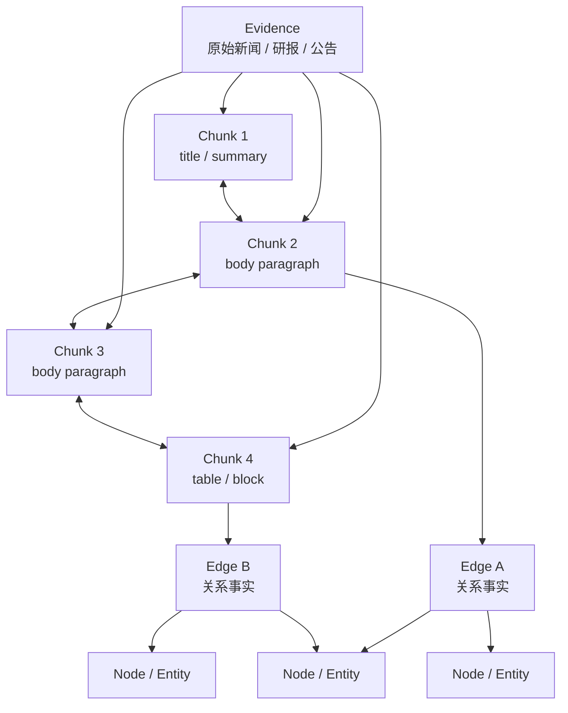
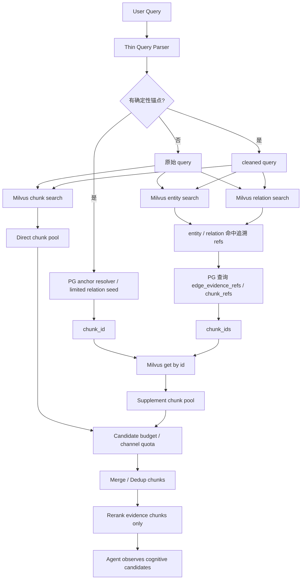
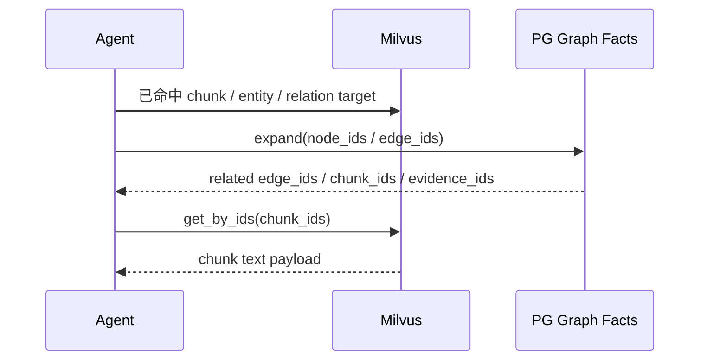

# Milvus语义检索与PG关系展开双层架构设计方案

## 1. 本文定位

本文是知识图谱认知检索架构的最终收敛设计。

它回答几个已经反复讨论但必须定死的问题：

- 第一阶段到底去哪里检索。
- PG 和 Milvus 分别负责什么。
- chunk text 到底存在哪里。
- 文本是否应该先 chunk 再抽取关系。
- chunk 如何指回原始 evidence，并如何支持上下文展开。
- PG 中 node / edge 允许通过哪些方式被命中。
- node / edge 命中后如何追溯到可读证据。
- entity / relation 命中后如何追溯到相关 chunk 文本。
- 什么内容可以进入 rerank 和 Agent，什么只能作为内部 handle。

本文是设计侧文档，只描述系统应该长什么样、为什么这样设计、最终交付形态是什么。对应实施方案见：

`docs/3. 实施方案/4. 知识图谱/10. Milvus语义检索与PG关系展开双层架构实施方案.md`

本文收敛并覆盖以下文档中关于检索存储边界的旧讨论：

- `9. 检索索引架构重构讨论.md`
- `10. 写入侧语义索引材料设计方案.md`
- `11. KG认知辅助层定位与证据优先检索重构讨论.md`

## 2. 背景问题 / 为什么要做

当前系统的问题不是“有没有向量检索”或“有没有图谱关系”，而是检索对象和事实对象混在一起。

过去的链路里，第一阶段经常召回大量 node / edge：

```text
A股并购重组市场呈现三方面新变化 mentions 半导体
A股并购重组市场呈现三方面新变化 mentions 生物医药
A股并购重组市场呈现三方面新变化 mentions 高端装备制造
```

这些关系有价值，但它们不是用户或上层决策系统真正要消费的内容。

上层真正需要的是：

```text
证据片段
事件解释
不确定性
可追溯来源
```

同时，如果 chunk text 在 PG 和 Milvus 两边都存一份，会带来维护复杂度；如果只存 PG，Milvus 召回后又要回表，热路径变慢；如果只存 Milvus 但 PG 完全不知道 chunk 的存在，关系展开后又找不到可读文本。

最终设计需要解决的是：

```text
PG 不存 chunk text，但要能通过关系找到 chunk。
Milvus 存可读 chunk text，并维护 chunk / entity / relation 三类语义检索入口。
关系必须从 chunk 级证据中产生，并能回到具体 chunk / span。
entity / relation 检索命中后必须追溯到 chunk，不能直接作为交付内容。
```

## 3. 系统定位 / 和更大系统的关系

知识图谱仍然是 AI 自动化交易系统中的认知辅助层。

它不负责结构化行情查询，也不负责最终交易决策。它负责把新闻、公告、研报、政策等弱结构化文本组织成可追溯市场认知。



系统边界：

- 结构化系统负责精确数值和交易数据。
- PG 负责知识图谱事实、关系和证据指针。
- Milvus 负责可读检索对象的语义召回和按 ID 取回。
- Agent 负责决定何时搜索、精读、展开、收窄或停止。
- 最终交付的是认知包，不是裸 node / edge。

## 4. 目标系统形态

最终架构是两层：

```text
PG = 图谱事实层 / 关系展开层 / chunk 拓扑层
Milvus = chunk / entity / relation 语义检索层 + chunk text 快速取回层
```



核心判断：

1. **Milvus 是第一阶段语义召回主入口，但不是单一路径。**
   第一阶段应同时从 chunk / entity / relation 三类语义入口各自召回一定数量的记录，再统一追溯成 chunk 后 rerank，避免先验规则过早过滤掉真正有价值的数据。

2. **Milvus 不只是向量相似搜索，也承担按 ID 精准取回。**
   关系展开拿到 `chunk_id` 后，直接从 Milvus 获取 chunk text。

3. **PG 不存 chunk text。**
   PG 只保存原始 evidence、图谱事实、关系和指针，不承担 chunk 文本热路径存储。

4. **PG 必须保存 chunk 映射和 edge 支撑关系。**
   否则 graph expand 找到关系后，无法知道该从 Milvus 取哪些 chunk。

5. **裸 node / edge 不进入 rerank 主链路。**
   entity / relation 命中后，必须通过 PG refs 追溯到 chunk；rerank 只排序 evidence chunk。

6. **文本必须先 chunk，再抽取关系。**
   chunk 是关系证据的最小落点。关系抽取可以使用标题、文档摘要和相邻 chunk 作为辅助上下文，但关系本身必须能绑定到具体 chunk 或 span。

### 4.1 目标数据形态

目标数据形态不是“原文、图谱、向量”三份互不相干的数据，而是围绕 evidence 形成一条可追溯链路。

chunk 本身就是“分段”的结果。段落、字段、table block 不是独立于 chunk 之外的核心数据层，而是 chunker 在切分时使用的边界信号和来源 metadata。

```text
source record
  -> evidence
  -> recursive evidence chunks
  -> node / edge / event facts
```

Recursive chunker 需要感知原文中的结构信号，例如：

```text
title
summary
body paragraph
table block
caption
source metadata
```

这样做的原因是：

- chunk offset 必须能追溯到原始 evidence 的具体字段或段落。
- 标题、摘要、正文、表格不能在切分时丢失来源边界。
- recursive chunk 不应该直接对无结构长字符串盲切，而应该利用字段、段落和 block 边界。
- 后续 edge 绑定 `chunk_id + span` 时，系统能解释这个 span 来自标题、正文段落还是表格块。



这条链路表达几个约束：

- chunk 必须指回原始 evidence。
- chunk 必须知道自己来自原始 evidence 的哪些字段、段落或 block。
- 同一 evidence 下的 chunk 必须有稳定顺序。
- 命中 chunk 后可以找到上文、下文和同篇 evidence 的其他 chunk。
- edge 必须知道自己由哪些 chunk / span 支撑。
- node / edge 只负责结构化组织，最终可读上下文来自 chunk。

因此，当检索命中 `chunk 3` 时，系统应该能稳定做两件事：

```text
chunk 3 -> same evidence -> chunk 2 / chunk 4（如果存在）
chunk 3 -> supporting / supported edges -> related nodes / relations
```

这使得“精读上下文”和“图谱展开”都建立在同一个 evidence 结构上。

## 5. 核心设计判断

### 5.1 第一阶段默认搜索 Milvus

第一阶段的主入口是 Milvus，应同时使用 chunk / entity / relation 三类语义入口。

三类入口各自召回固定预算内的候选，随后统一转换为 evidence chunk，再进行去重和 rerank：

| 入口 | 作用 | 命中后的处理 |
| --- | --- | --- |
| Chunk Search | 直接召回原文证据片段 | 直接形成 chunk 候选 |
| Entity Search | 召回具体对象、主体、行业、资产、政策 | 通过 PG 找相关 edge/evidence/chunk，再转换为 chunk 候选 |
| Relation Search | 召回抽象关系、影响、受益、提及、关联主题 | 通过 PG 找支撑 chunk，再转换为 chunk 候选 |

这样做的原因是：如果先只看 chunk search 的数量是否足够，可能会错过 entity / relation 入口才能发现的高价值证据。第一阶段应该尽量保证召回覆盖面，真正的相关性判断交给后续去重、预算控制和 rerank。

三类入口不是无限扩张，而是各自有召回预算，例如：

```text
chunk_search_limit
entity_search_limit
relation_search_limit
max_chunks_per_entity
max_chunks_per_relation
max_total_pre_rerank_chunks
```

entity / relation 入口命中的仍然不是最终候选。它们只是 recall handle，必须经 PG 追溯到支撑 chunk 后，才能进入 rerank。

如果 Query Parser 没有识别出确定性锚点，例如股票代码、source_id、evidence_id、完整标题或强实体别名，则不调用 PG 做广义搜索。

原因是没有锚点时，PG 搜 node / edge 只会召回大量字面相似或关系沾边的对象，噪声高于收益。



PG 只在这些情况下进入第一阶段：

- query 中存在明确代码、ticker、fund code。
- query 中存在 source_id、evidence_id、kg_id。
- query 中存在足够确定的标题、别名、强实体。
- Agent 明确要求 scoped exact search。

PG 不做无锚点的开放 node / edge keyword 搜索。无锚点场景下，entity / relation 语义入口由 Milvus 提供；PG 只负责把这些命中结果追溯到当前事实和支撑 chunk。

### 5.1.1 候选预算与补位召回

entity / relation / neighbor 召回不能被默认赋予过高权重。它们的职责是提供更多可能相关的 evidence chunk，而不是强制把整篇文章或大量关系上下文带回来。

第一阶段应分为两个候选池，但两类候选池可以同时产生：

| 候选池 | 来源 | 作用 |
| --- | --- | --- |
| Direct Pool | chunk semantic search 直接命中的 evidence chunk | 主相关性来源 |
| Supplement Pool | entity search、relation search、neighbor chunks、PG anchor 追溯出的 chunk | 补充召回来源 |

推荐策略：

```text
target_candidates = 30

1. 同时执行 chunk / entity / relation 三类 Milvus 召回，各自有 limit。
2. chunk search 命中直接进入 Direct Pool。
3. entity / relation 命中必须通过 PG refs 追溯成 chunk，进入 Supplement Pool。
4. neighbor chunks 只围绕已命中的高置信 chunk 少量补充。
5. Direct Pool 与 Supplement Pool 合并去重，按 channel quota 和 evidence 去重控制总量。
6. 最终 rerank 的对象仍然只有 chunk。
```

举例：

```text
目标候选数: 30
chunk search 召回: 30 -> 去重后 18 chunks
entity search 召回: 20 handles -> 追溯后 15 chunks
relation search 召回: 20 handles -> 追溯后 17 chunks

合并去重前: 50 chunks
合并去重后: 34 chunks
预算裁剪后: 30 chunks

最终 rerank: 30 evidence chunks
```

neighbor chunk 的先验权重应低于直接命中 chunk。相邻只说明上下文相关，不说明一定回答相关。

neighbor 补充也应受预算限制：

```text
只对 direct top K 取邻接 chunk
neighbor_window 默认 1
max_neighbor_candidates 有上限
```

关系和实体追溯同样要受预算限制：

```text
max_chunks_per_entity
max_chunks_per_relation
max_supplement_chunks
max_expand_depth 默认 1
```

核心原则：

```text
直接命中的 chunk 建立主候选；
entity / relation / neighbor 只补足缺口；
补充结果必须再次排序；
不因为上下文相邻或图谱相关就自动进入最终候选。
```

### 5.2 PG 中 node / edge 的合法命中方式

PG 仍然会命中 node / edge，但命中方式必须受控。

允许的命中入口只有四类：

| 入口 | 说明 | 示例 |
| --- | --- | --- |
| Strong Anchor Resolver | query 中有强标识或强实体，PG 精确解析到 node / evidence / source | `300750` -> 宁德时代 node；`ft_news:83904` -> evidence |
| Direct Lookup | Agent 或系统已经持有明确 ID，直接查详情 | `kg_edge:...`、`kg:financial:stock:...` |
| Scoped Exact Search | Agent 已经明确要求在某个范围内做精确查询 | 在已选事件下查 relation_type=`benefits_from` |
| Graph Expand Seed | Agent 从 Milvus hit 的 payload 中选中 node_ids / edge_ids 后展开 | 从 `半导体` node 展开相关政策、事件、证据 |

不允许的入口：

```text
无强锚点 query -> PG ILIKE node title
无强锚点 query -> PG 搜 edge readable title
无强锚点 query -> PG 全局 graph search
```

原因是这类开放检索会把 PG 重新变成第二套语义搜索引擎，召回大量裸 node / edge，和 Milvus 的职责重叠。

合法 PG 命中后的处理流程也必须统一：

```text
PG node / edge hit
  -> 读取 refs / relation evidence
  -> 得到 chunk_id
  -> Milvus get-by-id 取可读 chunk
  -> 进入 merge / rerank / Agent
```

也就是说，PG 可以命中 node / edge，但 node / edge 不能作为候选终点。

### 5.3 Milvus 保存三类语义入口

Milvus 里的对象不是裸 embedding，也不是只有 ID 的索引项。

它至少维护三类语义入口：

| Milvus 对象 | 作用 |
| --- | --- |
| Evidence Chunk | 原文最小证据单元，可直接进入 rerank / Agent |
| Entity Semantic Target | 实体、行业、主体、政策、资产等对象的语义入口，不作为最终交付内容 |
| Relation Semantic Target | 关系、影响、受益、提及、关联主题的语义入口，不作为最终交付内容 |

Evidence Chunk 必须带：

```text
chunk_id
text
source_id
evidence_id
chunk_index
start_offset / end_offset
published_at
status / version metadata
```

Entity / Relation Semantic Target 必须带足够的 refs，用于回到 PG 事实层：

```text
target_id
target_type = entity | relation
text
node_ids / edge_ids
evidence_ids
chunk_ids
status / version metadata
```

Milvus 必须支持两类访问：

```text
vector search(query_embedding)
get_by_ids(chunk_id / target_id)
```

但进入 rerank 的主对象不是裸 entity / relation target，而是：

```text
Evidence Chunk
必要的 neighbor chunks
```

持久化关系卡片、影响卡片等不作为默认索引对象。entity / relation target 只负责召回和追溯 chunk，不负责交付文本。

### 5.4 Chunk-first 是写入侧硬约束

关系抽取必须发生在 chunk 之后。

目标链路是：

```text
原始 source record
  -> evidence
  -> evidence chunks
  -> 基于 chunk 的 entity / event / relation extraction
  -> node / edge facts
  -> edge -> evidence / chunk / span refs
  -> Milvus chunk / entity / relation semantic targets
```

这样做的原因是：

- 关系必须能回到原文证据，而不是只停留在 LLM 生成的抽象结论。
- chunker 必须保留字段、段落和 block 来源信息，否则 chunk 边界无法解释来自哪个原文字段。
- 长文整篇抽取会把多个事实混在一起，导致 edge 很难定位具体依据。
- chunk 粒度能让 rerank 和 Agent 看见更少噪声、更明确的上下文。
- 后续 open / find / expand 都可以围绕 chunk 邻接关系工作。

允许抽取时使用辅助上下文：

```text
title
source metadata
document short summary
previous / next chunk
```

但最终关系证据仍必须落到：

```text
evidence_id + chunk_id + optional span
```

也就是说，辅助上下文可以帮助理解，不能替代证据落点。

### 5.4.1 第一版 chunk 策略只采用 Recursive

第一版不做多 chunker 并存，也不按 `news / report / announcement` 这类业务数据类型硬编码切分策略。

原因是数据类型不是稳定边界：

- 同样是新闻，可能只有一段快讯，也可能是长篇分析。
- 同样是公告，可能是短文本，也可能包含大量章节和表格。
- 后续数据源会新增，如果把策略绑定到 source_type，主流程会很快变成规则堆叠。

第一版统一采用 **Recursive chunk**：

```text
段落 -> 换行 -> 中文句末标点 -> 中文句内标点 -> 空格 -> 字符兜底
```

推荐分隔层级：

```text
"\n\n"
"\n"
"。"
"！"
"？"
"；"
"，"
" "
""
```

这吸收了 LightRAG `R` 策略中对中文文本友好的部分，同时保留 GraphRAG `TextUnit` 模型中“chunk 是后续图谱抽取和溯源中心”的判断。

第一版不默认采用 embedding semantic chunk，原因是：

| 方案 | 第一版判断 |
| --- | --- |
| 固定 token 切分 | 简单但容易切断中文财经语义，只作为兜底思想，不作为主策略 |
| Recursive chunk | 稳定、便宜、中文友好，适合当前新闻 / 公告 / 研报摘要等文本 |
| Semantic vector chunk | 需要入库前额外 embedding，切分结果受模型和阈值影响，不利于稳定 chunk_id 和关系溯源 |
| Section-aware / block-aware | 对长研报和表格有价值，但第一版先不引入，避免写入链路过早复杂化 |

第一版的目标不是把 chunk 切到“理论最优”，而是先把以下链路打通：

```text
recursive chunk
  -> chunk_id 稳定生成
  -> 基于 chunk 抽取关系
  -> edge 绑定 evidence_id + chunk_id + span
  -> 检索命中 node / edge 后能追溯回 chunk
  -> rerank 只看 chunk text
```

短文本不需要特殊策略。Recursive chunk 在文本短于目标阈值时自然返回 single chunk。

chunk 参数必须作为版本化配置保存：

```text
chunker_strategy = recursive
target_tokens
overlap_tokens
separators
chunker_version
options_snapshot
```

这些参数影响 chunk_id、edge 证据落点和 Milvus target，因此不能在同一批数据中隐式漂移。

### 5.5 PG 不存 chunk text，但保存指针和关系

PG 的职责是维护事实和关系，不维护检索热路径文本。

PG 保存：

- 原始 evidence / source metadata。
- node / edge / event / relation facts。
- evidence 到 chunk target 的映射。
- edge 到 evidence chunk target / span 的证据映射。
- chunk 顺序、上下文邻接和状态。

PG 不保存：

- 完整 chunk_text。
- 用于 rerank 的大段候选文本。

推荐的概念对象：

| PG 对象 | 作用 |
| --- | --- |
| `kg_evidence` | 原始 evidence 和来源信息，可用于完整原文 open / 审计 |
| `kg_nodes` | 实体、行业、概念、政策、事件等归一对象 |
| `kg_edges` | 图谱关系事实 |
| `kg_evidence_chunk_refs` | evidence -> Milvus chunk target 的 manifest，维护顺序、offset、邻接和状态，不含 chunk_text |
| `kg_edge_evidence_refs` | edge -> evidence / chunk / target / span 的证据指针，不含 chunk_text |

其中：

```text
kg_evidence_chunk_refs 解决“这篇 evidence 被切成哪些 Milvus chunk”。
kg_edge_evidence_refs 解决“这条 edge 由哪些 Milvus chunk 支撑”。
```

chunk manifest 的核心价值不是保存文本，而是保存拓扑：

```text
evidence_id -> chunk_id 列表
chunk_id -> chunk_index
chunk_id -> previous / next chunk
chunk_id -> start_offset / end_offset
chunk_id -> status / version
```

因此命中某个 chunk 后，上下文展开不需要向量库重新搜索：

```text
chunk 3
  -> PG manifest 找 chunk 2 / chunk 4（如果存在）
  -> Milvus get-by-id 取 chunk 2 / chunk 4 的文本
```

### 5.6 关系展开通过 PG 找 ID，通过 Milvus 拿文本

展开不是从 chunk 文本里猜关系。

展开流程是：



也就是说：

```text
Milvus 命中对象 -> 拿锚点 ID
锚点 ID -> PG 查关系
PG 关系 -> 找 chunk_id
chunk_id -> Milvus 精准取文本
```

PG 只告诉系统“哪些对象相关”，Milvus 返回“这些对象的可读内容”。

chunk 命中后的反向展开也必须支持：

```text
Milvus search 命中 chunk
  -> PG 通过 chunk_id 查 supporting / supported edge
  -> PG 查 edge 两端 node
  -> Milvus get-by-id 取相关 chunk
```

也就是说，chunk 和 edge 必须双向可导航：

```text
edge -> chunk -> text
chunk -> edge -> node / relation
```

### 5.7 node / edge 是 handle，不是交付物

node / edge 的定位：

| 对象 | 正确职责 |
| --- | --- |
| node | 实体归一、graph expand seed、跨文档聚合锚点 |
| edge | 关系事实、影响路径、证据组织线索 |
| chunk | rerank 真正排序的候选 |
| cognitive package | 对上层系统交付的结果 |

PG 命中 edge 后，不能直接把这条 edge 喂给 rerank。

必须先转换：

```text
edge -> kg_edge_evidence_refs -> chunk_id -> Milvus get text -> readable candidate
```

如果多条 edge 来自同一 evidence、同一 event、同一 relation type，它们只用于帮助系统找到支撑 chunk，不能作为多条候选平铺进入 rerank。Agent 需要解释 top chunk 的关系时，再按需查询 PG edge 列表。

## 6. 新能力带来的系统收益

### 6.1 检索热路径更简单

普通语义 query：

```text
query
  -> chunk / entity / relation 并行召回
  -> entity / relation 追溯为 chunk
  -> merge / dedup / budget
  -> rerank chunks
  -> Agent
```

不再每次都经历：

```text
Milvus hit -> PG 回表拿 chunk text -> rerank
```

### 6.2 关系展开仍然可用

PG 保留完整关系事实和证据指针，因此 Agent 仍然可以：

- 从一个事件展开到主体。
- 从一个主体展开到相关新闻。
- 从一个行业展开到政策和资产影响。
- 从一条边追溯到支撑 chunk。

只是展开后的可读文本由 Milvus 按 ID 返回。

### 6.3 数据职责更清楚

```text
PG:
  事实、关系、原文、指针、审计

Milvus:
  chunk / entity / relation 语义检索、chunk text、按 ID 快速取回

Reranker:
  只对 evidence chunk 排序

Agent:
  决定下一步搜索、展开、精读或停止
```

### 6.4 避免为了差异而伪造差异

同一 evidence 下的多条 mentions edge 不再强行生成不同“证据摘要”，也不作为多条候选进入 rerank。

系统应该承认它们属于同一证据结构。关系只用于追溯和解释 chunk：

```text
证据: ft_news:83904
关系类型: mentions
涉及对象:
  - 半导体
  - 生物医药
  - 高端装备制造
```

这些对象可以在 Agent 精读 top chunk 后通过 PG 查询展示，但不是 rerank 输入。

## 7. 应退出或调整的旧能力定位

以下能力应退出核心链路：

- PG 无锚点开放 node / edge keyword search。
- 裸 node / edge 直接进入 rerank。
- 检索后强制全部回 PG materialize 才能排序。
- `kg_retrieval_*` 作为第二套 PG 检索层。
- Wiki / retrieval document 作为核心检索入口。
- 同源 edge 平铺候选。

仍然保留的能力：

- PG exact resolver。
- PG graph expand。
- PG evidence/source open。
- Milvus semantic search。
- Milvus get by ID。
- Milvus entity / relation semantic search。
- Reranker。
- Agent 工具调度。

## 8. 验收口径

重构完成后，应满足：

1. 无确定性锚点 query 默认同时走 Milvus chunk / entity / relation 三类语义入口，各自受召回预算限制。
2. 有确定性锚点 query 只用 PG 做 resolver / limited seed，不做开放 node / edge 泛搜。
3. Milvus chunk hit 可直接进入 rerank；entity / relation hit 必须经 PG refs 追溯到 chunk 后再进入 rerank。
4. PG 中不存在完整 chunk_text。
5. PG 中存在 evidence -> chunk target、edge -> chunk target 的稳定指针。
6. Agent expand 后能通过 PG 找到相关 chunk_id，再从 Milvus 取回可读文本。
7. Rerank 输入只包含 Evidence Chunk 和必要 neighbor chunks。
8. neighbor / entity / relation 追溯结果只作为补充候选，不能无预算地自动进入最终候选。
9. 同一 evidence 下的同类关系不进入排序，只用于追溯 chunk 和解释 top chunk。
10. 最终输出能区分原文事实、图谱关系、推断影响和待验证项。
11. 新入库文本先用 recursive chunk 生成 evidence chunk，再基于 chunk 抽取关系；edge 必须能追溯到 evidence_id + chunk_id。
12. 命中任意 chunk 后，系统能找到同一 evidence 的上文和下文 chunk，但邻接 chunk 是否进入候选必须经过预算和排序。
13. 第一版不默认启用 semantic vector chunk、section-aware chunk 或 block-aware chunk；这些只能作为后续增强能力评估。

## 9. 关键待验证问题

1. `kg_edge_evidence_refs` 是否只存 offsets 和 chunk_id，还是保留极短 evidence_span 方便调试。
2. Milvus get-by-id 的批量性能是否足够支撑 graph expand 和 chunk neighbor open。
3. 一条 edge 有多篇 evidence / 多个 chunk 支撑时，如何选择代表 chunk 进入首轮候选。
4. entity / relation semantic target 命中后，追溯出的 chunk 数量如何设定预算。
5. direct pool 和 supplement pool 的 quota 如何设定，是否需要保留 direct minimum quota。
6. neighbor chunk 的默认窗口和最大候选数如何设定，避免长文被整篇召回。
7. recursive chunk 粒度是否能同时满足语义召回、关系抽取和原文上下文展开。
8. 当 Milvus target stale 但 PG 指针仍存在时，如何触发索引修复。
9. 关系抽取需要多少相邻 chunk 辅助上下文，才能在不污染证据落点的前提下保持理解质量。
10. entity / relation semantic target 的文本构造如何保持可检索性，同时避免变成过期事实摘要。

## 10. 和实施文档的关系

实施文档需要承接本文最终结论，重点回答：

- 写入侧如何生成 chunk target、entity semantic target 和 relation semantic target。
- 写入侧如何用 recursive chunk 保证先 chunk 再抽取关系。
- PG 如何保存不含文本的 refs。
- PG 如何保存 chunk 顺序、邻接、offset、状态和 edge 支撑 chunk。
- Milvus collection 如何支持 chunk / entity / relation 三类语义召回和 get-by-id。
- 检索运行时如何决定是否调用 PG。
- graph expand 如何从 PG refs 转换到 Milvus target payload。
- entity / relation 命中后如何统一追溯为 chunk，并确保 rerank 不接收裸关系。
- direct pool / supplement pool 的候选预算、补位和去重策略如何落地。
- 命中 chunk 后如何打开上文 / 下文，并如何反向找到支撑或相关关系。
- 如何验证旧 node / edge-first 链路已经退出核心路径。

对应实施文档：

`docs/3. 实施方案/4. 知识图谱/10. Milvus语义检索与PG关系展开双层架构实施方案.md`
