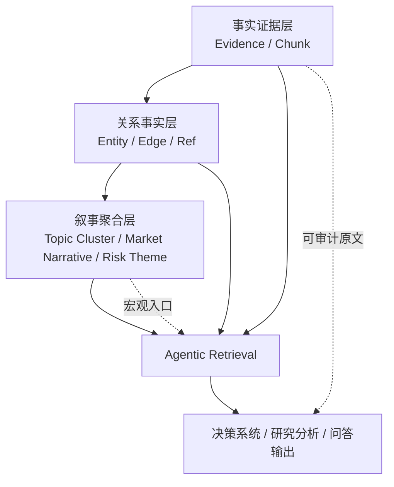
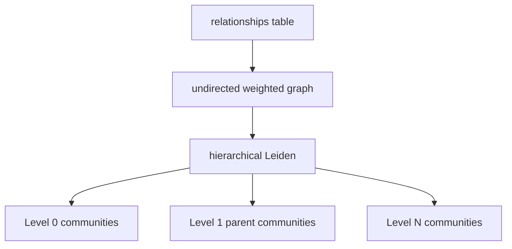
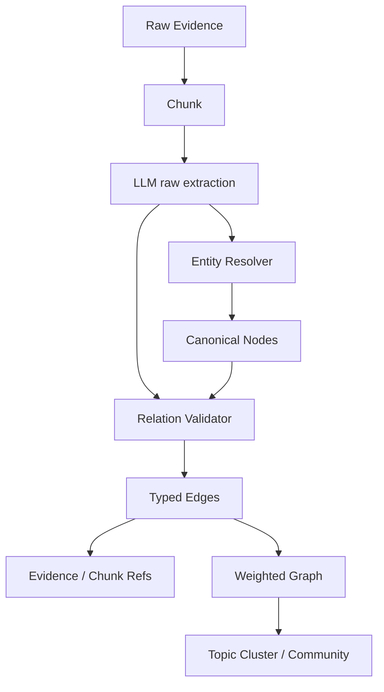
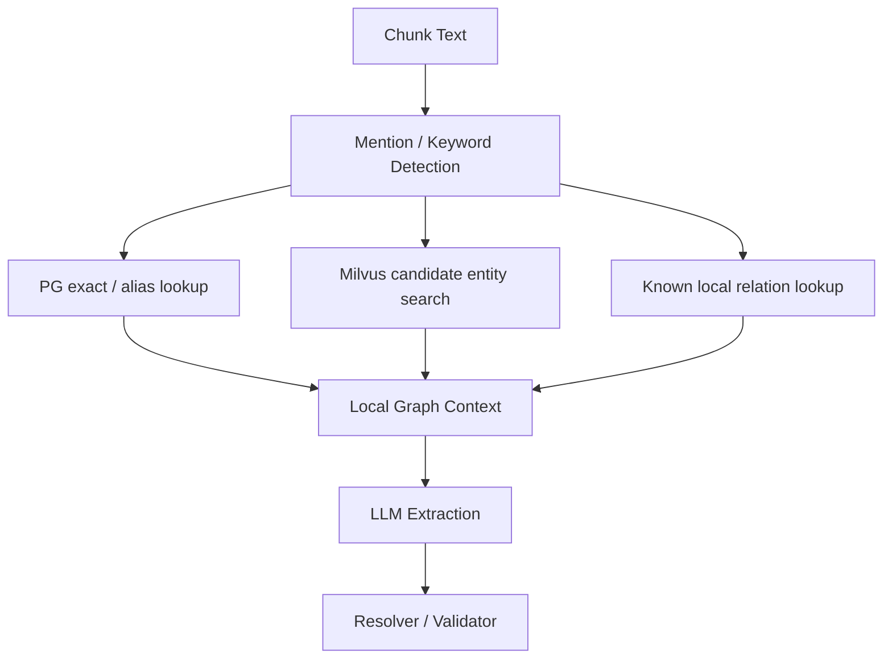
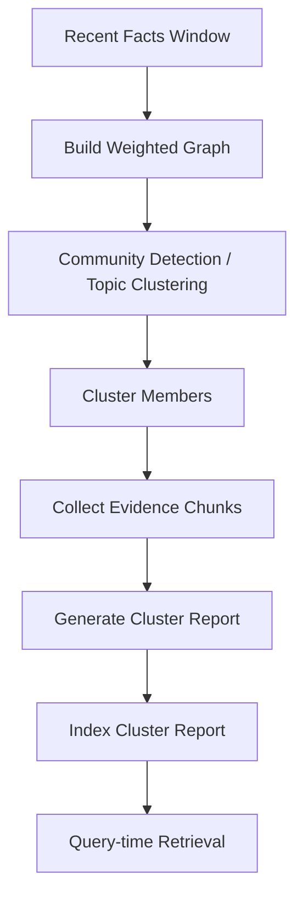
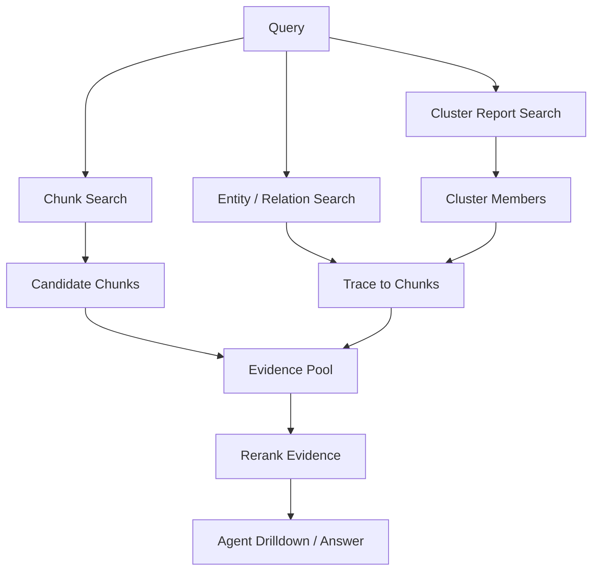
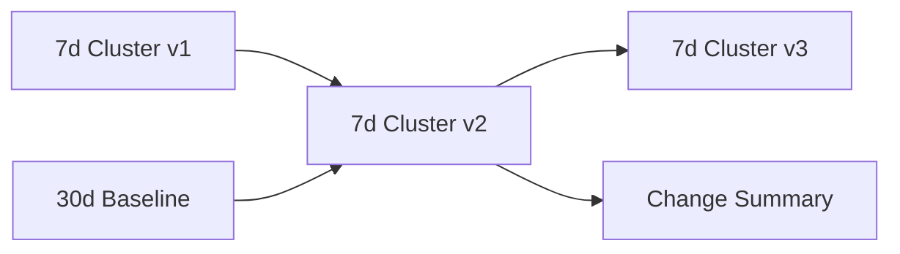
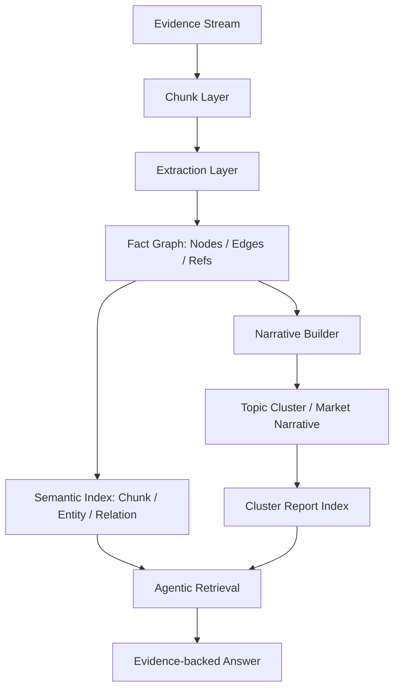

# Community Report 与市场叙事图谱设计方案

## 1. 本文定位

本文讨论知识图谱认知辅助层是否需要引入 `community report` 类能力，以及如果要做，应该如何构建关系图、如何形成主题社区、如何生成市场叙事报告、如何更新，以及它和事实层、检索层、Agent 层之间的边界。

本文是设计侧方案，不讨论具体表结构、类名、接口字段和代码实现。

## 2. 背景问题

我们之前的检索重构重点是：

```text
原始 evidence
  -> chunk
  -> entity / relation extraction
  -> PG facts + Milvus semantic index
  -> evidence chunk rerank
  -> Agent 精读 / 展开 / 停止
```

这条链路适合回答局部证据问题：

```text
这条新闻涉及哪些主体、行业或资产影响？
300750 最近有哪些海外产能相关负面事件？
某个事件影响了哪些资产？
```

但系统还会有大量宏观整理类问题：

```text
最近市场对 AI 算力链的主要叙事是什么？
过去一周新能源板块风险事件集中在哪些方向？
A 股并购重组市场的结构性变化有哪些？
```

这类问题不是简单找某一条新闻，也不是找某一条关系，而是要求系统跨多篇 evidence、多个实体、多个事件和多个行业做聚合理解。

如果只依赖 chunk search，会出现几个问题：

- 召回结果是局部片段，缺少整体结构。
- 多篇新闻之间的共同主题需要临时由 Agent 拼装，成本高且不稳定。
- 趋势、风险聚集、叙事变化需要跨时间窗口对比，单条 chunk 无法表达。
- 关系图明明已经沉淀了实体和边，但没有被用来生成高层认知结构。

因此，我们需要引入类似 GraphRAG `community report` 的能力，但要按金融认知辅助层的需求裁剪。

## 3. 核心结论

我们应该做 `community / report` 类能力，但不应照搬为“全库大总结”，也不应把它放进实时写入主链路。

正确定位是：

```text
community / cluster / narrative report
  = 基于事实图谱和证据 chunk 派生出的异步认知索引
```

它不是事实层，不替代原始 evidence，不直接作为最终事实依据。它的价值是给宏观查询提供结构化入口：

- 市场叙事。
- 风险主题。
- 事件簇。
- 产业链影响链。
- 时间窗口内的结构性变化。
- 从全局主题回溯到具体 evidence chunk。

我们不建议直接叫 `community report` 作为业务概念。更贴近金融场景的命名是：

```text
topic_cluster
event_cluster
risk_theme
market_narrative
cluster_report
```

其中 `community report` 可以作为内部技术模式，而不是用户可见概念。

## 4. 系统定位

加入这层能力后，知识图谱认知辅助层应形成三层结构：



职责划分：

| 层级 | 职责 | 是否事实层 | 更新方式 |
|---|---|---:|---|
| Evidence / Chunk | 保存可读证据和原文片段 | 是 | 实时增量 |
| Entity / Edge | 保存标准化实体和关系事实 | 是 | 实时增量 + 局部合并 |
| Topic Cluster / Narrative | 汇聚主题、风险、事件脉络 | 否，派生认知层 | 异步周期构建 |
| Agent Retrieval | 根据问题选择搜索、展开、精读、停止 | 否，消费层 | 查询时运行 |

核心原则：

```text
事实层必须稳定、可追溯、可审计。
叙事层可以总结和聚合，但必须保留 member evidence / chunk refs。
```

## 5. GraphRAG 的 Community Report 机制

GraphRAG 的 `community report` 不是全库一份总总结，而是基于图社区发现生成的一组局部报告。

本节凡涉及 GraphRAG prompt 的描述，都应回到以下本地源码位置核对：

| GraphRAG 能力 | Prompt 文件位置 | 主要应用位置 |
|---|---|---|
| 实体与关系抽取 | `packages/references/graphrag/packages/graphrag/graphrag/prompts/index/extract_graph.py` | `packages/references/graphrag/packages/graphrag/graphrag/index/workflows/extract_graph.py` |
| 实体/关系描述摘要 | `packages/references/graphrag/packages/graphrag/graphrag/prompts/index/summarize_descriptions.py` | `packages/references/graphrag/packages/graphrag/graphrag/index/workflows/extract_graph.py`、`packages/references/graphrag/packages/graphrag/graphrag/index/workflows/update_entities_relationships.py` |
| Community Report 生成 | `packages/references/graphrag/packages/graphrag/graphrag/prompts/index/community_report.py` | `packages/references/graphrag/packages/graphrag/graphrag/index/workflows/create_community_reports.py` |
| Fast 模式下的 TextUnit Report 生成 | `packages/references/graphrag/packages/graphrag/graphrag/prompts/index/community_report_text_units.py` | `packages/references/graphrag/packages/graphrag/graphrag/index/workflows/create_community_reports_text.py` |

### 5.1 GraphRAG 如何得到关系图

GraphRAG 的图不是直接由 community 算法从原文推出来的，而是先经过 LLM 关系抽取。

对应的原始 prompt 和应用位置见上表中的“实体与关系抽取”。


```text
Document
  -> TextUnit / Chunk
  -> LLM extract entities
  -> LLM extract related entity pairs
  -> relationships(source, target, description, weight, text_unit_ids)
```

Prompt 会要求模型：

```text
1. 识别实体。
2. 在识别出的实体之间找 clearly related 的实体对。
3. 输出 relationship_description 和 relationship_strength。
```

例如：

```text
科创板八条 -- 半导体
半导体 -- 光模块
光模块 -- 数据中心
券商 -- 并购重组
并购重组 -- 横向整合
```

这些边来自关系抽取结果，不是 community 算法自动从文本里发现的。

### 5.2 GraphRAG 如何区分 community

GraphRAG 会把 relationships 表转成无向加权图：

```text
nodes = entities
edges = relationships
edge weight = relationship_strength / merged weight
```

然后调用 `hierarchical_leiden` 做图社区发现。



Leiden 是纯图算法，不是 LLM。GraphRAG 实现依赖 `graspologic-native`。

它根据节点连接密度和边权重，把连接更紧密的一组实体分到同一个 community。

### 5.3 GraphRAG 如何判断知识属于哪个 community

GraphRAG 真正聚类的是实体。关系和文本的归属是通过引用链得到的：

```text
entity 被分配到 community
relationship 如果 source 和 target 在同一个 community
  -> 作为该 community 的内部关系
relationship.text_unit_ids
  -> 聚合出该 community 相关 TextUnit
```

所以它不是直接判断“这篇文档属于哪个 community”，而是：

```text
chunk 抽出了哪些关系
关系连接了哪些实体
实体在图聚类里属于哪个 community
chunk 通过关系的 text_unit_ids 被 community 引用
```

### 5.4 一个知识是否可以属于多个 community

可以，但方式不是随意多标签。

主要有三种情况：

1. 层级社区：同一个实体可以在不同层级属于细粒度、中粒度、粗粒度 community。
2. TextUnit 多归属：一个 chunk 抽出多条关系，这些关系可能分别进入不同 community。
3. 跨社区关系：source 和 target 分属不同 community 时，这条边通常不作为某个 community 的内部关系，但它可以作为桥接信息保留。

### 5.5 GraphRAG 的更新机制局限

GraphRAG 的增量不是每次全量重建，也不是严格动态图维护。

它大致是：

```text
新文档 diff
  -> 只处理新增文档
  -> 抽取 delta entities / relationships
  -> 生成 delta communities / reports
  -> old outputs + delta outputs 合并
```

这降低了成本，但有局限：

- 新旧数据之间如果形成新的强关系，旧 community 不一定被重新全局优化。
- delta community 更像追加合并，不等于全局最优社区。
- 社区报告可能存在时间滞后和结构漂移。

这说明我们不应把 community report 设计成实时强一致结构。

### 5.6 GraphRAG 做得好的地方

GraphRAG 最值得借鉴的不是“用了图谱”，而是它把文本证据、关系图、社区摘要和检索上下文组织成了一条可复用的数据加工链路。

它的优势主要体现在以下几个方面：

1. 先 chunk，再抽关系。

   ```text
   Document -> TextUnit / Chunk -> entity / relationship extraction
   ```

   这让实体和关系天然携带 `text_unit_ids`，后续可以追溯到原文片段。这个顺序比“整篇文章抽关系后再补证据”更可靠。

2. 图谱是检索导航结构，不是原文替代品。

   GraphRAG 使用 entity / relationship / community 帮助定位上下文，但最终仍要回到 `TextUnit`。这说明图谱的价值是组织和导航知识，而不是替代证据本身。

3. 它补足了普通 chunk RAG 的全局理解短板。

   普通 RAG 擅长找局部片段，但不擅长回答“整个语料里有哪些主题”“多个事件之间有什么结构”“某个领域的主要风险和影响路径是什么”。GraphRAG 通过 `relationships -> communities -> community reports` 提供了宏观认知入口。

4. Community Report 是高层认知索引。

   GraphRAG 不是全库一个大 summary，而是对不同 community 分别生成报告。查询宏观问题时，可以先命中高层报告，再展开到底层实体、关系和证据。

5. 多模式检索路径清晰。

   ```text
   Basic Search: 直接搜 TextUnit
   Local Search: 搜实体，再展开关系和文本
   Global Search: 使用 community reports 做全局回答
   DRIFT Search: 用全局 report 引导局部搜索
   ```

   这说明不同问题需要不同检索路径，不能用一种 RAG 逻辑覆盖所有问题。

6. 上下文预算控制比较系统。

   GraphRAG 会对 entity、relationship、claim、community report 做排序和 token 截断。大 community 过大时，它会使用子 community report 替代部分底层上下文，以避免无限塞入实体和关系。

7. 数据产物层次清晰。

   ```text
   documents
   text_units
   entities
   relationships
   communities
   community_reports
   embeddings
   ```

   每一层都有明确用途，工程边界清楚。

8. 关系抽取和宏观总结分层。

   关系抽取负责生成底层事实图，Community Report 负责生成高层总结。这个分层可以避免把事实抽取和摘要生成混在一起。

但这些优势不代表可以照搬 GraphRAG。它的实体归一较弱，关系合并主要依赖 title/source/target 文本；community report 的 finding 主要引用 entity / relationship，而不是直接绑定 chunk；增量 community 也不是严格全局最优。

我们应该吸收的是它的架构纪律：

```text
chunk-first
relation-grounded
graph as navigation
community as macro cognition
report must be evidence traceable
multi-mode retrieval
```

落到我们的系统里，就是：用 GraphRAG 的思想构建宏观认知层，但用金融 KG 的 canonical entity、typed relation、chunk refs、rerank 和 Agent 精读机制来补齐它在金融场景下不够严格的部分。

## 6. 我们应该构建什么图

我们的图不应该直接使用 LLM 原始字符串作为实体和关系端点，而应该使用 canonical id。

目标图结构应该是：

```text
node = canonical entity / event / industry / policy / asset / concept
edge = typed financial relation
edge evidence = chunk_id / evidence_id / source_id / time
edge weight = confidence + evidence_count + recency + source_quality + relation_strength
```



关键点：

- LLM 负责发现候选实体、候选关系、候选解释。
- Resolver 负责把“科创板八条 / 科创板八项措施”归一到同一个 node。
- Validator 负责检查关系类型、端点类型、证据跨度。
- Graph builder 只消费标准化后的 node_id / edge_id / chunk_id。

不能让 GraphRAG 式 `source + target title` 直接成为我们的最终关系键。

## 7. 关系抽取如何引入现有图谱上下文

为了降低跨批次抽取漂移，关系抽取时应给 LLM 一个局部图谱上下文包。

但不能把全量已有关系塞给模型。应该只给和当前 chunk 相关的 topK 候选。



局部上下文应包含：

- allowed entity types。
- allowed relation types。
- endpoint constraints。
- candidate entities。
- aliases。
- known local relations。
- recent similar facts。

LLM 可以建议：

- 复用已有实体。
- 复用已有关系。
- 新增实体。
- 新增关系实例。
- 提出 relation type 不足的建议。

但最终落库必须由系统决定。

边界：

```text
relation instance 可以新增。
relation type 不能由 LLM 自动扩展。
LLM 的 reuse_node_id 只是建议，不是最终事实。
```

## 8. Community / Cluster 的构建方式

### 8.1 不做全库大总结

我们不应该维护一份“全库知识总结”。这会带来：

- summary 巨大。
- 每次更新成本高。
- 难以定位证据。
- 旧知识和新知识容易混杂。
- 对时间敏感问题不友好。

正确方式是多粒度、多时间窗口的 cluster/report：

```text
24h risk_theme
7d market_narrative
30d industry_topic_cluster
90d structural_theme
long-term baseline narrative
```

### 8.2 不按文件维护，而按图结构和时间窗口维护

只按文件维护 report 会导致知识割裂：

```text
文件 A 的总结
文件 B 的总结
文件 C 的总结
```

这无法回答“过去一周新能源风险集中在哪些方向”。

应该按时间窗口 + 图结构聚合：

```text
time window
  -> related nodes / edges / chunks
  -> graph clustering
  -> cluster report
```

### 8.3 推荐构建流程



如果后续要参考 GraphRAG 的报告生成 prompt，应参考上文 5 节中的 `community_report.py` 和 `community_report_text_units.py`，并明确它们在 GraphRAG 中分别用于标准 community report 和 fast/text-unit report，不应混用为我们的最终业务 prompt。

其中 `Recent Facts Window` 可以是：

- 最近 24 小时。
- 最近 7 天。
- 最近 30 天。
- 指定行业 / 主题 / 资产范围。
- 指定 source quality 过滤后的事实集合。

## 9. Cluster Report 应该拥有什么能力

Cluster Report 不是简单摘要。它应该服务宏观认知查询，因此至少应具备以下能力：

| 能力 | 说明 |
|---|---|
| 主题概括 | 这个 cluster 主要在讲什么 |
| 关键实体 | 哪些公司、行业、政策、地区、资产是核心节点 |
| 主要关系 | 哪些影响、受益、风险、归属、供应链关系构成主题 |
| 时间范围 | 这个叙事在什么时间窗口内成立 |
| 叙事方向 | 风险、利好、分歧、政策驱动、业绩驱动等 |
| 影响对象 | 涉及哪些行业、资产、股票、商品、区域 |
| 证据回溯 | 能回到 member evidence_ids / chunk_ids |
| 变化检测 | 和上一个窗口相比增强、减弱、新增或消失 |
| 置信与覆盖 | 由多少证据、多少来源、多少关系支持 |

典型输出不是：

```text
AI 算力链最近很重要。
```

而应该是：

```text
AI 算力链叙事在最近 7 天主要集中于光模块景气、海外资本开支、算力硬件估值扩张。
核心实体包括中际旭创、光模块、半导体、数据中心、AI 算力。
主要影响路径是资本开支增加 -> 数据中心扩建 -> 光模块和算力硬件需求增强。
该叙事由 12 条 evidence、23 个 chunk、18 条关系支持。
```

## 10. 查询时如何使用 Cluster Report

Cluster Report 应作为高层检索入口之一，而不是替代 chunk 检索。



对于宏观问题：

```text
最近市场对 AI 算力链的主要叙事是什么？
```

检索顺序可以是：

```text
1. 搜 cluster_report，找到 AI 算力链相关叙事。
2. 展开 cluster members，得到支撑 evidence chunk。
3. 搜 chunk/entity/relation 补充未进入 cluster 的新证据。
4. rerank evidence。
5. Agent 生成回答，并引用关键证据。
```

对于局部问题：

```text
这条新闻涉及哪些主体、行业或资产影响？
```

Cluster Report 不是必要入口，可以只作为背景补充。

## 11. 更新策略

### 11.1 事实层实时增量

事实层必须实时增量：

```text
new evidence
  -> chunk
  -> extract entities / relations
  -> resolver / validator
  -> write nodes / edges / refs
  -> upsert chunk / entity / relation semantic index
```

这部分不应该等待 community 重建。

### 11.2 叙事层异步周期构建

Cluster / Narrative / Report 应该异步构建：

```text
每小时：最近 24h cluster
每天：最近 7d / 30d cluster
按需：指定主题 / 指定行业 / 指定资产 cluster
低频：长期 baseline narrative
```

不能每来一条新闻就重算全图 community。

### 11.3 如何避免知识不连贯

如果只做窗口 report，会担心事件脉络断裂。解决方式不是全量扫库，而是维护 cluster lineage。



每次生成新窗口 report 时，可以和上一窗口或长期 baseline 做对比：

- member overlap。
- entity overlap。
- relation overlap。
- semantic centroid similarity。
- 主导关系变化。
- 新增/消失 evidence。

这样可以回答：

```text
这个叙事是新出现的，还是已有叙事增强？
风险方向是否变化？
核心资产是否发生迁移？
```

## 12. 是否需要全量重建

不需要每次全量重建，但需要周期性基线重建。

建议策略：

| 对象 | 更新策略 |
|---|---|
| chunk | 实时新增 / upsert |
| node / edge | 实时增量 + 局部合并 |
| relation summary | 受影响对象局部刷新 |
| 24h cluster | 高频周期重建 |
| 7d / 30d cluster | 中频周期重建 |
| long-term baseline | 低频全量或分区重建 |
| cluster report | 跟随 cluster version 生成 |

长期基线可以按行业、主题、资产分区，而不是全库一锅粥。

```text
AI 算力链 baseline
新能源 baseline
并购重组 baseline
半导体政策 baseline
```

这样既能保留长期脉络，又不会每次扫全库。

## 13. 关系图质量要求

Community / Cluster 的质量高度依赖底层关系图。如果关系抽取不稳定，community 会被污染。

因此构建这层之前，必须先满足几个条件：

1. chunk-first 抽取。
2. 关系绑定 chunk_id / evidence_id。
3. 实体端点使用 canonical node_id。
4. 关系类型受控。
5. 关系置信度和证据跨度可校验。
6. 跨批次实体别名能归一。
7. 边权重不是固定值，而是由证据数量、置信度、来源质量、时间衰减等计算。

否则图聚类只是在脏图上做漂亮的分桶。

## 14. 不应该做的事情

明确不做：

- 不做全库单一大 summary。
- 不让 LLM 直接判断 community 归属。
- 不让 LLM 自动扩展 relation type。
- 不让 cluster report 替代 evidence。
- 不把 community 构建放进实时写入主链路。
- 不让裸 node/edge/report 直接成为最终事实答案。
- 不按文件孤立生成报告后就认为完成宏观理解。

## 15. 目标系统形态

最终系统应具备两种互补检索能力。

第一种是证据优先检索：

```text
适合回答：这条新闻说了什么、影响谁、证据在哪。
```

第二种是叙事优先检索：

```text
适合回答：最近市场在讲什么、风险集中在哪里、结构性变化是什么。
```

整体形态：



## 16. 验收口径

这层能力做成后，应该能稳定回答：

```text
最近市场对 AI 算力链的主要叙事是什么？
过去一周新能源板块风险事件集中在哪些方向？
A 股并购重组市场的结构性变化有哪些？
这个风险主题最近是增强还是减弱？
这个市场叙事由哪些新闻和关系支撑？
```

验收时不能只看回答是否流畅，还要看：

- 是否能列出支撑 evidence。
- 是否能回到 chunk。
- 是否能说明主要实体和关系。
- 是否能区分短期叙事和长期基线。
- 是否能说明叙事变化。
- 是否避免把单条新闻误判成市场共识。

## 17. 关键待验证问题

后续实施前需要验证：

1. 金融新闻流中，Leiden / HDBSCAN / embedding clustering 哪种更适合 topic cluster。
2. 边权重如何设计才能避免高频泛化实体污染聚类。
3. 时间窗口如何设置，才能兼顾新鲜度和稳定性。
4. Cluster report 的粒度如何控制，避免过细或过粗。
5. 旧 cluster 与新 cluster 的 lineage 如何匹配。
6. Agent 查询时如何决定是否优先使用 cluster report。
7. Cluster report 如何和 evidence rerank 结合，避免摘要脱离原文。

## 18. 最终判断

我们需要做类似 GraphRAG `community report` 的能力，因为金融认知辅助层有大量宏观整理、风险主题、市场叙事类需求。

但它不应该是：

```text
全库大总结
实时强一致 facts
LLM 自由分桶
替代 evidence 的最终答案
```

它应该是：

```text
基于 canonical graph + evidence chunk refs 的异步派生认知索引
```

短期优先级应该是：

```text
P0: chunk-first 关系抽取和证据回溯
P1: 标准化关系图和边权重
P2: 时间窗口 topic_cluster / market_narrative
P3: cluster_report 检索入口
P4: cluster lineage 和长期 baseline
```

这样既能支持宏观叙事问题，又不会牺牲事实层的稳定性和可审计性。
