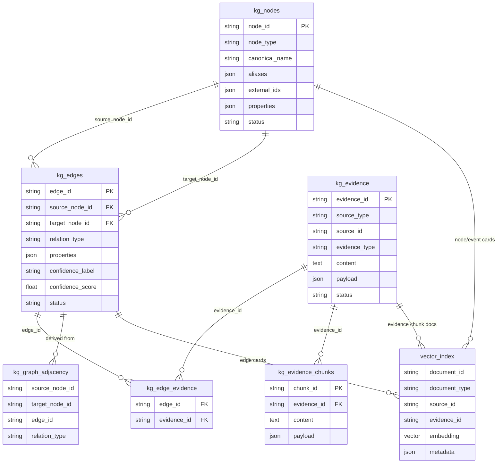
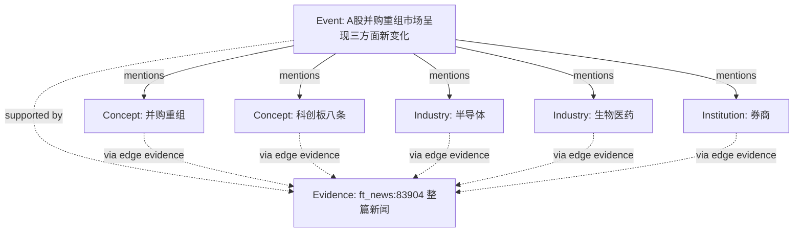
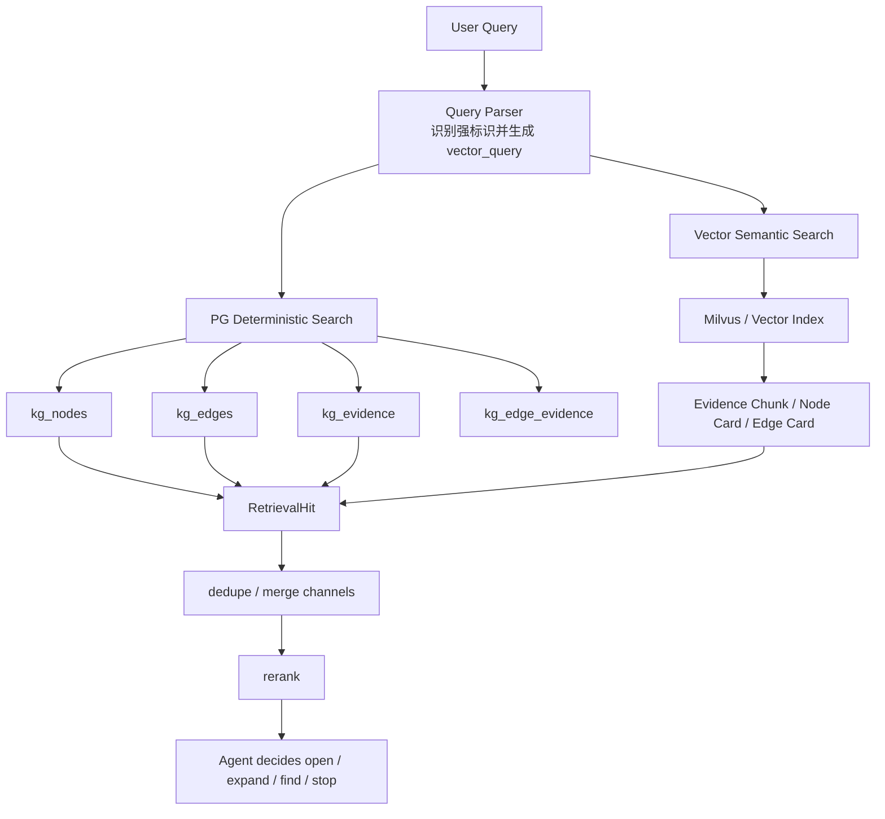
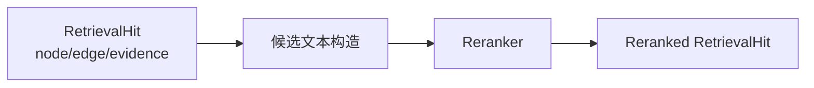
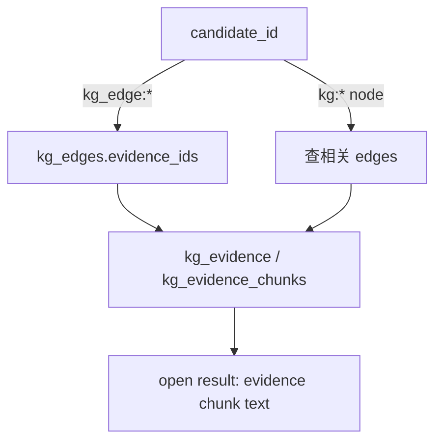
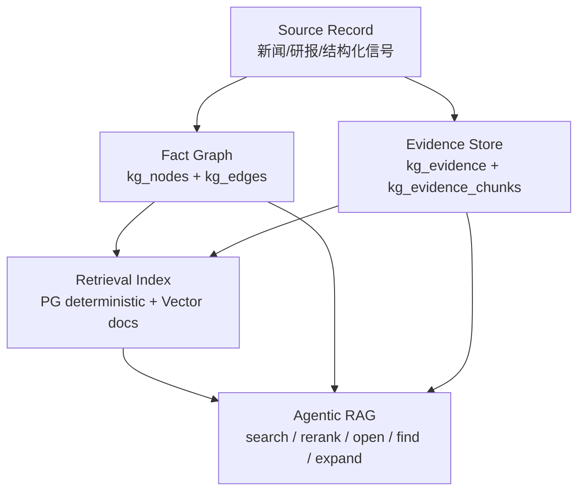

# 知识图谱 RAG 检索数据模型与表关系

## 1. 本文定位

本文用于解释当前知识图谱系统中“节点、边、证据、事实、向量索引”之间的关系，重点回答三个问题：

1. 图谱里的节点、边、证据分别是什么。
2. 这些对象在数据库表里如何关联。
3. RAG search、rerank、open、expand 等检索动作到底会使用哪些表。

本文不是数据库 DDL 文档，也不是代码实现说明。它用于建立理解模型：看到 `kg:...`、`kg_edge:...`、`kg_ev:...` 这类 ID 时，能知道它们代表什么、应该查哪里、为什么多条边会指向同一条证据。

## 2. 核心概念

| 概念 | 典型 ID | 存储位置 | 含义 |
| --- | --- | --- | --- |
| Node | `kg:financial:industry:...` | `kg_nodes` | 图谱中的实体、事件、行业、政策、股票、基金、地区等对象。 |
| Edge | `kg_edge:financial:mentions:...` | `kg_edges` | 两个 Node 之间的有向关系，例如 mentions、affects、benefits_from。 |
| Evidence | `kg_ev:financial:news_articles:ft_news:83904:...` | `kg_evidence` | 支撑图谱事实的原始证据，当前新闻类数据通常是一篇文章或一个 source record。 |
| Edge Evidence Link | 无业务 ID | `kg_edge_evidence` | Edge 与 Evidence 的多对多关联表，表示这条边由哪些证据支撑。 |
| Evidence Chunk | `kg_chunk:...` | `kg_evidence_chunks` | Evidence 的可读分片，用于 open / find 和向量索引。 |
| Vector Document | Milvus 内部记录 | Milvus / Lite | 面向语义检索的索引材料，例如 Evidence Chunk、Node Card、Edge Card。 |
| Graph Adjacency | 复合主键 | `kg_graph_adjacency` | 从 Edge 派生的邻接表，用于图扩展和 scoped graph search。 |

## 3. 总体数据关系



## 4. 三类核心事实对象

### 4.1 Node：图谱对象

`kg_nodes` 存的是“对象本身”，例如：

- `A股并购重组市场呈现三方面新变化` 是 event。
- `半导体` 是 industry。
- `科创板八条` 是 concept / policy-like concept。
- `券商` 是 institution。
- `300750` 对应某个 stock node。

重要字段：

| 字段 | 作用 |
| --- | --- |
| `node_id` | 系统内稳定 ID，所有 edge 通过它引用节点。 |
| `node_type` | 对象类型，影响关系校验、检索解释、rerank 文档里的角色判断。 |
| `canonical_name` | 标准名称，展示和确定性检索都依赖它。 |
| `aliases` | 别名，用于 resolver / deterministic search。 |
| `external_ids` | 外部代码或业务 ID，例如股票代码、新闻 ID。 |
| `properties` | 扩展属性，例如来源、发布时间、行业标签等。 |
| `status` | active / candidate / ambiguous 等状态，决定是否参与检索。 |

Node 自己不直接说明“为什么可信”。可信来源通常要通过相关 Edge 再关联到 Evidence。

### 4.2 Edge：图谱关系

`kg_edges` 存的是两个 Node 之间的关系，例如：

```text
A股并购重组市场呈现三方面新变化 --mentions--> 半导体
半导体 --benefits_from--> 科创板八条
券商 --related_to--> A股并购重组市场生态变革
```

重要字段：

| 字段 | 作用 |
| --- | --- |
| `edge_id` | 关系 ID。 |
| `source_node_id` | 起点 Node。 |
| `target_node_id` | 终点 Node。 |
| `relation_type` | 关系类型，例如 mentions、affects、benefits_from、related_to。 |
| `properties` | 方向、原因、归一化信息、候选来源等。 |
| `confidence_label` / `confidence_score` | 关系置信度。 |
| `status` | active / candidate 等，影响是否进入检索。 |

Edge 是 RAG 中很重要的对象，因为用户问“涉及哪些主体、行业或资产影响”时，真正能回答问题的经常不是单个 Node，而是 Edge 表示的“这篇新闻提到了谁、影响了谁、谁受益或受损”。

### 4.3 Evidence：证据

`kg_evidence` 存的是支撑事实的原始证据。对于新闻类 source record，当前通常是一整篇新闻。

以 `ft_news:83904` 为例：

```text
evidence_id = kg_ev:financial:news_articles:ft_news:83904:a8934858d26f15da
source_type = news_articles
source_id   = ft_news:83904
content     = A股并购重组市场呈现三方面新变化 ... 整篇新闻正文
payload     = title/source_name/published_at/text 等原始字段
```

这解释了为什么很多 Edge 会指向同一个 evidence：它们都来自同一篇新闻。当前写入侧对新闻一般是 source-level evidence，而不是 relation-level evidence。



这种结构是合理的，但有一个限制：如果每条关系只挂整篇 Evidence，而没有自己的 `relation evidence span`，那么 rerank 阶段看到的证据摘要很容易相似。

## 5. RAG Search 涉及哪些表

当前新检索主链路是双入口：

1. PG deterministic search：负责确定性事实、强标识、名称、关系、证据文本的召回。
2. Vector semantic search：负责自然语言语义召回，使用向量库中的 Evidence Chunk、Node Card、Edge Card。



### 5.1 PG deterministic search

PG deterministic search 主要使用：

| 表 | 用法 |
| --- | --- |
| `kg_nodes` | 根据 `node_id`、`canonical_name`、`aliases`、`external_ids`、`properties` 做确定性匹配。 |
| `kg_edges` | 根据 `edge_id`、`relation_type`、source/target node 文本、properties 做关系召回。 |
| `kg_edge_evidence` | 把召回到的 edge 连接到 evidence。 |
| `kg_evidence` | 根据 `evidence_id`、`source_id`、原文 content、payload 做证据召回。 |

典型输出是 `RetrievalHit`：

```text
hit_id        = kg_edge:financial:mentions:5cfed905f6baaffa
hit_type      = edge
title         = A股并购重组市场呈现三方面新变化 mentions 半导体
node_refs     = [event_node_id, industry_node_id]
edge_refs     = [edge_id]
evidence_refs = [kg_ev:financial:news_articles:ft_news:83904:...]
channels      = [pg_deterministic]
```

### 5.2 Vector semantic search

Vector semantic search 不直接查 `kg_retrieval_documents`。新方向是把 KG 事实编译成面向语义检索的向量文档：

| 向量文档 | 来源 | 作用 |
| --- | --- | --- |
| Evidence Chunk | `kg_evidence_chunks` | 检索原文片段。 |
| Node Card | `kg_nodes` + relation preview | 检索实体、行业、股票、政策等对象。 |
| Event Card | event node + relation preview | 检索事件语义。 |
| Edge Card | `kg_edges` + source/target/evidence metadata | 检索关系语义。 |

这些文档进入 Milvus / Lite 后，semantic search 返回的结果会再转换成 `RetrievalHit`，并带回对应的 `node_refs`、`edge_refs`、`evidence_refs`。

### 5.3 Search 后的合并

PG 和 Vector 可能命中同一个事实。例如：

```text
PG 命中:     kg_edge:financial:mentions:5cfed905f6baaffa
Vector 命中: kg_card:edge:kg_edge:financial:mentions:5cfed905f6baaffa
```

系统会根据事实 ID 合并，保留多通道信息：

```text
channels = [pg_deterministic, semantic_hybrid]
raw_scores = {
  pg_deterministic: ...,
  semantic_hybrid: ...
}
```

注意：这些 raw score 只是召回阶段的来源分数，不等于最终相关性。最终相关性应由 rerank 或 Agent 判断。

## 6. Rerank 阶段使用什么数据

rerank 不应该直接吃数据库对象或 ID。它吃的是由 `RetrievalHit` 转换出的短文本 document。

输入来源：



当前候选文本会尽量包含：

| 信息 | 来源 |
| --- | --- |
| 候选类型 | `hit_type` |
| 候选内容 | `title` |
| 候选焦点 | edge 的 target node / node 的 node_type |
| 关系事实 | `kg_edges` + `kg_nodes` |
| 证据摘要 | `kg_evidence.content` 或 edge properties 中的 reason/summary |

需要特别注意：如果多条 edge 都来自同一个 evidence，例如同一篇新闻里的多个 mentions，那么它们的证据来源天然相同。当前系统只能从同一篇 evidence 中尝试截取目标对象附近的片段，但这不是根本解法。

根本上，写入侧应该保存 relation-level evidence span：

```text
edge: A --mentions--> 半导体
evidence_span: “其中，半导体、软件、生物医药、高端装备制造等新兴产业占比超过九成”
```

而不是只保存：

```text
edge.evidence_ids = [整篇新闻 evidence_id]
```

## 7. Open / Find / Expand 分别查什么

### 7.1 open

`open` 用于精读证据。

输入可以是：

- `evidence_ids`
- `candidate_ids`

如果输入是 edge 或 node，系统会先反查关联 evidence：



涉及表：

| 表 | 用法 |
| --- | --- |
| `kg_edges` | edge candidate 转 evidence ids。 |
| `kg_edge_evidence` | edge 与 evidence 关系。 |
| `kg_evidence` | 原始证据。 |
| `kg_evidence_chunks` | chunk manifest：保存 chunk_id、offset、前后指针；可读 chunk text 从 Milvus 按 target_id 取回，必要时由 `kg_evidence.content + offset` 重建索引材料。 |

### 7.2 find

`find` 是在已打开或指定 evidence 中做局部文本匹配。

涉及表：

| 表 | 用法 |
| --- | --- |
| Milvus chunk target | 在可读 chunk text 里按 query terms 查找。 |
| `kg_evidence_chunks` | 提供 chunk_id、offset、previous/next 指针。 |
| `kg_evidence` | 作为事实原文来源，用于索引重建和必要的 evidence 级追溯。 |

### 7.3 expand

`expand` 是图扩展工具。它不重新理解全文，而是从已有 candidate 出发，找相邻关系。

涉及表：

| 表 | 用法 |
| --- | --- |
| `kg_edges` | 找 source/target 相邻边。 |
| `kg_nodes` | 读取边两端节点。 |
| `kg_edge_evidence` / `kg_evidence` | 给扩展出来的边带证据引用。 |
| `kg_graph_adjacency` | 派生邻接索引，适合快速扩展。 |

## 8. 旧检索表与当前定位

当前库里还有一些历史或迁移期表：

| 表 | 当前定位 |
| --- | --- |
| `kg_retrieval_documents` | 旧的 PG 检索文档层。新方向下不应作为核心主入口，后续应逐步退出。 |
| `kg_retrieval_document_versions` | 旧检索文档生成批次记录。 |
| `kg_wiki_pages` | 旧的背景页 / 实体页生成物。当前不是主检索入口，可作为迁移期辅助信息。 |
| `kg_retrieval_trace_snapshots` | 检索质量回放和评估快照，属于评估资产。 |
| `kg_review_items` | 质量审核项，记录高风险对象。 |
| `kg_normalization_rules` | 归一化规则，影响节点合并和关系端点识别。 |
| `kg_compilation_runs` | 编译运行审计记录。 |

整体方向是：

```text
PG 保留事实层和确定性检索能力
Vector DB 承担语义检索入口
旧 retrieval document / wiki page 不再作为核心 RAG 主链路
```

## 9. 以 ft_news:83904 为例

### 9.1 证据

`kg_evidence` 中有一条整篇新闻证据：

```text
kg_ev:financial:news_articles:ft_news:83904:a8934858d26f15da
```

它的正文是《A股并购重组市场呈现三方面新变化》，内容包括：

- 并购六条、科创板八条等政策背景。
- 半导体、软件、生物医药、高端装备制造等新兴产业。
- 汽车零部件、化学制品、电力等传统行业。
- 券商从交易通道转向价值合伙人。
- 并购重组市场从量的积累迈向质的跃升。

### 9.2 节点

这篇新闻产生或关联了多个节点：

```text
Event: A股并购重组市场呈现三方面新变化
Concept: 并购重组
Concept: 并购六条
Concept: 科创板八条
Concept: 新质生产力
Industry: 半导体
Industry: 生物医药
Industry: 高端装备制造
Institution: 券商
Institution: Wind资讯
```

### 9.3 边

这些节点之间形成多条边：

```text
Event --mentions--> 并购重组
Event --mentions--> 并购六条
Event --mentions--> 科创板八条
Event --mentions--> 半导体
Event --mentions--> 生物医药
Event --mentions--> 高端装备制造
Event --mentions--> 券商
半导体 --benefits_from--> 科创板八条
券商 --related_to--> A股并购重组市场生态变革
```

其中多条 mentions 都指向同一个 evidence，是因为它们都来自同一篇新闻。

## 10. 当前已知问题

### 10.1 Evidence 粒度过粗

当前新闻类 evidence 通常是一整篇文章。这样适合追溯来源，但不适合给每条 relation 提供差异化证据摘要。

表现：

- 多条 edge 的 `evidence_refs` 相同。
- rerank 文档里的证据摘要容易相似。
- Agent 需要 open 整篇 evidence 后再理解具体关系。

更合理的目标：

```text
source-level evidence: 整篇新闻，用于可追溯
relation-level evidence span: 每条关系自己的证据片段，用于 rerank 和解释
```

### 10.2 Edge 缺少专属 relation summary

一些 LLM 抽取结果里已经有 `relations[].evidence_spans` 或 `reason`，但当前编译到 `kg_edges` 后，很多信息没有形成统一的 relation-level 检索材料。

目标形态：

```text
Edge:
  source = 新闻事件
  relation = mentions
  target = 半导体
  evidence_span = “其中，半导体、软件、生物医药、高端装备制造等新兴产业占比超过九成”
  relation_summary = “半导体被列为并购重组活跃的新兴产业方向之一”
```

这样 rerank 才能看到真正有区分度的候选文本。

### 10.3 表名容易造成误解

`kg_evidence` 不是“某个关系的专属证据”，它当前更多是“source record 的证据”。  
`kg_edge_evidence` 表示“这条边由哪些证据支撑”，但不表示“这条边在证据中的精确片段”。

## 11. 查询时应该怎么查表

### 11.1 已知 evidence_id

查 `kg_evidence`：

```text
kg_ev:financial:news_articles:ft_news:83904:a8934858d26f15da
```

含义：某条原始证据，通常可直接看到 source_type、source_id、content、payload。

想知道哪些 edge 使用了它，再查 `kg_edge_evidence`，然后 join `kg_edges`。

### 11.2 已知 edge_id

查 `kg_edges`：

```text
kg_edge:financial:mentions:5cfed905f6baaffa
```

含义：某条关系。通过 `source_node_id` 和 `target_node_id` 查 `kg_nodes`，通过 `kg_edge_evidence` 查证据。

### 11.3 已知 node_id

查 `kg_nodes`：

```text
kg:financial:industry:0382d4d5a5ccc248
```

含义：某个实体或事件。想看它参与哪些关系，查 `kg_edges.source_node_id` 或 `kg_edges.target_node_id`。

## 12. 推荐理解方式

可以把当前系统理解成三层：



一句话总结：

```text
Node / Edge 是知识图谱事实。
Evidence 是事实追溯来源。
EdgeEvidence 是事实与证据的关联。
Vector Index 是面向语义检索的投影。
RAG search 会同时使用 PG 事实层和向量索引层，再交给 rerank 和 Agent 决策。
```
