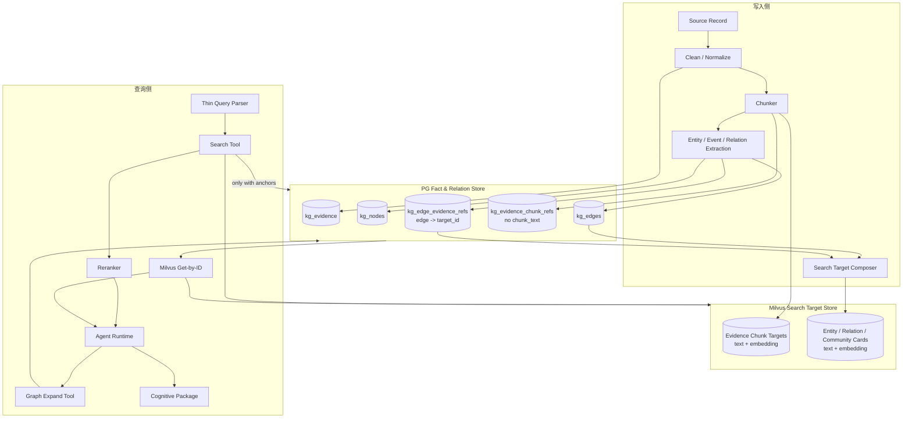
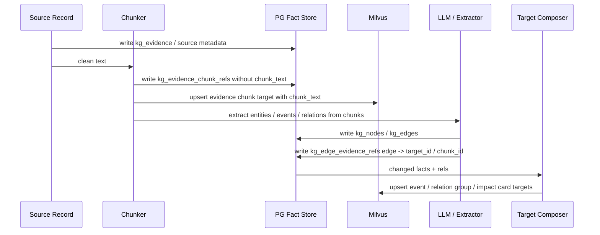
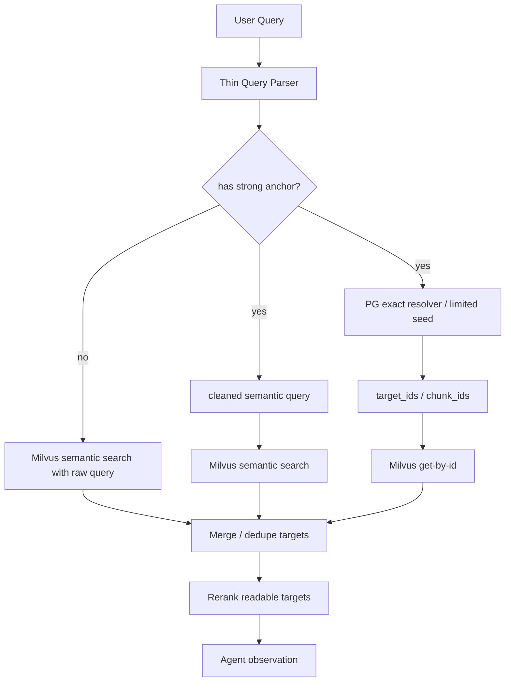
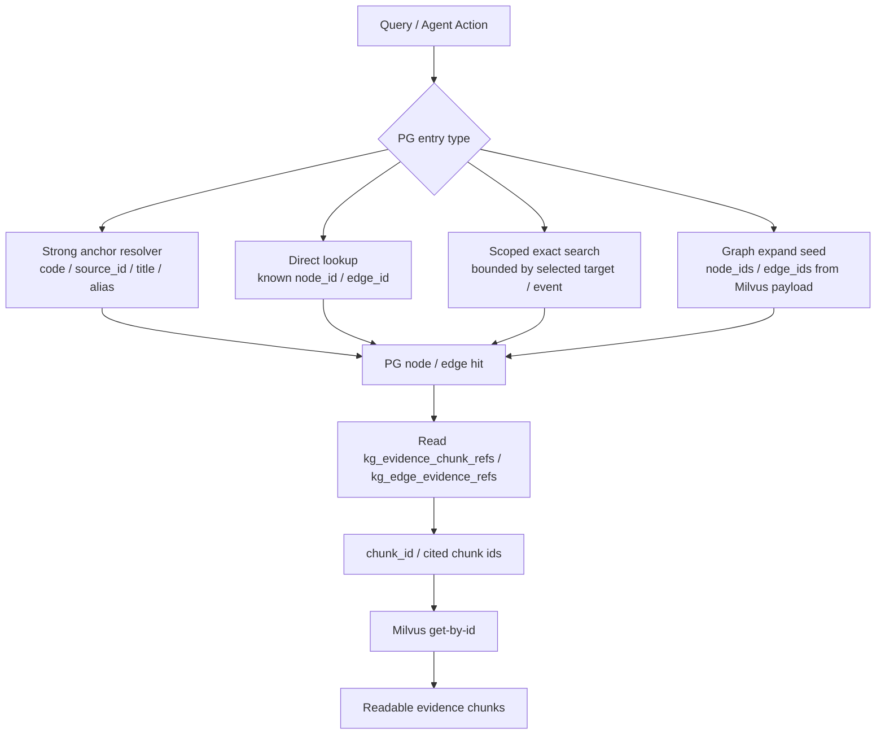
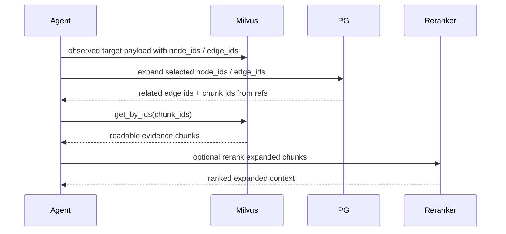

# Milvus语义检索与PG关系展开双层架构实施方案

## 1. 模块目标

本文承接设计文档：

`docs/5. 设计方案/1. 知识图谱/12. Milvus语义检索、PG关系展开与叙事图谱设计方案.md`

目标是把知识图谱检索链路改造成：

```text
Milvus 负责语义召回、chunk text 快速取回，以及 entity / relation / community card 导航
PG 负责事实、关系、证据指针和 graph expand
```

本方案只写模块职责、关键流程、边界和验证口径，不写代码级实现和具体 SQL。

## 2. 模块边界

### 2.1 覆盖范围

本方案覆盖：

- 写入侧 chunk / card target 生成。
- PG 中 evidence、node、edge、chunk ref、edge evidence ref 的职责。
- Milvus 中可读 search target 的职责。
- 第一阶段检索策略。
- graph expand 后如何取回相关 chunk text，并保留 card 导航来源。
- rerank 输入形态。
- Agent 工具协作。
- 旧 PG 检索派生层退出路径。

### 2.2 不覆盖范围

本方案不覆盖：

- 具体 Milvus collection 字段定义。
- 具体 DDL 和迁移脚本。
- 具体 embedding 模型和 reranker 模型选型。
- 交易决策系统。
- 结构化行情查询系统。

## 3. 加入新能力后的整体系统架构



架构含义：

- Milvus 是可读候选的热路径存储。
- PG 不存 chunk text，但保存原文、事实、关系和指针。
- PG 展开关系后，必须通过 `target_id` / `chunk_id` 从 Milvus 取文本。
- Reranker 主链路消费的是 evidence chunk；entity / relation / community card 是导航入口，命中后必须先追溯到 chunk。

## 4. 模块职责架构

| 模块 | 主要职责 | 不负责 |
| --- | --- | --- |
| Chunker | 将原始 evidence 切成可检索片段，生成稳定 chunk_id / offsets / hash | 持久化 chunk_text 到 PG |
| Search Target Composer | 生成 Evidence Chunk、Entity Card、Relation Card、Community / Finding Card 等可读 target | 生成新的事实 |
| PG Fact Store | 保存 evidence、node、edge、关系、状态、版本 | 语义召回、rerank 文本存储 |
| PG Ref Store | 保存 evidence / edge / finding -> chunk_id / target_id 的指针 | 保存 chunk/card 正文 |
| Milvus Search Store | 保存 target text、embedding、metadata，支持 search 和 get by ID | 关系推理和事实审计 |
| Query Parser | 识别强锚点，生成 cleaned semantic query | 复杂语义理解和策略选择 |
| Search Tool | 执行 Milvus 首轮搜索，必要时执行 PG anchor resolver / direct lookup / scoped exact search | 无锚点 PG 泛搜 |
| Graph Expand Tool | 根据 node_ids / edge_ids 在 PG 中展开关系并返回 chunk_ids / navigation refs | 直接返回裸 edge 作为最终候选 |
| Milvus Get-by-ID | 根据 target_id / chunk_id 批量取回可读 payload | 判断关系是否重要 |
| Reranker | 对可读 evidence chunk 排序 | 清洗脏数据、排序裸 node/edge/card 或伪造证据摘要 |
| Agent Runtime | 决定搜索、精读、展开、收窄、停止 | 绕过工具直接访问底层存储 |

## 5. 关键流程

### 5.1 写入侧流程



写入侧原则：

- PG 保存原始 evidence 和结构化事实。
- PG 只保存 chunk manifest / target refs，不保存 chunk_text。
- Milvus 保存 Evidence Chunk 和 Card 的完整可读 text。
- 实体、事件和关系抽取必须以 chunk 为基本输入单位，而不是直接对整条 source record 抽取。
- 每个抽取结果必须带 `evidence_id`、`chunk_id`、supporting text / reason；edge 抽取结果必须能绑定到 supporting target / chunk。

### 5.2 第一阶段检索流程



规则：

- 无强锚点：只走 Milvus semantic search。
- 有强锚点：Milvus 仍然负责语义搜索，PG 只做 exact resolver / limited seed。
- PG 不做无锚点开放 node / edge keyword search。
- PG 命中的 node / edge 必须转换成 target_id / chunk_id，再从 Milvus 取可读文本。

### 5.2.1 PG node / edge 命中入口

PG 中 node / edge 的命中只能来自受控入口。



禁止入口：

```text
raw query -> PG nodes ILIKE
raw query -> PG edges ILIKE
raw query -> global graph search
```

实现时需要把 PG search API 明确拆成：

- resolver lookup。
- direct lookup。
- scoped exact search。
- graph expand。

不要保留一个“什么都搜”的 PG search 入口。

### 5.3 Graph expand 流程



Graph expand 输出不能停留在：

```text
kg_edge:xxx
kg_node:xxx
```

它必须返回可读 evidence chunks，必要时附带导航来源：

```text
evidence chunk
trace source: node / edge / relation card / community finding
```

### 5.4 open / find 流程

open / find 的默认对象是 evidence chunk。entity / relation / community card 只能作为导航来源，除非 Agent 明确要求查看该 card 的解释文本，否则不作为最终上下文主体。

推荐层次：

```text
open chunk:
  从 Milvus chunk collection get-by-id，展示 chunk text

open source:
  使用 evidence_id 从 PG 打开完整原文

open context:
  使用 kg_evidence_chunk_refs 找相邻 chunk_id，再从 Milvus get-by-id

open navigation card:
  只展示 entity / relation / community card 的解释和追溯 refs，不进入最终 rerank 主集合

find:
  在已打开 chunk 或 source text 中定位
```

PG 只在需要完整原文、上下文窗口、审计、source 级引用或 card -> chunk 追溯时参与。

## 6. 数据 / 索引 / 状态生命周期

### 6.1 PG 数据职责

PG 中的关键对象：

```text
kg_evidence:
  原始 evidence、source_id、标题、发布时间、来源、清洗全文

kg_nodes / kg_edges:
  图谱事实和关系

kg_evidence_chunk_refs:
  evidence_id -> chunk_id / target_id / index / offsets / hash / version
  不含 chunk_text

kg_edge_evidence_refs:
  edge_id -> evidence_id / chunk_id / target_id / support metadata
  不含 chunk_text
```

PG 是事实源和关系源，但不是 chunk/card text 热路径存储。

### 6.2 Milvus 数据职责

Milvus 中保存 search targets：

```text
target_id
target_type
text
embedding
source_id
evidence_id
chunk_ids
node_ids
edge_ids
event_ids
published_at
status / version metadata
```

必须支持：

- semantic search。
- scalar filter。
- get by target_id。
- batch get by chunk_id / target_id。

### 6.3 一致性生命周期

PG 和 Milvus 通过稳定 ID 连接。


如果 Milvus target 缺失但 PG ref 存在：

- 当前 expand 结果标记为 missing target。
- trace 记录缺失 target_id。
- 后台触发 rebuild。
- 不用 PG 现场拼 chunk_text 替代。

## 7. Reranker 输入形态

Reranker 只接收可读 evidence chunk document。

不应接收：

```text
裸 edge id
裸 node id
只有 title 的抽象关系
同一 evidence 下大量重复 mentions edge
entity card
relation card
community report
```

应接收：

```text
候选类型: Evidence Chunk
证据来源: ft_news:83904 / 证券日报 / 2026-04-23
正文片段: ...
命中通道: chunk / relation / entity / community / pg_exact
追溯来源: relation_card:... / entity_card:...
限制: relation/entity/community 命中只解释召回原因，不替代原文证据
```

同一 evidence 下多个 relation / entity / community 命中，应合并到同一个 chunk 的 `channels / trace_refs`，不能复制多份相同正文进入 rerank。

## 8. 迁移路径

### 8.1 第一阶段：收紧查询侧

- 无锚点 query 默认只走 Milvus semantic search。
- 有锚点 query 中 PG 只做 resolver / limited seed。
- PG node / edge hit 不直接进入 rerank。
- Milvus chunk hit 可直接进入 rerank；Milvus entity / relation / community hit 必须先追溯 chunk。

### 8.2 第二阶段：补齐 refs

- 引入或改造 `kg_evidence_chunk_refs`。
- 引入或改造 `kg_edge_evidence_refs`。
- 确保 refs 中有 `target_id` / `chunk_id`。
- 确保 refs 不保存完整 chunk_text。

### 8.3 第三阶段：补齐 target 类型

- Evidence Chunk Target。
- Entity / Event Card Target。
- Relation Card Target。
- Community Report / Finding Target。
- 除 Evidence Chunk 外，其余 target 只作为召回和导航入口，不作为 rerank 主对象。

### 8.4 第四阶段：退出旧链路

- 下线无锚点 PG keyword / node / edge 泛搜。
- 下线裸 node / edge rerank。
- 下线 `kg_retrieval_*` / Wiki / retrieval document 核心检索入口。
- 保留必要 trace 和 debug 工具。

## 9. 技术风险与评审关注点

| 风险 | 表现 | 方案约束 |
| --- | --- | --- |
| Milvus target 缺失 | PG expand 找到 target_id，但 Milvus get 失败 | trace missing target，后台 rebuild，不临时拼文本 |
| refs 不完整 | graph expand 后找不到可读 chunk | 写入侧必须把 edge / evidence 绑定 chunk_id |
| target 文本重复 | 同一 evidence 下多个 edge 文本几乎一样 | relation/entity 命中后按 chunk 合并，不按 edge 平铺 rerank |
| PG 被重新用成搜索引擎 | 无锚点 query 又走 node / edge keyword search | 查询侧强约束：无锚点不跑 PG 泛搜 |
| Milvus payload 过大 | chunk 文本太长影响 rerank，card 文本太长影响召回和 Agent 观察 | chunk 控制粒度，card 控制摘要密度 |
| 原文和 chunk 不一致 | chunker 版本变化导致 offsets 漂移 | refs 保存 chunker_version / hash，重建时校验 |

## 10. 验证指标

需要通过回放验证：

1. 无锚点 query 的 PG 搜索调用次数下降。
2. 第一阶段候选能按 chunk / entity / relation / community 分入口统计。
3. 裸 node / edge 进入 rerank 的比例接近 0。
4. 同一 evidence 下重复 edge candidate 数量下降。
5. graph expand 后能通过 chunk_id 从 Milvus 成功取回文本。
6. Milvus hit 进入 rerank 前不需要 PG 回表拿 chunk_text。
7. 最终答案引用能追溯到 evidence_id / source_id / target_id。
8. 对已有 bad cases，证据覆盖率和候选重复率优于旧链路。

## 11. 待确认问题

1. `kg_edge_evidence_refs` 是否保留短 evidence_span，还是只保留 offsets / target_id。
2. `target_id` 是否统一覆盖 chunk/card，还是 chunk_id 和 card_id 分开做主键。
3. Milvus batch get 的最大批量和延迟预算。
4. Relation Card / Community Finding Card 在写入侧预生成还是查询侧动态生成。
5. PG 中完整原文 `clean_text` 是否长期保留，还是只保留 source metadata 加外部对象存储引用。
