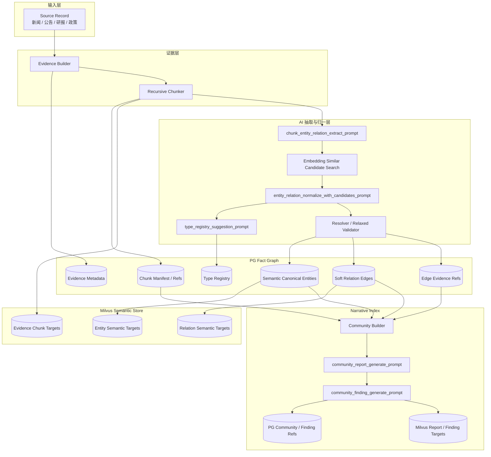
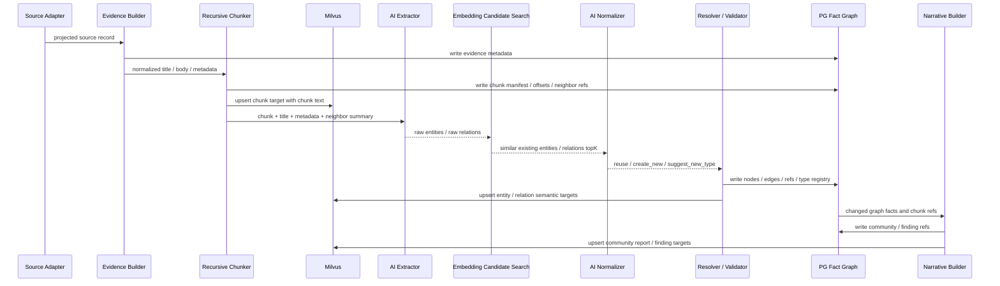
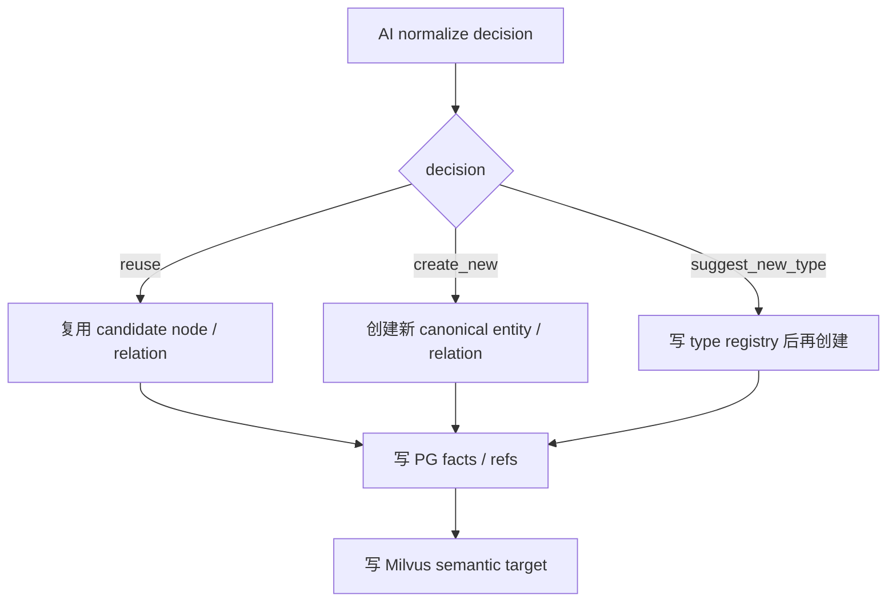
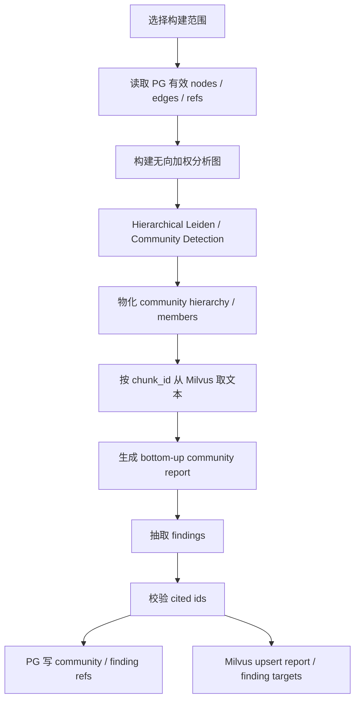

# Milvus语义检索与PG关系展开写入链路实施方案

## 1. 模块目标

本文承接设计文档：

`docs/5. 设计方案/1. 知识图谱/12. Milvus语义检索、PG关系展开与叙事图谱设计方案.md`

本文只描述“数据如何写入系统”。

目标是把原始新闻、公告、研报、政策等弱结构化文本，写入为一套可追溯、可检索、可展开的认知材料：

```text
Evidence
  -> Chunk
  -> AI 抽取 raw entity / raw relation
  -> Embedding 召回相似候选
  -> AI 归一判断
  -> PG 事实图与引用关系
  -> Milvus 可读语义 target
  -> 异步 Community / Finding 高级索引
```

写入链路的核心交付不是“抽出一堆 node / edge”，而是形成一条稳定链路：

```text
任何 entity / relation / community / finding
  都必须能够回到 evidence_id / chunk_id / source_id
```

## 2. 模块边界

### 2.1 覆盖范围

本文覆盖：

- Evidence 入库。
- Recursive chunk。
- chunk manifest 写入 PG。
- chunk text 写入 Milvus。
- 基于 chunk 的实体和关系抽取。
- embedding 候选召回。
- AI 归一判断。
- type registry 自动扩展。
- Resolver / Relaxed Validator。
- PG 事实图与引用写入。
- Milvus entity / relation semantic target 写入。
- Community / Finding 高级索引构建。
- 写入链路的质量检验、缓存、trace 和测试。

### 2.2 不覆盖范围

本文不覆盖：

- 查询阶段如何召回、重排和 Agent 精读，见：
  `12. Milvus语义检索与PG关系展开查询链路实施方案.md`
- 具体 SQL DDL。
- 具体 Python 类和函数签名。
- 具体第三方模型采购和部署。
- 交易决策系统。
- 结构化行情查询系统。

## 3. 写入后的整体系统架构



关键判断：

- PG 保存事实、状态、关系和引用。
- Milvus 保存可读语义文本和向量。
- PG 不保存完整 chunk text / card text。
- Milvus chunk target 必须可直接给 rerank / Agent 使用；entity / relation / community target 作为召回和导航入口，必须先追溯 chunk。
- AI 抽取不是终点，AI 抽取结果必须经过候选召回、归一判断和宽松校验。

### 3.1 当前落地阶段

本方案描述的是目标写入链路。当前代码已经完成查询链路改造所需的核心写入支撑，并补上了实体/关系归一化、type registry、Milvus 多集合索引和高级索引最小闭环；仍未完成的是 GraphRAG 风格的正式 Leiden 层级 community builder 和 LLM report/finding prompt runner。

已经落地：

- Milvus 语义索引使用稳定 `target_id`，支持 `upsert()` 和按 ID 精准取回。
- 语义索引材料已经从旧 retrieval document / wiki 主链路切到 Evidence Chunk、Node/Event Card、Edge Card。
- node / edge / evidence 命中后，查询侧已经优先追溯到 evidence chunk，再进入 rerank。
- Evidence 已经接入 Recursive Chunker，能够生成 `chunk_index`、offset、previous/next、`text_hash`、`chunker_version` 等 manifest。
- 写入链路已经改为抽取前物化 chunk：compile 过程中会先把 evidence metadata、PG chunk manifest 和 Milvus chunk target 写入，再进入 node / edge 抽取。
- `kg_edge_evidence_chunks` 已经提供 edge -> evidence -> chunk 的基础追溯关系。
- 金融新闻抽取入口已经支持 chunk-first fan-out：存在 chunk hints 时，每个 chunk 单独进入抽取 prompt，输出再合并为同一 candidate package。
- AI extraction JSON Schema 已允许 `evidence_spans` 携带 `chunk_id` / `evidence_id`；chunk hints 存在时，prompt 要求 AI 优先回填输入中的 `chunk_id`。
- edge -> chunk 引用已经优先使用 relation `evidence_spans.chunk_id`，没有显式 chunk_id 时再做 text / offset 匹配；仍定位不到时才退回到 evidence 下全部 chunk。
- 写入侧归一化服务已经支持真实 Milvus semantic candidate provider，AI 可基于 entity semantic target 判断 `reuse_semantic_candidate` 并生成 alias rule。
- `candidate_fact_package.entities` 已进入同一套归一化流程，归一后会同步改写 package relation 的 source/target 文本，避免候选包关系端点继续使用未归一名称。
- `candidate_fact_package.relations` 已接入 relation semantic candidate provider；AI 可基于 Milvus relation target 判断 `reuse_semantic_candidate` / `keep_current_relation` / `suggest_new_type`，低置信度时自动保留当前关系，不产生人工 pending。
- AI normalize prompt 已携带 active type registry；AI 返回 `suggest_new_type` 时会自动写入 active type rule，本次直接创建对应 canonical entity。
- active type registry 已回灌到金融 adapter spec、抽取 JSON Schema 和抽取 prompt；新增 entity / relation type 可以进入同一轮后续编译校验，并覆盖 news / policy / l1_events 的 candidate package 边生成路径。
- Milvus 已经按 chunk / entity / relation / community 多集合写入语义材料；各集合 topK 支持环境变量配置，查询 diagnostics 会记录 per-collection hits 和 latency。community collection 在全量 rebuild 时已有基于图 connected component 的底层 report、基于 relation family 的父级 report，以及带 cited chunk refs 的 finding target；增量写入不会局部生成 community/finding，避免单批数据污染高级索引。
- 新 schema 下 PG chunk manifest 不再写完整 chunk text；Milvus 负责保存可读 chunk target。已有旧表结构迁移期仍有兼容路径，具体偏差记录在 `9. 待优化.md`。

尚未完整落地：

- 实体和关系抽取仍复用既有金融新闻抽取 schema / repair / validation 机制；`chunk_entity_relation_extract_prompt` 已以 chunk-first fan-out 方式落地，但还不是独立的新 prompt runner 类。
- 关系端点已随 candidate package entity 归一化同步改写，关系级 semantic candidate 复用已落地；后续仍需补充更细粒度的 endpoint constraint 定义、关系别名治理和冲突治理。
- type registry 已有写入侧最小闭环，并已回灌到金融抽取 JSON Schema 和 adapter spec；后续仍需补充更细粒度的 endpoint constraint 定义和冲突治理。
- 当前 community report / finding 仅在全量 rebuild 时基于 connected component + relation family 做确定性最小实现，不是 GraphRAG 风格 hierarchical Leiden community，也没有正式 LLM report/finding prompt runner。
- 旧 `kg_retrieval_documents` / `kg_wiki_pages` ORM、仓储入口、rebuild-wiki API/CLI 和专项测试已经硬删除；schema 中仅保留 drop 脚本用于清理历史测试库。

这些偏差必须同步记录到 `9. 待优化.md`，不能在实现评审时默认视为已完成。

## 4. 模块职责架构

| 模块 | 职责 | 输出 | 不负责 |
|---|---|---|---|
| Evidence Builder | 把 source record 变成 KG evidence | evidence metadata / source refs | 语义抽取 |
| Recursive Chunker | 按递归分隔策略切 chunk | chunk_id / offset / neighbor refs / chunk text | 判断 chunk 语义重要性 |
| Milvus Chunk Writer | 写入 chunk text 和 embedding | Evidence Chunk target | 保存事实关系 |
| Graph Extraction Prompt Runner | 对 chunk 抽取 raw entity / relation | raw extraction package | 归一化和写库 |
| Similar Candidate Search | 用 embedding 找相似 entity / relation | topK candidate semantic targets | 做最终合并判断 |
| Normalization Prompt Runner | 让 AI 判断 reuse / create_new / suggest_new_type | normalized decision package | 直接写库 |
| Type Registry Manager | 维护 entity / relation type registry | allowed types / type definitions | 用死规则限制 AI 表达 |
| Resolver | 执行 AI 决策，分配或复用 node_id / edge_id | stable node / edge refs | 用关键词否定 AI 推断 |
| Relaxed Validator | 检查结构和引用完整性，决定 pass / downgrade / isolate / candidate | validation decision | 让整条 evidence 失败 |
| PG Fact Writer | 写事实图和引用 | nodes / edges / refs / types | 保存完整可读文本 |
| Milvus Target Writer | 写 entity / relation / community 语义 target | searchable target payload | 事实审计 |
| Community Builder | 基于 PG 图构建层级 community | community hierarchy / members | 替代 evidence |
| Report / Finding Prompt Runner | 生成 community report 和 finding | report / finding with refs | 生成无引用结论 |

## 5. 写入数据流转

### 5.1 主链路



### 5.2 Evidence 入库

Evidence 是原始材料在 KG 系统里的审计入口。

最低需要保留：

```text
source_id
source_type
title
published_at
source_name
source_metadata
original_text_ref 或原始文本读取位置
status
version
```

Evidence 不直接作为 rerank 主对象。查询阶段如果命中 evidence，也需要落到 chunk。

### 5.3 Chunk 生成

第一版采用 Recursive chunk，不引入 embedding semantic chunker。

分隔优先级：

```text
段落
换行
中文句末标点
中文句内标点
空格
字符兜底
```

每个 chunk 需要生成：

```text
chunk_id
evidence_id
source_id
chunk_index
start_offset
end_offset
field_name / block_type
previous_chunk_id
next_chunk_id
chunker_version
text_hash
status
```

写入规则：

```text
PG:
  只写 chunk manifest 和 refs。

Milvus:
  写完整 chunk text、embedding、metadata。
```

短文本自然成为 single chunk，不需要单独策略。

### 5.4 Milvus Chunk Target

Milvus chunk target 是第一阶段语义召回的基础材料。

target text 应包含：

```text
标题
chunk 正文
source 类型
发布时间
必要的轻量 metadata
```

metadata 应包含：

```text
target_id = chunk_id
target_type = evidence_chunk
evidence_id
source_id
source_type
published_at
chunk_index
previous_chunk_id
next_chunk_id
status
version
```

Milvus 必须支持两种访问：

```text
vector search(query_embedding)
get / query by target_id or chunk_id
```

## 6. AI 交互与 Prompt 设计

写入链路使用一组稳定的金融 KG prompt 族。GraphRAG prompt 只能作为母版，不直接上线。

参考源码：

- `packages/references/graphrag/packages/graphrag/graphrag/prompts/index/extract_graph.py`
- `packages/references/graphrag/packages/graphrag/graphrag/prompts/index/summarize_descriptions.py`
- `packages/references/graphrag/packages/graphrag/graphrag/prompts/index/community_report.py`
- `packages/references/graphrag/packages/graphrag/graphrag/prompts/index/community_report_text_units.py`
- `packages/references/graphrag/packages/graphrag/graphrag/prompt_tune/prompt/entity_types.py`

### 6.1 `chunk_entity_relation_extract_prompt`

用途：

```text
从单个 chunk 中抽取 raw entity / raw relation。
```

输入：

```text
evidence title
source metadata
published_at
chunk_id
chunk text
previous_chunk_summary，可选
next_chunk_summary，可选
allowed entity types
allowed relation types
type definitions
examples
```

输出：

```text
entities:
  raw_name
  proposed_type
  canonical_name_suggestion
  identifiers
  aliases
  description
  evidence_spans
  confidence

relations:
  source_text
  target_text
  relation_type
  direction
  supporting_text / support_summary
  support_reason
  support_status: explicit_fact | inferred_fact | hypothesis
  confidence
  evidence_id
  chunk_id
```

关键约束：

- 不能输出没有证据解释的关系。
- 可以做宏观推断，但必须标注 `inferred_fact` 或 `hypothesis`。
- 原文明确支持的事实标注 `explicit_fact`。
- 不要把股票代码、source_id、内部 ID 混入 canonical name。
- 需要输出证据短句或摘要，方便后续 trace 和人工检查。

质量检测不过关时使用同上下文追问：

```text
你刚才的输出无法通过质量检查。
失败原因：
- 缺少 chunk_id
- relation 没有 support_reason
- entity 缺少 evidence_spans

请在保持原始 chunk 事实不变的前提下，只修复输出 JSON。
```

### 6.2 `entity_relation_normalize_with_candidates_prompt`

用途：

```text
给 AI raw 抽取结果和 embedding 召回的相似候选，让 AI 判断复用、合并、新建或建议新 type。
```

输入：

```text
raw entity / raw relation
raw support text
raw support reason
candidate entities topK
candidate relations topK
allowed actions
type registry definitions
```

候选来自 Milvus semantic target：

```text
raw item text
  -> embedding
  -> search existing entity / relation targets
  -> topK candidate payload
```

输出：

```text
decision: reuse | create_new | suggest_new_type
reuse_target_id，可选
canonical_key
canonical_name
entity_type / relation_type
reason
confidence
review_flags，可选
new_type_suggestion，可选
```

决策规则：

- 候选明显同义时复用。
- 候选只是同主题但非同一对象时新建。
- 无法判断是否复用时，不输出 `uncertain`，而是 `create_new`，并在 `confidence`、`reason`、`review_flags` 中标记低置信度原因。
- 发现 type registry 表达不了时 `suggest_new_type`。

### 6.3 `type_registry_suggestion_prompt`

用途：

```text
当 AI 判断现有 type 无法表达时，自动建议新 entity type 或 relation type。
```

输入：

```text
当前全部 allowed types
type definitions
endpoint constraints
positive / negative examples
raw item
候选事实上下文
```

输出：

```text
type_name
type_kind: entity_type | relation_type
definition
endpoint_constraints
positive_examples
negative_examples
reason
created_from_chunk_id
```

准入规则：

- 优先使用已有 type + properties。
- 新 type 必须能改变查询语义、图谱遍历或统计口径。
- 禁止生成 `other / unknown / misc`。
- 禁止生成与已有 type 重叠的名字。

用户当前口径是：AI 可以自动扩展 allowed schema，不要求人工逐条维护。但必须保留版本、来源和可回放理由。

### 6.4 `entity_relation_summarize_prompt`

用途：

```text
聚合同一实体或同一关系在多个 chunk / 多个批次中的描述，生成稳定语义 target。
```

输入：

```text
canonical_key
entity_or_relation_type
description list
supporting chunks summaries
existing semantic target text
```

输出：

```text
stable_summary
key_attributes
known_aliases
important_relations_summary
conflict_notes
```

这个 prompt 借鉴 GraphRAG 的 `summarize_descriptions.py`，但需要中文金融化。

### 6.5 `community_report_generate_prompt`

用途：

```text
基于 community 的成员实体、关系和 chunk refs，生成市场叙事报告。
```

输入：

```text
community_id
community_level
member entities
member relations
cited chunks
child community reports，可选
time view
```

输出：

```text
title
summary
rating
rating_explanation
market_narratives
risk_directions
impact_assets
time_evolution
findings
```

约束：

- 必须引用输入中存在的 chunk_id / edge_id / entity_id。
- 不得引用不存在的 id。
- 不得生成无法回溯 chunk 的 finding。
- 父级 report 可引用 child report，但最终 finding 仍要能回到 chunk。

### 6.6 `community_finding_generate_prompt`

用途：

```text
从 community report 中拆出可检索 finding。
```

输出：

```text
finding_text
finding_type: risk | opportunity | impact | trend | disagreement | narrative
cited_entity_ids
cited_edge_ids
cited_evidence_ids
cited_chunk_ids
support_count
confidence
time_range
```

硬门槛：

```text
finding 没有 cited_chunk_ids，不写入 Milvus 可检索索引。
```

## 7. Resolver / Validator 流程

### 7.1 Resolver

Resolver 执行 AI 的归一决策。



Resolver 不接受“等待人工确认”的 `uncertain` 决策。归一化链路必须自动落到复用、创建或建议新 type。低置信度不是阻塞条件，而是治理信号：写入时保留 `confidence`、`reason`、`review_flags`，后续由离线治理任务做合并、废弃或 type 收敛。

### 7.2 Relaxed Validator

Validator 不使用关键词匹配推翻 AI 语义判断。

它只检查：

```text
required fields 是否完整
evidence_id / chunk_id 是否存在
support_reason / support_status / confidence 是否存在
source / target 是否已经归一为 node_id
new type 是否有 definition / examples / endpoint constraints
```

动作：

```text
pass
repair_light
downgrade
isolate
```

局部失败不影响整条 evidence：

```text
evidence 保留
chunk 保留
entity 尽量保留
relation 不稳定时降级或保留为 candidate
```

### 7.3 关系状态

关系事实至少区分：

```text
explicit_fact
inferred_fact
hypothesis
candidate
deprecated
merged
```

其中：

- `explicit_fact`：原文明确支持。
- `inferred_fact`：AI 基于行业、主体、上下游、政策语义做合理推断。
- `hypothesis`：有可能成立，但证据弱。
- `candidate`：结构、端点约束或支持强度需要后续治理，但不阻塞 evidence / chunk / entity 写入。

## 8. PG 与 Milvus 写入细节

### 8.1 PG 保存内容

PG 保存：

```text
evidence metadata
chunk manifest / refs
canonical entities
soft relation edges
edge evidence refs
type registry
community / finding refs
lineage refs
status / version / provenance
```

PG 不保存：

```text
完整 chunk text
完整 entity card text
完整 relation card text
完整 community report text
完整 finding text
```

### 8.2 Milvus 保存内容

Milvus 保存：

```text
Evidence Chunk target
Entity Semantic target
Relation Semantic target
Community Report target
Finding target
```

每个 target 必须具备：

```text
target_id
target_type
text
embedding
evidence_ids
chunk_ids
node_ids
edge_ids
source_ids
published_at / time_range
status
version
```

### 8.3 Milvus 写入规则

必须遵守项目 Milvus 约束：

- 使用 `MilvusClient`。
- 字段类型使用 `DataType` 枚举。
- 使用 `VARCHAR target_id` 作为稳定主键。
- 更新使用 `upsert()`。
- collection 必须先 index / load 再 search。
- Evidence Chunk target payload 必须可直接服务 rerank / Agent。
- Entity / Relation / Community target payload 必须可解释召回原因，并携带可追溯到 chunk 的 refs。

### 8.4 写入顺序

推荐写入顺序：

```text
1. PG 写 evidence metadata
2. PG 写 chunk manifest
3. Milvus upsert chunk targets
4. AI 抽取 raw entity / relation（此时 chunk_id 已存在于 PG manifest 和 Milvus chunk target）
5. Milvus search entity / relation similar candidates
6. AI normalize
7. PG 写 type registry / nodes / edges / refs
8. Milvus upsert entity / relation semantic targets
9. 异步触发 community builder
10. PG 写 community / finding refs
11. Milvus upsert community / finding targets
```

如果第 4 步之后失败：

```text
evidence / chunk 仍然有效
relation 可以降级为 candidate
Milvus chunk target 不回滚
```

## 9. 高级索引构建实施方案

### 9.1 构建入口

高级索引不是每条 evidence 同步构建，而是异步批处理。

构建输入：

```text
community_scope
graph_scope
time_scope
source_scope
status_filter
```

### 9.2 构建流程



边权重输入：

```text
relation_confidence
evidence_count
source_quality
recency_score
relation_family_weight
entity_specificity
generic_entity_penalty
```

### 9.3 Report 生成策略

采用自底向上：

```text
底层 community:
  使用 member entities / relations / chunks 生成细节 report。

父级 community:
  上下文足够时使用明细。
  上下文超限时使用 child community reports 作为摘要输入。
```

### 9.4 Finding 写入门槛

Finding 必须有：

```text
finding_text
finding_type
cited_chunk_ids
cited_evidence_ids
confidence
time_range
```

没有有效 `cited_chunk_ids` 的 finding 不进入 Milvus。

## 10. Trace、缓存与质量观测

写入链路必须记录：

```text
evidence ingest trace
chunking trace
AI extraction request / response
extraction validation errors
embedding candidate search input / output
AI normalization request / response
resolver decision
validator action
PG write result
Milvus upsert result
community build trace
```

缓存策略：

- LLM 抽取按 prompt version + model + evidence/chunk + schema version 做缓存。
- 归一判断按 raw item + candidate set + type registry version 做缓存。
- Embedding 按 normalized text + model + dim 做缓存。
- Community report 按 input snapshot + prompt version + community version 做缓存。

质量指标：

```text
chunk_count_per_evidence
extraction_json_parse_rate
relation_with_chunk_ref_rate
entity_normalization_reuse_rate
new_type_suggestion_rate
validator_candidate_rate
milvus_upsert_success_rate
community_finding_with_chunk_ref_rate
```

## 11. 迁移路径

第一阶段：

- [x] 建立 Recursive Chunk 与 chunk manifest。
- [x] Milvus 写 chunk text。
- [x] PG edge refs 能追溯 chunk。
- [x] AI 抽取输出已保留 evidence span，并支持原生携带 `chunk_id` / `evidence_id`。
- [x] relation -> chunk refs 已从 evidence 级追溯升级为 span 优先定位，无法定位时保守退回 evidence 下 chunks。

第二阶段：

- [x] entity / relation semantic target 写入 Milvus。
- [x] embedding candidate search 接入实体归一流程。
- [x] AI normalize prompt 上线，并携带 semantic candidates / active type registry。
- [x] type registry 自动扩展最小闭环上线：可写 active type rule，并已回灌抽取 schema / adapter endpoint constraints。

第三阶段：

- [~] community 最小 Milvus target 已上线：当前按 relation group 生成可检索 report card，并保留 cited evidence/chunk refs。
- [~] bottom-up community report / finding 最小版上线：当前使用 connected component + relation family 规则生成，不是 Leiden + LLM prompt runner。
- [x] Milvus 已写 community report target 和 finding target；finding 必须带有效 cited chunk refs。

第四阶段：

- [x] 废弃旧 `kg_retrieval_*` / wiki / retrieval document 写入链路；schema 仅保留 drop 脚本用于清理历史测试库。
- [x] 所有可读检索材料统一走 Milvus target。

## 12. 技术风险与评审关注点

| 风险 | 影响 | 处理 |
|---|---|---|
| AI 抽取漂移 | 同一实体被拆成多个 | embedding 候选召回 + AI normalize |
| AI 过度新增 type | type registry 膨胀 | 给全量 allowed types / examples，要求优先复用 |
| relation 没有 chunk ref | 无法审计 | 无 chunk ref 的 relation 降级为 candidate，并保留 evidence/chunk |
| Milvus 与 PG 不一致 | 查询回表失败 | PG refs 只保存 target_id/chunk_id，Milvus upsert 失败要有重试和状态 |
| community report 幻觉 | 高级索引污染 | finding 必须引用有效 chunk_id |
| chunk 太碎 | 上下文不足 | previous/next refs + 查询阶段邻接扩展 |
| chunk 太大 | rerank 噪音高 | 控制 chunk size，保留递归分隔 |

## 13. 验证指标

写入链路完成后，需要达到：

```text
100% evidence 有至少一个 chunk
100% chunk target 可通过 Milvus target_id 取回
95%+ AI 抽取响应可解析 JSON
90%+ relation 有 evidence_id / chunk_id
0 个无引用 community finding 进入 Milvus
PG 不保存完整 chunk text / card text
Milvus chunk target payload 可直接展示给 rerank / Agent
Milvus entity / relation / community target 可追溯到 chunk
```

## 14. 测试用例

### 14.1 单元测试

| 用例 | 验证内容 |
|---|---|
| `test_recursive_chunker_short_text_single_chunk` | 短新闻不强切，生成 single chunk |
| `test_recursive_chunker_offsets_and_neighbors` | chunk_index、offset、previous/next 正确 |
| `test_chunk_manifest_without_text` | PG chunk manifest 不保存完整 chunk text |
| `test_milvus_chunk_target_payload` | chunk target 包含 text、target_id、evidence_id、chunk_id |
| `test_extract_prompt_requires_chunk_refs` | 抽取 prompt 输出必须带 evidence_id / chunk_id |
| `test_normalize_prompt_reuse_candidate` | AI normalize 能复用 embedding 候选 |
| `test_type_registry_suggestion_shape` | 新 type 必须带 definition / examples / constraints |
| `test_relaxed_validator_downgrades_missing_support` | 缺 support_reason 的 relation 降级而不是丢 evidence |

### 14.2 集成测试

| 用例 | 验证内容 |
|---|---|
| `test_ingest_news_to_pg_and_milvus` | source record -> evidence -> chunk -> Milvus chunk target |
| `test_ingest_relation_traces_to_chunk` | edge 能通过 refs 找到 chunk_id |
| `test_new_entity_written_to_milvus_candidate_index` | 新 entity 写入后下一批可被 embedding 召回 |
| `test_new_relation_written_to_milvus_candidate_index` | 新 relation 写入后可用于候选归一 |
| `test_type_auto_extension_visible_next_run` | AI 自动新增 type 后下一次 allowed schema 可见 |
| `test_community_finding_requires_chunk_refs` | 无 chunk ref 的 finding 不写入 Milvus |

### 14.3 回归测试

| 用例 | 验证内容 |
|---|---|
| `test_existing_financial_news_compile_no_data_loss` | 原有新闻编译后 evidence/chunk 不丢 |
| `test_bad_llm_json_retry_keeps_evidence` | LLM 输出坏 JSON 时 evidence/chunk 保留 |
| `test_candidate_relation_does_not_fail_compile` | 局部 relation 失败不影响整条 evidence |
| `test_milvus_upsert_idempotent` | 同一 target_id 重跑 upsert 幂等 |

## 15. 待确认问题

- 第一版 chunk size / overlap 的具体数值需要结合中文新闻长度测试确定。
- entity / relation semantic target 的文本模板需要通过召回、追溯和 Agent 观察效果回归确定；不以直接 rerank 效果作为主指标。
- type registry 自动扩展是否需要人工审计队列，当前设计默认自动进入 allowed schema。
- Community Builder 是否第一版就实现 hierarchical Leiden，还是先保留接口后接入。
- Langfuse trace 是否作为写入链路默认观测平台。
