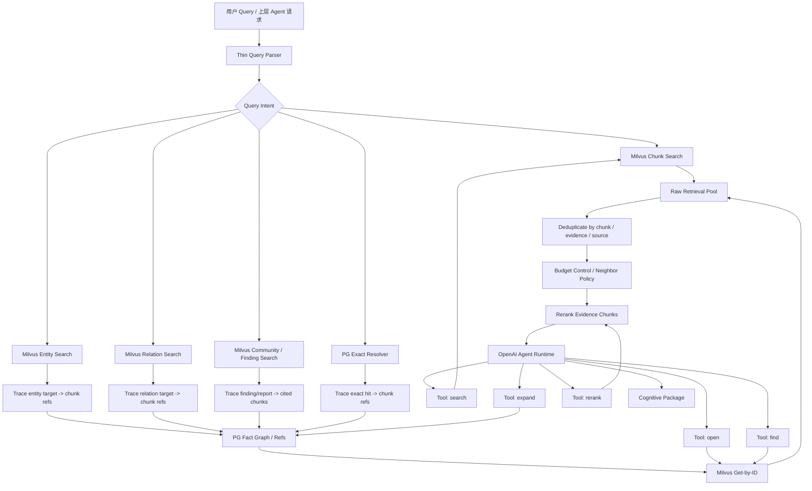
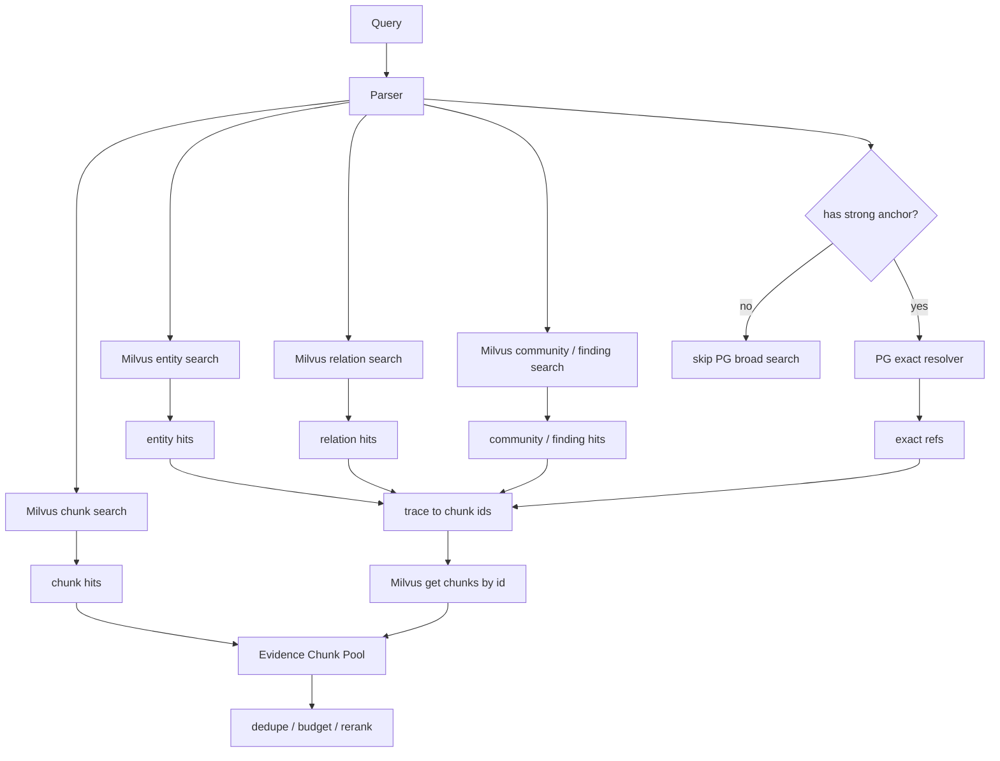
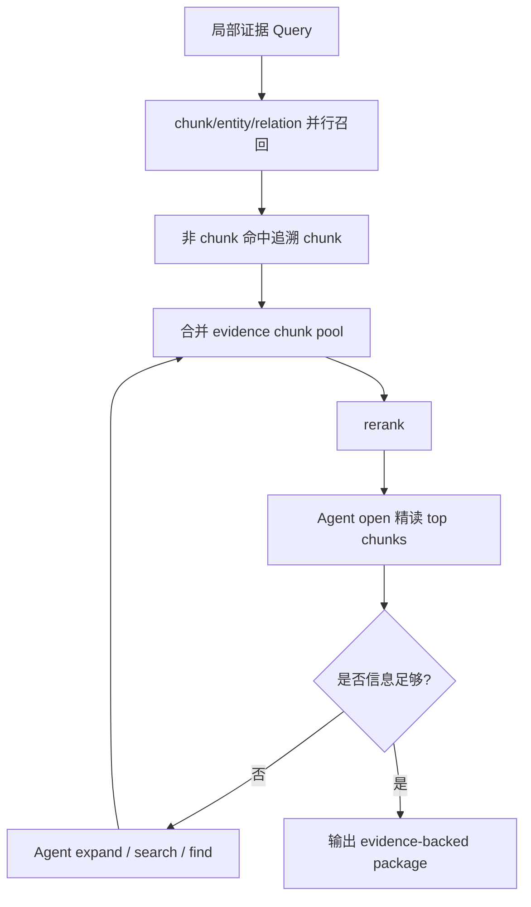
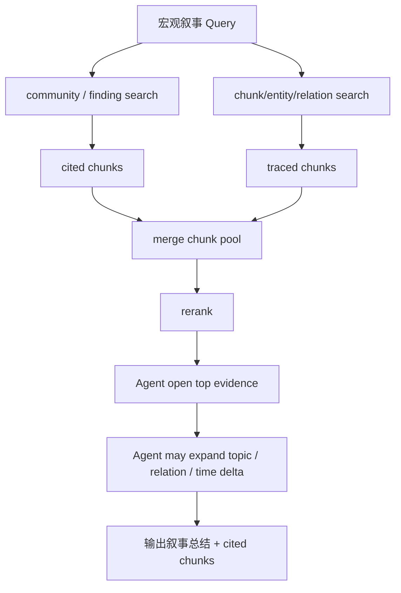

# Milvus语义检索与PG关系展开查询链路实施方案

## 1. 模块目标

本文承接设计文档：

`docs/5. 设计方案/1. 知识图谱/12. Milvus语义检索、PG关系展开与叙事图谱设计方案.md`

本文只描述“数据如何被查询和消费”。

查询链路目标是把用户问题或上层 Agent 请求，转成一组可审计、可重排、可精读的 evidence-backed cognitive package。

核心原则：

```text
第一阶段可以从 chunk / entity / relation / PG exact / community 多入口召回；
但所有入口命中的对象最终都必须回到 evidence chunk；
rerank 和 Agent 主链路消费的是可读 chunk，而不是裸 node / edge / id。
```

## 2. 模块边界

### 2.1 覆盖范围

本文覆盖：

- Query Parser。
- Milvus chunk / entity / relation / community search。
- PG exact resolver。
- PG graph expand。
- Milvus get-by-id。
- 召回结果合并去重。
- rerank 输入构造。
- Agent 工具调度。
- 宏观叙事查询。
- 局部证据查询。
- 查询 trace、Langfuse 观测和测试。

### 2.2 不覆盖范围

本文不覆盖：

- 写入阶段如何 chunk、抽取和构建索引，见：
  `11. Milvus语义检索与PG关系展开写入链路实施方案.md`
- 具体 API endpoint 设计。
- 具体前端展示。
- 交易决策和下单。
- 行情、K 线、因子等结构化查询系统。

## 3. 加入新能力后的查询系统架构



查询链路分成两段：

```text
自动首轮召回:
  系统用固定策略广撒网，得到 evidence chunk pool。

Agent 驱动研究:
  Agent 基于首轮结果决定继续 search / open / find / expand / rerank / stop。
```

### 3.1 当前落地阶段

本方案描述的是目标查询链路。当前代码已经完成主方向改造，并补齐了多集合 Milvus 入口、chunk 精读、图扩展和 rerank 的统一工具协议；剩余缺口集中在正式 finding、高级 community builder 和旧兼容路径清理。

已经落地：

- `search / scoped_search / expand` 会把 node、edge、navigation hit 追溯为 evidence chunk 后再返回给 rerank / Agent。
- PG deterministic search 只在强标识、强标题、source_id、evidence_id 等确定性锚点存在时启用；无锚点 query 不再让 PG 做开放式模糊搜索。
- Milvus vector query 会在检测到强标识后使用 cleaned semantic query，避免要求 embedding 理解代码、内部 ID、source_id。
- rerank 已下沉到 `RetrievalToolRegistry`，OpenAI Agent 和首轮 bootstrap 都可以走同一个 rerank 工具。
- rerank 主对象已经限制为 evidence-backed chunk/evidence，不再把裸 node / edge 当成最终排序对象。
- Milvus 查询已经按 chunk / entity / relation / community 四个物理集合入口执行，并在诊断中保留 collection 级命中统计。
- `open` 已支持 `chunk_ids` 与 `include_neighbors`，可以精读指定 chunk 并补 immediate neighbor 或同 evidence window。
- `expand` 已支持 candidate、node、edge、chunk、evidence 多种 seed，并支持 `relation_filters` 与 `hop_limit`。
- community report 最小入口已进入 Milvus community collection；命中后仍按 cited evidence/chunk refs 追溯到 evidence chunks。

尚未完整落地：

- 当前 community report 是 relation group 的最小导航索引，不是正式 GraphRAG 分层 community；Finding search 尚未接入。
- 邻接 chunk 已能基于 manifest previous/next 补召回，但还没有做 query-aware neighbor budget 策略。
- Milvus get-by-id 缺失时，当前代码仍有 PG chunk/evidence 读取回退，这是迁移期妥协；目标形态应改成显式 stale ref 或重建索引。
- trace 仍保留部分旧兼容字段名，例如 `primary_source`；新增诊断应优先看 channel / collection 维度，旧字段只能作为内部调试信息。

## 4. 模块职责架构

| 模块 | 职责 | 输出 | 不负责 |
|---|---|---|---|
| Thin Query Parser | 识别强标识、时间、问题类型、宏观/局部意图 | query plan hints | 复杂研究策略 |
| Milvus Search Tool | 并行搜索 chunk/entity/relation/community targets | semantic hits | 判断最终答案 |
| PG Exact Resolver | 精确解析 source_id、evidence_id、known id、强标题、金融代码 | exact seeds / refs | 无锚点模糊搜索 |
| PG Graph Expand Tool | 根据 node/edge/chunk/finding refs 展开关系 | related refs / chunk_ids | 返回裸 edge 作为最终候选 |
| Milvus Get-by-ID | 根据 target_id / chunk_id 取可读 payload | readable targets | 关系推理 |
| Candidate Merger | 合并多路召回，去重，保留来源通道 | chunk pool | 语义排序 |
| Reranker Tool | 对 evidence chunks 做模型排序 | ranked chunks | 清洗事实或伪造摘要 |
| Agent Runtime | 决定下一步工具调用和停止条件 | cognitive package | 直接访问底层数据库 |
| Trace / Observability | 记录对话、工具输入输出、LLM 调用和错误 | Langfuse trace / local logs | 业务判断 |

## 5. Query Parser

Query Parser 是轻量层，不做完整语义研究。

它只抽取：

```text
strong identifiers:
  stock code
  fund code
  source_id
  evidence_id
  known kg id
  exact title

time hints:
  最近
  过去一周
  过去 30 天
  今日 / 昨日

query shape:
  local evidence question
  macro narrative question
  impact question
  risk question
  exact lookup question

semantic query:
  去掉强标识后的自然语言查询
```

如果检测到强标识：

```text
PG 使用原始 query + identifiers 做 exact resolver；
Milvus 使用 cleaned semantic query；
```

如果没有检测到强标识：

```text
PG 不做无锚点开放搜索；
Milvus 使用原始 query；
```

Query Parser 不负责：

- 判断哪些关系值得展开。
- 决定最终答案。
- 替代 Agent 策略。
- 生成复杂 SQL。

## 6. 第一阶段并行召回

### 6.1 召回入口

第一阶段默认并行使用以下语义入口：

```text
Milvus Chunk Search
Milvus Entity Search
Milvus Relation Search
Milvus Community / Finding Search
PG Exact Resolver，仅在有强锚点时启用
```

原因：

- 只搜 chunk 容易漏掉抽象关系和实体线索。
- 只搜关系会丢失原文语境。
- 只搜 community 会丢局部证据。
- PG 精确查询适合确定性入口，但不适合作为无锚点语义搜索。

### 6.2 第一阶段流程



### 6.3 每类入口的输出

Chunk Search 输出：

```text
chunk_id
evidence_id
source_id
chunk_text
metadata
semantic_score
```

Entity Search 输出：

```text
entity target_id
node_id
canonical_key
target_text
related evidence/chunk refs
semantic_score
```

Relation Search 输出：

```text
relation target_id
edge_id
source_canonical_key
target_canonical_key
relation_type
target_text
supporting chunk refs
semantic_score
```

Community / Finding Search 输出：

```text
community_id / finding_id
finding_text / report_text
cited chunk ids
cited node ids
cited edge ids
time_range
semantic_score
```

PG Exact Resolver 输出：

```text
matched identifier
matched node/evidence/source
related refs
chunk_ids
reason
```

### 6.4 统一追溯为 chunk

所有非 chunk 命中都要追溯到 chunk。

```text
entity hit
  -> PG refs
  -> related edge/evidence/chunk
  -> Milvus get chunk text

relation hit
  -> PG edge evidence refs
  -> chunk_id
  -> Milvus get chunk text

community/finding hit
  -> cited_chunk_ids
  -> Milvus get chunk text

PG exact hit
  -> evidence/chunk refs
  -> Milvus get chunk text
```

裸 node / edge 不进入 rerank。

## 7. 合并、去重和预算控制

### 7.1 去重原则

去重不是按标题去重，而是按证据链路去重：

```text
chunk_id 优先
evidence_id + chunk_index 次之
source_id + text_hash 兜底
```

如果同一 chunk 被多通道命中，需要合并通道信息：

```text
channels = ["chunk", "relation", "entity", "community", "pg_exact"]
raw_scores = {channel: score}
trace_refs = {channel: original_hit_ids}
```

### 7.2 多通道信息保留

合并后候选应保留：

```text
chunk_id
evidence_id
source_id
chunk_text
channels
original_hits
matched_entities
matched_relations
matched_findings
time_range
metadata
```

不要保留误导性 `primary_source` 或单一 `score` 作为最终排序依据。最终排序交给 rerank。

### 7.3 邻接 chunk 策略

chunk 命中后可以补充邻接 chunk，但邻接 chunk 权重不能过高。

策略：

```text
direct hits 先占预算。
如果 direct hits 不足，再补 previous / next chunk。
邻接 chunk 必须标注 reason = neighbor_context。
邻接 chunk 进入 rerank，但不应默认排在 direct hit 前面。
```

预算示例：

```text
target_rerank_count = 30
direct_chunk_hits = 5
relation/entity/community traced chunks = 60
neighbor chunks = optional

先合并直接命中和追溯命中，再交给 rerank 选 top 30。
```

## 8. Rerank

### 8.1 Rerank 输入对象

进入 rerank 的主对象只能是：

```text
Evidence Chunk
必要的 neighbor chunk
```

不能直接进入：

```text
裸 node
裸 edge
entity target
relation target
community report
community finding
```

这些对象只作为召回入口和解释来源，必须先转成 cited chunks。

### 8.2 Rerank 文本构造

Rerank document 应尽量纯文本、可理解，不堆 ID。

推荐格式：

```text
标题: ...
来源: ...
时间: ...
片段: ...
命中线索: 来自 relation/entity/community/pg_exact 的简短说明
```

注意：

- `命中线索` 只是辅助解释，不要重复大片相同关系摘要。
- 主体必须是 chunk 原文。
- 不要为了“看起来不重复”伪造不同证据摘要。
- 同一 evidence 下多个关系命中，合并到同一 chunk 的 channels / matched_relations 中。

### 8.3 Rerank 输出

输出：

```text
rank
chunk_id
evidence_id
rerank_score
reason，可选
channels
matched_refs
```

Rerank 后不做额外规则重排。

排序前已经完成：

```text
硬过滤
去重
状态过滤
预算控制
```

## 9. Agent 工具协议

Agent 不是固定工作流里的“判断器”，它负责决定何时使用哪种工具做哪件事。

### 9.1 Agent 初始上下文

Agent 启动时获得：

```text
user query
首轮 rerank 后 top chunks
query parser hints
available tools
工具使用约束
停止条件说明
```

Agent 不需要拿到全部候选池，只拿精简后的可读证据和可调用工具。

### 9.2 Tool: search

用途：

```text
发起新的语义搜索。
```

输入：

```text
query
search_targets: chunk | entity | relation | community | all
time_range，可选
limit
reason
```

输出：

```text
ranked chunk candidates
channels
trace refs
diagnostics
```

内部流程仍然遵守：

```text
非 chunk 命中 -> trace to chunks -> Milvus get chunk text -> merge -> rerank
```

### 9.3 Tool: open

用途：

```text
精读已知 chunk / evidence / finding 支撑文本。
```

输入：

```text
chunk_ids
evidence_ids，可选
include_neighbors: none | one_hop | window
```

输出：

```text
chunk text
neighbor chunk text
source metadata
known matched refs
```

### 9.4 Tool: find

用途：

```text
在已打开 evidence/chunks 内定位关键词、主体或关系线索。
```

输入：

```text
opened_scope
terms
```

输出：

```text
matched snippets
chunk ids
positions / offsets
```

### 9.5 Tool: expand

用途：

```text
基于已命中的 chunk / entity / relation / finding 展开 PG 图关系。
```

输入：

```text
seed_chunk_ids
seed_node_ids
seed_edge_ids
seed_finding_ids
relation_filters，可选
hop_limit
limit
reason
```

输出：

```text
related chunk candidates
related refs
channels = ["graph_expand"]
```

内部流程：

```text
PG expand refs
  -> chunk_ids / target_ids
  -> Milvus get-by-id
  -> merge / rerank
```

### 9.6 Tool: rerank

用途：

```text
当 Agent 主动扩展出较多 chunk 时，重新排序。
```

输入：

```text
query
candidate_chunk_ids
limit
reason
```

输出：

```text
ranked chunks
rerank diagnostics
```

## 10. 查询类型流程

### 10.1 局部证据查询

例子：

```text
A股并购重组市场呈现三方面新变化 这条新闻涉及哪些主体、行业或资产影响？
300750 最近有哪些海外产能相关负面事件？
```

流程：



### 10.2 宏观叙事查询

例子：

```text
最近市场对 AI 算力链的主要叙事是什么？
过去一周新能源板块风险事件集中在哪些方向？
A 股并购重组市场的结构性变化有哪些？
```

流程：



### 10.3 精确标识查询

例子：

```text
ft_news:83904 涉及哪些行业？
kg_ev:financial:... 对应的原文是什么？
300750 最近风险事件有哪些？
```

流程：

```text
Query Parser 识别强标识
  -> PG exact resolver 找 evidence/node/source
  -> refs 找 chunk_ids
  -> Milvus get chunk text
  -> 同时用 cleaned query 走 Milvus semantic search
  -> merge / rerank / Agent
```

这样做的原因：

- PG 负责确定性标识。
- Milvus 负责语义扩展。
- 两路并行，互不污染。

## 11. 输出结果形态

最终输出给上层系统的不是裸文本，而是 cognitive package。

建议包含：

```text
answer_summary
answer_items:
  subject / industry / asset / risk / narrative
  conclusion
  support_status
  cited_chunk_ids
  cited_evidence_ids
  confidence

opened_chunks
used_tools
trace_id
session_id
remaining_uncertainties
```

对于交易系统，上层决策层可以根据：

```text
support_status
confidence
evidence_count
source_quality
time_range
uncertainties
```

决定是否进入结构化数据查询、风控、策略判断或人工复核。

## 12. Trace、Langfuse 与本地日志

### 12.1 必须记录的事件

查询链路需要记录：

```text
session_id
trace_id
query
query parser output
initial search input / output
rerank input documents
rerank output ranking
Agent system instructions
Agent user input
Agent tool calls
Agent tool outputs
LLM responses
final cognitive package
exceptions
```

### 12.2 Langfuse session

每次完整查询流程应生成一个新的 `session_id`。

同一个用户连续多轮对话时可以复用同一个 `session_id`，但单次 demo / replay / benchmark 默认一轮一个 session。

规则：

```text
单次完整 run:
  session_id = generated run id

多轮用户会话:
  session_id = external conversation id

批量 replay:
  session_id = replay_run_id
  每个 query 用独立 trace_id
```

### 12.3 本地日志

即使接入 Langfuse，也要保留本地完整日志：

```text
console.log 风格全量日志
transcript markdown
structured trace json/jsonl
```

原因：

- Langfuse 网络或认证失败时不应丢本地调试材料。
- 终端日志会滚动消失。
- replay 需要可离线复现。

## 13. 错误处理

原则：

```text
无 fallback 静默成功。
失败就明确失败。
但已完成的 trace 和本地日志必须落盘。
```

典型错误：

| 错误 | 处理 |
|---|---|
| Milvus search 失败 | 当前 query 失败，记录错误 |
| PG exact resolver 失败 | 如果有强标识，当前 query 失败；如果无强标识，本来就不调用 |
| Milvus get-by-id 找不到 chunk | 标记 stale ref，当前候选丢弃，记录一致性问题 |
| rerank 服务失败 | 当前 query 失败 |
| Agent max turns exceeded | 当前 query 失败，保留 transcript |
| Langfuse 上报失败 | 不阻断主流程，但本地日志必须记录 |

## 14. 迁移路径

第一阶段：

- search 入口返回 chunk pool。
- entity / relation 命中后追溯 chunk。
- rerank 输入只使用 chunk text。

第二阶段：

- Agent tools 全部通过 RetrievalToolRegistry。
- rerank 作为 registry tool 暴露。
- expand 输出 related chunks，不返回裸 edge。

第三阶段：

- community / finding search 接入首轮召回。
- 宏观叙事 query 默认使用 community 入口。

第四阶段：

- 删除旧 `kg_retrieval_*` / wiki / retrieval document 主链路。
- PG 只保留 fact graph 和 refs。

## 15. 技术风险与评审关注点

| 风险 | 影响 | 处理 |
|---|---|---|
| 首轮召回太宽 | rerank 成本升高 | 按 chunk/evidence/source 去重，控制预算 |
| 首轮召回太窄 | 漏掉核心证据 | chunk/entity/relation/community 并行入口 |
| entity/relation 命中后无法回 chunk | 无法审计 | 写入侧强制 refs；查询侧发现 stale ref 要报警 |
| rerank 输入重复 | 排序质量差 | 同一 chunk 合并多通道，不按 edge 拆多个相同文本 |
| Agent 工具循环 | max turns exceeded | 工具结果摘要、停止条件、turn budget |
| PG 被滥用成 keyword search | 召回噪音 | 无强锚点禁止 PG 泛搜 |
| community report 幻觉 | 宏观答案不可靠 | community/finding 必须展开 cited chunks |

## 16. 验证指标

查询链路完成后，需要达到：

```text
100% rerank input 是 readable chunk document
0 个裸 node / edge 进入 rerank 主链路
100% entity/relation/community hit 可追溯到 chunk 或被丢弃并记录
首轮召回 trace 能看到每个 chunk 的来源通道
Agent transcript 能看到问题、回答、工具调用和工具结果
Langfuse session 能串起完整 run
无强锚点 query 不触发 PG 全局 ILIKE / graph search
```

## 17. 测试用例

### 17.1 单元测试

| 用例 | 验证内容 |
|---|---|
| `test_query_parser_strong_identifier_cleaned_query` | 检测强标识后 Milvus 使用 cleaned query |
| `test_query_parser_no_identifier_skips_pg_broad_search` | 无强锚点不触发 PG 泛搜 |
| `test_entity_hit_traces_to_chunks` | entity target 命中后能追溯 chunk |
| `test_relation_hit_traces_to_chunks` | relation target 命中后能追溯 chunk |
| `test_community_finding_traces_to_chunks` | finding 命中后展开 cited chunks |
| `test_merge_dedupes_same_chunk_multi_channel` | 同一 chunk 多通道命中合并 |
| `test_rerank_documents_are_readable_chunks` | rerank 输入不含裸 node/edge |
| `test_neighbor_chunks_marked_as_context` | 邻接 chunk 标记 reason |

### 17.2 集成测试

| 用例 | 验证内容 |
|---|---|
| `test_local_news_question_retrieves_subject_industry_asset_chunks` | 单条新闻问题能召回主体/行业/资产相关 chunk |
| `test_macro_narrative_query_uses_community_entry` | 宏观叙事问题使用 community/finding 入口 |
| `test_exact_source_id_query_uses_pg_and_milvus` | source_id 查询 PG exact + Milvus get-by-id |
| `test_agent_expand_returns_chunks_not_edges` | Agent expand 返回 chunk candidates |
| `test_agent_open_find_on_chunks` | Agent 能 open/find 已召回 chunk |
| `test_langfuse_session_created_for_run` | 完整 run 生成 session_id 并传播 |

### 17.3 回归测试

| 用例 | 验证内容 |
|---|---|
| `test_existing_real_replay_quality_baseline` | 真实 replay 质量不低于当前 baseline |
| `test_no_duplicate_rerank_documents_for_same_evidence_relation_group` | 同 evidence 多 relation 不生成大量重复 rerank 文本 |
| `test_stale_milvus_ref_is_reported` | PG ref 找不到 Milvus chunk 时记录一致性问题 |
| `test_agent_max_turns_logs_full_trace` | Agent 超 turn 时仍完整落本地日志 |

## 18. 待确认问题

- 首轮各入口默认召回数量需要用真实 replay 调参。
- chunk / entity / relation / community 多入口是否需要不同 topK。
- reranker 是否支持输入 `reason/channel` 字段，还是只接受纯文本。
- Agent 停止条件是否需要独立 `should_stop` tool。
- community/finding 首入口是否对所有宏观 query 默认启用，还是先通过 parser intent 判断。
