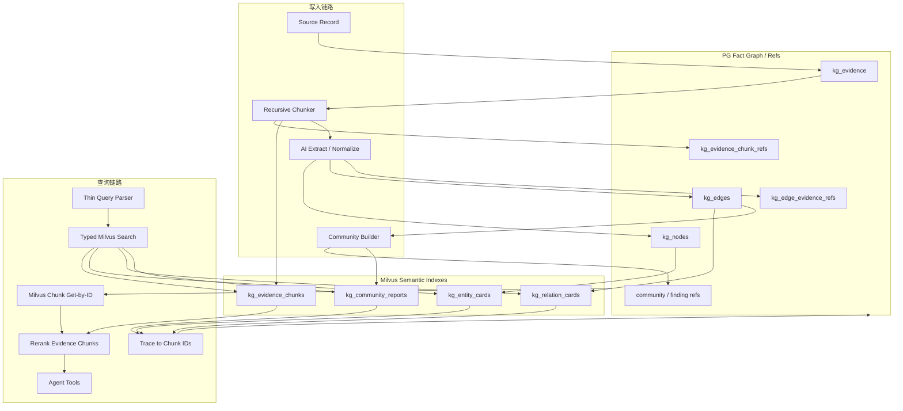
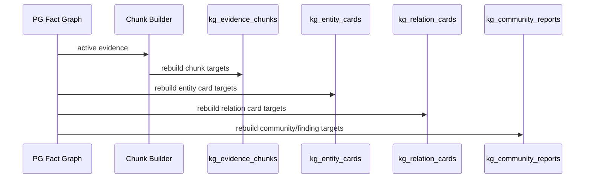
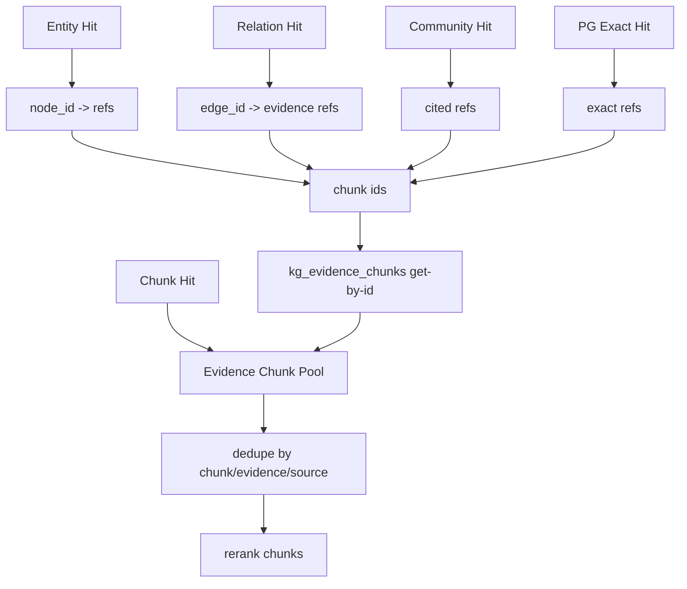

# Milvus多集合语义索引拆分优化方案

## 1. 模块目标

本文只讨论 Milvus 语义索引如何从“单 collection 混合存储”优化为“按语义对象拆分的多 collection 索引”。

当前实现中，`kg_evidence_chunk_vectors` 一个 collection 同时存放：

```text
evidence_chunk
node_card
event_card
edge_card
```

这让第一阶段召回看起来统一，但实际混合了不同语义粒度、不同生命周期、不同 score 分布的对象。随着 Community / Finding 高级索引加入，这个 collection 会进一步混入宏观摘要对象，召回预算和排序解释都会变得更难控制。

本优化的目标是：

```text
按检索对象类型拆分 Milvus collection；
按对象类型独立召回、独立预算、独立追溯；
最终仍统一收敛到 evidence chunk pool；
rerank 和 Agent 主链路只消费可读 evidence chunks。
```

## 2. 模块边界

### 2.1 覆盖范围

本文覆盖：

- Milvus collection 拆分方案。
- 每类 collection 的职责和存储对象。
- 写入链路如何分别写入 chunk / entity / relation / community。
- 查询链路如何分别检索、追溯、合并、重排。
- 迁移路径、风险和验证指标。

### 2.2 不覆盖范围

本文不覆盖：

- Recursive chunk 具体切分算法。
- AI 实体/关系抽取 prompt 细节。
- Community Report 生成 prompt 细节。
- PG fact graph 的 schema 设计。
- 交易决策、行情数据、结构化查询系统。

## 3. 加入多集合后的整体系统架构



核心判断：

- Milvus 不再是一张混合大表，而是一组 typed semantic indexes。
- PG 仍然是事实、关系、状态和引用的源头。
- entity/relation/community 命中后，不直接进入 rerank，而是先追溯到 chunk。
- chunk collection 是唯一可以直接作为 rerank 主对象的 collection。

## 4. 模块职责架构

| Collection | 存储对象 | 查询用途 | 是否直接进 rerank | 追溯方式 |
|---|---|---|---|---|
| `kg_evidence_chunks` | 原文 chunk text | 局部证据、原文片段、精读材料 | 是 | 自身就是 chunk |
| `kg_entity_cards` | 实体 / 事件语义卡片 | 发现相关主体、资产、行业、事件 | 否 | node_id -> PG refs -> chunk_ids |
| `kg_relation_cards` | 关系语义卡片 | 发现影响、受益、关联、冲突等关系线索 | 否 | edge_id -> edge evidence refs -> chunk_ids |
| `kg_community_reports` | community report / finding | 宏观叙事、主题簇、跨文档趋势 | 否 | cited_chunk_ids / cited_edge_ids -> chunk_ids |

`kg_evidence_chunks` 是内容主索引。

`kg_entity_cards`、`kg_relation_cards`、`kg_community_reports` 是发现索引和导航索引，不是最终答案材料。

## 5. Collection 设计

### 5.1 共同字段

所有 collection 都应保留一组共同字段，保证工具层可以统一处理：

```text
target_id
adapter_name
target
target_type
source_type
source_id
text
dense_vector
sparse_vector
content_hash
embedding_model
kg_version
status
updated_at
```

其中：

- `target_id` 是 Milvus 主键。
- `target` 用于区分 `prod / test`。
- `target_type` 用于 trace 和工具层解释。
- `text` 是可被 BM25 和 embedding 消费的自然语言文本。

### 5.2 `kg_evidence_chunks`

职责：

```text
保存 evidence chunk 的可读正文和向量。
```

主键：

```text
target_id = chunk_id
```

核心 metadata：

```text
chunk_id
evidence_id
source_id
source_type
chunk_index
previous_chunk_id
next_chunk_id
published_at
text_hash
chunker_version
```

文本形态：

```text
标题
来源
发布时间
chunk 正文
轻量关系预览，可选
```

注意：关系预览只能是辅助上下文，不能让同一 evidence 下多个 relation 伪造成不同证据。

### 5.3 `kg_entity_cards`

职责：

```text
让语义搜索能够命中实体、事件、行业、资产、政策等对象。
```

主键：

```text
target_id = kg_entity_card:{node_id}
```

核心 metadata：

```text
node_id
node_type
canonical_name
aliases
external_ids
evidence_ids
related_edge_ids
```

文本形态：

```text
实体名称
实体类型
别名
自然语言解释
代表性关系预览
可展开 handle: node_id
```

Entity Card 命中后，只表示“这个实体可能相关”。它必须通过 PG refs 找到支撑它的 evidence chunks。

### 5.4 `kg_relation_cards`

职责：

```text
让语义搜索能够命中关系线索，例如影响、受益、风险、上下游、政策驱动。
```

主键：

```text
target_id = kg_relation_card:{edge_id}
```

核心 metadata：

```text
edge_id
source_node_id
target_node_id
relation_type
direction
confidence
evidence_ids
chunk_ids，如已具备
```

文本形态：

```text
关系自然语言标题
source entity
target entity
relation type
direction
support reason
evidence refs
可展开 handle: edge_id
```

Relation Card 命中后，不直接交给 rerank。查询侧必须通过 `edge_id -> evidence refs -> chunk_ids` 找到可读 chunk。

### 5.5 `kg_community_reports`

职责：

```text
保存高级叙事索引，包括 community report 和 finding。
```

主键：

```text
target_id = kg_community_report:{community_id}:{version}
target_id = kg_finding:{finding_id}:{version}
```

核心 metadata：

```text
community_id
community_level
finding_id
time_range
topic_scope
cited_chunk_ids
cited_node_ids
cited_edge_ids
report_version
```

文本形态：

```text
community title
summary
key findings
impact / risk / narrative labels
引用摘要
```

Community / Finding 命中后，Agent 可以先读摘要判断方向，但进入最终 evidence package 前必须展开 cited chunks。

## 6. 写入流程

### 6.1 全量重建



全量重建时，每个 collection 独立清空和写入：

```text
delete_scope(adapter_name, target, collection)
embed documents by collection
upsert rows
```

### 6.2 增量刷新

增量刷新不能只更新 chunk。

当 evidence 变化：

```text
更新 kg_evidence_chunks 中对应 chunk。
找到该 evidence 关联的 edge。
找到 edge 两端 node。
刷新受影响的 entity cards 和 relation cards。
触发相关 community/finding 的重建或标记 stale。
```

当 node 变化：

```text
刷新该 node 的 entity card。
刷新与该 node 相连的 relation cards。
标记相关 community/finding stale。
```

当 edge 变化：

```text
刷新该 edge 的 relation card。
刷新两端 node 的 entity cards。
标记相关 community/finding stale。
```

## 7. 查询流程

### 7.1 首轮召回

首轮不再对一个混合 collection 做一次搜索，而是按入口并行搜索：

```text
chunk search:      kg_evidence_chunks topK_chunk
entity search:     kg_entity_cards topK_entity
relation search:   kg_relation_cards topK_relation
community search:  kg_community_reports topK_community
PG exact resolver: 仅强标识命中时启用
```

预算示例：

```text
topK_chunk = 40
topK_entity = 15
topK_relation = 20
topK_community = 8
```

预算不是固定常量，应由 query shape 和 Agent request 调整：

- 局部原文问题提高 chunk 预算。
- 影响关系问题提高 relation 预算。
- 主体/行业/资产问题提高 entity 预算。
- 宏观叙事问题提高 community 预算。

### 7.2 追溯到 chunk



所有非 chunk 命中都只是导航信号。

最终进入 rerank 的对象统一为：

```text
Evidence Chunk
```

### 7.3 Rerank 输入

Rerank 输入不包含裸 ID 堆砌，而是可读 chunk 文本：

```text
标题
来源
时间
chunk 正文
命中通道摘要
追溯原因摘要
```

对于 entity/relation/community 追溯来的 chunk，需要保留 trace：

```text
channels = ["relation"]
trace_refs = {
  "relation": ["kg_relation_card:..."]
}
trace_reason = "relation card hit traced to edge evidence chunk"
```

这些 trace 给 Agent 和调试使用，不替代文本排序。

## 8. 方案选型和边界

### 8.1 为什么拆 collection，而不是只用 `target_type` filter

同一个 collection + `target_type` filter 可以作为短期过渡，但长期会有几个问题：

- collection 名称和真实内容不一致，调试困难。
- schema 很快变成所有对象字段的最大公约数。
- search 参数、topK、score 分布无法按对象类型独立治理。
- 重建和删除需要在一张表里处理不同生命周期对象。
- community/finding 加入后，混合 collection 的语义跨度过大。

物理拆分更符合当前无历史包袱的阶段。

### 8.2 为什么 entity/relation 不直接进 rerank

entity/relation card 是“发现线索”，不是“证据正文”。

如果让它们直接进 rerank，会回到之前的问题：

- rerank 输入抽象，缺少原文。
- 多条 relation 指向同一 evidence 时重复严重。
- 关系摘要容易和事实证据混淆。

所以规则是：

```text
entity/relation/community 命中
  -> 必须追溯 chunk
  -> chunk 去重
  -> chunk rerank
```

## 9. 迁移路径

### 第一阶段：抽象 collection registry

新增 Milvus collection registry，统一管理：

```text
chunk collection
entity collection
relation collection
community collection
```

查询和写入代码不得硬编码单一 `MILVUS_COLLECTION`。

### 第二阶段：拆分写入

把当前 `build_semantic_vector_documents()` 输出拆成四类材料：

```text
EvidenceChunkVectorDocument
EntityCardVectorDocument
RelationCardVectorDocument
CommunityReportVectorDocument
```

分别写入不同 collection。

### 第三阶段：拆分查询

`MilvusSemanticHybridRetriever.search()` 改为 typed search：

```text
search_chunks()
search_entities()
search_relations()
search_communities()
get_chunks_by_ids()
```

RetrievalToolRegistry 的 `search` 负责并行调用这些 typed methods，并合并为 chunk pool。

### 第四阶段：删除旧混合 collection 依赖

验证通过后：

- 不再写 `kg_evidence_chunk_vectors` 混合 collection。
- 旧 collection 可删除或只保留一次性迁移脚本读取能力。
- trace 中不再出现混合 `target_type` 竞争排序。

## 10. 技术风险与评审关注点

| 风险 | 影响 | 处理 |
|---|---|---|
| collection 变多导致写入复杂度上升 | refresh 逻辑更复杂 | 用 collection registry 和 typed writer 统一封装 |
| 多入口召回候选变多 | rerank 成本上升 | 每类入口独立 topK，合并后按 chunk 去重 |
| entity/relation 追溯不到 chunk | 无法审计 | 写入侧强制 refs，查询侧记录 stale refs |
| community report 幻觉 | 宏观答案不可靠 | report/finding 必须保存 cited chunks，并在回答前展开 |
| score 无法跨集合比较 | 排序误导 | 各集合 score 只用于本集合初筛，最终统一 rerank chunks |
| 增量刷新漏更新 card | 搜索结果过期 | node/edge/evidence 变化时计算 impacted targets |

## 11. 验证指标

### 11.1 写入指标

```text
chunk_docs_count
entity_cards_count
relation_cards_count
community_reports_count
per_collection_embedding_rounds
stale_target_delete_count
upsert_count
```

### 11.2 查询指标

```text
per_collection_hits
per_collection_latency_ms
traced_chunk_count
stale_ref_count
deduped_chunk_count
rerank_input_count
rerank_topK_source_channels
```

### 11.3 质量指标

```text
目标 evidence 是否被 chunk search 直接命中
目标 evidence 是否被 entity/relation/community 间接命中
chunk pool 去重后是否仍覆盖主体/行业/资产/影响
rerank topK 是否以原文证据为主
Agent 是否减少无效 open/expand
```

## 12. 测试计划

| 测试 | 验证点 |
|---|---|
| `test_milvus_collection_registry` | 四类 collection 名称和 schema 配置稳定 |
| `test_semantic_materials_split_by_target_type` | chunk/entity/relation/community 材料正确拆分 |
| `test_chunk_collection_get_by_ids` | chunk collection 支持按 chunk_id 精准取回 |
| `test_entity_hit_traces_to_chunk_collection` | entity hit 不进 rerank，先追溯 chunk |
| `test_relation_hit_traces_to_chunk_collection` | relation hit 不进 rerank，先追溯 chunk |
| `test_search_budget_per_collection` | 每类入口独立 topK，不互相挤占 |
| `test_rerank_input_only_chunks` | rerank 输入只包含 evidence chunk |
| `test_incremental_refresh_impacted_cards` | evidence/node/edge 改动刷新相关 card |
| `test_stale_ref_is_reported` | 追溯不到 chunk 时记录 stale ref |

## 13. 待确认问题

- 第一版已接入 `kg_community_reports` 的最小 relation-group report target；正式 hierarchical Community Builder 和 finding target 仍按后续阶段实现。
- 每类 collection 的默认 topK 是否通过配置暴露。
- Milvus Lite 下多 collection 的本地文件体积和加载耗时是否可接受。
- 是否保留旧 `kg_evidence_chunk_vectors` collection 的迁移读取脚本。
- trace 展示时是否按 collection 分组展示 hit samples。
