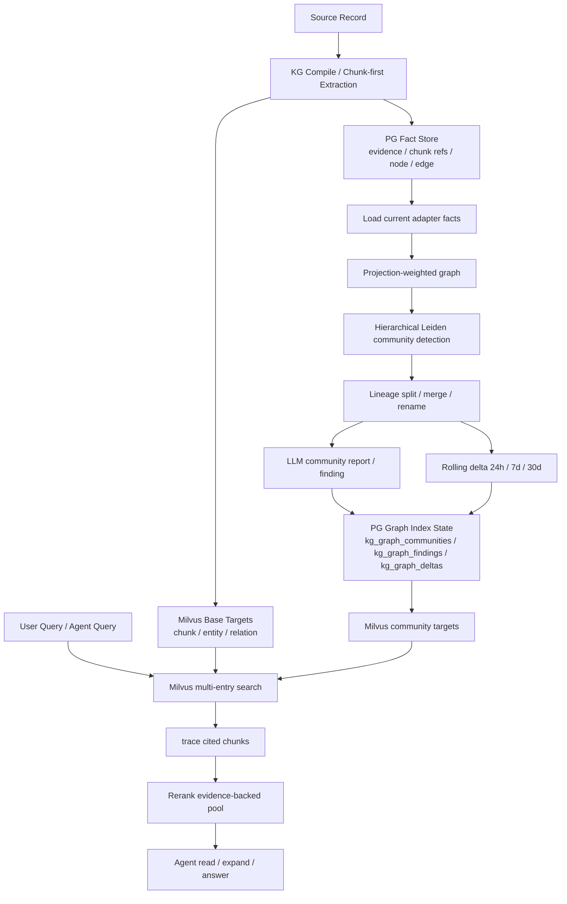
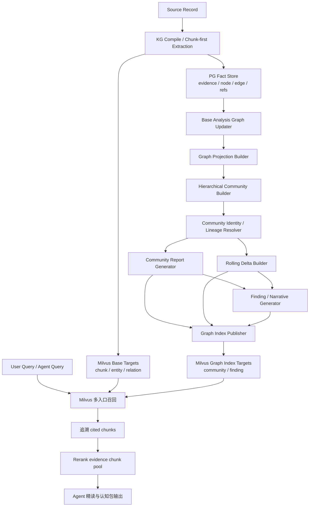
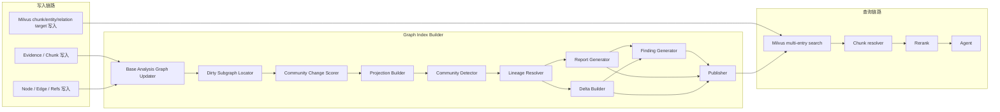
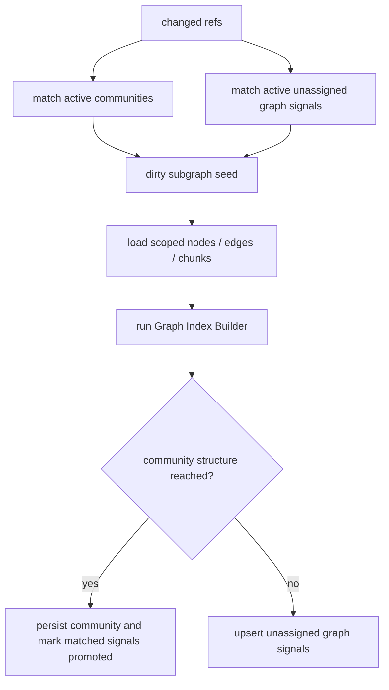
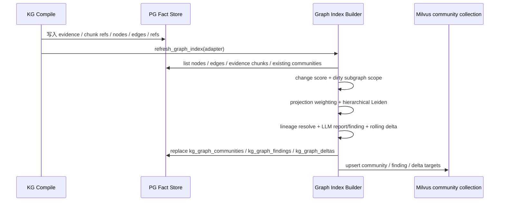
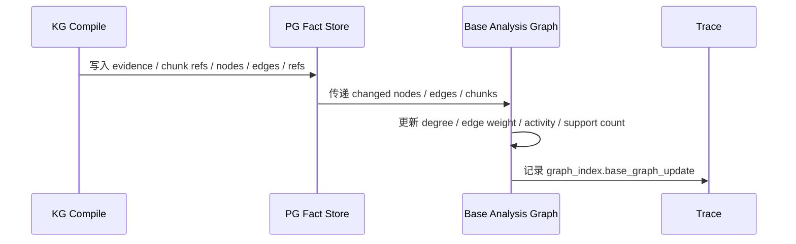
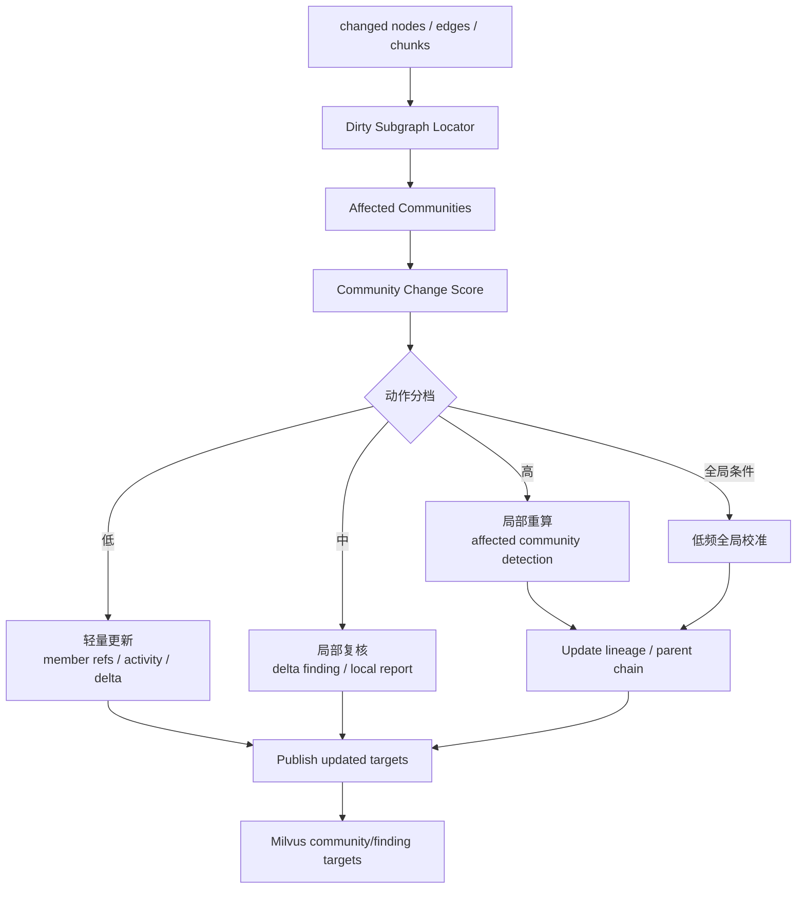
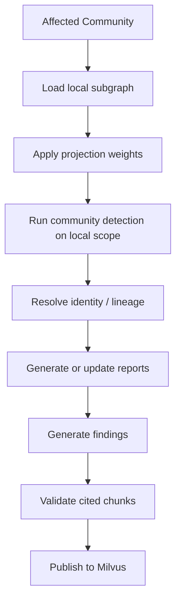
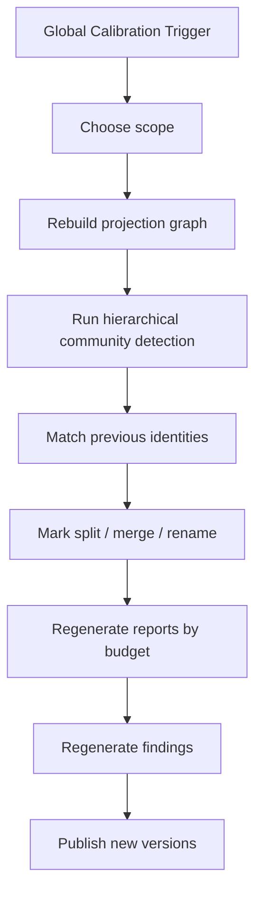
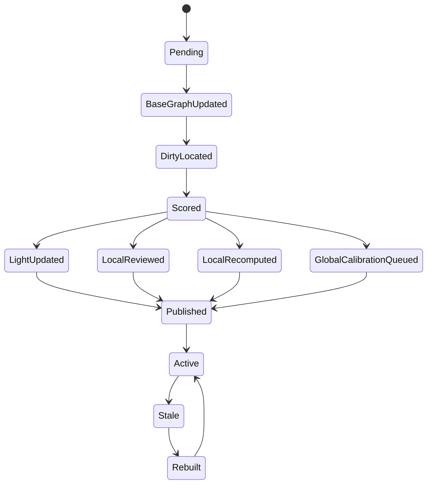

# Graph Index增量构建与多索引分层实施方案

## 1. 模块目标

本文承接设计文档：

`docs/5. 设计方案/1. 知识图谱/14. Graph Index增量构建与多索引分层设计方案.md`
`docs/5. 设计方案/1. 知识图谱/15. Graph Index社区化重构设计方案.md`

目标是在现有“PG 事实图 + Milvus 可读语义索引”的基础上，新增 Graph Index 能力，让系统不仅能召回单条 chunk、entity、relation，还能召回经过关系图聚合后的市场叙事、主题结构、风险变化和 finding。

Graph Index 要解决的问题不是“替代原始证据检索”，而是：

1. 把分散的 node / edge / chunk 组织成可检索的层级 community。
2. 为宏观和半宏观问题提供更强的语义入口，例如“AI 算力链主要叙事”“新能源风险集中方向”“A 股并购重组结构性变化”。
3. 在增量数据进入时，避免每次全量重构整个图谱和所有报告。
4. 保证所有 report / finding / community 命中后都能回到 evidence chunk，不能让高级摘要直接成为最终事实。

### 1.1 当前代码落地状态（2026-05-31）

当前代码已经落地 Graph Index 的正式闭环：hierarchical Leiden 层级 community、dirty subgraph 局部构建、lineage、LLM community report/finding 和 rolling delta 均已进入主链路。

已落地：

1. `src/domain/knowledge/graph_index.py` 中新增 Graph Index Builder。
2. 支持 `default_graph_projection`、`market_narrative`、`industry_chain`、`policy_impact`、`risk_event` 五个 projection profile。
3. 基于当前 PG nodes / edges / evidence chunks 构建加权无向图。
4. 使用 `graspologic-native` hierarchical Leiden 做层级 community detection。
5. 使用 `kg_community_report` LLM prompt 生成 bottom-up community report / finding，每条 finding 必须携带有效 `cited_chunk_ids`。
6. 将 community / finding refs 写入 PG：
   - `kg_graph_communities`
   - `kg_graph_findings`
7. 将 community / finding readable target 写入 Milvus `community` collection。
8. `rebuild_indexes_for(..., index_types=["graph_index"])` 可以重建 Graph Index；`scope=all` 做全量校准，`scope=projection:<projection_name>` 只重建指定 projection。
9. `compile_kg()` 增量写入后会刷新 Graph Index。
10. 增量刷新前会读取已有 community，基于 changed node / edge / evidence / chunk refs 计算 `refresh_plan`，输出 affected communities、projection 分布、change score 和建议动作。
11. 非 `full_rebuild` 的变更会定位 dirty subgraph，只把 scoped nodes / edges / chunks 交给 Graph Index Builder，并通过 `replace_graph_index_scope()` 替换 dirty scope。
12. `kg_graph_communities` 已保存 `lineage_id`、`previous_community_ids`、`previous_version_id`、`change_reason`，用于解释 split / merge / rename。
13. `kg_graph_deltas` 已保存 rolling_24h / rolling_7d / rolling_30d delta index，delta finding 由独立 `kg_delta_finding` LLM 任务生成并校验 chunk refs。
14. `kg_graph_community_versions`、`kg_graph_finding_versions`、`kg_graph_delta_versions` 会归档被替换的历史版本，避免版本历史被覆盖删除。
15. 已新增未归属图信号池，用于保存结构不足但后续可能晋升为 community 的弱信号，避免把 1 edge / 2 nodes / 1 evidence 伪装成 community report，也避免后续新增相关事实时只能 full rebuild。

仍需通过真实回放继续校准的是阈值、projection 权重、LLM report 质量和 token 成本；这些是质量优化，不是本方案五项核心能力缺失。

## 2. 模块边界

### 2.1 覆盖范围

本文覆盖完整 Graph Index 能力：

1. 基础分析图实时更新。
2. Graph Projection / View 构建。
3. 层级 Community Index 构建。
4. Community Identity / Lineage 维护。
5. Dirty Subgraph 定位和 Community Change Score 计算。
6. Community Report 增量生成。
7. Rolling Delta 生成。
8. Finding / Narrative 生成和引用校验。
9. Graph Index target 发布到 Milvus。
10. 查询链路如何使用 community / finding 作为召回入口。
11. Trace、缓存、质量评估和测试用例。

当前代码覆盖 Graph Projection / View、hierarchical Leiden、LLM report/finding、delta finding、rolling delta、lineage、dirty subgraph 局部构建、版本归档、PG refs 和 Milvus 发布。后续新增工作主要是回放调参、质量评估和生产级自动校准调度。

### 2.2 不覆盖范围

本文不重新定义：

1. Source Record 投影规则。
2. Evidence / Chunk 写入链路。
3. AI 实体关系抽取 prompt 的完整细节。
4. Milvus collection 拆分方案。
5. Agent 查询工具协议的完整字段设计。

这些内容分别由现有实施文档负责：

| 文档 | 职责 |
| --- | --- |
| `11. Milvus语义检索与PG关系展开写入链路实施方案.md` | Evidence、chunk、AI 抽取、PG facts、Milvus target 写入。 |
| `12. Milvus语义检索与PG关系展开查询链路实施方案.md` | 多入口召回、追溯 chunk、rerank、Agent 工具。 |
| `13. Milvus多集合语义索引拆分优化方案.md` | chunk/entity/relation/community 多集合拆分。 |

Graph Index 是在这些能力之上的高级索引构建模块。

## 3. 加入新能力后的整体系统架构

当前系统架构如下：



完整目标形态与当前主链路一致：



关键边界：

1. PG 是事实和关系的权威来源。
2. Milvus 保存可读 chunk / card / report / finding target。
3. Graph Index 只生成高级检索入口，不生成不可追溯的新事实。
4. 查询阶段即使命中 community report / finding，最终也必须追溯到 cited chunks。

## 4. 模块职责架构

当前第一版代码模块和目标模块不是一一完全对应关系：

| 能力 | 当前代码状态 | 说明 |
| --- | --- | --- |
| Base Analysis Graph | 已落地 | 构建时从 PG nodes / edges / chunks 实时派生，写入后直接参与 Graph Index 刷新。 |
| Projection Builder | 已落地 | `GraphProjectionProfile` 和默认 profiles 已实现。 |
| Community Detector | 已落地 | `graspologic-native` hierarchical Leiden。 |
| Lineage Resolver | 已落地 | 基于成员重叠维护 lineage，表达 continued / rename / merge / split / new。 |
| Dirty Subgraph Locator | 已落地 | 根据 changed refs 找到 affected communities，并只构建 dirty subgraph。 |
| Change Scorer | 已落地第一版 | 输出 `noop` / `light_refresh_required` / `local_recompute_required` / `full_rebuild`；非 full rebuild 会走 scoped replace。 |
| Unassigned Signal Pool | 已落地 | 保存未达到 community 门槛的弱图信号，并在后续 dirty refs 到来时参与局部重算和晋升。 |
| Report Generator | 已落地 | `kg_community_report` LLM prompt runner。 |
| Rolling Delta Builder | 已落地 | 24h / 7d / 30d delta target。 |
| Finding Generator | 已落地 | 基于 LLM community report 生成 finding，并保留 cited refs。 |
| Publisher | 已落地 | PG refs + Milvus community collection upsert。 |

目标模块职责架构如下：



### 4.1 Base Analysis Graph Updater

当前实现说明：

当前没有独立的 `Base Analysis Graph Updater` 持久化模块。Graph Index refresh 时直接读取当前 adapter 的 nodes / edges / chunks，在内存中构建加权无向图；`kg_graph_adjacency` 仍由既有 graph adjacency 逻辑维护，但 Graph Index Builder 当前没有依赖一个单独的基础分析图表。

目标职责：

职责：

1. 在写入批次内实时同步更新基础分析图。
2. 从 PG facts 派生轻量结构统计。
3. 为 dirty subgraph 和 Community Change Score 提供输入。

基础分析图只做确定性低成本计算：

1. node degree。
2. edge weight 基础分。
3. evidence / chunk 支撑数量。
4. source quality 汇总。
5. recent activity。
6. generic node penalty。
7. changed node / edge 集合。

基础分析图不做：

1. community detection。
2. report 生成。
3. finding 生成。
4. LLM 调用。
5. 查询召回。

### 4.2 Graph Projection Builder

职责：

1. 从基础分析图生成用于 community detection 的分析图。
2. 管理图构建规则，例如边权重、节点过滤、relation family 权重和泛化节点惩罚。
3. 管理预置 projection / profile，同时保证不预置 community 结果。
4. 保证系统能在预置视角之外自动发现、扩展、拆分、合并和重命名 community。

第一版保留一组冷启动 projection / profile：

| Projection / Profile | 用途 | 约束 |
| --- | --- | --- |
| `default_graph_projection` | 使用全部有效 facts / edges / chunk refs 自动发现 community | 基线视角，必须长期保留 |
| `market_narrative` | 市场叙事、宏观主题、共识主线 | 只能调整权重，不能写死“AI 算力链”等 community |
| `industry_chain` | 行业链、上下游、板块联动 | 只能强化结构关系，不能预置行业主题 |
| `policy_impact` | 政策影响链条 | 只能强化政策、监管、受影响对象关系 |
| `risk_event` | 风险聚集、负面事件、短期冲击 | 只能强化风险类关系和负面事件 |

这些 projection / profile 是建图视角，不是主题清单。第一版要同时验证两件事：

1. 预置视角是否能提高冷启动召回和聚类质量。
2. 系统是否仍能自动发现未预置的新 community。
3. 相关事实是否能自然聚成主题。
4. 新增事实是否能被已有 community 吸收或形成新 community。
5. AI 是否能给 community 起稳定、可解释的名称。
6. 不相关主题是否会被错误合并。
7. 抽取、边权重、聚类和 report 质量问题是否能暴露出来。

未来可以根据真实回放新增 profile，例如汇率冲击、地缘政治风险、财报质量、商品价格传导等。但新增 profile 只能改变权重、过滤和 prompt profile，不能人工写入固定 community 结果。

不在第一版引入独立的 Entity / Asset Neighborhood Index。实体或资产如果在图结构中足够强，会自然成为低层 community；如果不够强，则作为父 community 的成员和支撑证据存在。

### 4.3 Hierarchical Community Builder

当前实现说明：

当前实现已经切换为 `graspologic-native` 的 hierarchical Leiden，与 GraphRAG reference 的核心聚类依赖保持同类算法。Builder 会先基于 projection 构建加权无向图，再对每个连通子图生成 level 0 宏观 community，并用 hierarchical Leiden 生成更细层级的 child community。

职责：

1. 基于 projection 的加权无向图做层级 community detection。
2. 生成 level 0 / level 1 / level 2 / ... 的 community 层级。
3. 维护 parent / child 关系。
4. 输出 community member node / edge / evidence / chunk refs。

算法选择：

| 候选 | 结论 |
| --- | --- |
| hierarchical Leiden | 当前正式方案。用于 projection graph 的层级 community detection。 |
| Louvain | 已从 Graph Index 主路径移除，不再作为降级或 fallback。 |
| 连通分量 + 规则切分 | 仅用于确定 level 0 的宏观连通范围，不作为替代 community detection 算法。 |

实现时不能用“connected component + relation family card”冒充 GraphRAG 风格 community；缺失 `graspologic-native` 时应直接失败，而不是静默回退到其他算法。

### 4.4 Community Identity / Lineage Resolver

当前实现说明：

当前已经实现第一版 Lineage Resolver。它会把新构建出的 community 与同 projection、同 level 的历史 community 做成员重叠比较，基于 node / edge / chunk Jaccard 分数判断 `continued`、`rename`、`merge`、`split` 或 `new`，并写入 `lineage_id`、`previous_community_ids`、`previous_version_id` 和 `change_reason`。

职责：

1. 为长期存在的 community 维护稳定身份。
2. 处理 community 的版本、split、merge、rename 和 parent 变化。
3. 避免每次增量构建都生成完全无法对齐的新 community。

Lineage 维护的核心关系：

```text
stable_community_id
community_version_id
projection
level
parent_community_id
previous_version_id
previous_community_ids
lineage_id
time_view
change_reason
```

注意：这里的 `stable_community_id` 是 community 的长期身份，不是新的索引层。

### 4.5 Dirty Subgraph Locator

当前实现说明：

当前已经实现 Dirty Subgraph 的影响识别：`compile_kg()` 会把本批 changed node / edge / evidence / chunk refs 传给 `plan_graph_index_refresh()`，它会和现有 `kg_graph_communities` 的 member refs 做交集，输出 affected community ids、affected projection counts 和 dirty reason。

当前 scoped replace 已经落地：非 `full_rebuild` 的变更会展开 affected communities 的 parent / children closure，然后只删除旧 dirty scope，并写回新 dirty scope 对应的 community / finding。

当前已经实现局部构建执行器。非 `full_rebuild` 的变更会先展开 affected communities 的 parent / children closure，再从全量 facts 中投影出 dirty subgraph：dirty node、dirty edge、受影响 community 成员、相关 evidence/chunk refs，以及必要的一跳端点。Graph Index Builder 只接收该 scoped materials，不再先全图 build 后再截取结果。

本轮新增 `Unassigned Signal Locator`：



这里的 unassigned graph signal 不是查询入口，不发布到 Milvus，不生成 report / finding。它只扩展局部重算 seed，解决“第一次结构太弱，第二次应该能被纳入 community”的问题。

职责：

1. 根据写入批次中的 changed node / edge / chunk refs 定位受影响子图。
2. 将 dirty subgraph 映射到 affected communities。
3. 让后续更新只作用于受影响范围，而不是全图重构。

定位输入：

1. changed_node_ids。
2. changed_edge_ids。
3. changed_chunk_ids。
4. changed_evidence_ids。
5. relation type。
6. edge weight delta。
7. source / time metadata。

定位输出：

1. affected community ids。
2. affected levels。
3. dirty node / edge / chunk refs。
4. candidate parent chain。
5. dirty reason。
6. related unassigned signal ids。

### 4.6 Community Change Scorer

当前实现说明：

当前已经实现第一版 deterministic Community Change Scorer。它基于 changed refs 数量、affected community 比例、affected projection 比例、node/edge/chunk change ratio、orphan delta 和多项可解释分数计算 `score`，并输出：

1. `noop`。
2. `light_refresh_required`。
3. `local_review_required`。
4. `local_recompute_required`。
5. `full_rebuild`。

动作执行已经有第一版分档：

1. `full_rebuild` 或人工强制重建：全量 replace。
2. `light_refresh_required`：定位 dirty community scope，复用既有 LLM report/finding，只更新 activity、版本、rolling delta 和 Milvus target。
3. `local_review_required`：不重跑 community detection，只对受影响 community scope 调用 report/finding 复核并发布新版本。
4. `local_recompute_required`：定位 dirty subgraph，只对 scoped materials 重新构建并 scoped replace affected community closure。
5. `noop`：保留为观测语义；当前手动 rebuild 会通过 force reason 转成 full rebuild。

本轮新增一个特殊局部路径：

```text
local_unassigned_promotion:
  changed refs 没命中 existing community，但命中了 active unassigned signals。
  系统只加载 dirty refs + related unassigned refs 形成局部候选子图。
  如果候选子图达到 community 门槛，则写入新 community 并把对应 signal 标记 promoted。
  如果仍不达标，则更新 unassigned signal 池，不触发全量重建。
```

summary 中会输出 `actual_refresh_strategy=full_replace`、`global_calibration_full_replace`、`global_calibration_projection_replace` 或 `local_recompute_scoped_replace`。`local_recompute_scoped_replace` 表示本次构建输入已经收窄到 dirty subgraph 或轻量刷新 scope，而不是全量图。

加入 unassigned signal 后，summary 还应输出：

```text
unassigned_signals_built
unassigned_signals_persisted
related_unassigned_signals
promoted_unassigned_signals
```

职责：

1. 把变更强度转成可解释分数。
2. 决定轻量更新、局部复核、局部重算或全局校准。
3. 不调用 AI 判断是否重算。

第一版分数由以下分项组成：

| 分项 | 含义 | 用途 |
| --- | --- | --- |
| member_delta_score | 新增或删除成员占比 | 判断 community 结构是否变化 |
| edge_weight_delta_score | 核心边权重变化 | 判断叙事强度是否变化 |
| cross_community_ambiguity_score | 新事实同时连接多个 community | 判断是否需要 split / merge 复核 |
| evidence_delta_score | 新增证据支撑强度 | 判断 finding 是否增强 |
| deletion_score | 删除或失效 refs 占比 | 判断 report 是否过期 |
| recency_concentration_score | 短期变化集中度 | 判断 rolling delta 优先级 |
| accumulated_light_update_score | 连续轻量更新次数 | 避免长期只追加不复核 |

动作分档：

| 分数区间 | 动作 | 说明 |
| --- | --- | --- |
| 低 | 轻量更新 | 更新 member refs / edge weight / activity / delta finding。 |
| 中 | 局部复核 | 重写 delta finding 或局部 report，不重跑完整 detection。 |
| 高 | 局部重算 | 重跑 affected community 子图聚类和 report。 |
| 全局条件 | 全局校准 | 算法、schema、prompt、权重变化或长期漂移严重时触发。 |

分数阈值必须通过真实回放数据校准，不能只凭直觉写死后长期不看。

### 4.7 Community Report Generator

当前实现说明：

当前 report 已接入 `kg_community_report` LLM 生成器。生成顺序为 bottom-up：先生成低层 child community report，再把 child report 摘要、当前 community 的 relationships 和 TextUnits 一起交给父级 report prompt。这样父级 report 不再只是规则模板拼接，而是基于子社区压缩结果和底层 evidence chunk 的综合报告。

职责：

1. 对 community 生成长期主题摘要。
2. 使用 bottom-up 方式压缩上下文。
3. 输出必须包含 cited chunk refs。
4. 只对 dirty community 或需要刷新版本的 community 调用 LLM。

Report 输入优先级：

1. child community reports。
2. changed facts。
3. representative high-weight edges。
4. source-diverse evidence chunks。
5. previous report。
6. expired / deleted refs。

Report 不能直接作为最终事实回答。它只能作为查询召回入口和 Agent 导航对象。

### 4.8 Rolling Delta Builder

当前实现说明：

当前已实现 `rolling_24h` / `rolling_7d` / `rolling_30d` delta target。三个窗口都从同一 community identity 的原始 chunk timestamp 独立过滤生成，不链式依赖。

职责：

1. 生成 rolling_24h / rolling_7d / rolling_30d 时间视图。
2. 表达最近新增、增强、减弱、反驳和风险聚集。
3. 不把短窗口 report 作为长窗口 report 的事实输入。

窗口计算原则：

```text
同一 community identity
  -> facts / edges / chunks / timestamps
  -> rolling_24h 独立过滤
  -> rolling_7d 独立过滤
  -> rolling_30d 独立过滤
```

不同窗口可以共享底层统计层，但不能链式生成：

```text
rolling_24h -> rolling_7d -> rolling_30d
```

### 4.9 Finding / Narrative Generator

当前实现说明：

当前 finding 已由 `kg_community_report` 的 LLM 输出生成，并新增 `kg_finding_evidence_validate` 二次校验。校验结果只允许 `supported` / `weak_supported` 的 finding 发布到 PG 和 Milvus；`unsupported` finding 会被拒绝，不进入检索入口。

职责：

1. 从 report / delta 中生成更细粒度的可检索结论。
2. 为宏观 query 提供比完整 report 更精准的召回入口。
3. 每个 finding 必须有 cited chunk refs。
4. 没有有效 cited chunk refs 的 finding 不允许发布到 Milvus。

Finding 类型建议：

| 类型 | 含义 |
| --- | --- |
| `risk_concentration` | 风险事件集中在某方向 |
| `policy_driver` | 政策驱动某主题或行业 |
| `industry_chain_change` | 产业链结构变化 |
| `narrative_strengthening` | 某叙事正在增强 |
| `narrative_weakening` | 某叙事正在减弱 |
| `asset_impact` | 资产或主体影响链条 |

### 4.10 Graph Index Publisher

职责：

1. 将 community report / delta / finding 转成 Milvus 可检索 target。
2. 使用 Milvus 保存可读文本和 refs。
3. PG 只保存事实、状态和 refs，不保存完整 report text 的权威副本。

发布到 Milvus 的对象必须可读，至少满足：

1. rerank 能理解其语义。
2. Agent 能看到摘要、finding、影响对象和 cited chunks。
3. 查询链路能通过 target refs 取回底层 chunks。

## 5. 关键流程

### 5.1 写入批次后的 Graph Index 刷新与目标基础图更新

当前代码流程：



局部刷新时不会先全图构建后截取结果，而是先定位 dirty subgraph，再把 scoped materials 交给 Builder。

目标流程：



这个阶段必须在写入批次内完成，因为后续 dirty subgraph、增量分数和 Graph Index 构建都依赖它。

失败处理：

1. 如果基础图更新失败，必须标记 `graph_index_dirty / needs_rebuild`。
2. 是否阻断 PG facts 写入由写入事务边界决定。
3. 不能静默失败，也不能让下游使用已知不完整的基础图。

### 5.2 增量 Graph Index 构建流程

当前代码执行下图的 Dirty Subgraph 流程：



这个流程的核心是“先定位影响范围，再决定重算粒度”，不是每批数据都重写所有 report。

### 5.3 局部重算流程

局部重算已进入主链路。非 full rebuild 时，系统先定位 affected community closure，再从全量 facts 中裁剪出 dirty subgraph，把 scoped nodes / edges / chunks 交给 Graph Index Builder。低分变更走轻量刷新，保留既有 LLM report/finding，只更新 activity、版本、rolling delta 和 Milvus target；中高分变更才重跑 scoped community detection 和 LLM report/finding。



局部重算时需要特别处理：

1. 子 community 是否分裂。
2. 多个 sibling 是否合并。
3. parent community 是否只更新 delta，还是需要刷新 report。
4. finding 是否仍能引用有效 chunks。
5. 是否有 related unassigned graph signals 可以和当前 dirty refs 一起晋升。

### 5.3.1 未归属图信号池流程

Graph Index Builder 在 community detection 阶段会遇到三类结果：

| 结果 | 处理 |
| --- | --- |
| 达到 root community 结构门槛 | 生成 community / finding / Milvus target。 |
| 未达到结构门槛但有 refs 和可解释信号 | 写入 `kg_graph_unassigned_signals`。 |
| 没有 chunk/evidence 或只是不可用边 | 丢弃，不进入任何高级索引。 |

未归属信号持久化字段：

| 字段 | 含义 |
| --- | --- |
| `signal_id` | 基于 projection、node_ids、edge_ids、chunk_ids 的稳定 ID。 |
| `adapter_name` | adapter。 |
| `projection` | 当前 canonical projection。 |
| `title` | 可读短标题，只用于诊断。 |
| `reason` | 未发布成 community 的原因。 |
| `node_ids / edge_ids / evidence_ids / chunk_ids` | 后续局部重算 seed。 |
| `topic_tags / impact_tags / event_type_tags / relation_types` | 后续匹配和诊断。 |
| `support_score` | 当前支撑分。 |
| `status` | active / promoted / stale。 |
| `promoted_community_id` | 晋升后的 community id。 |

增量处理：

1. `compile_kg()` 产生 changed refs。
2. Repository 读取 active communities 和 active unassigned signals。
3. Dirty Locator 同时匹配 affected communities 与 related unassigned signals。
4. `_graph_index_material_seed()` 合并 dirty refs、affected community refs、related unassigned refs。
5. Graph Index Builder 在 scoped materials 上重新构建。
6. 如果生成的新 community 覆盖 related unassigned signal 的 refs，则该 signal 标记为 `promoted`。
7. 如果仍未生成 community，则 upsert 新的 unassigned signals，并保持旧信号 active 或更新为最新 refs。

这个流程必须是确定性的，不调用 AI 判断是否挂靠；AI 只在 community 真正生成后参与 report / finding。

### 5.4 全局校准流程

全局校准是目标例外路径，用于算法、prompt、schema、权重或长期漂移造成的结构性重构。当前通过 `rebuild_indexes(graph_index)` 手动触发校准：`scope=all` 走 `global_calibration_full_replace`，`scope=projection:<projection_name>` 走 `global_calibration_projection_replace`，只替换指定 projection 的 community / finding / delta，并归档旧版本。自动调度周期和默认触发阈值仍需要真实 replay 校准后再固定。



全局校准必须按 scope 分批，不能一次性把所有 adapter、所有年份、所有 source type 混在一起。当前已支持 `all` 和 projection scope；更细的 source/time scope 需要等真实回放确认边界后再扩展。

## 6. AI 交互与 Prompt 设计

当前第一版已经调用 AI 生成 Graph Index report / finding。以下 prompt 是当前主链路约束，不是占位设计；后续优化重点是 prompt 质量、输入预算和真实 replay 校准。

### 6.1 AI 不参与的决策

第一版明确不让 AI 决定以下事情：

1. 是否重算 community。
2. 是否触发全局校准。
3. dirty subgraph 范围。
4. community detection 算法结果。
5. edge weight 基础分。

这些都由规则、图算法和可解释分数完成。

### 6.2 AI 参与的生成任务

AI 只参与需要自然语言理解和表达的任务：

| 任务 | 输入 | 输出 | 硬约束 |
| --- | --- | --- | --- |
| Community Report 生成 | community facts、child reports、代表性 edges、关键 chunks、previous report | report、主题摘要、关键变化、风险机会 | 必须引用 chunk refs |
| Delta Finding 生成 | 时间窗口内 changed facts、changed chunks、previous findings | 新增/增强/减弱/反驳 finding | 必须引用窗口内 chunks |
| Report 更新 | previous report、changed facts、expired refs | new report version | 不能保留失效 refs |
| Finding 校验 | finding、cited chunks | pass / reject / needs_more_evidence | 无 refs 则 reject |

### 6.3 `community_report_generate_prompt`

用途：

生成或更新某个 community 的长期 report。

输入内容：

1. community identity 和 level。
2. projection 名称。
3. parent / child community 摘要。
4. 代表性 node / edge。
5. 代表性 chunks。
6. previous report。
7. 本次 changed facts。
8. expired / deleted refs。
9. 预算限制和输出格式要求。

输出要求：

1. community title。
2. summary。
3. key themes。
4. risk factors。
5. opportunity factors。
6. important entities。
7. important relations。
8. cited_chunk_ids。
9. confidence / evidence coverage。

约束：

1. 不允许生成没有 cited chunks 的结论。
2. 不允许把 child report 当成最终证据，child report 只能压缩上下文。
3. 如果某个结论只来自 previous report 且本次缺少有效 chunk refs，应降级或删除。
4. 输出必须能被后续 finding 生成和 rerank 使用。

### 6.4 `community_finding_generate_prompt`

用途：

从 community report 或 rolling delta 中生成可检索 finding。

输入内容：

1. community report。
2. rolling window。
3. changed facts。
4. changed chunks。
5. representative edges。
6. existing findings。

输出要求：

1. finding title。
2. finding type。
3. concise statement。
4. affected entities / industries / assets。
5. cited_chunk_ids。
6. supporting edge ids。
7. strength / direction。
8. novelty：new / strengthened / weakened / contradicted。

约束：

1. 每条 finding 至少引用一个有效 chunk。
2. finding 不能只引用 community report。
3. 与已有 finding 语义重复时，应更新 lineage，而不是创建完全新 finding。
4. 不确定或证据不足的 finding 不发布到 Milvus。

### 6.5 `finding_evidence_validate_prompt`

用途：

校验 finding 是否真的被 cited chunks 支撑。

输入内容：

1. finding statement。
2. cited chunks 的可读文本。
3. supporting relations。
4. time window。

输出要求：

1. support_status：supported / weak_supported / unsupported。
2. support_reason。
3. usable_chunk_ids。
4. rejected_chunk_ids。

处理规则：

1. `supported` 可以发布。
2. `weak_supported` 可以进入候选，但默认不作为强 finding。
3. `unsupported` 不能发布。

## 7. 数据 / 索引 / 状态生命周期

### 7.1 状态流转

当前代码状态流转更简单：

```text
compile / rebuild
  -> load current PG facts
  -> build graph index in memory
  -> replace PG graph index rows
  -> upsert Milvus community targets
  -> active
```

目标状态流转如下：



### 7.2 Community 版本生命周期

当前代码会写 `lineage_id`、`version_id`、`previous_version_id`、`previous_community_ids`、`change_reason` 字段，并根据历史 community overlap 判断 continued / rename / merge / split / new。

每次 community 更新不覆盖历史语义，而是生成或更新版本关系：

1. identity 代表长期主题。
2. version 代表某次构建结果。
3. report / delta / finding 挂在 version 或 time_view 下。
4. split / merge / rename 必须保留 lineage。

典型变化：

| 变化 | 处理 |
| --- | --- |
| 新事实轻微增强主题 | 更新 activity / delta，不重写长期 report |
| 子主题新增大量证据 | 更新低层 report / finding，父级记录 affected_child_refs |
| 多个子主题持续变化 | 父级 report 进入刷新队列 |
| 社区结构分裂 | 新建 child identity，保留 previous_version_id |
| 社区结构合并 | 新 identity 记录 merged_from |

### 7.3 Milvus Target 生命周期

Graph Index 发布到 Milvus 的 target 包括：

1. community report target。
2. finding / narrative target。
3. rolling delta target。

生命周期：

```text
generate / update
  -> validate cited chunks
  -> build readable text
  -> upsert Milvus target
  -> mark active version
  -> stale old version when needed
```

Milvus target 必须支持：

1. 语义检索。
2. 按 target_id 精准取回。
3. 追溯 chunk_ids。
4. trace 中展示 readable text 摘要和 refs。

## 8. 方案选型和边界

### 8.1 为什么不用每批全量重构

目标方案不应每批全量重构。当前主链路已经改为 dirty subgraph 局部刷新：低分变更走轻量刷新，中高分变更走 scoped recompute，只有无既有索引、孤儿变更、影响范围过大或显式全局校准时才走 full rebuild。

全量重构的问题：

1. LLM report 成本不可控。
2. 大图 community detection 频繁运行没有必要。
3. 每次重构会导致 community identity 抖动。
4. 查询结果难以解释“为什么同一个主题变成另一个 ID”。

因此目标方案采用：

```text
实时基础分析图
  + dirty subgraph
  + Community Change Score
  + 局部 report / finding 更新
  + 低频全局校准
```

当前仍需通过真实 replay 校准的是阈值、projection 权重和 light/local/full 比例；这属于质量治理，不是继续全量重构的理由。

### 8.2 为什么不单独做 Asset Neighborhood Index

实体、资产、行业视角都可以通过层级 community 自然表达：

1. 一个实体如果在某主题中关系足够强，会成为低层 community 的核心节点。
2. 一个 chunk 可以同时支撑多个 community；未来如果引入多个 projection，也可以被不同 projection 复用。
3. 单独设计 Asset Neighborhood -> Topic Community 会增加嵌套复杂度。
4. 第一版查询链路不需要判断“走 topic 还是 asset neighborhood”，统一走多入口召回即可。

如果未来真实查询证明实体视角需要更强 SLA，可以先通过低层 community 和查询侧权重优化解决；只有回放证明不足时，才考虑作为新的 profile 引入，而不是现在新增独立索引层。

### 8.3 为什么 report / finding 不能直接回答

Report 和 finding 是索引入口，不是最终事实：

1. 它们是压缩摘要，可能丢失细节。
2. 当前第一版由 LLM 生成，并经过 cited chunk validation；无论生成方式如何，都必须受底层证据约束。
3. 自动化交易认知辅助层需要可追溯，最终应回到 evidence chunk。

因此查询链路必须执行：

```text
community / finding hit
  -> cited chunks
  -> evidence chunk pool
  -> rerank
  -> Agent
```

## 9. 迁移路径

### 9.1 第一阶段：基础图和发布协议

状态：已完成主链路。

目标：

1. 建立基础分析图更新能力。
2. 建立 changed node / edge / chunk 信号。
3. 定义 community / report / finding target 发布协议。
4. 在 trace 中看到 Graph Index 构建事件。

验收：

1. Milvus 能保存和按 ID 取回 graph index target。已完成。
2. PG 能保存 community / finding refs。已完成。
3. 每个写入批次都能触发 Graph Index refresh。已完成。
4. 每个写入批次都能产生基础图变更记录。已通过 `graph_index.change_score` / `graph_index.dirty_subgraph` trace 和 refresh summary 记录。
5. 基础图失败会标记 dirty / needs_rebuild。已完成，Graph Index 刷新失败时会标记当前 adapter 的 community 为 `needs_rebuild` 并继续抛错。

### 9.2 第二阶段：层级 community detection

状态：已完成主链路。

目标：

1. 接入真正的层级 community detection。
2. 生成 level / parent / child。
3. 维护 community identity / lineage。

验收：

1. 不再用 connected component 冒充完整 community。已完成，旧 connected-component community 生成路径已移除。
2. 每个 community 都有 member node / edge / chunk refs。已完成。
3. hierarchical Leiden 可运行。已完成。
4. split / merge / rename 能在版本中解释。已完成。

### 9.3 第三阶段：Report / Delta / Finding

状态：已完成主链路。

目标：

1. 接入 report prompt。
2. 接入 rolling delta。
3. 接入 finding prompt 和 cited chunk 校验。
4. 发布 community / finding target 到 Milvus。

验收：

1. 宏观 query 能命中 finding / community 入口。已具备 Milvus target 入口，仍需回放验证。
2. 每个 finding 都能追溯到底层 chunk。已完成。
3. 没有 chunk refs 或证据校验不通过的 finding 不发布。已完成。
4. 接入 report prompt。已完成。
5. 接入 rolling delta。已完成。
6. 接入 finding prompt 和 cited chunk validation prompt。已完成。

### 9.4 第四阶段：增量和成本治理

状态：已完成主链路。

目标：

1. 完成 Dirty Subgraph 和 Community Change Score。
2. 实现轻量更新 / 局部复核 / 局部重算 / 全局校准。已完成主链路；手动 `all` / `projection:<name>` 校准已支持，自动全局校准调度仍待 replay 后确定。
3. 建立回放评估和阈值调参。

验收：

1. 新增少量数据不会触发全图重构。
2. 大规模结构变化能触发局部重算。
3. 全局校准必须有明确原因和 scope。

## 10. Trace、缓存与质量观测

### 10.1 必须记录的 Trace 事件

当前第一版已具备的观测来自：

1. `kg_incremental_index.refresh_graph_index`
2. `kg_repository.replace_graph_index`
3. `milvus.upsert_semantic_documents`
4. `semantic_hybrid.upsert_semantic_documents.*`
5. `graph_index.change_score`
6. `graph_index.dirty_subgraph`
7. `graph_index.community_detect`
8. `graph_index.lineage_resolve`
9. `graph_index.report_generate`
10. `graph_index.finding_validate`
11. `graph_index.rolling_delta_build`

下表是 Trace 事件清单和当前状态：

| 事件 | 内容 | 状态 |
| --- | --- | --- |
| `graph_index.change_score` | changed refs、affected communities、最终动作、原因 | 已落地 |
| `graph_index.dirty_subgraph` | dirty scope、affected communities、scope strategy | 已落地 |
| `graph_index.community_detect` | projection、scope、level 数、community 数 | 已落地 |
| `graph_index.lineage_resolve` | continued / split / merge / rename 决策 | 已落地 |
| `graph_index.report_generate` | prompt input、child report 数、cache hit | 已落地 |
| `graph_index.finding_validate` | finding、cited chunks、support_status | 已落地 |
| `graph_index.rolling_delta_build` | delta 数、窗口视图 | 已落地 |
| `graph_index.publish` | target 类型、写入数量、stale 删除数量 | 通过 refresh summary 和 Milvus upsert span 记录，后续可拆独立 span |

### 10.2 缓存策略

当前 LLM report / finding 使用 LLM Proxy 本地缓存和上游前缀缓存。缓存策略如下。

LLM report / finding 必须基于 input snapshot 缓存。

缓存 key 至少考虑：

1. prompt version。
2. model。
3. community version。
4. projection。
5. time_view。
6. input facts / chunks / child reports hash。

不能因为 run_id、trace_id、重试原因变化导致缓存失效。

### 10.3 质量观测

需要持续观察：

1. community 数量是否异常增长。
2. 高层 community 是否被泛化节点支配。
3. finding 是否大量缺少 cited chunks。
4. report 是否重复生成同义主题。
5. dirty subgraph 是否过大导致近似全量重构。
6. rolling delta 是否和长期 report 产生冲突。
7. 查询命中 community 后是否能改善宏观问题召回。

## 11. 技术风险与评审关注点

| 风险 | 表现 | 控制手段 |
| --- | --- | --- |
| community 抖动 | 每次构建主题 ID 都变 | lineage resolver、低频全局校准、真实回放 |
| 高 degree 泛化节点污染 | 市场、政策、AI 等节点支配聚类 | generic node penalty、degree cap、edge sampling |
| report 无证据漂移 | LLM 摘要脱离 chunk | cited chunk validation、无 refs 不发布 |
| 增量过度局部化 | 长期不刷新父级主题 | accumulated_light_update_score、父级 affected_child_refs |
| 成本失控 | 每批数据都调用大量 LLM | dirty community、input snapshot cache、delta 优先 |
| 查询过度相信摘要 | Agent 直接回答 report | 查询链路强制追溯 chunk，rerank 主体是 evidence chunk |
| 简化实现冒充完成 | connected component 被当成完整 Graph Index | 明确阶段验收，偏差写入 `9. 待优化.md` |

## 12. 验证指标

### 12.1 构建指标

1. 每批 changed nodes / edges / chunks 数。
2. affected communities 数。
3. Community Change Score 分布。
4. 轻量更新 / 局部复核 / 局部重算 / 全局校准比例。
5. report / finding LLM 调用次数。
6. report / finding cache hit rate。
7. Milvus target publish 成功率。

### 12.2 质量指标

1. finding cited chunk 覆盖率。
2. community report cited chunk 覆盖率。
3. query 命中 community / finding 后的最终 evidence 命中率。
4. 宏观 query 的 context precision。
5. 主题 split / merge 后的 lineage 可解释率。
6. 高频泛化节点在 top community title 中的占比。

### 12.3 成本指标

1. 每批 Graph Index 构建总耗时。
2. LLM token 消耗。
3. Milvus upsert 数量。
4. dirty subgraph 平均规模。
5. 全局校准频率。

## 13. 测试用例

### 13.1 单元测试

| 用例 | 验证内容 |
| --- | --- |
| `test_build_graph_index_creates_projection_communities_and_findings` | 当前已落地；验证 Graph Index Builder 能生成 projection community / finding / Milvus documents。 |
| `test_rebuild_index_writes_community_report_cards_for_relation_groups` | 当前已落地；验证 rebuild 时可以写入 community collection target。 |
| `test_compile_kg_refreshes_changed_indexes_incrementally` | 当前已落地；验证 compile 后触发 Graph Index refresh。 |
| `test_graph_index_build_scope_uses_dirty_subgraph_not_full_graph` | 当前已落地；changed edge 只构建 dirty subgraph。 |
| `test_plan_graph_index_refresh_detects_affected_communities` | 当前已落地；changed node / edge 能映射到 affected communities。 |
| `test_build_rolling_delta_index_uses_chunk_timestamps` | 当前已落地；24h / 7d / 30d 独立从原始 refs 过滤，不链式生成。 |
| `test_resolve_graph_index_lineage_detects_merge_and_rename` | 当前已落地；merge / rename 能保留 previous community 关系。 |
| `test_graph_index_reporter_replaces_deterministic_findings_with_llm_output` | 当前已落地；LLM report/finding 替换确定性 finding。 |
| `test_graph_index_light_refresh_reuses_existing_findings_without_llm_rebuild` | 当前已落地；轻量刷新复用既有 LLM finding，只更新版本、activity 和 delta。 |
| `test_graph_index_projection_scope_replaces_only_selected_projection` | 当前已落地；手动 projection scope 校准只替换指定 projection。 |
| `test_graph_index_replace_archives_previous_versions` | 当前已落地；community / finding / delta 替换前会归档旧版本。 |

### 13.2 集成测试

| 用例 | 验证内容 |
| --- | --- |
| `test_graph_index_build_after_kg_compile` | KG 编译后能触发 Graph Index 构建。 |
| `test_incremental_write_does_not_rebuild_all_communities` | 已由 dirty subgraph 和 scoped replace 单测覆盖核心逻辑。 |
| `test_local_recompute_updates_parent_delta` | 低层 community 重算后父级只更新 delta / affected_child_refs。 |
| `test_report_publish_to_milvus_and_get_by_id` | report / finding target 能写入 Milvus 并按 ID 取回。 |
| `test_query_hits_finding_then_traces_to_chunks` | 查询命中 finding 后最终能追溯到 evidence chunk pool。 |
| `test_deleted_chunk_invalidates_finding` | chunk 失效后相关 finding 不再发布或被标记 stale。 |

### 13.3 回归测试

| 用例 | 验证内容 |
| --- | --- |
| `replay_auto_discovered_narrative_queries` | 宏观叙事问题能命中自动发现的 community / finding，不只靠原始 chunk。 |
| `replay_policy_impact_queries` | 政策影响问题能从自动发现的 community / finding 追溯到主题、行业、资产影响链条对应 chunks。 |
| `replay_risk_concentration_queries` | 风险聚集问题能命中 rolling delta finding。 |
| `replay_no_summary_without_evidence` | 所有最终答案引用都能回到有效 chunks。 |
| `replay_graph_index_cost_budget` | LLM 调用次数和 token 不随数据批次线性爆炸。 |

## 14. 待确认问题

1. `max_cluster_size`、resolution、generic node penalty 初始值如何通过真实 replay 校准。
2. Community Change Score 的默认阈值如何通过真实 replay 校准。
3. 预置 projection / profile 的数量和权重如何治理，既保证冷启动效果，又不限制系统自动发现新 community。
4. Finding 类型集合是否需要 type registry 管理。
5. Report / Finding 的输入预算如何在 child report、edge、chunk 之间分配。
6. 全局校准的默认周期和自动触发条件如何落地到任务调度。
7. LLM report 的质量评估、人工抽检和 token 预算阈值如何纳入常规回归。
