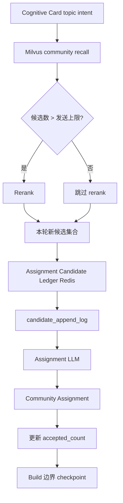

# Community Assignment 候选上下文账本缓存优化实施方案

## 1. 模块目标

Community Assignment 阶段在调用 LLM 前，需要给模型一组候选 community。候选来自 Milvus 召回和 rerank，但发送给 LLM 的候选上下文必须尽量稳定，避免候选顺序、动态摘要和请求字段变化导致 DeepSeek 前缀缓存失效。

本方案实现 `Assignment Candidate Ledger`：

- 候选上下文以单一 `candidate_append_log` 形式发送给 LLM。
- 候选第一次进入账本时写入 `candidate_base`。
- 当前实验版不发送 `candidate_update`，只用稳定 `candidate_base` 作为 LLM 候选上下文。
- 账本过大时按热点计数 checkpoint。
- 账本只影响 prompt 上下文稳定性，不替代 Assignment LLM 的归档裁决。

## 2. 模块边界

本模块负责：

- 维护 Redis 中的候选 append log。
- 维护 `retrieved_count` 和 `accepted_count`。
- 根据阈值执行 checkpoint。
- 组装稳定的 Assignment prompt。
- 输出候选账本相关 trace 诊断字段。

本模块不负责：

- 判断 topic intent 应归属哪个 community。
- 替代 Milvus 召回或 rerank。
- 做全局 community maintenance。
- 做 community rename / merge / scope 变更治理。
- 做 L1 / L2 自动拆分。

## 3. 运行时架构



最终发送给 LLM 的候选上下文不是只包含本轮 RAG 结果，而是：

```text
仍然 active 的历史账本前缀 + 本轮新增候选
```

## 4. Redis 状态设计

Redis key：

```text
kg:assignment_candidate_ledger:{target}:{adapter_name}
```

Redis value 是 JSON object，包含：

```text
schema_version
candidate_append_log
candidate_stats
candidate_counters
checkpoint_meta
```

字段职责：

| 字段 | 说明 |
|---|---|
| schema_version | 账本结构版本，不匹配时丢弃旧账本重新开始。 |
| candidate_append_log | 单一候选追加日志。 |
| candidate_stats | 用于判断 candidate 是否产生新增变化。 |
| candidate_counters | `retrieved_count` / `accepted_count` 热点计数。 |
| checkpoint_meta | 最近一次 checkpoint / overlap skip 的状态与计数。 |

Redis 使用 TTL。Redis key 不存在或过期时，只要 Redis 服务可用，就从当前 RAG 候选重新初始化 ledger。

Redis 服务不可用，或 Assignment Builder 未配置 Candidate Ledger 时，必须直接抛出异常并终止本轮 Community Assignment，不能 fallback 到“只使用本轮候选”。Candidate Ledger 是 Assignment prompt 稳定性的强依赖，静默 fallback 会让系统看起来可运行，但实际没有执行只追加账本策略。

## 5. candidate_append_log

append log 当前只发送 `candidate_base` 条目。

### 5.1 candidate_base

community 第一次进入 ledger 时追加。

包含稳定目录信息：

- community_id
- title
- scope
- include_rules
- exclude_rules
- canonical_labels
- granularity_note
- absorbed_subtopics
- maturity

字段保持扁平，不使用嵌套 `dynamic_context`。空字段不发送，尤其是空的 `include_rules` / `exclude_rules`。

`candidate_base` 一旦写入，不在中间改写、不重排。

### 5.2 candidate_update

当前实验版禁用 `candidate_update` 入 prompt。

禁用原因：

- 实测中模型会引用 update 中的历史细节作为归档依据。
- 具体公司、单笔交易、产品、数字事实容易污染长期 community 边界。
- candidate update 会拉长 prompt，增加 miss 成本和判断噪声。

旧 Redis ledger 中已有的 `candidate_update` 在加载压缩时直接丢弃，不再发送给 Assignment LLM。

## 6. Assignment Prompt 结构

prompt 顶层字段固定为：

```text
candidate_append_log
topic_intent
max_attach
```

顺序要求：

1. `candidate_append_log` 放最前。
2. `topic_intent` 放后面。
3. `max_attach` 放最后。

`source_id`、`chunk_id`、trace id 等诊断字段不进入 prompt，只进入 metadata / trace。

## 7. 关键流程

每个 topic intent 执行：

1. 用 topic intent 做 Milvus community 召回。
2. 如果候选数超过发送上限，调用 rerank；否则跳过 rerank。
3. 对本轮新候选按稳定 `community_id` 排序。
4. 读取 Redis ledger。
5. 新 candidate 追加 `candidate_base`。
6. 已存在 candidate 只更新 stats 和 retrieved_count，不追加 candidate_update。
7. 发送给 LLM 前过滤掉已不在 active community 集合中的陈旧 ID。
8. 调用 Assignment LLM。
9. 对 `attach_existing` 的 community 增加 `accepted_count`。

checkpoint 不在单个 topic intent 的 Assignment 调用之间执行。Community Builder 只在 build 开始和 build 结束两个边界调用 checkpoint：

- build 开始 checkpoint 用于压缩上一轮遗留的过大账本。
- build 结束 checkpoint 使用本轮累计的 retrieved / accepted 计数，为下一轮准备更短且稳定的账本。

这样可以避免同一轮 build 中间重建 append log，导致后续 Assignment 请求只有 system prompt 命中缓存、候选上下文大段 miss。

如果 Redis 读写失败，流程直接失败并暴露异常。

## 8. Checkpoint 策略

触发条件：

- `candidate_base` 数超过 30。
- `candidate_base` 字符数超过长度预算。
- ledger schema version 不匹配。
- Redis key 不存在或过期。

`candidate_update` 不进入当前 append log。checkpoint 只由 `candidate_base` 数量和 base 字符数触发。

checkpoint 选择：

1. 按 `accepted_count` 降序。
2. 再按 `retrieved_count` 降序。
3. 再按首次进入账本顺序稳定排序。
4. 保留 Top 10 热点候选。
5. 本轮新召回但不在 Top 10 的候选继续保留。
6. 对最终保留集合按稳定 `community_id` 排序写回 append log，不能按热点分排序写入 prompt。
7. 清空本轮热点计数。

如果 checkpoint 后的新候选集合与旧账本前缀重叠率大于 70%，且 append log 没有超过硬长度预算，则跳过重建，继续复用旧账本。

## 9. Trace 指标

Assignment LLM metadata 需要包含：

- raw_candidate_count
- deduped_candidate_count
- prompt_candidate_count
- duplicate_candidate_count
- prompt_candidate_id_sample
- candidate_ledger.redis_available
- candidate_ledger.appended_base
- candidate_ledger.appended_update（当前实验版应始终为 0）
- candidate_ledger.checkpointed
- candidate_ledger.checkpoint_skipped_by_overlap
- candidate_ledger.candidate_append_log_entries
- candidate_ledger.candidate_append_log_base_count
- candidate_ledger.candidate_append_log_update_count（当前实验版应始终为 0）

这些指标用于判断缓存优化是否生效，以及是否存在候选污染或账本过大问题。

## 10. 测试用例

单元测试：

| 用例 | 验证内容 |
|---|---|
| `test_candidate_ledger_uses_single_append_log_without_reordering_or_midstream_updates` | 候选只追加、不重排，candidate_update 不进入账本。 |
| `test_candidate_ledger_checkpoint_skips_rebuild_when_hot_prefix_overlap_is_high` | checkpoint 后与旧前缀重叠率高于 70% 时跳过重建。 |
| `test_candidate_ledger_checkpoint_rebuilds_when_hot_prefix_overlap_is_low` | 低重叠时执行 checkpoint 并保留热点候选。 |
| `test_community_builder_defers_candidate_checkpoint_between_assignment_calls` | 单次 build 内 Assignment 调用之间不触发 checkpoint，checkpoint 只在 build 边界记录。 |
| `test_assignment_prompt_keeps_active_ledger_prefix_even_when_not_recalled_this_turn` | 本轮未召回但仍 active 的历史候选可作为稳定前缀。 |
| `test_assignment_prompt_uses_persistent_prefix_order_and_slim_candidate_fields` | prompt 只包含 `candidate_append_log/topic_intent/max_attach`，候选字段保持精简。 |
| `test_assignment_prompt_caps_reranked_candidates_sent_to_llm` | rerank 后发送候选数不超过上限。 |
| `test_assignment_skips_rerank_when_candidate_count_is_at_prompt_cap` | 候选数小于等于发送上限时跳过 rerank。 |
| `test_community_builder_raises_when_candidate_ledger_redis_unavailable` | Redis 不可用时直接失败，不允许 fallback。 |

集成验证：

- 运行 `7_kg_write_path_demo.py`，检查 `llm:kg_community_assignment` 的 prompt 是否为 `candidate_append_log` 在前。
- 对比两次相近输入的 `prompt_cache_hit_tokens / input_tokens`。
- 检查 Redis ledger 是否出现 `checkpoint_meta`。
- 检查 `kg_graph_communities` 中 active community 与 prompt 候选 ID 是否一致。

## 11. 实现状态

当前实现已覆盖本文描述的第一版能力：

- Redis Candidate Ledger。
- Redis 不可用直接失败。
- append-only `candidate_append_log`。
- `candidate_base` 账本；`candidate_update` 暂不发送给 LLM。
- retrieved / accepted 计数。
- checkpoint 和 70% overlap skip。
- build 边界 checkpoint，Assignment 调用之间不重建账本。
- active community 过滤。
- Assignment prompt 字段顺序稳定。
- trace metadata 输出。

如后续引入 rename / merge / scope 变更治理，需要升级 ledger schema version，并同步更新本实施文档和设计文档。
