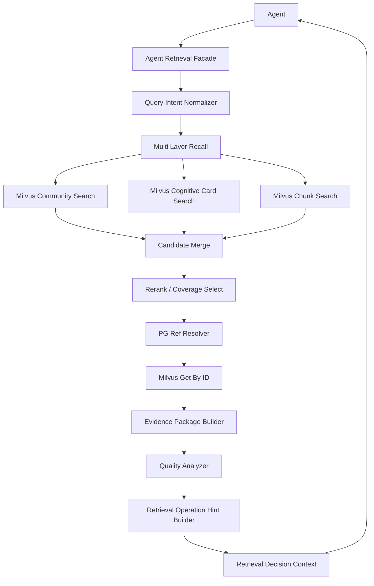
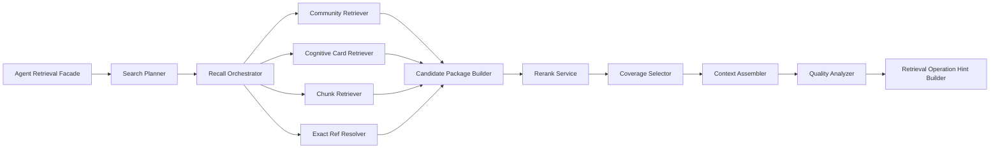
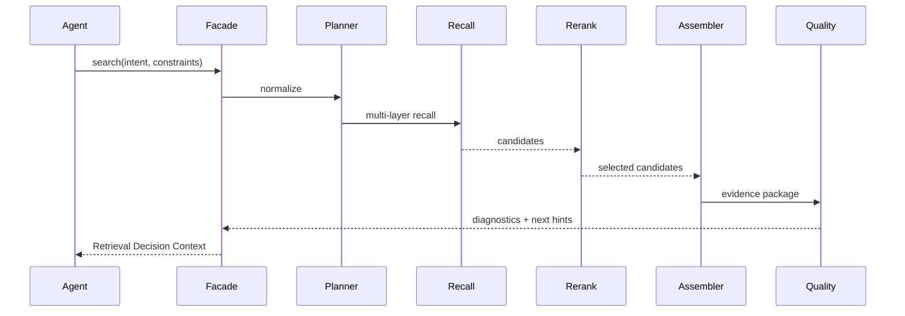
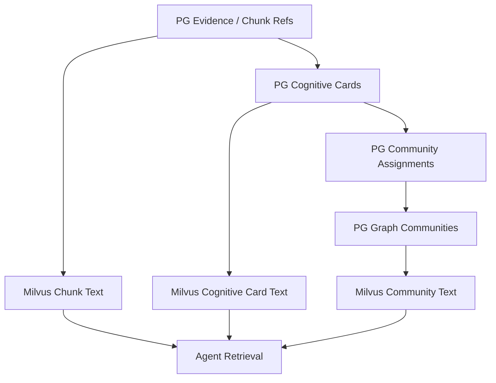

# Agent 检索与决策上下文实施方案

## 1. 模块目标

本模块承接写入链路已经跑通后的检索阶段。

目标是提供一套面向 Agent 的知识检索运行时，让 Agent 能够通过工具调用完成：

- 搜索高维 Community；
- 搜索局部 Cognitive Card；
- 搜索原始 evidence / chunk；
- 打开或展开命中结果；
- 根据检索质量诊断决定是否继续搜索、打开上下文或调整查询。

本模块不负责最终金融结论生成，也不直接给交易建议。它只交付可追溯的检索结果、覆盖摘要、质量诊断和检索操作提示。

## 2. 模块边界

### 2.1 覆盖范围

本实施方案覆盖：

- Agent 检索入口；
- Query Intent 归一化；
- Community / Cognitive Card / Chunk 多层召回；
- Milvus 语义召回和按 ID 取回；
- PG 引用关系展开；
- 结果合并、去重、重排和预算控制；
- Retrieval Decision Context 组装；
- search / open / expand / refine 工具能力；
- Langfuse trace 与本地质量指标。

### 2.2 不覆盖范围

第一阶段不覆盖：

- 自动生成最终投研报告；
- 自动交易决策；
- 全局 Community Maintenance；
- L1 / L2 自动拆分；
- 恢复旧 node / edge 主链路；
- 让 LLM 在检索阶段重新抽取 Cognitive Card。

## 3. 加入新能力后的整体系统架构

核心依赖：

| 组件 | 职责 |
|---|---|
| PG | 保存 evidence、chunk refs、Cognitive Card、Community、Assignment 等事实和引用关系。 |
| Milvus | 保存可读 chunk/card/community 文本，负责语义召回和按 ID 精准取回。 |
| Reranker | 对召回结果做相关性精排。 |
| Agent Retrieval Facade | 面向 Agent 暴露 search / open / expand / refine。 |

遵守现有约束：PG 不保存完整 chunk/card text，Milvus 是可读检索层。

## 4. 模块职责架构

### 4.1 Agent Retrieval Facade

统一承接 Agent 工具请求。

职责：

- 接收 Agent 的搜索意图和约束；
- 管理同一 Agent session 下的多轮检索；
- 返回统一 Retrieval Decision Context；
- 记录 search / open / expand / refine 的 trace。

### 4.2 Search Planner

将 Agent 输入归一成可执行检索计划。

职责：

- 识别查询偏向：主题探索、证据查找、风险补搜、主体收窄、时间范围约束；
- 判断应优先召回 community、cognitive card 还是 chunk；
- 设置召回预算和 rerank 预算；
- 保留 Agent 原始意图，供结果解释和 trace 使用。

### 4.3 Recall Orchestrator

并行调度多层召回。

| 层 | 入口 |
|---|---|
| Community | 主题级语义召回，适合宏观主线、跨资料问题。 |
| Cognitive Card | 认知信号召回，适合主题、风险、影响、主体等局部信号。 |
| Chunk | 原始证据召回，适合精确事实和引用。 |
| Exact Ref | Agent 已有 ID 时，直接按 ID 打开或展开。 |

### 4.4 Candidate Package Builder

将不同层级的召回结果统一为候选包。

候选包需要保留：

- 命中层级；
- 可读标题和摘要；
- 相关原因；
- 可追溯 refs；
- 原始通道分数和 rerank 分数；
- 可展开入口。

候选包不是最终响应，只是后续去重、重排和组装的中间对象。

### 4.5 Context Assembler

将候选包组装为 Agent 可读的 Evidence Package。

组装原则：

- 先展示高价值 community / card，再展示支撑 chunk；
- 每个高层命中都必须有可展开路径；
- 每个可引用事实都必须能回到 evidence / chunk；
- 相同 evidence 的重复 chunk 要合并展示；
- 超预算时优先保留多样性和证据链完整性。

### 4.6 Quality Analyzer

对本次检索结果做质量诊断。

| 维度 | 说明 |
|---|---|
| relevance | top results 是否和查询意图匹配。 |
| coverage | 是否覆盖主题、风险、影响对象、主体和时间线索。 |
| evidence_sufficiency | 是否有足够原始证据支撑。 |
| diversity | 是否过度集中在单一 source 或单一 community。 |
| information_redundancy | 基础 ID 去重后，结果是否仍然集中在同一子方向或同一类信息上，导致覆盖不足。 |
| conflict | 是否存在明显冲突或方向不一致。 |
| freshness | 是否命中新近 evidence，时间范围是否符合要求。 |
| expandability | 是否能继续打开上下文。 |

### 4.7 Retrieval Operation Hint Builder

根据质量诊断生成检索操作提示。

检索系统不知道业务方完整目标，不能输出“应该采用”“应该交易”“业务上还缺什么”这类判断。它只能基于本次查询显式约束和召回结果结构，提示 Agent 可以执行哪些检索操作。

| 类型 | 说明 |
|---|---|
| no_more_retrieval_needed | 当前检索结果没有明显检索层缺口；是否采用由 Agent 自己判断。 |
| open_result | 建议打开某个 community/card/chunk。 |
| expand_context | 建议展开前后文或 community 支撑材料。 |
| refine_query | 建议收窄、放宽或改写查询。 |
| refine_uncovered_observed_aspect | 在 Agent 显式关心某个侧面时，如果当前结果没有覆盖该侧面，提示按该侧面 refine。 |

建议只辅助 Agent 决策，不强制执行。

## 5. 关键流程

### 5.1 search 流程

### 5.2 open 流程

open 用于 Agent 已经拿到某个命中 ID，需要读取更完整上下文。

支持打开：

- community：返回主题摘要、支撑 card、支撑 evidence 分布；
- cognitive card：返回局部认知信号、支撑 chunk、所属 community；
- chunk：返回原文片段、相邻 chunk、同 evidence 上下文。

open 不重新做全局搜索，只做精准取回和上下文装配。

### 5.3 expand 流程

expand 用于从一个命中继续向外展开。

| 起点 | 可展开方向 |
|---|---|
| Community | assignments、cards、chunks、source 列表。 |
| Cognitive Card | primary chunk、neighbor chunks、same evidence chunks、assigned communities。 |
| Chunk | previous / next chunk、same evidence、related cards。 |

### 5.4 refine 流程

refine 用于 Agent 基于上一轮结果继续搜索。

系统应接收上一轮 retrieval context 的摘要，而不是要求 Agent 重新塞回全部结果。refine 的核心是复用上一轮的 query intent、命中对象和可观测检索缺口，生成下一轮 search plan。

## 6. 数据 / 索引 / 状态生命周期

生命周期原则：

1. 写入阶段生成和刷新 Milvus chunk/card/community 文档。
2. 查询阶段不重新抽取 Cognitive Card。
3. PG 用于引用关系和状态判断。
4. Milvus 用于语义召回和可读内容取回。
5. 检索 trace 记录 Agent session 内每次 search/open/expand/refine。

## 7. 方案选型和边界

### 7.1 为什么不是只搜 chunk

只搜 chunk 容易命中局部片段，缺少高维主线和跨资料理解。Agent 需要先看到 community 和 card 层，才能判断当前结果是否覆盖完整。

### 7.2 为什么不是只搜 community

Community 是导航入口，不是最终证据。只搜 community 会缺少可引用证据，也无法核验具体事实。

### 7.3 为什么第一阶段不让 LLM 做检索裁决主链路

写入阶段已经用 LLM 生成 Cognitive Card 和 Community Assignment。查询阶段第一版应优先复用这些结构化索引，通过召回、rerank、覆盖诊断和上下文展开完成 Agent 检索。

LLM 可以后续用于复杂 query planning 或结果质量总结，但不作为第一阶段每次检索的强依赖。

### 7.4 结果质量由结构化诊断表达

不要只返回一个综合分。Agent 需要看到质量构成：

- 相关性；
- 覆盖；
- 证据充分性；
- 多样性；
- 冲突；
- 新鲜度；
- 可展开性。

## 8. 迁移路径

### 阶段一：统一 Agent Search 响应

- 在现有检索能力上新增 Retrieval Decision Context。
- 先支持 community / cognitive card / chunk 三层结果合并。
- 返回质量诊断和检索操作提示。

### 阶段二：补齐 open / expand

- 支持 community 展开到 card / chunk。
- 支持 card 展开到 chunk 上下文。
- 支持 chunk 展开邻接和同 evidence。

### 阶段三：加入 refine

- 让 Agent 基于上一轮可观测检索缺口继续检索。
- 记录同一 session 下的检索链路。

### 阶段四：质量评估闭环

- 记录 Agent 最终采用了哪些结果。
- 对比被召回、被打开、被采用的对象。
- 形成检索质量回放集。

## 9. 技术风险与评审关注点

| 风险 | 说明 | 关注点 |
|---|---|---|
| community 质量不足 | 高层主题边界仍可能漂移。 | 检索响应必须允许展开到 card/chunk 核验。 |
| 上下文过长 | 多层结果可能超出 Agent 处理预算。 | 需要预算控制和分层展开。 |
| 诊断越界 | 检索系统如果假装知道业务目标，会误导 Agent。 | 诊断只能表达本次查询和结果结构下的可观测检索状态。 |
| Milvus/PG 不一致 | 索引刷新失败会导致可读文本和 PG refs 不一致。 | search 响应要暴露 stale / missing refs。 |
| trace 不连续 | 多轮检索如果没有同 session，会难以复盘。 | 必须统一 session_id / request_id。 |

## 10. 验证指标

| 指标 | 验证内容 |
|---|---|
| community_hit_rate | 宏观查询是否命中相关 community。 |
| card_hit_rate | 局部认知查询是否命中相关 Cognitive Card。 |
| evidence_traceability | 最终结果是否能回到 evidence / chunk。 |
| context_open_success | open / expand 是否能稳定取回上下文。 |
| coverage_quality | 结果是否覆盖主题、风险、影响对象和主体。 |
| retrieval_operation_hint_accuracy | 检索操作提示是否能帮助 Agent 做合理搜索决策。 |
| duplicate_rate | 返回结果是否重复堆叠。 |
| latency | search / open / expand 的耗时是否可接受。 |

## 11. 测试用例

### 11.1 单元测试

| 用例 | 验证内容 |
|---|---|
| query_intent_normalization | Agent 输入能被归一成检索计划。 |
| candidate_package_merge | 不同层级召回结果能正确合并和保留 refs。 |
| duplicate_collapse | 同 evidence / chunk 的重复命中能合并。 |
| information_redundancy_diagnostics | ID 去重后的同质化结果能被诊断为覆盖不足，而不是误判为资料充分。 |
| quality_diagnostics | 覆盖、证据充分性、多样性和可观测检索缺口能被正确计算。 |
| retrieval_operation_hints | 不同质量状态能生成合理检索操作提示。 |

### 11.2 集成测试

| 用例 | 验证内容 |
|---|---|
| search_macro_theme | 查询宏观主题时返回 community + card + chunk。 |
| search_local_evidence | 查询具体事实时优先返回 chunk，并补充 card/community 上下文。 |
| open_community | 打开 community 能取回支撑 cards 和 chunks。 |
| expand_chunk_context | chunk 能展开 previous / next / same evidence。 |
| refine_uncovered_risk_when_requested | 当 Agent 显式关心风险且当前结果未覆盖风险信号时，支持继续 refine。 |

### 11.3 回放测试

选取已经写入的真实 `ft_news` 样本，验证：

- AI 算力链查询；
- 并购重组查询；
- 地缘政治与能源风险查询；
- 大宗商品供需冲击查询；
- 政策监管与产业扶持查询；
- 公司业绩与产业景气查询。

每类问题都需要检查是否命中正确 community、是否返回支撑 Cognitive Card、是否能打开原文 evidence，以及 Agent 是否能根据质量诊断判断检索层下一步。

## 12. 待确认问题

1. Retrieval Decision Context 的默认 token 预算是多少。
2. search 首轮是否默认返回 community 优先，还是由 query intent 决定。
3. refine 是否需要单独持久化 working set。
4. 检索操作提示是否需要引入 LLM 做自然语言压缩。
5. Agent 最终采用结果的反馈是否写入检索质量评估表。
