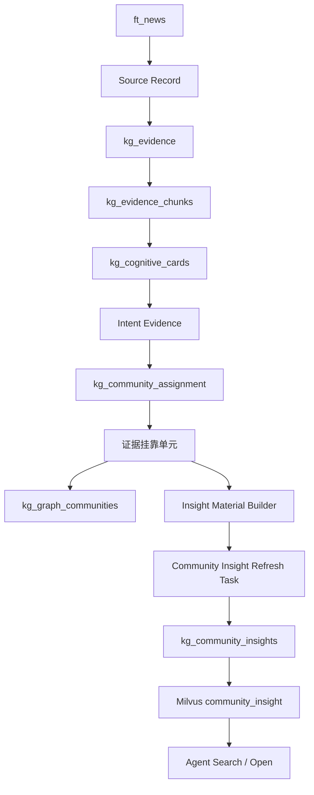
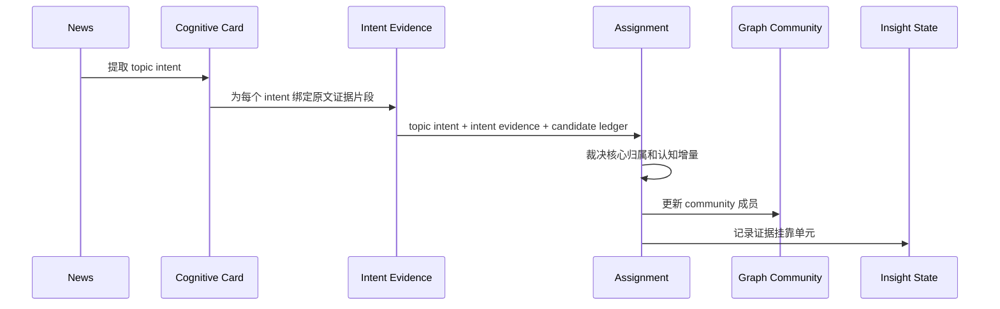
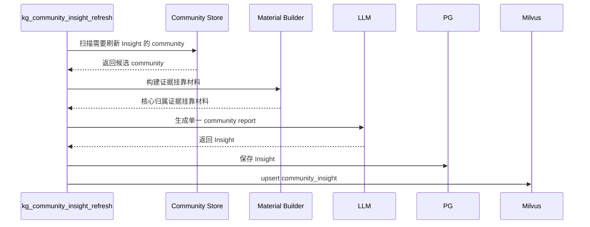

# Community Insight 证据归属与高级认知索引实施方案

## 1. 模块目标

本方案承接 `docs/5. 设计方案/1. 知识图谱/21. Community Insight高级认知索引设计方案.md`，说明如何把 Community Insight 从“基于 community 成员全文的后置总结”改造成“基于 intent 级证据挂靠单元的高级认知报告”。

核心目标：

- 在 `kg_cognitive_card` 阶段为每个 topic intent 提取原文证据片段；
- 在 `kg_community_assignment` 阶段消费 intent evidence，而不是重新读取完整原文；
- 在每次挂靠时记录该挂靠的证据片段、归属理由和认知增量；
- 让 Insight 只聚合已经裁决过的证据挂靠单元；
- 保留多挂靠能力，但每个挂靠都必须满足核心归属；
- 避免 Insight 阶段二次拆分 community；
- 让 Agent 可以直接检索并阅读高级认知报告。

## 2. 模块边界

### 2.1 覆盖范围

本方案覆盖：

- cognitive card 输出材料升级；
- assignment 裁决输入材料收敛；
- assignment 输出中的证据挂靠信息；
- community 成员和 Insight 材料池的关系；
- Insight 刷新任务；
- Insight 到 Milvus 的检索发布；
- 质量观测、回放和测试用例。

### 2.2 不覆盖范围

本方案不覆盖：

- 重新设计整个 community bucket planning；
- 在 Insight 阶段拆分已有 community；
- 用规则硬编码行业主题边界；
- 为 singleton community 强制生成 Insight；
- 把完整 chunk/card text 存入 PG；
- 替代现有 Agent 检索协议。

## 3. 加入新能力后的整体系统架构

关键依赖方向：

- 原文只进入 Cognitive Card 提取阶段；PG 只保存事实、关系和必要指针，不保存完整 chunk/card text。
- assignment 决策消费 topic intent 和 intent evidence，不从 Milvus 或 PG 重新取完整原文。
- Insight 生成不直接依赖整段全文，而依赖 assignment 产生的证据挂靠单元。
- `knowledge_tasks.py` 是任务入口，业务处理放在 application service 层。

## 4. 模块职责架构

### 4.1 Cognitive Card Intent Evidence Extractor

职责：

- 在 Cognitive Card 提取阶段读取原始 chunk；
- 为每个 topic intent 输出独立的证据片段；
- 为每个证据片段输出 evidence claim、支撑强度和时间接地信息；
- 保证后续 assignment 能引用 intent evidence，而不是重新读取完整原文；
- 保留 card 级 supporting_text 作为补充，但不能替代 intent 级 evidence。

它不负责：

- 判断 community 归属；
- 生成 Insight 报告；
- 写入 community。

### 4.2 Assignment Prompt Composer

职责：

- 组合 topic intent、intent evidence 和候选 community 账本；
- 明确要求模型基于 intent evidence 判断挂靠；
- 只允许模型输出核心归属挂靠；
- 控制 prompt 预算，避免破坏候选账本缓存收益。

提示词原则：

- 不提供行业固定示例，避免模型产生领域偏好；
- 不要求输出长报告；
- 强制说明归属必须引用 intent evidence；
- 如果只能说明“相关”但不能说明“认知增量”，必须拒绝挂靠；
- 如果候选 community 的 scope 需要被放宽才能容纳当前证据，必须拒绝挂靠或创建更合适的 community。

### 4.3 Assignment Decision Validator

职责：

- 校验 assignment 输出引用的 community 必须来自候选或新建结果；
- 校验核心证据必须引用 intent evidence；
- 校验核心证据必须有对 community 的认知增量；
- 校验非核心、背景、相邻、泛化关联不能进入 community。

Validator 只做结构和一致性校验，不做行业死规则裁决。

### 4.4 Community Assignment Writer

职责：

- 保存 assignment 决策；
- 保存每次挂靠对应的证据挂靠单元；
- 更新 community 成员集合；
- 在 community 被更新后标记 Insight 可能需要刷新。

PG 只保存结构化挂靠信息和证据指针，不保存完整 chunk 文本。

### 4.5 Insight Material Builder

职责：

- 从 community 当前有效成员中收集证据挂靠单元；
- 只收集已通过核心归属裁决的证据挂靠单元；
- 为 Insight LLM 生成紧凑输入材料；
- 控制每个 community 的材料预算。

它不重新读取所有 chunk 全文作为主体材料；只有在需要核验证据片段时，才按指针定位有限文本，并且核验文本不作为新的归属依据。

### 4.6 Community Insight Refresh Service

职责：

- 判断 community 是否需要生成或刷新 Insight；
- 首次符合条件时尽快生成；
- 已有 Insight 的 community 在更新后等待稳定窗口再刷新；
- 执行 LLM 报告生成；
- 保存 Insight 结果；
- 发布 Milvus community_insight target；
- 记录 Langfuse trace 和质量指标。

### 4.7 Knowledge Task 入口

`src/interfaces/tasks/knowledge_tasks.py` 需要提供稳定任务入口。

任务入口只负责：

- 接收触发；
- 调用 application service；
- 记录任务日志；
- 返回统计结果。

它不承载业务编排细节，不直接写数据库，不直接拼接 Insight prompt。

## 5. 关键流程

### 5.1 写入主链路

### 5.2 Insight 异步刷新流程

### 5.3 多挂靠处理流程

同一个 chunk 如果挂靠多个 community，每个挂靠关系都独立记录：

- 对当前 community 有关的原文证据片段；
- 对当前 community 有关的 intent evidence；
- 对当前 community 的认知增量；
- 当前挂靠权重和置信度。

Insight 生成时只消费“本 community 的核心挂靠视角”，不会把同一个 chunk 的全部信息带入所有 community。

### 5.4 非核心挂靠拒绝流程

如果 assignment 发现当前 intent evidence 只能说明相关、背景、相邻影响、上位行业、市场情绪或泛化关联，则必须拒绝挂靠。拒绝结果不进入 community，也不进入 Insight 材料池。

当 Insight 无法围绕一个稳定问题域形成报告时，需要回到 assignment / merge 机制排查错误挂靠，而不是在 Insight 阶段做质量提示或降权处理。

## 6. 数据 / 索引 / 状态生命周期

### 6.1 证据挂靠单元生命周期

证据挂靠单元由 assignment 产生，随 community 成员关系生效。

它的状态跟随 assignment：

- assignment 生效时，挂靠单元可被 Insight 消费；
- assignment 被合并迁移时，挂靠单元随目标 community 重定向；
- community 被物理删除或合并后，旧挂靠单元退出当前 Insight 材料池；
- 历史审计不是当前目标，但 trace 应能回放关键决策。

### 6.2 Insight 生命周期

Insight 生命周期由 community 更新驱动：

- community 首次满足多来源 / 多 card 条件时，直接进入首次生成；
- community 已有 Insight 后，更新触发 stale 标记；
- stale 状态等待稳定窗口后刷新；
- 刷新成功后递增 Insight 版本并更新最后生成时间；
- 刷新失败不递增版本，按任务重试策略处理。

### 6.3 Milvus target 生命周期

Milvus 保存可直接检索和阅读的完整 Insight 报告。

发布规则：

- 使用独立 target_type 或独立 collection 承载 community_insight；
- 使用稳定 target_id；
- 刷新使用 upsert；
- 删除或失效 community 时，对应 target 退出可检索状态。

## 7. 方案选型和边界

### 7.1 为什么不在 Insight 阶段拆分 community

拆分意味着否定上游 assignment / merge 的边界判断。如果允许 Insight 拆分，就会形成两个主题系统：一个是 community 归属系统，另一个是 Insight 内部主题系统。Agent 查询时会面对两套边界，复杂度和不一致风险都会上升。

因此 Insight 只负责报告，不负责拆分。

### 7.2 为什么原文证据必须前移到 Cognitive Card

Cognitive Card 是唯一应该读取完整原文并完成主题意图提取的阶段。如果 assignment 再读取完整原文，它会变成第二个抽取器，导致职责重叠、成本上升和缓存不稳定。

正确做法是让 Cognitive Card 在抽取 topic intent 时同步输出 intent evidence。这样 assignment 至少可以做到：

- 用 intent evidence 支撑挂靠；
- 对不同 community 引用不同 intent evidence；
- 避免将完整原文中的无关信息带入目标 community；
- 为 Insight 提供可审计材料。

### 7.3 为什么不把完整全文放进 Insight

完整全文会带来主题稀释。多挂靠场景下，同一段全文会在多个 community 中反复参与总结，导致每个报告都吸收大量相邻信息。

Insight 应消费已裁决的证据挂靠单元，而不是重新从全文里做主题归纳。

### 7.4 为什么仍保留多挂靠

金融新闻经常同时影响多个主题。禁止多挂靠会损失检索召回和跨主题关系。

真正的问题不是多挂靠，而是多挂靠缺少核心归属约束。保留多挂靠，但要求每个挂靠都独立满足核心归属，可以同时保证召回和报告纯度。

## 8. 迁移路径

### 8.1 第一阶段：补齐 Cognitive Card intent evidence

目标：

- 在每个 topic intent 中加入 evidence span、evidence claim、evidence role 和 evidence confidence；
- 保持 card 提取阶段读取完整原文，assignment 阶段不读取完整原文；
- Langfuse 中能看到 card 阶段生成的 intent evidence。

### 8.2 第二阶段：记录证据挂靠单元

目标：

- assignment 输出核心归属判断、引用的 intent evidence、claim 和认知增量；
- 保存到 assignment 决策结构或独立挂靠材料结构；
- 当前 Insight 生成能够读取这些材料。

### 8.3 第三阶段：Insight 改为消费挂靠材料

目标：

- Insight 材料不再以全文或 card 大字段为主；
- 主体报告只消费核心归属挂靠材料；
- Insight 不再输出多个独立主线。

### 8.4 第四阶段：质量治理闭环

目标：

- 统计每个 community 的核心归属挂靠数量、低置信拒绝数量和错误挂靠回放结果；
- 将异常 community 纳入 assignment / merge 回放；
- 用真实 trace 和数据库样本验证边界质量。

## 9. 技术风险与评审关注点

| 风险 | 关注点 | 处理方向 |
| --- | --- | --- |
| card 输出 token 增加 | 每个 intent 增加 evidence 后可能变长 | 限制 evidence span 为短句，claim 保持单句 |
| assignment prompt 膨胀 | intent evidence 会增加裁决输入 | 只传当前 intent 的证据，不传完整 chunk 原文 |
| 模型摘取证据不准 | evidence span 可能引用不完整 | 在 card 阶段校验非空、长度和与原文可匹配 |
| 核心归属判断不稳定 | assignment 可能把弱相关内容误挂靠 | 用回放样本和 trace 做质量评估，不写行业死规则 |
| 历史数据缺失挂靠材料 | 老 assignment 没有 evidence span | 旧数据可降级使用 reason / supporting_text，但必须标记为低置信材料 |
| Insight 仍然割裂 | community 过粗或挂靠污染 | 不在 Insight 拆分或提示，直接回到上游治理 |

## 10. 验证指标

### 10.1 写入侧指标

- topic intent 中包含 intent evidence 的比例；
- 核心挂靠中 evidence span 非空比例；
- evidence span 能在原始 chunk 中匹配的比例；
- 单次 card 输出 token 增量；
- 单次 assignment 输入 token 增量；
- LLM cache 命中率变化。

### 10.2 Insight 质量指标

- Insight 主体引用核心证据的比例；
- 弱相关材料进入主体结论的比例应降低；
- 报告中出现多个互不相关主线的比例应降低；
- 报告中无证据泛化判断的比例应降低；
- Agent 评估中“可直接使用”的比例应提升。

### 10.3 community 边界指标

- 每个 community 的核心归属挂靠数量；
- 低权重挂靠数量；
- 被回放判定为错误挂靠的数量。

## 11. 测试用例

### 11.1 单元测试

| 用例 | 验证内容 |
| --- | --- |
| cognitive_card_intent_includes_evidence | 每个 topic intent 包含 intent evidence。 |
| assignment_prompt_uses_intent_evidence | assignment prompt 使用 intent evidence，不包含完整原文。 |
| assignment_core_requires_intent_evidence | 核心挂靠必须引用 intent evidence。 |
| assignment_rejects_related_context | 相关、背景、相邻影响、泛化关联不会进入 community。 |
| multi_attach_has_independent_evidence | 同一 chunk 多挂靠时，每个 community 有独立 intent evidence 和认知增量。 |

### 11.2 集成测试

| 用例 | 验证内容 |
| --- | --- |
| kg_write_path_intent_evidence_trace | 运行写入链路后，Langfuse 能看到 card 阶段的 intent evidence 和 assignment 输出挂靠材料。 |
| community_insight_uses_assignment_materials | Insight 生成输入来自证据挂靠单元，而不是整段全文集合。 |
| community_insight_single_report | Insight 对一个 community 只生成单一报告，不输出多个独立主线。 |
| weak_related_context_rejected_before_insight | 弱相关多挂靠材料在 assignment 阶段被拒绝，不进入 Insight。 |

### 11.3 回归测试

| 用例 | 验证内容 |
| --- | --- |
| semiconductor_broad_topic_regression | 对半导体宽主题样本回放，检查报告是否围绕统一 community contract，而不是按材料来源拆主线。 |
| natural_disaster_merge_regression | 对自然灾害相近主题回放，检查合并后 Insight 不再二次拆分。 |
| cls_multi_event_news_regression | 对一条新闻多事件样本回放，检查不同 community 使用不同证据片段。 |

## 12. 待确认问题

1. intent evidence 是否必须逐字出现在原文中，还是允许短句摘取后做轻微规范化。
2. card 级 supporting_text 是否保留为补充字段，还是完全迁移到 intent evidence。
3. 旧 assignment 数据缺失 evidence span 时，是否需要后台补跑。
4. 证据挂靠单元是继续放在 assignment decision JSON 中，还是独立成表以便查询和统计。
5. Insight 刷新任务的稳定窗口和批量大小需要根据真实运行成本校准。
