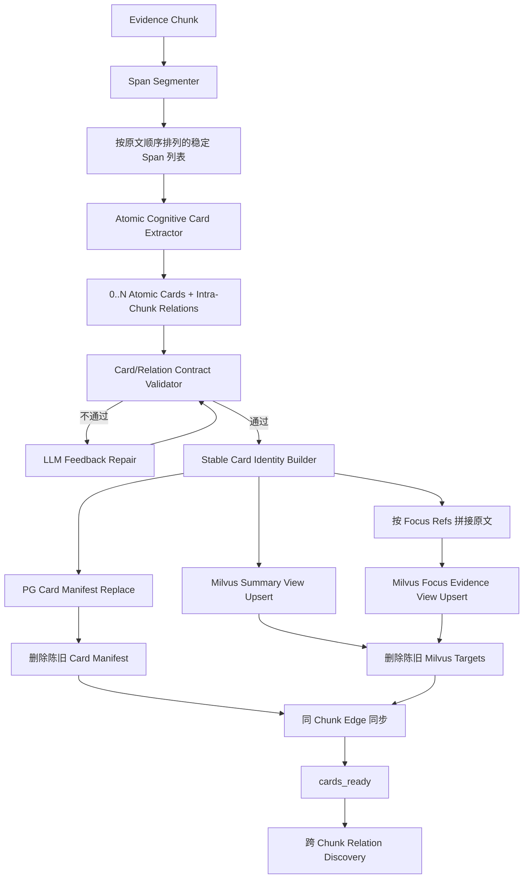
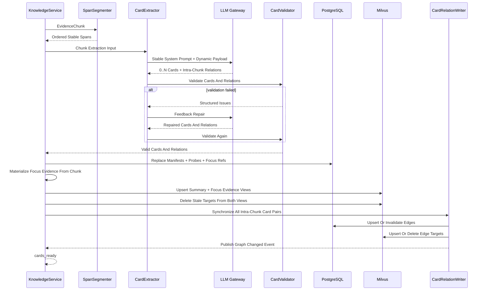

# 原子 Cognitive Card、Relation Probe 与同 Chunk Relation 提取实施方案

## 1. 模块目标

本方案承接：

`docs/5. 设计方案/1. 知识图谱/22. 关系优先Graph Community重构设计方案.md`

本阶段实施关系优先重构的第一段链路：把 Evidence Chunk 转换为原子 Cognitive Card，并在同一次 LLM 调用中完成每张 Card 的 Relation Probe 和同 Chunk Card 关系提取。Probe 只定义跨 Chunk 候选搜索方向，正式跨 Chunk 关系仍交给下一阶段召回、筛选和原文核验。

阶段目标是：

- 一个 Chunk 可以提取零个、一个或多个原子 Cognitive Card；
- 一个 Card 只表达一个可以独立判断、独立检索、独立建立关系的事件或事实主张；
- 每个 Card 使用忠实 Summary 作为主要语义检索文本；
- 每个 Card 能通过稳定 Span Ref 回到支撑它的原文位置；
- 每个 Card 动态生成零到多个跨 Chunk Relation Probe；
- 同一次 LLM 调用先输出经过去重的最终 Card 集合，再基于已输出的 Card ID 和当前原文输出同 Chunk 正关系；
- Card manifest、Focus Evidence 引用和 Relation Probe 写入 PostgreSQL；
- 同 Chunk 正关系复用正式 Card Relation Edge 写入链路，直接同步到 PostgreSQL、Milvus 和图变化事件；
- 根据 `focus_evidence_refs` 从当前 Chunk 确定性拼接 Focus Evidence 原文，并与 Summary 分别发布为 Milvus 独立语义视图；
- 本阶段处理完成后停止，不进入旧 Community Assignment 和 Community Insight 链路。

本阶段完成的标志不是生成 Graph Community，而是形成一批原子、可检索、证据可回溯且带跨 Chunk 搜索方向的 Cognitive Card，并完成同 Chunk 关系建边。

## 2. 模块边界

### 2.1 覆盖范围

本方案覆盖：

- Chunk 原文确定性 Span 切分；
- Cognitive Card LLM 输入和输出契约重构；
- 一 Chunk 到多 Card 的抽取模型；
- 原子 Card Summary；
- 焦点证据引用；
- 每张 Card 的 Relation Probe 动态生成、校验与 PG 持久化；
- 同 Chunk Card 集合去重与正关系提取；
- 同 Chunk关系业务校验、正式 Edge 写入及旧关系撤销；
- Card 业务校验与一次反馈修复；
- Card 稳定身份生成；
- PostgreSQL Card manifest 替换写入；
- Milvus Cognitive Card 文档发布和陈旧文档删除；
- Langfuse 全链路观测；
- Card-only 验证脚本、单元测试、集成测试和真实数据回放；
- 旧 Card 输出结构及旧 Assignment 调用边界退出。

### 2.2 不覆盖范围

本阶段不实施：

- Relation Probe 的实际 RAG 召回；
- 每个 Probe 的 rerank；
- 关系感知 Summary 批量筛选；
- 不同 Primary Chunk 之间的双方原文关系核验；
- 跨 Chunk Observed/Inferred Relation 写入；
- Graph Community 发现；
- Community 高级认知报告；
- 条件性未来推演；
- Agent 对新 Graph Community 的检索消费；
- 旧 Community、Assignment、Insight 历史数据清理；
- 关系模型训练。

### 2.3 阶段运行边界

新 Card Schema 与旧 `topic_intents`、Community Assignment 输入不兼容。本阶段不增加兼容转换，也不把新 Card 再映射回旧主题归档结构。

阶段一链路必须在 Card 持久化和 Milvus 发布后明确停止：

```text
Evidence Chunk
  -> Atomic Cognitive Cards + Intra-Chunk Relations
  -> PG Card manifest + Milvus Card documents
  -> PG/Milvus Card Relation Edge + graph changed event
  -> cards_ready
  -> 跨 Chunk Relation Discovery
```

旧 Assignment、Seed Community、Candidate Ledger、bucket planning 和 Insight 不能继续消费新 Card。第一阶段验收应在受控 target 或专用验证脚本中完成；Card 提取后的跨 Chunk 关系发现由第二阶段链路负责，不能把“只完成 Card”描述为完整知识图谱重构已经上线。

## 3. 当前实现与目标差异

| 维度 | 当前实现 | 第一阶段目标 |
| --- | --- | --- |
| Chunk 与 Card 数量关系 | 一个 Chunk 固定生成一个 Card。 | 一个 Chunk 生成零个、一个或多个 Card。 |
| Card 认知单元 | 一个 Card 内包含多个 `topic_intents`。 | 一个 Card 本身就是一个原子事件或事实主张。 |
| 核心文本 | Card summary + 主题分类字段。 | 单一原子事件 Summary。 |
| 证据表达 | 每个 intent 保存可读 `evidence_span`。 | Card 保存稳定 `focus_evidence_refs`，通过 Span Ref 精确回源。 |
| 辅助字段 | title、宽中细主题、风险、影响对象、事件线等大量归档字段。 | 不预留没有明确消费者的中间结构。 |
| 跨 Chunk 搜索材料 | 与旧主题字段混杂。 | 每张 Card 生成零到多个 Relation Probe，并保留 Summary 基线路由。 |
| 下游 | 提取后立即进入 Community Assignment。 | 同 Chunk Edge 写入完成后，把 Card 交给跨 Chunk Relation Discovery。 |
| PG 文本职责 | 保存大量 Card 可读内容。 | 保存 manifest、Focus Evidence refs/offsets 和 Relation Probe，不保存完整 Chunk/Card 正文。 |
| Milvus 职责 | 保存 Card 语义文档。 | 分别保存 Summary 语义视图和由 refs 拼接出的 Focus Evidence 原文语义视图，支持语义搜索和按 Card ID 精确取回。 |

当前代码的主要改造位置包括：

- `src/domain/knowledge/cognitive_index.py`
  - `CognitiveCard` 领域对象；
  - Card JSON Schema；
  - Card System Prompt；
  - LLM 输出标准化；
  - Card Milvus 文档构建。

- `src/application/services/cognitive_index_service.py`
  - `CognitiveCardExtractor`；
  - 一 Chunk 一结果的并发模型；
  - 校验失败反馈修复；
  - 前缀缓存预热与 Langfuse 观测。

- `src/application/services/knowledge_service.py`
  - `_refresh_cognitive_index`；
  - Card PG 持久化；
  - Card Milvus 发布；
  - 当前 Card 后的 Assignment / Community 调用。

- `src/infrastructure/persistence/models/knowledge.py`
  - `KnowledgeCognitiveCard` ORM。

- `src/infrastructure/persistence/repositories/knowledge_repository_impl.py`
  - Evidence 粒度 Card 替换写入；
  - ORM 与领域对象转换；
  - 旧 Assignment 级联删除耦合。

- `schema/06_knowledge.sql` 与 `schema/13_cognitive_index.sql`
  - `kg_cognitive_cards` 的当前 DDL。

## 4. 第一阶段整体架构



### 4.1 关键依赖方向

- Span Segmenter 不依赖 LLM；
- Card Extractor 只读取当前 Chunk 和来源元数据；
- Relation Probe 与 Card 在同一次请求中生成并随 manifest 持久化，跨 Chunk Relation Discovery 不再额外调用 Probe Planning LLM；
- 同 Chunk关系在 Card 提取调用末尾一次生成，不再经过召回、rerank、Summary 初筛和第二次原文核验；
- Validator 只校验结构、引用和可确定的一致性，不编写领域硬规则；
- PG 负责 Card identity、来源和证据指针；
- Milvus 负责 Summary 与 Focus Evidence 两种可读语义视图及按 Card ID 精确取回；
- 旧 Community Assignment 不再是第一阶段下游。

## 5. 模块职责架构

### 5.1 Span Segmenter

职责：

- 对完整 Chunk 做确定性句子或短段落切分；
- 为每个 Span 生成在当前 Chunk 内稳定的引用编号；
- 保留 Span 到 Chunk offset 的映射；
- 将按原文顺序排列的 Span Ref 与 Span text 作为唯一正文输入发送给 Card Extractor；
- 为 Card Validator 提供引用校验能力。

它不负责：

- 判断事件边界；
- 生成 Card Summary；
- 推断因果关系；
- 生成字符 offset 让 LLM 自行计算。

Span Ref 必须由程序生成，不能让 LLM 输出未经注册的字符坐标。只要 Chunk 内容不变，Span Ref 和 offset 映射就应保持稳定。

### 5.2 Atomic Cognitive Card Extractor

职责：

- 读取发布时间和共同构成完整正文的有序 Span 列表；
- 判断 Chunk 中有多少个可以独立表达的事件或事实主张；
- 为每个原子事件生成独立 Card；
- 为每个 Card 生成忠实 Summary；
- 为每个 Card 选择焦点证据 Span；
- 在输出最终 Card 集合前合并同一原子事实的总述、局部细节和重复表达；
- 在全部 Card 输出后，基于完整集合输出当前原文明示或直接支持的正关系；
- 允许在 Chunk 不包含可用事实时输出零个 Card。

它不负责：

- 召回当前 Chunk 之外的历史 Card；
- 核验跨 Chunk Edge；
- 创建或匹配 Community；
- 生成未来预测。

### 5.3 Card Contract Validator

Validator 负责可确定的结构和证据一致性校验：

- 顶层严格按顺序包含 `cards`、`relations` 和 `skip_reason`；
- Card 使用按输出顺序连续的局部 ID；
- 每个 Card Summary 非空；
- 每个 Card 至少引用一个已注册 Span Ref；
- 所有 `focus_evidence_refs` 都属于当前 Chunk；
- 一个 Card 不引用同一 Chunk 中另一个原子事件作为自己的焦点证据。
- Relation 两端只能引用本次最终 Card；`relation_evidence_refs` 必须属于当前 Chunk，并直接证明两端之间的连接语义；
- 同一 Card 对最多一个关系；同一原子事实不能以 `same_event` 关系代替合并。

Validator 按对象隔离失败：单张 Card 非法时丢弃该 Card 及依赖它的 Relation；单条 Relation 非法时只丢弃该 Relation，并记录丢弃数量与错误原因。只要仍存在合法 Card，就不能因为局部 Relation 错误重试或丢弃整个 Chunk。

Validator 不负责使用关键词黑名单判断行业语义，也不根据固定例子决定是否应该拆 Card。原子性、过度拆分和 Probe 价值需要通过 LLM 质量回放评估，不能伪装成确定性规则已经解决。

### 5.4 LLM Feedback Repair

只有顶层 JSON 不可解析、Card 数组缺失或全部 Card 均无法通过基础契约时，才使用现有 LLM feedback repair 机制进行一次修复。局部 Card 或 Relation 错误不触发 LLM 修复，避免把第二次调用变成常规业务兜底。修复输入应包含：

- 原始结构化输出；
- 明确校验错误；
- 当前 Chunk 的 Span Ref；
- 只修复结构和证据引用、不得补充外部事实的要求。

修复仍不通过时应让当前 Chunk 明确失败，不能生成空壳 Card 或回退到旧 `topic_intents` Schema。

### 5.5 Stable Card Identity Builder

Card identity 必须适应“一 Chunk 多 Card”，不能继续默认一个 Chunk 只有一个 Card。

身份生成应基于稳定证据输入，包括：

- adapter；
- evidence identity；
- primary chunk identity；
- Chunk text hash；
- 焦点 Span 覆盖范围，由最早和最晚 Span Ref 确定；

Summary 是模型生成文本，可能因措辞变化而抖动，不能参与 Card identity，也不能依赖 LLM 输出数组顺序生成永久身份。

Span Segmenter 需要提供稳定子句粒度，使独立原子事件能够选择不同的焦点覆盖范围。Card identity 使用覆盖范围的首尾 Span Ref，避免模型是否补充中间 Span 导致 ID 抖动。同一 Chunk 中两张 Card 如果最终覆盖范围完全相同，Validator 必须判为事件边界未消歧并进入一次 repair；不能再使用模型生成的 Summary 或数组顺序补出不稳定 ID。

第一阶段需要通过重复运行测试验证 Card ID 稳定性。无法稳定的身份策略不能进入后续 Edge 建模阶段。

### 5.6 Card Persistence

职责：

- 以 Evidence 为替换边界加载旧 Card identity；
- 删除本次 Evidence 对应的陈旧 Card manifest；
- 批量写入当前原子 Card manifest 和 Focus Evidence refs/offsets；
- 返回新增、保留和删除的 Card ID；
- 为 Milvus 陈旧 target 清理提供明确 ID 集合。

Card Persistence 不再删除或维护旧 Community Assignment。阶段一已经停止 Assignment 写入，Card repository 不应继续保留对 `KnowledgeCommunityAssignment` 的隐藏级联职责。

### 5.7 Focus Evidence Materializer 与 Milvus Card Publisher

职责：

- 根据 PG 中的 `focus_evidence_refs` 和 offsets，从当前 Primary Chunk 按原文顺序确定性拼接 `focus_evidence_text`；
- 拼接只允许抽取已注册 Span，不能使用 LLM 改写，也不能把非焦点上下文混入 Focus Evidence；
- 使用两个独立 Milvus 语义视图：Card Summary View 与 Card Focus Evidence View；
- 第一版将两个视图实现为两个独立 Collection，不在同一 Collection 中堆叠两个向量字段；
- 两个视图均使用稳定 `cognitive_card_id` 作为 `VARCHAR target_id`，分别保存 Summary 和 Focus Evidence 原文；
- 使用 `MilvusClient` 和 `upsert()` 发布两个视图；
- 两个视图只保存语义搜索和精确取回所需的最小来源指针，不保存 `focus_evidence_refs` 或 offsets；
- 支持分别按 Card ID 精确取回 Summary 和 Focus Evidence；
- 删除 Evidence 重建后不再存在的两个视图中的陈旧 Card target。

Summary 与 Focus Evidence 必须保持为两个独立 embedding，不能预先拼接成同一段文本。前者提供低噪声的概括语义，后者保留模型总结可能遗漏或失真的原始表达；后续关系发现阶段会分别搜索两个视图并按 Card ID 合并结果。

Relation Probe 写入 PG，供异步跨 Chunk Relation Discovery 重试和幂等读取；它不写入 Milvus，也不成为永久事实节点。`focus_evidence_refs` 是 PG 中的证据定位信息，同样不复制到 Milvus。

### 5.8 Card Stage Boundary

`KnowledgeService` 在完成以下动作后返回 `cards_ready`：

- Card 提取；
- PG manifest 替换；
- Milvus Summary View 与 Focus Evidence View upsert；
- 陈旧 Milvus Card 删除；
- 诊断信息汇总。

阶段一不实例化或调用：

- `CommunitySemanticCandidateProvider`；
- `CommunityCardBuilder`；
- `AssignmentCandidateOrderStore`；
- `CommunityBucketPlanner`；
- Community Assignment 持久化；
- Community stream commit。

这不是临时 fallback，而是本阶段明确的完成边界。

## 6. Card 数据契约

### 6.1 Card 核心身份与指针

每个 Card 需要具备：

- `cognitive_card_id`；
- adapter 和 source identity；
- evidence identity；
- primary chunk identity；
- 必要的 supporting chunk identities；
- Card schema version；
- active status。

### 6.2 Summary

Summary 必须：

- 表达一个最小但完整、可供后续关系发现使用的事件或状态单元，并且只有一个核心谓词；
- 包含必要主体、动作、对象和关键限定；
- 不依赖同一 Chunk 中其他 Card 才能理解；
- 不添加原文没有的年份、数字、主体、原因或结果；
- 不写成主题标签；
- 不把多个事件用顿号或并列句压进同一 Card；
- 不重复焦点证据原文的全部内容。

Card 边界不等于新闻边界、句子边界或最小语法命题边界。提取时需要先在模型内部识别事件身份、动作和状态变化，再按核心谓词确定 Card。多个陈述能够分别判断真假，不足以证明它们需要拆分；如果它们共享同一主体、核心对象、目标时间和观测快照，并共同提供方向、幅度、绝对水平、比例、数量、范围或必要限定，就应合并为一张完整 Card。

只有原文包含不同核心谓词，形成能够分别参与后续关系判断的独立动作、状态变化或事实端点时，才拆成不同 Card。即使它们位于同一句话或同一宽泛事件中，只要存在明确前后、因果、印证、冲突、共同驱动或约束，就应拆开并在本次输出末尾直接建立同 Chunk Relation。

反过来，如果两个候选 Card 只是同一原子事实的总述与局部细节、复述、数字补充或近义改写，模型必须在序列化 JSON 前完成合并。此类重复不能保留成两个 Card 后再创建 `same_event` Edge；同 Chunk `same_event` 不属于允许的关系类型。

用于补全当前核心谓词的指代、动作对象、方向、幅度、绝对水平、数值、条件、结果状态或必要限定，应与核心事实保留在同一 Card。不得把一个完整观测机械拆成变化、数值或指标字段等多张残缺 Card。

Summary 是未来双视图召回中的低噪声语义文本，也是 rerank 和第一阶段 LLM 初筛的唯一候选正文，但不是正式 Edge 证据。

### 6.3 Focus Evidence Refs

每个 Card 至少绑定一个焦点 Span Ref。焦点证据用于：

- 证明 Summary 对应原文中的哪个事件；
- 生成稳定 Card identity；
- 在未来原文核验时突出当前裁决对象；
- 防止同一 Chunk 的其他事件污染当前 Card。

焦点引用必须形成当前 Card 的最小证据闭合集合。只阅读这些 Span 时，仍应能够确认 Summary 中的主体、动作、对象、时间、原因和结果。证据闭合优先于引用数量少，缺少支撑时必须补充 Span Ref，或者删除对应表述。

模型应先确定 Summary，再分别定位每项信息对应的 Span Ref，最终取 Ref 并集作为焦点证据。同一事实由连续上下文共同表达时，不能跳过承载主体、动作对象、指标名称或指代衔接的中间 Span。“最小证据”不等于只保留出现数字或关键词的 Span。

不同 Card 的焦点引用不要求机械互斥。同一个 Span 对多个独立事实都是不可缺少的直接证据时可以复用；仅仅提供共同背景、主题或领域信息时，不应因为内容相关而重复挂载。焦点引用不能让 LLM 拼接不存在的原文，也不能只保存一段脱离 Chunk 的重复文本。

### 6.4 Relation Probe 边界

Relation Probe 由本阶段按 Card 生成并属于 Card manifest 数据契约。下一阶段的 `RelationDiscoveryService` 只负责把已持久化 Probe 转换为独立召回路由，不重新生成或修改 Probe。

关系角色目录在第一版保持稳定：

| role | 搜索目标 |
| --- | --- |
| `same_event` | 同一事件、同一事实、前序披露、状态更新或后续进展。 |
| `upstream` | 可能构成原因、条件、驱动或前置事件的历史 Card。 |
| `downstream` | 可能承接影响、传导或结果的历史 Card。 |
| `confirmation` | 对当前事实提供独立确认、补充证据或一致口径的 Card。 |
| `contradiction` | 与当前事实相反、构成反证、限制条件或失效状态的 Card。 |

角色目录稳定不等于每个 Card 固定输出五个 Probe。模型必须动态决定：

- 当前 Card 适用哪些 role；
- 哪些 role 应跳过；
- 一个 role 是否需要多个具体搜索表达；
- 相近表达是否应去重。

信息简单的 Card 可以不生成额外 Probe。原始 Summary 语义召回始终可用，不依赖 Probe。

每条 Probe 只能描述一个关系槽位和一种候选事件。不同关系目标必须拆成多条 Probe，不能用“或”等并列表达将状态更新、外部确认、原因和后续影响揉进同一 query。同一 role 可以生成多条互补 Probe，但不同 Probe 必须覆盖不同关系路径。

Probe query 必须能够脱离当前 Card 独立用于检索，并且像候选历史 Card 自身的 Summary，而不是当前 Card 与候选之间的关系说明。它需要保留识别候选事实所需的主体、动作对象、时间范围或状态，不能只是空泛检索指令，也不能以当前事实为主语补写尚未核验的因果关系。

Probe 可以改变搜索方向，但不能发明当前焦点证据没有提供的具体机构、人物、数字、阈值或日期，也不能用占位来源或推测措辞制造未来情景。某个角色无法写成确定性的候选历史事件时应直接省略。

Probe 的检索条件不能比焦点证据更具体。原文未说明候选事件主体时允许使用无主语的事件或状态描述，不能为了句子完整补成某类企业、机构、国家或地区；原文没有把候选事件绑定到明确年份时，不能从发布时间、当前 Card 的目标期间或模型常识补入年份。原文只说明需求、投资、供给或状态变化时，也不能擅自改写成扩产、采购、建设或涨价等更具体动作。

- same_event 保持当前事实的主体、核心对象和目标时间范围不变，寻找前序披露、修订、执行状态或最终结果；历史披露时间可以不同，但不能把目标时间替换为相邻时期；
- confirmation 寻找独立观察、指标、经营数据或其他判断形成的一致证据，不要求数字和措辞完全相同，也不能只是换一种方式复述当前事实；
- upstream 只描述候选原因事件或状态本身，不附加它对当前 Card 的推动、带动、增加、压制或影响结果，也不能退化成宽泛背景搜索；
- downstream 表达受影响对象和可观察变化，当前事实自身的修订、兑现或最终值仍属于 same_event；
- contradiction 寻找否定、冲突、反向变化或使当前事实不再成立的材料。

当前事实可以被独立验证或推翻时，应考虑 confirmation 和 contradiction；这不是要求机械填满角色，而是避免遗漏有明确检索价值的关系方向。Probe 生成目标是覆盖互不重复的关系路径，而不是最大化数量。

报告、预测、观点和数据发布属于信息事件，不能被当成其所描述现实状态的原因。支撑或否定所描述状态的订单、经营数据和行业指标属于 confirmation 或 contradiction；只有由信息发布本身触发、并且在当前材料发布前已经可观察的反应才属于 downstream，无法满足时间顺序时省略 downstream。当前事实自身的后续修订、兑现或最终值仍属于 same_event。

焦点原文中存在多个可独立检索的原因时，不同原因分别生成 upstream Probe；存在多个不同受影响对象或可观察变化时，分别生成 downstream Probe。same_event、confirmation 和 contradiction 也应按单一候选事件拆分。query 使用完整、通顺的候选事件描述，不堆叠关键词，不使用“或”罗列备选结果。

模型按 same_event、upstream、confirmation、contradiction、downstream 的顺序检查关系方向。这个顺序是覆盖检查，不代表五类都必须输出：没有独立检索价值的角色可以省略。每个可独立检索的显式原因分别形成 upstream；前序披露、最终结果、独立确认和不同反证状态如果指向不同候选事件，也分别形成 Probe。

Relation Probe 服务于当前入库时对当前 Chunk 之外已有历史 Card 的搜索，不是未来订阅条件，也不用于寻找本次同时生成的兄弟 Card。候选事件原则上应在当前事实之前或同时已经发生，不生成尚未发生的最终值、未来结果或未来市场反应查询。未来事件入库时，由跨 Chunk 关系发现阶段为未来 Card 生成 Probe 并反向发现当前 Card。

confirmation 必须寻找独立观察、指标、经营数据或其他判断形成的一致证据。同一消息的转载、复述或仅确认原报告存在不视为有效 confirmation，应在候选去重阶段排除。

same_event、confirmation 和 contradiction 只能围绕 Summary 的核心事实，不能转去验证或反驳 upstream、downstream 等其他 Probe。confirmation query 不通过补造机构、报告或专家来表达独立性；contradiction 保持核心事实的主体、对象和目标期间，只改变可观察状态，不能引入新主体或另造因果情景。

在最终输出前，模型统一复核两项契约：焦点证据是否闭合；每条 Probe 能否自然成为一张已经存在的历史 Card 的 Summary。只是当前事实复述、关系说明、检索指令或尚未发生假设的 Probe 必须删除或改写。该复核只影响最终 JSON，不额外输出自检内容。

Probe role 只是搜索方向，不是最终 Edge 类型。

### 6.5 PG 与 Milvus 数据职责

PostgreSQL 保存：

- Card identity；
- Evidence / Chunk / Source 指针；
- `focus_evidence_refs` 与 offset 指针；
- schema、generator version 和状态；
- 创建和更新时间。

PostgreSQL 不保存完整 Chunk text，也不保存完整可读 Card 文本集合。

Milvus 保存：

- Card Summary View：原子 Card Summary 及最小来源指针；
- Card Focus Evidence View：由 PG refs 从 Primary Chunk 确定性拼接的原始焦点证据及最小来源指针；
- 两个视图共同需要的 Card ID、source/evidence/chunk identity、状态和 schema version。

Milvus 不保存 `focus_evidence_refs` 或 offsets。Card 内容更新统一通过 `upsert()` 完成，PG manifest 和两个 Milvus target 必须能够通过同一个 Card ID 对齐。

## 7. Prompt 与输出约束

### 7.1 System Prompt

System Prompt 必须保持稳定以利用模型侧前缀缓存，不能注入当前日期、动态候选或领域样本。

System Prompt 需要明确：

- 先完整提取、去重并输出最终 Card 集合，按输出顺序分配连续局部 ID；
- Cards 输出后不得再修改、合并、拆分或重新编号；
- 关系判断只使用已经输出的 Card ID 和当前原文，不在隐藏思考阶段预先枚举全部关系或让关系反向决定 Card 边界；
- 一个 Card 只表达一个事件或事实主张；
- 原文明示两个独立事实端点及其关系时，两侧必须分别形成 Card，连接语义写入 Relation；不能把关系整句作为一张 Card 后省略 Edge；
- Card 合并只能发生在同一关系端点内部，不能跨越原文明示关系的两侧；
- 不按公司数量、数字数量机械拆分；
- 核心动作及其期限、范围、幅度、最终值、相对基准和调整结果属于同一事实闭包，不能拆成多张 Card；
- 不把真实不同的动作、对象或事件阶段压进同一个 Card；
- Summary 必须忠实、完整、可独立理解；
- evidence 只能引用输入 Span Ref；
- 在输出前完成候选 Card 去重，先输出全部最终 Card，再输出同 Chunk 正关系；
- 输出前逐条检查原文明示关系是否拥有两个准确的最终 Card；缺少端点时先调整 Card 边界；
- 同 Chunk 关系以精度优先，允许遗漏弱关系，不能为了提高关系数量保留不确定连接；
- 同 Chunk 快速路径只输出 `observed`，`inference_mechanism` 固定为空；需要补充连接机制的推断关系不在本阶段创建；
- Relation `basis` 只能陈述双方引用证据直接写明的事实；
- 只有原文明示因果时才能使用“直接导致、触发、直接原因”等确定性措辞；
- 时间先后、主体相同、同一裁决或同一报道中的共现，以及常识上的可解释性，都不能单独证明因果；
- `observed` 必须能从关系引用 Span 中定位到直接连接表述，不能新增两端 Summary 都未表达的中间动作；
- 依赖未进入 Card、且未被双方最小充分证据支持的第三个事件时，不创建关系；
- 不输出主题归档、Community、Assignment 或预测。

Prompt 不放入金融、自然灾害、半导体等具体示例，避免模型形成领域偏好。具体场景示例只存在于评测数据和设计文档，不进入生产 System Prompt。

原子 Card 提取请求使用模型提供方的中等推理等级。该阶段需要完成事件边界、证据闭合和同 Chunk 关系判断，但高推理等级在真实回放中会让推理内容占用绝大部分输出预算，挤压最终 JSON 并触发额外 repair；中等等级配合明确的边界与证据规则，可以把预算优先留给可校验的结构化结果。推理等级属于请求配置并进入 LLM 缓存键，不与其他等级共享结果。

### 7.2 User Payload

动态 User Payload 包含：

- source published time；
- 按完整句子换行、按顺序排列的 Span Ref 与 Span text。

动态输入使用带 Ref 的逐行文本，不再使用嵌套 JSON。首行为 `published_at=<ISO time>`；其后每行对应一个完整句子块，句内使用 `[sNNNN]原文片段` 保留细粒度证据坐标，标题行额外使用 `<title>` 前缀。连续 Ref 的文本按顺序拼接后仍是完整原句，因此模型可以跨 Ref 合并 Card，同时避免重复传输 `role`、`parts`、`ref`、`text` 等 JSON 键。

Prompt 不发送 `chunk_id`、`chunk_text` 或独立的 `source_title`。`chunk_id` 只保留在请求 metadata 和程序侧业务上下文中，不参与模型理解；标题通过 `<title>` 进入同一原文坐标系。当标题提供正文未重复的主体、因果、结果或范围时，可作为 Card 或 Relation 的直接证据。完整 Chunk 仍保留在程序侧，用于生成 offset、校验证据引用和事实接地。相对时间解释规则属于固定 System Prompt；实际发布时间仍放在动态输入中。

### 7.3 输出结构

一次 Chunk 调用返回一个对象，字段顺序为 `cards`、`relations`、`skip_reason`。模型先输出稳定的 Cards，再利用自回归上下文中已经生成的 Card ID 继续输出 Relations；整个过程仍然只有一次模型请求。

- `cards` 中每项只包含连续局部 ID、原子 Summary 和证据引用；
- `relations` 只包含最终 Card 之间由当前原文支持的正关系。模型仅输出两端局部 ID、稳定关系枚举、可读成立依据和独立的连接证据 Ref；固定的 `observed`、方向、关系类型、置信度和双方 Card 焦点证据由程序根据已校验契约补齐；
- 程序校验后把局部 ID 映射为稳定 `cognitive_card_id`，再复用正式 Edge 写入链路；
- 没有关系的 Card 对不由模型输出，程序在同步当前 Chunk 关系状态时补成 `no_relation`，用于撤销重跑前遗留的旧 Edge；
- `skip_reason` 只在零 Card 时解释跳过原因。

以下旧字段不再输出：

- `title_candidates`；
- `topic_intents`；
- `assignment_profile`；
- `parent_themes`；
- `broad_topics`；
- `mid_topics`；
- `specific_topics`；
- `topic_level_hint`；
- `future_coverage`；
- 为 Community 归档服务的风险、影响和事件线标签集合。

同一事实不能同时以 Summary、claim、insight material 等多个近义字段重复输出。第一阶段只保留一个 Summary。

### 7.4 输出预算与截断续写

生产请求为一次 Cards-first 业务调用，`max_tokens` 预留 10000，以同时容纳推理内容和完整 JSON。正常路径不得把 Card 与 Relation 拆成两个请求。

当 DeepSeek 返回 `finish_reason=length`，或 JSON 模式返回空正文时，不得用相同参数从头执行完整任务。Provider 只允许发起一次 Prefix Completion：保留原始 System/User 前缀，在末尾追加上一轮 Assistant 的完整 `reasoning_content` 和已生成正文，并从该断点继续输出。部分正文与续写正文合并后再解析 JSON；空正文也必须携带上一轮思考，避免模型重新分析全部输入。

如果 Prefix Completion 再次以 `length` 结束，当前调用直接保留为未完成状态，不调用 JSON 修复器补造缺失业务内容。只有请求以非 `length` 正常结束、正文完整但 JSON 语法无法解析时，才允许调用一次关闭思考的纯 JSON 格式修复；修复器不得重新进行 Card 划分或关系判断。

## 8. 关键处理流程

### 8.1 单 Chunk 提取流程



### 8.2 多 Chunk 并发流程

保留现有受控并发和前缀预热机制，单任务返回 Card 列表及其同 Chunk Relations。聚合层负责：

- 并发执行多个 Chunk；
- 保持每个 Chunk 内 Card 的稳定顺序只用于诊断，不用于永久 identity；
- 将多个 Card 列表扁平化；
- 任一 Chunk 失败时取消未完成任务并明确失败；
- 不因为一个 Chunk 输出零 Card 就判定整批失败。

前缀冷启动仍采用“第一次请求单飞，完成后其他请求并发”的机制。System Prompt 变更后必须更新缓存版本或预热标记，不能复用旧 Card Prompt 的暖缓存状态。如果首个请求在持锁期间异常退出，等待者在锁 TTL 到期后重新竞争预热锁，由新的唯一请求接管预热，不能只等待一个永远不会产生的完成标记。

### 8.3 Evidence 替换流程

同一 Evidence 重新编译时：

1. 读取旧 Card IDs；
2. 提取本次新 Card 集合；
3. 计算保留、新增和陈旧 Card IDs；
4. 在 PG 中替换 Card manifest；
5. 根据 focus refs 从当前 Chunk 重新拼接 Focus Evidence 原文；
6. 使用 Milvus `upsert()` 分别发布 Summary View 和 Focus Evidence View；
7. 从两个 Milvus 视图删除陈旧 Card；
8. 返回完整一致性诊断。

本阶段不存在 Assignment 级联删除，因为旧 Assignment 已退出当前处理链路。

## 9. 数据与索引生命周期

### 9.1 Schema Version

新原子 Card 必须使用新的 schema version，不能与旧 topic-intent Card 共用同一版本标记。

schema version 用于：

- 阻止旧 Card 被新链路误读；
- 支持受控数据清理和重建；
- 在 Langfuse 和 Milvus 中区分新旧输出；
- 为后续关系发现阶段声明输入契约。

### 9.2 旧 Card 数据

旧 Card 结构不能迁移为新原子 Card，因为旧 Card 的事件边界和主题意图已经混合。第一阶段不编写字段映射兼容器。

在受控 target 验收时，应清理该 target 下旧 Card PG manifest 和 Milvus Card target，再用原始 Evidence Chunk 重建。正式环境的全量清理与重建窗口在后续整体迁移方案中确定。

### 9.3 DDL 同步

如果 `kg_cognitive_cards` 字段发生变化，必须同步更新：

- SQLAlchemy ORM；
- `schema/06_knowledge.sql`；
- `schema/13_cognitive_index.sql`；
- 相关索引和字段注释；
- 数据库初始化与测试 fixture。

不能只修改 ORM 而保留过时 DDL，也不能使用运行时 `create_all()` 掩盖迁移问题。

## 10. Langfuse 与诊断

### 10.1 Trace 层次

Card-only 验证链路至少包含：

```text
kg.atomic_card.stage
  -> kg.atomic_card.segment_chunk
  -> llm:kg_cognitive_card
  -> kg.atomic_card.validate
  -> kg.atomic_card.pg_replace
  -> kg.atomic_card.materialize_focus_evidence
  -> kg.atomic_card.milvus_upsert_summary
  -> kg.atomic_card.milvus_upsert_focus_evidence
  -> kg.atomic_card.delete_stale
```

### 10.2 每个 Chunk 的诊断

至少记录：

- chunk identity 和字符数；
- Span 数量；
- 输出 Card 数量；
- 每个 Card 的 Summary 字符数；
- 每个 Card 的 focus ref 数量；
- 每个 Card 的 Probe role 和 Probe 数量；
- 校验错误和是否发生 repair；
- schema version；
- LLM token、cache hit/miss 和耗时。

Langfuse 可以保存完整 LLM 输入输出用于调优，但应用日志只记录统计和 ID，避免把大量原文重复写入日志。

### 10.3 阶段级诊断

至少记录：

- 输入 Chunk 数量；
- 成功、零 Card 和失败 Chunk 数量；
- 总 Card 数量和平均每 Chunk Card 数；
- PG inserted / deleted Card 数；
- Milvus Summary/Focus Evidence 各自的 upsert / deleted target 数；
- 是否执行旧 Assignment，验收期必须为否；
- 最终状态 `cards_ready`。

## 11. 实施顺序

### 11.1 收敛领域契约

- 重定义 `CognitiveCard`；
- 定义原子 Card Schema Version；
- 删除 topic-intent 和主题归档字段；
- 定义一 Chunk 多 Card 输出。

### 11.2 实现 Span Segmenter

- 生成稳定 Span Ref；
- 保存 offset 映射；
- 为 LLM payload 和 Validator 提供统一输入。

### 11.3 重写 Card Prompt 与 Validator

- 重写 System Prompt；
- 重写 JSON Schema；
- 重写 LLM 输出标准化；
- 更新 feedback repair；
- 删除旧字段修复逻辑。

### 11.4 改造 Extractor 并发模型

- 单 Chunk 返回 Card 列表；
- 多 Chunk 聚合扁平化；
- 更新 Langfuse 诊断；
- 保留前缀预热和受控并发。

### 11.5 改造持久化与 Milvus 发布

- 更新 ORM 和 DDL；
- 更新 Evidence 粒度替换写入；
- 将 focus refs 和 offsets 固定为 PG 字段；
- 移除 Card repository 对旧 Assignment 的级联职责；
- 实现 Focus Evidence 原文的确定性拼接；
- 建立并更新 Milvus Summary View 与 Focus Evidence View；
- 确保两个视图均不保存 focus refs；
- 验证两个视图的 stale target 删除。

### 11.6 建立阶段边界

- Card 发布后返回 `cards_ready`；
- 停止调用旧 Assignment / Community builder；
- 更新编译结果 diagnostics；
- 增加 Card-only 验证入口。

### 11.7 完成质量回放

- 使用真实数据库中的有限新闻样本；
- 覆盖单事件、多事件、长文本、短讯、政策、公司业绩和普通行情；
- 通过 Langfuse 检查原子性、事实接地和同 Chunk Relation 质量；
- 修复 Prompt 和 Schema 后重复回放。

## 12. 技术风险与评审关注点

### 12.1 拆分不足

多个不同核心谓词形成的独立动作、状态变化或事实端点仍被压进一个 Card，会污染后续召回和 Edge。评审时不能只看它们是否属于同一宽泛事件，而要检查它们能否作为两个事实端点参与关系判断；如果可以，就应拆分并判断同 Chunk Relation。

### 12.2 过度拆分

同一事件或状态快照的方向、幅度、绝对水平、比例、数量和必要限定被拆成多个不完整 Card，会失去完整事实。原子 Card 是最小但完整的关系发现单元，不是最小句子、语法谓词或字段。

### 12.3 Card ID 抖动

同一 Chunk 重跑产生不同 Card ID，会使未来 Edge 和 Community 不稳定。身份策略必须在进入下一阶段前完成重复运行验收。

### 12.4 PG 与 Milvus 不一致

PG manifest 替换成功但任一 Milvus 视图 upsert 或 stale delete 失败，会造成双视图不完整或留下幽灵 Card。阶段诊断必须分别暴露 Summary View、Focus Evidence View 和 PG 的结果，不能只返回总 Card 数。

### 12.5 第一阶段暂时不完整

完成本方案后，系统只具备原子 Card，不具备新关系和新 Community。这是明确阶段边界，不是完整目标。未完成能力不能在日志、文档或最终交付中包装为已实现。

## 13. 验证指标

### 13.1 原子性指标

- 单 Card 独立可理解率；
- 多事件 Chunk 正确拆分率；
- 同一事件过度拆分率；
- 混合事件 Card 比例。

### 13.2 事实接地指标

- focus evidence ref 有效率；
- Summary 事实可由 focus refs 支撑的比例；
- Focus Evidence 拼接文本与 refs 对应原文的一致率；
- 无依据年份、数字、主体、原因和结果出现率。

### 13.3 工程指标

- Chunk 提取成功率；
- feedback repair 比例和修复成功率；
- repair 尝试次数、局部丢弃 Card 数、局部丢弃 Relation 数及其校验原因；
- Card ID 重跑稳定率；
- PG / Milvus 双视图 Card 数量一致率；
- Summary View 与 Focus Evidence View 配对完整率；
- 两个 Milvus 视图的陈旧 target 清理成功率；
- LLM prefix cache 命中情况；
- 单 Chunk 和整批处理耗时。

## 14. 测试用例

### 14.1 单元测试

| 用例 | 验证内容 |
| --- | --- |
| 单事件 Chunk | 生成一个可独立理解的原子 Card。 |
| 多事件 Chunk | 一个 Chunk 生成多个 Card，且每个 Card 只引用自己的焦点证据。 |
| 同一事件多句描述 | 不因句子数量机械拆成多个 Card。 |
| 无有效事实 Chunk | 允许输出零 Card，不生成空壳对象。 |
| Span Ref 稳定性 | 相同 Chunk 重跑得到相同 Span Ref 和 offset。 |
| 非法 Span Ref | Validator 拒绝不存在或跨 Chunk 的引用。 |
| Summary 接地 | 无依据年份、数字、主体或因果被拒绝并进入 repair。 |
| 一 Chunk 多 Card 聚合 | Extractor 正确扁平化多个 Chunk 返回的 Card 列表。 |
| Card ID 稳定 | 相同输入和等价输出生成相同 Card ID。 |
| Card ID 区分 | 同一 Span 中两个不同原子事实不会发生 ID 冲突。 |
| Relation 局部失败隔离 | 单条 Relation 字段、端点或证据非法时只丢弃该 Relation，合法 Card 不进入 repair。 |
| Card 局部失败隔离 | 单张 Card 非法时保留其他合法 Card，并丢弃依赖该 Card 的 Relation。 |
| Repair 成功 | 顶层结构错误或全部 Card 非法时按反馈修复为合法新 Schema。 |
| Repair 失败 | 第二次仍不合法时明确失败，不回退旧 Schema。 |
| Prompt 前缀稳定 | 动态时间和正文不进入 System Prompt。 |
| 独立事实边界 | 同一 Chunk、同一主体或相邻句中的可独立事实仍拆成不同 Card。 |

### 14.2 持久化测试

| 用例 | 验证内容 |
| --- | --- |
| Evidence 首次写入 | 多 Card manifest 批量写入成功。 |
| Evidence 重建 | 旧 Card 正确替换，新旧 ID 集合计算正确。 |
| 零 Card 替换 | Evidence 不再产生 Card 时旧 Card 被删除。 |
| 无 Assignment 耦合 | Card 替换不再访问或删除 Community Assignment。 |
| 引用落库 | focus refs 和 offsets 只写入 PG。 |
| ORM / DDL 一致 | 新字段、类型、默认值和索引与 schema 文件一致。 |

### 14.3 Milvus 测试

| 用例 | 验证内容 |
| --- | --- |
| Summary View upsert | 使用 `target_id=cognitive_card_id` 覆盖写入 Summary。 |
| Focus Evidence View upsert | 使用同一 Card ID 覆盖写入由 refs 拼接的原文。 |
| Collection isolation | Summary 与 Focus Evidence 分属独立 Collection，可独立搜索和诊断。 |
| 双视图 get-by-id | 可以分别按 Card ID 取回 Summary 和 Focus Evidence。 |
| Summary semantic search | Summary 向量可以召回对应原子事件。 |
| Focus Evidence semantic search | 原始焦点证据向量可以补充召回 Summary 遗漏或失真的事件。 |
| Payload 边界 | 两个视图均不包含 focus refs 或 offsets。 |
| Stale target delete | Evidence 重建后两个视图中的旧 Card target 都被删除。 |

### 14.4 集成测试

| 用例 | 验证内容 |
| --- | --- |
| Compile 到 cards_ready | Evidence / Chunk / Card / PG / Milvus 全链路成功，状态为 `cards_ready`。 |
| 旧下游未调用 | 不产生 Assignment，不更新 Community，不触发 Insight。 |
| 多 Chunk 并发 | 首次请求完成前其他请求等待预热，之后按配置并发。 |
| 预热 Owner 异常退出 | 锁过期后等待者重新竞争并由唯一请求接管，不等待到完整 blocking timeout。 |
| 单 Chunk 失败 | 整批明确失败并取消未完成任务，不留下部分假成功。 |
| Langfuse 完整链路 | 可以看到分片、LLM、校验、PG、Milvus 和清理 observation。 |

### 14.5 真实数据回放

回放集至少包含：

- 一条新闻包含多个独立事件；
- 多句描述同一事件；
- 国家级政策或跨国事件；
- 公司业绩和经营公告；
- 产品价格、产能、订单和供需变化；
- 普通市场行情或低信息短讯；
- 长篇报道和跨 Chunk 事件；
- 原文存在相对时间、否定和不确定措辞。

每轮回放需要人工检查：

- Card 是否真正原子；
- Summary 是否忠实；
- focus refs 是否足够理解当前事件；
- 同一数据重复运行是否稳定。

## 15. 验收标准

第一阶段只有同时满足以下条件才算完成：

1. 旧“一 Chunk 一 Card + 多 topic_intents”模型已经退出目标链路；
2. 一个 Chunk 可以稳定产出零个、一个或多个原子 Card；
3. Card Summary 和 focus refs 契约全部落地；
4. 同一次调用先输出经过去重的最终 Cards，再输出由当前原文支持的同 Chunk Relations；
5. 每张 Card 明确输出 `relation_probes`，没有适用搜索方向时使用空数组；
6. 所有 focus refs 都能映射回当前 Chunk 原文；Relation refs 均属于对应 Card；
7. Card ID 在重复运行中满足稳定性要求；
8. PG 保存 manifest、focus refs/offsets 和 Relation Probe，不保存完整正文；
9. Milvus 分别保存 Summary 与由 refs 拼接的 Focus Evidence 原文，且不保存 Probe 和引用坐标；
10. 两个 Milvus 视图都可以按同一 Card ID 精确取回；
11. 同 Chunk关系复用正式 Edge Writer，重跑可以新增、保留和撤销 Edge；
12. Evidence 重建能够正确删除 PG、Milvus 和关联 Edge 中的陈旧数据；
13. Card 发布后不调用旧 Assignment / Community / Insight，并继续进入跨 Chunk Relation Discovery；
14. 单元测试、持久化测试、Milvus 测试、集成测试和真实数据回放通过；
15. Langfuse 能完整观察一 Chunk 多 Card、同 Chunk关系、Focus Evidence 拼接和双视图发布过程；
16. 任何实现降级或与本文不一致的地方已经记录到 `9. 待优化.md`。

## 16. 下一阶段输入契约

本阶段只向后续关系发现阶段交付：

- 原子 Card identity；
- Milvus Summary View；
- Milvus Focus Evidence View；
- PG 中的 focus evidence refs/offsets；
- PG 中的 Relation Probes；
- 已完成持久化的同 Chunk Card Relations；
- source / evidence / chunk pointers；
- schema version。

下一阶段可以基于这些材料实现：

```text
Relation Discovery 读取已持久化 Probe
  -> Summary baseline 与每个 Probe 分别搜索 Summary/Focus Evidence 两个视图
  -> 按 Card ID 合并双视图命中
  -> 每个 route 仅用候选 Summary 独立 rerank
  -> 按 Card 合并并保留 Probe provenance
  -> 关系感知 Summary 批量筛选
  -> 双方原文核验
```

本阶段不提前实现或模拟跨 Chunk关系行为，也不创建占位 Community 或临时兼容 Assignment。同 Chunk Edge 是本阶段正式产物。

## 17. 已确认实施决策

1. Span Segmenter 使用稳定子句边界，Card identity 使用焦点覆盖范围首尾 Ref；
2. 第一阶段一个 Card 只绑定一个 primary Chunk，不跨 Chunk 拼装事实；
3. Summary 不参与 identity，避免模型措辞造成 ID 抖动；
4. PG 保存 Card identity、focus refs/offsets 和证据指针；Summary 与 Focus Evidence 原文分别保存在 Milvus 独立语义视图；
5. Relation Probe 进入 Card schema、generator version 和 PG manifest，但不进入 Milvus；
6. 零 Card Chunk 保留自然语言 `skip_reason` 并进入阶段诊断；
7. `docs/database/260711.sql` 清理不可迁移的旧 Card 和旧 Assignment，再切换 manifest 字段；
8. 第一阶段默认验证脚本限制最多 20 个真实 Chunk，人工回放可分多轮执行。
9. Relation Probes 写入 PG、不写入 Milvus；focus refs 不写入 Milvus；Summary 与 Focus Evidence 不拼接成单一 embedding。
