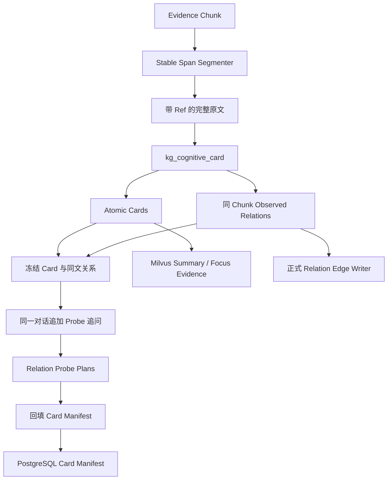

# 原子 Cognitive Card、同 Chunk Relation 与 Relation Probe 提取实施方案

## 1. 模块目标

本模块把 Evidence Chunk 转换为三类正式产物：

- 可独立判断真假的原子 Cognitive Card；
- 由当前原文直接证明的同 Chunk Card Relation；
- 用于跨 Chunk 候选发现的 Relation Probe。

Card 和同 Chunk Relation 在第一次模型调用中完成。Card 与 Probe 的固定规则都放在第一次请求的 System Prompt 中，但通过阶段门禁隔离：第一次收到新闻原文时只能执行 Card 阶段，不能提前思考或规划 Probe；只有后续 user 明确切换到 Probe 阶段后，模型才能执行 Probe 规则。第二轮沿用完整消息历史，只追加第一次通过校验的 assistant JSON 和一句简短的阶段切换指令，不重新发送 Probe 规则，也不重新序列化 Cards、Focus Evidence 或 Relations。

本模块不负责跨 Chunk 召回、rerank、候选初筛、原文关系核验、Graph Community 或高级认知报告。

## 2. 核心决策

### 2.1 Card 与同 Chunk Relation 同次生成

第一次调用任务名为 `kg_cognitive_card`。模型读取带稳定 Span Ref 的完整 Chunk，在同一个 JSON 响应中按以下顺序输出：

1. `cards`；
2. `relations`；
3. `skip_reason`。

模型必须先完成 Card 拆分和证据绑定，再基于已经输出的局部 Card ID 判断同 Chunk Relation。Relation 规则不能为了制造更多边而改变 Card 边界。

这样做的原因是同 Chunk Relation 依赖完整原文中的连接词、指代和上下文。把它放到另一个会话会丢失当前模型已经形成的 Card 边界，同时还会增加调用时间和 Token。

### 2.2 Relation Probe 使用同一对话续问

初始 System Prompt 同时包含两段稳定契约：

1. Card 与同 Chunk Relation 阶段规则；
2. Relation Probe 阶段规则。

Probe 规则带有明确门禁：首轮不得执行、不得参与 Card 边界判断，也不得影响同 Chunk Relation；只有收到后续“进入 Relation Probe 阶段”的 user 指令后才生效。这样 Probe 的长规则从第一轮起就是稳定前缀的一部分，第二轮不需要再追加一大段动态规则。

第二次调用任务名为 `kg_relation_probe`。消息历史严格按以下顺序组成：

1. 第一次调用的原始 system message；
2. 第一次调用带 Span Ref 的原文 user message；
3. 第一次调用实际通过校验的 assistant JSON；
4. 简短的 Relation Probe 阶段切换 user message。

如果第一次输出经过契约修复，第三条消息必须使用修复后通过校验的 assistant JSON，不能继续使用无效输出。

第二轮输出只包含每张 Card 的 Relation Probe 规划。Card 和 Relation 均不可修改。第二轮 user message 不携带完整 Probe 规则，也不再构造包含 Card Summary、Focus Evidence 文本和同 Chunk Relation 的派生 JSON，因为规则已经位于初始 System Prompt，业务数据已经存在于原始原文和第一轮 assistant 输出中。

两个职责仍由两个独立响应完成：第一次处理“原文中已经存在什么事实和关系”，第二次处理“还应该向哪些跨文档方向搜索”。续问只复用上下文，不允许第二轮反向修改第一轮结果。

DeepSeek `/chat/completions` 是无状态接口，第二次 HTTP 请求仍必须携带历史消息；这里的“续问”指保持历史消息不可变并只在尾部追加 assistant/user 消息，不是服务端自动保存会话。服务端上下文缓存可以复用第一轮 `system + user` 前缀，包括从一开始就存在的 Probe 固定规则。第一次 assistant JSON 是第二轮新增历史，因此不能假设它会自动命中第一轮输入缓存。

### 2.3 Probe 必须覆盖全部 Card

Probe 响应必须按输入顺序为每张 Card 恰好返回一个规划项。没有有效 Probe 时使用空数组，不能省略 Card。

该契约可以区分“模型已经评估但没有有效方向”和“模型漏处理了 Card”。单张 Card 最多保留三条 Probe，不按角色凑数。

## 3. 整体架构

## 4. 第一次调用：Card 与 Relation

### 4.1 输入

输入首行提供 `published_at`。其余内容按完整语句换行，使用 `[sNNNN]` 标记细粒度证据坐标，标题使用 `<title>` 标记。

模型不接收 Chunk ID、数据库 ID 或检索分数。Chunk ID 只进入请求 metadata，用于观测和幂等持久化。

### 4.2 Card 输出契约

每张 Card 只包含：

- `local_card_id`；
- `summary`；
- `focus_evidence_refs`。

Card 不包含 `relation_probes`。Card 数量不设置业务上限，避免长文中的独立事实因输出配额被强行合并。

Card 必须满足：

- 一张 Card 只表达一个最小但完整、可独立判断真假的核心事实；
- 核心谓词必须是可单独查询、更新或证伪的具体动作、状态或测量项，不能创造上位集合谓词合并多个具体事实；
- 两个候选只有事实元组相同，或一方在不借助外部推理时严格蕴含另一方，才允许合并；不同核心谓词不能互相覆盖，输出长度和 Card 数量不参与边界判断；
- Summary 脱离上下文仍能识别主体、谓词、对象或状态、时间或范围；
- 消息来源、预测者、声明者和不确定性不能被改写成客观事实；
- Focus Evidence 是能完整验证 Summary 的最小证据闭包；
- 没有独立谓词的重复总述不建卡；明确断言了不同谓词或状态的定性事实不能因为存在数值明细而被删除；
- 原因、结果、处置、市场反应和后续措施只要能独立判断，就分别建卡。

模型只执行一轮事实清单、边界确定、证据绑定和最终核对。不得通过反复重列事实、逐项重写证据说明来增加推理长度。

### 4.3 Relation 输出契约

每条 Relation 只包含：

- `source_card_id`；
- `target_card_id`；
- `relation_kind`；
- `relation_evidence_refs`。

模型不重复抄写 `basis`。应用层按 `relation_evidence_refs` 从原文确定性拼接 `basis`，再写入正式 Edge，避免模型抄写差异造成有效关系丢失，并减少输出 Token。

Relation 只能引用当前响应已经输出的局部 Card ID。第一阶段只接收原文明示的正关系，统一落为 `observed`。允许的关系类型为：

- `confirmation`；
- `contradiction`；
- `temporal_progression`；
- `causal_influence`；
- `common_driver`；
- `constraint`；
- `market_co_movement`：同一市场对象或直接资产暴露在不同市场载体上的同步或背离表现，不表达因果、传导或共同驱动。

同篇出现、句子相邻、同主体、同领域、时间先后和常识相关都不能单独证明 Relation。模型从原文连接语义出发映射关系两端，不遍历无连接证据的 Card 组合。连接证据必须能够定位两端事实，并直接表达二者关系。

`temporal_progression` 可以承接同一事件、程序或状态的后续、回应、推进、执行和结果。两端主体和动作允许不同，但后项必须明确引用、回应、执行、改变或结束前项的同一事件对象；并列动作和并列结果不能串成 progression。数值或指标变化仍要求主体、指标、口径和时间可比，不能自行比较不同口径制造趋势。多个事实共同支撑一个结论时，也不能把集合关系任意归给单个成员。

### 4.4 空结果

没有可独立验证事实时允许 `cards=[]`，此时 `relations=[]`，并填写明确的 `skip_reason`。Cards 非空时 `skip_reason` 为空字符串。

`chunk_summary` 只在一个 Chunk 生成两张及以上 Card 时输出，用于提供多 Card 的整体背景。零张或一张 Card 时不输出；单 Card 的 `summary` 已承担同一职责。

## 5. 第二次调用：Relation Probe

### 5.1 输入材料

Probe 请求复用第一次调用的完整 `system + user` 消息，并追加第一次实际通过校验的 assistant JSON。最后一条 user message 只是进入 Probe 阶段的短指令，不再重复规则或业务数据。

Card 与 Probe 请求使用同一 canonical model 和同一可选 Provider。生产环境未指定 Provider 时交由公共 LLM Gateway 路由；质量验证可固定 Provider，在完全相同的模型名、Prompt 和输入下比较不同厂商上游实现。

模型从原始 Span Ref 文本和上一轮 assistant JSON 中读取每张 Card 的局部 ID、Summary、Focus Ref 及同 Chunk Relation。应用层不再生成第二份派生 Card JSON，也不把兄弟 Card 的证据重新拼入当前 Card。

### 5.2 输出契约

顶层只包含 `probe_plans`。每个规划项只包含：

- `local_card_id`；
- `relation_probes`。

每条 Probe 只包含 `role` 和 `query`。允许的角色为：

- `upstream`；
- `downstream`；
- `confirmation`；
- `contradiction`。

`same_event` 由 Card Summary 基线召回承担，不再生成单独 Probe。

### 5.3 Probe 质量边界

Probe 是搜索假设，不是已经发生的事实，也不是正式 Edge。它必须描述另一个可能与当前 Card 形成一跳直接关系的可观察事件。

Probe 应满足：

- 相比 Summary 基线召回具有增量价值；
- 必须描述 Summary 中尚不存在的另一个事件端点，不能保持相同主体、谓词、对象和时间后只增加“其他来源确认”“后续情况”等包装；
- confirmation 必须搜索不同观察材料或不同指标，不能搜索同一数值或同一陈述的再次发布；
- Query 必须保持原文的事实强度和不确定性，不能把差错、嫌疑、风险或可能性升级成已经成立的违法、造假、处罚或结果；
- 明确候选事件类型和作用对象；
- 使用简洁的关系型检索问题或候选事件描述；另一端信息不足时直接询问缺失关系，不能补写原文没有提供的候选主体、事件类别、作用机制或既成结果；
- 只有缺失端点会显著改变当前事实解释、且可能作为独立新闻存在时才生成，不能枚举现实中仅仅可能发生的常规后续；
- 不编造日期、数值、专有主体、动机或中间机制；
- 不机械否定当前谓词制造 contradiction；
- 不把同 Chunk 已闭合端点重复包装成跨 Chunk 搜索方向，但兄弟 Card 只排除与其事实元组相同的目标端点，不能屏蔽其他缺失端点；
- 不生成尚未发生的未来订阅条件。

## 6. 校验与修复

### 6.1 Card 与 Relation 校验

程序只执行契约底线校验：

- 顶层字段完整且无额外字段；
- Card 在完成全部拆分后按最终数组位置使用连续局部 ID，不允许字母后缀、跳号或残留草稿编号；
- 同一来源、句子、表格或公告不能成为合并不同谓词、不同指标或不同事件动作的理由；
- 一个句子内已经表达关系的两个事实也必须拆成端点 Card，Summary 不能同时承载端点及其原因、后果或后续步骤；
- Focus Ref 存在于当前 Chunk；
- Relation 两端引用有效 Card；
- Relation 类型合法；
- Relation Ref 存在；
- 同一无序 Card 对最多一条关系。

业务语义正确性由模型负责，不通过关键词或场景硬编码替代模型判断。任一 Card 未通过基础结构、证据引用或身份唯一性校验时，整轮 Card 输出进入一次结构修复，禁止静默丢弃部分 Card 后继续 Probe。无效 Relation 可以被丢弃，但不能导致有效 Card 一并丢失。

### 6.2 Probe 校验

程序要求 `probe_plans` 与输入 Card ID 列表完全一致、顺序一致且无重复。Probe 字段、角色、非空查询和单 Card 内重复项必须合法。

结构校验失败时只允许执行一次带错误反馈的结构修复。修复不得改写 Card 或 Relation。若输出因长度截断且 Prefix Completion 仍失败，不使用相同参数重跑完整业务请求。

## 7. 持久化与索引

最终生成的 Probe 回填到不可变 Card 对象后，再统一执行持久化：

- PostgreSQL 保存 Card manifest、Focus Ref/offset 和 Relation Probe；
- PostgreSQL 不保存完整 Card 或 Chunk 正文；
- Milvus 分别保存 Card Summary 和 Focus Evidence 可读文本；
- Relation Probe 不写入 Milvus；
- 同 Chunk Relation 复用正式 Relation Edge Writer 写入关系表和 Milvus Edge 索引；
- 同一 Evidence 重跑时替换 Card manifest，并撤销已不存在的旧 Card Relation。

## 8. 并发、缓存与观测

同一 Chunk 的两次调用占用同一个提取并发槽，保证 Probe 一定基于本次已经校验的 Card 和 Relation。

Card 请求继续使用独立的前缀预热锁，减少服务冷启动时多个并发请求同时发生前缀缓存 miss。初始 System Prompt 固定包含 Card 与 Probe 两个阶段的完整规则；Probe 请求保持第一次调用的 `system + user` 消息逐项不变，只在尾部追加已接受的 assistant 输出和简短阶段切换指令，从而让长规则进入稳定前缀。Probe 仍使用独立的 `kg_relation_probe` 业务缓存键，避免与第一轮完整响应混淆。

这一结构只减少重复规则导致的真 miss，不会让模型第一轮生成的 assistant JSON 自动变成服务端缓存。第二轮必须显式携带该 JSON，它仍属于第一轮请求中未出现的新输入。批量运行时，稳定 System Prompt 可跨请求复用；单个冷启动样本的总输入 Token 不会凭空消失。

Langfuse 至少记录：

- `kg.atomic_card.extract_cards_and_relations`：第一次 Card 与 Relation 调用；
- `kg.atomic_card.validate`：Card/Relation 契约校验；
- `kg.atomic_card.plan_relation_probes`：同一对话 Probe 续问；
- 两次请求的模型、Token、前缀缓存、reasoning、修复状态和结构化结果；
- Card、Relation、Probe 数量及被丢弃项。

## 9. 迁移边界

本次直接替换旧契约，不保留以下兼容路径：

- Card 项内由第一次调用直接生成 Probe；
- `kg_cognitive_card_relation` 独立追问；
- Probe 使用独立 system/user 新会话并重新序列化 Card 上下文；
- 跨 Chunk Relation Discovery 临时生成第二份 Probe。

数据库中的 `relation_probes` 字段保留，因为它仍是最终 Card manifest 的正式组成部分。

## 10. 测试用例

### 10.1 单元测试

| 用例 | 验证内容 |
|---|---|
| Card/Relation Schema | 第一次响应严格包含 `cards`、`relations`、`skip_reason`，Card 内没有 Probe。 |
| Card 原子性 Prompt | Prompt 保留事实覆盖、谓词边界、证据闭包和去重约束。 |
| Relation 映射 | 局部 Card ID 正确映射为正式 Card ID，关系证据 Ref 可回溯。 |
| 无效 Relation 隔离 | 无效关系被丢弃，但有效 Card 不丢失且不触发业务修复。 |
| Probe 阶段门禁 | 初始 System Prompt 包含 Probe 规则，但第一次响应只允许输出 Card 与 Relation。 |
| Probe 同对话续问 | Probe 请求完整复用第一次 system/user，并追加通过校验的 assistant 输出与简短阶段切换指令。 |
| Probe 无重复派生输入 | 第二轮不重新序列化 Card Summary、Focus Evidence 文本或同 Chunk Relation JSON。 |
| Probe 稳定前缀 | 第二轮 user message 不重复完整 Probe 规则，固定规则从第一次请求起保持字节级一致。 |
| 修复后续问 | 第一次输出经过修复时，Probe 必须接在修复后的有效 assistant 输出后。 |
| Probe 完整覆盖 | 缺失、重复、乱序或未知 Card ID 触发校验失败。 |
| Probe 回填 | Probe 正确写回对应 Card，空 Probe Card 仍保留。 |
| 空 Chunk | 无事实时只调用第一次请求，不调用 Probe。 |
| 截断处理 | 长度截断且续写失败时不执行相同参数完整重试。 |
| 并发控制 | 同一 Extractor 的并发上限同时覆盖 Card 和 Probe 两次调用。 |

### 10.2 集成测试

| 用例 | 验证内容 |
|---|---|
| 真实长文回放 | Card 无总述/明细重复，Relation 端点和连接证据准确。 |
| Probe 质量回放 | Probe 相对 Summary 有召回增量，且无兄弟 Card 污染和虚构事实。 |
| PostgreSQL 幂等 | 同一 Evidence 重跑后 Card、Probe 和 Relation 状态稳定。 |
| Milvus 可读性 | Summary/Focus Evidence 可语义召回和按 ID 精确取回，Probe 不进入 Milvus。 |
| Langfuse 链路 | 能分别观察第一次组合调用和第二次独立 Probe 会话。 |

## 11. 验收标准

1. `kg_cognitive_card` 一次输出 Cards 和同 Chunk Relations，不再发起 `kg_cognitive_card_relation` 请求；
2. Card 输出中不存在 `relation_probes` 字段；
3. 初始 System Prompt 固定包含 Probe 规则，但首轮阶段门禁确保其不参与 Card 与 Relation 处理；
4. `kg_relation_probe` 使用同一对话续问，第二轮只追加简短阶段切换指令，并完整评估本次全部 Card；
5. Probe 结果回填后继续沿用现有 PG manifest 和跨 Chunk Relation Discovery；
6. 同 Chunk Relation 仍按正式 Edge 写入，重跑可新增、保留和撤销；
7. 单元测试、真实长文回放和 Langfuse 链路均通过。
