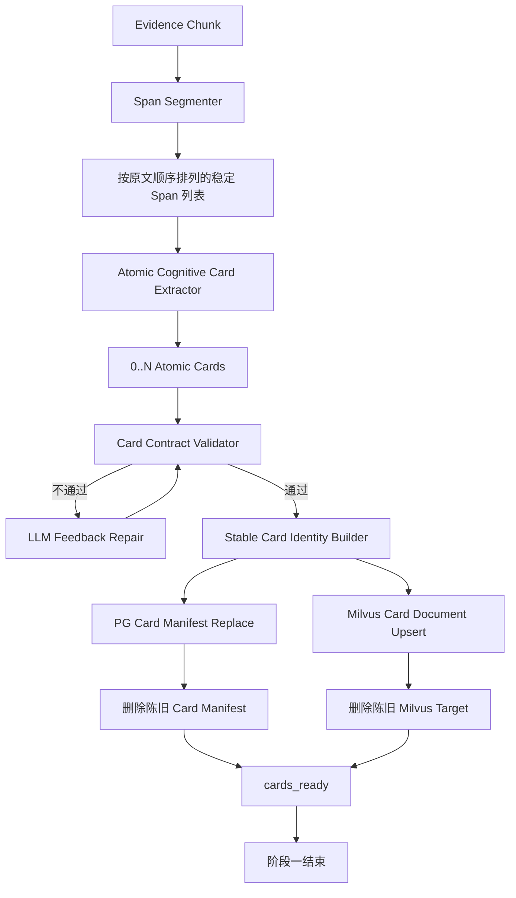
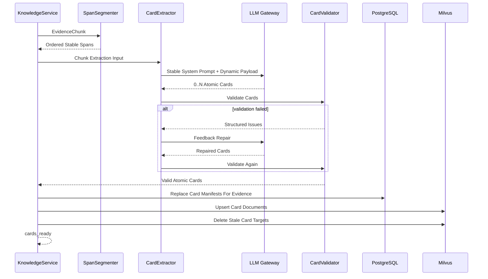

# 原子 Cognitive Card 与 Relation Probe 提取实施方案

## 1. 模块目标

本方案承接：

`docs/5. 设计方案/1. 知识图谱/22. 关系优先Graph Community重构设计方案.md`

本阶段只实施关系优先重构的第一段链路：把 Evidence Chunk 转换为可供后续 Link Prediction 使用的原子 Cognitive Card。

阶段目标是：

- 一个 Chunk 可以提取零个、一个或多个原子 Cognitive Card；
- 一个 Card 只表达一个可以独立判断、独立检索、独立建立关系的事件或事实主张；
- 每个 Card 使用忠实 Summary 作为主要语义检索文本；
- 每个 Card 能通过稳定 Span Ref 回到支撑它的原文位置；
- 每个 Card 只保留关系发现实际需要的事实锚点；
- 每个 Card 在同一次 LLM 提取中动态生成适用的 Relation Probes；
- Card manifest 写入 PostgreSQL，可读 Summary 和 Probe 材料发布到 Milvus；
- 本阶段处理完成后停止，不进入旧 Community Assignment 和 Community Insight 链路。

本阶段完成的标志不是生成 Graph Community，而是形成一批原子、可检索、证据可回溯、关系搜索就绪的 Cognitive Card。

## 2. 模块边界

### 2.1 覆盖范围

本方案覆盖：

- Chunk 原文确定性 Span 切分；
- Cognitive Card LLM 输入和输出契约重构；
- 一 Chunk 到多 Card 的抽取模型；
- 原子 Card Summary；
- 焦点证据引用；
- 事实锚点；
- Relation Probe 动态生成；
- Card 业务校验与一次反馈修复；
- Card 稳定身份生成；
- PostgreSQL Card manifest 替换写入；
- Milvus Cognitive Card 文档发布和陈旧文档删除；
- Langfuse 全链路观测；
- Card-only 验证脚本、单元测试、集成测试和真实数据回放；
- 旧 Card 输出结构及旧 Assignment 调用边界退出。

### 2.2 不覆盖范围

本阶段不实施：

- Relation Probe 的实际 RAG 召回；
- 每个 Probe 的 rerank；
- 关系感知 Summary 批量筛选；
- 双方原文关系核验；
- Observed Relation、Inferred Relation 或 Edge 写入；
- 图变化事件投递；
- Graph Community 发现；
- Community 高级认知报告；
- 条件性未来推演；
- Agent 对新 Graph Community 的检索消费；
- 旧 Community、Assignment、Insight 历史数据清理；
- 关系模型训练。

### 2.3 阶段运行边界

新 Card Schema 与旧 `topic_intents`、Community Assignment 输入不兼容。本阶段不增加兼容转换，也不把新 Card 再映射回旧主题归档结构。

阶段一链路必须在 Card 持久化和 Milvus 发布后明确停止：

```text
Evidence Chunk
  -> Atomic Cognitive Cards
  -> PG manifest
  -> Milvus card documents
  -> cards_ready
  -> STOP
```

旧 Assignment、Seed Community、Candidate Ledger、bucket planning 和 Insight 不能继续消费新 Card。第一阶段验收应在受控 target 或专用验证脚本中完成；在后续关系发现阶段尚未实现前，不把“只完成 Card”描述为完整知识图谱重构已经上线。

## 3. 当前实现与目标差异

| 维度 | 当前实现 | 第一阶段目标 |
| --- | --- | --- |
| Chunk 与 Card 数量关系 | 一个 Chunk 固定生成一个 Card。 | 一个 Chunk 生成零个、一个或多个 Card。 |
| Card 认知单元 | 一个 Card 内包含多个 `topic_intents`。 | 一个 Card 本身就是一个原子事件或事实主张。 |
| 核心文本 | Card summary + 主题分类字段。 | 单一原子事件 Summary。 |
| 证据表达 | 每个 intent 保存可读 `evidence_span`。 | Card 保存稳定 `focus_evidence_refs`，通过 Span Ref 精确回源。 |
| 辅助字段 | title、宽中细主题、风险、影响对象、事件线等大量归档字段。 | 只保留原文明示且被关系发现消费的事实锚点。 |
| 关系搜索材料 | 不存在。 | Card 提取阶段同步生成动态 Relation Probes。 |
| 下游 | 提取后立即进入 Community Assignment。 | 提取、持久化、发布后停止。 |
| PG 文本职责 | 保存大量 Card 可读内容。 | 只保存 manifest、引用和紧凑结构化事实，不保存完整 Card 文本。 |
| Milvus 职责 | 保存 Card 语义文档。 | 保存可读 Summary、Probe 材料和按 ID 精确取回 payload。 |

当前代码的主要改造位置包括：

- `src/domain/knowledge/cognitive_index.py`
  - `CognitiveCard` 领域对象；
  - Card JSON Schema；
  - Card System Prompt；
  - LLM 输出标准化；
  - Card Milvus 文档构建。

- `src/application/services/cognitive_index_service.py`
  - `CognitiveCardExtractor`；
  - 一 Chunk 一结果的并发模型；
  - 校验失败反馈修复；
  - 前缀缓存预热与 Langfuse 观测。

- `src/application/services/knowledge_service.py`
  - `_refresh_cognitive_index`；
  - Card PG 持久化；
  - Card Milvus 发布；
  - 当前 Card 后的 Assignment / Community 调用。

- `src/infrastructure/persistence/models/knowledge.py`
  - `KnowledgeCognitiveCard` ORM。

- `src/infrastructure/persistence/repositories/knowledge_repository_impl.py`
  - Evidence 粒度 Card 替换写入；
  - ORM 与领域对象转换；
  - 旧 Assignment 级联删除耦合。

- `schema/06_knowledge.sql` 与 `schema/13_cognitive_index.sql`
  - `kg_cognitive_cards` 的当前 DDL。

## 4. 第一阶段整体架构



### 4.1 关键依赖方向

- Span Segmenter 不依赖 LLM；
- Card Extractor 只读取当前 Chunk 和来源元数据；
- Relation Probe 在 Card 提取调用中生成，但不执行搜索；
- Validator 只校验结构、引用和可确定的一致性，不编写领域硬规则；
- PG 负责 Card identity、来源和证据指针；
- Milvus 负责 Card 可读文本、语义搜索材料和按 ID 精确取回；
- 旧 Community Assignment 不再是第一阶段下游。

## 5. 模块职责架构

### 5.1 Span Segmenter

职责：

- 对完整 Chunk 做确定性句子或短段落切分；
- 为每个 Span 生成在当前 Chunk 内稳定的引用编号；
- 保留 Span 到 Chunk offset 的映射；
- 将按原文顺序排列的 Span Ref 与 Span text 作为唯一正文输入发送给 Card Extractor；
- 为 Card Validator 提供引用校验能力。

它不负责：

- 判断事件边界；
- 生成 Card Summary；
- 推断因果关系；
- 生成字符 offset 让 LLM 自行计算。

Span Ref 必须由程序生成，不能让 LLM 输出未经注册的字符坐标。只要 Chunk 内容不变，Span Ref 和 offset 映射就应保持稳定。

### 5.2 Atomic Cognitive Card Extractor

职责：

- 读取发布时间和共同构成完整正文的有序 Span 列表；
- 判断 Chunk 中有多少个可以独立表达的事件或事实主张；
- 为每个原子事件生成独立 Card；
- 为每个 Card 生成忠实 Summary；
- 为每个 Card 选择焦点证据 Span；
- 为每个 Card 提取原文明示的事实锚点；
- 为每个 Card 动态选择适用关系角色并生成 Relation Probes；
- 允许在 Chunk 不包含可用事实时输出零个 Card。

它不负责：

- 判断两个 Card 是否已经存在关系；
- 召回历史 Card；
- 输出 Edge；
- 创建或匹配 Community；
- 生成未来预测。

### 5.3 Card Contract Validator

Validator 负责可确定的结构和证据一致性校验：

- 顶层输出是 Card 数组；
- 每个 Card Summary 非空；
- 每个 Card 至少引用一个已注册 Span Ref；
- 所有 `focus_evidence_refs` 都属于当前 Chunk；
- 事实锚点结构合法，原文明示字段能够回到引用 Span；
- Relation Probe role 来自允许的通用角色目录；
- Probe query 非空且同一 Card 内不重复；
- Probe 不被写入 Summary 或事实锚点；
- 一个 Card 不引用同一 Chunk 中另一个原子事件作为自己的焦点证据。

Validator 不负责使用关键词黑名单判断行业语义，也不根据固定例子决定是否应该拆 Card。原子性、过度拆分和 Probe 价值需要通过 LLM 质量回放评估，不能伪装成确定性规则已经解决。

### 5.4 LLM Feedback Repair

第一次输出不符合契约时，使用现有 LLM feedback repair 机制进行一次修复。修复输入应包含：

- 原始结构化输出；
- 明确校验错误；
- 当前 Chunk 的 Span Ref；
- 只修复结构和证据引用、不得补充外部事实的要求。

修复仍不通过时应让当前 Chunk 明确失败，不能生成空壳 Card 或回退到旧 `topic_intents` Schema。

### 5.5 Stable Card Identity Builder

Card identity 必须适应“一 Chunk 多 Card”，不能继续默认一个 Chunk 只有一个 Card。

身份生成应基于稳定证据输入，包括：

- adapter；
- evidence identity；
- primary chunk identity；
- Chunk text hash；
- 焦点 Span 覆盖范围，由最早和最晚 Span Ref 确定；

Summary 和事实锚点都是模型生成文本，可能因措辞变化而抖动，不能参与 Card identity，也不能依赖 LLM 输出数组顺序生成永久身份。

Span Segmenter 需要提供稳定子句粒度，使独立原子事件能够选择不同的焦点覆盖范围。Card identity 使用覆盖范围的首尾 Span Ref，避免模型是否补充中间 Span 导致 ID 抖动。同一 Chunk 中两张 Card 如果最终覆盖范围完全相同，Validator 必须判为事件边界未消歧并进入一次 repair；不能再使用模型生成的 Summary、事实锚点措辞或数组顺序补出不稳定 ID。

第一阶段需要通过重复运行测试验证 Card ID 稳定性。无法稳定的身份策略不能进入后续 Edge 建模阶段。

### 5.6 Card Persistence

职责：

- 以 Evidence 为替换边界加载旧 Card identity；
- 删除本次 Evidence 对应的陈旧 Card manifest；
- 批量写入当前原子 Card manifest；
- 返回新增、保留和删除的 Card ID；
- 为 Milvus 陈旧 target 清理提供明确 ID 集合。

Card Persistence 不再删除或维护旧 Community Assignment。阶段一已经停止 Assignment 写入，Card repository 不应继续保留对 `KnowledgeCommunityAssignment` 的隐藏级联职责。

### 5.7 Milvus Card Publisher

职责：

- 使用稳定 `cognitive_card_id` 作为 Milvus `VARCHAR target_id`；
- 使用 `MilvusClient` 和 `upsert()` 发布 Card；
- `text` 以原子 Summary 为主要可读检索内容；
- payload 包含来源、Evidence、Chunk、焦点 Span、事实锚点和 Relation Probes；
- 支持按 Card ID 精确取回；
- 删除 Evidence 重建后不再存在的旧 Card target。

本阶段不为每个 Probe 单独建立永久事实节点。Relation Probe 作为 Card 的派生搜索材料保存在可读 payload 中；后续关系发现阶段决定如何将每个 Probe 作为独立 query 执行召回和 rerank。

### 5.8 Card Stage Boundary

`KnowledgeService` 在完成以下动作后返回 `cards_ready`：

- Card 提取；
- PG manifest 替换；
- Milvus Card upsert；
- 陈旧 Milvus Card 删除；
- 诊断信息汇总。

阶段一不实例化或调用：

- `CommunitySemanticCandidateProvider`；
- `CommunityCardBuilder`；
- `AssignmentCandidateOrderStore`；
- `CommunityBucketPlanner`；
- Community Assignment 持久化；
- Community stream commit。

这不是临时 fallback，而是本阶段明确的完成边界。

## 6. Card 数据契约

### 6.1 Card 核心身份与指针

每个 Card 需要具备：

- `cognitive_card_id`；
- adapter 和 source identity；
- evidence identity；
- primary chunk identity；
- 必要的 supporting chunk identities；
- Card schema version；
- active status。

### 6.2 Summary

Summary 必须：

- 只表达一个完整事件或事实主张；
- 包含必要主体、动作、对象和关键限定；
- 不依赖同一 Chunk 中其他 Card 才能理解；
- 不添加原文没有的年份、数字、主体、原因或结果；
- 不写成主题标签；
- 不把多个事件用顿号或并列句压进同一 Card；
- 不重复焦点证据原文的全部内容。

Summary 是未来基础语义召回和关系感知筛选的主要文本，但不是正式 Edge 证据。

### 6.3 Focus Evidence Refs

每个 Card 至少绑定一个焦点 Span Ref。焦点证据用于：

- 证明 Summary 对应原文中的哪个事件；
- 生成稳定 Card identity；
- 在未来原文核验时突出当前裁决对象；
- 防止同一 Chunk 的其他事件污染当前 Card。

焦点引用必须形成当前 Card 的最小证据闭合集合。只阅读这些 Span 时，仍应能够确认 Summary 以及事实锚点中的主体、动作、对象、时间、原因和结果；证据闭合优先于引用数量少。缺少支撑时必须补充 Span Ref，或者删除未被支撑的表述。

模型应先确定 Summary 和事实锚点，再分别定位每项信息对应的 Span Ref，最终取 Ref 并集作为焦点证据。同一事实由连续上下文共同表达时，不能跳过承载主体、动作对象、指标名称或指代衔接的中间 Span。“最小证据”不等于只保留出现数字或关键词的 Span。

不同 Card 的焦点引用不要求机械互斥。同一个 Span 对多个独立事实都是不可缺少的直接证据时可以复用；仅仅提供共同背景、主题或领域信息时，不应因为内容相关而重复挂载。焦点引用不能让 LLM 拼接不存在的原文，也不能只保存一段脱离 Chunk 的重复文本。

### 6.4 Factual Anchors

第一阶段只保留后续关系发现已经明确需要的最小事实锚点。事实锚点不是对 Summary 的结构化复述，完整数值和事实细节继续保留在 Summary 与焦点证据中：

- actors：原文明示的事件主体；
- action：当前原子事件的核心动作或状态变化；
- objects：动作直接作用的对象；产品、政策、指标或资产只有在它本身是动作对象时才进入；
- event_time：原文可以确定的事件时间；
- explicit_causes：原文明示的原因或前置条件；
- explicit_effects：原文明示的结果或影响。

事实锚点必须来自原文，不允许把模型常识推断的潜在上下游、产业归属或未来影响写入事实字段。

金额、数值、比例、时间、变化幅度、排名、趋势、原因和结果不得作为 objects。原文明示的原因进入 explicit_causes，原文明示的结果进入 explicit_effects；同一信息不得跨 objects、causes、effects 重复。action 只保留最短核心谓词，不携带主体、对象、数值或完整事件描述。

### 6.5 Relation Probes

关系角色目录在第一版保持稳定：

| role | 搜索目标 |
| --- | --- |
| `same_event` | 同一事件、同一事实、前序披露、状态更新或后续进展。 |
| `upstream` | 可能构成原因、条件、驱动或前置事件的历史 Card。 |
| `downstream` | 可能承接影响、传导或结果的历史 Card。 |
| `confirmation` | 对当前事实提供独立确认、补充证据或一致口径的 Card。 |
| `contradiction` | 与当前事实相反、构成反证、限制条件或失效状态的 Card。 |

角色目录稳定不等于每个 Card 固定输出五个 Probe。模型必须动态决定：

- 当前 Card 适用哪些 role；
- 哪些 role 应跳过；
- 一个 role 是否需要多个具体搜索表达；
- 相近表达是否应去重。

信息简单的 Card 可以不生成额外 Probe。原始 Summary 语义召回始终可用，不依赖 Probe。

每条 Probe 只能描述一个关系槽位和一种候选事件。不同关系目标必须拆成多条 Probe，不能用“或”等并列表达将状态更新、外部确认、原因和后续影响揉进同一 query。同一 role 可以生成多条互补 Probe，但不同 Probe 必须覆盖不同关系路径。

Probe query 必须能够脱离当前 Card 独立用于检索。它需要保留识别当前事实所需的主体、动作对象、时间范围或状态，并描述希望找到的候选事件，不能只是“查找相关内容”“相关细节”“类似新闻”或“行业影响”，也不能把尚未核验的因果关系写成已发生事实。

- same_event 保持当前事实的主体、核心对象和目标时间范围不变，寻找前序披露、修订、执行状态或最终结果；历史披露时间可以不同，但不能把目标时间替换为相邻时期；
- confirmation 寻找独立来源对当前事实本身的确认或一致证据；
- upstream 同时表达候选原因以及它作用于当前对象的可能机制，不能退化成宽泛背景搜索；
- downstream 表达受影响对象和可观察变化，当前事实自身的修订、兑现或最终值仍属于 same_event；
- contradiction 寻找否定、冲突、反向变化或使当前事实不再成立的材料。

当前事实可以被独立验证或推翻时，应考虑 confirmation 和 contradiction；这不是要求机械填满角色，而是避免遗漏有明确检索价值的关系方向。Probe 生成目标是覆盖互不重复的关系路径，而不是最大化数量。

报告、预测、观点和数据发布属于信息事件，不能被当成其所描述现实状态的原因。支撑或否定所描述状态的订单、经营数据和行业指标属于 confirmation 或 contradiction；只有由信息发布本身触发的可观察反应才属于 downstream。当前事实自身的后续修订、兑现或最终值仍属于 same_event。

事实锚点中存在多个可独立检索的原因时，不同原因分别生成 upstream Probe；存在多个不同受影响对象或可观察变化时，分别生成 downstream Probe。same_event、confirmation 和 contradiction 也应按单一候选事件拆分。query 使用完整、通顺的候选事件描述，不堆叠关键词，不使用“或”罗列备选结果。

模型按 same_event、upstream、confirmation、contradiction、downstream 的顺序检查关系方向。这个顺序是覆盖检查，不代表五类都必须输出：没有独立检索价值的角色可以省略。每个可独立检索的显式原因分别形成 upstream；前序披露、最终结果、独立确认和不同反证状态如果指向不同候选事件，也分别形成 Probe。

Relation Probe 服务于当前入库时对已有历史 Card 的搜索，不是未来订阅条件。候选事件原则上应在当前事实之前或同时已经发生，不生成尚未发生的最终值、未来结果或未来市场反应查询。未来事件入库时，由未来 Card 生成 Probe 并反向发现当前 Card。

confirmation 必须寻找独立观察、指标、经营数据或其他判断形成的一致证据。同一消息的转载、复述或仅确认原报告存在不视为有效 confirmation，应在候选去重阶段排除。

在最终输出前，模型统一复核三项契约：事实锚点是否保持最小；焦点证据是否闭合；每条 Probe 是否为单一候选事件的陈述，并且没有把信息事件误写成现实经营变化的原因。该复核只影响最终 JSON，不额外输出自检内容。

Probe role 只是搜索方向，不是最终 Edge 类型。

### 6.6 PG 与 Milvus 数据职责

PostgreSQL 保存：

- Card identity；
- Evidence / Chunk / Source 指针；
- Span Ref 与 offset 指针；
- 紧凑事实锚点；
- schema、generator version 和状态；
- 创建和更新时间。

PostgreSQL 不保存完整 Chunk text，也不保存完整可读 Card 文本集合。

Milvus 保存：

- 原子 Card Summary；
- Relation Probe 搜索表达；
- 可供 rerank 和 Agent 阅读的 Card payload；
- source、evidence、chunk 和 span refs；
- 事实锚点；
- schema version。

Card 内容更新统一通过 `upsert()` 完成，PG 指针和 Milvus target 必须能够通过同一个 Card ID 对齐。

## 7. Prompt 与输出约束

### 7.1 System Prompt

System Prompt 必须保持稳定以利用模型侧前缀缓存，不能注入当前日期、动态候选或领域样本。

System Prompt 需要明确：

- 先拆原子事件，再生成 Card；
- 一个 Card 只表达一个事件或事实主张；
- 不按公司数量、数字数量机械拆分；
- 不把真实不同的动作、对象或事件阶段压进同一个 Card；
- Summary 必须忠实、完整、可独立理解；
- evidence 只能引用输入 Span Ref；
- 事实锚点只能来自原文；
- Relation Probe 是搜索假设，不是事实；
- Probe role 动态选择，不要求固定填满；
- 不输出主题归档、Community、Assignment、Edge 或预测。

Prompt 不放入金融、自然灾害、半导体等具体示例，避免模型形成领域偏好。具体场景示例只存在于评测数据和设计文档，不进入生产 System Prompt。

原子 Card 提取请求使用模型提供方的高推理等级。该阶段需要在同一次调用中同时完成事件边界、证据闭合、最小事实锚点和关系路径规划，普通推理等级在复杂 Chunk 上容易出现规则之间相互挤压。推理等级属于请求配置并进入 LLM 缓存键，不与其他等级共享结果。

### 7.2 User Payload

动态 User Payload 包含：

- source published time；
- chunk identity；
- 按顺序排列的 Span Ref 与 Span text。

Span text 已完整覆盖 Chunk 正文，因此动态 Payload 不再重复发送 `chunk_text` 和 `source_title`。标题仍可保留在程序元数据中，但不能作为 Card 事实证据。完整 Chunk 仅保留在程序侧，用于生成 offset、校验证据引用和事实接地，不直接发送给 LLM。相对时间的解释规则属于固定行为约束，放入 System Prompt；实际发布时间仍放在动态输入中，避免动态值破坏前缀缓存。

### 7.3 输出结构

一次 Chunk 调用返回 Card 数组。每个 Card 只包含本方案定义的原子事实、证据引用、事实锚点和 Relation Probes。

以下旧字段不再输出：

- `title_candidates`；
- `topic_intents`；
- `assignment_profile`；
- `parent_themes`；
- `broad_topics`；
- `mid_topics`；
- `specific_topics`；
- `topic_level_hint`；
- `future_coverage`；
- 为 Community 归档服务的风险、影响和事件线标签集合。

同一事实不能同时以 Summary、claim、insight material 等多个近义字段重复输出。第一阶段只保留一个 Summary。

## 8. 关键处理流程

### 8.1 单 Chunk 提取流程



### 8.2 多 Chunk 并发流程

保留现有受控并发和前缀预热机制，但单任务返回值从一个 Card 改为 Card 列表。聚合层负责：

- 并发执行多个 Chunk；
- 保持每个 Chunk 内 Card 的稳定顺序只用于诊断，不用于永久 identity；
- 将多个 Card 列表扁平化；
- 任一 Chunk 失败时取消未完成任务并明确失败；
- 不因为一个 Chunk 输出零 Card 就判定整批失败。

前缀冷启动仍采用“第一次请求单飞，完成后其他请求并发”的机制。System Prompt 变更后必须更新缓存版本或预热标记，不能复用旧 Card Prompt 的暖缓存状态。

### 8.3 Evidence 替换流程

同一 Evidence 重新编译时：

1. 读取旧 Card IDs；
2. 提取本次新 Card 集合；
3. 计算保留、新增和陈旧 Card IDs；
4. 在 PG 中替换 Card manifest；
5. 使用 Milvus `upsert()` 发布当前 Card；
6. 从 Milvus 删除陈旧 Card；
7. 返回完整一致性诊断。

本阶段不存在 Assignment 级联删除，因为旧 Assignment 已退出当前处理链路。

## 9. 数据与索引生命周期

### 9.1 Schema Version

新原子 Card 必须使用新的 schema version，不能与旧 topic-intent Card 共用同一版本标记。

schema version 用于：

- 阻止旧 Card 被新链路误读；
- 支持受控数据清理和重建；
- 在 Langfuse 和 Milvus 中区分新旧输出；
- 为后续关系发现阶段声明输入契约。

### 9.2 旧 Card 数据

旧 Card 结构不能迁移为新原子 Card，因为旧 Card 的事件边界和主题意图已经混合。第一阶段不编写字段映射兼容器。

在受控 target 验收时，应清理该 target 下旧 Card PG manifest 和 Milvus Card target，再用原始 Evidence Chunk 重建。正式环境的全量清理与重建窗口在后续整体迁移方案中确定。

### 9.3 DDL 同步

如果 `kg_cognitive_cards` 字段发生变化，必须同步更新：

- SQLAlchemy ORM；
- `schema/06_knowledge.sql`；
- `schema/13_cognitive_index.sql`；
- 相关索引和字段注释；
- 数据库初始化与测试 fixture。

不能只修改 ORM 而保留过时 DDL，也不能使用运行时 `create_all()` 掩盖迁移问题。

## 10. Langfuse 与诊断

### 10.1 Trace 层次

Card-only 验证链路至少包含：

```text
kg.atomic_card.stage
  -> kg.atomic_card.segment_chunk
  -> llm:kg_cognitive_card
  -> kg.atomic_card.validate
  -> kg.atomic_card.pg_replace
  -> kg.atomic_card.milvus_upsert
  -> kg.atomic_card.delete_stale
```

### 10.2 每个 Chunk 的诊断

至少记录：

- chunk identity 和字符数；
- Span 数量；
- 输出 Card 数量；
- 每个 Card 的 Summary 字符数；
- 每个 Card 的 focus ref 数量；
- 每个 Card 的 factual anchor 数量；
- 每个 Card 的 Probe role 和 Probe 数量；
- 校验错误和是否发生 repair；
- schema version；
- LLM token、cache hit/miss 和耗时。

Langfuse 可以保存完整 LLM 输入输出用于调优，但应用日志只记录统计和 ID，避免把大量原文重复写入日志。

### 10.3 阶段级诊断

至少记录：

- 输入 Chunk 数量；
- 成功、零 Card 和失败 Chunk 数量；
- 总 Card 数量和平均每 Chunk Card 数；
- PG inserted / deleted Card 数；
- Milvus upsert / deleted target 数；
- 是否执行旧 Assignment，验收期必须为否；
- 最终状态 `cards_ready`。

## 11. 实施顺序

### 11.1 收敛领域契约

- 重定义 `CognitiveCard`；
- 定义原子 Card Schema Version；
- 删除 topic-intent 和主题归档字段；
- 定义事实锚点和 Relation Probe role；
- 定义一 Chunk 多 Card 输出。

### 11.2 实现 Span Segmenter

- 生成稳定 Span Ref；
- 保存 offset 映射；
- 为 LLM payload 和 Validator 提供统一输入。

### 11.3 重写 Card Prompt 与 Validator

- 重写 System Prompt；
- 重写 JSON Schema；
- 重写 LLM 输出标准化；
- 更新 feedback repair；
- 删除旧字段修复逻辑。

### 11.4 改造 Extractor 并发模型

- 单 Chunk 返回 Card 列表；
- 多 Chunk 聚合扁平化；
- 更新 Langfuse 诊断；
- 保留前缀预热和受控并发。

### 11.5 改造持久化与 Milvus 发布

- 更新 ORM 和 DDL；
- 更新 Evidence 粒度替换写入；
- 移除 Card repository 对旧 Assignment 的级联职责；
- 更新 Milvus Card document；
- 验证 stale target 删除。

### 11.6 建立阶段边界

- Card 发布后返回 `cards_ready`；
- 停止调用旧 Assignment / Community builder；
- 更新编译结果 diagnostics；
- 增加 Card-only 验证入口。

### 11.7 完成质量回放

- 使用真实数据库中的有限新闻样本；
- 覆盖单事件、多事件、长文本、短讯、政策、公司业绩和普通行情；
- 通过 Langfuse 检查原子性、事实接地和 Probe 质量；
- 修复 Prompt 和 Schema 后重复回放。

## 12. 技术风险与评审关注点

### 12.1 拆分不足

多个独立事件仍被压进一个 Card，会污染未来 Relation Probe、召回和 Edge。评审时需要重点检查并列动作、不同对象和不同事件阶段是否应拆分。

### 12.2 过度拆分

同一事件的主体、动作、对象和数值被拆成多个不完整 Card，会失去完整命题。原子 Card 是最小可独立判断事件，不是最小句子或字段。

### 12.3 Probe 泛化

如果 Probe 退化为“相关行业影响”或“类似新闻”，未来召回仍会变成普通主题检索。Probe 必须描述关系角色和待寻找事件形态。

### 12.4 Probe 幻觉

Probe 可以提出搜索假设，但不能污染 Summary 和事实锚点。后续关系裁决不能把 Probe 当作已经发生的影响或原因。

### 12.5 Card ID 抖动

同一 Chunk 重跑产生不同 Card ID，会使未来 Edge 和 Community 不稳定。身份策略必须在进入下一阶段前完成重复运行验收。

### 12.6 PG 与 Milvus 不一致

PG manifest 替换成功但 Milvus upsert 或 stale delete 失败，会留下不可读或幽灵 Card。阶段诊断必须暴露双方结果，不能只返回总 Card 数。

### 12.7 第一阶段暂时不完整

完成本方案后，系统只具备原子 Card，不具备新关系和新 Community。这是明确阶段边界，不是完整目标。未完成能力不能在日志、文档或最终交付中包装为已实现。

## 13. 验证指标

### 13.1 原子性指标

- 单 Card 独立可理解率；
- 多事件 Chunk 正确拆分率；
- 同一事件过度拆分率；
- 混合事件 Card 比例。

### 13.2 事实接地指标

- focus evidence ref 有效率；
- Summary 事实可由 focus refs 支撑的比例；
- factual anchors 原文可定位率；
- 无依据年份、数字、主体、原因和结果出现率。

### 13.3 Probe 质量指标

- Probe role 适用率；
- 无意义泛化 Probe 比例；
- 固定五角色机械填充比例；
- Probe 与 Card 事件串线比例；
- Probe 将推测写成事实的比例。

### 13.4 工程指标

- Chunk 提取成功率；
- feedback repair 比例和修复成功率；
- Card ID 重跑稳定率；
- PG / Milvus Card 数量一致率；
- 陈旧 Milvus target 清理成功率；
- LLM prefix cache 命中情况；
- 单 Chunk 和整批处理耗时。

## 14. 测试用例

### 14.1 单元测试

| 用例 | 验证内容 |
| --- | --- |
| 单事件 Chunk | 生成一个可独立理解的原子 Card。 |
| 多事件 Chunk | 一个 Chunk 生成多个 Card，且每个 Card 只引用自己的焦点证据。 |
| 同一事件多句描述 | 不因句子数量机械拆成多个 Card。 |
| 无有效事实 Chunk | 允许输出零 Card，不生成空壳对象。 |
| Span Ref 稳定性 | 相同 Chunk 重跑得到相同 Span Ref 和 offset。 |
| 非法 Span Ref | Validator 拒绝不存在或跨 Chunk 的引用。 |
| Summary 接地 | 无依据年份、数字、主体或因果被拒绝并进入 repair。 |
| Factual Anchors 接地 | 事实锚点能够回到当前 Card 的焦点 Span。 |
| Probe 动态选择 | 不要求每个 Card 固定输出五个 role。 |
| Probe 多表达 | 同一 role 可以生成多个不重复搜索表达。 |
| Probe 泛化 | “查找相关内容”等无信息查询不能通过质量校验。 |
| Probe 与事实隔离 | Probe 内容不会写入 Summary 或事实锚点。 |
| 一 Chunk 多 Card 聚合 | Extractor 正确扁平化多个 Chunk 返回的 Card 列表。 |
| Card ID 稳定 | 相同输入和等价输出生成相同 Card ID。 |
| Card ID 区分 | 同一 Span 中两个不同原子事实不会发生 ID 冲突。 |
| Repair 成功 | 第一次结构错误后按反馈修复为合法新 Schema。 |
| Repair 失败 | 第二次仍不合法时明确失败，不回退旧 Schema。 |
| Prompt 前缀稳定 | 动态时间和正文不进入 System Prompt。 |

### 14.2 持久化测试

| 用例 | 验证内容 |
| --- | --- |
| Evidence 首次写入 | 多 Card manifest 批量写入成功。 |
| Evidence 重建 | 旧 Card 正确替换，新旧 ID 集合计算正确。 |
| 零 Card 替换 | Evidence 不再产生 Card 时旧 Card 被删除。 |
| 无 Assignment 耦合 | Card 替换不再访问或删除 Community Assignment。 |
| ORM / DDL 一致 | 新字段、类型、默认值和索引与 schema 文件一致。 |

### 14.3 Milvus 测试

| 用例 | 验证内容 |
| --- | --- |
| Card upsert | 使用 `target_id=cognitive_card_id` 成功覆盖写入。 |
| Card get-by-id | 可以按 ID 取回 Summary、Probes 和全部 refs。 |
| Card semantic search | Summary 向量可以召回对应原子事件。 |
| Stale target delete | Evidence 重建后旧 Card target 被删除。 |
| Payload 可读性 | rerank 和后续关系任务无需回 PG 获取 Card text。 |

### 14.4 集成测试

| 用例 | 验证内容 |
| --- | --- |
| Compile 到 cards_ready | Evidence / Chunk / Card / PG / Milvus 全链路成功，状态为 `cards_ready`。 |
| 旧下游未调用 | 不产生 Assignment，不更新 Community，不触发 Insight。 |
| 多 Chunk 并发 | 首次请求完成前其他请求等待预热，之后按配置并发。 |
| 单 Chunk 失败 | 整批明确失败并取消未完成任务，不留下部分假成功。 |
| Langfuse 完整链路 | 可以看到分片、LLM、校验、PG、Milvus 和清理 observation。 |

### 14.5 真实数据回放

回放集至少包含：

- 一条新闻包含多个独立事件；
- 多句描述同一事件；
- 国家级政策或跨国事件；
- 公司业绩和经营公告；
- 产品价格、产能、订单和供需变化；
- 普通市场行情或低信息短讯；
- 长篇报道和跨 Chunk 事件；
- 原文存在相对时间、否定和不确定措辞。

每轮回放需要人工检查：

- Card 是否真正原子；
- Summary 是否忠实；
- focus refs 是否足够理解当前事件；
- 事实锚点是否全部来自原文；
- Probe 是否体现关系搜索方向；
- Probe 是否机械填满或发生领域偏好；
- 同一数据重复运行是否稳定。

## 15. 验收标准

第一阶段只有同时满足以下条件才算完成：

1. 旧“一 Chunk 一 Card + 多 topic_intents”模型已经退出目标链路；
2. 一个 Chunk 可以稳定产出零个、一个或多个原子 Card；
3. Card Summary、focus refs、事实锚点和 Relation Probes 契约全部落地；
4. Relation Probe 在 Card 提取调用中动态生成，不机械填满固定角色；
5. 所有 focus refs 都能映射回当前 Chunk 原文；
6. Card ID 在重复运行中满足稳定性要求；
7. PG 只保存 manifest、指针和紧凑结构化信息；
8. Milvus 可以按 Card ID 取回完整可读 Card 材料；
9. Evidence 重建能够正确删除 PG 和 Milvus 陈旧 Card；
10. Card 发布后链路明确停止，不调用旧 Assignment / Community / Insight；
11. 单元测试、持久化测试、Milvus 测试、集成测试和真实数据回放通过；
12. Langfuse 能完整观察一 Chunk 多 Card、Probe 生成、校验和发布过程；
13. 任何实现降级或与本文不一致的地方已经记录到 `9. 待优化.md`。

## 16. 下一阶段输入契约

本阶段只向后续关系发现阶段交付：

- 原子 Card identity；
- 原子 Summary；
- 事实锚点；
- focus evidence refs；
- 动态 Relation Probes；
- source / evidence / chunk pointers；
- schema version。

下一阶段可以基于这些材料实现：

```text
每个 Probe 独立召回
  -> 每个 Probe 独立 rerank
  -> 按 Card 合并并保留 Probe provenance
  -> 关系感知 Summary 批量筛选
  -> 双方原文核验
```

本阶段不提前实现或模拟以上行为，也不创建占位 Edge、占位 Community 或临时兼容 Assignment。

## 17. 已确认实施决策

1. Span Segmenter 使用稳定子句边界，Card identity 使用焦点覆盖范围首尾 Ref；
2. 第一阶段一个 Card 只绑定一个 primary Chunk，不跨 Chunk 拼装事实；
3. Summary 和事实锚点不参与 identity，避免模型措辞造成 ID 抖动；
4. Factual Anchors 全部进入 PG manifest，Summary 和 Relation Probe 可读内容保存在 Milvus；
5. Relation Probe 与 Card 共用 generator version，不维护独立版本；
6. 零 Card Chunk 保留自然语言 `skip_reason` 并进入阶段诊断；
7. `docs/database/260711.sql` 清理不可迁移的旧 Card 和旧 Assignment，再切换 manifest 字段；
8. 第一阶段默认验证脚本限制最多 20 个真实 Chunk，人工回放可分多轮执行。
