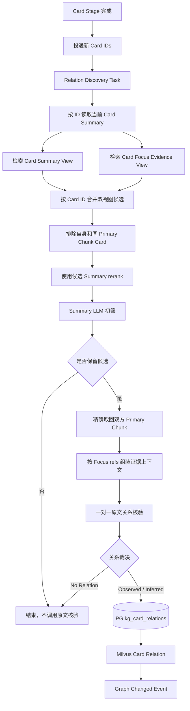

# 跨 Chunk Card 召回与原文关系核验实施方案

## 1. 模块目标

本文承接原子 Cognitive Card 与同 Chunk Relation 提取阶段。Card 发布后，沿用现有跨 Chunk 关系发现流程：

1. 使用当前 Card Summary 建立基础召回路由，并读取 PG 中已持久化的 Relation Probe 建立关系角色路由；
2. 每条 route 分别检索 Milvus Card Summary View 和 Focus Evidence View；
3. 按 Card ID 合并双视图候选；
4. 只使用候选 Summary 执行 rerank 和 LLM 初筛；
5. 只为初筛保留的候选精确取回双方完整 Primary Chunk；
6. 结合 Focus Evidence refs 一对一核验原文关系；
7. 将 Observed / Inferred 正关系幂等写入 `kg_card_relations` 和 Milvus Edge 索引；
8. 发布图变化事件供后续 Graph Community 消费。

本阶段不额外调用 `kg_relation_probe_planning`。Relation Probe 已由 Card 提取阶段生成并保存在 PG，本阶段只负责消费。

## 2. 阶段边界

### 2.1 Card 提取阶段负责

- 将当前 Chunk 提取为零个、一个或多个原子 Card；
- 为每张 Card 生成 Summary 和 Focus Evidence 引用；
- 在同一次 LLM 调用中判断当前 Chunk 内不同 Card 的正关系；
- 将同 Chunk 正关系直接写入 `kg_card_relations`；
- 发布 Card Summary View 和 Focus Evidence View。

### 2.2 跨 Chunk 关系发现负责

- 只比较当前 Card 与其他 Primary Chunk 的历史 Card；
- 排除当前 Card 自身及同 Primary Chunk 的兄弟 Card；
- 沿用 Summary 召回、rerank、Summary 初筛和原文核验流程；
- 不重复核验已经由 Card 提取阶段处理的同 Chunk Card 对。

### 2.3 不覆盖范围

- 不重新拆分 Card；
- 不修复同 Chunk Relation 漏判；
- 不创建主题目录或 Community Assignment；
- 不生成 Community 报告和条件性预测；
- 不把检索分数交给 LLM 判断事实关系。

## 3. 输入与存储契约

每张 Card 至少包含：

- `cognitive_card_id`；
- `source_id`、`evidence_id`、`primary_chunk_id`；
- `focus_evidence_refs` 和 `focus_span_offsets`；
- schema version、generator version 和状态。

可读 Summary、Focus Evidence 和完整 Chunk 文本由 Milvus 保存。PostgreSQL 只保存 Card manifest、证据引用和关系当前态，不保存完整 Card/Chunk 文本。

跨 Chunk 召回依赖 Card manifest 中的 `relation_probes` 字段；Summary 基线路由保证零 Probe Card 仍可参与关系发现。

## 4. 处理流程

## 5. 候选召回与排序

### 5.1 双视图召回

Summary baseline 与每条 Relation Probe route 都并发搜索：

- Card Summary View：偏向低噪声语义匹配；
- Card Focus Evidence View：保留原文实体、数字、限定条件和措辞。

两个视图使用相同的稳定 `VARCHAR target_id=cognitive_card_id`。结果按 Card ID 合并去重，并保留视图命中信息用于运行诊断。

### 5.2 同 Chunk 排除

候选召回后、rerank 和 LLM 调用前，必须排除：

- 当前 Card 自身；
- 与当前 Card 拥有相同 `primary_chunk_id` 的兄弟 Card。

同 Chunk Card 对已由 Card 提取调用在完整上下文中处理，不能再次进入昂贵的跨 Chunk 核验链路。

### 5.3 Summary-only rerank

- query 使用当前 Card Summary；
- document 只使用候选 Card Summary；
- Focus Evidence 和完整 Chunk 不进入 reranker；
- rerank score 低于 `KG_RELATION_RERANK_MIN_SCORE` 的候选直接丢弃，默认阈值为 `0`；
- 通过阈值的 rerank score 只用于候选排序，不进入 LLM 初筛或最终关系置信度；
- 所有候选均低于阈值时，不调用 Summary 初筛 LLM。

## 6. LLM 初筛与原文核验

### 6.1 Summary 初筛

初筛输入只包含：

- 当前 Card Summary 和材料发布时间；
- 候选 Card ID、Summary 和材料发布时间。

初筛只返回值得读取原文继续核验的候选 ID。没有候选时不调用初筛 LLM；全部拒绝时不调用原文核验 LLM。

### 6.2 原文关系核验

每次只核验一个 source/candidate Card 对。双方输入均包含：

- Card ID；
- 材料发布时间；
- 按原文顺序排列的完整 Primary Chunk 片段；
- 对应 Card Focus Evidence ref 标记。

核验结果只能是：

- `observed`：原文直接证明关系；
- `inferred`：双方原文证明端点事实，且最短连接不需要补充外部事实；
- `no_relation`：只有主题或关键词相似，或者必须依赖输入之外的信息。

`no_relation` 只输出裁决类型，不输出 basis、证据引用或其他冗余字段。

## 7. 关系写入与幂等

Observed / Inferred 正关系写入 `kg_card_relations`。关系身份由规范化 Card 对、relation kind 和关系方向稳定生成，重复投递执行 upsert。

写入顺序为：

1. PostgreSQL 正式关系当前态；
2. Milvus Edge 可读语义投影；
3. 图变化事件。

任何一步失败都由 jettask-rs 重试。只有 PG 和 Milvus 均达到当前版本后才发布图变化事件。

## 8. Langfuse 观测

完整链路至少记录：

- `kg.relation.plan_routes`：当前 Summary route；
- `kg.relation.route_recall`：两个 Milvus 视图的召回结果；
- `kg.relation.route_rerank`：Summary rerank 结果；
- `kg.relation.screen_batch`：Summary 初筛；
- `kg.relation.load_pair_evidence`：原文精确取回与完整性检查；
- `llm:kg_relation_evidence_verify`：单 Card 对原文核验；
- Edge PG、Milvus 和事件发布结果。

链路中不应出现 `llm:kg_relation_probe_planning`。

## 9. 测试用例

### 9.1 单元测试

| 用例 | 验证内容 |
| --- | --- |
| Summary route | 每张 Card 只建立一个 Summary 召回 route。 |
| Dual-view recall | 同一 query 分别检索 Summary 与 Focus Evidence 视图。 |
| Candidate merge | 双视图命中的同一 Card 只保留一个候选。 |
| Same chunk exclusion | 自身和同 Primary Chunk Card 在 rerank 前被排除。 |
| No candidate | 没有召回候选时不调用任何 LLM。 |
| Summary-only rerank | reranker document 不包含 Focus Evidence 或完整 Chunk。 |
| Negative rerank cutoff | 所有 rerank score 小于阈值时不调用初筛 LLM。 |
| Sparse screening | 初筛只返回候选 ID，不接收检索分数。 |
| Pair verification | 原文核验一次只处理一个 Card 对。 |
| No relation contract | `no_relation` 不输出冗余字段。 |
| Edge idempotency | 重复正关系覆盖同一正式 Edge。 |

### 9.2 集成测试

| 用例 | 验证内容 |
| --- | --- |
| Real ft_news workflow | 从真实 `ft_news` 完成 Card、同 Chunk Edge、跨 Chunk 召回和关系写入。 |
| Langfuse stage audit | Trace 中能观察 Summary baseline 和各 Probe route，且不存在额外 Probe Planning LLM；候选为空时不存在初筛和核验请求。 |
| Duplicate dispatch | 同一 Card IDs 重复投递不产生重复 Edge。 |
| Worker recovery | 强制中断后任务由 jettask-rs 恢复并达到一致状态。 |

## 10. 验收标准

1. Card 提取阶段可以输出同 Chunk `relations` 并直接写入正式 Edge；
2. 跨 Chunk 服务不调用 `kg_relation_probe_planning`，直接读取 PG Probe；
3. 跨 Chunk 召回同时使用当前 Card Summary baseline 和各 Probe query；
4. Summary 和 Focus Evidence 两个 Milvus 视图均参与候选召回；
5. 同 Primary Chunk Card 不进入 rerank、初筛和原文核验；
6. 候选为空或 rerank 后全部低于阈值时不会产生额外 LLM 费用；
7. rerank 与初筛不读取完整原文；
8. 最终关系必须经过双方原文一对一核验；
9. 正关系在 PG 与 Milvus 中幂等一致；
10. Langfuse 能完整观察真实调用阶段和成本。
