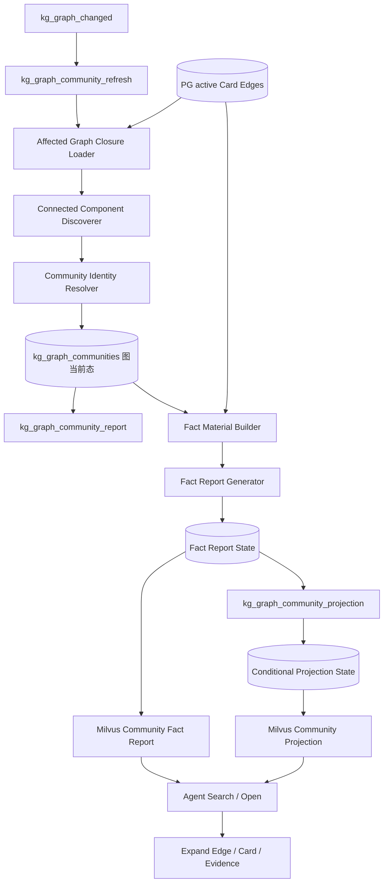
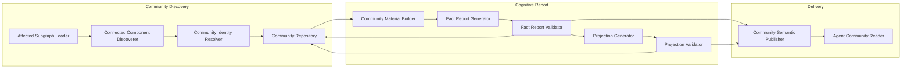
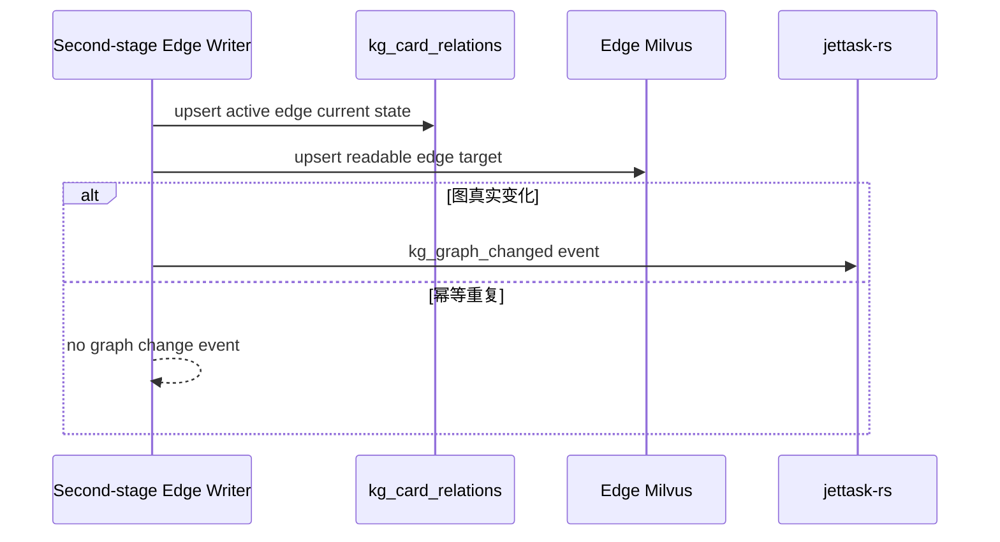
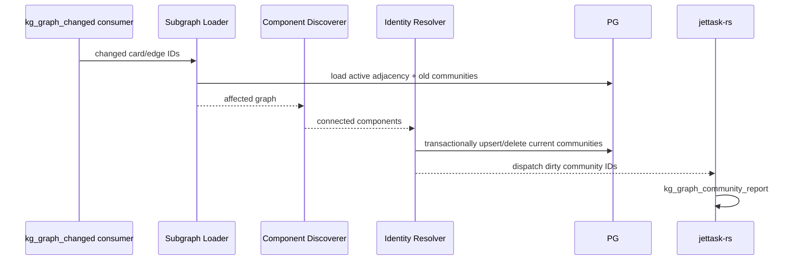
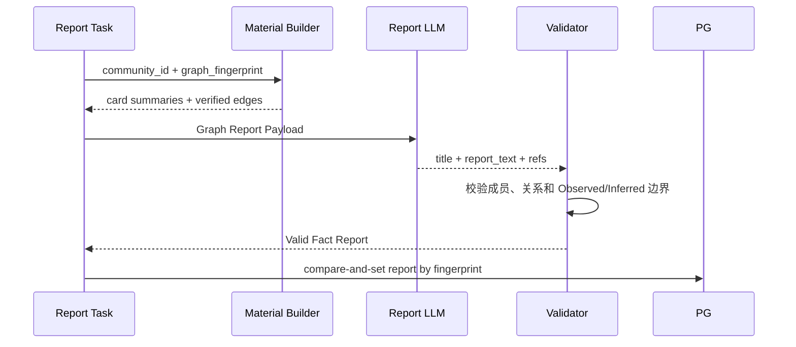
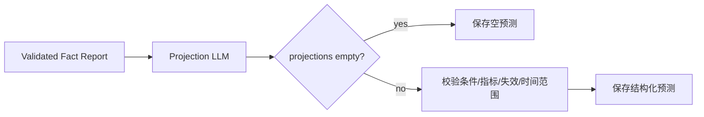

# 关系图 Graph Community 高级认知报告与条件性预测实施方案

## 1. 模块目标

本文承接关系优先 Graph Community 重构的第三阶段，输入是第二阶段已经持久化的 active Card Edge 和图变化事件，输出是可以直接交付 Agent 的关系型 Graph Community、高级认知报告和条件性未来推演。

本阶段解决以下问题：

- 消费第二阶段已经完成 PG/Milvus 写入的正式 Observed / Inferred Edge；
- 只根据有效 Edge 形成 Card 关系连通子图，不再使用主题目录和 Community 收容规则；
- 异步消费 `kg_graph_changed`，根据受影响关系子图增量创建、更新、合并或删除 `kg_graph_communities`；
- 直接在 Community 上生成一份自然语言高级认知报告，不再建立独立 `kg_community_insights`；
- 在事实报告成功后通过独立异步任务生成条件性预测，并与事实图、事实报告存储和语义索引严格隔离；
- 将 Community 事实报告和条件性预测发布为不同类型的 Milvus target，供 Agent 按认知类型检索和阅读；
- 保留 Community -> Edge -> Card -> Evidence / Chunk 的展开路径，使 Agent 可以继续核验。

本阶段不是对旧 Community Insight 的增量改造。旧方案依赖 Topic Intent、Community Assignment 和主题成员集合，证明的是 Card 与主题之间的关系；新方案只消费 Card 之间已经通过双方原文核验的正式 Edge。

新方案上线后完全取代旧方案，不保留双写、兼容读取或回退开关。旧 Topic Community、Assignment、Insight、Finding、Delta、Unassigned 相关代码、表、任务、调度、Redis 状态和 Milvus target 必须物理删除；历史主题成员关系不能转换成新 Edge。

### 1.1 当前实施状态

本文是待实施方案，不代表下列能力已经编码完成。当前已经完成的前置能力是：

- 原子 Cognitive Card 与同 Chunk Relation 提取；
- 跨 Chunk Relation Discovery 运行时 Probe 规划；
- Summary / Focus Evidence 双视图索引；
- Relation Probe 多路召回与 Summary rerank；
- Summary LLM 初筛；
- 双方完整原文精确取回；
- Observed / Inferred / No Relation 原文级一对一核验。

第二阶段已完成正式 Edge ORM/DDL/Writer、独立 Edge Milvus Collection 和 `kg_graph_changed` 图变化事件。第三阶段可以直接以 PostgreSQL active Edge 为事实源，并消费图变化事件确定受影响子图；不得重新执行关系核验或回退到旧 Community Assignment。

仍需按本文实现的能力是：

- 受影响连通子图发现；
- 新 `kg_graph_communities` 数据形态；
- 高级认知报告与条件性预测；
- Community Milvus 发布和 Agent 展开；
- 旧 Assignment / Insight / Topic Community 链路清理。

## 2. 模块边界

### 2.1 覆盖范围

本文覆盖：

- active Card Edge 和图变化事件的消费契约；
- 基于 active Edge 的受影响子图加载；
- 连通分量发现和 Community 当前态治理；
- Community 核心节点排序，但不以核心节点决定成员资格；
- 报告输入材料构建；
- 事实性高级认知报告生成；
- 条件性预测生成和空预测判断；
- Community PG 当前态保存；
- Community Milvus 语义索引；
- Agent 检索、阅读和证据展开入口；
- jettask-rs 任务、锁、幂等、恢复和观测；
- 旧数据清理、全量重建和验收。

### 2.2 不覆盖范围

第一版不覆盖：

- 根据主题、行业或关键词创建 Community；
- Seed Topic、Community Assignment、Candidate Ledger 或 bucket planning；
- 独立 `kg_community_insights` 表和独立 Insight 索引；
- 在报告阶段新增成员、创建 Edge 或修复关系图；
- 把预测写成 Card 或事实 Edge；
- 转载去重、来源质量和来源多样性加权；
- 时间衰减和边老化；
- PageRank、介数中心性或关系类型动态权重学习；
- 复杂 Community 稳定性、人工合并和自动拆分治理；
- 将旧 Topic Community 迁移为新关系 Community；
- 训练 Relation Bi-Encoder 或 Cross-Encoder。

这些能力只有在真实数据暴露明确问题后才进入后续方案，不能提前用领域硬规则补齐。

### 2.3 运行边界

同步新闻写入链路只负责完成 Card、关系核验和正式 Edge 写入。第三阶段完全异步，不阻塞 `collect_news -> kg_news_ingest -> kg_relation_discovery` 主链路：

1. 第二阶段写入 Edge、同步 Edge Milvus 后投递 `kg_graph_changed`；
2. `kg_graph_community_refresh` 消费图变化事件并只更新 Community 图当前态；
3. 图事务提交后投递 `kg_graph_community_report`；
4. 事实报告发布成功后投递 `kg_graph_community_projection`；
5. 三类任务均由 jettask-rs 独立恢复、重试和幂等执行。

首次形成合法 Community 时立即投递事实报告，不等待安静窗口。已有报告的 Community 才使用更新缓冲合并短时间内的连续图变化。

没有有效 Edge 的 Card 是合法成功状态。它继续通过 Card / Chunk 检索服务 Agent，但不创建 singleton Community，也不进入任何关系报告。

## 3. 前置输入契约

### 3.1 active Card Edge

本阶段只读取第二阶段已持久化且状态为 active 的 Edge。每条 Edge 至少包含：

- 两端 Card identity；
- 稳定关系类型；
- 事实语义方向；
- Observed / Inferred relation class；
- 原文核验裁决置信度；
- 简洁、可接地的 basis；
- 双方 Focus Evidence refs；
- Inferred Relation 的 inference mechanism；
- relation pipeline、model、prompt 和 schema version。

一条 Edge 只有同时满足以下程序可判定条件，才是 Community 构图使用的“有效 Edge”：

1. `status = active`；
2. `decision_class` 为 `observed` 或 `inferred`；
3. `relation_kind` 属于正式稳定枚举；
4. source / target Card ID 非空、互不相同，两端 Card manifest 均为 active 且属于同一 adapter；
5. 双方 evidence refs 均非空，并且分别属于对应 Card 的 `focus_evidence_refs`；
6. `basis` 非空；`inferred` 还必须拥有非空 `inference_mechanism`；
7. 当前 Edge 是该 relation identity 的最新内容版本，不是旧版本或已失效版本。

Milvus 分数、rerank 分数、LLM 初筛结果和数值置信度均不参与有效性判定。`confidence` 只用于质量评测和抽样，不设置任意阈值改变图成员。`semantic_synced_version` 和 `graph_event_published_version` 是交付水位，不是关系真实性标准；图变化事件只会在这些交付步骤完成后发出。

以下内容不能进入 Community 图：

- No Relation；
- Relation Probe role；
- recall / rerank 分数和排名；
- Summary 初筛理由；
- 没有双方证据引用的关系；
- 只依赖未标记上下文或外部常识的连接；
- 尚未发生的未来结果。

### 3.2 relation_kind 与裁决置信度消费边界

第二阶段必须直接保存稳定 `relation_kind` 和原文核验裁决置信度。`relation_kind` 至少覆盖：

- `same_event`：同一事实、同一事件或后续修订；
- `confirmation`：独立支持或相互印证；
- `contradiction`：事实、数据或观点冲突；
- `temporal_progression`：明确阶段演化或先后更新；
- `causal_influence`：原因、促进、影响或传导；
- `common_driver`：共同受同一已接地因素驱动；
- `constraint`：依赖、条件、限制或反向约束。

本阶段不从自由文本 `relation_type` 推断 `relation_kind`，输入缺少稳定 kind 时直接拒绝构图。

裁决置信度用于质量校准和回放抽样。第一版不使用任意阈值删除 active Edge，也不把置信度送入 Community 报告 LLM，避免模型根据数字替代证据判断。

### 3.3 图变化事件

第二阶段投递的事件至少包含 adapter、changed Edge IDs、affected Card IDs、变化类型和稳定事件 identity。事件只用于定位受影响关系区域，不承载完整 Edge、Card 或原文。

### 3.4 Card 和原文读取边界

Community 阶段从 PostgreSQL 读取 Card identity、Focus refs 和 Edge；从 Milvus 按 Card ID 精确读取 Card Summary。默认不把所有完整 Chunk 再次送入报告 LLM，因为关系已经在上一阶段完成原文核验。

只有以下情况可以按指针读取有限 Focus Evidence：

- 报告材料需要保留关键数字或限定条件，而 Summary 不足以表达；
- 冲突关系需要确认双方各自原话；
- Edge basis 引用的信息无法仅靠 Card Summary 理解。

Focus Evidence 只用于忠实表达已成立关系，不能用于报告阶段发现新关系。

## 4. 加入新能力后的整体架构



关键依赖方向：

- Community 成员只由 active Edge 的连通性决定；
- 核心节点只用于材料排序、命名和报告组织，不决定成员资格；
- 报告只能表达已有 Card / Edge；
- 预测只能消费已发布事实报告和已确认关系，不能反向写事实图或事实报告；
- 事实报告与预测拥有独立状态、版本字段和 Milvus target type；
- Milvus 是报告和预测的语义读取层，PG 是图当前态、派生内容状态、引用和生命周期的事实层。

## 5. 模块职责架构



### 5.1 Affected Subgraph Loader

职责：

- 从变化端点开始读取 active Edge 邻接关系；
- 扩展到受影响的完整连通区域；
- 同时加载可能被合并或拆分影响的旧 Community；
- 输出内存图所需的 Card IDs、Edge IDs、方向和关系类型；
- 对不存在、inactive 或缺失双方证据的 Edge 拒绝进入图。

### 5.2 Connected Component Discoverer

职责：

- 将 active Card 作为节点、active 正式 Edge 作为边；
- 以无向连通性确定 Community 成员，即使具体 Edge 本身有方向；
- 输出至少包含两个 Card 和一条有效 Edge 的连通分量；
- 保留 Edge 原始方向供报告使用；
- 计算唯一邻居数量用于材料排序，不以中心性过滤成员。

第一版应使用经过验证的图算法库完成连通分量计算，不手写复杂图算法。孤立 Card 不输出 Community。

### 5.3 Community Identity Resolver

职责：

- 为新连通分量生成稳定 Community ID；
- 识别新增节点、普通更新、分量合并和分量拆分；
- 决定保留哪个当前 Community ID；
- 物理删除不再存在的旧 Community 当前态；
- 返回需要删除的 Milvus target IDs。

第一版采用确定性锚点策略：每个连通分量以排序后最小 active Card ID 作为 identity anchor，Community ID 由 adapter 和 anchor 生成。新增成员不会改变 anchor；两个分量合并时保留较小 anchor 对应的 Community；拆分时包含原 anchor 的分量保留原 ID，其他分量生成新 ID。

该策略不是复杂 Lineage 治理。第一版不保留旧 Community 历史版本，也不为物理删除的 Community 建审计表。

### 5.4 Community Material Builder

职责：

- 按 Community 当前 member Card / Edge IDs 构建报告输入；
- 从 Milvus 按 ID 批量读取 Card Summary；
- 从 PG 读取 Edge kind、class、direction、basis、refs 和 inference mechanism；
- 使用程序生成的短期别名引用 Card 和 Edge，避免 LLM 复制长 ID；
- 按图结构而不是主题标签组织材料；
- 对材料缺失、断边和引用不完整明确失败。

材料排序建议：

1. 唯一邻居数较高的 Card；
2. 能形成较长有效路径的 Card / Edge；
3. Observed Relation；
4. Inferred Relation；
5. 冲突、约束和反证关系；
6. 其余叶子节点。

排序只影响上下文组织，不改变成员集合和关系强度。

### 5.5 Fact Report Generator

职责：

- 根据完整关系子图生成一份自然语言高级认知报告；
- 说明子图共同揭示的当前状态、核心事件和事件演化；
- 表达节点之间的印证、更新、冲突、约束和传导；
- 明确区分原文直接支持的关系与机制推断；
- 区分已发生事实和来源观点；
- 只引用输入中存在的 Card / Edge alias。

它不输出多个独立主题报告，不重新拆 Community，不生成检索摘要或 `index_text`。

### 5.6 Projection Generator

职责：

- 在事实报告完成后判断是否具备推演基础；
- 允许返回空预测；
- 只生成条件性未来推演；
- 为每条推演保存成立条件、可能结果、观察指标、失效条件和时间范围；
- 引用支撑推演的事实 Card / Edge；
- 不把预测写入事实 Edge。

Projection Generator 不由 Fact Report Generator 同步调用。只有事实报告以当前 `graph_fingerprint` 成功保存并发布后，才投递独立预测任务。预测失败不会回滚或阻塞已通过校验的事实报告。

### 5.7 Community Report Validator

职责：

- 校验报告和预测引用只来自当前 Community；
- 校验报告没有新增 Card 或 Edge；
- 校验 Inferred Relation 没有被改写为原文已证明事实；
- 校验预测与事实报告分离；
- 校验每条预测拥有条件、观察指标、失效条件和时间范围；
- 校验空预测是合法输出。

Validator 只做结构、引用和边界校验，不使用行业关键词判断报告结论。

### 5.8 Community Semantic Publisher

职责：

- 使用 `MilvusClient`；
- 事实报告使用稳定 `community_id` 作为 `VARCHAR target_id`；
- 条件性预测使用由 `community_id` 确定性派生的独立 `VARCHAR target_id`；
- 通过 `upsert()` 分别发布事实报告和条件性预测；
- 支持按 ID 精确读取和语义搜索；
- 删除失效或被合并 Community 的旧 target。

事实报告不按 section 拆向量，也不额外生成压缩 `index_text`。预测不得追加到事实报告正文；二者必须使用不同 collection role 和不同 target type，Agent 命中时必须明确知道当前材料是事实认知还是条件性推演。第一版采用独立 Collection，避免一次普通事实检索被未来推演污染。

目标集合固定为：

- `community_fact_report` -> `kg_graph_community_reports`；
- `community_conditional_projection` -> `kg_graph_community_projections`。

旧 `kg_community_reports` 和 `kg_community_insights` 不复用，切换时直接删除，避免历史 Topic Community target 混入新索引。

### 5.9 Knowledge Task 入口

`src/interfaces/tasks/knowledge_tasks.py` 需要新增稳定入口：

- `kg_graph_community_refresh`：监听 `kg_graph_changed`，重算受影响连通分量并更新 Community 当前态；
- `kg_graph_community_report`：只为 dirty Community 生成、校验并发布事实报告；
- `kg_graph_community_projection`：只为 fact-ready Community 生成、校验并发布条件性预测。

Task 入口只调用 application service、记录日志和返回统计，不直接操作数据库、拼 Prompt 或实现图算法。

## 6. 核心数据契约

### 6.1 active Card Relation Edge 引用

`kg_card_relations` 的 ORM、DDL、identity、写入、失效和 Milvus 语义投影由第二阶段负责。第三阶段只读取 active Edge，依赖以下字段：

- 稳定 relation identity；
- source / target Card identity；
- `relation_kind`；
- 自然语言 `relation_type`；
- direction；
- Observed / Inferred class；
- basis；
- 双方 Focus Evidence refs；
- inference mechanism；
- pipeline / model / prompt / schema version；
- 原文核验裁决置信度；
- active status；
- 创建和更新时间。

输入 Edge 缺少稳定 relation identity、kind、双方 refs 或 active 状态时拒绝构图。第三阶段不修改 Edge、不补关系类型，也不负责 No Relation 生命周期。

`kg_card_relations` 本身不重复保存 adapter。第三阶段通过 source / target Card manifest 解析 adapter，并要求两端属于同一 adapter；跨 adapter Edge 视为数据完整性错误，不进入任何 Community。

### 6.2 新 kg_graph_communities 当前态

`kg_graph_communities` 不沿用旧 Topic Community 表结构。切换时物理删除旧表并按关系图语义重建，保存关系子图当前态、事实报告状态和预测状态。目标字段职责包括：

- `community_id` 和 identity anchor；
- adapter；
- title；
- 完整事实报告、事实引用和 fact report version；
- member Card IDs；
- member Edge IDs；
- graph fingerprint；
- 条件性预测数组和 projection version；
- graph、fact report、projection 三组彼此独立的状态；
- fact report / projection 各自绑定的 graph fingerprint；
- report task dispatched fingerprint、fact semantic synced version、projection task dispatched version 和 projection semantic synced version；
- graph changed、fact report generated、projection generated 和更新时间。

以下旧字段或语义需要退出：

- level、parent Community 和主题层级；
- Assignment 聚合结果；
- `metrics` 中堆叠的 topic tags、scope、parent themes 和 assignments；
- 旧 Insight 生成时间语义；
- previous Topic Community lineage；
- 基于旧 node / edge / evidence 数组的主题聚合摘要。

事实报告和预测可以保存在同一 Community 当前态行的不同字段中，因为二者都是派生状态，不是原始 Chunk / Card 正文；但不能存入同一 JSON blob 或同一可读文本。PG 仍然不保存完整 Chunk 或 Card text。

### 6.3 graph_fingerprint

程序根据排序后的 active member Card IDs、Edge IDs 及关系内容版本生成 `graph_fingerprint`。它用于：

- 判断图内容是否真实变化；
- 避免重复生成同一报告；
- 防止延迟任务覆盖较新的图状态；
- 关联 Langfuse Trace 和报告版本。

报告 LLM 输出不参与 fingerprint 计算。

### 6.4 Fact Report 输出

事实报告 LLM 使用 JSON Schema 输出：

- `title`；
- `report_text`；
- `referenced_card_aliases`；
- `referenced_edge_aliases`。

`report_text` 是一份连续、可直接阅读的自然语言报告。不要要求固定字数，不拆成固定 section 数组，不输出 Findings 列表，也不额外生成 summary。

### 6.5 Conditional Projection 输出

预测 LLM 输出 `projections` 数组，允许为空。该数组独立保存，不嵌入 `report_text`。每项至少包含：

- 条件性判断；
- 成立条件；
- 可能发生的结果；
- 后续观察指标；
- 失效条件；
- 适用时间范围；
- 支撑该推演的 Card / Edge aliases。

不要求模型输出伪精确概率或数值置信度。程序可以把结构化预测确定性渲染为自然语言，但只能发布到独立预测 target，不能追加到事实报告 target。

## 7. 关键处理流程

### 7.1 原文核验到正式 Edge



上述写入、失效、Milvus 同步和事件水位全部属于第二阶段。第三阶段从 `kg_graph_changed` 开始，不调用 Relation Verification，也不修改 `kg_card_relations`。

### 7.2 受影响 Community 发现



Community 更新事务必须先完成成员和 fingerprint 写入，再投递报告任务。Community 行保存 `report_task_dispatched_fingerprint`：消息发送成功后才推进该水位。任务重试时即使 graph fingerprint 没有再次变化，只要投递水位落后，仍必须补发报告任务；不能因为图 upsert 是 no-op 就跳过下游投递。

“增量”不是只查看 changed Edge 本身，也不是在旧成员数组上追加 Card。每个事件按以下闭包算法处理：

1. 以事件中的 affected Card IDs 和 changed Edge 两端作为 seed；
2. 加载包含任一 seed 的旧 Community，并把这些旧 Community 的全部 member Card IDs 加入 seed；
3. 从全部 seed 沿当前 active 有效 Edge 做无向 BFS/DFS，直到没有新 Card；
4. 如果闭包触达其他旧 Community，将其全部成员继续纳入并重复扩展，直到范围稳定；
5. 在闭包内按当前 active 有效 Edge 重新计算连通分量；
6. 将新分量与所有被触达旧 Community 做集合差异比较，得到 create、update、merge、split、delete；
7. 在一个 PG 事务内写入新成员、Edge IDs、fingerprint 和 dirty 状态，并物理删除消失的 Community；
8. 事务提交后，删除被合并/拆分/删除的旧 Milvus target，并为发生真实变化的 Community 投递报告任务。

该算法对新增 Edge 和失效 Edge 都成立：新增 Edge 会把两个闭包合并；失效 Edge 会因为第二步保留旧 Community 全体成员，从而在第五步得到多个新分量。未进入闭包的 Community 不加载、不重算、不更新。

每次执行都读取数据库当前 active Edge，而不是相信事件携带的旧快照。延迟事件、重复事件和乱序事件因此会收敛到相同当前图；`graph_fingerprint` 未变化时整个后续报告链路直接跳过。

### 7.3 首次报告与更新缓冲

首次形成合法 Community 且尚无报告时立即生成，不等待稳定窗口。

已有报告的 Community 在短时间连续收到多个 Edge 更新时进入 dirty 状态，并使用 jettask `TaskMessage.delay` 延迟投递报告任务，避免每条新闻都重复调用模型。任务携带 `community_id + expected_graph_fingerprint`：

- 第一次报告使用 `delay=0`；
- 已有报告更新使用配置的 quiet-window delay；
- 后续图变化不取消旧消息，而是更新 Community fingerprint 并再投递一个新延迟消息；
- 旧消息到期后发现 expected fingerprint 已过时，立即幂等退出；
- 最新消息只有在 fingerprint 匹配且最后图变化已经越过安静窗口时才生成报告。

这样缓冲仍由 jettask-rs 的持久消息承担，不需要 scheduler 或数据库扫描兜底。安静窗口只用于已有报告更新，不得延迟首次报告。

如果任务开始时发现 fingerprint 已改变，应放弃当前旧材料并重新读取；如果任务完成前 fingerprint 改变，旧结果不得覆盖新图状态，并重新投递最新 fingerprint。

### 7.4 事实性报告生成



报告生成失败不能写入半成品。已有旧报告正文可以留在 PG 作为上一派生结果，但其 fingerprint 不再匹配当前图，状态必须为 stale/dirty，且旧 Milvus target 已删除，Agent 不得把它作为当前报告返回。首次生成失败时 Community 的 fact report 保持 failed / pending，不发布空 target。

### 7.5 条件性预测生成

事实报告校验、保存并发布成功后，投递独立任务，使用独立 LLM 请求生成预测：



预测任务只读取当前 fact report version、其绑定的 graph fingerprint 和引用材料。预测失败只把 projection 状态标记为 failed 并重试，不回滚、不隐藏已经发布的事实报告。

事实与预测通过五层边界隔离：

1. **生成隔离**：不同 task、不同 LLM request、不同 Prompt 和 JSON Schema；
2. **存储隔离**：事实报告字段与 projection 字段分开，版本和状态分别维护；
3. **图隔离**：预测不创建 Card/Edge，不参与成员发现和 `graph_fingerprint`；
4. **索引隔离**：事实报告与预测进入不同 Milvus Collection/target type；
5. **读取隔离**：Agent 命中结果明确标记 `fact_report` 或 `conditional_projection`，普通事实检索默认不搜索预测集合。

图 fingerprint 变化时，旧预测立即标记 stale 并删除对应 Milvus target。只有新事实报告 ready 后才能生成新预测，因而不会把旧推演包装成当前结论。

### 7.6 Community 合并、拆分和删除

- 新 Edge 连接两个旧分量：保留确定性 anchor 较小的 Community ID，物理删除另一个 Community，删除其 Milvus target；
- Edge 失效导致分量拆分：包含旧 anchor 的分量保留原 ID，其余分量生成新 ID；
- Community 只剩孤立 Card：物理删除 Community 和 Milvus target，Card 本身保留；
- Card 重建：先使涉及旧 Card 的关系失效，再按新 Card 重新运行关系发现；
- 重复事件：fingerprint 未变化时不刷新报告。

报告层不能通过保留已断开的旧成员来维持文字连续性。

### 7.7 Milvus 发布与 Agent 读取

Milvus 使用两个明确隔离的可读 target：

- `community_fact_report`：Community title + 完整事实报告；
- `community_conditional_projection`：明确标记的条件性推演，只在 projections 非空时存在。

两个 payload 都保存 Community ID、各自版本、graph fingerprint、member Card IDs 和 Edge IDs；不得保存 recall / rerank 分数、旧 Assignment 或旧 Insight identity。预测 target 还必须保存其依赖的 fact report version。

Agent 普通知识搜索默认只搜索事实报告。只有问题明确询问未来情景、风险路径或观察条件时才搜索预测集合。事实报告命中后可以直接消费；需要核验时，以 Community ID 从 PG 展开 Edge，再按 Card ID 从 Milvus 精确读取 Summary / Focus Evidence，最后按 Chunk 指针读取原文。

## 8. Community 发现策略

### 8.1 成员资格

成员资格只有一个来源：满足 3.1 节完整有效性契约的 active 正式 Edge。构图时把有向 Edge 临时投影为无向边计算连通分量，但报告仍读取原始方向。以下条件均不足以加入 Community：

- Summary 语义相似；
- 属于同一行业或主题；
- 出现同一宽泛实体；
- 被同一 Relation Probe 召回；
- rerank 分数高；
- 报告 LLM 认为加入后更完整。

### 8.2 Observed 与 Inferred Edge

Observed 和 Inferred Edge 都可以参与连通性，但必须保留 class。报告材料不得把两者折叠成同一种事实强度。

如果一个 Community 只由 Inferred Edge 构成，仍可形成 Community，但报告必须明确其连接依赖机制推断。第一版不使用任意数值阈值删除 Inferred Edge。

### 8.3 方向与连通性

Community 发现按无向连通性处理，避免有效传导链因为方向不同被拆散。报告生成继续使用 Edge 的事实方向表达先后、因果和约束。

### 8.4 超大连通分量

第一版不在报告阶段拆分 Community，也不以主题聚类切断有效 Edge。如果真实图出现超大连通分量，应先检查 Edge 是否过宽、关系类型是否退化或关系核验是否产生虚假桥接，再决定是否设计关系类型权重或图划分算法。

报告生成器不能为上游错误图兜底。该风险出现时必须记录到 `9. 待优化.md`，不能静默增加隐藏截断。

## 9. 报告材料与 Prompt 约束

### 9.1 Fact Report 输入

动态 User Payload 使用普通 JSON 字段，不使用短 key 压缩。结构包含：

- Community identity 和 graph fingerprint；
- Card 数组：alias、Card ID、Summary、发布时间；
- Edge 数组：alias、两端 Card alias、relation kind/type、direction、relation class、basis、inference mechanism；
- 可选的有限 Focus Evidence 引用材料。

输入不包含：

- Relation Probe；
- recall / rerank 信息；
- Community 主题标签；
- 旧 Assignment reason；
- 旧 Insight；
- 预测草稿；
- 与当前分量无关的 Card。

### 9.2 Fact Report System Prompt

System Prompt 必须稳定且不包含日期、Community ID、具体领域示例或动态成员。核心要求：

- 只综合输入关系图，不重新寻找关系；
- 输出一份连续自然语言高级认知报告；
- 报告重点是跨节点关系、演化、印证、冲突、约束和传导，不逐条复述 Card；
- Observed Relation 可以表述为已确认连接；
- Inferred Relation 必须带有推断边界，不能写成原文明示因果；
- 来源观点不能改写为客观事实；
- 不新增 Card、Edge、主题或外部常识；
- 不输出未来预测；
- 不固定字数，不为满足长度重复信息；
- 不拆成多个独立主题报告；
- 只输出 JSON Schema 要求的字段。

Prompt 中不放领域示例。真实示例只存在于测试数据和评审文档，避免模型形成固定领域偏好。

### 9.3 Projection 输入

预测请求消费：

- 已校验事实报告；
- 当前 Card / Edge alias；
- Edge relation class 和 inference mechanism；
- 报告引用的事实范围。

不重新输入无关标签，不从外部检索补知识，不读取旧预测作为事实。

### 9.4 Projection System Prompt

核心要求：

- 先判断现有关系图是否具备状态变化、阶段演化或传导机制；
- 缺少推演基础时返回空数组；
- 每条预测都使用“在条件持续成立时，某结果更可能出现”的条件性表达；
- 必须给出可观察指标、失效条件和时间范围；
- 不输出确定性承诺；
- 不把预测结果写成已经发生；
- 不引用 Community 外部事实；
- 不为了生成预测而机械填满字段；
- 只输出 JSON Schema 要求的字段。

### 9.5 报告质量不使用长度阈值

报告质量由关系覆盖、事实忠实度、跨文档综合价值和可读性决定，不设置最少字数。小型关系子图可以输出短报告；复杂关系子图应完整表达重要关系，但不能通过重复 Card Summary 凑长度。

## 10. 数据与索引生命周期

### 10.1 Edge 生命周期

```text
verified decision
  -> contract_validated
  -> active relation
  -> updated / unchanged
  -> inactive when card/evidence/relation invalidates
```

关系失效必须触发图变化事件。物理删除还是 inactive 由 Edge 当前态治理决定；第一版推荐保留 inactive Edge 的最小结构用于幂等判断，但 Community 只读取 active Edge。

### 10.2 Community 生命周期

```text
graph_state:
  component_discovered -> active -> merged / split / physically_deleted

fact_report_state:
  missing -> dirty -> generating -> publishing -> ready
          -> dirty after graph change / failed and retryable

projection_state:
  missing -> pending_after_fact_ready -> generating -> publishing -> ready / empty
          -> stale after graph change / failed and retryable
```

Community 只保存当前态，不保留旧 Topic Community 历史。report version 用于识别当前报告迭代次数，不代表保留历史报告正文。

### 10.3 预测生命周期

预测与 fact report version 和 graph fingerprint 绑定。事实图变化后旧预测立即标记 stale 并删除预测 Milvus target，不能继续作为当前 Community 的预测返回。新事实报告没有完成前不生成预测；预测失败不影响 fact report ready 状态。

### 10.4 Milvus 生命周期

- Fact report ready 后 upsert 事实报告 target；
- Projection ready 且非空后 upsert 独立预测 target；
- 同一 Community 更新时分别覆盖各自稳定 target ID；
- Community dirty、合并、拆分或删除时清理对应 stale target；
- PG 写入成功但 Milvus 失败时任务重试；
- Milvus 可以重建，不反向成为 Community 成员事实源。

## 11. 并发、幂等与恢复

### 11.1 任务投递

使用 jettask-rs：

- Edge PG/Milvus 成功后由第二阶段投递 `kg_graph_changed`；
- `kg_graph_community_refresh` 作为 `kg_graph_changed` 的消费者更新 Community 图当前态；
- Community 当前态事务提交后投递 `kg_graph_community_report`；
- Fact report 保存和 Milvus 发布成功后投递 `kg_graph_community_projection`；
- 不使用 Redis list / stream 保存业务消息；
- 不在数据库扫描中兜底制造遗漏任务。

### 11.2 分布式锁

Community 发现第一版使用 adapter 级 Redis 原生 lock，避免两个任务同时合并或拆分相同连通区域。事实报告和预测共享 Community ID 级 Redis 原生 lock，避免同一 Community 的两个派生任务交叉写入；不同 Community 仍可并发。图刷新不获取 Community 级锁，而通过 fingerprint compare-and-set 阻止旧报告或旧预测覆盖新图，避免锁顺序死锁。

长任务按现有锁续租规范执行；只有持有当前 token 的任务可以续租和释放。丢失锁后不得继续写 PG 或 Milvus。

### 11.3 幂等键

- Edge：relation identity；
- Graph change：event identity；
- Community current state：community ID + graph fingerprint；
- Report：community ID + graph fingerprint + report generator version；
- Projection：community ID + graph fingerprint + fact report version + projection generator version；
- Fact Milvus：community ID；
- Projection Milvus：由 community ID 确定性派生的 projection target ID。

重复任务允许重复执行读取和计算，但不能增加重复 Edge、重复 Community 或重复报告版本。

Community 图、事实报告和预测分别维护“当前内容版本、Milvus 已同步版本、下游任务已投递版本”。每一步只在外部副作用成功后推进对应水位，重试从第一个落后水位继续，不重新制造新的业务版本。

### 11.4 故障恢复

- Edge PG 事务失败：不投递图变化；
- 图变化投递失败：由第二阶段水位和 jettask-rs 恢复重试；
- Community 更新失败：PG 事务回滚；
- Report task 投递失败：Community 投递水位不推进，refresh 任务重试后补发；
- 报告 LLM 失败：保持 dirty / failed，可重试；
- 预测 LLM 失败：事实报告保持 ready，预测保持 failed 并独立重试；
- Fact Milvus upsert 失败：fact semantic 水位不推进，不投递预测任务；
- Projection task 投递失败：projection dispatched 水位不推进，report 任务重试后补发；
- Projection Milvus upsert 失败：projection semantic 水位不推进并独立重试；
- Worker 强制终止：由 jettask-rs 恢复 in-flight 任务。

## 12. Langfuse 与诊断

### 12.1 Trace 层次

建议 Trace：

```text
kg.relation_discovery
  -> kg.relation.edge.pg_upsert
  -> kg.relation.edge.materialize
  -> kg.relation.edge.milvus_upsert
  -> kg.relation.graph_change.publish

kg.graph_community.refresh
  -> kg.community.subgraph.load
  -> kg.community.components.discover
  -> kg.community.identity.resolve
  -> kg.community.pg.apply

kg.graph_community.report
  -> kg.community.materials.build
  -> llm:kg_graph_community_report
  -> kg.community.report.validate
  -> kg.community.pg.save
  -> kg.community.milvus.upsert

kg.graph_community.projection
  -> kg.community.projection.materials
  -> llm:kg_graph_community_projection
  -> kg.community.projection.validate
  -> kg.community.projection.pg.save
  -> kg.community.projection.milvus.upsert
```

### 12.2 图诊断

记录：

- changed Card / Edge 数；
- 受影响节点和边数；
- 连通分量数量；
- 新增、更新、合并、拆分和删除 Community 数；
- 孤立 Card 数；
- graph fingerprint 变化；
- 幂等跳过次数。

### 12.3 报告诊断

记录：

- Community Card / Edge 数；
- Observed / Inferred Edge 数；
- 输入字符和 token；
- 报告字符数；
- 被引用 Card / Edge 数；
- 预测数量和空预测原因；
- report version、fingerprint 和 generator version；
- Prompt cache hit / miss tokens；
- 校验错误、repair 和最终状态；
- PG 与 Milvus 发布结果。

应用日志不打印完整报告和完整原文，完整输入输出由 Langfuse 保存。

## 13. 迁移与旧能力清理

### 13.1 数据结构迁移

正式 Card Relation 表已由第二阶段完成。第三阶段切换不迁移旧 Community 结构，执行以下物理替换：

- drop 并按新关系图契约重建 `kg_graph_communities`；
- drop `kg_community_insights`；
- drop `kg_community_assignments`；
- drop `kg_assignment_candidate_orders`；
- drop 旧报告体系专用的 `kg_graph_findings`、`kg_graph_deltas` 和 `kg_graph_unassigned_signals`；
- 新表只保留关系图成员、graph fingerprint、事实报告、条件性预测及各自独立状态/版本；
- 为 active Community、dirty report、pending projection 和 fingerprint 增加明确索引。

DDL 不能只存在于运行时初始化代码，必须同步维护 `schema/06_knowledge.sql` 和相关 cognitive index schema。旧表定义必须从 schema 基线删除，并新增一次性 drop/recreate 迁移 SQL；不能让全新数据库再次创建已经废弃的表。

### 13.2 代码清理

需要物理删除，而不是标记 deprecated 或保留空实现：

- `CommunityAssignmentBuilder` 及旧 Assignment LLM；
- Assignment ledger、checkpoint、bucket planner 和 merge；
- `CommunityInsightService` 旧扫描刷新链路；
- `KnowledgeCommunityInsight` ORM 和 repository；
- 独立 `community_insight` Milvus collection；
- Topic Community material builder；
- `graph_index.py`、`graph_index_reporter.py` 中只服务旧 Topic/Finding/Delta Community 的实现；
- 旧 Insight task 和 schedule；
- Agent 对独立 Insight target 的特殊读取分支。

同时删除旧 Redis 状态：Assignment candidate ledger、checkpoint、bucket catalog、bucket lock 和 redirect log；删除旧 Milvus `community_insight`、assignment bucket cache 以及旧 Topic Community report targets。任何仍依赖旧对象的调用都应在测试中直接失败，不能增加兼容读取或静默返回空值。

新代码不能通过兼容旧表隐藏遗漏调用。删除旧能力后仍有调用的地方应直接报错并被测试发现。

### 13.3 历史数据处理

不迁移旧 Community、Assignment 和 Insight。执行切换时：

1. 停止并删除旧 Community / Insight task 和 schedule；
2. 删除旧 Community、Assignment、Insight、Finding、Delta 和 Unassigned 表；
3. 删除旧 Community / Insight / Assignment Milvus collection 和 Redis 状态；
4. 保留可信 Evidence 和 Chunk；
5. 按原子 Card 最新版本重新构建 Card；
6. 重新执行关系发现和正式 Edge 写入；
7. 从新关系图构建 Community、报告和预测。

不能把旧 Community 成员关系转成新 Edge。

## 14. 实施顺序

### 14.1 已完成前置能力

第二阶段已经完成正式 Edge ORM/DDL、稳定 identity、双方 refs 校验、PG/Milvus 当前态和 `kg_graph_changed` 事件。第三阶段不得重复实现 Edge Writer。

### 14.2 实现受影响子图和 Community

- 加载 active adjacency；
- 使用图算法库计算连通分量；
- 实现确定性 anchor identity；
- 实现合并、拆分、删除；
- 保存 graph fingerprint 和 dirty 状态。

### 14.3 实现事实报告

- 构建 Card / Edge alias 材料；
- 实现稳定 System Prompt 和 JSON Schema；
- 校验引用和 Observed / Inferred 边界；
- 保存 report version。

### 14.4 实现条件性预测

- 独立 jettask task 和 LLM 请求；
- 允许空预测；
- 校验条件、指标、失效条件和时间范围；
- 将预测绑定 report version / fingerprint。

### 14.5 实现 Milvus 与 Agent 消费

- 建立事实报告和条件性预测两个 Collection；
- 分别 upsert 事实报告和预测；
- 删除 stale Community target；
- 接入 Agent search / open / expand；
- 验证报告可直接交付和按需回源。

### 14.6 删除旧链路并全量重建

- 删除旧代码、表、schedule 和索引；
- 清理旧数据；
- 重跑真实新闻；
- 完成 PG / Milvus / Langfuse 一致性验收。

## 15. 技术风险与评审关注点

### 15.1 relation_kind 不稳定

如果继续只保存自由文本关系类型，Edge 幂等、图分析和报告边界都会抖动。必须在第二阶段输出稳定枚举，不能在 Writer 中关键词归类。

### 15.2 虚假桥接形成超大分量

一个错误 Edge 可能把两个本应独立的关系图连接成大 Community。应通过关系质量回放解决，不能在报告阶段按主题偷偷拆分。

### 15.3 Inferred Relation 被事实化

报告 LLM 容易把机制推断写成确定性事实。输入、Prompt、输出引用和人工回放都必须保留 relation class。

### 15.4 报告退化为 Card 拼接

如果报告只是逐条复述 Summary，就没有高级认知价值。评测必须检查是否表达跨 Card 的更新、印证、冲突、约束和传导。

### 15.5 预测污染事实层

预测必须使用独立输出结构和独立 Prompt，不写 Edge，不参与 Community 成员发现，不进入后续事实关系候选。

### 15.6 Community 身份变化

确定性 anchor 能满足第一版，但复杂删除和频繁拆分可能造成 ID 变化。真实问题出现后再设计完整 lineage，当前不能伪装成已解决复杂稳定性治理。

### 15.7 报告上下文过大

第一版不允许静默截断关系图。若合法 Community 超过模型预算，应明确失败并记录规模诊断，先排查虚假桥接，再设计分层图摘要；不能只截前 N 个成员后宣称生成了完整报告。

### 15.8 PG 与 Milvus 不一致

PG 是当前态事实源，Milvus 是可重建读取层。任务必须暴露发布失败并重试，Agent 不能把旧 Milvus 报告当作最新版本。

## 16. 验证指标

### 16.1 输入关系图健康指标

- Verified Positive -> Edge 写入成功率；
- Edge identity 重复率；
- 无双方 refs Edge 数；
- No Relation 误写入数；
- Observed / Inferred 分类准确率；
- 裁决置信度校准误差；
- relation kind 覆盖和混淆矩阵。

### 16.2 Community 指标

- active Community 中孤立 Card 数，必须为 0；
- Community 成员 active Edge 覆盖率，必须为 100%；
- 跨 Community active Edge 数，除处理中的 dirty 状态外必须为 0；
- 重复任务后的 Community 数量稳定性；
- merge / split / delete 正确率；
- 超大连通分量和规模分布。

### 16.3 报告指标

- 报告引用合法率；
- 图中关键关系覆盖率；
- 未输入 Card / Edge 幻觉率；
- Inferred Relation 事实化比例；
- Card Summary 逐条复述比例；
- 跨文档关系认知有效率；
- Agent 直接可用率。

### 16.4 预测指标

- 缺乏基础时空预测比例；
- 条件、指标、失效条件和时间范围完整率；
- 预测被写入事实 Edge 的数量，必须为 0；
- 使用 Community 外部事实比例；
- 后续真实事件对预测的可验证率。

### 16.5 工程指标

- 图变化事件恢复率；
- 报告任务幂等率；
- 首次报告延迟；
- 已有报告更新合并率；
- 锁续租失败数；
- PG / Milvus fingerprint 一致率；
- stale Milvus target 数。

## 17. 测试用例

### 17.1 输入契约单元测试

| 用例 | 验证内容 |
| --- | --- |
| Valid Observed Edge | 满足 active、kind、refs、端点和版本契约时进入图。 |
| Valid Inferred Edge | inference mechanism 完整时进入图并保留 class。 |
| Inactive Edge | 不进入图。 |
| Invalid Ref | 引用不属于对应 Card 时拒绝构图。 |
| Inactive Endpoint | 任一 Card 失效时拒绝构图。 |
| Cross Adapter | 两端 Card adapter 不一致时拒绝构图。 |
| Delivery Watermark | 水位用于诊断，不被错误当作关系真实性阈值。 |

### 17.2 Community 单元测试

| 用例 | 验证内容 |
| --- | --- |
| Single Edge | 两个 Card 形成一个 Community。 |
| Isolated Card | 不形成 Community。 |
| Chain Graph | 无高连接中心的链式结构仍形成 Community。 |
| Star Graph | 高连接节点只影响排序，不丢叶子节点。 |
| Merge Components | 新 Edge 连接两个分量后保留确定性 Community ID。 |
| Split Component | Edge 失效后正确拆分并分配 ID。 |
| Remove Last Edge | Community 物理删除，Card 保留。 |
| Duplicate Event | fingerprint 不变时不生成新报告版本。 |
| Inferred-only Graph | 可以形成 Community，并保留 class。 |
| Invalid Edge Exclusion | inactive、非法 kind、空 refs、失效端点或跨 adapter Edge 不进入图。 |
| Incremental Closure | 从 changed endpoints 和旧 Community 全体成员扩展到完整关系闭包。 |
| Unaffected Community | 未进入闭包的 Community 不读取、不更新。 |

### 17.3 报告 LLM 测试

| 用例 | 验证内容 |
| --- | --- |
| Multi-source Confirmation | 报告表达相互印证，不逐条复述。 |
| Temporal Progression | 报告正确表达阶段更新。 |
| Direct Causal Chain | 只表达图中已有传导。 |
| Common Driver | 不错误升级为 A 导致 B。 |
| Contradiction | 同时保留双方观点和冲突边界。 |
| Inferred Relation | 明确说明机制推断，不写成原文明示。 |
| Unknown Alias | 输出引用不存在 alias 时校验失败。 |
| Invented Edge | 报告创造图外关系时验收失败。 |
| No Fixed Length | 小图允许短报告，不触发凑字修复。 |

### 17.4 预测 LLM 测试

| 用例 | 验证内容 |
| --- | --- |
| Empty Projection | 只有重复确认时返回空数组。 |
| Conditional Projection | 条件、结果、指标、失效和时间范围完整。 |
| Deterministic Claim | 把未来写成必然事实时校验失败。 |
| External Fact | 引用 Community 外部事实时失败。 |
| No Basis Ref | 没有 Card / Edge 支撑时失败。 |
| Fact Isolation | 预测不写入 Card Relation 表或事实报告字段。 |
| Independent Task | 预测失败不回滚已发布事实报告。 |

### 17.5 PG / Milvus 集成测试

| 用例 | 验证内容 |
| --- | --- |
| ORM / DDL 一致 | 新表字段、索引和默认值一致。 |
| Community Save | 图、事实报告和预测按独立状态保存。 |
| Community Upsert | 同 ID 新 fingerprint 正确更新版本。 |
| Fact Milvus Upsert | 使用 Community ID 覆盖事实报告。 |
| Projection Milvus Upsert | 使用派生 target ID 覆盖预测，不混入事实集合。 |
| Collection Isolation | 普通事实搜索不查询预测 Collection。 |
| Get By ID | 可以精确取回完整 Community 报告。 |
| Semantic Search | 跨文档问题可以召回对应 Community。 |
| Stale Delete | merge / split / delete 后旧 target 被清理。 |
| Fingerprint Guard | 旧任务不能覆盖新图报告。 |

### 17.6 任务与恢复测试

| 用例 | 验证内容 |
| --- | --- |
| Edge Event | Edge 变化后触发 Community refresh。 |
| No-op Event | 重复 Edge 不重复触发报告。 |
| Delayed Refresh | 已有报告更新使用 jettask delay，首次报告不延迟。 |
| Stale Delayed Message | 旧 fingerprint 延迟消息到期后幂等退出。 |
| Task Ordering | Projection 只能由 fact report 发布成功后投递。 |
| Worker SIGKILL | jettask-rs 可以恢复 in-flight 任务。 |
| Duplicate Delivery | 重复事件最终状态幂等。 |
| Adapter Lock | 同 adapter 图变更串行，避免冲突。 |
| Community Lock | 不同 Community 可并发，同 Community 不并发。 |
| Lock Lost | 丢锁后不写 PG / Milvus。 |
| Report LLM Failure | Community fact report 保持 dirty / failed 并可重试。 |
| Projection LLM Failure | Fact report 保持 ready，projection 独立失败和重试。 |
| Milvus Failure | PG 当前态保留并重试发布。 |

### 17.7 Agent 端到端测试

| 用例 | 验证内容 |
| --- | --- |
| Cross-document Query | Agent 命中并直接读取高级认知报告。 |
| Evidence Expand | 从 Community 展开 Edge、Card 和原文。 |
| Isolated Fact Query | 无 Community 的 Card 仍可通过 Card / Chunk 搜索。 |
| Projection Query | Agent 明确看到条件、指标、失效条件和时间范围。 |
| Stale Report | 不把旧 fingerprint 的预测交付为当前结论。 |

### 17.8 真实数据回放

真实回放至少覆盖：

- 同一事实多来源确认；
- 同一事件连续更新；
- 明确原因和结果；
- 共同驱动但无直接因果；
- 支持与冲突并存；
- 条件或约束改变传导链；
- 链式图和中心辐射图；
- 孤立 Card；
- 两个 Community 被新 Edge 合并；
- Edge 失效导致 Community 拆分；
- 可以预测和应当空预测的对照案例。

每个案例应保存预期 Card、Edge、Community 成员、报告必须覆盖关系、禁止出现关系和预测边界，并通过 Langfuse 回放。

## 18. 验收标准

满足以下条件才可以认为本阶段完成：

1. 第三阶段只消费第二阶段正式 Edge 和 `kg_graph_changed`，不重复写 Edge；
2. Community 只由满足有效性契约的 active Edge 连通性形成，孤立 Card 不进入；
3. 增量闭包能正确处理普通更新、merge、split 和 delete，未受影响 Community 不重算；
4. 链式图和中心辐射图都可以形成 Community；
5. merge / split / delete 后 PG 和两个 Milvus 派生索引当前态一致；
6. 高级认知事实报告直接保存在 `kg_graph_communities`，不创建独立 Insight 表；
7. 报告只表达输入图中已有关系，不新增成员和 Edge；
8. Observed 和 Inferred Relation 在报告中保持不同证据强度；
9. 图刷新、事实报告和预测使用三个异步任务；预测允许为空，并包含条件、指标、失效条件和时间范围；
10. 预测不写事实 Card / Edge，不参与 Community 成员归属，不进入事实报告索引；
11. Milvus 分别发布完整事实报告 target 和条件性预测 target；事实报告不拆 section、不生成 `index_text`；
12. Agent 默认检索事实报告，按需检索预测，并可展开到 Edge、Card 和原文；
13. jettask-rs 强制中断、重复投递、延迟消息和乱序消息验收通过；
14. 旧 Assignment、Topic Community、独立 Insight、Finding、Delta、Unassigned、账本和 bucket 链路已经物理删除；
15. 旧数据已经清理并从 Evidence / Chunk 按新链路重建；
16. 单元测试、集成测试、真实数据回放和 Langfuse 观测全部通过；
17. 所有实现偏差和降级都已记录到 `9. 待优化.md`。

## 19. 已确认实施决策

1. Card 本身是关系图节点，不新增重复 Card Node 表；
2. 正式 Edge 必须来自双方原文核验；
3. 第二阶段已经提供稳定 `relation_kind`、裁决置信度和正式 Edge 当前态，第三阶段直接消费；
4. Community 成员只由满足完整有效性契约的 active Edge 连通性决定；
5. 核心节点用于排序和报告组织，不是 Community 存在前提；
6. 第一版按受影响连通分量异步更新，不在同步新闻写入中生成报告；
7. `kg_graph_communities` 同时承载关系子图当前态和完整高级认知报告；
8. 不再建立独立 `kg_community_insights`；
9. 事实报告和条件性预测使用两个独立异步任务、状态、版本和索引；
10. 报告是一份自然语言全文，不拆 section、不生成 summary 或 `index_text`；
11. 预测允许为空，不输出伪精确概率；
12. 预测不进入事实图；
13. Milvus 使用不同 Collection 分别索引完整事实报告和条件性预测；
14. 首次合法 Community 立即生成报告，已有报告更新使用可配置安静窗口；
15. 使用 jettask-rs 承担消息恢复，不引入 Redis Stream；
16. 使用 Redis 原生 lock 处理 adapter 图更新和 Community 报告并发；
17. 旧 Community、Assignment、Insight、Finding、Delta 和 Unassigned 能力全部物理删除，不迁移、不兼容读取，按新关系链路全量重建；
18. 报告阶段发现图质量问题时回到 Edge 层修复，不在报告中兜底拆分或降权。
