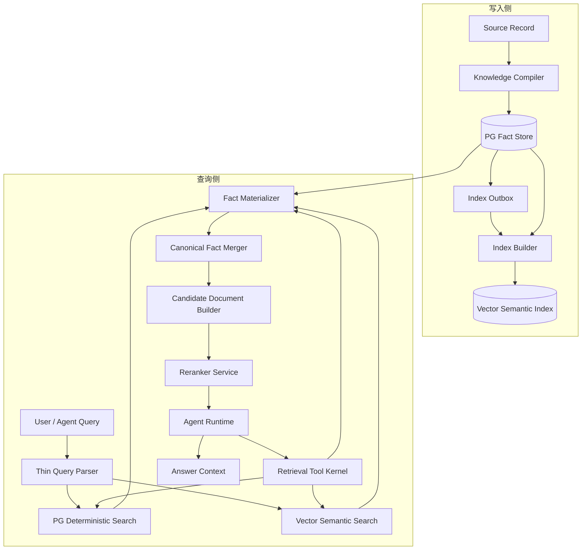
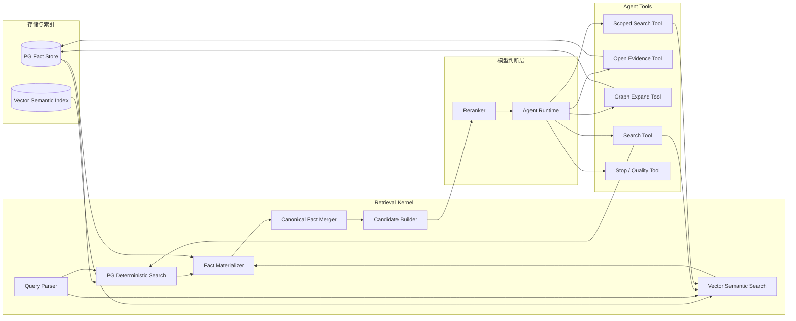
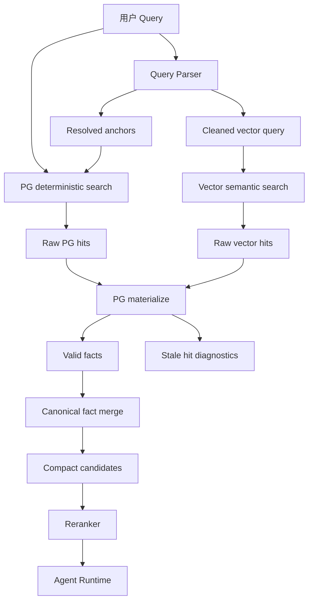
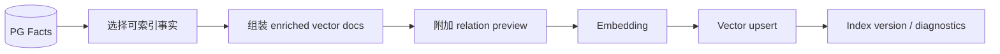
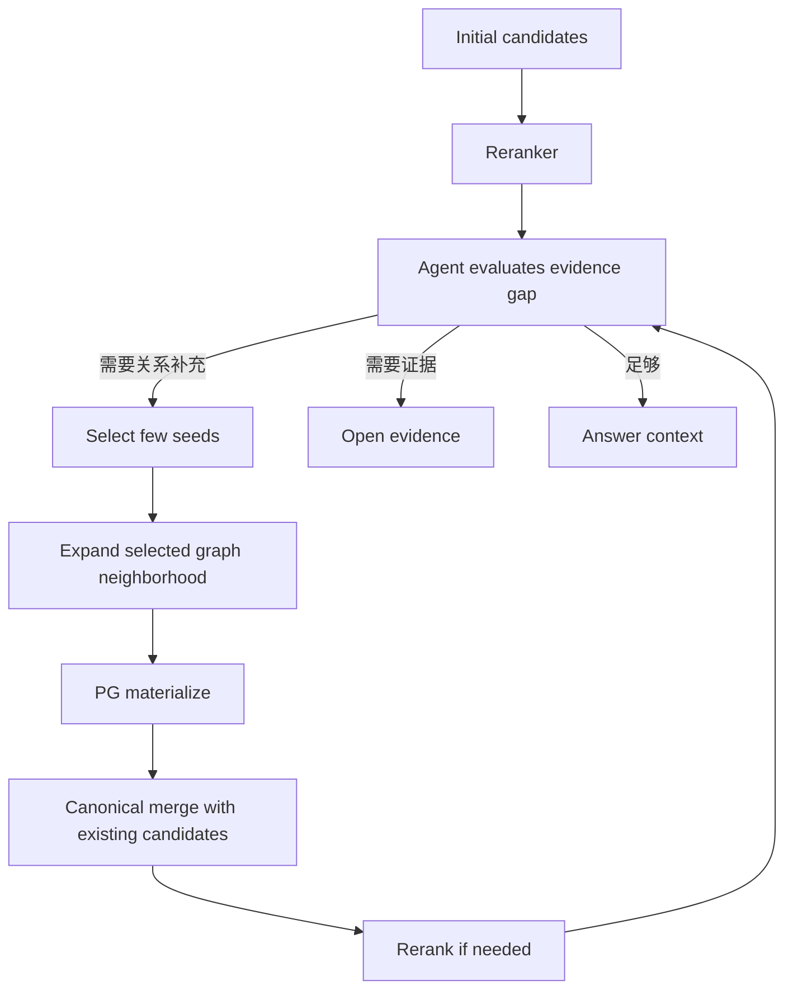
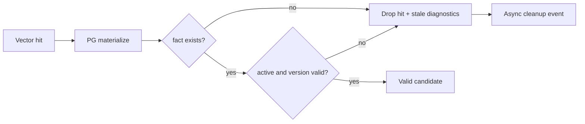

# 检索索引架构重构实施方案

> 最新收敛口径：具体落地应以 `10. Milvus语义检索与PG关系展开双层架构实施方案.md` 为准。本文保留检索索引重构的中间阶段实施判断；涉及 PG 是否参与首轮检索、Milvus 是否直接返回可读文本、chunk refs / edge evidence refs 的最终方案，以第 10 篇为准。

## 1. 模块目标

本文承接设计文档的最终结论，说明检索索引架构应该如何落地。

对应设计文档：

`docs/5. 设计方案/1. 知识图谱/9. 检索索引架构重构讨论.md`

本文只写实施方向、模块分工、方案选型和迁移路径，不写代码级实现、表字段细节或接口参数。

## 2. 实施边界

本方案覆盖：

- PG deterministic search。
- Vector semantic search。
- Query Parser / exact resolver。
- enriched vector docs。
- relation preview。
- canonical fact merge。
- reranker 接入位置。
- Agent 按需 graph expand。
- PG 与向量索引一致性处理。
- 旧检索层迁移和删除路径。

本方案不覆盖：

- 交易决策系统。
- 行情、因子、持仓、风控等结构化查询引擎。
- 具体 embedding 模型选型。
- 具体向量数据库产品迁移。
- 代码函数、类、接口字段和测试脚本细节。

## 3. 加入新能力后的整体系统架构

新能力加入后，知识图谱检索从“多通道固定工作流”调整为“事实源 + 语义索引 + 检索内核 + Agent 调度”的分层架构。



架构含义：

- 写入侧仍以 PG Fact Store 为事实源。
- 向量索引由 PG facts 派生，可以重建。
- 查询侧先并行召回，再统一 materialize、归并、rerank。
- Agent 通过 Tool Kernel 调度后续动作，而不是直接操作底层存储。
- 旧 `kg_retrieval_*`、Wiki 检索层、retrieval document 检索层不再处于核心链路中。

## 4. 模块职责架构

目标架构分为五层：

```text
PG Fact Store
  唯一事实源，保存 node / edge / evidence / source record

Vector Semantic Index
  可重建语义索引，保存 enriched vector docs

Retrieval Kernel
  并行召回、回表校验、事实归并、候选构造

Reranker
  对归并后的候选做统一语义排序

Agent Runtime
  根据当前证据状态和问题目标选择下一步工具、方法和停止时机
```

职责边界：

- PG 负责确定性事实查询。
- Vector DB 负责自然语言语义查询。
- Graph 负责已选结果的局部关系展开。
- Reranker 负责候选价值判断。
- Agent 负责检索过程中的工具调度、策略选择和停止判断。

### 4.1 模块职责图



模块职责：

| 模块 | 主要职责 | 不负责 |
| --- | --- | --- |
| Query Parser | 识别强标识、生成 cleaned vector query、解析明确时间范围 | 情绪判断、复杂意图理解、graph seed 选择 |
| PG Deterministic Search | 代码、source、标题、别名、关系过滤、局部 graph 查询 | 开放语义召回 |
| Vector Semantic Search | 自然语言语义召回 enriched vector docs | 理解金融代码、保证事实状态 |
| Fact Materializer | 回 PG 校验事实状态、过滤 stale / inactive hit | 排序和语义判断 |
| Canonical Fact Merger | 合并同一事实的多通道命中 | 按业务类别做硬 cap |
| Candidate Builder | 构造给 reranker / Agent 的紧凑候选 | 携带完整原文 |
| Reranker | 判断候选和问题的语义相关性 | 修复脏数据、替代回表校验 |
| Agent Runtime | 选择工具、方法、下一步动作和停止时机 | 直接绕过 Tool Kernel 操作存储 |
| Tool Kernel | 封装 search、open、expand、scoped search、quality check | 代替 Agent 做复杂策略决策 |

## 5. 第一阶段召回流程

第一阶段召回采用 PG + Vector 并行入口。



这个流程的关键是：

- PG 和 Vector 是并行入口。
- Query Parser 的结果只辅助两路召回，不成为全局硬过滤。
- 向量命中必须回 PG 校验。
- Reranker 看到的是归并后的事实候选。

### 5.1 PG deterministic search

PG deterministic search 使用：

- 原始 query。
- Query Parser 识别出的代码、source_id、evidence_id、标题、别名、市场、时间范围。
- Agent 已选择的 seed。
- graph neighborhood 中的局部过滤条件。

它适合：

- direct lookup。
- 股票、基金、指数代码映射。
- source_id / evidence_id 查找。
- 标题、别名、市场等确定性匹配。
- 关系类型、证据来源、实体名等局部 graph 过滤。
- debug、replay、trace。

它不适合：

- 开放语义主召回。
- 情绪、风险、利好、行业传导等语义判断。
- 依赖 PG keyword 分数直接抢占全局 topK。

### 5.2 Vector semantic search

Vector semantic search 使用自然语言语义 query。

执行规则：

```text
如果 Query Parser 检测到强标识：
  vector_query = cleaned query

否则：
  vector_query = 原始 query
```

强标识包括：

- 股票代码。
- 基金代码。
- 指数代码。
- source_id。
- evidence_id。
- kg_id。

强标识不默认进入 vector query，也不默认转换为 `node_ids contains ...` filter。

Vector 默认 filter 只保留通用有效性约束：

```text
active
not deleted
adapter_name
可选时间范围
```

强实体 filter 只作为 scoped vector search 能力保留，由 Agent 在需要收窄范围时显式调用。

## 6. enriched vector docs

向量索引不再依赖 PG 中的 `kg_retrieval_*`、Wiki 或 retrieval document。

迁移期写入侧可能仍会生成这些旧派生材料，但它们只用于回放、对比和调试，不应进入核心 search 主链路，也不应作为 enriched vector docs 的上游。写入侧整体适配方案见：

`docs/3. 实施方案/4. 知识图谱/8. 写入侧语义索引材料适配实施方案.md`

索引文档应从 PG facts 派生，面向语义检索组织。

建议保留这些文档类型：

- Evidence Chunk：原文证据片段。
- Node Card：实体、主题、政策、资产的语义卡片。
- Edge Card：关系、两端节点、关系含义和证据。
- Event Card：事件及其涉及主体、行业、资产、政策。
- Cluster Card：多篇新闻合并后的同一事件。
- Timeline Card：事件流和演化。

每个向量文档必须能回到 PG facts：

- node ids。
- edge ids。
- evidence ids。
- source ids。
- fact version。
- index version。
- active / deleted 状态。

向量文档必须逐步带 relation preview，尤其是 Node Card、Evidence Chunk、Event Card 这类首次召回候选。Preview 需要在写入侧生成并随向量索引材料一起写入；它不应包含无限展开后的完整 graph。

### 6.1 索引构建流程图



索引构建的原则：

- 只从合法 PG facts 派生索引文档。
- 索引文档必须能回表。
- relation preview 只表达关系方向，不替代 graph expand。
- 索引失败不能改变 PG facts。

### 6.2 当前实现状态

这一阶段不是全部完成状态，当前代码处在“主检索链路切换 + 写入侧迁移”的中间阶段。

| 项目 | 当前状态 | 后续动作 |
| --- | --- | --- |
| Evidence Chunk | 已进入 semantic index | 保留，后续补 relation preview / source metadata。 |
| Node Card | 基础 node document 已进入 semantic index | 改造成正式 Node Card，补 canonical meaning、relation preview、expand handles。 |
| Edge Card | 基础 edge document 已进入 semantic index | 改造成正式 Edge Card，统一 source / target / relation / evidence 摘要格式。 |
| Event Card | 未完整实现 | 从 event node + evidence + related edges 生成独立 Event Card。 |
| Cluster Card | 未实现 | 等同事件合并或事件聚类能力稳定后再生成。 |
| Timeline Card | 未实现 | 等事件流 / 时间线材料稳定后再生成。 |
| semantic index 消费旧 retrieval document / Wiki | 已移除 | 保持不回退，后续只从 facts 派生索引材料。 |
| 写入侧生成旧 retrieval document / Wiki | 迁移期仍存在 | 后续删除或降级为离线回放/调试材料。 |

也就是说，当前“向量索引不再依赖 PG 中的 `kg_retrieval_*`、Wiki 或 retrieval document”已经在 semantic index 输入层完成，但“完整 enriched vector docs”还需要继续补齐写入侧材料构造。

## 7. relation preview 与 graph expand

### 7.1 relation preview

首次召回的候选应带轻量 relation preview，用于提示该候选背后的关系方向。

relation preview 可以包括：

- 主要主体。
- 主要行业。
- 主要政策。
- 主要资产。
- 少量关键关系样例。
- 可展开 handle。

它的作用是帮助 reranker 和 Agent 判断是否值得展开，而不是替代真实 graph expand。

### 7.2 graph expand

Graph expand 只能发生在候选已经被初步筛选之后。

推荐流程：



Graph expand 的硬边界：

- 不做全局 graph 召回。
- 不全量展开初始 topN。
- depth 第一阶段只允许 1。
- 每轮 seed 数量受控。
- 每个 seed 的关系数量受控。
- expanded candidates 不能淹没 initial candidates。

PG keyword / exact 可以在已选 graph neighborhood 中做局部过滤。

## 8. 候选归并与去重

排序前不做领域类别 cap。

不应使用：

- 每个 node_type 最多 N 个。
- 每个行业最多 N 个。
- 每个 source_channel 最多 N 个。
- keyword / semantic / graph 固定比例。

排序前只做：

- stale / inactive 过滤。
- canonical fact merge。
- 完全重复删除。
- 基础预算控制。

canonical key 优先级：

```text
1. edge_id
2. node_id + evidence_id
3. evidence_id + source_span
4. source_id + doc_type
5. event_cluster_id
6. normalized_title + source_id
```

归并后的候选需要保留：

- source channels。
- PG hit ids。
- vector doc ids。
- node ids。
- edge ids。
- evidence ids。
- matched terms。
- relation preview。
- expanded_from。

目标是把多个索引视角压缩成一个事实候选，而不是丢弃信息。

## 9. Reranker 接入位置

Reranker 应接在事实归并之后。

推荐位置：

```text
PG hits + Vector hits + Optional expanded hits
  -> materialize
  -> canonical merge
  -> compact candidate documents
  -> reranker
```

Reranker 前应保证：

- 候选可回表。
- 候选未软删除。
- 同一事实只出现一次。
- 候选文本紧凑且包含关键语义。
- 候选带可追踪 id。

Reranker 不负责处理脏数据，不负责替代 stale 校验，也不负责弥补重复候选。

已有现成的 API 接口，具体接入方式见：

`docs/7. 接口文档/Reranker排序服务.md`

## 10. Query Parser / exact resolver

Query Parser 必须保持薄。

它负责：

- 识别确定性标识。
- 解析明确时间范围。
- 生成 cleaned vector query。
- 生成 PG deterministic search anchors。

它不负责：

- 判断情绪。
- 判断事件类型。
- 判断关系意图。
- 选择 graph seed。
- 做复杂 query rewrite。

解析结果的使用规则：

```text
PG:
  使用 raw query + resolved anchors

Vector:
  如果 has_strong_identifiers，使用 cleaned query
  否则使用 raw query
```

Parser 错误不能成为全局硬过滤。它只能影响 PG 的确定性候选和 vector query 清洗，不应默认限制向量搜索空间。

## 11. PG 与向量索引一致性

PG facts 是唯一事实源。

Vector DB 是可重建索引。

查询时必须回 PG materialize：



如果向量命中回 PG 找不到：

- 丢弃当前 hit。
- trace 记录 stale vector hit。
- 候选不足时继续拉更多 hits。
- 异步提交 cleanup event。
- 后台 indexer 删除或重建对应 vector doc。

索引刷新应由 PG 事实变更驱动：

```text
PG fact change
  -> outbox event
  -> index builder
  -> vector upsert / delete
  -> index version update
```

不应在 query-time 临时拼出长期索引文档。

## 12. 迁移路径

### 12.1 第一阶段：新增并行召回路线

保留现有链路，新增独立路线：

```text
vector_pg_parallel_arag
```

该路线验证：

- PG deterministic search。
- cleaned vector query。
- materialize。
- canonical merge。
- reranker。
- relation preview。

### 12.2 第二阶段：构建 enriched vector docs

从 PG facts 生成新的向量索引文档：

- Evidence Chunk。
- Node Card。
- Edge Card。
- Event Card。
- Cluster Card。
- Timeline Card。

新索引必须带 fact ids、source ids、active/deleted、fact version、index version。

本阶段必须同步完成写入侧 relation preview 适配：

- Node Card 带直接关系方向摘要。
- Evidence Chunk / Event Card 带主体、行业、资产、政策、影响方向。
- Reranker 输入能看到 relation preview。
- Agent bootstrap observation 能看到可展开 handle。
- 新向量索引材料不再从 retrieval document 或 Wiki 派生。

### 12.3 第三阶段：替换旧检索层

逐步下线：

- `kg_retrieval_*` 检索表。
- Wiki 检索层。
- retrieval document 检索层。
- 多通道手写 rank fusion。
- PG graph 全局召回。
- 领域类别 cap。

下线前需要 A/B 回放确认新链路质量不低于旧链路。

### 12.4 第四阶段：Agent 接管调度

当基础召回稳定后，Agent 使用工具能力做调度：

- search。
- open evidence。
- expand graph。
- scoped vector search。
- stop verifier。

Agent 决定什么时刻使用哪种工具、采用哪种检索方法、执行哪种下一步动作，以及什么时候停止，而不是固定工作流强制每个 query 都走相同步骤。

## 13. 技术风险与评审关注点

| 风险 | 表现 | 方案约束 |
| --- | --- | --- |
| Query Parser 误识别 | cleaned query 清理过度，导致语义召回缺词 | Parser 保持薄；PG 使用原始 query；Vector 只清理强标识 |
| 向量索引 stale | vector hit 回 PG 找不到或状态过期 | 查询时强制 materialize；记录 stale diagnostics；异步 cleanup |
| 候选重复 | 同一事实以 node、edge、event card 多次出现 | reranker 前做 canonical fact merge |
| Graph 展开爆炸 | 一跳关系过多，expanded candidates 淹没初始候选 | 只展开 Agent 选择的少量 seed；限制 depth、seed 数、edge 数 |
| Reranker 输入质量差 | 候选文本缺少关键语义或重复冗长 | Candidate Builder 统一构造紧凑候选，并保留 evidence / relation preview |
| 旧链路下线风险 | 删除 `kg_retrieval_*` 后 debug 能力下降 | 迁移期保留 A/B trace；新增 source channel 和 stale diagnostics |
| Agent 调度不可控 | 工具调用过多或进入循环 | Tool Kernel 统一预算、trace、质量检查和停止条件 |

技术评审时应重点确认：

- 模块边界是否清晰，是否还有事实层和索引层混用。
- Query Parser 是否过度承担语义理解。
- 向量索引文档是否能稳定回表。
- canonical merge 是否能覆盖 node / edge / evidence / vector doc 的重复表达。
- Agent 工具是否足够清晰，是否能记录完整 trace。
- 迁移期间旧链路和新链路如何 A/B 对比。

## 14. 验证指标

A/B 和回放至少关注：

- pass rate。
- context precision。
- evidence coverage。
- duplicate candidate rate。
- canonical merge compression rate。
- stale vector hit rate。
- PG deterministic contribution。
- Vector semantic contribution。
- graph expand yield。
- reranker topK 命中质量。
- trace 可解释性。

强标识 query 需要单独评估：

- 代码 query 是否仍能稳定命中直接事实。
- cleaned vector query 是否提升语义候选质量。
- 不默认 vector hard filter 是否增加有效旁路候选。

## 15. 待确认问题

实施前仍需确认：

- cleaned vector query 的清洗边界。
- relation preview 的最大长度。
- scoped vector search 的触发方式。
- canonical merge 的最终 key 优先级。
- stale hit 的补拉策略。
- 旧 `kg_retrieval_*` 删除前的数据迁移和回放策略。
- trace 如何展示 PG、Vector、Graph 多视角归并后的候选来源。
