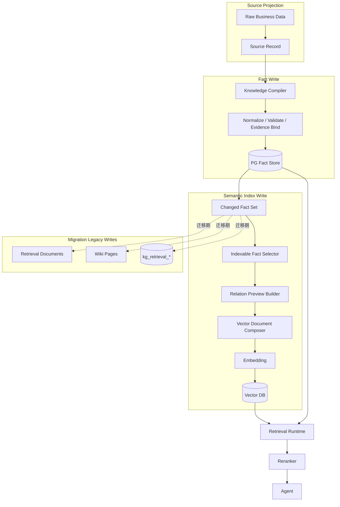
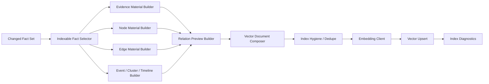
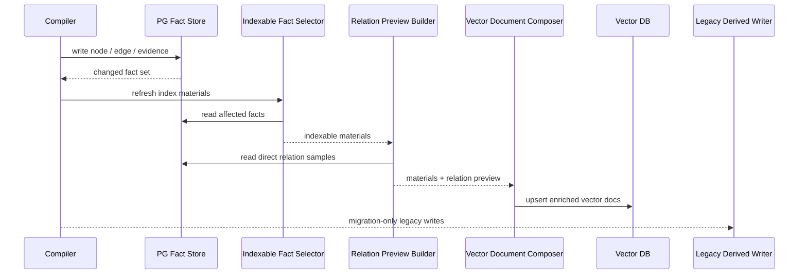
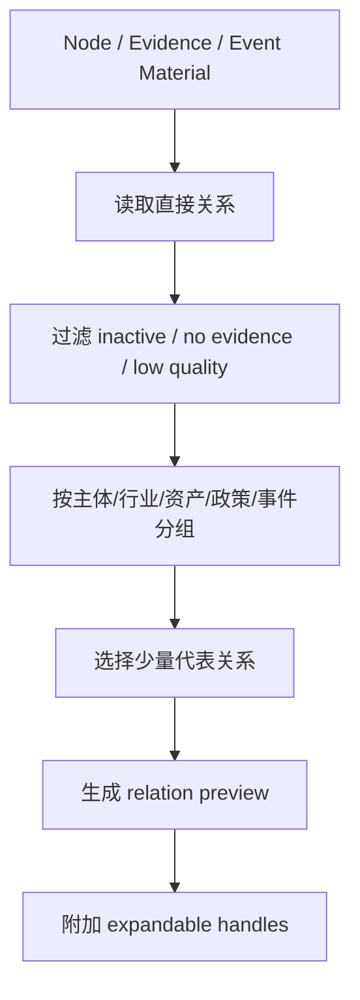
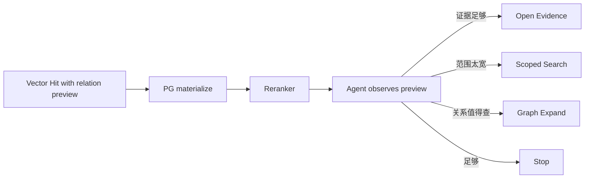

# 写入侧语义索引材料适配实施方案

> 最新收敛口径：写入侧实现需要配合 `10. Milvus语义检索与PG关系展开双层架构实施方案.md`。PG 不保存完整 chunk_text / card_text；Milvus 保存可读 search target；PG refs 只负责连接 evidence、edge 和 Milvus target。

## 1. 模块目标

本实施方案对应设计文档：

`docs/5. 设计方案/1. 知识图谱/10. 写入侧语义索引材料设计方案.md`

目标是把知识图谱写入侧改造成“事实写入 + 语义索引材料派生”的清晰结构。

本方案重点解决：

1. 在向量索引写入前生成 relation preview。
2. 让 Node Card / Evidence Chunk / Event Card 等索引材料带上可供 reranker 和 Agent 使用的关系方向。
3. 将旧 `kg_retrieval_*`、Wiki、retrieval document 写入定位为迁移期产物，后续逐步退出核心链路。

## 2. 模块边界

### 2.1 覆盖范围

本方案覆盖写入侧和索引刷新侧的协作关系：

- PG Fact Store 写入完成后的 changed fact set。
- Semantic Index Material Builder。
- Relation Preview Builder。
- Vector Document Composer。
- Embedding / Vector upsert。
- 旧派生材料的迁移期处理。

### 2.2 不覆盖范围

本方案不覆盖：

- 具体向量数据库产品迁移。
- 具体表结构、字段和迁移 SQL。
- Reranker 服务内部算法。
- Agent prompt 细节。
- 完整 graph expand 算法。

## 3. 加入新能力后的整体系统架构

架构判断：

- Fact Write 只负责事实正确性。
- Semantic Index Write 只负责从 facts 生成可重建索引材料。
- Legacy Writes 在迁移期可以存在，但不能成为新检索主链路依赖。

## 4. 模块职责架构

### 4.1 Indexable Fact Selector

职责：

- 根据 changed fact set 找出需要刷新索引的事实。
- 将 node、edge、evidence 的直接变化扩散到受影响的索引材料。
- 过滤 deleted、rejected、inactive facts。
- 给后续模块提供稳定的 fact ids 和 source ids。

关键点：

- selector 不能读取旧 retrieval document 作为输入。
- selector 的输入必须来自 PG facts。

### 4.2 Relation Preview Builder

职责：

- 为 node / evidence / event 类候选生成短 relation preview。
- 按关系类型、证据质量、时间和重要性选择少量关系样例。
- 输出可展开 handle，例如 node ids、edge ids、evidence ids。
- 保证 preview 可追溯到 facts。

Preview 应该包含的方向：

- 主体。
- 行业。
- 资产。
- 政策。
- 事件。
- 影响关系。
- 证据来源。

Preview 不应该包含：

- 全量邻居。
- 多跳完整路径。
- 无证据关系。
- 已删除或低质量 rejected facts。
- 大段原文。

### 4.3 Vector Document Composer

职责：

- 把事实材料和 relation preview 合成为向量索引文档。
- 控制每类文档的长度和信息密度。
- 保留 materialize 所需的 fact ids。
- 给 reranker 准备更有语义的信息，但不生成新事实。

核心原则：

- title 不能只重复 canonical name。
- meaning 必须表达候选为什么可能和 query 有关。
- evidence_summary 只截取关键证据。
- relation preview 只给方向，不替代 graph expand。

### 4.4 Legacy Derived Writer

职责：

- 迁移期继续维护旧 `kg_retrieval_*`、Wiki、retrieval document 的写入。
- 给 A/B 回放、质量对比和调试保留材料。
- 标记这些产物为 legacy derived materials。

边界：

- 新检索主链路不能依赖它们。
- 新索引材料不能从它们派生。
- 删除计划应该独立跟踪。

## 5. 关键流程

### 5.1 增量写入刷新流程

### 5.2 Relation Preview 生成流程

Preview 的选择策略应稳定、可解释：

- 优先有 evidence 的关系。
- 优先和材料本身 evidence 相同来源的关系。
- 优先 active / extracted / reviewed 关系。
- 优先用户常问维度：主体、行业、资产、政策、影响。
- 控制每类关系数量，避免一个热门节点吞掉全部 preview。

### 5.3 查询侧消费流程

## 6. 数据 / 索引 / 状态生命周期

### 6.1 事实生命周期

PG facts 是唯一事实源。

事实状态变化后，索引材料必须跟随刷新：

- 新增事实：新增相关 vector docs。
- 更新事实：刷新受影响 vector docs。
- 删除事实：删除或标记 stale vector docs。
- 关系变化：刷新两端 node card、edge card、相关 evidence/event card 的 preview。

### 6.2 Preview 生命周期

Relation preview 是派生状态。

它的生命周期应由 facts 决定：

### 6.3 Legacy 派生材料生命周期

迁移期：

- 可以继续构建 Wiki、retrieval document、`kg_retrieval_*`。
- 必须在文档和 trace 中标记它们不是核心链路。
- 不允许新增核心逻辑依赖它们。

目标期：

- 删除旧写入入口。
- 删除旧查询入口。
- 保留必要的离线回放数据或迁移脚本。

## 7. 方案选型和边界

### 7.1 为什么 preview 在写入侧生成

写入侧生成 preview 的收益：

- 可缓存。
- 可重建。
- reranker 排序前可见。
- Agent 首轮观察可见。
- 避免查询时反复查图拼接。

代价：

- 写入侧需要维护 preview stale。
- 关系更新会影响更多索引材料。
- 需要控制 preview 长度和选择策略。

这个代价可以接受，因为 PG facts 是事实源，索引材料本来就是可重建派生状态。

### 7.2 为什么不继续依赖 retrieval document

retrieval document 本质也是检索材料。

在目标架构中，它应该被 enriched vector docs 替代，而不是继续作为 PG 中的第二套检索层。

保留 retrieval document 的唯一合理理由是迁移期回放和调试，不是长期核心能力。

### 7.3 为什么 Wiki 不作为核心检索层

Wiki 更适合解释和展示，不适合作为 Agentic RAG 的主召回来源。

原因：

- Wiki 容易混合多个事实。
- Wiki 更新粒度和 facts 不完全一致。
- Wiki 作为召回候选会增加背景噪声。

如果后续需要背景解释，可以将背景性内容作为专门的向量文档类型，而不是让 Wiki 页面进入核心链路。

## 8. 当前实现差距

当前代码已经完成了一部分检索侧切换，但写入侧语义材料还没有完全达到目标状态。

| 能力 | 当前状态 | 需要补齐 |
| --- | --- | --- |
| semantic index 不消费旧 retrieval document / Wiki | 已完成 | 保持从 facts 直接生成向量材料。 |
| Evidence Chunk | 已有 | 补 source metadata、relation preview 和可展开 handle。 |
| Node Card | 部分完成 | 当前只是 node 基础文本，需要补 meaning、relation preview、evidence summary。 |
| Edge Card | 部分完成 | 当前已有关系两端和证据 id，需要补统一 card 格式和面向检索的关系解释。 |
| Event Card | 未完成 | 从 event node、绑定 evidence、相关主体/行业/资产/政策边生成。 |
| Cluster Card | 未完成 | 依赖同事件聚合能力，先不阻塞第一阶段。 |
| Timeline Card | 未完成 | 依赖事件流/时间线材料，先不阻塞第一阶段。 |
| 旧 retrieval document / Wiki 写入 | 仍存在 | 迁移期可保留，但必须标记为 legacy，不能作为新索引材料上游。 |

因此，后续实现不应该再扩展旧 `kg_retrieval_*`、Wiki 或 retrieval document，而应该把精力放在 `Indexable Fact Selector -> Relation Preview Builder -> Vector Document Composer` 这条写入侧主链路上。

## 9. 迁移路径

### 9.1 第一阶段：补齐 relation preview

目标：

- Node Card 带 relation preview。
- Evidence Chunk / Event Card 可带关键关系摘要。
- Reranker 输入能看到 preview。
- Agent trace 能看到 preview 和 expandable handles。

不要求立即删除旧写入。

### 9.2 第二阶段：新旧索引并行回放

目标：

- 新 enriched vector docs 进入检索主链路。
- 旧 retrieval document / Wiki 只做对照。
- 记录 A/B 结果和 bad case。

重点观察：

- 首轮召回命中率。
- reranker 排序质量。
- Agent 工具调用次数。
- stale vector hit 比例。

### 9.3 第三阶段：停用旧核心链路

目标：

- search 主链路不再消费旧 retrieval document / Wiki。
- semantic index 不再从旧 retrieval document 构建。
- 旧 `kg_retrieval_*` 不再作为查询入口。

### 9.4 第四阶段：删除旧写入

目标：

- 删除旧派生材料写入。
- 删除无用表或降级为离线调试产物。
- 文档和 trace 中移除迁移期说明。

## 10. 技术风险与评审关注点

| 风险 | 表现 | 处理方向 |
| --- | --- | --- |
| Preview 过长 | 向量文档主题漂移，重复召回 | 限制每类关系数量和总长度 |
| Preview 过短 | Agent 不知道是否 expand | 保留主体、行业、资产、政策、事件五类核心方向 |
| Stale preview | 关系变更后向量命中旧事实 | 关系更新触发受影响文档刷新；查询回 PG 校验 |
| 旧写入未退出 | 系统继续维护多套检索材料 | 将旧产物标记为 migration-only，设置删除阶段 |
| Reranker 输入仍然重复 title | 排序泛化差 | Composer 必须生成 meaning 和 relation preview |
| 写入成本增加 | 每次关系更新影响多个 card | 增量 selector 控制刷新范围 |

## 11. 验证指标

### 11.1 写入侧指标

- 生成 vector docs 数量。
- 带 relation preview 的 node card 占比。
- preview 平均长度和最大长度。
- stale / deleted vector docs 清理数量。
- preview 构建失败数量。

### 11.2 检索侧指标

- 首轮召回结果中带 relation preview 的比例。
- reranker topK 中 preview 候选占比。
- Agent 平均工具调用次数。
- graph expand 调用是否更精准。
- bad case 中“候选孤立、无法判断是否展开”的比例。

### 11.3 迁移指标

- 主链路中 legacy retrieval document 命中占比应逐步降为 0。
- 主链路中 Wiki 命中占比应逐步降为 0。
- 旧 `kg_retrieval_*` 查询调用次数应逐步降为 0。

## 12. 待确认问题

- Relation Preview 是否按不同 node type 使用不同模板。
- Event Card 和 Cluster Card 的边界如何划分。
- Preview 是否需要独立版本号，还是跟随 vector doc index version。
- 旧 Wiki 是否完全删除，还是保留为只读解释页面。
- 删除旧 `kg_retrieval_*` 前需要保留多久回放窗口。
