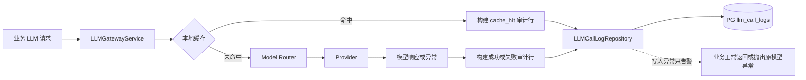

# LLM 调用日志与成本审计技术实施方案

## 1. 模块目标

所有业务模型调用统一经过 `LLMGatewayService`。本模块在这一公共入口记录完整逻辑调用，为以下场景提供稳定数据源：

- 模型质量和 Prompt 效果分析；
- Prefix Cache、本地缓存和 token 消耗分析；
- 按任务、模型、Provider 和时间统计成本；
- 构建后续模型训练、蒸馏和评测数据集；
- 定位失败、超时、修复重试和异常输出。

一条记录代表一次调用方发起的逻辑请求。Provider 内部为了 HTTP 重试、JSON 修复而产生的物理请求汇总在该行的 `usage`、`response_payload.raw_payload` 和 `response_payload.proxy` 中；业务层通过 `repair_with_feedback` 发起的二次调用会单独记录。

## 2. 模块边界

### 2.1 覆盖范围

- 成功调用；
- 调用失败；
- 内存缓存命中；
- 文件缓存命中；
- Claude tmux 和 DeepSeek Provider；
- 文本、结构化输出、Tools 和 JSON Schema 请求；
- Provider 返回的 Usage 和费用字段。

### 2.2 不承担的职责

- 不代替 Langfuse 的链路观测；
- 不在日志表中修改或修复模型结果；
- 不根据未经版本化的网上价格推算费用；
- 不允许日志写入失败改变模型调用业务结果；
- 不保存 API Key、Authorization、Token、Cookie 或密码。

## 3. 整体架构

## 4. 数据结构

表名为 `llm_call_logs`，使用应用生成的 UUID 字符串作为 `id`。

### 4.1 调用身份和路由

- `id`；
- `task`、`source_type`、`source_id`；
- `provider`；
- `requested_model`、`resolved_model`、`upstream_model`；
- `route_reason`；
- `request_hash`。

### 4.2 完整材料

- `request_payload`：Prompt、System Prompt、Messages、模型参数、JSON Schema、Tools、Metadata 等脱敏请求；
- `response_payload`：文本、结构化输出、原始 Provider 诊断、Proxy 元数据和 Session；
- `usage`：Provider 返回的完整标准化 Usage。

请求和响应使用 JSONB 保存，不截断正文。敏感认证字段在落库前递归替换为 `[REDACTED]`。

### 4.3 Token 与缓存

- `input_tokens`、`output_tokens`、`total_tokens`；
- `reasoning_tokens`；
- `prompt_cache_hit_tokens`、`prompt_cache_miss_tokens`；
- `cache_creation_tokens`、`cache_read_tokens`；
- `cache_hit`、`cache_store`。

本地内存或文件缓存命中没有发生上游模型调用，因此列化 token 和费用均记为 0；被复用响应原来的 Usage 仍保存在 `usage` JSONB，用于计算缓存节省量。上游 Prefix Cache 仍然发生真实模型调用，其 token 按 Provider 返回值正常记录。

### 4.4 成本

- `input_cost`、`output_cost`、`cache_cost`、`total_cost`；
- `currency`；
- `cost_source`；
- `cost_details`。

成本口径：

- Provider 返回金额：`cost_source=provider_reported`，保存原始费用字段并列化金额；
- 本地缓存：`cost_source=local_cache`，实际费用为 0；
- Provider 只返回 token：`cost_source=unavailable`，金额保持空值，不伪造价格。

如果后续需要按价格表估算，必须引入带生效时间和版本的独立模型定价快照，不能直接修改历史调用成本。

### 4.5 状态与错误

- `status`：`succeeded`、`failed` 或 `cache_hit`；
- `duration_ms`；
- `error_type`、`error_message`；
- `started_at`、`completed_at`、`created_at`。

## 5. 写入策略

审计写入通过 `asyncio.to_thread()` 调用同步 SQLAlchemy Repository，避免阻塞异步事件循环。Repository 只提供批量 `save_batch`，并按 `id` 冲突忽略，保证重复提交不产生重复行。

审计日志是分析旁路：

- 模型成功、审计失败：记录错误日志并返回模型结果；
- 模型失败、审计成功：保存失败记录并继续抛出原模型异常；
- 模型失败、审计失败：记录审计异常并继续抛出原模型异常；
- 不允许审计异常覆盖原始模型异常。

## 6. 查询和数据使用

常用筛选字段建立 B-Tree 索引：

- `created_at`；
- `(task, created_at)`；
- `(resolved_model, created_at)`；
- `(status, created_at)`；
- `(source_type, source_id)`。

训练数据导出时必须显式过滤：

- `status=succeeded`；
- 业务质量评测通过；
- 不包含错误修复失败输出；
- 不把缓存重复响应当成独立训练样本；
- 根据任务选择结构化输出或文本输出。

## 7. 测试用例

### 7.1 单元测试

| 用例 | 验证内容 |
|---|---|
| Success Audit | 完整请求、响应、路由、Usage 和时间正常生成 |
| Sensitive Redaction | Authorization、Token、Cookie 和密码不落库 |
| Provider Cost | Provider 返回费用时正确列化并保存原始详情 |
| Missing Cost | Provider 未返回费用时金额为空且来源为 unavailable |
| Memory Cache | 缓存命中单独记录，实际 token 和费用为 0 |
| Failed Call | Provider 异常保存失败状态、错误类型和错误消息 |
| Audit Failure Isolation | Repository 失败不改变模型响应或原始异常 |
| DeepSeek Cost Passthrough | DeepSeek Usage 中费用和币种字段不会在标准化时丢失 |

### 7.2 集成测试

| 用例 | 验证内容 |
|---|---|
| PostgreSQL Insert | 执行真实 Gateway 请求后 `llm_call_logs` 新增一行 |
| JSONB Fidelity | 长 Prompt、结构化输出和 Provider raw payload 可完整读回 |
| Cache Cost | 同一请求第二次命中本地缓存且成本列为 0 |
| Failed Provider | 超时调用在表中保留 failed 记录 |
| Cost Aggregation | 按任务和模型汇总 total_cost 不重复计算本地缓存 |

## 8. 验收标准

1. 所有通过 `LLMGatewayService.generate()` 的逻辑调用均进入统一审计路径；
2. 成功、失败和本地缓存命中都能形成记录；
3. 完整请求和响应不截断，认证信息不落库；
4. Token、Prefix Cache、Reasoning Token 和 Provider 费用字段可独立分析；
5. 本地缓存不会重复计算成本；
6. 审计数据库异常不会破坏模型主链路；
7. ORM 与 `schema/16_llm_call_logs.sql` 保持一致；
8. LLM Proxy 单元测试全部通过。
