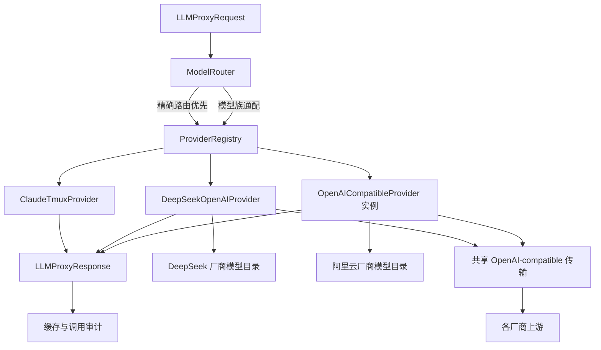
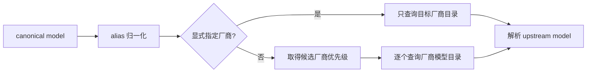

# OpenAI 兼容多厂商 Provider 技术实施方案

## 1. 模块目标

在现有 LLM Proxy 内抽取可复用的 OpenAI Chat Completions 传输能力，并以“厂商 Provider”为注册、配置和模型管理单元接入阿里云百炼。DeepSeek 官方与阿里云分别拥有自己的模型目录；DeepSeek 特化层保留其专有推理参数和 beta JSON 前缀续写能力。

本阶段交付文本聊天模型接入，不覆盖 Embedding、Realtime Audio、图像和视频 API。

## 2. 模块边界

模块负责：

- OpenAI-compatible `/chat/completions` HTTP 传输；
- 请求体、结构化输出、工具调用和推理内容转换；
- 重试、限流冷却、错误映射和 token 用量归一化；
- Provider 健康信息与模型族匹配；
- 厂商私有模型目录及 canonical model 到 upstream model 的映射；
- 调用方显式指定厂商，以及未指定厂商时的候选优先级选择；
- 阿里云与后续兼容厂商的声明式实例注册。

模块不负责：

- 业务任务选择哪个模型；
- 自动抓取或同步厂商模型清单；
- 判断每个模型的效果、价格或业务适用性；
- 非 Chat Completions API 的协议转换。

## 3. 整体架构

## 4. 模块职责

### 4.1 通用 OpenAI-compatible Provider

`providers/openai_compatible.py` 承载协议公共部分。每个实例对应一个厂商，构造参数包含厂商名称、Base URL、API Key、默认模型、超时、并发、重试、厂商模型目录和推理参数风格。

通用 Provider 不假设上游一定是 OpenAI，也不依赖具体厂商 SDK。当前项目继续使用 `httpx.AsyncClient`，减少不必要 SDK 依赖并保持既有审计与错误处理行为。

### 4.2 DeepSeek 特化

`providers/deepseek_openai.py` 只声明 DeepSeek 的能力差异：

- Provider 名称为 `deepseek`；
- 支持 `deepseek-*` 模型族；
- 推理开关使用 `thinking` 结构；
- 允许调用 DeepSeek beta 前缀续写接口。

其余请求、响应、重试和 JSON 修复逻辑由共享传输实现复用。DeepSeek Provider 的目录独立于阿里云，即使二者提供相同 canonical model，也可映射到不同 upstream model。

### 4.3 阿里云实例

阿里云 Provider 名称为 `aliyun`，默认 Base URL 为北京地域官方 OpenAI-compatible 地址，默认超时 1800 秒。API Key 优先读取 `ALIYUN_LLM_API_KEY`，同时兼容官方惯用的 `DASHSCOPE_API_KEY`。

阿里云推理开关映射为 `enable_thinking`，不会发送 DeepSeek 的 `thinking` 对象，也不会调用 DeepSeek beta 接口。

阿里云目录可将统一的 `deepseek-v4-pro` 映射为 `vanchin/deepseek-v4-pro`，也可将统一的 `kimi-k3` 映射为 `kimi/kimi-k3`。映射仅属于阿里云 Provider，不修改其他厂商的模型 ID。

### 4.4 声明式 Provider 配置

`LLM_PROXY_OPENAI_COMPATIBLE_PROVIDERS_JSON` 使用厂商名称作为键，可配置 Base URL、`api_key_env`、默认模型、超时、并发、重试、模型匹配规则、canonical-to-upstream 映射和推理风格。网关启动时每个厂商注册一个独立 Provider 实例。

`api_key_env` 仅保存环境变量名，真实 Key 留在独立环境变量中。

### 4.5 火山方舟实例

火山 Provider 名称为 `volcengine`，使用北京地域 `api/v3` 地址，API Key 依次读取 `VOLCENGINE_LLM_API_KEY`、`VOLCENGINE_ARK_API_KEY` 和官方惯用的 `ARK_API_KEY`，默认超时 1800 秒。

火山 Provider 独立维护豆包、DeepSeek 和 Kimi 模型映射。例如统一的 `deepseek-v4-pro` 映射为火山当前的 `deepseek-v4-pro-260425`，不会复用阿里云的 `vanchin/deepseek-v4-pro`。推理开关使用方舟的 `thinking` 结构。

## 5. 关键流程

### 5.1 路由流程

路由规则只表达候选厂商优先级；厂商目录才表达模型支持范围。没有显式路由的模型交给 Registry 查询所有已注册厂商目录，全部不支持时再报错。不使用宽泛的 `qwen*` 目录规则，避免把 Embedding、Realtime Audio 等非聊天模型误送到 Chat Completions。

### 5.2 请求流程

1. Gateway 根据 canonical model 和可选 provider 取得候选厂商。
2. Registry 在厂商模型目录内解析 upstream model。
3. Provider 使用 upstream model 构造非流式 Chat Completions 请求。
4. 通用字段先写入，厂商推理参数和受控 `extra_body` 后写入。
5. `extra_body` 禁止覆盖 `model`、`messages`、`stream`，防止绕过路由与请求边界。
6. 上游响应同时记录 canonical model、requested provider、selected provider 和 upstream model。

### 5.3 故障流程

401/403 映射为认证错误，402 映射为额度错误，400/404/422 映射为请求错误，408/504 映射为超时，429 进入限流冷却，5xx 可按统一指数退避策略重试。异常内容不包含 Authorization header 或 API Key。

## 6. 配置

阿里云配置项：

- `ALIYUN_LLM_BASE_URL`
- `ALIYUN_LLM_API_KEY` 或 `DASHSCOPE_API_KEY`
- `ALIYUN_LLM_DEFAULT_MODEL`
- `ALIYUN_LLM_TIMEOUT`
- `ALIYUN_LLM_MAX_CONCURRENCY`
- `ALIYUN_LLM_RATE_LIMIT_COOLDOWN_SECONDS`
- `ALIYUN_LLM_THINKING_TYPE`

火山配置项：

- `VOLCENGINE_LLM_BASE_URL`
- `VOLCENGINE_LLM_API_KEY`、`VOLCENGINE_ARK_API_KEY` 或 `ARK_API_KEY`
- `VOLCENGINE_LLM_DEFAULT_MODEL`
- `VOLCENGINE_LLM_TIMEOUT`
- `VOLCENGINE_LLM_MAX_CONCURRENCY`
- `VOLCENGINE_LLM_RATE_LIMIT_COOLDOWN_SECONDS`
- `VOLCENGINE_LLM_THINKING_TYPE`

模型路由继续由 `LLM_PROXY_MODEL_ROUTES_JSON` 表达默认厂商优先级。单次请求需要固定厂商时传入可选 `provider`，无需修改全局路由。

## 7. 迁移与兼容

- LLM Proxy HTTP API 和 `LLMProxyRequest` / `LLMProxyResponse` 保持兼容，并新增可选 `provider`；
- DeepSeek 的环境变量和 Provider 名称不变；
- 现有 DeepSeek 测试继续通过；
- 业务服务无需导入任何具体 Provider；
- 新模型只需路由配置，不要求修改业务任务方案。

## 8. 测试用例

### 8.1 单元测试

| 用例 | 验证内容 |
|---|---|
| 阿里云基础请求体 | 请求符合 OpenAI Chat Completions 格式 |
| 阿里云推理开关 | 使用 `enable_thinking`，不发送 DeepSeek 参数 |
| 火山基础请求体 | 使用方舟 `api/v3/chat/completions` 和独立认证 |
| 火山推理开关 | 使用 `thinking`，不发送阿里云 `enable_thinking` |
| `extra_body` 边界 | 不允许覆盖模型、消息和流式开关 |
| DeepSeek 专有能力 | beta 前缀续写仍只在 DeepSeek 启用 |
| 模型通配路由 | Qwen、Kimi、新版 GLM 可路由至阿里云 |
| 显式厂商选择 | 同一 canonical model 可确定性选择阿里云或官方 Provider |
| 厂商模型映射 | 不同厂商可为同一模型生成不同 upstream model ID |
| 目录兜底选择 | 无全局路由时由 Registry 查询厂商目录，全部不支持才拒绝 |
| 精确路由优先 | `glm-5.1` 等旧精确规则不被通配覆盖 |
| Key 脱敏 | health 和异常不泄露真实 Key |
| 配置加载 | 内置阿里云配置具有官方地址和 1800 秒超时 |

### 8.2 集成测试

`tests/integration/llm_proxy/test_aliyun_api.py` 默认跳过。设置 `RUN_ALIYUN_LLM_INTEGRATION=1` 并通过环境变量提供 Key 后，验证真实文本请求、响应归一化和 Provider 元数据。

`tests/integration/llm_proxy/test_volcengine_api.py` 默认跳过。设置 `RUN_VOLCENGINE_LLM_INTEGRATION=1` 并通过环境变量提供 Key 后，验证豆包或 DeepSeek Model ID 的真实调用与 canonical-to-upstream 映射。

### 8.3 回归测试

运行 LLM Proxy 全部单元测试，确认 DeepSeek、Gateway fallback、缓存、审计和架构边界没有回退。单次测试命令限制在 2 分钟内。

## 9. 技术风险与评审关注点

- 阿里云聚合模型能力不完全一致，某些模型可能不支持 JSON mode、tool calls 或推理开关；
- 模型 ID 与地域、计费计划可能绑定，Base URL 和 Key 不配套时会返回认证错误；
- 通配路由扩大可选模型范围，但不代表这些模型都适合现有结构化知识抽取任务；
- 超长推理模型使用 1800 秒超时会占用并发槽，生产环境应结合任务级队列和指标调优。

## 10. 验收标准

- 阿里云 Provider 出现在 Gateway health 中且不暴露 Key；
- 火山 Provider 出现在 Gateway health 中且不暴露 Key；
- `qwen3.7-plus`、`kimi/kimi-k3`、`glm-5.2` 默认解析到 `aliyun`；
- `deepseek-v4-pro + provider=aliyun` 解析为阿里云的 `vanchin/deepseek-v4-pro`；
- `deepseek-v4-pro + provider=volcengine` 解析为火山的 `deepseek-v4-pro-260425`；
- 可通过声明式配置注册新的 OpenAI-compatible 厂商；
- DeepSeek 原有测试和新通用 Provider 测试全部通过；
- 使用有效阿里云 Key 时，真实集成测试可获得非空响应。

## 11. 待确认问题

- 是否需要把阿里云模型目录同步为内部可查询的模型能力注册表；
- 哪些业务任务应迁移到 Qwen、Kimi 或 GLM，以及对应质量/成本基线；
- Embedding 和 Realtime API 何时进入统一网关的下一阶段。
