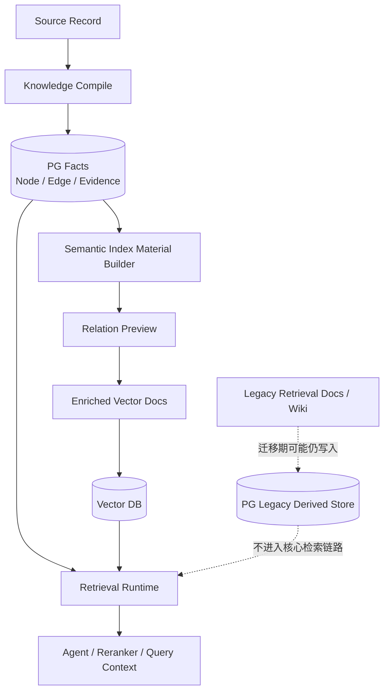
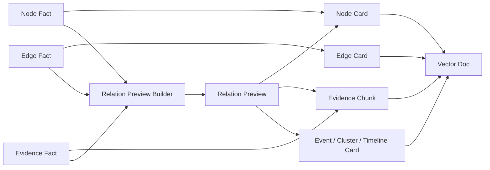

# 写入侧语义索引材料设计方案

> 最新收敛口径：写入侧索引材料需要配合 `12. Milvus语义检索、PG关系展开与叙事图谱设计方案.md`。其中 chunk/card text 属于 Milvus search target，PG 只保存 evidence、node/edge facts、`kg_evidence_chunk_refs` 和 `kg_edge_evidence_refs` 等不含 chunk_text 的指针关系；宏观叙事索引作为异步派生层构建。

## 1. 本文定位

本文定义知识图谱写入完成后，系统应该如何生成面向语义检索的索引材料。

它解决两个问题：

1. 首次向量召回的 node / event / evidence 候选缺少 relation preview，导致 reranker 和 Agent 只能看到孤立文本，难以判断是否值得展开。
2. `kg_retrieval_*`、Wiki、retrieval document 等旧派生检索材料仍在写入侧生成，和“向量数据库统一语义检索主入口”的目标架构不一致。

本文是设计侧文档，回答“写入侧应该变成什么样”。具体模块拆分、迁移步骤和验证策略见：

`docs/3. 实施方案/4. 知识图谱/8. 写入侧语义索引材料适配实施方案.md`

## 2. 背景问题 / 为什么要做

当前检索链路已经逐步收敛为：

```text
PG deterministic search + Vector semantic search -> merge / rerank -> Agent tool orchestration
```

但写入侧仍保留一些历史形态：

- Node Card 没有稳定 relation preview。
- 向量索引材料和旧 retrieval document / Wiki 派生材料边界不清。
- 部分关系方向只有 graph expand 后才能看到，首次召回阶段无法给 reranker 足够上下文。
- 旧写入产物继续存在，容易让后续维护者误以为它们仍是核心检索层。

这会带来三个后果：

1. **召回候选语义不完整**：node 看起来只是一个实体名，但不知道它连接了哪些事件、行业、资产或政策。
2. **Agent 决策成本高**：Agent 不知道是否应该 expand，只能先打开证据或继续搜索。
3. **写入侧职责混乱**：事实、索引、页面、检索文档混在一起，系统长期维护成本高。

## 3. 系统定位 / 和更大系统的关系

写入侧语义索引材料不是新的事实源。

它位于 PG Fact Store 和 Vector DB 之间，只负责把已经写入的 facts 转换成可重建的语义检索材料。



核心边界：

- PG Facts 是事实源。
- Vector Docs 是可重建索引，不反向污染 facts。
- Relation Preview 是索引材料的一部分，不是完整 graph expand。
- Legacy 派生材料在迁移期可以继续写入，但不再作为目标核心链路。

## 4. 目标系统形态

### 4.1 写入侧输出形态

写入侧完成事实写入后，应产出两类结果：

1. **事实变更集合**
   - changed nodes
   - changed edges
   - changed evidence
   - stale facts
   - active / deleted 状态
   - fact version

2. **语义索引材料**
   - Evidence Chunk
   - Node Card
   - Edge Card
   - Event Card
   - Cluster Card
   - Timeline Card
   - Relation Preview

这些材料全部从 PG facts 派生，并且必须能回到原始 facts。

当前边界：

- Evidence Chunk、基础 Node 文档、基础 Edge 文档已经可以进入 semantic index。
- semantic index 已经不再消费旧 retrieval document / Wiki。
- 完整 Node Card、Edge Card、Event Card、Cluster Card、Timeline Card 还不是全部完成状态。
- relation preview 还没有稳定进入 Node Card / Evidence Chunk / Event Card。
- 旧 retrieval document / Wiki 写入仍处在迁移期，不能被当成长期目标形态。

### 4.2 目标数据形态



Relation Preview 应该回答：

- 这个候选和哪些主体有关？
- 这个候选和哪些行业、资产、政策、事件有关？
- 关系方向是什么？
- 有哪些证据支撑？
- 是否值得进一步 graph expand？

### 4.3 查询体验变化

以问题为例：

```text
300750 最近有哪些海外产能相关的负面事件？
```

目标首次召回不是只返回：

```text
宁德时代
海外产能
某条新闻 evidence
```

而是返回带轻量关系提示的候选：

```text
宁德时代
relation preview:
  - related event: 海外产能建设 / 业绩兑现
  - related evidence: 2025年年报点评...
  - relation direction: 事件影响股票 / 业务影响业绩
  - expandable handles: node ids / edge ids / evidence ids
```

这样 reranker 能判断“海外产能 + 负面事件”是否匹配，Agent 也能决定是 open evidence、scoped search，还是 graph expand。

## 5. 核心设计判断

### 5.1 Relation Preview 必须在索引写入前生成

Relation Preview 不能只在查询时临时拼。

原因：

- 查询时临时拼会导致每次召回都重复查图，延迟和复杂度都高。
- Reranker 需要在排序前看到候选的关系方向。
- Agent 需要在首次观察中看到可展开线索，而不是盲目 expand。
- 向量索引文本本身需要包含关系语义，才能让 semantic search 命中“影响链”“主体”“行业”“资产”等查询意图。

### 5.2 Preview 不是完整 graph expand

Relation Preview 只提供轻量摘要和 handle。

它不应该把一个节点周围所有关系写进向量文档，否则会造成：

- 向量文本过长。
- 主题漂移。
- 多个候选共享同一大段关系文本，导致重复召回。
- 关系更新后索引 stale 范围扩大。

完整图谱关系仍由 Agent 显式调用 graph expand。

### 5.3 向量索引材料替代旧检索派生层

目标架构中，语义检索材料应集中进入 Vector DB，而不是继续扩散成多套 PG 检索中间层。

旧能力定位：

| 旧能力 | 目标定位 |
| --- | --- |
| `kg_retrieval_*` | 迁移期可保留写入，目标删除 |
| Wiki 页面 | 迁移期可保留展示/调试，目标不作为核心检索层 |
| retrieval document | 迁移期可保留回放，目标被 enriched vector docs 替代 |
| PG graph 全局召回 | 不作为首轮召回，改为 Agent 显式 expand |

迁移期允许继续写入旧派生材料，但必须明确：

- 它们不是核心检索入口。
- 新能力验证通过后应删除或降级为离线调试材料。
- 写入侧新增逻辑不能继续依赖旧 retrieval document 作为语义索引输入。

## 6. 新能力带来的系统收益

### 6.1 更好的首次召回质量

Node / Evidence 不再是孤立文本，而是带有关系方向的语义候选。

这能减少“候选命中了实体，但不确定是否回答问题”的情况。

### 6.2 更低的 Agent 工具调用成本

Agent 可以基于 relation preview 判断：

- 是否直接 open evidence。
- 是否 scoped search。
- 是否 graph expand。
- 是否已经足够停止。

### 6.3 更清晰的写入侧职责

写入侧只做两件事：

- 写入事实。
- 从事实派生可重建索引材料。

它不再长期维护多套互相重叠的检索中间形态。

## 7. 应退出或调整的旧能力定位

以下能力需要从“核心链路”退出：

- `kg_retrieval_*` 检索表。
- Wiki 检索层。
- retrieval document 检索层。
- 基于旧 retrieval document 的 semantic index。

但它们不是立即删除。

迁移期策略：

1. 新 enriched vector docs 和 relation preview 先并行生成。
2. 检索主链路只消费新索引材料。
3. 旧产物可继续写入，用于回放、对比和问题定位。
4. 当新链路指标稳定后，再删除旧写入和旧表。

## 8. 验收口径

这次写入侧改造完成后，应满足：

1. Node Card 中包含稳定、短小、可解释的 relation preview。
2. Evidence / Event / Cluster Card 能带出和问题相关的主体、行业、资产、政策、事件方向。
3. Vector Doc 均可回表到 PG facts。
4. Reranker 输入能看到 relation preview，而不是只看到 title / snippet。
5. Agent 首轮 bootstrap observation 中能看到候选的可展开 handle。
6. 检索主链路不依赖 `kg_retrieval_*`、Wiki、retrieval document。
7. 迁移期旧写入产物状态在 trace 或文档中明确标注。

## 9. 关键待验证问题

- Relation Preview 的最大长度应该是多少。
- Node Card 和 Evidence Chunk 是否都需要 preview，还是只给高价值候选附加。
- Preview 更新粒度是按 node、edge、evidence，还是按 source record。
- 高频事实更新时，preview stale 比例是否可控。
- 旧 Wiki / retrieval document 完全删除后，调试体验是否需要新的 trace 页面补齐。

## 10. 和实施文档的关系

本文给出目标系统形态和设计判断。

实施方案应进一步回答：

- 写入侧哪些模块负责构造 relation preview。
- 向量索引材料如何从 PG facts 派生。
- 旧 `kg_retrieval_*`、Wiki、retrieval document 如何迁移退出。
- 如何验证 reranker 和 Agent 是否真正消费了 relation preview。
