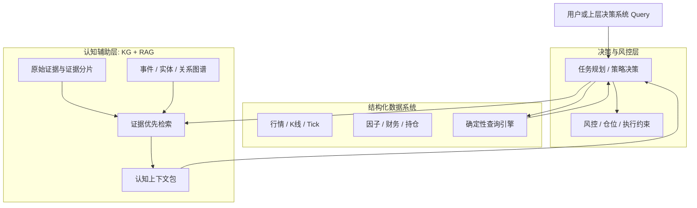
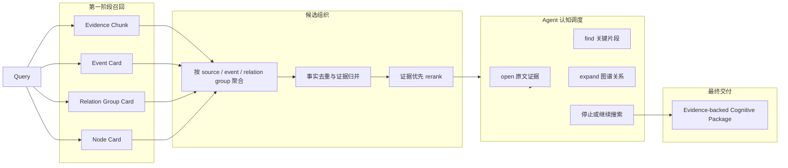
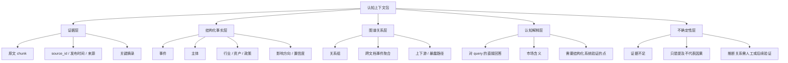

# KG认知辅助层定位与证据优先检索重构讨论

> 最新收敛口径：本文关于 evidence-first 和 cognitive package 的定位仍然有效；检索存储边界、chunk text 归属、PG 与 Milvus 协作方式、宏观叙事图谱定位，以 `12. Milvus语义检索、PG关系展开与叙事图谱设计方案.md` 为准。

## 1. 本文定位

本文用于重新明确知识图谱在 AI 自动化交易系统中的定位，以及检索结果到底应该交付什么。

当前系统已经具备实体、事件、关系、证据、向量索引、Agent 工具调用等能力，但实际运行中第一阶段召回经常呈现为大量 node / edge。这个形态容易让系统目标变得模糊：如果最终结果只是若干图谱节点和关系，那么它对自动化交易系统的认知价值有限，也很难判断后续优化应该围绕什么展开。

本文的核心判断是：

```text
知识图谱检索不应该以 node / edge 作为最终结果。

node / edge 是组织证据、聚合事件、展开关系、追溯来源的内部骨架。

认知辅助层应该对外交付 evidence-backed cognitive package：
可追溯证据 + 结构化认知 + 关系解释 + 不确定性。
```

本文是设计侧讨论文档，不包含具体代码改造步骤。若方向确认，需要再补一份实施侧技术方案，定义模块边界、数据结构、索引改造、Agent 工具改造和验收路径。

## 2. 背景问题

当前检索链路暴露出的核心问题不是单个 rerank、score 或日志字段的问题，而是结果形态的问题。

现状大致是：

```text
用户 query
  -> PG deterministic search / vector search
  -> 命中 node / edge / evidence
  -> rerank
  -> Agent open / expand / find
  -> 上下文结果
```

但从实际 trace 看，第一阶段经常出现：

```text
A股并购重组市场呈现三方面新变化 mentions 半导体
A股并购重组市场呈现三方面新变化 mentions 生物医药
A股并购重组市场呈现三方面新变化 mentions 高端装备制造
A股并购重组市场呈现三方面新变化 mentions 券商
```

这些关系本身是有用的，但如果它们作为最终候选直接进入 rerank，会带来几个问题：

1. **用户真正要的是证据和认知结论，不是内部边。**
   用户问“这条新闻涉及哪些主体、行业或资产影响”，系统应该返回原文依据、涉及对象和影响判断，而不是只返回 `mentions` 边。

2. **同一 evidence 下的多条边会天然重复。**
   多条边可能都来自同一篇新闻、同一个事件、同一种 relation type。强行给每条边构造不同摘要，会变成表面差异化。

3. **rerank 输入缺少事实层次。**
   rerank 模型需要自然语言证据和候选含义。如果输入主要是 relation title，它只能对抽象对象排序，很难判断证据强弱。

4. **Agent 的工具调度容易围绕内部对象打转。**
   如果第一屏给 Agent 的都是 edge，它会不断 open / expand edge，而不是围绕证据、事件、认知目标组织答案。

5. **交易系统上层消费价值不清晰。**
   决策系统需要的是“发生了什么、影响谁、依据是什么、不确定点是什么”，不是“图里有几条边”。

## 3. 系统定位

在 AI 自动化交易系统中，知识图谱属于认知辅助层，不属于最终交易决策层，也不属于结构化行情查询层。



结构化数据系统回答：

```text
最近 20 天 RSI 是否大于 70？
300750 当前持仓是多少？
某 ETF 对某股票暴露比例是多少？
```

认知辅助层回答：

```text
最近是否有影响半导体板块的政策事件？
某新闻涉及哪些主体、行业和资产影响？
多篇新闻是否在描述同一事件的发酵？
某公司海外产能风险近期是否被反复提及？
```

因此 KG 的价值不是替代 SQL，也不是替代全文搜索，而是把非结构化信息变成可追溯、可聚合、可解释的市场认知。

## 4. 目标系统形态

目标形态应该从 `node/edge-first` 调整为 `evidence-first, graph-assisted, package-output`。



核心变化：

1. **Evidence Chunk 是第一等召回对象。**
   原文片段必须能直接进入第一阶段候选，而不是只作为 edge 的附属字段。

2. **node / edge 是 handle，不是答案主体。**
   它们用于归一、聚合、展开、解释和回溯，不应该主导最终结果形态。

3. **同源 edge 应该先聚合成 group。**
   同一 evidence、同一 source event、同一 relation type 下的多个对象，应该形成关系组，而不是拆成大量重复候选。

4. **最终输出是认知包。**
   对上层系统交付的不是“命中了哪些边”，而是“这些证据支持哪些认知结论”。

## 5. 目标输出形态

认知辅助层的标准输出应该是一个 evidence-backed cognitive package。



对“这条新闻涉及哪些主体、行业或资产影响”这类问题，理想输出应该类似：

```text
直接证据：
  证券日报 ft_news:83904，原文片段说明 A 股并购重组市场出现三方面变化。

涉及主体：
  券商。原文描述券商角色从通道中介升级为价值合伙人。

涉及行业：
  半导体、生物医药、高端装备制造、汽车零部件。
  原文将它们放在新质生产力和产业链深度整合语境下。

涉及政策：
  并购六条、科创板八条。

可能资产影响：
  新质生产力相关行业并购活跃度提升。
  券商投行业务机会增加。
  但原文未给出具体受益股票，需要结构化行情、持仓或财务系统继续验证。

图谱支撑：
  新闻事件 mentions 半导体、生物医药、高端装备制造、汽车零部件、券商。
  半导体 benefits_from 科创板八条属于推断关系，不能单独作为确定结论。
```

这个结果里，node / edge 仍然存在，但它们被放在“支撑结构”里，而不是作为主输出。

## 6. 核心设计判断

### 6.1 原始证据是地基

交易系统最怕不可追溯。任何认知结论都必须能追到原始证据片段。

因此：

```text
没有 evidence chunk 的 node / edge 只能作为弱候选。
有 evidence chunk 的结论才可以进入核心上下文。
```

这并不意味着只返回原文。原文是地基，但如果只返回原文，KG 的价值也没有发挥出来。

### 6.2 KG 的价值是组织证据，不是替代证据

KG 应该解决纯 RAG 难以解决的问题：

1. 同一主体多名称归一。
2. 多篇新闻聚合成事件簇。
3. 事件与主体、行业、资产、政策之间形成可追踪关系。
4. 从一个证据点展开到上下游、历史相似事件、重复出现的风险叙事。
5. 给上层系统区分“确定事实”“模型推断”“弱相关背景”。

所以 KG 的核心价值不是“我能搜到边”，而是“我能把证据组织成市场认知结构”。

### 6.3 node / edge 应降级为内部 handle

node / edge 不应该消失，但要重新定位：

| 对象 | 正确定位 | 不应承担的职责 |
| --- | --- | --- |
| node | 实体归一、聚合锚点、展开入口 | 直接作为最终答案 |
| edge | 关系线索、影响路径、证据组织结构 | 代替原文证据 |
| evidence chunk | 原文依据、rerank 核心输入、open/find 主对象 | 被动附属在 edge 后面 |
| relation group | 同源关系聚合、减少重复候选 | 被拆成大量重复 edge |
| cognitive package | 对上层系统的交付物 | 只是 trace 或 debug 信息 |

### 6.4 同源关系必须 group 化

如果多条边来自同一篇新闻、同一个事件、同一种关系类型：

```text
event A mentions 半导体
event A mentions 生物医药
event A mentions 高端装备制造
event A mentions 汽车零部件
```

它们不应该作为 4 条独立 evidence candidate 去 rerank。

更合理的结构是：

```text
证据: ft_news:83904
事件: A股并购重组市场呈现三方面新变化
关系类型: mentions
候选对象:
  - 半导体
  - 生物医药
  - 高端装备制造
  - 汽车零部件
```

这样既符合事实结构，也减少重复 token，并且让 Agent 能在 group 内选择需要展开的对象。

### 6.5 第一阶段召回应包含“证据”和“结构”两类候选

第一阶段不应该只返回 node / edge，也不应该只返回 chunk。

推荐候选池：

| 候选类型 | 作用 |
| --- | --- |
| Evidence Chunk | 原文片段，直接支持回答 |
| Event Card | 事件聚合入口，连接多个证据和关系 |
| Relation Group Card | 同源关系组，减少重复 edge |
| Node Card | 实体归一和展开入口 |
| Edge Card | 高置信、强影响关系的补充候选 |

其中 Evidence Chunk 和 Relation Group Card 应该成为 rerank 的主力输入。

### 6.6 Agent 应围绕认知目标调度工具

Agent 不应该只是“看到 edge 就 open，看到 node 就 expand”。

它应该围绕 query 的认知目标决策：

```text
是否已有直接证据？
是否需要打开原文确认？
是否需要在原文中定位关键段落？
是否需要展开某个主体、行业或资产的关系？
是否存在同一事件的多源证据？
是否需要停止并输出认知包？
```

也就是说，Agent 的停止条件应该从“够不够 hits”变成“认知包是否完整”。

## 7. 建议重构方向

### 7.1 第一阶段召回改成 evidence-first

当前问题是 node / edge 过早主导候选池。

建议：

```text
第一阶段并行召回：
  1. PG deterministic search
     - 强标识、source_id、实体别名、明确标题
  2. Vector semantic search
     - Evidence Chunk
     - Event Card
     - Relation Group Card
     - Node Card
     - Edge Card
  3. Graph preview
     - 只返回简短 preview，不做大规模展开
```

召回后先做：

```text
同 evidence 归并
同 source event 归并
同 relation type 归并
同 node / edge / chunk 指向归并
```

再进入 rerank。

### 7.2 增加 Relation Group Card

当前写入侧已有 Evidence Chunk、Node Card、Edge Card、Event Card 的方向，但还缺少 Relation Group Card。

Relation Group Card 应该表达：

```text
source evidence
source event
relation type
objects grouped by node type
relation confidence summary
代表性 evidence chunk
expandable handles
```

它的作用是替代大量重复 edge candidate。

### 7.3 Rerank 输入从单对象改为“可读认知候选”

Rerank 不应该看到大量 ID 或只有 title 的 edge。

它应该看到：

```text
候选类型: 关系组
证据: ft_news:83904 / 证券日报 / 2026-04-23
事件: A股并购重组市场呈现三方面新变化
关系类型: mentions
对象: 半导体、生物医药、高端装备制造、汽车零部件
证据片段: ...
对 query 的潜在回答: 涉及行业
限制: mentions 只能证明提及，不证明因果或利好利空
```

这样模型才有足够信息判断是否相关。

### 7.4 open / find 应以 chunk 为中心

`open` 不应该只是打开整条 evidence。

更合适的是：

```text
open evidence group
open specific chunk
open source article around matched chunk
find within opened chunks
```

这样 Agent 可以先看短证据，再决定是否展开整篇原文。

### 7.5 最终输出应显式区分事实、推断和待验证项

面向交易系统，输出必须区分：

```text
事实：原文直接说了什么
结构：图谱抽取出了什么关系
推断：模型或规则推断了什么影响
待验证：需要行情、财务、持仓、风控系统继续验证什么
```

如果不做这个区分，认知辅助层容易被误用成交易决策层。

## 8. 新系统收益

### 8.1 对上层决策系统

上层不再需要理解 KG 内部的 node / edge 细节，而是消费认知包。

收益：

1. 更容易判断是否要调用结构化查询系统。
2. 更容易做风险解释。
3. 更容易把新闻、研报、公告变成策略上下文。
4. 更容易做人类复盘和审计。

### 8.2 对 Agent 检索

Agent 不再围绕一堆重复 edge 做工具调用。

收益：

1. 首轮候选更接近答案。
2. open/find 更聚焦。
3. expand 只在认知缺口明确时调用。
4. token 成本下降。
5. trace 更容易解释。

### 8.3 对数据治理

系统可以更清楚地区分：

```text
事实数据: evidence / chunk
认知结构: event / node / edge / group
索引材料: vector docs
最终交付: cognitive package
```

这能避免继续出现“为了检索又复制一套 PG 检索表”的架构漂移。

## 9. 应调整或退出的旧能力定位

### 9.1 单 edge 作为 rerank 主对象应退出

单 edge 可以保留，但不应该成为同源关系场景下的主候选。

保留场景：

```text
强影响关系
跨 evidence 支持的关系
用户明确查询某条关系
Agent 展开后的局部路径
```

退出场景：

```text
同一 evidence 下大量 mentions 边
同一事件对多个对象的平铺关系
只有抽象 title、缺少证据片段的边
```

### 9.2 只返回 node / edge 的 search 体验应退出

search 应返回“可消费候选”，而不是数据库对象列表。

候选可以绑定 node / edge handles，但展示和 rerank 输入必须以自然语言证据和认知含义为主。

### 9.3 Wiki / retrieval document 不应回归核心链路

`kg_retrieval_documents` 和 `kg_wiki_pages` 不应该再作为核心检索层。

它们的问题不是单表实现差，而是职责不清：

```text
它们既像索引材料，又像检索结果，又像摘要缓存。
```

新架构应把这些职责拆清楚：

```text
向量库保存语义索引材料。
PG 保存 canonical facts 和确定性查询入口。
最终上下文由 retrieval runtime 动态组织。
```

## 10. 验收口径

这次重构是否成功，不应该只看命中数量，而应该看认知结果质量。

建议验收维度：

| 维度 | 验收问题 |
| --- | --- |
| 证据优先 | 第一阶段候选中是否能看到 evidence chunk / relation group，而不是只有 node / edge |
| 可追溯 | 每个结论是否能追到 source_id 和 chunk |
| 去重 | 同一 evidence 下的同类关系是否被 group，而不是重复平铺 |
| 认知完整性 | 输出是否覆盖 query 要的主体、行业、资产、影响、依据 |
| 边界清晰 | 是否明确区分原文事实、KG 关系、模型推断、待验证项 |
| Agent 可解释 | trace 中能否看出 Agent 为什么 open、find、expand、stop |
| 上层可消费 | 决策系统是否无需理解内部 edge ID 就能消费结果 |

## 11. 关键待验证问题

1. Relation Group Card 是否应该在写入侧预生成，还是查询时动态生成？
2. Event Card 是否应该升级成 Event Cluster Card，用于跨文档聚合？
3. Evidence Chunk 的切分粒度是否足够支撑 find/open？
4. 如果同一事件有多篇来源，认知包应该如何合并互相矛盾的信息？
5. Rerank 应先排 evidence group，还是先排 chunk，再由 Agent 组织 group？
6. 哪些关系可以进入“影响判断”，哪些只能作为“提及或背景”？
7. 最终 cognitive package 是直接由 Agent 生成，还是由 deterministic packager 先组织骨架再让 Agent 补充？

## 12. 和现有文档的关系

本文是在以下文档之后进一步收敛系统定位：

1. `9. 检索索引架构重构讨论.md`
   - 明确 PG 和向量库的边界。
   - 本文进一步明确检索结果不能停留在 node / edge。

2. `10. 写入侧语义索引材料设计方案.md`
   - 明确向量索引材料需要由写入侧生成。
   - 本文进一步提出 Relation Group Card 和 evidence-first 输出。

3. `26. 关系图Agent检索工具设计方案.md`
   - 明确 Agent 只通过关系图 Card、Edge 和 Community 工具检索认知材料。
   - 本文进一步要求 Agent 围绕认知包完整性调度，而不是围绕 hits 数量调度。

如果本文方向确认，下一步应新增实施侧文档：

```text
docs/3. 实施方案/4. 知识图谱/9. 证据优先认知上下文重构实施方案.md
```

实施文档需要回答：

```text
Relation Group Card 如何生成？
search 返回结构如何调整？
rerank 输入如何构造？
open/find 如何以 chunk 为中心？
Agent 如何判断 cognitive package 是否完整？
旧 node/edge-first trace 如何回归验证？
```
