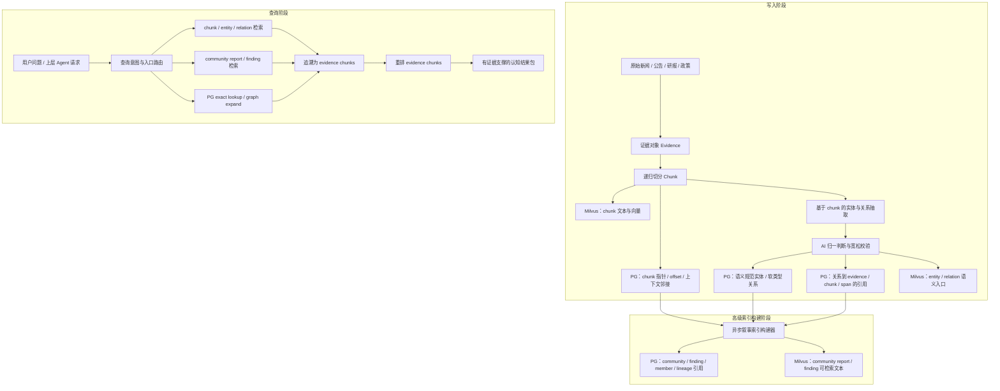
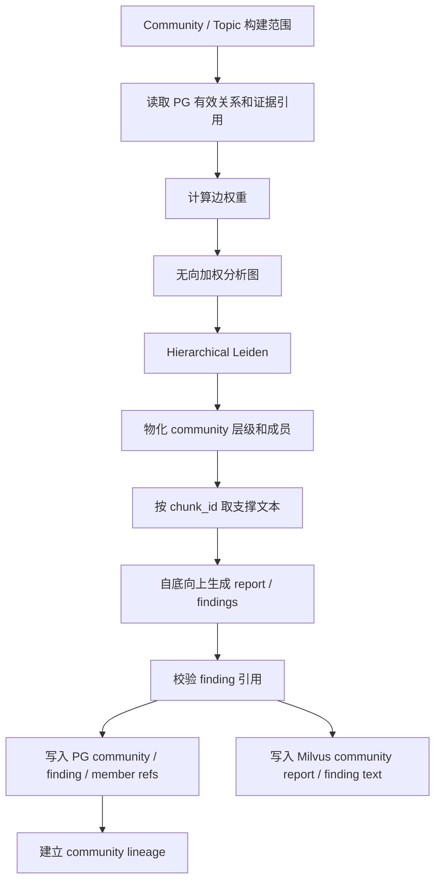
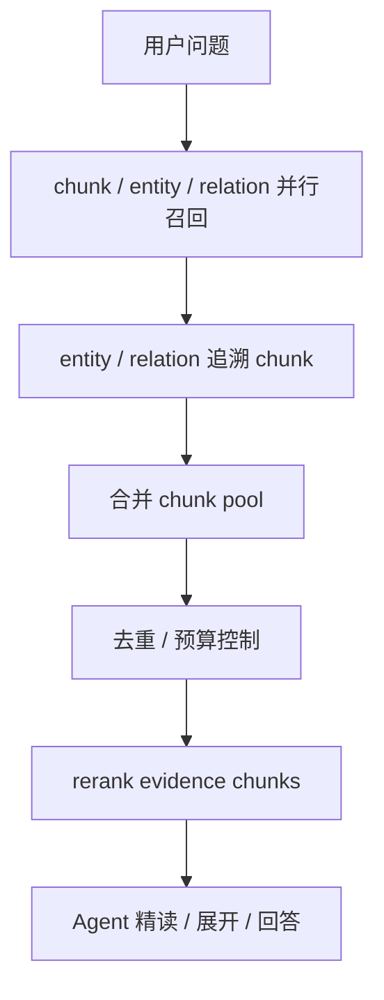
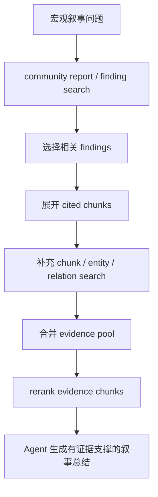
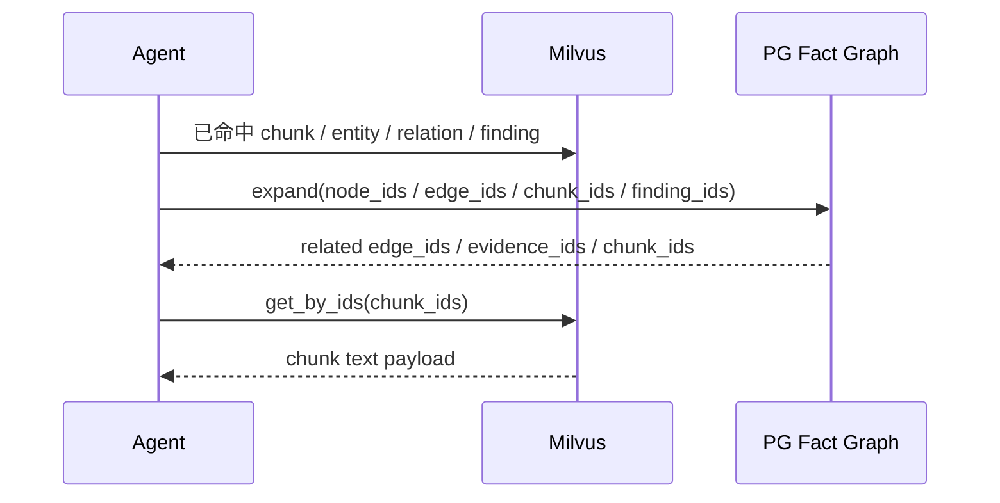

# Milvus语义检索、PG关系展开与叙事图谱设计方案

## 1. 本文定位

本文是知识图谱认知检索架构的最终收敛设计。

它只回答两件大事：

1. **数据如何写入系统**

   原始新闻、公告、研报、政策等弱结构化文本，如何被加工成：

   ```text
   evidence
   chunk
   semantic canonical entity
   soft relation edge
   chunk refs
   semantic targets
   hierarchical community / finding
   ```

2. **数据如何被查询和消费**

   用户 query 或上层 Agent 如何从以下入口开始检索：

   ```text
   chunk
   entity
   relation
   PG exact lookup
   PG graph expand
   community report / finding
   ```

   然后统一回到可审计的 `evidence chunk`，形成 evidence-backed cognitive package。

查询依赖写入。写入侧如果没有稳定的 chunk、关系、引用和高级索引，查询侧就无法可靠地搜索、展开、重排和回答。

GraphRAG 的源码调研和 prompt 位置不放入本文主线，参考：

`13. GraphRAG数据编译入库与检索机制调研.md`

本文收敛并覆盖这些旧讨论中的最终口径：

- `9. 检索索引架构重构讨论.md`
- `10. 写入侧语义索引材料设计方案.md`
- `11. KG认知辅助层定位与证据优先检索重构讨论.md`
- `归档/14. Community Report与市场叙事图谱设计方案.md`

## 2. 总体架构

系统由三层组成：

```text
PG Fact Graph
  负责事实、关系、证据指针、图谱展开。

Milvus Semantic Store
  负责可读文本的语义检索，以及按 ID 快速取回 chunk / finding 文本。

Narrative Index
  负责异步构建 GraphRAG 风格的层级 community、市场叙事、风险主题和 findings。
```

它们不是三套互相竞争的检索系统，而是一条有依赖顺序的数据链路：



这条架构有一个不可变约束：

```text
任何 node、edge、entity target、relation target、community、finding 都只能作为检索导航入口。
最终进入 rerank / Agent 精读 / 对外答案的事实材料必须能回到 evidence chunk。
```

## 3. 核心设计原则

### 3.1 写入先于查询

查询质量取决于写入质量。

如果写入侧没有稳定 chunk、没有 edge -> chunk refs、没有 AI 友好的语义规范实体、没有可解释的软类型关系，那么查询阶段无论使用 rerank、Agent 或 graph expand，都只能在不稳定材料上做补救。

因此本文把系统分成三个清晰阶段：

```text
1. 写入事实层
2. 构建高级索引层
3. 查询消费层
```

### 3.2 Chunk 是证据中枢

chunk 是最小可读证据单元。

它承担四个职责：

- 被 Milvus 语义召回。
- 被 PG refs 指向。
- 支撑 node / edge。
- 进入 rerank 和 Agent 精读。

node、edge、community、finding 都不能替代 chunk。

### 3.3 PG 和 Milvus 分工明确

PG 保存事实和指针：

```text
evidence metadata
semantic canonical entities
soft relation edges
chunk refs
edge evidence refs
community / finding / member refs
lineage refs
```

Milvus 保存 AI 和 embedding 友好的可检索文本：

```text
chunk text
entity semantic target text
relation semantic target text
community report text
finding text
```

PG 不保存完整 chunk text。Milvus 不负责事实关系约束，但它负责保存 entity / relation / community 的自然语言语义入口。

### 3.4 高级索引是派生认知层

高级索引包括：

```text
topic_community
event_community
risk_theme
market_narrative
community_report
community_finding
```

它不是事实层，不替代原始 evidence，不直接作为最终答案。它只提供宏观检索入口，并必须能回溯到 evidence chunk。

### 3.5 查询入口可以是高级索引

对于宏观问题，高级索引不是补充，而是常见首入口：

```text
最近市场对 AI 算力链的主要叙事是什么？
过去一周新能源板块风险事件集中在哪些方向？
A 股并购重组市场的结构性变化有哪些？
```

这类 query 可以直接从 `community report / finding` 开始检索，然后向下展开到 supporting chunks。

## 4. 写入阶段

写入阶段负责把原始文本加工成可追溯事实图谱和可检索语义材料。

### 4.1 Evidence

Evidence 是原始材料在 KG 系统内的证据对象。

它代表一条新闻、一篇公告、一段研报或一份政策文本。

Evidence 需要保留：

- source id。
- source type。
- title。
- published_at。
- source metadata。
- 原始文本或原始文本引用。
- 状态和版本。

Evidence 是审计入口，不是默认 rerank 对象。

### 4.2 Recursive Chunk

原始文本必须先 chunk，再抽取关系。

第一版只采用 Recursive chunk，不做多 chunker 并存。

推荐切分优先级：

```text
段落
换行
中文句末标点
中文句内标点
空格
字符兜底
```

推荐分隔层级：

```text
"\n\n"
"\n"
"。"
"！"
"？"
"；"
"，"
" "
""
```

chunk 需要保留：

```text
chunk_id
evidence_id
chunk_index
start_offset
end_offset
field_name / block_type
previous_chunk_id
next_chunk_id
chunker_version
status
```

短文本自然成为 single chunk，不需要单独策略。

### 4.3 Chunk Text 存储

chunk text 存在 Milvus。

PG 只保存 chunk manifest：

```text
evidence_id -> chunk_id 列表
chunk_id -> chunk_index
chunk_id -> offset
chunk_id -> previous / next
chunk_id -> status / version
```

原因：

- Milvus 命中 chunk 后可以直接拿到可读文本。
- PG graph expand 拿到 chunk_id 后，可以用 Milvus get-by-id 取文本。
- PG 不维护大段检索文本，避免两份 chunk text 不一致。

### 4.4 Chunk-first 关系抽取

关系抽取发生在 chunk 之后。

目标链路：

```text
evidence
  -> chunk
  -> chunk-level entity / relation extraction
  -> semantic canonical entity
  -> soft relation edge
  -> edge evidence refs
```

抽取时允许使用辅助上下文：

```text
title
source metadata
document short summary
previous / next chunk
```

但最终证据落点必须是：

```text
evidence_id + chunk_id + optional span
```

辅助上下文可以帮助理解，不能替代证据落点。

### 4.5 Embedding 候选召回与 AI 归一判断

为了降低跨批次抽取漂移，不让同一对象因为表达略有不同就变成多个实体，写入侧采用更简单的三步链路：

```text
chunk text
  -> AI 抽取 raw entity / raw relation
  -> embedding 召回相似已有 entity / relation topK
  -> AI 基于候选判断 reuse / create_new / suggest_new_type
  -> Resolver / Validator 执行写入、轻量修正或降级
```

第一次 AI 只负责发现候选事实，不负责在没有候选上下文时猜测是否复用已有对象。

实体命名借鉴 GraphRAG 的自然语言 title 思路，但不能裸用 title。AI 需要生成更稳定的语义规范键：

```text
canonical_key = entity_category + canonical_name
```

例子：

```text
股票|中际旭创
科技公司|苹果
商品|苹果
机构|土耳其议会
概念|AI算力需求
事件|A股并购重组市场生态变革
```

这个 `canonical_key` 是 AI 和 embedding 友好的语义 ID。数据库内部仍然可以有 UUID / node_id，但 opaque id 不进入 embedding 主文本，也不作为 AI 归一判断的主要依据。

`canonical_name` 应保持稳定、简洁、自然语言友好。股票代码、基金代码、source_id、日期编号、括号编号等强标识不应混入 `canonical_name`，应进入 `identifiers` 或 `aliases`：

```text
不推荐：中际旭创 300308
不推荐：中际旭创(300308)
推荐：canonical_name = 中际旭创
推荐：identifiers = {stock_code: "300308"}
推荐：aliases = ["中际旭创股份有限公司", "300308", "中际旭创(300308)"]
```

Embedding 的职责是候选召回：

```text
raw entity / raw relation
  -> Milvus 搜相似 semantic target
  -> topK candidate nodes / relations
```

Embedding 不直接完成归一。它只回答：

```text
哪些已有实体 / 关系可能和当前 raw item 是同一个？
```

第二次 AI 拿到的是短候选集，而不是全局图谱。例如：

```text
raw entity: A股并购重组市场生态变化
candidate entities:
1. node_id=xxx, name=A股并购重组市场生态变革, type=event
2. node_id=yyy, name=并购重组市场结构性变化, type=concept
3. node_id=zzz, name=A股并购重组市场三方面新变化, type=event

allowed actions:
- reuse candidate_id
- create_new
- suggest_new_type
```

归一化层不设置“等待人工确认”的 `uncertain` 决策分支。原因是系统目标是自动化写入和可回放治理，不能因为模型犹豫就阻塞事实链路。AI 如果无法确认复用哪个候选，必须选择 `create_new`，并通过 `confidence`、`reason`、`support_status`、`review_flags` 标记低置信度；后续治理可以基于这些字段合并或废弃，而不是在主链路制造 pending 数据。

写入侧新增实体或关系实例时，必须同步维护对应的 Milvus semantic target，否则后续 Resolver 无法通过 embedding 把它召回为候选：

```text
新增 entity instance
  -> PG 写 semantic canonical entity
  -> Milvus 写 entity semantic target

新增 relation instance
  -> PG 写 soft relation edge
  -> Milvus 写 relation semantic target
```

Type registry 应保持小而稳定。正常情况下，正式 entity type / relation type 不应该很多；影响方向、原因、强弱、时间、置信度、触发因素等差异优先进入 `properties`，不要轻易新增 type。

因此每次 AI 选择或新建 type 时，都应该提供当前全部 allowed types、类型定义、endpoint constraints 和典型示例。AI 必须优先选择已有 type，并优先考虑：

```text
已有 type + properties
```

只有当现有 type 无法表达，且新 type 会改变查询语义、图谱遍历、endpoint 校验或统计分析口径时，才允许自动新增 type。

系统不要求人工手动维护所有 type。AI 可以在看到已有 allowed types 后自动提出新 type；当它明确判断没有合适类型时，新的 type 可以直接进入 allowed schema，但必须带上定义、示例、来源和版本，便于后续治理与回放。

```text
type_suggestion
  -> 自动写入 type registry
  -> allowed schema 立即可见
  -> Milvus 写入 type description，作为候选说明和检索辅助
```

自动新增 type 的最低要求：

```text
type_name
type_kind: entity_type | relation_type
definition
endpoint constraints
positive examples
negative examples
created_by: llm
created_from evidence / chunk
schema_version
status: active | deprecated | merged
```

后续如果发现多个 type 语义重复，可以通过 `deprecated / merged` 状态收敛，而不是删除历史记录。

### 4.6 Resolver 与 Relaxed Validator

Resolver / Validator 不是用死规则替代 AI，也不是校验失败就让整条 evidence 写入失败。

它们的职责是：

```text
Resolver
  -> 执行 AI 的 reuse / create_new / suggest_new_type 决策
  -> 分配或复用稳定 node_id / edge_id
  -> 记录候选、理由、版本和来源

Relaxed Validator
  -> 检查结构完整性、证据引用完整性、AI 判断字段完整性
  -> 不用关键词匹配否定 AI 的语义判断
  -> 不把局部关系问题升级为整条 evidence 失败
  -> 不丢 evidence / chunk
```

这点借鉴 GraphRAG 的容错取向：局部关系坏了，不应该让整条材料失败。GraphRAG 会解析能解析的记录，并丢弃 source / target 找不到实体的孤儿关系；我们的系统不能简单照搬丢弃，但应该采用相同的宽松写入原则：

```text
evidence / chunk 永远保留
entity 尽量保留
relation 校验不过就降级、隔离或保留为 candidate
局部失败不影响整条 evidence 入库
```

Validator 的动作不是单一 pass / fail，而是：

```text
pass
repair_light
downgrade
isolate
```

Validator 不负责判断“AI 是否足够聪明”，也不通过关键词匹配去推翻 AI 的宏观推断。AI 可以从 chunk 中做行业、政策、资产影响、产业链等认知推断，但必须把判断讲清楚，并绑定到证据 chunk。

AI 输出关系时应携带：

```text
source_text
target_text
relation_type
supporting_text / support_summary
support_reason
support_status: explicit_fact | inferred_fact | hypothesis
confidence
evidence_id
chunk_id
```

Validator 只检查：

```text
raw relation 是否有 source_text / target_text / relation_type
是否有 evidence_id / chunk_id
是否有 support_reason / support_status / confidence
source / target 是否已经通过归一流程生成 node_id
新 type 是否带 definition / examples / endpoint constraints
```

端点不存在不应该是正常业务失败分支。只要 AI 抽出了 source / target 文本，归一流程就应该复用已有节点或新建节点。只有在输出结构残缺、node 写库失败、事务失败等工程异常下，才可能出现 edge 无法连接端点。

例子：

```text
AI 输出: benefits_from institution -> concept

如果 endpoint constraints 不匹配：
  -> 不让编译失败
  -> 可降级为 related_to / candidate
  -> 保留 original_relation_type = benefits_from
  -> 记录 validator_reason = endpoint mismatch
  -> edge status = candidate
```

如果 AI 从宏观层面推断：

```text
中际旭创 受益于 科创板八条
```

即使 chunk 原文只直接讨论半导体行业，也不应仅因字符串未完全出现就否定它。AI 需要标注：

```text
support_status = inferred_fact
support_reason = 中际旭创属于光模块/AI算力链相关公司，推断受益于政策引导的新质生产力并购重组方向
```

这类关系可以进入 candidate / inferred 状态，而不是当作原文 explicit fact。

关系合并不按原始文本 source / target，也不依赖 opaque id 给 AI 判断。合并键应以归一后的语义规范键为主，内部 node_id / edge_id 只作为数据库引用：

```text
source_canonical_key
target_canonical_key
relation_type
direction
evidence_id / chunk_id
time_range
```

## 5. 高级索引构建阶段

高级索引解决宏观认知问题：

```text
最近市场在讲什么？
风险集中在哪里？
某个行业的结构性变化是什么？
某个主题最近是增强还是减弱？
```

它不是全库大总结，也不是按时间窗口硬切的日报/周报索引。高级索引采用 GraphRAG 风格的 community-first 设计：

```text
PG 事实图
  -> 生成无向加权分析图
  -> hierarchical Leiden / graph community detection
  -> community hierarchy
  -> bottom-up community report
  -> finding extraction
  -> Milvus indexed community report / finding
  -> 查询命中 community
  -> 回溯 cited chunks
```

时间窗口不是 community 的主边界。长期主题应该形成稳定 community，时间只作为观察视图、增量刷新条件和 delta finding。

### 5.1 高级索引对象

高级索引包含五类对象：

| 对象 | 作用 | 是否事实 | 是否直接交付 |
| --- | --- | ---: | ---: |
| Community | 一组相关 entity / relation / evidence / chunk 的图社区 | 否 | 否 |
| Community Report | community 的层级摘要 | 否 | 否，必须回溯 refs |
| Finding | community report 内部可被检索和引用的子结论 | 否 | 否，必须带 refs |
| Member | community 与 entity / relation / evidence / chunk 的成员关系 | 否 | 否 |
| Lineage | community 版本、父子层级和跨时间延续关系 | 否 | 否 |

高级索引的可检索文本放在 Milvus：

```text
community report text
finding text
topic / narrative searchable description
```

高级索引的引用关系放在 PG：

```text
community -> finding
community -> member entity / relation / evidence / chunk
finding -> cited entity / relation / evidence / chunk
community -> parent / children
community version -> previous community version
```

### 5.2 构建输入

高级索引构建不是简单扫描全库，也不是按时间窗口硬切。构建主边界是 community / topic，时间窗口只是视图和刷新条件。

构建范围：

```text
community_scope: all | topic | industry | concept | asset | policy | event | entity_neighborhood
graph_scope: seed_entities / seed_relations / hop_limit / relation_family / min_edge_weight
time_scope: all_time_profile | rolling_24h_delta | rolling_7d_delta | rolling_30d_delta | custom_delta
source_scope: news | announcement | research | policy
status_filter: active / valid / non-deleted
```

从 PG 读取：

| 输入 | 用途 |
| --- | --- |
| semantic canonical entities | 形成分析图节点和 community 核心实体 |
| soft relation edges | 形成分析图边和关系权重 |
| edge evidence refs | 将边追溯到 evidence / chunk |
| chunk refs | 获取 chunk 顺序、状态、邻接关系 |
| evidence metadata | 约束时间、来源、类型和质量 |

从 Milvus 读取：

| 输入 | 用途 |
| --- | --- |
| chunk text by id | 生成 finding/report 时提供可读证据 |
| entity / relation target text | 辅助 community 命名和主题描述 |
| existing community report / finding text | 父级 report 或增量更新时作为上下文 |

### 5.3 构建步骤

第一版构建流程：

```text
1. 选择 community / topic 构建范围
2. 读取范围内有效 relation 和 refs
3. 将 soft relation edge 转成无向加权分析图
4. 运行 hierarchical Leiden / graph community detection
5. 物化 community 层级、parent / children、members
6. 为每个 community 聚合 member entities / relations / evidence / chunks
7. 自底向上生成 community report
8. 从 report 中抽取 findings
9. 校验 finding refs
10. 写 PG community / finding / member / lineage refs
11. 写 Milvus community report / finding text
```



硬门槛：

```text
finding 没有 cited chunk_ids -> 不进入可检索索引。
community 没有 member chunk_ids -> 不进入可检索索引。
```

### 5.4 边权重

Community 质量依赖边权重。

第一版不使用固定权重，也不直接把 LLM 的 relationship_strength 当最终权重。

边权重由可解释因子组成：

```text
edge_weight =
  relation_confidence
  + evidence_count
  + source_quality
  + recency_score
  + relation_family_weight
  + entity_specificity
  - generic_entity_penalty
```

目的：

- 高频泛化实体不能支配聚类。
- 多证据支撑的边更稳定。
- 新近新闻只影响 recent delta / trend view，不切断长期 community。
- 关系家族和 support_status 会影响权重，但 relation_type 不是硬校验枚举。
- 来源质量影响权重。

权重不是事实，只是聚类输入。它必须可解释、可调试、可回放。

### 5.5 聚类策略

第一版主策略是 GraphRAG 风格的层级图社区发现。

```text
主策略：hierarchical graph community detection
辅助策略：semantic similarity only for report/finding dedupe
```

原因：

- 我们的关系图已经表达实体、事件、政策、行业、资产之间的结构。
- 宏观叙事问题关心关系网络，而不只是文本相似。
- 纯 embedding clustering 容易把相似措辞聚在一起，但不一定代表同一影响链。

后续可评估：

| 算法 | 适合场景 | 第一版定位 |
| --- | --- | --- |
| Leiden / hierarchical Leiden | 图结构社区发现 | 推荐主策略 |
| HDBSCAN | embedding 空间密度聚类 | 后续评估 |
| KMeans | 需要固定 cluster 数量 | 不推荐主策略 |
| Hybrid graph + embedding | 主题一致性校验和去重 | 后续增强 |

### 5.6 Community Report 与 Finding

Community Report 不能只有 summary。

必须拆成可回溯 findings：

```text
community
  -> report
  -> finding
  -> cited edge / node / evidence / chunk
```

Community Finding 至少包含：

| 信息 | 作用 |
| --- | --- |
| finding text | 可被检索和 rerank 的子结论 |
| finding type | risk / opportunity / impact / trend / disagreement |
| cited node refs | 涉及哪些核心实体 |
| cited edge refs | 依赖哪些关系 |
| cited evidence refs | 来自哪些原始材料 |
| cited chunk refs | 最终打开和验证的证据片段 |
| support count | 支撑强度 |
| confidence / quality | 排序和展示参考 |

生成或后处理时必须校验：

```text
LLM 只能引用输入上下文中存在的 edge_id / chunk_id。
LLM 生成不存在的 id 时，该引用无效。
每个可检索 finding 至少有一个有效 chunk_id。
```

### 5.7 层级 Report 生成策略

Report 生成采用自底向上策略，借鉴 GraphRAG：

```text
底层 community
  -> 使用 member entities / relations / chunks 生成细节 report

父级 community
  -> 如果明细上下文放得下，使用 member 明细
  -> 如果明细上下文超限，使用 child community reports 替代部分明细
  -> 生成更宏观 report
```

这样可以同时保留：

```text
底层细节
高层总结
父子层级
可追溯 evidence chunks
```

### 5.8 高级索引生命周期

高级索引必须版本化，不能覆盖式写死。

生命周期：

```text
scheduled / requested
  -> building
  -> validating
  -> active
  -> superseded
  -> archived / deleted
```

每次构建都产生一个明确版本：

```text
community_version:
  community_scope
  graph_scope
  time_scope
  build_time
  input_snapshot
  algorithm_version
  prompt_version
  chunker_version
```

查询默认只使用 `active` 版本。旧版本用于：

- community lineage 对比。
- 解释叙事变化。
- 回放历史查询。
- 调试构建质量。

失效条件：

- member chunk 大量被软删除。
- community member 关系发生显著变化。
- relation type registry 或 resolver 版本变化。
- community report finding 引用无法回到有效 chunk。

### 5.9 构建频率与时间视图

第一版推荐：

| 索引 | 构建频率 | 用途 |
| --- | --- | --- |
| long-term community profile | 每周或按需 | 维护长期主题和宏观脉络 |
| rolling_30d community delta | 每天或隔日 | 回答结构性变化 |
| rolling_7d findings | 每天 | 回答最近市场叙事 |
| rolling_24h risk / event delta | 每小时或按批次 | 追踪短期风险聚集 |

时间维度不再切断 community，而是作为 view：

```text
community_id
  -> all_time_profile
  -> rolling_30d_delta
  -> rolling_7d_delta
  -> rolling_24h_delta
```

## 6. 查询阶段

查询阶段负责根据问题类型选择入口，并把所有入口命中的对象统一转成 evidence chunk。

### 6.1 查询入口

允许的首入口：

| 入口 | 适合问题 | 命中后处理 |
| --- | --- | --- |
| Chunk Search | 局部证据、原文片段 | 直接进入 chunk pool |
| Entity Search | 主体、行业、资产、政策 | PG 追溯 edge/evidence/chunk |
| Relation Search | 影响、受益、关联、提及 | PG 追溯 supporting chunks |
| PG Exact Lookup | source_id、evidence_id、known id、强标题 | 精确拿 node/evidence/chunk；不是纯文本归一主入口 |
| PG Graph Expand | 已有 node/edge/chunk 后继续展开 | 找相关 edge 和 chunk |
| Community Search | 市场叙事、风险聚集、结构性变化 | community report / finding -> cited chunks |

### 6.2 局部证据查询

适合：

```text
这条新闻涉及哪些主体、行业或资产影响？
300750 最近有哪些海外产能相关负面事件？
某个事件影响了哪些资产？
```

流程：



### 6.3 宏观叙事查询

适合：

```text
最近市场对 AI 算力链的主要叙事是什么？
过去一周新能源板块风险事件集中在哪些方向？
A 股并购重组市场的结构性变化有哪些？
```

高级索引可以作为首入口：



查询 runtime 根据意图决定是否默认使用高级索引：

| Query 特征 | 是否使用高级索引 |
| --- | --- |
| 最近市场叙事 / 风险集中 / 结构性变化 / 主题 | 默认使用 community / finding |
| 过去一周 / 最近 30 天 / 阶段性 | 默认使用 |
| 单条新闻涉及对象 | 不默认使用 |
| source_id / evidence_id 精确查询 | 不默认使用 |
| Agent 已读多个 chunk 后需要总结主题 | 可主动调用 |

### 6.4 PG 命中规则

PG 可以命中 node / edge，但必须受控。

允许：

- Strong anchor resolver。
- Direct lookup。
- Scoped exact search。
- Graph expand seed。

不允许：

```text
无强锚点 query -> PG ILIKE node title
无强锚点 query -> PG 搜 edge readable title
无强锚点 query -> PG 全局 graph search
```

PG 命中 node / edge 后必须统一处理：

```text
PG node / edge hit
  -> refs
  -> chunk_id
  -> Milvus get chunk text
  -> evidence pool
```

### 6.5 Rerank 约束

进入 rerank 的主对象只能是：

```text
Evidence Chunk
必要 neighbor chunks
```

不能直接进入 rerank：

```text
裸 node
裸 edge
entity target
relation target
community report
community finding
```

这些对象命中后必须先转换为 cited chunks。

## 7. 关系展开

关系展开通过 PG 找 ID，通过 Milvus 拿文本。



展开不是从 chunk 文本里猜关系，而是：

```text
Milvus 命中对象 -> 拿锚点 ID
锚点 ID -> PG 查关系
PG 关系 -> 找 chunk_id
chunk_id -> Milvus 精准取文本
```

chunk 和 edge 必须双向可导航：

```text
edge -> chunk -> text
chunk -> edge -> node / relation
```

## 8. 新能力带来的收益

### 8.1 检索热路径更清楚

普通语义 query：

```text
query
  -> chunk / entity / relation / narrative 按意图召回
  -> 非 chunk 对象追溯为 chunk
  -> merge / dedup / budget
  -> rerank chunks
  -> Agent
```

### 8.2 关系展开仍然可用

PG 保留完整关系事实和证据指针，因此 Agent 可以：

- 从一个事件展开到主体。
- 从一个主体展开到相关新闻。
- 从一个行业展开到政策和资产影响。
- 从一个 finding 展开到支撑 chunk。
- 从一条边追溯到支撑 chunk。

### 8.3 支持宏观叙事问题

系统不再只擅长“找证据片段”，也能回答：

```text
最近市场在讲什么？
风险集中在哪里？
叙事正在增强还是减弱？
结构性变化由哪些证据支持？
```

### 8.4 避免伪造差异

同一 evidence 下的多条 mentions edge 不再强行生成不同“证据摘要”，也不作为多条候选进入 rerank。

关系只用于追溯和解释 chunk。

## 9. 旧能力调整

退出核心链路：

- PG 无锚点开放 node / edge keyword search。
- 裸 node / edge 直接进入 rerank。
- 检索后强制全部回 PG materialize 才能排序。
- `kg_retrieval_*` 作为第二套 PG 检索层。
- Wiki / retrieval document 作为核心检索入口。
- 同源 edge 平铺候选。
- 全库单一大 summary。
- 无证据引用的 narrative report。

保留：

- PG exact lookup。
- PG graph expand。
- PG evidence/source open。
- Milvus semantic search。
- Milvus get by ID。
- Milvus entity / relation semantic search。
- Milvus community / finding search。
- Reranker。
- Agent 工具调度。
- 异步 hierarchical community / market narrative / risk theme 构建。

## 10. 验收口径

重构完成后，应满足：

1. 写入侧先生成 evidence chunk，再基于 chunk 抽取关系。
2. edge 必须能追溯到 evidence_id + chunk_id。
3. PG 不保存完整 chunk_text。
4. PG 保存 evidence -> chunk refs 和 edge -> chunk refs。
5. Milvus 保存 chunk text，并支持 semantic search 和 get-by-id。
6. entity / relation 命中后必须经 PG refs 追溯到 chunk。
7. community report / finding 命中后必须经 finding refs 追溯到 chunk。
8. rerank 输入只包含 evidence chunk 和必要 neighbor chunks。
9. 宏观问题可以直接从高级索引开始查询。
10. community report 不能直接作为最终事实答案。
11. community finding 必须能回溯到 node_ids / edge_ids / evidence_ids / chunk_ids。
12. graph expand 后能通过 PG 找 chunk_id，再从 Milvus 取文本。
13. 同一 evidence 下的同类关系不进入排序，只用于追溯和解释。
14. 最终输出能区分原文事实、图谱关系、推断影响和待验证项。

## 11. 关键待验证问题

1. `kg_edge_evidence_refs` 是否只存 offsets 和 chunk_id，还是保留极短 evidence_span 方便调试。
2. Milvus get-by-id 的批量性能是否足够支撑 graph expand 和 chunk neighbor open。
3. 一条 edge 有多篇 evidence / 多个 chunk 支撑时，如何选择代表 chunk 进入首轮候选。
4. entity / relation target 命中后，追溯出的 chunk 数量如何设定预算。
5. direct pool 和 supplement pool 的 quota 如何设定。
6. neighbor chunk 的默认窗口和最大候选数如何设定。
7. recursive chunk 粒度是否能同时满足语义召回、关系抽取和上下文展开。
8. 当 Milvus target stale 但 PG 指针仍存在时，如何触发索引修复。
9. 关系抽取需要多少相邻 chunk 辅助上下文。
10. entity / relation target 文本如何保持可检索性，同时避免变成过期事实摘要。
11. 图社区发现、embedding clustering、混合策略哪种更适合金融叙事聚类。
12. 边权重如何避免高频泛化实体污染 community。
13. community 粒度如何控制，避免过细或过粗。
14. community lineage 如何匹配，以支持叙事增强、减弱、新增或消失判断。
15. Agent 查询时如何判断是否优先使用高级索引。
16. community finding 如何和 evidence rerank 结合，避免摘要脱离原文。

## 12. 和实施文档的关系

实施文档需要承接本文结论，重点回答：

- 写入侧如何生成 chunk target、entity semantic target、relation semantic target。
- 写入侧如何用 recursive chunk 保证先 chunk 再抽取关系。
- PG 如何保存不含文本的 refs。
- PG 如何保存 chunk 顺序、邻接、offset、状态和 edge 支撑 chunk。
- Milvus collection 如何支持 chunk / entity / relation / community 四类语义召回和 get-by-id。
- 高级索引如何从 PG facts 和 chunk refs 构建。
- community finding 如何保存 finding-level refs。
- query runtime 如何按意图选择 chunk、entity、relation、community 入口。
- graph expand 如何从 PG refs 转换到 Milvus target payload。
- direct pool / supplement pool 的候选预算、补位和去重策略如何落地。
- 如何验证旧 node / edge-first 链路已经退出核心路径。

当前实施文档需要按本文重新收敛后再更新，不能继续沿用旧的双层检索实施口径。
