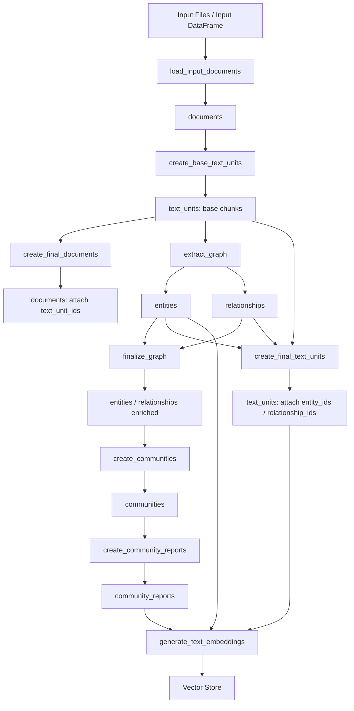
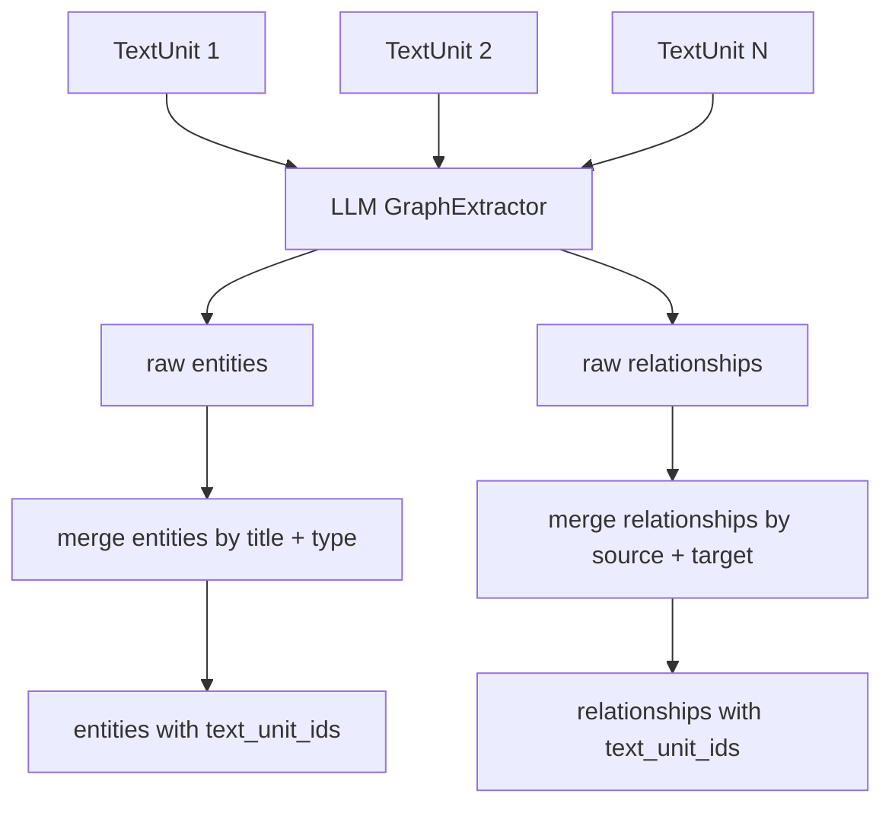
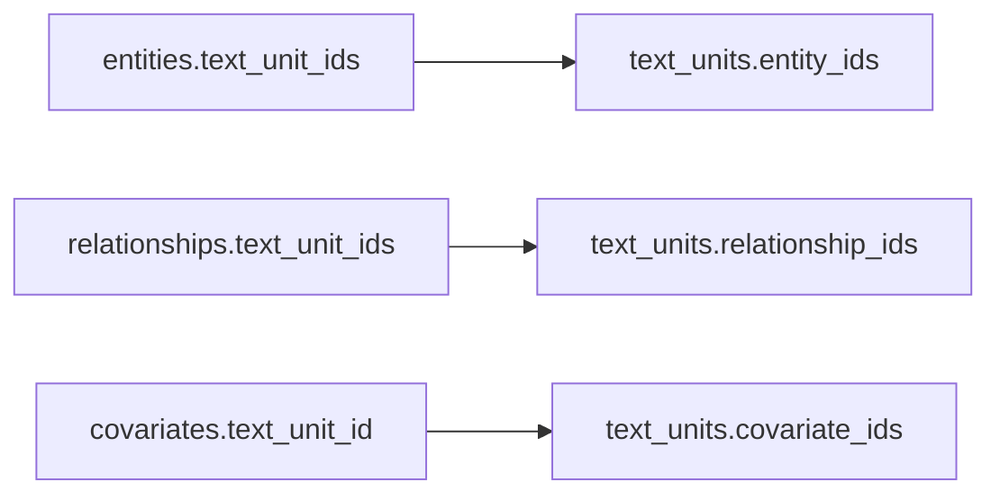
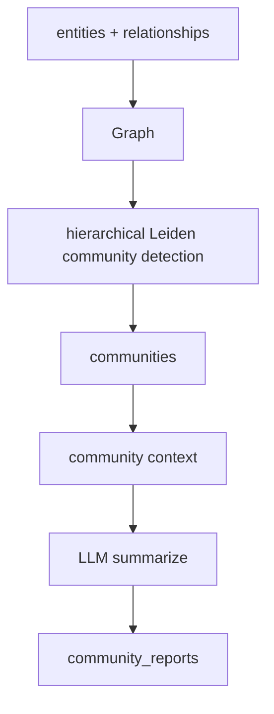
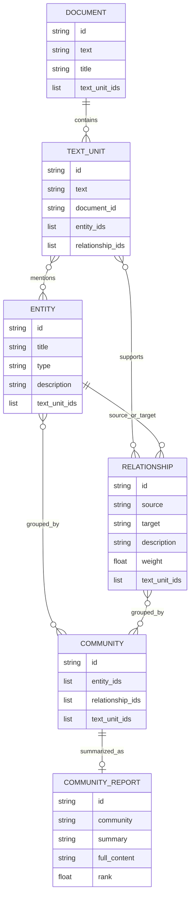
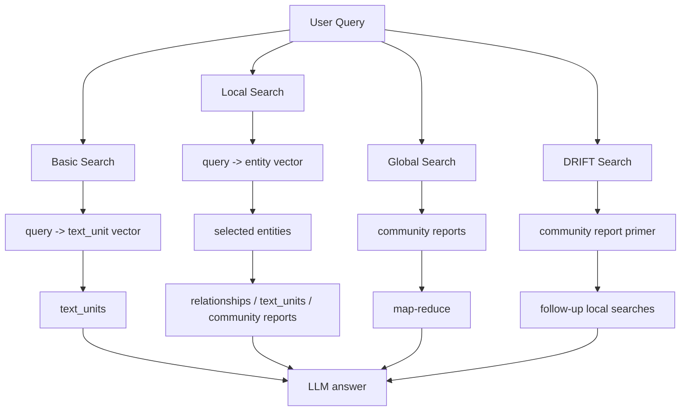
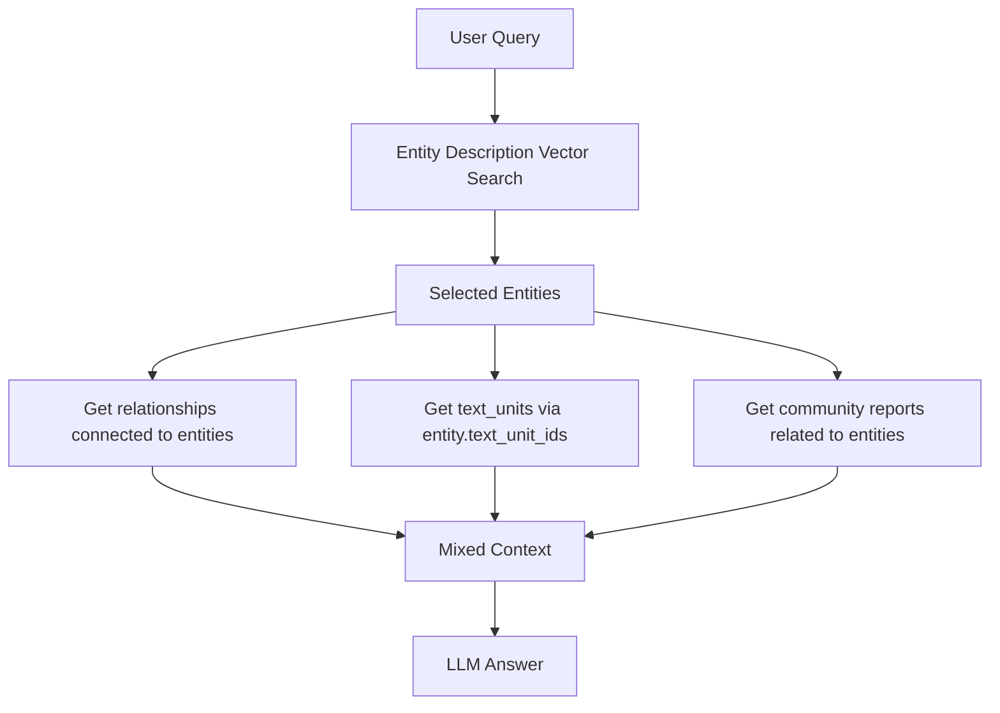
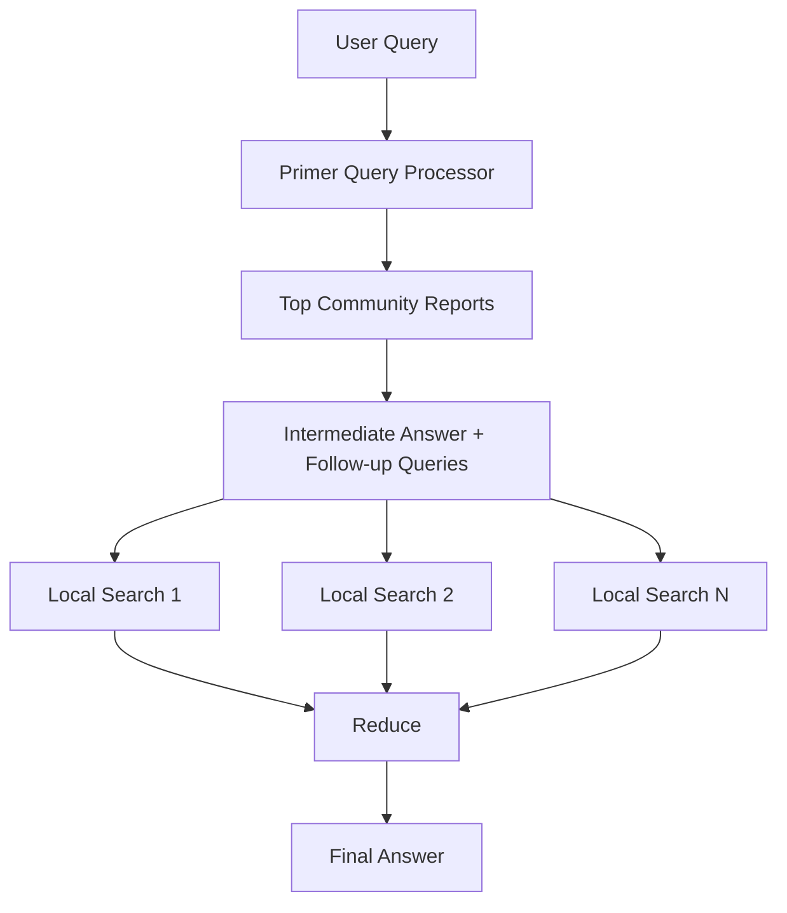
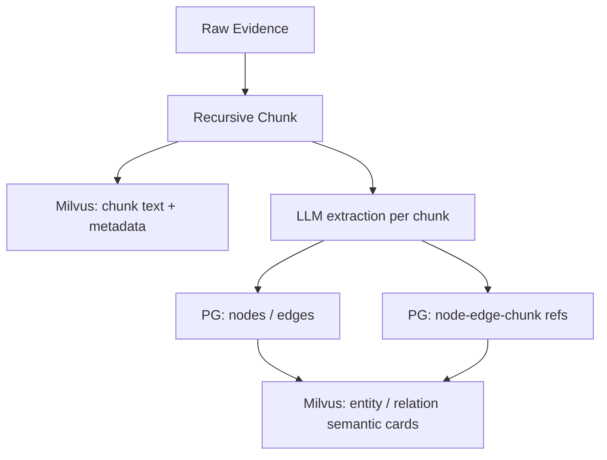
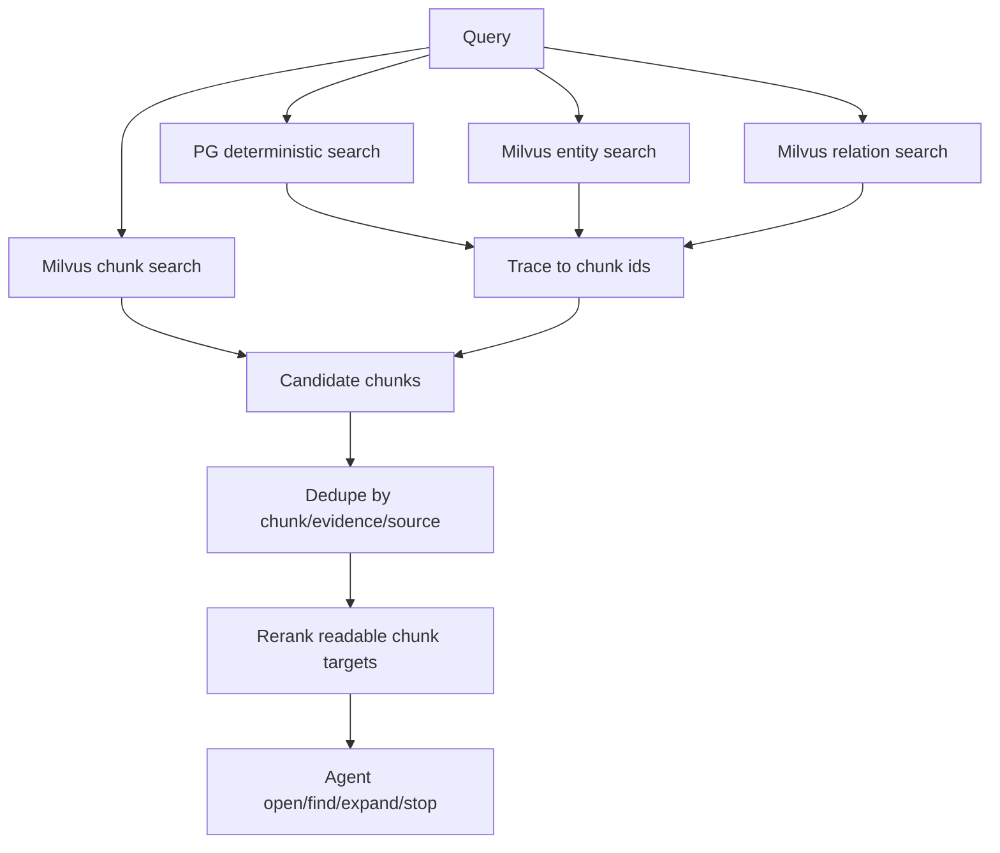

# GraphRAG 数据编译入库与检索机制调研

本文调研对象为本地参考项目：

`packages/references/graphrag`

调研重点不是 GraphRAG 的产品介绍，而是它在工程上如何完成两件事：

1. 数据如何从原始文档编译成可检索的知识资产。
2. 入库后的数据如何被不同检索模式消费。

本文基于本地代码与文档阅读整理，重点参考：

- `docs/index/default_dataflow.md`
- `docs/index/inputs.md`
- `docs/index/outputs.md`
- `docs/query/overview.md`
- `graphrag/api/index.py`
- `graphrag/index/workflows/*`
- `graphrag/query/factory.py`
- `graphrag/query/structured_search/*`

涉及 GraphRAG prompt 的能力，需要同步参考以下本地源码位置：

| 能力 | Prompt 文件位置 | 主要应用位置 |
|---|---|---|
| 实体与关系抽取 | `packages/references/graphrag/packages/graphrag/graphrag/prompts/index/extract_graph.py` | `packages/references/graphrag/packages/graphrag/graphrag/index/workflows/extract_graph.py` |
| 实体/关系描述摘要 | `packages/references/graphrag/packages/graphrag/graphrag/prompts/index/summarize_descriptions.py` | `packages/references/graphrag/packages/graphrag/graphrag/index/workflows/extract_graph.py`、`packages/references/graphrag/packages/graphrag/graphrag/index/workflows/update_entities_relationships.py` |
| Claim 抽取 | `packages/references/graphrag/packages/graphrag/graphrag/prompts/index/extract_claims.py` | `packages/references/graphrag/packages/graphrag/graphrag/index/workflows/extract_covariates.py` |
| Community Report 生成 | `packages/references/graphrag/packages/graphrag/graphrag/prompts/index/community_report.py` | `packages/references/graphrag/packages/graphrag/graphrag/index/workflows/create_community_reports.py` |
| Fast 模式下的 TextUnit Report 生成 | `packages/references/graphrag/packages/graphrag/graphrag/prompts/index/community_report_text_units.py` | `packages/references/graphrag/packages/graphrag/graphrag/index/workflows/create_community_reports_text.py` |
| Basic Search 回答 | `packages/references/graphrag/packages/graphrag/graphrag/prompts/query/basic_search_system_prompt.py` | `packages/references/graphrag/packages/graphrag/graphrag/query/structured_search/basic_search/search.py` |
| Local Search 回答 | `packages/references/graphrag/packages/graphrag/graphrag/prompts/query/local_search_system_prompt.py` | `packages/references/graphrag/packages/graphrag/graphrag/query/structured_search/local_search/search.py` |
| Global Search map/reduce | `packages/references/graphrag/packages/graphrag/graphrag/prompts/query/global_search_map_system_prompt.py`、`packages/references/graphrag/packages/graphrag/graphrag/prompts/query/global_search_reduce_system_prompt.py`、`packages/references/graphrag/packages/graphrag/graphrag/prompts/query/global_search_knowledge_system_prompt.py` | `packages/references/graphrag/packages/graphrag/graphrag/query/structured_search/global_search/search.py` |
| DRIFT Search 回答 | `packages/references/graphrag/packages/graphrag/graphrag/prompts/query/drift_search_system_prompt.py` | `packages/references/graphrag/packages/graphrag/graphrag/query/structured_search/drift_search/search.py` |
| 问题生成 | `packages/references/graphrag/packages/graphrag/graphrag/prompts/query/question_gen_system_prompt.py` | `packages/references/graphrag/packages/graphrag/graphrag/query/question_gen/*` |

## 1. 总体结论

GraphRAG 的核心不是“把图谱和向量库简单拼起来”，而是围绕 `TextUnit` 建立一条可追溯链路：

```text
Document
  -> TextUnit
  -> Entity / Relationship
  -> Community
  -> Community Report
  -> Embedding / Query Context
```

其中最关键的设计点是：

- `TextUnit` 是原文 chunk，也是后续实体、关系、社区、回答上下文的证据锚点。
- `Entity` 和 `Relationship` 不是孤立事实，它们都保留 `text_unit_ids`，可以追溯回原文片段。
- `TextUnit` 在最终阶段也反向写入 `entity_ids`、`relationship_ids`、`covariate_ids`，形成双向引用。
- 查询不是只搜 chunk，也不是只搜图关系，而是根据查询模式使用不同入口：
  - `Basic Search` 直接向量搜索 TextUnit。
  - `Local Search` 先向量搜索 Entity，再沿图谱拿 Relationship / TextUnit / Community Report。
  - `Global Search` 直接使用 Community Report 做 map-reduce。
  - `DRIFT Search` 用 Community Report 生成全局引导，再发起 Local Search。

这对我们当前 KG 检索重构的启发很直接：关系、节点、社区摘要都可以作为召回线索，但最终喂给 rerank / agent 的核心材料必须能回到可读证据 chunk，而不是裸 node/edge。

## 2. 编译入库总览

GraphRAG 的标准索引流水线由 `PipelineFactory` 创建。标准模式的工作流顺序大致如下：



GraphRAG 把“入库”拆成两类产物：

- 输出表：默认是 Parquet，也可使用 CSV、Cosmos DB 等 table provider。
- 向量索引：默认配置偏向 LanceDB，也支持 Azure AI Search、Cosmos DB 等 vector store。

因此 GraphRAG 并不是只把数据写进一个数据库。它是“结构化输出表 + 向量索引 + LLM cache + 运行状态”的组合。

## 3. 输入规范

GraphRAG 的输入会被归一化成 `documents` 表。核心字段包括：

| 字段 | 说明 |
|---|---|
| `id` | 文档 ID，默认可由文本 hash 得到 |
| `text` | 原始文本 |
| `title` | 文档标题 |
| `creation_date` | 创建时间 |
| `metadata` | 可选元数据 |

它支持从本地文件读取，也支持通过 API 传入 `input_documents` DataFrame。`build_index()` 中如果传入 `input_documents`，就可以绕过文件读取。

这说明 GraphRAG 的编译入口是文档级的，而不是先手写实体或边。实体和边是从 chunk 中抽取出来的派生产物。

## 4. TextUnit：GraphRAG 的证据中枢

### 4.1 Chunking 策略

GraphRAG 默认 chunk 配置是 token-based：

```text
chunk_size = 1200 tokens
overlap = 100 tokens
encoding_model = cl100k_base
```

内置 chunker 主要有：

- `tokens`：按 token 固定窗口切分。
- `sentence`：按句子边界切分。

默认 token chunker 的逻辑是滑动窗口：

```text
start = 0
end = chunk_size
next_start = start + chunk_size - overlap
```

它不是基于 embedding 的语义断点切分，也不是复杂的章节递归切分。

### 4.2 TextUnit 持久化字段

`create_base_text_units` 会从 `documents` 生成 `text_units`。核心字段为：

| 字段 | 说明 |
|---|---|
| `id` | TextUnit ID，基于 chunk text hash |
| `document_id` | 所属 Document |
| `text` | chunk 文本 |
| `n_tokens` | chunk token 数 |

GraphRAG 的底层 `TextChunk` 对象包含 `index`、`start_char`、`end_char`、`token_count`，但标准输出的 `text_units` 表主要保存 `id / text / document_id / n_tokens`。也就是说，它的默认表结构没有特别强调 chunk offset。

对我们来说，这一点要谨慎：如果后续要做精确回溯、邻接 chunk 展开、引用原文位置，最好保留 `chunk_index / start_offset / end_offset / chunker_version` 这类字段。

## 5. 图谱抽取与合并

GraphRAG 的 `extract_graph` 不是直接对整篇文档抽取，而是逐个 `TextUnit` 调用 LLM 抽取实体和关系。



每个抽取结果都会携带 `source_id = text_unit.id`。这是 GraphRAG 能把实体、关系追溯回 chunk 的关键。

### 5.1 Entity 合并

实体按 `title + type` 合并：

- `description` 会聚合成列表，然后再做摘要。
- `text_unit_ids` 会聚合所有来源 TextUnit。
- `frequency` 记录出现频次。

最终实体类似：

```text
Entity:
  title: "半导体"
  type: "industry"
  description: "..."
  text_unit_ids: ["chunk_a", "chunk_b"]
  frequency: 2
```

### 5.2 Relationship 合并

关系按 `source + target` 合并：

- `description` 聚合后摘要。
- `weight` 累加。
- `text_unit_ids` 聚合来源 TextUnit。

最终关系类似：

```text
Relationship:
  source: "科创板八条"
  target: "半导体"
  description: "政策引导资源向半导体等新质生产力领域聚集"
  weight: 1.0
  text_unit_ids: ["chunk_a"]
```

注意：GraphRAG 的关系是描述型关系，不是强类型金融关系枚举。它更强调关系文本摘要和权重，而不是像 `benefits_from / affects / belongs_to` 这类固定关系类型。

## 6. Finalize 与双向引用

GraphRAG 在 `create_final_text_units` 阶段会把图谱抽取结果反写回 TextUnit：



这一步很重要。最终表不只是：

```text
Entity -> TextUnit
Relationship -> TextUnit
```

而是同时具备：

```text
TextUnit -> Entity / Relationship / Covariate
```

这种双向引用让检索可以从任意入口进入：

- 命中 TextUnit 后，可以看到它包含哪些实体和关系。
- 命中 Entity 后，可以追溯相关 TextUnit。
- 命中 Relationship 后，也可以追溯相关 TextUnit。

这是我们当前系统需要重点借鉴的地方。

## 7. Community 与 Community Report

GraphRAG 会基于实体和关系构建图，并使用 hierarchical Leiden 做层级社区发现。



### 7.1 层级 Community 如何生成

GraphRAG 不按时间窗口切 community，而是先把关系表变成无向加权图：

```text
source -- target, weight
```

然后调用 `hierarchical_leiden`：

```text
relationships
  -> normalize direction
  -> deduplicate undirected edge
  -> optional largest connected component
  -> hierarchical_leiden(edge_list, max_cluster_size, seed)
  -> node -> cluster mapping by level
  -> parent_cluster mapping
```

核心源码位置：

- `packages/references/graphrag/packages/graphrag/graphrag/index/operations/cluster_graph.py`
- `cluster_graph()` 调用 `hierarchical_leiden`。
- `_compute_leiden_communities()` 将 edge list 转成层级聚类结果。

每个聚类结果包含：

```text
level
cluster
parent_cluster
node
```

因此 GraphRAG 的 community 是自然分层的：

```text
level 0: 更高层、更宏观的 community
level 1/2/...: 更细的子 community
parent / children: community 层级关系
```

### 7.2 Community 如何追溯回实体、关系和 TextUnit

`communities` 表会记录：

- `entity_ids`
- `relationship_ids`
- `text_unit_ids`
- 层级结构字段
- 社区大小、period 等

这些字段不是 LLM 摘要出来的，而是由图结构聚合得到：

```text
community
  -> 包含的 node title
  -> 映射为 entity_ids
  -> 选择 source 和 target 都在 community 内的 relationship_ids
  -> 从 relationship.text_unit_ids 聚合出 text_unit_ids
```

核心源码位置：

- `packages/references/graphrag/packages/graphrag/graphrag/index/workflows/create_communities.py`
- `create_communities()` 聚合 `entity_ids / relationship_ids / text_unit_ids / parent / children`。

这意味着 community report 虽然是高层摘要，但底层仍然可以追溯到：

```text
community -> entities
community -> relationships
community -> text_units
```

### 7.3 Community Report 的生成顺序

GraphRAG 不是一次性把全图塞给 LLM 生成总报告，而是按 community level 自底向上生成。

生成顺序来自：

```text
levels = sorted(levels, reverse=True)
```

也就是先处理更深层、更细粒度的 community，再处理更高层、更宏观的 community。

核心源码位置：

- `packages/references/graphrag/packages/graphrag/graphrag/index/operations/summarize_communities/utils.py`
- `get_levels()` 返回倒序 level。
- `packages/references/graphrag/packages/graphrag/graphrag/index/operations/summarize_communities/summarize_communities.py`
- `summarize_communities()` 逐层构造上下文并生成 report。

`community_reports` 是 LLM 对社区的摘要，通常包含：

- `title`
- `summary`
- `full_content`
- `rank`
- `findings`
- `full_content_json`

Report 生成时的上下文通常包含：

```text
Entities
Claims
Relationships
Sub-community Reports
```

底层 report 更接近原始 entity / relationship / text_unit 细节；高层 report 更偏宏观总结。

### 7.4 Token 超限时如何利用子 Community Report

GraphRAG 的一个关键设计是：父 community 的上下文如果太大，不会强行塞入所有明细，而是用子 community report 替代部分明细内容。

逻辑大致是：

```text
parent community local context
  -> 如果 token 放得下，直接使用 entities / relationships / claims
  -> 如果 token 超限，优先引入 child community reports
  -> 对剩余子 community 保留局部明细
  -> 仍超限时继续截断
```

核心源码位置：

- `packages/references/graphrag/packages/graphrag/graphrag/index/operations/summarize_communities/graph_context/context_builder.py`
- `build_level_context()` 判断当前 community context 是否超限。
- `_get_subcontext_df()` 获取下一层子 community 的 report 和 local context。
- `packages/references/graphrag/packages/graphrag/graphrag/index/operations/summarize_communities/build_mixed_context.py`
- `build_mixed_context()` 用子 community report 替代过大的明细上下文。

这套机制让 GraphRAG 能同时保留：

```text
底层细节
高层总结
父子层级
可追溯 text_units
```

对我们的启发是：高级索引不应该按时间硬切为孤立批次。更合理的是：

```text
community / topic 作为主边界
time window 作为观察视图和增量刷新条件
```

例如：

```text
俄乌冲突 community
  -> all-time profile
  -> 2024 summary
  -> 2025 summary
  -> last 30d delta
  -> last 7d new risks
```

这样长期事件不会因为时间窗口切分而断层。

这层设计解决的是高层主题问题。例如：

```text
过去一个月 A 股并购重组市场有哪些结构性变化？
```

如果只搜 chunk，很容易变成局部片段堆砌。Community Report 则提供跨文档、跨实体、跨关系的主题级摘要。

代价是明显的：

- 编译阶段 LLM 成本更高。
- 社区摘要可能引入二次摘要误差。
- 更新时需要考虑社区和报告的重算策略。

## 8. Embedding 与向量索引

GraphRAG 默认生成三类 embedding：

| Embedding 名称 | 来源表 | 来源字段 | 用途 |
|---|---|---|---|
| `text_unit_text_embedding` | `text_units` | `text` | Basic Search 直接 chunk 检索 |
| `entity_description_embedding` | `entities` | `title + description` | Local Search 的实体入口 |
| `community_full_content_embedding` | `community_reports` | `full_content` | DRIFT / community 相关召回 |

这说明 GraphRAG 并不是只 embed 原文 chunk。它同时 embed：

- 原文证据。
- 图谱实体摘要。
- 社区级摘要。

但无论入口是什么，Local Search 最终仍会把实体和关系追溯回 TextUnit，构造可读上下文。

## 9. 输出表关系

GraphRAG 的核心输出表关系可以概括为：



从这个关系看，GraphRAG 的知识图谱不是替代原文，而是给原文 chunk 增加索引和导航结构。

## 10. 检索模式总览

GraphRAG 查询层主要有四类模式。



## 11. Basic Search：普通 chunk 向量检索

Basic Search 是最接近传统 RAG 的路径：

```text
query
  -> embed query
  -> text_unit_text_embedding.similarity_search_by_text
  -> map vector result id to text_units
  -> pack text_units into context
  -> LLM answer
```

特点：

- 简单。
- 直接返回原文 chunk。
- 不用图谱。
- 适合作为最低成本 baseline。

不足：

- 对抽象关系、跨文档主题、实体关系链条不敏感。
- 如果 query 没有直接命中 chunk 表达，容易漏召回。

## 12. Local Search：实体入口 + 图谱展开 + TextUnit 回溯

Local Search 是 GraphRAG 最核心的 KG 检索路径。

### 12.1 检索流程



它不是先搜关系，也不是先搜 chunk，而是：

```text
query -> entity_description_embedding -> selected entities
```

然后根据选中的实体展开：

- Entity context
- Relationship context
- Covariate context
- TextUnit context
- Community report context

### 12.2 TextUnit 如何进入 Local Search

Local Search 中的 TextUnit 不是直接向量召回，而是通过 selected entities 追溯：

```text
selected entity
  -> entity.text_unit_ids
  -> candidate text_units
```

GraphRAG 会对候选 TextUnit 做排序，排序因素包括：

- selected entity 的顺序。
- TextUnit 中包含的关系数量。
- token budget。

这说明 GraphRAG 认为：对实体问题而言，先找对实体，再回到支持该实体的文本片段，比直接搜文本更稳定。

### 12.3 Local Search 的优缺点

优点：

- 能利用实体归一和关系网络。
- 能把抽象 query 映射到实体描述。
- 能从实体追溯多个相关 chunk。

缺点：

- 如果实体向量召回失败，后续链路会整体偏。
- 对金融代码、内部 ID 这种强标识仍然需要额外 resolver，不能完全依赖 embedding。
- 关系是从 selected entity 展开，第一阶段并没有直接搜索所有关系。

## 13. Global Search：社区报告 Map-Reduce

Global Search 面向全局主题问题。它不从单个 chunk 出发，而是使用社区报告。

```text
query
  -> select community reports
  -> map: each report batch answers query
  -> reduce: aggregate intermediate answers
  -> final answer
```

适合问题：

```text
这个语料库中新能源汽车产业链的主要风险是什么？
过去一周市场风险事件有哪些共同主题？
```

不适合问题：

```text
ft_news:83904 这篇新闻提到了哪些行业？
300750 最近有哪些海外产能负面事件？
```

Global Search 的价值在于跨文档主题聚合，代价是构建和查询成本都更高。

## 14. DRIFT Search：全局引导 + 局部搜索

DRIFT Search 是 GraphRAG 比较复杂的模式。它的思路是：

1. 用 community report 给 query 建立一个全局 primer。
2. 生成中间回答和 follow-up queries。
3. 针对 follow-up queries 执行 Local Search。
4. 汇总最终答案。



它更接近 agentic retrieval，但仍是固定检索策略，不是任意工具调度 agent。

## 15. GraphRAG 的“入库后检索”本质

GraphRAG 的检索并不是一条链路，而是多种索引入口共同工作：

| 入口 | 搜索对象 | 搜索方式 | 最终上下文 |
|---|---|---|---|
| Basic | TextUnit | 向量搜索 chunk text | TextUnit 原文 |
| Local | Entity | 向量搜索 entity description | Entity + Relationship + TextUnit + Report |
| Global | Community Report | 遍历或动态选择报告 | Community Report |
| DRIFT | Community Report + Entity | 社区报告相似度 + Local Search | Report + Local Context |

它最关键的共同点是：检索入口可以是实体、关系或社区摘要，但最终回答上下文必须是可读文本，并且最好能追溯到 TextUnit。

## 16. 与我们当前方案的对比

我们当前正在讨论的目标架构是：

```text
Query
  -> Milvus 语义检索入口
       - chunk
       - entity
       - relation
  -> PG deterministic search / resolver / graph refs
  -> edge/node 追溯到 evidence chunk
  -> rerank readable evidence targets
  -> Agent 决定继续搜索、展开、精读或停止
```

GraphRAG 与我们的目标有相似点，也有明显差异。

### 16.1 相似点

- 都不应该让裸 node/edge 直接成为最终 answer context。
- 都需要 chunk 作为证据锚点。
- 都需要实体、关系、chunk 之间的双向引用。
- 都需要多入口检索，而不是只靠 keyword 或只靠向量 chunk。

### 16.2 差异点

| 维度 | GraphRAG | 我们目标方案 |
|---|---|---|
| chunk 存储 | 输出表保存 TextUnit text | Milvus 保存 chunk/card text，PG 保存 refs |
| 第一入口 | Basic 搜 TextUnit；Local 搜 Entity | Milvus chunk/entity/relation 并行或按策略召回 |
| 关系类型 | 描述型 source-target 关系 | 金融领域强类型关系，如 affects / benefits_from |
| 查询控制 | 固定 search mode | Agent 工具调度 |
| 全局层 | Community Report | 后续可选，不作为第一阶段必需 |
| rerank | 上下文构造前有排序/预算控制 | 外接 reranker，对 readable targets 排序 |

## 17. 对我们最有价值的设计

### 17.1 TextUnit / Chunk 必须成为证据中枢

GraphRAG 最值得借鉴的是它没有把 Entity / Relationship 当成最终答案材料。它们是索引和导航结构，真正可读的证据仍然是 TextUnit。

我们应该坚持：

```text
node / edge / relation 命中
  -> 追溯 evidence chunk
  -> chunk 去重
  -> chunk rerank
  -> agent open / find / expand
```

### 17.2 写入侧要先 chunk，再抽取关系

GraphRAG 是先生成 TextUnit，再对 TextUnit 抽取实体和关系。

这比“整篇文档抽关系，再事后找 chunk”更可靠，因为关系天然携带 `text_unit_id`。

我们后续写入侧应该尽量采用：

```text
raw evidence
  -> chunk
  -> per-chunk extraction
  -> entity / relation with chunk refs
```

而不是：

```text
raw evidence
  -> document-level extraction
  -> relation
  -> late bind chunk
```

后者很容易导致关系无法准确追溯到具体证据片段。

### 17.3 双向引用必须补齐

GraphRAG 最终会同时拥有：

```text
entity.text_unit_ids
relationship.text_unit_ids
text_unit.entity_ids
text_unit.relationship_ids
```

我们当前如果采用 PG + Milvus 双层结构，也应该有等价设计：

```text
kg_evidence_chunk_refs:
  evidence_id
  chunk_id
  chunk_index
  text_hash

kg_edge_evidence_refs:
  edge_id
  evidence_id
  chunk_id

kg_node_evidence_refs:
  node_id
  evidence_id
  chunk_id
```

PG 不一定保存 chunk text，但必须保存 chunk id 和关系引用，否则命中 node/edge 后无法稳定回到 Milvus chunk。

### 17.4 多入口检索是必要的

GraphRAG 同时有：

- TextUnit vector
- Entity description vector
- Community report vector

这说明只搜索 chunk text 确实会漏掉抽象关系和实体线索。

我们的第一阶段不应该只有 chunk search。更合理的是：

```text
chunk semantic search
entity semantic search
relation semantic search
PG deterministic search
```

然后统一追溯到 chunk，再做 dedupe / rerank。

### 17.5 Community Report 可作为后续增强，不必第一阶段上线

GraphRAG 的 community report 对全局问题有价值，但成本高、更新复杂。

我们的短期目标应该先把：

```text
evidence chunk
entity/relation refs
rerank
agent open/find/expand
```

做扎实。Community / Cluster / Timeline 这类高层摘要可以后续作为第二阶段能力。

## 18. GraphRAG 的不足与风险

### 18.1 默认 chunking 对中文金融文本不一定最优

GraphRAG 默认 token sliding window 简单可靠，但不一定适合中文财经新闻、公告、研报。

我们前期选择 recursive chunk 更合适：

```text
段落 / 换行 / 中文标点 / token limit
```

原因是中文财经文本中标题、段落、冒号列表、项目符号往往有结构意义，固定 token 窗口容易切断语义单元。

### 18.2 TextUnit 默认输出缺少 offset 信息

GraphRAG 的 `TextChunk` 对象内部有 `start_char / end_char / index`，但标准 `text_units` 表未重点保存这些字段。

如果我们需要高质量 evidence 引用，应该显式保存：

```text
chunk_index
start_offset
end_offset
chunker_version
text_hash
```

### 18.3 Entity-first Local Search 可能漏召回

GraphRAG Local Search 首先搜索 entity description。如果 query 对应的实体召回错了，后续 TextUnit 和 Relationship 都会偏。

所以我们的并行入口更稳：

```text
chunk / entity / relation / deterministic
```

不要只押注单个入口。

### 18.4 关系是 LLM 抽取和摘要结果，不等于原始事实

GraphRAG 的关系 description 是 LLM 生成/合并/摘要后的结果。它适合检索和导航，但不能替代原文证据。

金融场景尤其要注意：关系可以帮助发现，但最终输出必须回到 source-backed evidence。

## 19. 对我们下一步改造的建议

结合 GraphRAG 的实现和我们当前讨论，建议下一步按以下方向推进。

### 19.1 写入侧



关键规则：

- 先 chunk，再抽取关系。
- 抽取结果必须携带 chunk_id。
- PG 保存事实和引用，不保存大段 chunk text。
- Milvus 保存 chunk text，以及可检索的 entity/relation card text。

### 19.2 检索侧



关键规则：

- 如果命中的是 node/edge/entity/relation，不直接喂给 rerank。
- 先追溯到 chunk。
- rerank 的输入应该是可读证据文本，不是裸 ID 和抽象关系。
- Agent 可以继续展开，但展开结果仍然应该回到 chunk。

### 19.3 暂不直接复制 GraphRAG 的 Community Report

Community Report 值得借鉴，但不应该第一阶段直接上。

原因：

- 我们目前最痛的问题是证据优先、chunk 回溯、rerank 输入质量。
- Community Report 解决的是全局主题总结，不是基础 evidence retrieval。
- 在底层 chunk/ref 没打牢之前，上社区摘要会放大数据一致性和摘要漂移问题。

## 20. GraphRAG Prompt 的复用边界

GraphRAG 的 prompt 不能原文照搬，但其中有多处结构可以直接作为我们金融 KG prompt 的骨架。

核心判断：

```text
GraphRAG prompt 可借的是信息发现流程和 grounding 纪律；
不能照搬的是通用领域语义、tuple 输出格式、英文 uppercase 命名、弱金融约束。
```

### 20.1 可以高度复用的 Prompt 结构

| GraphRAG 能力 | 可复用点 | 我们的改造方向 |
|---|---|---|
| 实体与关系抽取 | 先识别实体，再识别 clearly related entity pairs，并输出关系描述和强度 | 改成中文金融 KG JSON 输出，增加 `supporting_text`、`support_reason`、`support_status`、`confidence`、`chunk_id` |
| 继续追问补漏 | `CONTINUE_PROMPT` / `LOOP_PROMPT` 用于减少漏抽 | 可用于抽取质量不过关时的同上下文追问，但必须保留原始 chunk 上下文和失败原因 |
| 实体/关系描述摘要 | 多个描述合并成一个稳定描述，处理冲突 | 用于同一实体、同一关系跨 chunk / 跨批次描述聚合，降低描述漂移 |
| Community Report | `title / summary / rating / findings` 的结构清晰 | 改成市场叙事、风险方向、资产影响、产业链关系、时间演化 |
| TextUnit Report | 保留时间信息和 source 引用 | 适合新闻事件、政策脉络、交易认知场景 |
| Entity Type 生成 | 避免 `other / unknown`，避免冗余重叠 type | 用作 type registry 自动扩展约束，要求优先复用已有 type |

对应源码位置仍以本文开头的 prompt 对照表为准，尤其是：

- `packages/references/graphrag/packages/graphrag/graphrag/prompts/index/extract_graph.py`
- `packages/references/graphrag/packages/graphrag/graphrag/prompts/index/summarize_descriptions.py`
- `packages/references/graphrag/packages/graphrag/graphrag/prompts/index/community_report.py`
- `packages/references/graphrag/packages/graphrag/graphrag/prompts/index/community_report_text_units.py`
- `packages/references/graphrag/packages/graphrag/graphrag/prompt_tune/prompt/entity_types.py`

### 20.2 不能直接照搬的部分

GraphRAG 的默认 prompt 有几个地方不适合直接用于金融 KG：

1. **tuple + delimiter 输出格式不适合工程链路**

   GraphRAG 使用类似：

   ```text
   ("entity"<|>...)
   ##
   ("relationship"<|>...)
   ```

   这种格式适合它自己的 parser，但不适合我们当前的质量检验、二次追问修复、缓存和 trace 分析。我们的抽取输出应统一为 JSON schema。

2. **英文 uppercase 命名不适合中文金融实体**

   GraphRAG 会要求 `entity_name` capitalized，并在实现里倾向于 uppercase title。  
   我们需要的是稳定、可读、面向中文语义检索友好的 canonical name，例如：

   ```text
   股票|中际旭创
   概念|AI算力需求
   行业|半导体
   事件|A股并购重组市场生态变革
   ```

   股票代码、基金代码、source_id、内部 ID 不应混进 canonical name，而应进入 identifiers / aliases。

3. **GraphRAG relationship 是描述型关系，不等于金融关系事实**

   GraphRAG 的 relationship 主要是：

   ```text
   source
   target
   relationship_description
   relationship_strength
   ```

   我们可以借 `description + strength`，但还需要金融语义字段：

   ```text
   relation_type
   direction
   support_status
   support_reason
   confidence
   evidence_id
   chunk_id
   ```

4. **Community Report 的通用语义需要金融化**

   GraphRAG 默认强调 `legal compliance / technical capabilities / reputation / claims`。  
   我们的 Community Report 应强调：

   ```text
   市场主线
   关键主体
   行业链条
   风险方向
   利好/利空因素
   影响资产
   证据强度
   时间演化
   ```

5. **GraphRAG 的 grounding 引用格式要映射到我们的证据链**

   GraphRAG 引用 `Entities / Relationships / Claims / Sources`。  
   我们应引用：

   ```text
   Evidence
   Chunk
   Entity
   Relation
   CommunityReport
   Finding
   ```

   所有高级摘要必须能回到 `chunk_id / evidence_id / source_id`。

### 20.3 我们应沉淀的金融 KG Prompt 族

后续不建议散落地修改单个 prompt，而应形成一组稳定的 prompt 族：

```text
1. chunk_entity_relation_extract_prompt
   从 chunk 中抽取实体、关系、证据短句、支持理由和置信度。

2. entity_relation_normalize_with_candidates_prompt
   给 AI 原始抽取结果和 embedding 召回的相似候选，判断复用、合并还是新建。

3. entity_relation_summarize_prompt
   聚合同一实体或同一关系的多批描述，生成稳定、可读、可检索的描述。

4. community_report_generate_prompt
   基于 community 的实体、关系、chunk refs 生成市场叙事报告。

5. community_finding_generate_prompt
   从 community report 中拆出可检索 finding，保留证据引用。

6. type_registry_suggestion_prompt
   当现有 type 不足时，要求 AI 在完整 type registry 上下文中建议新 type。
```

这套 prompt 族的共同约束：

- 输入必须带 chunk / evidence 上下文。
- 输出必须带证据引用。
- AI 可以建议复用或新建实体、关系、type，但必须说明理由。
- 新增 type 时必须给出定义、适用边界、示例和不适用示例。
- 抽取结果不能只服务图谱写入，也要服务后续 Milvus 语义索引和 Agent 检索。

### 20.4 最终取舍

GraphRAG 的 prompt 是成熟的参考模板，但不是金融 KG 的最终 prompt。

我们应该吸收：

- TextUnit / Chunk 优先的抽取方式。
- 实体和关系同时抽取。
- 抽取后继续追问补漏。
- 描述聚合和冲突归并。
- Community Report 的结构化 JSON 输出。
- Grounding citation 的纪律。

我们不应该照搬：

- 英文通用示例。
- tuple 输出格式。
- uppercase title 合并策略。
- 无金融语义字段的 relationship。
- 通用信息发现的 community report 语义。

因此，GraphRAG prompt 的正确使用方式是：**作为 prompt 设计母版，而不是作为可直接上线的业务 prompt**。

## 21. 最终判断

GraphRAG 的成熟点在于：

```text
chunk 是证据中枢
entity / relationship 是索引和导航结构
community report 是高层摘要结构
所有高级结构都应能追溯回 TextUnit
```

这与我们当前“PG 负责关系、Milvus 负责语义搜索与 chunk text 存储”的方向并不冲突。真正需要吸收的是 GraphRAG 的证据链路纪律：

- 不要让 node/edge 直接成为最终检索结果。
- 不要在关系抽取后才补证据。
- 不要让 rerank 面对 ID 和抽象卡片。
- 先把 chunk、引用、回溯和可读证据做好，再考虑社区摘要和更复杂的 agent 策略。

换句话说，GraphRAG 给我们的主要启发不是“照搬 Local / Global / DRIFT 三套 query mode”，而是把写入侧和检索侧都统一到同一个证据锚点：`TextUnit / Chunk`。

## 22. Community 机制专项补充调研

本节补充一次针对 GraphRAG community 机制的代码级调研，重点回答我们当前遇到的问题：

```text
如果第一条消息关系很弱，GraphRAG 如何划分 community？
GraphRAG 是否存在“新消息挂靠已有 community”的在线机制？
它如何避免一条消息一个 community？
哪些部分可以借鉴，哪些不能照搬？
```

### 22.1 我们当前遇到的问题

当前系统回放暴露出的问题是：

```text
多条样本新闻进入系统后，每条新闻基本形成一个 level 0 community。
每个 community 只覆盖 1 条 evidence 或 1 个 source。
community summary 更像 ft_news.summary，而不是跨新闻主题总结。
market_narrative / industry_chain / policy_impact / risk_event 没有形成真正动态社区，只像标签或评分。
```

这说明当前 Graph Index 还没有真正解决“主题社区”的问题，而是在把单条新闻的 node / edge 集合包装成 community。

我们进一步讨论后形成的新目标是：

```text
每条消息都应进入社区体系。
关系弱的初始消息也要挂靠已有 community 或创建新 community identity。
但单条消息不能直接生成成熟 community report。
社区应有 seed / emerging / mature / inactive 生命周期。
```

因此需要确认 GraphRAG 是否已经具备类似机制。

### 22.2 GraphRAG 的 Community 是离线批处理聚类产物

GraphRAG 的 community 构建入口在：

```text
packages/references/graphrag/packages/graphrag/graphrag/index/workflows/create_communities.py
```

核心流程是：

```text
relationships table
  -> cluster_graph()
  -> hierarchical Leiden
  -> communities table
```

关键源码位置：

- `create_communities.py:31-49`：读取 `relationships`，调用 `create_communities()`。
- `create_communities.py:86-91`：调用 `cluster_graph(relationships, max_cluster_size, use_lcc, seed)`。
- `cluster_graph.py:20-47`：把 Leiden 输出转成 `(level, cluster, parent, nodes)`。
- `cluster_graph.py:60-70`：将关系边转成无向边、去重，并可选过滤最大连通分量。
- `hierarchical_leiden.py:11-27`：调用 `graspologic_native.hierarchical_leiden()`。

这说明 GraphRAG 的 community 不是由 AI 在线判断“这条新消息属于哪个社区”，而是在一个关系图批次上运行图聚类算法。

GraphRAG 的 community 更像：

```text
批次 relationships -> 图聚类 -> community
```

不是：

```text
新消息 -> 召回已有 community -> AI 判断挂靠 / 新建
```

### 22.3 第一条弱关系消息在 GraphRAG 中会如何处理

GraphRAG 没有专门的“初始消息弱关系挂靠”逻辑。

它的行为取决于这条消息在当前批次图中的位置。

#### 情况一：弱消息形成孤立小连通分量

GraphRAG 默认配置：

```text
cluster_graph.use_lcc = True
```

源码位置：

```text
packages/references/graphrag/packages/graphrag/graphrag/config/defaults.py
packages/references/graphrag/packages/graphrag/graphrag/graphs/stable_lcc.py
```

`stable_lcc()` 会先保留最大连通分量：

```text
relationships
  -> largest_connected_component
  -> only LCC edges
```

如果第一条弱消息只是一个小孤岛，它可能根本不会进入 community clustering。

这不是“挂靠到已有社区”，而是离线全局图构建中的降噪策略。

#### 情况二：弱消息所在小图就是当前批次主要图

如果当前批次只有这条消息，或者它所在连通分量就是最大连通分量，GraphRAG 仍然可能给它生成 community。

GraphRAG 没有看到类似下面的硬门槛：

```text
evidence_count >= 2
source_count >= 2
shared_anchor_count >= 1
```

也就是说，GraphRAG 并不从根本上禁止“一条消息一个 community”。它主要依赖大批量语料、实体 title 合并、关系聚合、LCC 和查询阶段选择来降低这个问题的影响。

### 22.4 GraphRAG 的增量更新不是智能挂靠

GraphRAG 的增量 community 更新位于：

```text
packages/references/graphrag/packages/graphrag/graphrag/index/update/communities.py
packages/references/graphrag/packages/graphrag/graphrag/index/workflows/update_communities.py
packages/references/graphrag/packages/graphrag/graphrag/index/workflows/update_community_reports.py
```

核心逻辑是：

```text
old_communities + delta_communities -> concat / re-id / merge table
```

代码上会把 delta community 的 ID 增量偏移，然后和旧 community 合并。

这不是：

```text
delta message -> 找旧 community -> 挂靠旧 community -> 更新 membership
```

所以 GraphRAG 的增量社区机制也不是我们讨论的 `Community Registry + AI 动态挂靠`。

### 22.5 GraphRAG 的查询时动态选择不等于写入时动态归属

GraphRAG 有 `DynamicCommunitySelection`：

```text
packages/references/graphrag/packages/graphrag/graphrag/query/context_builder/dynamic_community_selection.py
```

它的作用是在 Global Search 查询阶段：

```text
query
  -> 从 level 0 community report 开始评分
  -> 相关则继续看 children
  -> 选择和 query 相关的 community reports
```

这解决的是：

```text
查询时应该把哪些 community report 放进上下文
```

不是：

```text
写入时新消息应该挂靠哪个 community
```

因此不能把 GraphRAG 的 dynamic community selection 理解为社区归属机制。

### 22.6 GraphRAG Community Report 的可借鉴点

GraphRAG 生成 community report 时，会先构造社区上下文：

```text
community entities
community relationships
optional claims
sub-community reports
```

关键源码位置：

```text
packages/references/graphrag/packages/graphrag/graphrag/index/workflows/create_community_reports.py
packages/references/graphrag/packages/graphrag/graphrag/index/operations/summarize_communities/graph_context/context_builder.py
packages/references/graphrag/packages/graphrag/graphrag/index/operations/summarize_communities/summarize_communities.py
```

值得借鉴的是：

1. **报告上下文基于 entity / relationship / claims，而不是原始全文堆叠。**
2. **高层 community report 可以复用下层 sub-community report。**
3. **上下文超长时，会用子社区报告替换局部明细，避免 token 爆炸。**
4. **Community Report 输出结构化 JSON，包含 title、summary、rating、findings。**

这对我们的 mature community report 很有价值。

### 22.7 GraphRAG 对我们的启发和边界

GraphRAG 可以直接借鉴的部分：

```text
TextUnit / Chunk 是证据中枢。
Entity 和 Relationship 都必须能追溯 TextUnit。
Relationship 聚合后形成图边。
hierarchical Leiden 适合成熟批次图的结构拆分。
Community Report 应 bottom-up 生成。
查询时可以动态选择 relevant community report。
```

GraphRAG 不能直接照搬的部分：

```text
不能照搬 title 合并作为金融 KG 的唯一归一化策略。
不能照搬 use_lcc 直接丢掉小连通分量，因为金融早期主题可能很重要。
不能照搬离线批处理 community 机制来解决实时消息挂靠。
不能把一条消息形成的小 community 直接当成成熟市场叙事。
不能只靠 query-time dynamic selection 解决 write-time community identity 问题。
```

### 22.8 对我们当前设计的结论

GraphRAG 证明了：

```text
成熟社区报告适合基于图聚类和 bottom-up report 生成。
```

但 GraphRAG 没有解决：

```text
金融实时增量流中，第一条弱关系消息如何进入社区体系。
```

因此我们当前设计中的 `Community Registry + AI 动态挂靠 + 生命周期` 是必要补充。

目标机制应是：

```text
新消息
  -> 抽取 facts
  -> 生成 topic digest / anchors
  -> 召回 Community Registry 候选
  -> AI 判断 attach / create / multi-attach
  -> 写 Community Membership
  -> 更新 seed / emerging / mature 状态
  -> mature 后再用 GraphRAG 风格聚类和 bottom-up report
```

也就是说：

```text
GraphRAG 负责成熟主题图的结构化总结方法。
Community Registry 负责增量消息进入主题体系的方法。
```

这两者应该组合，而不是二选一。
