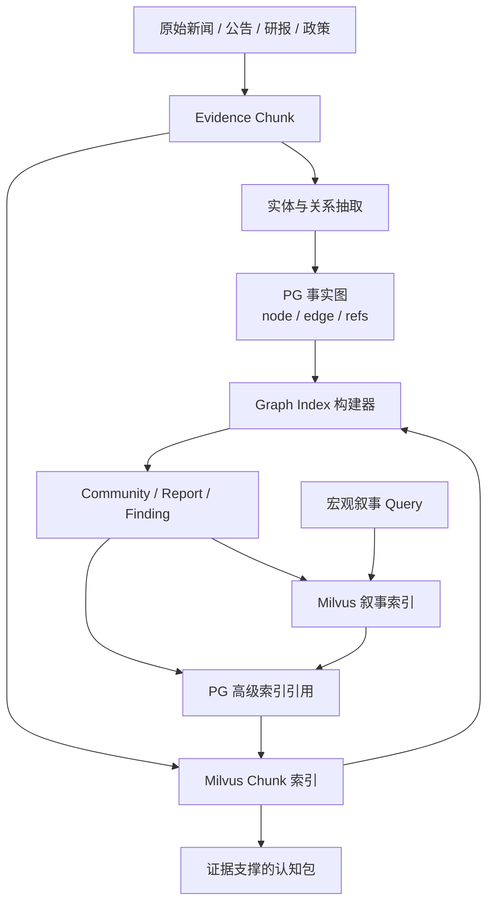
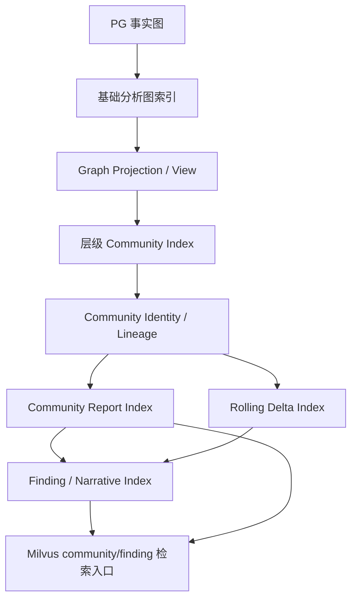
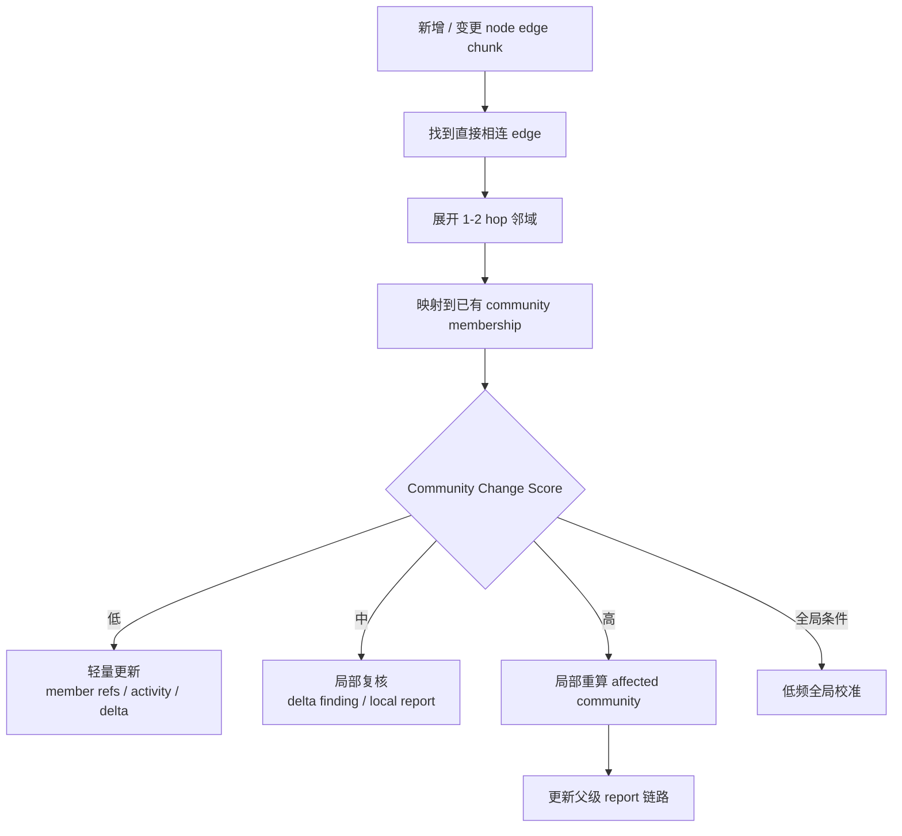
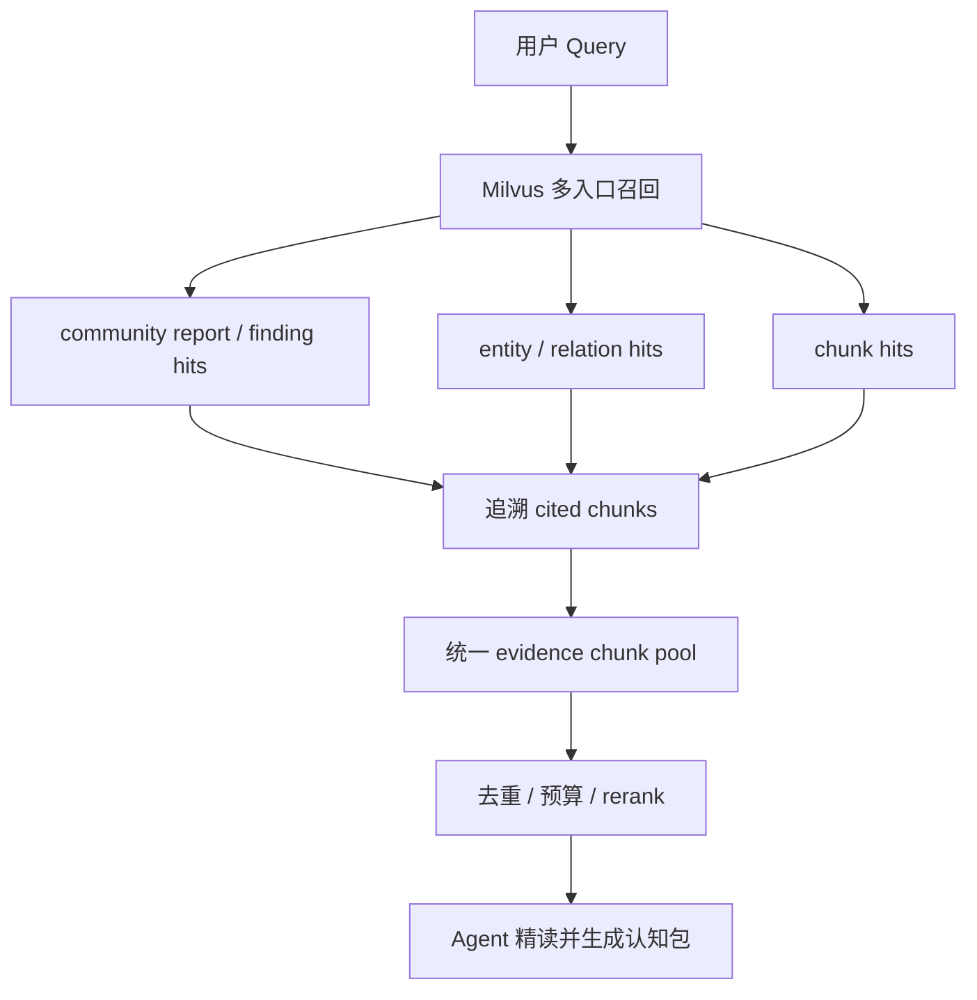

# Graph Index 增量构建与多索引分层设计方案

## 1. 本文定位

本文专门回答知识图谱高级索引层的几个核心问题：

1. 什么是 `Graph Index`，它和 PG 事实图、Milvus 语义索引是什么关系。
2. 系统应该拥有多少类 graph index，以及这些 index 如何划分。
3. 为什么不能每次增量数据进入后都全局重构 community graph。
4. 如何用低成本增量机制维护长期主题、短期变化和市场叙事。
5. 如何借鉴 GraphRAG 的 hierarchical community report，但不照搬它的全量构建成本。

本文是设计侧方案，只描述系统目标形态、核心判断和能力边界。它不写表结构、类名、接口字段和代码实现细节。

相关背景文档：

- `12. Milvus语义检索、PG关系展开与叙事图谱设计方案.md`
- `13. GraphRAG数据编译入库与检索机制调研.md`

## 2. 背景问题

当前双层检索架构已经明确：

```text
PG 保存事实、关系和引用。
Milvus 保存可检索文本、embedding 和按 ID 取回能力。
chunk 是最终证据中枢。
entity / relation / community 只能作为检索入口和导航结构。
```

但宏观认知问题只靠 chunk / entity / relation 首轮召回仍然不够：

```text
最近市场对 AI 算力链的主要叙事是什么？
过去一周新能源板块风险事件集中在哪些方向？
A 股并购重组市场的结构性变化有哪些？
俄乌冲突对能源、航运和军工的长期影响链条是什么？
```

这些问题需要跨文档、跨实体、跨关系聚合。单纯搜索 chunk 会得到局部证据堆；单纯搜索 edge 会得到内部关系列表；让 Agent 每次临时搜索、展开、总结，成本高且不稳定。

因此系统需要一个预构建的 `Graph Index`：

```text
事实图谱
  -> 结构化分析图
  -> 层级 community
  -> community report
  -> finding / narrative
  -> 可追溯 evidence chunks
```

关键难点是增量成本。

如果每新增一批新闻就全局重构：

- 图社区发现成本高。
- community report 生成会消耗大量 LLM token。
- 旧 report 和新 report 的 lineage 难以解释。
- 高频更新会拖慢写入链路。

如果只低频定期重构：

- 最近市场叙事会滞后。
- 短期风险聚集无法及时体现。
- Agent 仍要在查询时临时搜索和归纳。

所以目标不是“每次全量重建”，而是建立一套 **长期 community 稳定、短期 delta 高频更新、局部变更局部重算** 的 Graph Index 体系。

## 3. 系统定位

Graph Index 是 KG 认知辅助层的高级派生索引，不是事实层。



Graph Index 不直接回答“事实是什么”。它回答：

```text
哪些事实形成了一个主题？
哪些主题正在增强或减弱？
哪些风险、机会、影响链条被多条证据共同支撑？
一个宏观问题应该先看哪些 evidence chunk？
```

最终对外输出仍必须回到 evidence chunk。

## 4. 目标系统形态

目标系统不是只有一个巨大 graph index，而是一组按职责分层的 graph index。



核心对象分六层：

| 层级 | 对象 | 作用 | 更新频率 | 是否直接作为最终答案 |
| --- | --- | --- | --- | --- |
| L0 | 基础分析图 | 从 PG facts 派生的加权图 | 写入批次内实时同步更新 | 否 |
| L1 | Graph Projection / View | 图构建视角。可预置少量业务视角，但不预置 community 结果 | 按真实回放治理和扩展 | 否 |
| L2 | 层级 Community | 同一 projection 内自然形成宏观到细节的多层社区 | 局部增量 + 低频校准 | 否 |
| L3 | Community Report | community 的层级摘要 | 受影响 community 才重写 | 否 |
| L4 | Delta View | 最近 24h / 7d / 30d 的变化 | 高频微批 | 否 |
| L5 | Finding / Narrative | 可检索的子结论和市场叙事 | 随 report / delta 更新 | 否，必须展开 chunk |

这六层共同组成 Graph Index。查询时命中 community report / finding 等高级对象后，必须展开到 cited chunks，再进入 rerank / Agent 精读。

## 5. Index 分类

Graph Index 不应该按“每天一个图”或“每批数据一个图”切分。主要切分维度应是 **Graph Projection / View、层级粒度、时间视图和更新策略**。

### 5.1 基础分析图索引

基础分析图是所有高级索引的输入。

它从 PG 事实图派生：

```text
node = canonical entity / event / concept / asset / policy
edge = relation with evidence refs
weight = 可解释聚合权重
refs = evidence_id / chunk_id / source_id
```

它不调用 LLM，不生成摘要，只负责把 PG facts 转成适合 community detection 的加权图。

这个索引必须在写入批次内实时同步更新，因为它是后续 dirty subgraph 判断和 `Community Change Score` 计算的基础。

实时更新只做低成本确定性图统计：

```text
edge weight 基础项
node degree
edge evidence_count
chunk refs count
recent activity
source quality aggregate
generic node penalty
changed node / edge set
```

实时更新不做重活：

```text
不跑 hierarchical community detection
不生成 community report
不调用 LLM
不生成 finding
不刷新父级 community
```

也就是说，基础分析图是写入链路中的轻量派生状态。它服务后续 Graph Index Builder，但不直接进入查询链路。

基础分析图是派生状态。第一版需要明确失败边界：如果基础分析图实时更新失败，应记录 `graph_index_dirty / needs_rebuild`，并进入后续修复或重建流程；是否阻断 PG facts 写入由写入链路的事务边界单独定义，不能让这个派生状态的失败静默污染后续 Graph Index。

### 5.2 Stable Community Identity / Lineage

`Stable Community` 不是独立于 hierarchical community 的另一套索引，而是层级 community 的稳定身份和版本机制。它表示长期存在的主题结构，例如：

```text
AI 算力链
A 股并购重组
新能源产能出海
俄乌冲突与能源价格
半导体政策支持
```

它的边界由图结构决定，而不是由时间窗口决定。

同一个长期主题可以有多个时间视图：

```text
AI 算力链 community
  -> all_time view
  -> rolling_30d delta
  -> rolling_7d findings
  -> rolling_24h risk signals
```

层级 community 的稳定身份不应该因为今天新增几条新闻就被整体重建。第一版不引入 AI 判断是否重算，而是使用可解释的规则分数 `Community Change Score`：新数据先按图结构、证据、权重、删除和时间衰减等信号更新受影响 community 的成员候选、活动计数和 delta；只有规则分数超过阈值时，才局部重算该 community 及其父链路。

### 5.3 Rolling Delta Index

Rolling Delta Index 解决“最近发生了什么变化”。

它不是新的 community 边界，而是同一 community identity 的时间视图：

| Delta | 用途 | 更新策略 |
| --- | --- | --- |
| rolling_24h | 突发事件、短期风险 | 高频微批 |
| rolling_7d | 最近市场叙事、风险聚集 | 每日或多次 |
| rolling_30d | 阶段性结构变化 | 每日或隔日 |

不同时间窗口之间不形成生成依赖。

不采用：

```text
rolling_24h -> rolling_7d -> rolling_30d
```

原因是短窗口 report / finding 已经是压缩摘要，如果再作为长窗口的事实输入，会带来摘要误差累积、细节丢失、窗口边界断裂和版本耦合。

第一版采用同源独立计算：

```text
community identity
  -> facts / edges / chunks / timestamps
  -> rolling_24h = filter(last 24h) + delta metrics + findings
  -> rolling_7d  = filter(last 7d)  + delta metrics + findings
  -> rolling_30d = filter(last 30d) + delta metrics + findings
```

允许共享的是底层统计层，而不是短窗口摘要：

```text
edge activity time series
node activity time series
relation weight by day
finding support count by day
source coverage by day
```

也就是说：

```text
共享统计层：可以
用 7d report 生成 30d report：不可以
```

短窗口 finding 可以作为长窗口生成时的辅助线索，但长窗口 finding 必须重新引用窗口范围内的原始 chunks，不能只引用短窗口 report。

Delta 不需要重写长期 report。它只需要生成：

```text
新增事实
增强关系
减弱关系
新增风险 finding
新增机会 finding
与上一版本相比的变化说明
```

这能避免“长期主题被时间窗口切断”，也能满足短期查询时效性。

### 5.4 Hierarchical Community Index

现阶段不单独引入 `Entity / Asset Neighborhood Index`。一个 chunk 抽取出的 node / edge / chunk refs 可以参与多个 community；community 本身可以是宏观主题视角、行业视角、政策影响视角，也可以是实体/资产视角。没有必要再设计一层 `Asset Neighborhood -> Topic Community` 的嵌套结构。

更合理的做法是回到 GraphRAG 的统一模型：

```text
relationships
  -> normalize direction
  -> deduplicate undirected edge
  -> weighted graph
  -> hierarchical community detection
  -> level 0 / level 1 / level 2 / ...
  -> parent / children
  -> bottom-up community report
```

同一套 community hierarchy 同时承载宏观和细节：

```text
level 0: AI 算力链
  level 1: 光模块需求链
    level 2: 中际旭创 / 新易盛 / 海外产能
  level 1: 半导体政策支持
    level 2: 科创板八条 / 并购六条 / 高端装备制造
```

资产、实体、行业、政策、事件都不需要预先手写成特殊层。它们如果在图结构中足够强，会自然成为某个低层 community；如果不够强，就只是父 community 的成员节点和支撑证据。

每个 community 无论层级高低，都遵守同一套对象规则：

```text
community
  -> parent community
  -> child communities
  -> member node_ids
  -> member edge_ids
  -> evidence_ids
  -> chunk_ids
  -> report
  -> findings
```

一个 chunk / edge / node 可以属于多个 community。查询链路不需要判断“走 topic community 还是 asset neighborhood”，只需要固定从 Milvus 召回 community report / finding / chunk 等可检索对象，再追溯 cited chunks。

第一版可以预置少量 Graph Projection / Profile，用来提供冷启动视角和质量基线；但不能预置 community 结果。Projection 只是建图规则，不是主题清单。community 必须从图结构中自动发现：

```text
Graph Projection / Profile
  -> 使用不同的 relation weight / node weight / source weight / time decay
  -> 构造对应分析图
  -> hierarchical community detection 自动发现 community
  -> AI 在 community 产生后命名、摘要、提炼 finding
```

第一版建议保留以下 projection / profile 作为冷启动：

| Projection / Profile | 用途 | 约束 |
| --- | --- | --- |
| `default_graph_projection` | 全量事实图自动发现 community | 基线视角，必须长期保留 |
| `market_narrative` | 市场叙事、宏观主题、共识主线 | 只能调整权重，不能写死“AI 算力链”等 community |
| `industry_chain` | 行业链、上下游、板块联动 | 只能强化结构关系，不能预置行业主题 |
| `policy_impact` | 政策影响链条 | 只能强化政策、监管、受影响对象关系 |
| `risk_event` | 风险聚集、负面事件、短期冲击 | 只能强化风险类关系和负面事件 |

也就是说，`AI 算力链`、`半导体政策支持`、`新能源风险`、`A 股并购重组` 这类主题可以由预置 projection 更容易发现，但不应该被提前写成固定 community。它们应该从事实图中自然长出来，并允许系统在新增数据进入后自动扩展、拆分、合并或重命名。

Projection 的含义是“使用一组图构建规则生成分析图”。每个 projection 都可以生成自己的层级 community、report 和 finding；所有 community 都必须通过图结构产生，AI 只负责命名、摘要、finding 提炼和解释。未来如果出现新的业务视角，可以新增 profile，但新增 profile 不能绕过自动 community discovery，也不能把人工主题直接塞进结果层。

### 5.5 Finding / Narrative Index

Finding / Narrative Index 是真正面向查询的高级语义入口。

它来自 Community Report 或 Delta View，但必须保留引用：

```text
finding text
finding type: risk / opportunity / impact / trend / disagreement / narrative
cited chunk ids
cited edge ids
cited node ids
community id
time view
confidence / support count
```

Milvus 中检索的是 finding/report 的自然语言文本；PG 中保存 finding 到 chunk / edge / node 的引用。

命中 finding 后：

```text
finding hit
  -> PG refs
  -> cited chunk ids
  -> Milvus get chunks
  -> rerank evidence chunks
  -> Agent answer
```

Finding 不能没有 chunk refs。无引用 finding 不进入可检索索引。

## 6. Community 粒度如何决定

GraphRAG 的关键启发是：community 粒度不由时间或文件决定，而由关系图结构决定。

我们的粒度控制也应基于图结构，但需要金融化。

### 6.1 分析图边权重

边权重决定哪些节点更容易进入同一个 community。

第一版权重应由可解释因子组成：

```text
edge_weight =
  relation_confidence
  + evidence_count
  + chunk_cooccurrence_count
  + relation_frequency
  + source_quality
  + recency_boost
  + relation_family_weight
  + entity_specificity
  - generic_entity_penalty
```

含义：

- `evidence_count`：同一关系被多少 evidence 支撑。
- `chunk_cooccurrence_count`：两个实体是否反复出现在同一或相邻 chunk。
- `relation_frequency`：关系被多批数据重复抽到，说明连接更稳定。
- `recency_boost`：新近事实可提高 delta 视图权重，但不应重塑长期 community。
- `entity_specificity`：具体股票、机构、政策、行业链条权重高于泛化词。
- `generic_entity_penalty`：避免“市场”“A股”“政策”“经济”等泛化节点把图粘成一坨。

权重是索引构建信号，不是事实。

### 6.2 高频泛化节点治理

金融文本里有大量泛化实体：

```text
A股
市场
政策
行业
投资者
需求
风险
```

这些节点如果不降权，会让 Leiden / community detection 形成巨大噪声 community。

治理原则：

1. 泛化节点可以存在于事实图，但不能支配聚类。
2. 泛化节点可以作为 report 上下文，但不作为 community 命名核心。
3. 对超高 degree 节点做 degree cap 或 edge sampling。
4. 对缺少具体 evidence 支撑的泛化边降低权重。

### 6.3 层级粒度

Community 应该天然分层：

| 层级 | 语义 | 例子 | 适合查询 |
| --- | --- | --- | --- |
| L0 | 市场级大主题 | AI 算力链、并购重组、新能源出海 | 宏观叙事 |
| L1 | 主题/行业子图 | 光模块、半导体政策、储能海外产能 | 结构变化 |
| L2 | 事件/关系簇 | 某政策影响某行业、某风险影响某资产 | 证据追溯 |
| L3 | finding | 具体可检索结论 | Agent 展开和引用 |

查询链路不按层级硬路由。

```text
不采用按 query 类型硬切层级：
宏观问题只查高层 community
行业问题只查中层 community
资产问题只查低层 community
```

所有 query 默认可以召回多个层级的 community report、finding、chunk、entity target 和 relation target。`community_level` 只作为：

1. metadata：用于 trace、解释和调试。
2. 召回配额调节：不同 query 可以提高某些层级 topK，但不能排除其他层级。
3. parent / child 展开线索：命中低层可向上看 parent，命中高层可向下看 child。
4. rerank 特征：reranker 可以知道候选是宏观 summary、低层事件簇还是原始 chunk。

除非用户显式要求“只看宏观结论”“只看原始证据”“只看某主题下细节”，否则层级不能作为硬过滤条件。

## 7. 增量构建策略

核心原则：

```text
新增事实实时进入 PG 和 Milvus。
基础分析图在写入批次内实时同步更新。
community identity 不随每批数据全量重建。
短期 delta 高频更新。
报告和 finding 只对受影响 community 局部重算。
```

### 7.1 增量输入

每次写入链路完成后，Graph Index Builder 接收一组变更信号：

```text
changed_chunk_ids
changed_node_ids
changed_edge_ids
changed_evidence_ids
changed_source_ids
adapter / domain
time range
source type
```

这些信号来自 PG facts 和 refs，不来自 Milvus 搜索结果。

### 7.2 Dirty Subgraph

不是全图重构，而是先定位 dirty subgraph。



第一版 dirty subgraph 的范围由纯规则信号共同决定：

1. 结构信号：新边、新节点、关系权重变化、成员数量变化。
2. 证据信号：新增 chunk 数、来源质量、证据重复度。
3. 引用信号：新增或失效的 evidence / chunk / source refs。
4. 时间信号：近期变化是否集中发生在同一个 community。
5. 稳定性信号：轻量更新累计次数是否过多，是否需要定期复核。

第一版不使用 AI semantic review 判断“是否重算”。如果需要语义相似度，也只使用 embedding 相似度作为规则分数的一项，不让 AI 直接决定调度动作。

### 7.3 Dirty Subgraph 定位后的定点更新

定位 dirty subgraph 之后，不是直接更新整张图，也不是直接重写所有相关 report，而是先映射到受影响的 community，再按层级和变化强度更新不同产物。

```text
dirty subgraph
  -> affected communities
  -> calculate Community Change Score per community
  -> update members / delta / finding / report by level and score
```

例如新增材料影响：

```text
中际旭创
海外产能
光模块
AI 算力链
```

它可能映射到：

```text
L2: 中际旭创 / 光模块 / 海外产能 细粒度 community
L1: 光模块需求链 community
L0: AI 算力链 community
```

不同层级的常规动作不同：

| 影响对象 | 常规更新 | 什么时候重写 report |
| --- | --- | --- |
| 低层 community | 更新 members / delta / findings；变化明显时可局部重算 community | 新增关系占比高、核心边权变化明显、score 进入高区间 |
| 中层 community | 更新 rolling delta / findings / dirty_score / affected_child_refs | 多次变化累积或 score 超过阈值 |
| 高层 community | 更新 activity counter / affected_child_refs / rolling delta / pending_update_reason | 多个子 community 持续变化、进入低频校准或 score 超过高阈值 |

核心原则：

```text
大 topic community 不是不更新。
它先更新变化信号和 delta。
report 重写延后。
```

这样查询“AI 算力链最近有什么变化”时，可以优先使用 delta / finding；查询“AI 算力链长期主线”时，仍使用稳定 report。后续父级 report 刷新时，再把子 community 的变化统一吸收进去。

定点更新伪流程：

```text
for community in affected_communities:
  score = Community Change Score

  if community.level is low and score is high:
    recompute community members
    rewrite report
    regenerate findings
    update delta

  elif community.level is middle and score is medium:
    update delta
    update findings
    increase dirty_score
    record affected_child_refs

  else:
    update counters
    update affected_child_refs
    update rolling delta
    defer report rewrite
```

### 7.4 Community Change Score

局部重算阈值不应写成“新增多少条新闻”。更合理的是把变化拆成多个可解释分项，形成 `Community Change Score`。

```text
community_change_score =
  member_delta_score
  + edge_weight_delta_score
  + cross_community_ambiguity_score
  + evidence_delta_score
  + deletion_score
  + recency_concentration_score
  + accumulated_light_update_score
```

第一版建议默认分项：

| 分项 | 含义 | 默认触发参考 |
| --- | --- | --- |
| member_delta_score | 新增 node / edge 占 community 原规模的比例 | 新增比例超过 15% 开始加权 |
| edge_weight_delta_score | 核心关系的权重变化 | top 边累计权重变化超过 20% 开始加权 |
| cross_community_ambiguity_score | 新事实同时强连接多个 community | top2 community 归属分差小于 20% 开始加权 |
| evidence_delta_score | 新增 evidence / chunk 的支撑强度 | 高质量 source 或多证据重复支撑加权 |
| deletion_score | member chunk / edge 失效或软删除 | 失效比例超过 10% 开始加权 |
| recency_concentration_score | 近期变化集中爆发 | 24h / 7d 内同主题新增密集加权 |
| accumulated_light_update_score | 连续轻量更新过多 | 连续 5-10 次轻量更新后加权 |

动作分档：

```text
score < 0.3
  -> 轻量更新，只更新 member refs / edge weight / activity / delta finding

0.3 <= score < 0.7
  -> 局部复核，重写 delta finding 或局部 report

score >= 0.7
  -> 局部重算 affected community 子图，并更新父级链路
```

这些阈值是成本控制阀门，不是业务真理。第一版必须把分项分数、最终动作、affected community、命中的 chunk/edge 数量写入 trace，后续通过真实回放数据调参。

### 7.5 增量更新分档

| 档位 | 触发条件 | 操作 | LLM 成本 |
| --- | --- | --- | --- |
| 轻量更新 | 新事实能明确影响已有 community，成员变化小 | 更新 member refs / activity / edge weight / delta finding | 低 |
| 局部复核 | Community Change Score 进入中间区间 | 重写 delta finding 或局部 report，不重跑完整 community detection | 中 |
| 局部重算 | Community Change Score 进入高区间 | 重跑 affected community 子图聚类和 report | 中 |
| 全局校准 | 算法、prompt、权重、schema 变化，或长期漂移严重 | 重跑大 scope community detection | 高 |

默认路径应该是轻量更新，而不是局部重算，更不是全局校准。

### 7.6 Report 增量更新

Community Report 不应该每次从所有 chunks 重新生成。

低成本更新方式：

```text
previous report
+ changed facts
+ changed chunks
+ affected child reports
+ expired / deleted refs
-> new report version
```

父级 report 不直接读取所有底层 chunks。父级优先使用：

```text
child community reports
child delta summaries
代表性高权重关系
少量关键 cited chunks
```

这沿用了 GraphRAG 的核心思路：上下文超限时，用子 community report 替代明细，而不是把全图塞给 LLM。

### 7.7 Finding 增量更新

Finding 是 query 最常命中的对象，需要比 report 更新更频繁。

更新策略：

```text
新 chunk / edge 进入 community
  -> 判断是否形成新 finding
  -> 判断是否增强已有 finding
  -> 判断是否削弱或反驳已有 finding
  -> 写入 delta finding / update finding lineage
```

对于短期市场问题，优先查询 delta finding：

```text
最近 24h 风险
过去 7d 叙事
过去 30d 结构性变化
```

对于长期主题问题，再使用 all-time community report。

### 7.8 全局重构何时发生

全局重构是例外，不是日常路径。

触发条件：

1. 边权重算法发生重大变化。
2. relation type / resolver / chunker 版本升级导致历史 refs 语义改变。
3. community lineage 无法稳定匹配，主题漂移严重。
4. 大量历史数据被删除或重编译。
5. 定期低频质量校准。

全局重构也应按 scope 分批，不应一次性把所有 adapter、所有年份、所有 source type 混在一起。

## 8. Lineage 与版本

增量更新能否可信，关键是 lineage。

每个 community 需要区分：

```text
stable_community_id: 长期主题身份
community_version_id: 某次构建版本
parent_community_id: 父级 community
previous_version_id: 上一个版本
time_view: all_time / 30d / 7d / 24h
```

版本变化需要解释：

| 变化 | 含义 |
| --- | --- |
| member_added | 新实体/事件进入主题 |
| member_removed | 旧实体退出或失效 |
| edge_weight_increased | 某关系被更多证据强化 |
| edge_weight_decreased | 某关系近期减弱 |
| split | 原 community 分裂为多个子主题 |
| merge | 多个 community 合并为更大主题 |
| renamed | 主题名称变化，但 lineage 延续 |

Lineage 的价值：

- 支持“叙事增强还是减弱”。
- 支持“结构性变化有哪些”。
- 支持回放历史查询。
- 避免每次构建都生成完全新的 community，导致索引不可解释。

## 9. Token 与性能成本控制

Graph Index 的昂贵部分不是 community detection，而是 LLM report / finding 生成。

成本控制策略：

1. **社区发现不用 LLM。**
   community detection 基于加权图算法，LLM 只参与 report/finding。

2. **第一版重算判断不用 LLM。**
   是否轻量更新、局部复核、局部重算或全局校准，只由 `Community Change Score` 和确定性规则决定。

3. **只对 dirty community 调用 LLM。**
   未变化 community 直接复用旧 report。

4. **父级 report 使用 child report 压缩上下文。**
   不把所有底层 chunks 塞给父级 LLM。

5. **Finding 先做候选抽取，再做引用校验。**
   无有效 chunk refs 的 finding 不进入 Milvus。

6. **报告输入按预算选择代表性证据。**
   代表性由 edge weight、support count、recency、source quality 和多样性决定。

7. **LLM cache 必须基于 input snapshot。**
   同一 community version、同一 prompt version、同一输入摘要不能重复花 token。

8. **Delta 优先于全量 summary。**
   高频更新只生成“新增/增强/减弱/反驳”信息，不重写长期报告。

## 10. 查询如何使用 Graph Index

Graph Index 的价值主要体现在宏观和半宏观 query，但它的 community report / finding target 参与统一多入口召回。查询链路不需要临时判断某个问题应该走哪一类 community。查询阶段保持固定：向量数据库统一召回 chunk / entity / relation / community report / finding 等可检索对象；非 chunk 对象统一追溯到 cited chunks；再进入 rerank / Agent。



Graph Index 命中后只提供导航。进入排序和回答阶段的主体仍是 evidence chunk pool：

```text
community report / finding / entity / relation
  -> cited chunks
  -> evidence pool
  -> rerank chunks
  -> Agent
```

不允许：

```text
community report 直接作为最终事实回答
finding 没有 chunk refs 仍进入答案
父级 report 脱离底层 cited chunks
```

## 11. 和 GraphRAG 的取舍

需要借鉴 GraphRAG：

1. TextUnit / Chunk 是证据中枢。
2. Entity / Relationship 是导航结构。
3. Community 是基于关系图的层级结构，不是按时间硬切。
4. Community Report 自底向上生成。
5. 父级 report 可使用子 report 压缩上下文。
6. Report / Finding 必须能回溯到底层 chunk。

不能直接照搬：

1. 每次大批量全量构建的成本模型。
2. 只靠 title 合并和通用关系描述。
3. 无金融语义的通用 community report。
4. 不区分长期 community 和短期 delta 的更新方式。

我们的取舍：

```text
GraphRAG 的 community-first 思路保留。
GraphRAG 的全量 batch index 思路改成 dirty subgraph + delta view。
GraphRAG 的 report 结构保留。
GraphRAG 的通用 prompt 需要金融化。
```

## 12. 验收口径

Graph Index 能力完成后，应满足：

1. 宏观叙事 query 可以命中 community / finding 入口，而不是只靠 chunk 拼接。
2. 每个可检索 finding 都有有效 cited chunk refs。
3. 新增一批数据不会触发宽范围 topic/community 重构。
4. 新增事实能更新受影响 community identity 的 member refs / activity / delta，或触发局部 community 重算。
5. rolling_24h / rolling_7d / rolling_30d 能表达短期变化，而不切断长期 community。
6. 父级 report 能复用 child reports，避免全量底层 chunk 输入。
7. report / finding 版本能解释新增、增强、减弱、分裂、合并和重命名。
8. 高频泛化节点不会支配 community。
9. 查询命中 community / finding 后，最终 rerank 的仍是 evidence chunks。
10. 全局重构只在明确条件下发生，并可按 scope 分批执行。
11. 第一版重算决策不依赖 AI semantic review，必须输出 `Community Change Score` 分项和最终动作。

## 13. 关键待验证问题

1. 第一版 community detection 使用 Leiden、Louvain 还是其他图社区算法。
2. `max_cluster_size`、resolution、generic node penalty 的默认值如何设定。
3. 新节点影响已有 community 时，结构、证据、时间、删除、连续轻量更新等规则分项如何加权；如果引入 embedding 相似度，只能作为可解释分项，不能替代规则决策。
4. dirty subgraph 默认展开 1 hop 还是 2 hop。
5. `Community Change Score` 的初始阈值如何通过真实回放数据校准。
6. 父级 report 输入中 child report、代表性 edge、关键 chunk 的预算比例如何设定。
7. 长期 community 的稳定 ID 如何在 split / merge 后延续。
8. 预置 projection / profile 的数量和权重如何治理，既保证冷启动效果，又不限制系统自动发现新 community。
9. Graph Index 与 Agent 查询工具的职责边界如何控制，避免 Agent 过度依赖摘要。
10. 哪些 source type 适合进入 community report，哪些只适合保留为局部 evidence。

## 14. 最终判断

Graph Index 不是把所有知识定期总结成一篇大报告。

更合理的形态是：

```text
PG facts 提供可审计关系。
Milvus chunks 提供可读证据。
基础分析图提供结构。
community identity / lineage 提供长期主题身份和版本延续。
rolling delta 提供近期变化。
finding / narrative 提供可检索认知入口。
所有高级对象最终回到 evidence chunk。
```

增量问题的核心解法不是“提高全量重构频率”，而是：

```text
变更捕获
  -> dirty subgraph
  -> 轻量更新 / 局部重算 / 低频全局校准
  -> bottom-up report 增量更新
  -> finding 与 chunk refs 校验
  -> Milvus 可检索入口
```

这样系统既能保留 GraphRAG 的层级 community 优势，又不会在每次新增数据时付出全局重构和大规模 LLM 摘要成本。
