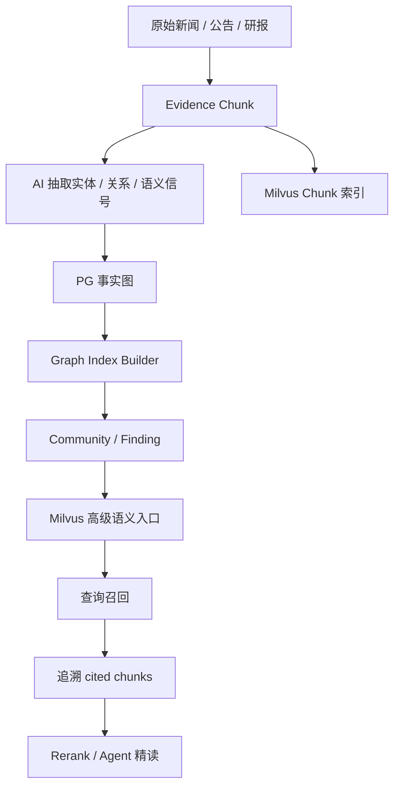
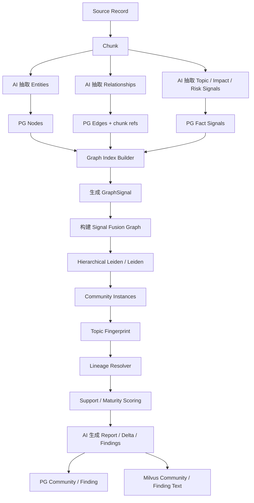
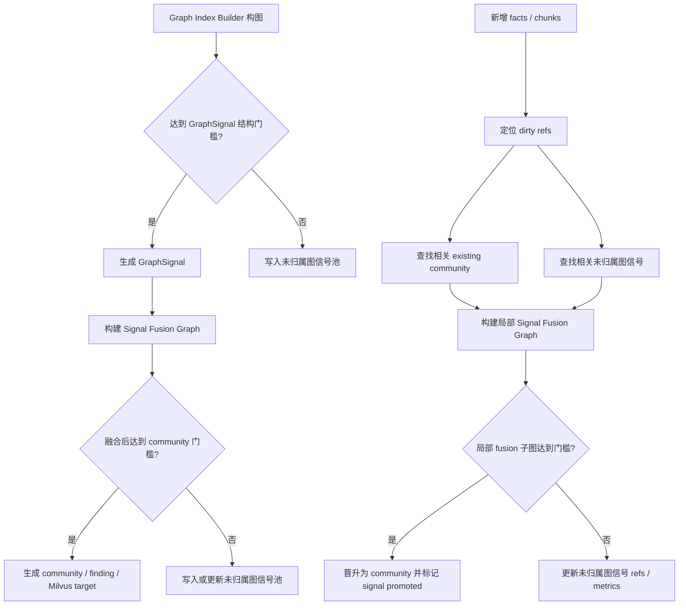
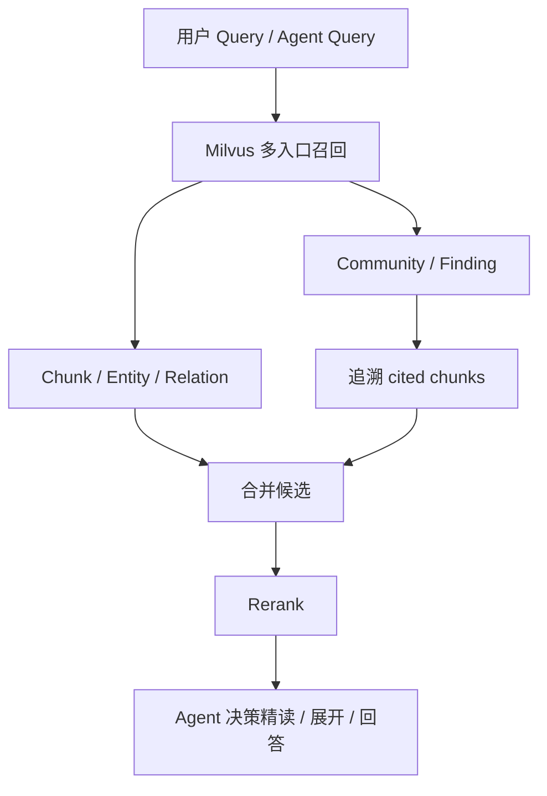

# Graph Index 社区化重构设计方案

## 1. 本文定位

本文定义 Graph Index 中 `community` 的最终产品形态和设计边界。

它回答几个已经明确下来的问题：

1. Community 不是新闻分类，也不是单条新闻摘要。
2. 一条新闻可以同时支撑多个 community，因此不能做 record-level community assignment。
3. 所有写入知识图谱的 facts / edges / chunks 都应该进入 community 组织结构，但不能把低支撑 community 伪装成成熟主题。
4. GraphRAG 的价值在于“前置抽取关系图 + 图算法发现社区 + AI 总结社区”，这套思想应该复用。
5. AI 应该在前置阶段抽取高质量实体、关系和语义信号，在后置阶段生成 report / finding，不应该承担在线社区挂靠。

本文是设计侧文档，只描述系统应该长什么样、为什么这样设计、最终交付形态和验收口径。具体模块、代码、表结构和测试用例应放到对应实施方案中。

## 2. 背景问题

当前系统已经具备：

```text
原始新闻
  -> evidence / chunk
  -> node / edge
  -> Milvus chunk / entity / relation / community target
```

但回放暴露出一个严重问题：

```text
多条样本新闻
  -> 生成多个互不关联的 level 0 community
  -> 每个 community 基本只覆盖 1 条 evidence
  -> community 内容接近单条新闻 summary
  -> 系统无法判断它是新主题、旧主题的新证据，还是长期主题的一个局部变化
```

这说明当前 Graph Index 的问题不是“单条新闻生成 community”本身，而是：

```text
单条新闻 -> 结构化摘要 -> 独立长期 community
```

它缺少把新事实纳入长期主题容器的机制：

```text
多条 facts / edges / chunks
  -> 共享实体 / 共享关系 / 共享主题
  -> 图算法发现社区
  -> Community Lineage 承接和演化
  -> 社区级综合报告 / 增量变化
```

这种结果对认知辅助层价值很低。真正需要 community 的问题是：

```text
最近市场对 AI 算力链的主要叙事是什么？
新能源板块风险事件集中在哪些方向？
A 股并购重组市场的结构性变化有哪些？
半导体政策支持正在影响哪些产业链环节？
```

这些问题需要的是“主题下多证据、多事实、多关系的综合分析”，不是“把某条新闻重新摘要一遍”。

回放也暴露出另一个相反方向的问题：

```text
A 股并购重组政策窗口
  和
AI 芯片短缺 / 半导体供应瓶颈

因为都连接到 半导体 / 产业链 / 新质生产力 等泛化节点
  -> 被合并成同一个多 evidence community
```

这属于过度合并。根因不是某条样本特殊，而是社区构建如果只看图是否连通，就会把“语义上沾边”的事实误判为“同一个主题”。因此 Graph Index 必须区分：

```text
可召回弱连接:
  可以帮助查询发现相关线索。

可定义社区边界的强连接:
  可以作为 community 合并、分裂和成熟度判断依据。
```

泛化节点和弱 mentions 可以进入召回和上下文，但不能单独决定跨 evidence 合并。

## 3. 核心结论

最终设计收敛为：

```text
写入阶段:
  AI 抽取实体、关系、事实、语义信号和 chunk refs

Graph Index 阶段:
  从 PG 事实图拉取 edge list
  在内存中构建事实图
  从事实图 component 生成 GraphSignal
  基于 topic / impact / event_type / relation mechanism 构建 Signal Fusion Graph
  识别弱桥 / 泛化桥 / 强主题桥
  使用 GraphRAG 风格 hierarchical Leiden / Leiden 类算法发现 topic community
  生成本次 community instance
  通过 topic fingerprint 匹配或创建 community lineage
  计算 topic cohesion / support / maturity / lens scores

报告阶段:
  AI 只对已经由图算法形成并经过 lineage 归并的 community 生成 report / finding / delta summary

查询阶段:
  Milvus 召回 community / finding
  再追溯 cited chunks / evidence
```

不采用：

```text
每条消息由 AI 在线判断“属于哪个 community”
AI 管理的 seed / emerging community 半成品池
把 1 edge / 2 nodes / 1 evidence 这类弱侧信号包装成 community report
只允许跨多证据成熟主题进入 community，导致早期主题永远无法被后续晋升
```

采用：

```text
未归属图信号池:
  记录本次构图中有价值但不够资格发布成 community 的弱信号。
  它不是 community，不进入 Milvus community target，不生成 report / finding。
  它只服务 Graph Index Builder 后续局部重算和晋升判断。
```

## 4. 系统定位

Graph Index 是知识图谱认知辅助层的高级索引，不是事实层，也不是新闻摘要层。



Graph Index 的职责是回答：

```text
哪些 facts / edges / chunks 共同组成了一个主题？
这个主题由哪些 evidence 支撑？
主题内部有哪些子结构？
主题最近发生了什么变化？
一个宏观问题应该优先看哪些证据？
```

Graph Index 不应该回答：

```text
这条新闻说了什么？
这条 edge 的 source/target 是什么？
这个 chunk 的原文是什么？
```

这些由 chunk / entity / relation 检索链路处理。

## 5. Community 的正确定义

### 5.1 什么不是 Community

以下对象不应该成为 community：

```text
把单条新闻摘要伪装成成熟长期主题
把单个 evidence 下的 node / edge 集合直接当作稳定主题结论
把单个事件节点向外发散的一组 mentions 当作高置信社区边界
为了展示效果而强行拆出的 L1 / L2 子主题
AI 在线判断出来的“这条新闻属于某主题”
```

这些对象可以作为 community 的支撑材料：

```text
Evidence Chunk
Entity Card
Relation Card
Event Card
Fact / Edge refs
Topic / impact / risk signals
```

但它们本身不是 community。

### 5.2 什么是 Community

Community 是由图结构发现出来的主题聚合对象。

它的输入不是 record-level 新闻分类，而是一组可追溯事实：

```text
nodes
edges
relationship descriptions
relationship weights
topic / impact / risk signals
chunk refs
evidence refs
```

它的输出是：

```text
community title
community summary
findings
member nodes
member edges
cited chunks
cited evidence
community level
parent / child community refs
lineage id
maturity level
support metrics
```

Community 不能直接从单条 evidence 发布。单条 evidence 内形成的结构化主题线索应先成为 GraphSignal；系统不能因为早期主题只有单条证据就丢弃它，也不能把它包装成 community report。

因此需要区分两类对象：

```text
可发布 community:
  已经由多个 GraphSignal 融合形成足够的跨证据主题结构，可以生成 community report / finding，并进入 Milvus community 入口。

未归属图信号:
  当前只有单证据或弱结构，例如 1 edge / 2 nodes / 1 evidence，或尚未找到可融合 GraphSignal。
  它保留 node / edge / chunk / evidence refs，等待后续新增事实让局部子图达到 community 门槛。
```

因此 community 需要区分：

```text
community instance:
  本次构建得到的社区快照。

community lineage:
  长期主题容器，承接多个历史 instance，负责表达主题的持续演化。
```

低支撑但已经跨 GraphSignal 融合的 community 可以被检索，但它的 `maturity_level`、`support_score`、`evidence_count`、`source_count` 必须进入排序、解释和 Agent 决策，避免单新闻摘要污染宏观结论。

结构不足的弱信号不能被检索为 community。它仍然通过 chunk / entity / relation 基础入口可检索，并通过未归属图信号池参与后续 Graph Index 重算。

### 5.3 Community 与新闻不是一对一

一条新闻可以同时支撑多个 community。

例如一条新闻同时包含：

```text
并购重组政策窗口打开
半导体产业链整合加速
券商投行业务角色变化
高估值并购仍有监管风险
```

它应该被拆成多个事实和关系：

```text
fact 1: 政策窗口 -> 并购重组市场
fact 2: 并购重组 -> 半导体产业链整合
fact 3: 券商 -> 价值合伙人角色
fact 4: 高估值并购 -> 监管风险
```

这些 facts / edges 可以分别支撑多个 community：

```text
community: A 股并购重组政策窗口
community: 半导体产业链整合
community: 券商投行业务转型
community: 并购重组估值与商誉风险
```

因此系统不做：

```text
news -> 单一 community 分类
```

而是做：

```text
fact / edge / chunk -> community support refs
community instance -> community lineage
```

这是 many-to-many 关系。

## 6. 目标系统形态

目标 Graph Index 是 `前置语义信号 + GraphSignal 融合 + 事实图算法聚类 + AI 社区总结` 的高级索引体系。



关键设计：

1. 写入阶段不创建 community。
2. 写入阶段只抽取可聚合的事实、关系和语义信号。
3. Community instance 由 Graph Index Builder 先构造 GraphSignal，再通过 Signal Fusion Graph 跨 evidence 聚合生成。
4. AI 不判断整条新闻属于哪个 community。
5. Lineage Resolver 用 topic fingerprint 把本次 instance 匹配到长期主题容器，匹配不上时创建新的 lineage。
6. AI 只在 community instance / lineage 已经由图算法和确定性归并形成后做总结和命名。
7. 每个 community 都必须携带 support / maturity 指标，正式 community 默认应覆盖多个 GraphSignal / evidence。
8. 单条 evidence 内的结构化结果先是 GraphSignal，不是 community；未能融合成正式 community 的信号进入未归属图信号池。
9. 未形成强关系的基础数据仍可通过 chunk / entity / relation 检索，并在后续新增相关事实时参与局部晋升。
10. 查询命中 community / finding 后必须追溯到 cited chunks。

## 7. 前置 AI 抽取应该承担什么

GraphRAG 的社区算法效果依赖前置关系图质量。我们的写入阶段必须让 AI 把事实做实，而不是只生成大量 `mentions`。

前置阶段是整个 Graph Index 的质量上限。它越能把事实、关系、影响对象和语义标签抽完整，后续 community 阶段就越不需要再调用 AI 做“归类判断”。后置阶段的负担应该尽量收敛为：

```text
基于已聚合事实做 summary
基于新增事实做增量 summary
基于 cited chunks 生成 finding
```

而不是：

```text
重新理解每条新闻
重新判断事实属于哪个主题
重新给 community 做语义归类
```

前置 AI 应输出：

```text
entities:
  name
  type
  aliases
  evidence_span_refs

relationships:
  source_entity
  target_entity
  relationship_type
  relationship_description
  relationship_strength
  direction
  polarity
  confidence
  evidence_span_refs
  chunk_refs

fact_signals:
  topic_tags
  topic_phrases
  impact_tags
  risk_tags
  narrative_tags
  policy_tags
  asset_tags
  industry_tags
  event_type_tags
  time_scope
  sentiment / polarity
  affected_entities
  affected_assets
  affected_industries
  affected_regions
  affected_chain_segments
  catalyst_type
  risk_type
  impact_direction
  impact_mechanism
  support_role
  boundary_strength
  novelty_signal
  recurrence_signal
```

这里的 tags / signals 不是 community_id，而是帮助后续图聚合的语义信号。

例如：

```text
chunk:
  半导体、生物医药、高端装备制造和汽车零部件等行业成为产业并购的重要方向

relationship:
  并购重组政策窗口 -> 半导体
  description: 政策窗口推动半导体产业并购和产业链整合
  strength: 0.82

signals:
  topic_tags: [并购重组, 产业链整合, 半导体]
  impact_tags: [政策驱动, 产业整合]
  event_type_tags: [政策窗口, 产业并购]
  industry_tags: [半导体]
  affected_chain_segments: [产业并购, 供应链补短板]
  impact_direction: positive
  impact_mechanism: 政策窗口推动上市公司围绕产业链补短板和强链条开展并购
  support_role: core
  boundary_strength: strong
  risk_tags: []
```

Community 阶段不再重新判断这条新闻属于哪里，而是消费这些 facts / edges / signals。

### 7.1 前置信号的设计原则

前置信号应该满足三个目标：

1. **可聚合**：不同新闻中语义相近的 facts 能被同一组 tags / anchors / relation phrases 连接起来。
2. **可追溯**：每个 signal 都必须能追溯到 chunk / evidence span，不能变成模型自由总结。
3. **可计算**：Graph Index Builder 能直接用这些 signal 计算边权重、候选主题和 lens scores。

因此前置阶段不能只输出自然语言摘要，而要输出结构化字段。

例如：

```text
topic_phrases:
  - A股并购重组政策窗口
  - 半导体产业链整合

impact_mechanism:
  政策鼓励上市公司围绕主业开展产业并购，推动供应链补短板和强链条。

affected_targets:
  industries: [半导体, 高端装备制造]
  assets: [上市公司股权, 研发平台, 制造产能]

risk_factors:
  - 商誉减值
  - 整合不及预期
  - 高估值并购
```

这些字段不等于 community，但它们决定后续 community 是否能聚合准确。

### 7.2 社区边界相关信号

为了避免“都提到半导体所以合并”的过度合并，前置抽取阶段必须尽量输出能帮助社区边界判断的信号。

这些信号不是分类标签，也不是 community_id，而是后续图算法可消费的判断依据：

```text
event_type_tags:
  政策窗口 / 供应链短缺 / 产业并购 / 监管约束 / 业绩兑现 / 产能扩张

support_role:
  core       当前事实是主题核心证据
  context    当前事实只是背景上下文
  mention    当前事实只是提及对象

boundary_strength:
  strong     可以作为社区合并边界
  medium     可作为辅助连接
  weak       只能帮助召回，不能单独决定合并

relation_strength:
  关系强度分数，表达 source 和 target 的业务相关性强弱
```

例如：

```text
A股并购重组政策推动半导体产业链整合
  topic_tags: [并购重组政策窗口, 产业链整合]
  event_type_tags: [政策窗口, 产业并购]
  impact_tags: [政策驱动, 供应链补短板]
  support_role: core
  boundary_strength: strong

特斯拉担心 AI 芯片供应不足
  topic_tags: [AI芯片供应短缺, AI算力链]
  event_type_tags: [供应链短缺, 产能约束]
  impact_tags: [供给约束, 自建产能]
  support_role: core
  boundary_strength: strong

两者都出现 半导体
  这只是 shared domain，不足以把两个事实合并成一个 community。
```

因此，Graph Index Builder 应把 `半导体` 这类共享行业节点视为召回线索，而不是默认强桥。只有当 topic / event_type / impact / relation mechanism 同时兼容时，跨 evidence 合并才成立。

### 7.3 后置 AI 不做归类，Graph Index Builder 仍做聚类

后置阶段需要拆成两层：

```text
后置算法阶段:
  Graph Index Builder 根据 facts / edges / signals 运行图算法聚类，形成 community candidate。

后置 AI 阶段:
  AI 对已经形成的 community candidate 做 report / finding / summary。
```

因此，“后置阶段不做归类”准确含义是：

```text
后置 AI 不做主题归类。
Graph Index Builder 仍然负责 community discovery / clustering。
```

后置 AI 不应该再问：

```text
这条新闻属于哪个 community？
这个事实应该挂到哪个主题？
这个 topic 是否应该新建？
```

这些问题应该被前置抽取的结构化信号和图算法共同解决。

后置 AI 的输入应该已经是“归纳好的事实集合”，例如：

```text
community candidate:
  member_entities
  member_relationships
  shared_topic_tags
  shared_impact_tags
  shared_risk_tags
  cited_chunks
  cited_evidence
  previous_report if exists
  new_facts_since_last_report if incremental
```

后置 AI 的输出是：

```text
title
summary
findings
delta_summary
evidence-backed claims
```

### 7.4 GraphSignal：单 evidence 内的主题线索

前置抽取产生的 facts / edges / signals 不能直接写成 community。Graph Index Builder 应先把单条 evidence 或局部 chunk 内形成的结构化主题线索归纳为 `GraphSignal`。

GraphSignal 的定位是：

```text
GraphSignal:
  单条或局部 evidence 内的可聚合主题线索。
  它不是 community。
  它可以被 chunk / entity / relation 检索间接命中。
  它只有在和其他 signal 融合后，才可能形成正式 community。
```

GraphSignal 应保存的核心信息是：

```text
signal_id
evidence_ids
chunk_ids
node_ids
edge_ids
topic_tags
event_type_tags
impact_tags
risk_tags
narrative_tags
core_entities
relation_types
boundary_strength
support_role
support_score
fingerprint_text
```

例如：

```text
GraphSignal A:
  title: 特斯拉预计 AI 芯片短缺并启动 Terafab
  topic_tags: [AI芯片供应短缺, AI算力链, 自建产能]
  event_type_tags: [供应链短缺, 产能扩张]
  impact_tags: [供给约束, 供应链安全]
  core_entities: [特斯拉, AI芯片, Terafab]

GraphSignal B:
  title: 华勤技术港股上市并布局 AI 算力
  topic_tags: [AI算力链, 数据中心业务, AI硬件]
  event_type_tags: [上市融资, 产能扩张]
  impact_tags: [产业链扩张, 算力基础设施]
  core_entities: [华勤技术, AI算力, 数据中心]
```

这两个对象不能各自成为 community；它们应先进入 Signal Fusion Graph。如果多个 signal 在 topic / event_type / impact / relation mechanism 上足够接近，才形成 `AI 算力链供给与产能扩张` 之类的主题 community。

## 8. Graph Index 构建策略

### 8.1 构图输入

Graph Index Builder 的输入来自 PG：

```text
kg_nodes
kg_edges
kg_edge_evidence_refs
kg_edge_evidence_chunks
fact signals / relation properties
```

构建时必须区分两类图：

```text
事实图:
  node / edge / chunk refs 形成的基础事实结构。

Signal Fusion Graph:
  GraphSignal 作为节点，signal 之间的主题相似性作为边。
```

正式 community 不应该直接由事实图 connected component 生成。事实图 component 只负责产出 GraphSignal；跨 evidence 的主题边界由 Signal Fusion Graph 决定。

构图时应优先使用强关系：

```text
affects
benefits_from
risks
drives
constrains
related_to with high strength
```

`mentions` 可以作为弱边，但不能主导 community 划分。

构图时还必须识别弱桥和强主题桥：

```text
弱桥:
  mentions
  只共享泛化行业 / 泛化概念
  support_role=mention/context
  boundary_strength=weak
  没有共同 topic_tags / event_type_tags / impact_tags

强主题桥:
  affects / benefits_from / risk / drives / constrains 等强关系
  support_role=core
  boundary_strength=strong 或 medium
  topic_tags / event_type_tags / impact_tags 有明显交集
  relationship_description 指向同一业务机制
```

弱桥可以保留在 Graph Index 的成员关系和检索文本中，但不能让两个 evidence 因为“沾边”就进入同一个成熟 community。

### 8.2 图边权重

边权重不应该由单一规则拍脑袋决定，而应该综合：

```text
relationship_strength
edge confidence
boundary_strength
support_role
topic_tags / event_type_tags / impact_tags 兼容度
supporting evidence count
supporting chunk count
source diversity
relationship type importance
generic bridge penalty
recency if building rolling view
```

这些权重用于图算法，不用于直接生成结论。最终 report 必须引用真实 chunks。

跨 evidence 合并还必须计算 `topic_cohesion_score`：

```text
topic_cohesion_score:
  不同 evidence 之间的 topic_tags 交集
  event_type_tags 交集
  impact_tags / risk_tags / narrative_tags 交集
  强关系类型是否一致或兼容
  是否只依赖泛化节点连接
  关系描述是否指向同一业务机制
```

如果一个 community 覆盖多条 evidence，但它们之间只有泛化节点连接，没有共同主题信号，则应拆成多个 community instance，或者降级为低成熟并列线索，不能标为 `stable_multi_source_topic`。

### 8.3 Signal Fusion Graph

Signal Fusion Graph 是本次重构的关键缺口。

当前代码虽然已经抽取 `topic_tags / impact_tags / risk_tags / event_type_tags`，也计算 `topic_fingerprint`，但这些信号主要用于 community 生成后的 metrics 和 lineage matching，没有用于 community 生成前的跨 evidence 聚合。结果就是：

```text
30 条 evidence
  -> 30 个事实图 connected component
  -> 30 个 single_source_signal community
```

目标流程必须改为：

```text
事实图 connected component
  -> GraphSignal
  -> GraphSignal 之间构建 fusion edge
  -> Signal Fusion Graph 聚类
  -> Topic Community
```

Signal 之间是否连边，应该由可解释字段共同决定：

```text
topic_tags overlap
event_type_tags overlap
impact_tags overlap
risk_tags overlap
narrative_tags overlap
core_entities overlap
relation_types overlap
shared canonical nodes
fingerprint text embedding similarity
generic anchor penalty
```

其中 embedding 只能作为候选召回和相似度参考，不能单独决定合并。两个 signal 仅因为都提到 `半导体 / 政策 / 市场 / 风险 / 产业链` 这类泛化词，不应该连成强 fusion edge。

示例：

```text
可以融合:
  特斯拉 AI 芯片短缺
  华勤技术 AI 算力布局
  算力硬件股回暖

共同依据:
  topic_tags: AI算力链 / AI芯片供应 / 算力硬件
  event_type_tags: 供应链短缺 / 产能扩张 / 算力需求
  impact_tags: 供给约束 / 产业链扩张 / 算力基础设施

不应仅凭共享泛化词融合:
  A股并购重组半导体产业整合
  特斯拉 AI 芯片短缺

原因:
  两者都涉及半导体，但一个是并购重组政策窗口，一个是 AI 芯片供应瓶颈，业务机制不同。
```

Signal Fusion Graph 的边权应反映“能否共同定义主题边界”，而不是“是否语义相关”。语义相关可以帮助召回，但不一定能成为 community 边界。

### 8.4 社区发现

第一版采用 GraphRAG 风格：

```text
GraphSignal
  -> build fusion edge list
  -> filter weak / generic fusion edge
  -> build edge list
  -> hierarchical Leiden / Leiden
  -> signal -> community mapping
  -> parent / child community mapping
```

这解决的是：

```text
哪些 GraphSignal 在结构和语义信号上形成了主题团
哪些主题是更宏观的 L0
哪些主题可以拆成 L1 / L2
```

事实图中的 node / edge 仍然重要，但它们的职责变为支撑 GraphSignal 和 community 的可追溯证据，而不是直接决定 community 边界。

### 8.5 Community Lineage、支撑度与成熟度

Graph Index 不能再把单 evidence 内结构较强的 component 直接发布成 community。单 evidence 内结果首先是 GraphSignal；正式 community 必须由 Signal Fusion Graph 聚类形成。

每个 community instance 生成后，必须计算 topic fingerprint：

```text
core_entities
core_topic_tags
core_relation_types
impact_tags
risk_tags
industry_tags
policy_tags
top_edge_descriptions
representative_chunk_ids
representative_evidence_ids
```

Lineage Resolver 使用 fingerprint 判断：

```text
匹配已有 lineage:
  更新该长期主题容器，追加 refs / delta / findings。

无法匹配:
  创建新的 lineage，作为新主题容器的起点。
```

一条 evidence / chunk 可以支撑多个 community lineage，因为它可能同时包含多个事实和主题线索。

社区质量不只用“是否生成”表达，还要用 maturity 表达：

```text
maturity_level:
  growing_topic              多 fact / 多 chunk 增强中的主题
  stable_multi_source_topic  多 source / 多 evidence 稳定主题
  mature_theme               长期稳定主题

support metrics:
  evidence_count
  source_count
  chunk_count
  edge_count
  non_mentions_edge_count
  strong_edge_count
  topic_cohesion_score
  generic_bridge_count
  weak_bridge_count
  support_score
  lineage_age
  last_updated_at
```

`single_source_signal` 不再是正式 community 的 maturity level。它是 GraphSignal / unassigned signal 的状态，不应进入 `kg_graph_communities` 和 Milvus community target。

这些指标用于：

```text
Milvus community 排序
Agent 判断该主题是线索还是成熟认知入口
是否生成完整 report
是否只生成 delta finding
是否触发 full report rewrite
```

正式 community 的第一版发布门槛建议为：

```text
必须满足:
  signal_count >= 2
  evidence_count >= 2
  chunk_count >= 2
  topic_cohesion_score 达到最低阈值
  至少有两类支撑同时成立:
    shared topic/event_type/impact/risk/narrative signal
    shared canonical node 或 core entity
    compatible strong relation type
    compatible impact mechanism

不能满足:
  只由单 evidence 形成
  只由 mentions 或泛化节点连接
  只靠 embedding 相似但无结构化信号支撑
```

单 evidence 但结构足够的对象可以作为 GraphSignal 保留，用于后续融合；不能直接进入 Milvus community target。

结构不足的弱信号不生成 community。典型例子：

```text
工信部十五五规划 -> 新能源
  edge_count=1
  node_count=2
  evidence_count=1
  chunk_count=1

处理结果:
  不写入 kg_graph_communities
  不生成 report / finding
  写入未归属图信号池
  后续如果新增多条相关政策、产业影响或风险证据，再参与局部重算并晋升为 community
```

### 8.6 社区报告生成

AI 只对已经完成 lineage 归并和 maturity scoring 的 community 生成：

```text
community title
summary
findings
risk / impact / narrative interpretation
rating / confidence
cited chunk ids
```

报告策略需要分层：

```text
growing_topic:
  生成可检索 report，并突出新增证据和待验证方向。

stable_multi_source_topic / mature_theme:
  生成完整 community report 和 findings。
```

单源 GraphSignal 不生成 community report。它可以进入未归属图信号池，也可以在后续与其他 signal 融合后成为正式 community 的支撑证据。

AI 输入应是已经聚合好的上下文：

```text
member entities
member relationships
relationship descriptions
supporting chunks
source / evidence list
optional child community summaries
lineage history / previous report
maturity metrics
```

AI 不做：

```text
判断单条新闻归属
从全库自由寻找社区
给没有 chunk 支撑的结论背书
```

### 8.7 未归属图信号池与晋升机制

未归属图信号池解决一个关键问题：

```text
第一次写入:
  某条事实或 GraphSignal 有价值，但还不足以构成 community。

第二次 / 第三次写入:
  新 GraphSignal 与它共享 node / edge / chunk / topic fingerprint。
  Signal Fusion Graph 局部子图达到 community 门槛。

系统应该:
  把旧 signal 和新 signal 一起重算，晋升为正式 community。
```

它不是一个对外检索层，也不是 seed community。它只保存 Graph Index Builder 后续需要的最小状态：

```text
signal_id
projection
title
reason
node_ids
edge_ids
evidence_ids
chunk_ids
topic_tags / impact_tags / event_type_tags
relation_types
support_score
status
promoted_community_id
```

处理流程：



晋升触发不是 AI 判断，而是确定性的局部重算：

```text
触发来源:
  新增/变更 node_ids
  新增/变更 edge_ids
  新增/变更 evidence_ids
  新增/变更 chunk_ids

局部重算 seed:
  dirty refs
  affected existing communities
  related unassigned graph signals

晋升条件:
  达到 Signal Fusion Graph community 门槛
  达到跨 evidence / 多 chunk / 强关系组合门槛
  且不是只依赖泛化节点或 mentions 的弱连接
```

查询侧不直接暴露未归属图信号。用户仍可通过基础检索命中其 chunk / entity / relation；只有晋升为正式 community 后，它才成为高级语义入口。

## 9. 增量构建原则

Community 不进入实时写入链路，但所有写入后的事实都应该在 Graph Index 构建阶段获得组织位置：要么成为正式 community 的支撑材料，要么进入未归属图信号池等待后续晋升。

写入链路实时完成：

```text
chunk
node
edge
refs
signals
Milvus chunk/entity/relation upsert
```

Graph Index 可以异步或手动触发：

```text
从新增/变更 edges 找 affected anchors
拉取相关子图
生成或更新 GraphSignal
构建局部 Signal Fusion Graph
运行社区发现
生成 community instance
通过 topic fingerprint 归并到 lineage
更新 community / finding / delta
写回 PG + Milvus
```

当新增事实没有命中任何 existing community 时，不能无差别 full rebuild，也不能直接生成孤立 community。正确流程是：

```text
dirty refs
  -> 查询相关未归属图信号
  -> dirty refs + unassigned refs 生成局部 GraphSignal 集合
  -> 构建局部 Signal Fusion Graph
  -> 局部运行社区发现
  -> 达标则晋升为 community
  -> 不达标则更新未归属图信号池
```

增量构建的重点不是“让 AI 做增量归类”，而是“Graph Index Builder 做增量聚类判断，AI 做增量总结”。

因为前置阶段已经生成了足够的 signals，Graph Index Builder 可以通过结构化字段判断哪些 GraphSignal 和 community candidate 受到影响。后置 AI 不需要重新理解全量新闻，只需要处理：

```text
previous community report
community lineage history
new facts since last build
changed relationships
new cited chunks
new / changed findings
maturity change
```

然后输出：

```text
delta_summary: 这次新增事实带来了什么变化
updated_findings: 新增或修正的结论
refresh_decision: 是否需要重写主 summary
```

建议第一版采用两级更新：

```text
轻量更新:
  只追加 delta finding / recent change summary
  不重写 community 主 summary

重写更新:
  当新增事实改变主题核心判断、风险方向或主要影响对象时，才重写主 summary
```

这样可以避免每次新增数据都触发完整 report 重写。

第一版不必实现复杂的在线 merge 状态机。更重要的是：

1. 新数据不会丢，因为基础检索层实时可用，Graph Index 构建后会先进入 GraphSignal 或正式 community lineage。
2. Community 可以滞后构建，因为它是高级聚合索引。
3. Community 构建失败不影响 chunk/entity/relation 检索。
4. 重建范围可以先按时间窗口、source batch 或 affected anchors 控制。
5. 后置 Graph Index Builder 负责 GraphSignal 融合、聚类和 lineage 归并，后置 AI 负责 summary / delta summary，不负责主题归类。

## 10. 查询消费链路



Community / Finding 是高级入口，不是最终证据。

最终进入 rerank 和 Agent 精读的仍然必须是：

```text
chunk text
evidence
可读 relation context
community cited chunks
```

## 11. Lens 的定位

`market_narrative / industry_chain / policy_impact / risk_event` 不决定社区边界。

它们是分析视角：

```text
market_narrative: 市场叙事、资金关注主线、共识增强或减弱
industry_chain: 行业链、上下游、板块联动、供需传导
policy_impact: 政策、监管、制度变化的影响链条
risk_event: 风险事件、负面冲击、短期扰动和风险聚集
```

同一个 community 可以同时具有多个 lens 分数：

```text
community: A 股并购重组政策窗口下的产业整合
scores:
  market_narrative: 0.82
  industry_chain: 0.76
  policy_impact: 0.91
  risk_event: 0.28
```

Lens 用于：

```text
查询召回排序
Agent 判断适用场景
report / finding 组织视角
结果解释
```

不能把 lens 当成固定社区分类。

## 12. 样本与验证要求

为了验证 Graph Index 是否真的有用，测试样本不能只是一组互不相关的新闻。

应该构造多组真实场景：

```text
AI 算力链组：3-4 条
并购重组 / 产业整合组：3-4 条
新能源风险 / 出海组：3-4 条
政策影响组：3-4 条
```

每组内部必须存在可聚合结构：

```text
共享实体
共享概念
共享行业
共享政策
共享强关系
共享或相近事件链条
多条 cited chunks
```

否则无法验证社区发现、层级划分和 report 聚合能力。

## 13. 验收口径

### 13.1 必须满足

1. 写入阶段不创建 community，只抽取 facts / edges / signals / refs。
2. 一条 news / evidence 可以通过不同 facts / edges 支撑多个 community lineage。
3. Community instance 由 GraphSignal Fusion Graph 聚类发现，不由 AI 在线挂靠新闻。
4. 每个 community 必须有 lineage、topic fingerprint、support metrics 和 maturity level。
5. 单 evidence 内的结构化结果是 GraphSignal，不是正式 community；正式 community 默认必须覆盖多个 GraphSignal / evidence。
6. `mentions` 不能主导成熟度判断，成熟 community 必须有强关系或足够多证据支撑。
7. AI 只在 community instance / lineage 已经形成后生成 report / finding / delta summary。
8. Finding 必须引用真实 chunk。
9. 查询命中 community / finding 后能追溯到 cited chunks。
10. 前置 AI 必须输出足够丰富的 topic / impact / risk / narrative / target signals，不能只输出摘要和 mentions。
11. 后置 AI 不能承担主题归类职责；后置 Graph Index Builder 负责 GraphSignal 融合、聚类和 lineage 归并，AI 只能基于 community 做 summary / finding / delta summary。
12. 增量更新应优先生成 delta summary，只有核心判断变化、maturity 升级或新增事实显著改变主题结构时才重写 community 主 summary。
13. 查询排序必须能区分 growing_topic、stable_multi_source_topic 和 mature_theme；single_source_signal 不作为 community target 返回。
14. 跨 evidence community 必须有 topic_cohesion 依据，不能只因为共享泛化行业、泛化概念或 mentions 就合并。
15. 抽取阶段必须给关系和 fact_signals 输出 boundary_strength / support_role / event_type_tags 等可计算字段；如果字段缺失，Graph Index Builder 必须保守处理为弱边界，而不是默认强桥。
16. 结构不足的弱信号必须写入未归属图信号池，后续相关 dirty refs 到来时必须参与局部重算。
17. 未归属图信号不能进入 Milvus community target，也不能生成 community report / finding。
18. 当未归属图信号被晋升为 community 后，必须标记 promoted，避免后续重复参与构建。
19. 30 条真实样本不应生成 30 条正式 community；正式 community 数量应明显小于 evidence 数量，并且至少部分 community 覆盖多个 evidence / chunk。

### 13.2 不能接受

1. AI 判断整条新闻属于哪个 community。
2. 引入 AI 管理的 seed / emerging community 半成品池。
3. 把 `market_narrative / industry_chain / policy_impact / risk_event` 当成固定社区分类。
4. L1 / L2 只是单新闻内强行拆分出的子段落。
5. 单证据结果直接进入 `kg_graph_communities`，导致 30 条新闻生成 30 条 community。
6. Community Report 内容和新闻 summary 基本一致，且没有说明它只是早期线索。
7. 没有 cited chunks 的高级结论进入查询主链路。
8. 只靠大量 `mentions` 聚出看似成熟的社区。
9. 前置抽取过薄，导致后置阶段重新用 AI 判断主题归属。
10. 每次新增事实都无差别重写完整 community report。
11. 新事实每次都创建孤立 lineage，导致长期主题无法持续演化。
12. 两条 evidence 只因为共享 `半导体 / 政策 / 产业链 / 市场 / 风险` 等泛化节点就被合并为稳定 community。
13. 把 1 edge / 2 nodes / 1 evidence 这类弱侧信号写成 community report。
14. 新增事实没有命中 existing community 时直接 full rebuild，而不复用未归属图信号池做局部晋升判断。
15. topic_fingerprint 只用于 community 生成后的 lineage，而不参与 community 生成前的 Signal Fusion。

## 14. 最终判断

Graph Index 的价值不在于“把每条新闻摘要成一个社区”，而在于把所有事实纳入可演化的主题容器，并从持续积累的事实图中形成可追溯的认知入口。

最终职责边界必须固定：

```text
前置 AI 抽取:
  负责把原文中的实体、关系、事实、topic / impact / risk / narrative signals 和 chunk refs 抽清楚。

PG:
  负责保存事实图 source of truth。

Milvus:
  负责保存 chunk/card/report 可读文本，提供语义召回和按 ID 取回。

Graph Index Builder:
  负责从 PG 拉取 edge list，先生成 GraphSignal，再构建 Signal Fusion Graph，运行 GraphRAG 风格社区算法，生成 community instance，并通过 topic fingerprint 归并到 lineage。

后置 AI 总结:
  负责给已经形成的 community candidate 生成 report / finding / delta summary。
```

这套方案的关键是把复杂度前移到事实抽取阶段，并把长期主题稳定性交给 Signal Fusion 和 lineage resolver：前置 AI 尽量把指标、标签、影响对象和关系机制抽全；Graph Index Builder 基于这些结构化信号先形成 GraphSignal，再用 Signal Fusion Graph 做跨 evidence 聚合；Lineage Resolver 判断本次 instance 是旧主题延续还是新主题起点；后置 AI 只做总结和增量总结。

单证据但结构足够的对象只能作为 GraphSignal 进入 Graph Index，不应直接成为正式 community。只有当多个 GraphSignal 通过 topic / event_type / impact / relation mechanism 等结构化依据融合成稳定主题后，它才会被晋升为正式高级语义入口；只有当 support / maturity 达到更高等级时，它才应该被当成成熟主题认知入口。
