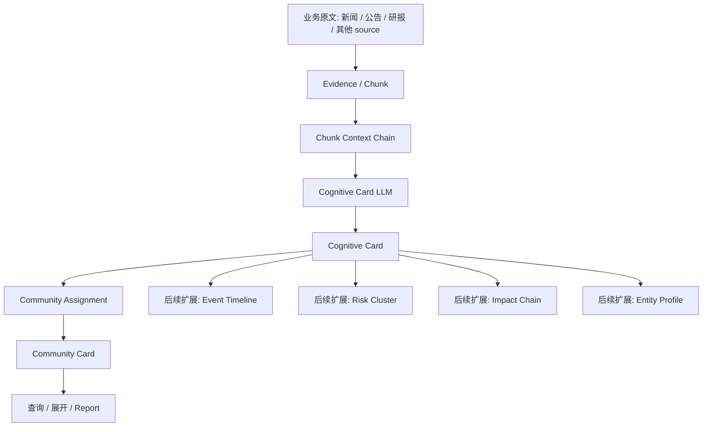

# Cognitive Card 与 Community Card 高维信号提取验证方案

## 1. 本文定位

本文只记录当前最新结论。

第一阶段的认知索引主线收敛为：

```text
原文 / chunk
  -> Cognitive Card
  -> Community Card
```

`Cognitive Card` 是最底层认知抽象层，不绑定 Community。它是后续 Community Card、Event Timeline、Risk Cluster、Impact Chain、Entity Profile 等高阶索引的共同输入。

抽取可以基于 chunk，但 chunk 不是语义边界。任何 Cognitive Card 都必须能追溯到原文 chunk，并通过 evidence/source 找回前后文。

第一阶段暂时不把 node / edge / 关系抽取纳入主线。关系抽取后续如果重新进入系统，也只能作为 Cognitive Card 的辅助上下文，而不是前置依赖。

## 2. 核心判断

当前系统是认知辅助层，核心问题不是先维护一张严格实体关系图，而是先把每个 chunk 转成可复用的局部认知特征包。

```text
Cognitive Card = 当前 chunk 可支撑的局部认知特征包
Community Card = 多条 Cognitive Card 聚合出的主题索引
```

因此第一阶段应该：

- 每个有效 chunk 都生成 Cognitive Card。
- Cognitive Card 只抽取当前 chunk 明确支撑的局部信号，不做跨 chunk 的全局结论。
- 系统为 Cognitive Card 注入 chunk / evidence / source 指针，支持上下文回溯。
- Community Card 只消费 Cognitive Card，不回到原文重新理解。
- 后续事件流、风险簇、影响链、主体画像都基于 Cognitive Card 扩展。

不是字段越多越好。Cognitive Card 要抽的是稳定、可追溯、当前 chunk 能支持的信号，不是把原文翻译成一大坨结构化字段，也不是在单个 chunk 上推断完整事件流或完整影响链。

## 3. 目标系统形态



分层职责：

| 层级 | 职责 |
|---|---|
| Chunk | 抽取单元，必须保留 evidence/source、顺序和前后文指针。 |
| Cognitive Card | chunk 级局部认知特征层，抽取当前 chunk 能支撑的主题、事件、风险、影响、主体等局部信号。 |
| Community Card | 多条 Cognitive Card 聚合后的主题索引层。 |
| 扩展索引 | 基于 Cognitive Card 构建事件流、风险簇、影响链、主体画像等。 |

## 4. Chunk 上下文链

抽取基于 chunk，但后续展示、展开和高级索引必须能回到上下文。

每个 chunk 必须保留稳定指针：

```text
chunk_id
source_id
evidence_id
chunk_index
start_offset
end_offset
previous_chunk_id
next_chunk_id
text_hash
chunker_version
```

命中某个 Cognitive Card 后，应支持：

| 展开方式 | 作用 |
|---|---|
| 邻接展开 | 根据 previous_chunk_id / next_chunk_id 补前后文。 |
| 同 evidence 展开 | 根据 evidence_id 取同一资料下的全部 chunk，并按 chunk_index 排序。 |
| 窗口展开 | 根据 chunk_index 取前后 N 个 chunk。 |
| offset 回溯 | 根据 start_offset / end_offset 回到原始 evidence 文本范围。 |

Cognitive Card 必须保存：

```text
cognitive_card_id
source_id
evidence_id
primary_chunk_id
chunk_ids
supporting_text
```

原则：

```text
chunk 是抽取单元，不是语义边界；
Cognitive Card 是认知抽象，不是原文替代；
Community Card 命中后必须能展开回 Cognitive Card，再展开回 chunk 上下文。
```

## 5. Cognitive Card 应抽取什么

Cognitive Card 必须覆盖六类底层信息，但它们不是都由 LLM 输出。

```text
LLM 输出: 当前 chunk 能明确支撑的局部语义信号。
系统注入: source / evidence / chunk / offset / 前后文指针等证据定位信息。
```

| 信号类型 | 用途 | 典型字段 |
|---|---|---|
| 主题信号 | 构建 Community Card | topic_intents、raw_theme、title_candidate、driver、impact_target |
| 事件信号 | 为 Event Timeline 提供局部线索 | event_thread、event_action、event_stage、timeline_position、event_time、trigger_event |
| 风险信号 | 为 Risk Cluster 提供局部线索 | risk_type、risk_direction、risk_scope、risk_severity、uncertainty |
| 影响信号 | 为 Impact Chain 提供局部线索 | local_impact_mentions、local_impact_target、local_impact_direction、local_impact_mechanism_text |
| 主体信号 | 构建 Entity / Asset Profile | actors、companies、industries、regions、policies、commodities |
| 证据定位 | 追溯和质量控制 | 由系统装配注入，不属于 LLM 抽取 schema。 |

第一阶段必须收集这些底层信息，但不要求立即构建完整事件流、完整风险簇、完整影响链或完整主体画像。

```text
局部信号先抽全；
证据指针由系统注入；
高阶结构后聚合；
不要回到原文重复理解。
```

### 5.1 主题信号

主题信号用于构建 Community Card。

它回答的是：

```text
这个 chunk 提供了哪些主题线索？
它属于哪个大主题？
它会影响哪些对象？
是什么因素驱动了这个主题？
```

字段说明：

| 字段 | 含义 | 质量要求 |
|---|---|---|
| topic_intents | 当前 chunk 中出现的多个主题意图。 | 可以多个；不要强行压成一个。 |
| raw_theme | 原始主题表达。 | 可以贴近原文，但不能直接照抄新闻标题。 |
| title_candidate | 适合作为 Community 标题的大词。 | 必须是可复用主题名，不应是新闻标题、公司项目名或单一交易名。 |
| driver | 当前 chunk 明确提到的主题驱动因素。 | 写政策、事件、供需、资金、技术、监管等驱动；不要跨段推断。 |
| impact_target | 当前 chunk 明确提到的影响对象。 | 写行业、资产、公司、商品、产业链环节、市场主体。 |
| importance | 当前主题意图的重要程度。 | 表示该 chunk 对这个主题的价值，不是模型置信度。 |

质量要求：

```text
如果一个 chunk 中存在多个变化方向、多个影响对象、编号段落或明显并列机制，
必须拆成多个 topic_intents，不能压成一个总主题。

summary / topic_intent.summary / local_impact_mentions
必须面向业务事实表达，不能出现“当前 chunk 描述”“本段提到”等实现视角词。
```

### 5.2 事件信号

事件信号用于后续构建 Event Timeline。

它回答的是：

```text
这个 chunk 暗示它可能属于哪条事件线？
当前 chunk 描述的是事件中的什么动作？
它能否提供触发、发酵、回应、升级或结果的局部线索？
```

字段说明：

| 字段 | 含义 | 质量要求 |
|---|---|---|
| event_thread | 可能复用的事件线名称。 | 应是能串联多条新闻的大词，例如“特朗普关税政策”“新能源海外产能布局”；低置信可以保守输出。 |
| event_action | 当前 chunk 描述的动作。 | 例如发布、回应、制裁、扩产、并购、融资、交付、调查。 |
| event_stage | 当前 chunk 能支撑的事件阶段判断。 | 例如 emerging、active、escalating、cooling、resolved；证据不足时不要强判。 |
| timeline_position | 当前 chunk 在线索中的位置。 | 例如 trigger、follow_up、reaction、escalation、outcome；后续由 Event Timeline Builder 聚合修正。 |
| event_time | 当前 chunk 明确提到的事件时间。 | 用于排序；不参与 Community Assignment。 |
| trigger_event | 当前 chunk 明确说明的触发事件。 | 没有明确触发原因时留空，不跨 chunk 推断。 |

### 5.3 风险信号

风险信号用于后续构建 Risk Cluster。

它回答的是：

```text
这个 chunk 暴露了什么局部风险线索？
风险影响范围在哪里？
风险是在增强、缓和，还是尚不确定？
```

字段说明：

| 字段 | 含义 | 质量要求 |
|---|---|---|
| risk_type | 当前 chunk 提到的风险类型。 | 例如政策风险、地缘风险、流动性风险、估值风险、业绩风险、整合风险。 |
| risk_direction | 当前 chunk 能支撑的风险方向。 | 例如 increasing、decreasing、neutral、uncertain。 |
| risk_scope | 当前 chunk 提到的风险影响范围。 | 例如单公司、行业、产业链、区域、市场整体。 |
| risk_severity | 当前 chunk 能支撑的风险强度。 | 用低/中/高或 0-1 表达；证据不足时保守。 |
| uncertainty | 当前 chunk 明确提到的不确定性来源。 | 例如落地节奏不明、数据不足、政策细则未出、需求变化。 |

### 5.4 影响信号

影响信号用于后续构建 Impact Chain，但 Cognitive Card 阶段只抽取局部影响线索。

它回答的是：

```text
当前 chunk 明确提到了什么影响？
被影响对象是谁？
影响方向是否明确？
原文是否给出了局部影响机制短句？
```

字段说明：

| 字段 | 含义 | 质量要求 |
|---|---|---|
| local_impact_mentions | 当前 chunk 中明确出现的影响描述。 | 保留局部线索，不改写成完整影响链。 |
| local_impact_target | 当前 chunk 明确提到的影响对象。 | 可以是行业、资产、公司、商品、产业链环节或主体。 |
| local_impact_direction | 当前 chunk 能支撑的影响方向。 | positive、negative、mixed、neutral、uncertain；不能跨 chunk 推断。 |
| local_impact_mechanism_text | 原文中的局部影响机制短句。 | 例如“政策支持强化估值重估”“供应受限推高成本”；必须来自当前 chunk。 |

质量要求：

```text
如果 topic_intent 已经明确给出 impact_target 和 impact_direction，
应尽量输出 local_impact_signals。

如果 LLM 漏掉 local_impact_signals，
系统可以基于已抽取的 impact_target / impact_direction / supporting_text
确定性补齐局部影响信号。
这不是新增事实，只是把同一条已抽取信号转换成 Impact Chain 可消费的字段。
```

完整影响链由后续 Impact Chain Builder 基于多个 Cognitive Card 聚合：

```text
source -> mechanism -> target -> consequence
supporting_cognitive_cards
confidence
```

### 5.5 主体信号

主体信号用于后续构建 Entity / Asset Profile。

它回答的是：

```text
当前 chunk 涉及哪些关键主体？
它们分别是什么类型？
后续能否按主体聚合画像？
```

字段说明：

| 字段 | 含义 | 质量要求 |
|---|---|---|
| actors | 当前 chunk 的参与主体。 | 保留真正参与事件的主体，不要把泛词都列进去。 |
| companies | 当前 chunk 明确出现的公司。 | 公司名、上市主体、交易对手。 |
| industries | 当前 chunk 明确出现的行业或板块。 | 行业名要稳定，不要把短语误当行业。 |
| regions | 当前 chunk 明确出现的区域。 | 国家、地区、省市、海外市场。 |
| policies | 当前 chunk 明确出现的政策或监管文件。 | 只有具体政策文件、规则、会议、监管动作才写入。 |
| commodities | 当前 chunk 明确出现的商品或资源品。 | 例如原油、黄金、铜、锂、天然气。 |

### 5.6 语义支撑字段

LLM 不输出 source_id、evidence_id、chunk_id、offset、previous_chunk_id、next_chunk_id、text_hash、chunker_version 等证据定位字段。

LLM 只输出当前 chunk 内部的语义支撑字段：

| 字段 | 含义 | 质量要求 |
|---|---|---|
| supporting_text | 当前 chunk 中支撑判断的短句。 | 应尽量短，指向关键句，不是整段复制。 |
| confidence | 模型对抽取结果的置信度。 | 表示抽取可信度，不等于主题重要性。 |
| importance | 当前 chunk 对该信号的价值。 | 表示业务重要性，不等于模型置信度。 |
| summary | 当前 chunk 的认知摘要。 | 面向后续索引消费，不是简单新闻摘要。 |

最终 Cognitive Card 由两部分组成：

```text
Cognitive Card = 系统证据指针 + LLM 局部认知信号
```

## 6. Cognitive Card 装配规则

证据定位用于追溯、质量控制和后续展开，应由系统规则注入。

它回答的是：

```text
这个 Cognitive Card 来自哪里？
关键判断由哪些 chunk 支撑？
后续命中后如何回到原文上下文？
```

系统注入字段：

| 字段 | 含义 | 质量要求 |
|---|---|---|
| source_id | 原始来源标识。 | 只作为系统追踪字段，不进入 LLM 语义判断正文。 |
| evidence_id | evidence 标识。 | 用于回表和同 evidence 上下文展开。 |
| primary_chunk_id | 当前 Cognitive Card 的主 chunk。 | 由当前抽取输入确定，不让 LLM 生成。 |
| chunk_ids | 支撑该卡片的 chunk 集合。 | 默认包含当前 chunk；跨 chunk 聚合时由系统追加。 |
| chunk_index | chunk 在 evidence 内的顺序。 | 用于窗口展开。 |
| start_offset / end_offset | chunk 在 evidence 原文中的位置。 | 用于 offset 回溯。 |
| previous_chunk_id / next_chunk_id | 前后文指针。 | 用于邻接展开。 |
| text_hash / chunker_version | chunk 稳定性和重建信息。 | 用于判断重切分、重建和缓存失效。 |

## 7. Community Card 如何使用 Cognitive Card

Community Card 只消费 Cognitive Card 中的主题信号和必要辅助信号。

```text
Cognitive Card.topic_intents
  -> candidate community recall
  -> assignment decision
  -> create / attach / update
  -> Community Card
```

Community Card 应表达：

- 主题标题：必须是大词，不是新闻标题、公司项目名或单一交易名。
- 主题概览：这条市场主线正在讲什么。
- 子主题：由多个 topic_intents 聚合而来。
- 引用来源：哪些 Cognitive Card / source / evidence / chunk 支撑它。
- 成熟度：single_evidence / multi_evidence / mature_topic。
- 近期变化：后续由 delta / report 更新。

Community summary 不能直接复用某个 `topic_intent.summary`。

原因：

```text
topic_intent.summary 是 chunk 级局部摘要；
Community summary 是主题级聚合摘要；
两者层级不同。
```

第一阶段允许用规则从 community 已挂载的 topic_intents 中聚合生成 summary：

```text
community.title
  + drivers
  + impact_targets
  + event_actions
  + risk_types
  + event_threads
  -> community.summary
```

后续如果启用 Community Report LLM，再由 report 覆盖为更完整的主题概览。

证据少不是不建索引的理由，只影响成熟度和层级细分：

```text
single_evidence: 单条证据线索
multi_evidence: 多条证据主题
mature_topic: 成熟市场主线
```

一条资料可以属于多个 Community Card。不使用 primary / secondary，归属强弱统一用 `weight` 表达。

## 8. Assignment 裁决

Community Assignment 的职责是把 `topic_intent` 归入已有 L0 / L1 / L2 Community。

如果候选都不适合，第一阶段只允许新建 L0 Community。L1 / L2 不由单条新消息直接创建，而由 Community Maintenance 从 L0 已积累的 Cognitive Cards 中拆分生成。

Assignment 输入只保留与归档有关的压缩信号：

```text
raw_theme
title_candidate
driver
impact_target
risk_type
event_thread
event_action
actors
importance
impact_direction
summary
candidate communities TopK
max_attach
```

Assignment 不输入：

```text
完整原文
完整 Cognitive Card
source_id
schema_version
timeline_position
event_time
```

`timeline_position` 和 `event_time` 仍由 Cognitive Card 抽取和保存，只是不参与 Community 归档裁决。

Assignment 输出：

| 字段 | 含义 |
|---|---|
| action | attach_existing / create_new_l0 |
| community_id | 复用已有 community 时使用。 |
| weight | topic intent 与 community 的归属强度。 |
| confidence | 模型对裁决的确定程度。 |
| update_mode | append_reference / update_delta / rewrite_summary |
| rejected_candidates | 拒绝候选的原因。 |
| maintenance_hints | 后续 split / merge 提示。 |

最终裁决原则：

```text
Assignment LLM 是唯一业务裁决者。
系统后处理只做校验，不做修复，不做改写，不做兜底生成。
```

允许的后处理：

- 校验 `action` / `community_id` / `new_community` / `weight` / `confidence` / `update_mode` 是否符合 schema。
- 校验 `attach_existing.community_id` 是否来自候选 community。
- 校验 `create_new_l0.new_community.title` 是否非空、不是明显非法标题。
- 校验失败时交给 LLM 层同会话 schema repair。
- repair 后仍失败时，本次 assignment 失败，不写入错误 community。

禁止的后处理：

- 不允许把 `create_new_l0` 改成 `attach_existing`。
- 不允许把 `attach_existing` 改成 `create_new_l0`。
- 不允许改写 `new_community.title`。
- 不允许用父主题规则覆盖 LLM 标题。
- 不允许用规则生成兜底 community。
- 不允许把非法 `community_id` 自动替换成其他 community。

本验证链路不再使用父主题规则注入候选、改写标题或生成 fallback。候选可以按相似度召回和排序，但最终归属、创建和更新动作只能来自 Assignment LLM 的有效输出。

## 9. Community 层级生命周期

Community 层级分两类动作：

```text
attach_existing:
  可以挂已有 L0 / L1 / L2

create_new:
  第一阶段只创建 L0
```

L1 / L2 的来源是 L0 已经积累的 Cognitive Cards，而不是单条新消息。

```text
L0 Community
  -> 积累 Cognitive Cards / topic_intents / drivers / event_threads / risk_signals / impact_targets
  -> Community Maintenance 判断内部是否出现稳定子主题
  -> split into L1
  -> 必要时继续 split into L2
  -> 把已有 Cognitive Cards 重新挂到对应子层级
```

当 L1 / L2 已经存在时，后续新消息可以直接挂入它们：

```text
新 chunk
  -> Cognitive Card
  -> topic_intent
  -> candidate community recall
      -> L0
      -> L1
      -> L2
  -> Assignment
      -> attach_existing L1 / L2
      -> 系统可自动补父级 L0 引用
```

父级引用可以由系统根据层级关系自动补齐，不要求 LLM 每次同时输出父级和子级。

## 10. LLM 调用原则

`kg_cognitive_card` 和 `kg_community_assignment` 保持两个独立 LLM task，不合并 system prompt。

原因：

```text
两个任务的 JSON Schema 不同；
schema 本身会占用大量 token；
强行合并会增加任务混淆；
前缀缓存收益会被两套规则稀释。
```

优化重点：

- `kg_cognitive_card` 只负责当前 chunk 到 Cognitive Card 局部认知信号。
- `kg_community_assignment` 只负责 topic_intent 到已有 L0 / L1 / L2 的归档裁决；候选不适合时只能新建 L0。
- 两个阶段都必须保持稳定 system prompt、稳定字段顺序、稳定 JSON Schema。
- 输出模板和格式约束必须放在 system prompt 中，不能每次作为动态 prompt 字段重复传入。
- 动态 prompt 只放当前必须变化的内容，并且必须放在请求尾部，便于 DeepSeek 前缀缓存命中。
- `kg_cognitive_card` 的动态 prompt 只包含当前 `chunk_text`；source / evidence / chunk 指针由系统注入，不传给 LLM。
- `kg_community_assignment` 的动态 prompt 按“候选 community、轻量新闻标题、当前 topic_intent”的顺序组织，其中当前 topic_intent 放最后。
- 不把当前时间、trace id、source_id、schema_version 放进 prompt 正文。
- 同一新闻多个 topic_intents 可以做 batch assignment，减少重复调用。

`kg_cognitive_card` 的 prompt 应少给固定答案，多给判断标准。

保留的硬约束：

- `supporting_text` 必须来自当前 chunk，不能整段复制。
- 输出必须符合 JSON Schema。
- 不能输出 source / evidence / chunk 指针。
- 不能输出 primary / secondary。
- 多主题可以输出多个 `topic_intents`。

避免的拟合来源：

- 不在 system prompt 中列出大量固定主题名。
- 不把示例写成候选集合。
- 不强制第一个 title_candidate 总是某个预设大词。
- 不为了凑数量过度拆分 topic_intents。

标题抽取应按质量标准判断：

```text
可被多条新闻复用；
能表达市场主线；
不是单一主体动作；
不是单条新闻标题；
不是短期盘面描述；
不是公司项目名或单一交易名。
```

## 11. 成本与观测

必须观测：

```text
prompt_cache_hit_tokens
prompt_cache_miss_tokens
duration_ms
schema_repair_attempted
schema_repair_success
cognitive_card_count
topic_intent_count
assignment_count
assignment_validation_error_count
chunk_context_expansion_count
community_split_count
community_level_distribution
```

Langfuse 必须把一次完整验证或写入流程关联到同一个 trace / session：

```text
外层 root observation
propagate_attributes(session_id=...)
所有 Cognitive Card / Assignment / Report generation 都作为子 observation
```

否则 Langfuse 中会出现大量互不关联的独立事件，难以分析一次完整运行。

## 12. 第一阶段验收口径

第一阶段只验收：

```text
原文 / chunk -> Cognitive Card -> Community Card
```

必须满足：

- 每个有效 chunk 至少生成一个 Cognitive Card。
- Cognitive Card 至少包含一个 `topic_intent`。
- Cognitive Card 同时覆盖主题、事件、风险、影响、主体、证据定位六类底层信息。
- LLM 只输出当前 chunk 能支撑的局部认知信号，不输出系统证据指针。
- 系统必须为 Cognitive Card 注入 source / evidence / chunk / offset / 前后文指针。
- 命中 Cognitive Card 或 Community Card 后，必须能展开回 primary chunk、相邻 chunk 和同 evidence 上下文。
- 每个有效 `topic_intent` 必须进入已有 L0 / L1 / L2 Community，或创建新的 L0 Community。
- L1 / L2 必须由 Community Maintenance 从已有 L0 的 Cognitive Cards 中拆分生成，不能由单条新消息直接创建。
- 当已有 L1 / L2 适合新消息时，Assignment 可以直接挂入 L1 / L2。
- 一条资料可以进入多个 Community。
- 不使用 primary / secondary。
- 归属强弱用 `weight` 表达。
- Community title 必须是大词。
- Community 必须能追溯到 Cognitive Card、原文 chunk 和 chunk 上下文链。
- Cognitive Card 局部信号可被后续事件流、风险簇、影响链、主体画像复用。

第一阶段不验收：

```text
实体关系图谱；
node / edge 检索；
GraphRAG 式关系聚类；
完整事件流；
完整风险簇；
完整影响链；
完整主体画像。
```

这些能力后续都应基于 Cognitive Card 继续构建，而不是重新回到原文重复抽取。
