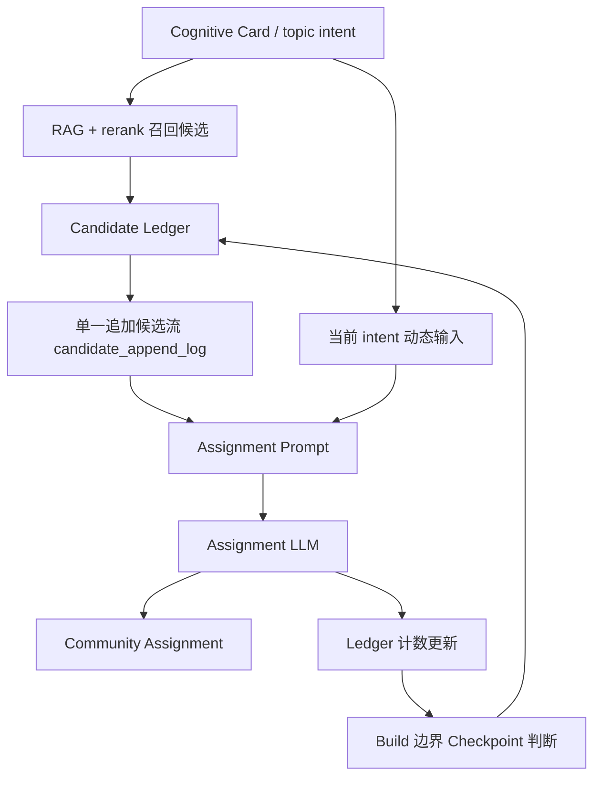

# Community Assignment 候选上下文账本缓存优化设计方案

## 1. 本文定位

本文记录 Community Assignment 阶段的候选上下文缓存优化方案。

目标不是改变 Community Topic 的归档逻辑，也不是用规则替代 LLM 裁决，而是让发给 Assignment LLM 的候选 community 上下文尽可能稳定，从而提高 DeepSeek 前缀缓存命中率，并减少候选顺序抖动带来的归档不稳定。

本文只记录当前最新结论。

## 2. 背景问题

当前 Assignment 阶段的输入由本次 topic intent 的 RAG 召回、rerank 和候选组装结果决定。

问题在于：

- 候选数量会变化。
- 候选顺序可能随 rerank 分数变化。
- community 的动态摘要、覆盖范围、近期证据变化会改写候选内容。
- `max_attach`、当前 intent、请求上下文等动态字段如果出现在候选前面，会导致后续候选全部失去前缀缓存。

结果是：即使两次请求召回了大量相同 community，只要顺序或前置字段有变化，LLM 仍然会产生大量 `prompt_cache_miss_tokens`。

## 3. 核心设计判断

引入 `Assignment Candidate Ledger`，即候选上下文账本。

核心原则：

```text
候选上下文只追加，不重排、不改写。
动态变化追加为 update，不回写旧 candidate。
候选过多时做 checkpoint，而不是无限增长。
```

Assignment LLM 仍然负责判断：

- 当前 topic intent 应挂入哪些已有 community。
- 是否需要创建新的 L0 community。
- 每条归属的 weight / confidence / fit_type。

账本只决定“给 LLM 看哪些候选，以及这些候选以什么稳定顺序出现”，不直接决定归属结果。

## 4. 目标系统形态



Prompt 结构应稳定为：

```text
固定 system prompt
候选追加流 candidate_append_log
当前 compact topic_intent
max_attach / 本次请求参数
```

`candidate_append_log` 是一个整体，不拆成 stable / dynamic 两段。除 checkpoint 外，系统只能在这个列表末尾追加内容，不能在中间插入、重排或改写已有内容。

这样做的原因是：只要 prompt 中间某一段变化，它后面的全部内容都会失去前缀缓存。把候选拆成两段并不能解决缓存问题，反而会让前段变化时打穿后段缓存。

## 5. Candidate Ledger 的职责

Candidate Ledger 维护 Assignment 阶段的候选上下文记忆。

它解决三个问题：

| 问题 | 账本策略 |
|---|---|
| 相同候选顺序每次变化 | 第一次出现后固定位置，后续复用原位置。 |
| community 动态内容变化导致前缀失效 | 不改旧内容，只在同一个 append log 末尾追加短 update。 |
| 候选越来越多撑爆上下文 | 达到阈值后按热点计数 checkpoint。 |

账本不是 Community 的事实存储，也不是检索索引。Community 的真实状态仍以 `kg_graph_communities` 和 Milvus community document 为准。

但 Candidate Ledger 是 Assignment prompt 稳定性的强依赖。Redis 不可用，或 Assignment Builder 未配置 Candidate Ledger 时，都必须直接失败，不能 fallback 到“只使用本轮候选”的临时策略；否则系统会表现为能运行，但实际没有执行本文定义的只追加账本策略。

## 6. 候选内容组织

### 6.1 candidate append log

`candidate_append_log` 是唯一发送给 Assignment LLM 的候选上下文列表。

它同时承载：

- 第一次出现的 community base candidate。
- 已有 community 的后续 update。
- checkpoint 后保留下来的热点 candidate。

规则：

- 本轮 RAG / rerank 选出的新 community 第一次进入某个 ledger 时，按系统自增 `community_id` 稳定排序后追加 `candidate_base`。
- 已存在 community 再次被召回时，不移动位置。
- 已有 candidate 的基础描述不因新证据而改写。
- 同一 ledger 内，候选顺序由首次进入账本时的稳定 `community_id` 顺序决定，后续不因 rerank 分数变化而重排。
- 新增变化追加为新的 `candidate_update`，也放到同一个列表末尾。
- 不允许为了把 update 归到某个 candidate 附近而回到中间插入内容。

RAG 和 rerank 的作用是“决定哪些新候选有资格进入 ledger”，不是决定 prompt 中旧候选的最终顺序。

发送给 LLM 前只过滤掉已经不在当前 active community 集合中的陈旧 ID；仍然有效的历史热点候选可以继续作为稳定前缀出现，即使它们没有被本次 RAG 重新召回。

### 6.2 candidate base 与 candidate update

append log 中有两类条目。

`candidate_base` 表达 community 第一次进入账本时的稳定候选信息。

`candidate_base` 只发送扁平字段，不再发送 `origin`、`level` 或嵌套 `dynamic_context`。字段为空时不发送，尤其是空的 `include_rules` / `exclude_rules`。

允许字段：

```text
entry_type = candidate_base
community_id
title
scope
include_rules
exclude_rules
canonical_labels
granularity_note
absorbed_subtopics
maturity
```

`candidate_update` 表达 community 后续新增吸收的子方向。

如果某个 community 最近吸收了新的 topic 子方向，不直接改写旧 `candidate_base`，而是在 append log 末尾追加短 update。

触发时机必须是 Assignment LLM 裁决成功后立即判断：只有高权重、非相邻背景的 `attach_existing` 才允许追加 `candidate_update`。系统从本次 `topic_intent` 的父级主题、宽主题和少量中层主题中提取新增子方向，与该 community 在 ledger stats 中已记录的 `future_coverage` 对比；只有发现新增子方向时才追加。不能等到下一次 RAG / rerank 再次召回该 community 时才追加，否则本轮新增吸收的信息很难稳定进入后续 prompt。

update 必须极短且稳定，并引用原 community：

```text
entry_type = candidate_update
community_id
absorbed
```

`absorbed` 是本次新增吸收的可复用子方向列表。它只记录目录级方向，不记录公司名、单笔交易、产品型号、涨跌幅、金额、具体新闻事实或证据细节；这些细节应保留在 Cognitive Card / assignment 明细中用于追溯，不能进入长期候选上下文。update 不记录计数字段、成熟度、标题、范围或长摘要；这些信息会破坏 prompt 前缀稳定性，并且对归档裁决帮助有限。

如果只是 source / intent 数量变化，但没有新增子方向，不追加 `candidate_update`。

### 6.3 当前请求动态字段

以下字段必须放到 prompt 最后：

- 当前 topic intent。
- 当前 Cognitive Card 摘要。
- `max_attach`。
- 本次请求限制参数。

这些字段每次都可能变化，不能出现在候选上下文前面。只用于诊断的 source_id、chunk_id、trace id 等信息进入 metadata / trace，不进入 prompt。

## 7. 候选进入账本的流程

每次 Assignment 前：

1. 基于当前 topic intent 做 RAG 召回。
2. 如果召回数量超过阈值，执行 rerank。
3. 选出本轮新候选集合。
4. 查询 Candidate Ledger。
5. 对每个候选：
   - 如果已在 ledger 中，复用原位置。
   - 如果不在 ledger 中，按系统自增 `community_id` 稳定排序后追加 `candidate_base` 到 append log 末尾。
6. 如果 community 有新变化，只追加 `candidate_update` 到 append log 末尾。
7. 过滤掉已不存在的 community ID，保留仍然 active 的历史候选前缀。
8. 组装 prompt，调用 Assignment LLM。
9. 根据 LLM 输出更新计数。

单次 Community Builder 运行过程中，Assignment 调用之间不执行 checkpoint。原因是 checkpoint 会重建 append log，一旦发生在同一次 build 的中间，会让后续请求的大段候选前缀失去缓存。

checkpoint 只允许发生在 build 开始或 build 结束的边界：

- build 开始：压缩上一轮遗留的过大账本，最多影响本轮第一批请求。
- build 结束：根据本轮 retrieved / accepted 计数为下一轮准备稳定账本。

RAG / rerank 的职责是新候选准入，ledger 的职责是稳定上下文，LLM 的职责是最终裁决。最终发送给 LLM 的候选上下文不是“只包含本轮 RAG 结果”，而是“仍然 active 的历史账本前缀 + 本轮新增候选”。

## 8. 热点计数

需要维护两类计数：

| 计数 | 含义 | 用途 |
|---|---|---|
| retrieved_count | RAG + rerank 后进入本轮新候选集合的次数。 | 表示近期经常被召回，可能是热点或高相关主题。 |
| accepted_count | 被 Assignment LLM 最终 attach 的次数。 | 表示近期确实被复用，是更强的热点信号。 |

计数用于 checkpoint 时选择保留哪些候选。

第一版只使用 Redis。

原因：

- Candidate Ledger 的目标是提升 prompt 前缀缓存命中率，不是事实存储。
- Community 的真实状态仍在 `kg_graph_communities` 和 Milvus community document 中。
- Redis 不可用必须抛出异常并终止本轮 Community Assignment，不能静默 fallback。
- 不引入 PG 持久化可以避免表结构、Repository、迁移和清理逻辑复杂化。

Redis 需要保存：

- append log。
- retrieved_count。
- accepted_count。
- checkpoint 元信息。

Checkpoint 后直接重写 Redis 中的 append log，并清空本轮计数。

## 9. Checkpoint 与压缩策略

候选账本不能无限增长。

触发 checkpoint 的条件：

| 条件 | 动作 |
|---|---|
| candidate_base 超过 30 个或 base 字符数超过长度预算 | 触发热点选举。 |
| ledger schema version 变化 | 丢弃旧 ledger，重新开始追加。 |
| Redis key 不存在或过期 | Redis 可用时从当前 RAG 候选重新初始化 ledger。 |

`candidate_update` 不参与 checkpoint 判断。update 数量增加或 update 文本变长，都不能触发 checkpoint；它只作为尾部变化日志存在。这样可以避免因为频繁 update 导致 base 前缀被反复重建。

Checkpoint 流程：

1. 根据 `accepted_count` 和 `retrieved_count` 计算热点分。
2. 选出 Top 10 热点候选。
3. 本次 RAG + rerank 新召回但不在 Top 10 的候选继续保留。
4. 对最终保留集合按稳定 `community_id` 排序后写回 append log，不能按热点分排序写入 prompt。
5. 清空本轮计数，开始下一轮热点统计。

如果 checkpoint 后的新候选集合与旧账本前缀重叠率大于 70%，并且 append log 没有超过硬长度预算，可以跳过重建，继续复用旧账本。

这样可以避免频繁重建导致前缀缓存失效。

## 10. 账本粒度

第一版 ledger 粒度建议按以下范围划分：

```text
adapter_name + target + assignment_context_version
```

不按单个 query 建 ledger。因为 Assignment 的主要目标是稳定 community 候选上下文，而不是缓存某个查询。

如果未来出现多个差异很大的业务域，可以再引入更细粒度：

```text
adapter_name + target + domain_namespace + assignment_context_version
```

第一版不引入复杂 namespace，避免系统过早分裂成多个候选记忆池。

## 11. 与 Seed / Emergent Community 的关系

Seed 和 emergent community 在账本中统一处理。

区别只体现在 community 自身 metadata：

```text
origin = seed / emergent
```

Candidate Ledger 不单独维护 seed 列表，也不把 seed 强塞到 prompt 前面。

所有候选都来自统一流程：

```text
Milvus 召回
  -> rerank
  -> ledger 去重与追加
  -> Assignment LLM
```

这样可以保证 seed 和 emergent 使用同一套生命周期、同一套缓存策略、同一套质量统计。

## 12. 与 rerank 的关系

Rerank 仍然需要保留，但它不应该破坏 prompt 顺序稳定性。

Rerank 的职责：

- 从较多候选中筛选本轮最相关的新候选。
- 当候选数量小于等于发送上限时，可以跳过 rerank。
- 决定“是否进入本轮新候选集合”。

Rerank 不负责：

- 改变 ledger 中已有候选的位置。
- 根据分数重排整个 prompt。
- 直接决定 attach / create。

如果新候选首次进入 ledger，它按 `community_id` 稳定顺序追加到末尾；如果旧候选再次被召回，它保留原位置。

## 13. 验收口径

实现后至少用以下指标验收：

| 指标 | 目标 |
|---|---|
| Assignment prompt 中 candidate append log 前缀稳定率 | 相同批次重复运行明显提升。 |
| `prompt_cache_hit_tokens / input_tokens` | 相比当前版本显著提升。 |
| Community Assignment 平均耗时 | 明显下降。 |
| 候选数量超过阈值后的 prompt 长度 | 不随历史无限增长。 |
| stale / legacy community 污染 | 不再出现旧 `kg_community:*` 混入新检索结果。 |
| 归档质量 | 不因缓存优化降低，重点检查 seed 吸收数、emergent 数、single-source emergent 占比。 |

质量评估不能只看缓存命中率。缓存命中率提升但归档质量下降，视为失败。

## 14. 第一版实施边界

第一版要做：

- 建立 Candidate Ledger。
- Redis 不可用直接失败，不允许 fallback。
- 候选只追加，不改写。
- 动态变化以 candidate update 追加到同一个 append log 末尾。
- 维护 retrieved_count / accepted_count。
- 超过阈值后 checkpoint。
- prompt 结构调整为候选 append log 在前，当前请求动态字段在后。
- 相关 trace 指标可观测。

第一版不做：

- 全局 community maintenance。
- 全量历史重算。
- 复杂多 namespace。
- L1 / L2 自动拆分。
- community rename。
- community merge。
- scope 变更治理。
- 用规则替代 Assignment LLM。

## 15. 风险与约束

### 15.1 旧内容长期存在

只追加不改写会保留旧 candidate 描述。

当前系统还没有正式的 community rename、merge 或 scope 变更治理流程。因此第一版 Candidate Ledger 不为这些能力设计特殊处理，也不假设它们已经存在。

应对方式：

- 普通新增事实使用 candidate update，并追加到 append log 末尾。
- candidate update 不触发 checkpoint；只有 candidate base 过多或 base 字符数超预算时才生成新的 append log。
- 如果未来引入 rename / merge / scope 治理，需要同步升级 ledger schema version，让旧 ledger 失效后重新开始追加。

### 15.2 热点候选挤压长尾候选

Top 10 热点可能挤压低频但重要的新主题。

应对方式：

- 热点只作为稳定前缀。
- 本次 RAG 新召回的候选仍可追加。
- Assignment LLM 仍可 create new。

### 15.3 缓存优化影响归档判断

为了缓存稳定，不能牺牲候选相关性。

应对方式：

- RAG / rerank 仍决定本轮候选准入。
- Ledger 只稳定顺序和内容表达。
- 验收必须同时看 cache 和 community 质量。

## 16. 与实施文档和代码的关系

本文位于设计方案目录，记录 Candidate Ledger 的目标形态、核心边界和验收口径。

对应实施文档位于：

`docs/3. 实施方案/4. 知识图谱/18. Community Assignment候选上下文账本缓存优化实施方案.md`

实现必须与本文保持一致。若后续代码对账本粒度、checkpoint 策略、prompt 结构或 Redis 状态生命周期做出调整，必须同步更新本文和对应实施文档。
