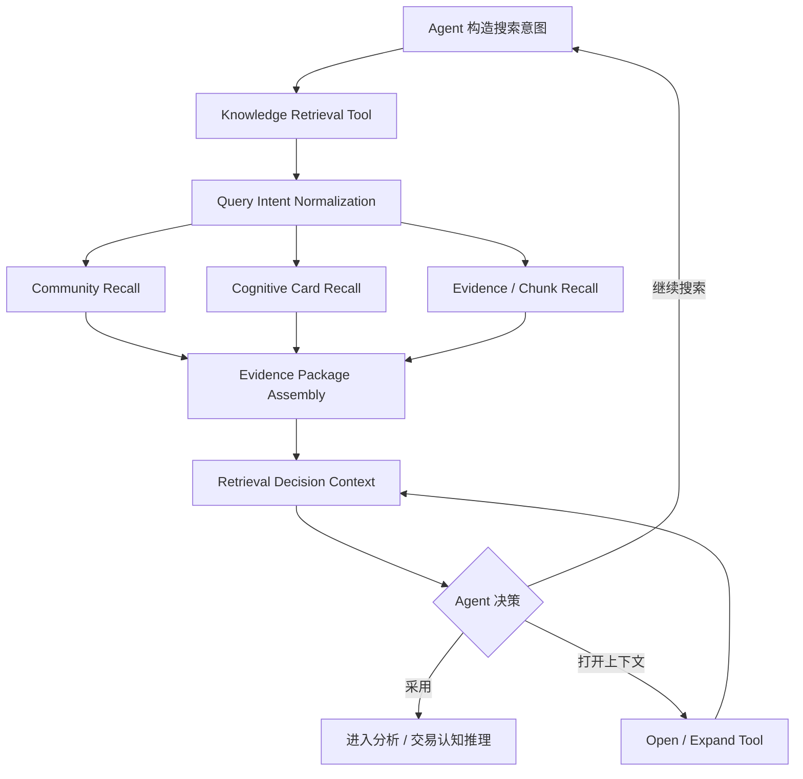
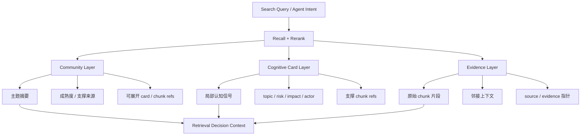
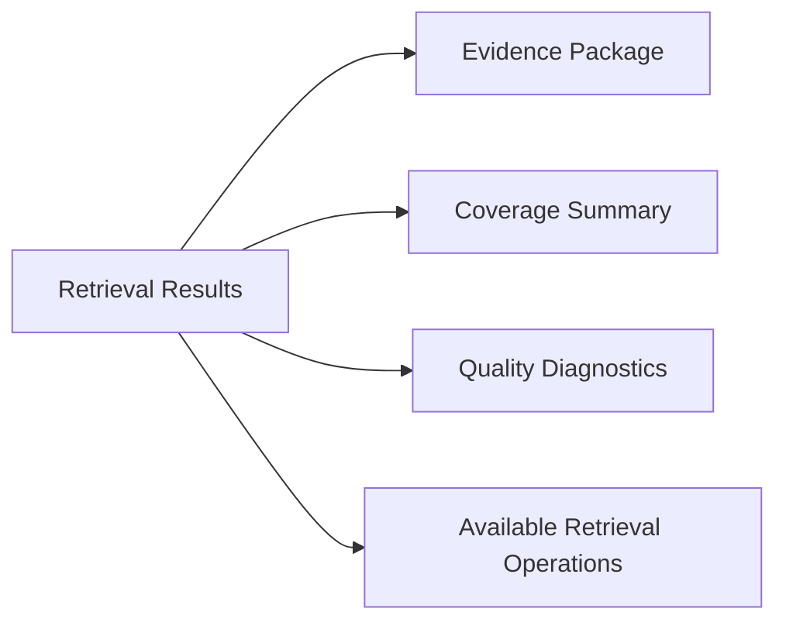

# Agent 检索与决策上下文设计方案

## 1. 本文定位

本文记录知识图谱写入链路跑通后的下一阶段检索设计。

当前写入主线已经收敛为：

```text
原始证据 / chunk
  -> Cognitive Card
  -> Community Card
```

下一阶段检索不是给前端做一个普通搜索框，而是给 Agent 提供可循环调用的检索工具。Agent 会自己构造搜索条件，调用检索系统，阅读结果后决定：

- 是否已经可以采用当前结果；
- 是否需要换一个角度继续搜索；
- 是否需要打开某个 community、card 或 chunk 的上下文；
- 是否需要缩小、放宽或改写搜索条件。

因此检索系统不能只返回命中文本列表。它必须返回一个面向 Agent 决策的 `Retrieval Decision Context`。

## 2. 背景问题

普通 RAG 检索通常只回答“哪些文本最相似”。这对 Agent 不够。

Agent 还需要知道：

- 当前命中的是高维主题、局部认知卡片，还是原始证据片段；
- 命中结果覆盖了哪些主题、风险、影响对象和时间线索；
- 去重后的结果是否仍然信息同质化、存在冲突、过窄或过散；
- 当前结果在检索层是否具备可追溯证据和可展开上下文；
- 在本次查询显式约束下，结果有哪些可观测的覆盖不足。

这里的“重复”不是指完全相同的 `chunk_id`、`community_id` 或 evidence 重复返回。基础 ID 去重、同 evidence 合并、相邻 chunk 窗口压缩应由检索系统在交付结果前完成。

Agent 仍然需要知道的是去重后的信息是否同质化。例如返回的 8 条结果虽然 ID 都不同，但全部集中在同一个 community、同一个 source 批次或同一个子方向，那么这些结果在信息覆盖上仍然是重复的。它们不能证明整个问题已经被充分覆盖，只能说明某个侧面被反复命中。

因此质量诊断里的重复应理解为：

```text
基础重复: 系统去重解决。
信息同质化: 系统诊断后告诉 Agent，帮助 Agent 决定是否补搜缺失侧面。
```

如果检索结果只给 topK 文本，Agent 很容易过早采用几个相似 chunk，或者在不知道缺口的情况下盲目继续搜索。

新的检索系统要把“搜索结果”和“搜索质量诊断”一起返回。

## 3. 系统定位

检索系统在 Agent 工作流中的位置如下：



检索系统只负责返回证据包、检索质量诊断和可执行的检索操作提示，不替 Agent 做最终金融判断，也不推断业务方完整目标。Agent 负责根据任务目标决定是否继续搜索、是否引用结果、是否进入下一阶段推理。

## 4. 目标系统形态

检索结果按三层组织。



| 层级 | 作用 | Agent 如何使用 |
|---|---|---|
| Community | 高维主题入口 | 先判断是否命中了正确主线，适合宏观问题和跨资料问题。 |
| Cognitive Card | 局部认知特征 | 判断主题、风险、影响、主体等信号是否支持当前任务。 |
| Evidence / Chunk | 原始证据 | 用于引用、核验、精读和补充上下文。 |

检索必须允许 Agent 从高层往下展开，也允许直接从原始证据往上看它属于哪些 community。

## 5. 核心设计判断

### 5.1 检索面向 Agent，不面向单次问答

Agent 检索不是“一问一答”，而是循环：

```text
search -> inspect -> open / expand -> refine search -> decide
```

所以检索响应必须包含：

- 命中结果；
- 命中结果为什么相关；
- 覆盖了哪些方面；
- 相对本次查询显式目标，结果覆盖了哪些可观测侧面，哪些侧面没有命中；
- 可用检索操作，例如 open / expand / refine，而不是业务动作建议或继续检索建议。

检索系统不能知道业务方“真正还缺什么”。它只能基于本次 query、Agent 显式传入的约束、召回结果和索引结构，判断可观测的检索状态。例如：

```text
可以判断：
- 结果都集中在同一 community。
- 没有命中原始 evidence。
- 命中的 card 只有风险信号，没有影响对象信号。
- 时间范围只覆盖最近一天，不覆盖 query 要求的一个月。

不能判断：
- 业务方最终还需要什么金融结论。
- Agent 是否应该交易、买卖或采用某个观点。
- 当前资料是否已经满足一个未声明的业务目标。
```

### 5.2 Community 是导航入口，不是最终证据

Community Card 能帮助 Agent 快速理解主题主线，但不能直接作为最终事实引用。

当 Agent 需要采用结论时，系统必须支持从 Community 展开到：

```text
Community
  -> Community Assignments
  -> Cognitive Cards
  -> Evidence / Chunk
  -> 邻接 chunk / 同 evidence 上下文
```

最终可引用证据必须落回原始 evidence / chunk。

### 5.3 Cognitive Card 是检索中间层

Cognitive Card 的价值是把 chunk 中的局部认知信号显式化。它比 chunk 更适合做语义召回和 rerank，比 community 更适合判断细节是否相关。

例如 Agent 查询“AI 算力链的机会与风险”时：

- Community 命中 `AI算力链`，说明方向可能正确；
- Cognitive Card 命中 `AI芯片供需`、`光模块/CPO`、`算电协同`，说明覆盖哪些子方向；
- Chunk 提供原文证据和可引用上下文。

### 5.4 检索响应必须包含质量诊断

每次检索返回的质量诊断至少要回答：

| 诊断问题 | 目的 |
|---|---|
| 命中结果集中还是分散 | 判断 query 是否过宽或召回噪声过高。 |
| 去重后是否仍然信息同质化 | 判断结果是否都集中在同一 source、同一 community 或同一子方向，避免“看起来很多，实际只覆盖一个侧面”。 |
| 是否命中成熟 community | 判断是否有可复用高维主题。 |
| 是否有足够原始证据 | 判断能否进入最终回答或交易分析。 |
| 是否覆盖多个关键侧面 | 判断是否缺少风险、影响、主体或时间线。 |
| 是否存在冲突或不确定 | 提醒 Agent 继续查证。 |

质量诊断不是硬规则替代 Agent，而是给 Agent 提供下一步决策依据。

### 5.5 检索输出只能给可用检索操作

系统不应该替 Agent 判断下一步应该做什么，只能暴露当前结果支持哪些检索操作。例如：

- 某个 community / card / chunk 可以被打开以查看完整上下文；
- 当前结果未覆盖 Agent 显式关注的侧面时，可以按该侧面 refine；
- 当前结果集中在单一 community / source 时，可以用更明确的行业、风险、主体或时间约束再次检索；
- 当前原始证据偏少时，可以展开支撑材料或同 evidence 前后文。

这些可用操作必须来自检索结果结构和覆盖情况，不允许假装理解业务方未声明的目标。

检索系统不输出“无需继续检索”这类动作。是否继续检索、是否采用结果、是否进入交易分析，全部由上层 Agent 判断。

### 5.6 多次检索需要可追踪

Agent 可能连续调用多次检索。系统应能把每次检索放入同一个 session 中观测：

```text
search_1: 初始主题召回
search_2: 补查风险
open_1: 打开 community
search_3: 按主体收窄
final_use: Agent 采用哪些证据
```

这样后续才能评估 Agent 为什么继续搜索、哪次检索提供了关键证据、哪些结果被采用、哪些结果被忽略。

同一个 session 内，检索系统应记录已经返回给 Agent 的 `result_id`。后续 `search / refine / open / expand` 默认过滤已经返回过的结果，减少 Agent 侧重复阅读和 token 浪费。

`refine` 的职责是补充新的有效证据，不是强制凑满 topK。若去重后剩余候选全部弱相关，系统应返回空 `evidence_package`，并在 trace / quality diagnostics 中说明被弱结果保护拦截。这样比返回低分噪声更适合 Agent 决策：Agent 可以据此换查询条件、放宽范围或停止当前方向，而不是误读无关材料。

## 6. Agent 可消费的结果形态

一次检索响应由四部分组成。



| 部分 | 作用 |
|---|---|
| Evidence Package | 可读命中结果，包含 community、card、chunk 的分层信息。 |
| Coverage Summary | 当前结果覆盖的主题、风险、影响对象、主体、时间范围。 |
| Quality Diagnostics | 结果质量、集中度、证据充分性、重复和冲突提示。 |
| Available Retrieval Operations | 当前结果支持的检索操作，例如 open / expand / refine；不输出业务动作建议，也不判断是否应该继续。 |

检索系统只暴露可用操作。Agent 可以自主选择执行、忽略或重新规划。

## 7. 工具能力边界

第一阶段只提供四类工具能力。外部工具保持少而稳定，内部可以做多层召回、rerank 和上下文装配。

| 能力 | 说明 |
|---|---|
| kg_search | 根据 Agent 的搜索意图进行多层召回、候选池排序和证据包组装。 |
| kg_open | 根据命中 ID 打开 community、cognitive card、chunk 或 evidence 的完整可读上下文；可选传入原始 query 对邻接上下文排序。 |
| kg_expand | 从 community 展开到 cards / chunks，或从 card / chunk 展开上下文；可选传入原始 query 对展开结果排序。 |
| kg_refine | 基于上一轮 retrieval context 和新的显式约束继续检索。 |

不建议第一阶段让检索工具直接生成最终投资结论、交易建议或完整报告。

### 7.1 kg_search 的参数边界

`kg_search` 至少支持：

| 参数 | 含义 |
|---|---|
| query | Agent 的自然语言检索意图。 |
| limit | 最终返回给 Agent 的结果数量。 |
| sort | 候选池排序目标。 |
| time_range | 可选时间约束。 |

`limit` 限制最终返回的 evidence package 数量，不等于底层 Milvus 或 PG 的召回数量。系统内部应使用更大的候选池，再在候选池内排序、去重、覆盖选择后截断。

`sort` 是候选池 rerank 策略，不是全库 `ORDER BY`。系统不对全部文档做全量排序。

`time_range` 必须优先作用在底层召回阶段，减少候选池噪声。可检索 target 写入 Milvus 时必须带规范化时间 scalar：

| 字段 | 含义 |
|---|---|
| published_at_ts | 原始资料发布时间，秒级 Unix timestamp。 |
| event_time_start_ts | target 覆盖内容的开始时间；单条 chunk/card 默认等于 published_at_ts。 |
| event_time_end_ts | target 覆盖内容的结束时间；community 使用其支撑资料的 latest published_at。 |

不得用 PG `created_at` 代替内容时间。`created_at` 只表示写入或构建时间，不能代表新闻发布时间或事件发生时间。

Milvus 必须覆盖三类主检索 target：

| target | 作用 |
|---|---|
| evidence_chunk | 原文证据层，负责引用和精读。 |
| cognitive_card | 局部认知信号层，负责主题、风险、影响、主体等中间粒度召回。 |
| community_report | 高维主题层，负责跨资料主线导航。 |

第一阶段推荐支持：

| sort | 含义 |
|---|---|
| relevance | 默认策略，优先返回与 query 最相关的结果。 |
| freshness | 在相关性达标的候选中，提高近期资料权重。 |
| evidence_strength | 在相关性达标的候选中，提高证据支撑更强、source 更多、community 更成熟的结果权重。 |
| diversity | 在相关性达标的候选中，优先覆盖不同 community、source 和子方向。 |

排序流程固定为：

```text
多入口召回候选池
  -> 候选归一化
  -> 去重 / 合并 / 补 refs
  -> 候选池内 rerank
  -> 覆盖选择
  -> 截断为 limit 条
```

不采用：

```text
全库文档
  -> 全量排序
  -> 返回
```

### 7.2 kg_open / kg_expand 的 query-aware 排序边界

`kg_open` 和 `kg_expand` 不是全局搜索工具，不能重新扩大召回范围。它们只在已确定的 refs / neighbors / supporting cards / supporting chunks 中取回上下文。

如果 Agent 传入原始 `query`：

- `kg_open` 固定保留被打开的 target 优先，只对邻接上下文做 query-aware 排序；
- `kg_expand` 对展开得到的候选上下文做 query-aware 排序；
- 排序复用 search 的 rerank 与结构化校准，但只作用在当前展开候选池内；
- 不传 `query` 时保持 refs 原始顺序，适合作为纯结构展开。

这样既能避免 expand 返回无关邻接材料排在前面，又不会把 open / expand 变成隐式 search。


## 8. 应退出或调整的旧能力定位

旧的裸 node / edge 检索不作为主链路。

当前主线是：

```text
Evidence / Chunk
  -> Cognitive Card
  -> Community Card
  -> Agent Retrieval Package
```

如果后续恢复实体关系图，node / edge 也只能作为辅助过滤、解释或关系展开线索，不能替代 Cognitive Card / Community Card 成为主检索对象。

旧的“只返回 topK chunk”的检索也应降级为 evidence layer 的一个入口，而不是完整 Agent 检索响应。

## 9. 验收口径

第一阶段检索是否合格，不只看是否召回到了文本，还要看 Agent 能不能据此决策。

验收口径：

1. 对宏观主题问题，能够优先命中相关 Community，并能展开到支撑 Cognitive Card 和 chunk。
2. 对局部证据问题，能够直接命中 chunk，并返回它所属的 Cognitive Card / Community 上下文。
3. 检索响应必须包含覆盖摘要、质量诊断和检索操作提示。
4. Agent 至少能基于返回结果判断三种检索状态：是否打开上下文、是否调整查询、是否停止继续检索。最终是否采用由 Agent 自己决定。
5. 每个最终可引用结果都能追溯到 evidence / chunk。
6. Trace 能串联同一 Agent session 下的多次 search / open / expand。
7. 检索质量评估不能只看相似度分数，还要记录覆盖、证据充分性、重复、冲突和被 Agent 采用情况。

## 10. 关键待验证问题

第一阶段需要重点验证：

- Community 命中是否真的能提升 Agent 对高维主题的理解。
- Cognitive Card 层是否能减少直接搜 chunk 时的噪声。
- 质量诊断是否能有效帮助 Agent 判断是否继续搜索、打开上下文或调整查询。
- open / expand 是否能稳定追回原文上下文。
- 多轮检索 session 是否能支持后续质量评估。
- 返回给 Agent 的上下文是否过长，是否需要按预算裁剪。

## 11. 和实施文档的关系

本文是设计侧文档，说明检索系统应该向 Agent 交付什么能力，以及为什么要这样设计。

对应实施侧文档：

`docs/3. 实施方案/4. 知识图谱/19. Agent检索与决策上下文实施方案.md`
