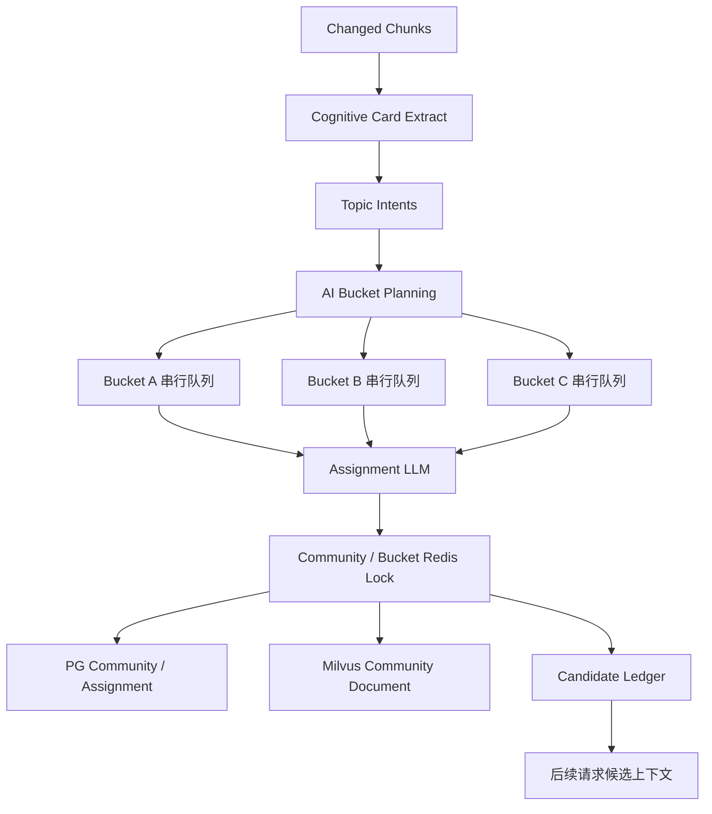

# Community Graph 写入性能优化设计方案

## 1. 本文定位

本文记录 Community Graph 写入阶段的性能优化设计结论。

当前写入链路已经收敛为：

```text
原始证据 / chunk
  -> Cognitive Card
  -> Community Assignment
  -> Community Card / Milvus Index
```

性能瓶颈主要出现在 Community Assignment 与 Community Card 构建阶段。该阶段需要根据 Cognitive Card 中的 topic intent 判断是否挂入已有 community 或创建新 community。由于后一个 intent 可能依赖前一个 intent 刚创建或刚更新的 community，当前串行执行能保证质量，但在数据量增大时会显著拖慢写入。

本文只记录最终设计结论，不记录讨论过程。

## 2. 核心目标

目标是在不牺牲 community 归档质量的前提下，提高 Community Graph 写入吞吐。

具体目标：

- Cognitive Card 抽取后，Community Assignment 不再全局单队列串行。
- 相互影响概率高的 topic intent 仍然串行处理，避免重复创建相似 community。
- 相互影响概率低的 topic intent 可以并发处理。
- 并发写入时保证 community 聚合状态、Milvus 文档和候选账本不丢更新。
- bucket 只作为执行调度缓存，不进入最终业务语义。

非目标：

- bucket 不替代 community。
- bucket 不作为检索对象。
- bucket 不作为用户可见主题。
- bucket 不要求历史数据重算。
- bucket 不改变 Assignment LLM 的最终裁决职责。

## 3. 目标系统形态

目标形态是：

```text
Cognitive Card 并发抽取
  -> AI Bucket Planning
  -> bucket 内串行 assignment
  -> bucket 间并发 assignment
  -> Redis 锁保护 community 写入
  -> PG / Milvus 增量更新
```



## 4. Bucket 的系统定位

bucket 是 Community Assignment 阶段的并发调度通道。

它回答的问题是：

```text
哪些 topic intent 必须放在同一个串行队列里处理？
哪些 topic intent 可以放到不同队列中并发处理？
```

bucket 不是业务主题，也不是高级索引。真正的业务索引仍然是 `kg_graph_communities` 中的 community。

bucket 的生命周期可以比 community 更轻：

- bucket 可以由 AI 动态创建。
- bucket 可以被合并。
- bucket 可以直接替换缓存映射。
- bucket 历史不需要参与检索。
- bucket 历史不需要驱动旧 assignment 重算。

## 5. AI Bucket Planning

分桶由 AI 裁决，不使用固定行业规则或字符串匹配。

Bucket Planning LLM 的输入是本轮待处理 topic intent 的 compact signature，以及已有 bucket catalog。

topic intent signature 主要来自 Cognitive Card：

- `parent_themes`
- `broad_topics`
- `mid_topics`
- `event_thread`
- `driver`
- `impact_target`
- `risk_type`
- `title_candidate`

Bucket Planning LLM 的职责：

- 判断新增 theme 应归入哪个已有 bucket。
- 对相近 theme 做 canonical theme 归一。
- 判断是否需要创建新 bucket。
- 输出可用于缓存的 `canonical_theme -> bucket_id` 映射。
- 在发现 bucket 过细时给出合并建议。

Bucket Planning LLM 不负责：

- 创建 community。
- 修改 community。
- 判断最终 attach / create_new。
- 生成 community summary。
- 生成可检索索引内容。

## 6. Bucket Cache

系统需要维护当前有效的 bucket catalog 和 theme bucket map。

```text
bucket catalog:
  bucket_id
  bucket_title
  scope
  canonical_themes

theme bucket map:
  canonical_theme -> bucket_id
```

缓存策略：

- 已知 canonical theme 直接使用缓存，不再调用 Bucket Planning LLM。
- 新增 theme 批量交给 Bucket Planning LLM。
- Bucket Planning LLM 可以基于已有 bucket catalog 决定归入旧 bucket 或新建 bucket。
- bucket 数量不应无限增长，超过阈值时触发合并判断。

bucket cache 可以以 Redis 为主，因为 bucket 是执行调度缓存，不是事实资产。Redis 清空只会导致下一轮重新分桶，不影响已写入 community 的正确性。

## 7. Bucket 粒度

bucket 粒度应大于具体新闻主题，小于全市场大类。

合理 bucket 示例：

- `AI算力链`
- `大宗商品供需冲击`
- `资本市场改革`
- `政策监管与产业扶持`
- `地缘政治与能源风险`
- `公司业绩与产业景气`

不合理 bucket 示例：

- `AI芯片供需`
- `光模块产业链`
- `单家公司业绩`
- `某个收购项目`
- `午盘行情`
- `ETF资金流入`

这些细主题应该作为同一 bucket 内部串行处理的 intent，而不是拆成多个并发 bucket。

bucket 数量建议控制在几十个量级。超过该范围通常说明 bucket 过细，需要合并。

## 8. 并发模型

Community Assignment 的并发模型是：

```text
bucket 内串行
bucket 间并发
写入时按 community / bucket 加锁
```

原因：

- 同一 bucket 内的 intent 更可能竞争同一批 community，需要串行降低重复创建风险。
- 不同 bucket 的 intent 影响较小，可以并发提升吞吐。
- community 的聚合状态更新必须加锁，避免并发覆盖。

一个 intent 可以最终归属多个 community。bucket 只决定该 intent 的执行队列，不限制 Assignment LLM 的多归属能力。

## 9. Redis 锁边界

并发写入允许使用 Redis 锁，不要求统一到最后一次性提交。

锁的边界不是单纯 SQL commit，而是一个 community 更新的逻辑临界区：

```text
读取当前 community 状态
应用 assignment
更新 evidence / chunk / card / metrics
写入 PG
写入 Milvus community document
更新 candidate ledger
```

锁分两类：

| 锁 | 作用 |
|---|---|
| bucket lock | 保护同一 bucket 内 create_new 的唯一性，避免并发创建重复父主题。 |
| community lock | 保护 attach_existing 后的 community 聚合更新，避免丢失 evidence / card / metrics。 |

如果一次 assignment 涉及多个 community，必须按 community_id 稳定顺序加锁，避免死锁。

## 10. Bucket 合并

bucket 会随着数据增加逐渐变细，因此必须支持合并。

触发合并的信号：

- bucket 数量超过阈值。
- 新建 bucket 与已有 bucket 语义高度接近。
- 某些 bucket 长期低频。
- 不同 bucket 的 intent 经常 attach 到同一个 community。
- Bucket Planning LLM 明确给出 merge suggestion。

合并是调度缓存重写，不是业务数据迁移。

合并后：

- 直接删除旧 bucket。
- 将旧 bucket 的 canonical themes 迁移到主 bucket。
- 覆盖 `canonical_theme -> bucket_id` 映射。
- 后续新增 intent 按新 bucket 执行。
- 不保留 `merged_to`。
- 不重算历史 assignment。
- 不改写历史 community。
- 不影响已有检索结果。

原因是 bucket 只影响未来 Community Assignment 的并发调度，不是历史事实的一部分。

## 11. 与 Candidate Ledger 的关系

Bucket Cache 和 Candidate Ledger 是两个不同层次。

| 对象 | 职责 |
|---|---|
| Bucket Cache | 决定当前 intent 进入哪个并发执行队列。 |
| Candidate Ledger | 决定 Assignment LLM 看到哪些 community 候选，以及候选顺序如何保持稳定。 |

Bucket Cache 不替代 Candidate Ledger。
Candidate Ledger 也不决定并发分桶。

执行顺序是：

```text
Topic Intent
  -> Bucket Cache / Bucket Planning
  -> 进入某个 bucket 队列
  -> RAG + rerank + Candidate Ledger
  -> Assignment LLM
```

## 12. Prompt 设计

### 12.1 Bucket Planning Prompt

Bucket Planning Prompt 用于把本轮待处理 topic intent 划分到并发执行 bucket。

System Prompt：

```text
你是金融知识图谱的 Community Assignment 并发分桶规划器。

你的任务不是创建 community，也不是判断最终归档结果。
你的任务是根据一批 topic intent 的语义关系，规划哪些 intent 必须放在同一个串行执行 bucket 中，哪些 intent 可以放到不同 bucket 并发处理。

核心原则：
- bucket 是执行调度通道，不是业务主题，不是检索对象，不是 community。
- 同一 bucket 内的 intent 会串行执行，目的是避免相近主题并发创建重复 community。
- 不同 bucket 之间会并发执行，因此只有相互影响较小的 intent 才能拆开。
- 如果多个 intent 可能竞争同一批 community，必须放入同一个 bucket。
- 如果多个 intent 只是同一父主题下的不同子方向，必须放入同一个 bucket。
- bucket 粒度应大于具体新闻主题，小于全市场大类。
- 不要把单家公司、单个项目、单次行情、单个产品、单笔交易创建成 bucket。
- 如果已有 bucket 能承接新增 theme，应优先复用已有 bucket。
- 如果新增 theme 与已有 bucket 都不匹配，可以创建新 bucket。
- 如果发现已有 bucket 过细，可以提出 merge_suggestions。
- 对相近 theme 必须输出 canonical_theme，后续会缓存 canonical_theme -> bucket_id。

你必须只输出符合 JSON Schema 的 JSON 对象，不要输出 Markdown、解释文字或代码块。
```

User Prompt 输入结构：

```text
已有 bucket catalog:
- bucket_id
- bucket_title
- scope
- canonical_themes

本轮新增或待确认 topic intent signatures:
- intent_id
- parent_themes
- broad_topics
- mid_topics
- event_thread
- driver
- impact_target
- risk_type
- title_candidate
- summary

目标：
请为每个 intent 选择 bucket，必要时创建新 bucket，并输出 canonical_theme。
```

输出结构：

```json
{
  "assignments": [
    {
      "intent_id": "string",
      "canonical_theme": "string",
      "bucket_id": "string",
      "bucket_title": "string",
      "action": "reuse_existing_bucket | create_new_bucket",
      "confidence": 0.0,
      "reason": "string"
    }
  ],
  "new_buckets": [
    {
      "bucket_id": "string",
      "bucket_title": "string",
      "scope": "string",
      "canonical_themes": ["string"]
    }
  ],
  "theme_bucket_updates": [
    {
      "canonical_theme": "string",
      "bucket_id": "string"
    }
  ],
  "merge_suggestions": [
    {
      "source_bucket_id": "string",
      "target_bucket_id": "string",
      "reason": "string",
      "confidence": 0.0
    }
  ]
}
```

### 12.2 Bucket Consistency Replay Prompt

Bucket Consistency Replay Prompt 用于离线验收 bucket 并发规划是否与当前串行 Community Assignment 结果冲突。

System Prompt：

```text
你是金融知识图谱的 Bucket Planning 一致性审查器。

你会收到：
1. 当前已有 Cognitive Card 的 topic intent 摘要；
2. 当前串行 Community Assignment 的结果；
3. Bucket Planning 回放产生的 bucket assignment；
4. 当前已有 community 摘要。

你的任务是判断 bucket 并发规划是否会破坏串行归档质量。

审查原则：
- bucket 只是并发执行通道，不是 community。
- 你不需要要求 bucket 名称与 community 名称一致。
- 你需要检查：串行结果中最终归入同一 community 的相近 intent，是否被 bucket 回放分到了互相隔离的 bucket。
- 如果相近 intent 被拆到不同 bucket，且它们并发执行时可能创建重复 community，必须标记为 high_risk_conflict。
- 如果多个 bucket 高频指向同一 community 或同一批 canonical theme，说明 bucket 过细，应标记为 merge_needed。
- 如果差异只是名称不同，但不会影响并发安全，不应标记为冲突。
- 不允许根据固定样本名称做特殊判断，必须基于输入中的 intent、community 和 bucket 语义关系判断。

你必须只输出符合 JSON Schema 的 JSON 对象，不要输出 Markdown、解释文字或代码块。
```

User Prompt 输入结构：

```text
topic intents:
- intent_id
- source_id
- cognitive_card_id
- compact signature

serial assignment baseline:
- intent_id
- community_id
- community_title
- weight
- fit_type

bucket replay result:
- intent_id
- bucket_id
- bucket_title
- canonical_theme

community summaries:
- community_id
- title
- scope / summary
- absorbed themes
```

输出结构：

```json
{
  "status": "pass | fail | needs_review",
  "conflicts": [
    {
      "conflict_type": "high_risk_conflict | possible_conflict | merge_needed",
      "intent_ids": ["string"],
      "community_ids": ["string"],
      "bucket_ids": ["string"],
      "reason": "string",
      "recommended_action": "merge_buckets | adjust_bucket_scope | accept_difference"
    }
  ],
  "summary": "string"
}
```

### 12.3 Bucket Merge Planning Prompt

Bucket Merge Planning Prompt 用于治理 bucket 越来越细的问题。

它不是线上每条新闻都调用的 prompt，而是在出现合并触发信号时执行：

- bucket 数量超过阈值。
- Bucket Planning LLM 输出了 `merge_suggestions`。
- Consistency Replay 输出了 `merge_needed`。
- 多个 bucket 高频指向同一个 community。
- 新建 bucket 与已有 bucket 的 canonical theme / scope 高度接近。

Bucket Merge Planning 的目标是重写调度缓存：

```text
旧 bucket catalog + merge candidates
  -> LLM 判断哪些 bucket 应合并
  -> 生成新的 bucket catalog
  -> 覆盖 theme_bucket_map
```

System Prompt：

```text
你是金融知识图谱的 Bucket 合并规划器。

bucket 是 Community Assignment 的并发调度通道，不是 community，不是业务主题，不是检索对象。

你的任务是判断当前 bucket catalog 中哪些 bucket 过细、边界重叠或应该合并，从而减少并发执行时的重复 community 创建风险。

合并原则：
- 如果多个 bucket 的 topic intent 经常归入同一个 community，应合并。
- 如果多个 bucket 只是同一父主题下的子方向，应合并。
- 如果 bucket 只代表单家公司、单个项目、单次行情、单笔交易或单个产品，应合并到更大的父级 bucket。
- 如果两个 bucket 的 scope 高度重叠，应合并。
- 如果两个 bucket 只是名称不同但承接同一类 intent，应合并。
- 不要为了减少 bucket 数量而强行合并语义边界明显不同的 bucket。
- 合并后只影响未来并发调度，不要求重算历史 assignment，不修改历史 community。
- 合并时直接删除旧 bucket，将旧 bucket 的 canonical themes 迁移到目标 bucket。
- 不输出 merged_to，不保留旧 bucket 重定向。

你必须只输出符合 JSON Schema 的 JSON 对象，不要输出 Markdown、解释文字或代码块。
```

User Prompt 输入结构：

```text
当前 bucket catalog:
- bucket_id
- bucket_title
- scope
- canonical_themes
- usage_stats
- recent_attached_community_ids

merge candidates:
- source_bucket_id
- target_bucket_id
- reason
- evidence

当前 community 摘要:
- community_id
- title
- summary / scope
- absorbed themes
```

输出结构：

```json
{
  "merge_actions": [
    {
      "source_bucket_id": "string",
      "target_bucket_id": "string",
      "confidence": 0.0,
      "reason": "string",
      "migrated_canonical_themes": ["string"]
    }
  ],
  "updated_buckets": [
    {
      "bucket_id": "string",
      "bucket_title": "string",
      "scope": "string",
      "canonical_themes": ["string"]
    }
  ],
  "theme_bucket_updates": [
    {
      "canonical_theme": "string",
      "bucket_id": "string"
    }
  ],
  "rejected_merge_candidates": [
    {
      "source_bucket_id": "string",
      "target_bucket_id": "string",
      "reason": "string"
    }
  ]
}
```

Merge Planning 输出后的系统动作：

- 删除 `merge_actions.source_bucket_id` 对应旧 bucket。
- 保留 `merge_actions.target_bucket_id` 对应主 bucket。
- 用 `updated_buckets` 覆盖当前 bucket catalog 中对应 bucket。
- 用 `theme_bucket_updates` 覆盖 `canonical_theme -> bucket_id` 映射。
- 后续新增 intent 使用新的 bucket 映射。
- 不修改历史 assignment。
- 不修改历史 community。
- 不触发历史数据重算。

### 12.4 Prompt 边界

这些 prompt 只负责并发调度、一致性审查和 bucket 缓存治理，不负责最终 community 归档。

它们不能：

- 替代 Assignment LLM。
- 直接修改 community。
- 直接写入 PG 或 Milvus。
- 根据固定新闻标题或测试样本输出硬编码结果。
- 把 bucket 当作最终业务主题。

## 13. 成功标准

性能成功标准：

- Community Assignment 不再随 intent 数量线性全局串行增长。
- 同批数据可按 bucket 并发处理。
- DeepSeek 503 或单 bucket 慢请求不会阻塞所有 bucket。
- 重跑时可以复用已完成的 Cognitive Card 和 Assignment 结果。

质量成功标准：

- 同主题 intent 不因为并发被拆成多个相近 L0 community。
- AI 算力链、资本市场改革、大宗商品供需等长期主线能持续吸收细分 intent。
- bucket 合并不会影响历史 community 检索结果。
- 并发写入不会丢失 evidence、chunk、card 或 metrics。

观测成功标准：

- 每次 build 能看到 bucket 数量、每个 bucket 的 intent 数、耗时和失败数。
- 能看到 bucket merge 次数和合并前后的主题数量。
- 能看到 community lock 等待耗时和冲突频次。
- 能看到每个 community 吸收的 card / evidence / intent 数量。

一致性验收标准：

- 系统必须支持读取当前已有的全部 Cognitive Card，离线执行一次 Bucket Planning 回放。
- 回放输入只能来自真实 Cognitive Card、真实已有 bucket catalog 和真实已有 community，不允许使用为测试样本硬编码的 bucket、theme 映射或预设答案。
- 回放结果需要和当前串行 Community Assignment 结果进行对照，检查是否出现语义冲突。
- 目标不是要求 bucket 名称与 community 名称完全一致，而是要求 bucket 并发规划不会把明显应串行处理的相近主题拆到互相隔离的执行队列，导致并发后产生重复 community 或错误归档。
- 如果一个串行结果中最终归入同一 community 的多个 topic intent，在 bucket 回放中被分到不同 bucket，系统必须标记为潜在冲突。
- 如果多个 bucket 在回放中频繁指向同一个 community 或同一批 canonical theme，系统必须标记为 bucket 过细，需要触发合并。
- 只有当全量 card 回放未发现高风险冲突，才能认为 bucket 并发方案具备上线条件。

验收过程必须保持数据驱动：

- 不允许写死某个新闻、某个标题、某个 theme 的特殊处理。
- 不允许为了让测试通过而在代码中加入样本专用分支。
- 不允许把串行结果直接复制成 bucket 结果来伪造一致性。
- 允许使用通用的 AI Bucket Planning、语义召回、LLM 裁决和冲突检测机制。
- 验收报告应输出冲突样例、冲突原因、涉及 card / intent / community / bucket，以及是否需要调整 bucket catalog 或合并 bucket。

## 14. 最终设计结论

Community Graph 写入性能优化采用：

```text
AI Bucket Planning
  + Bucket Cache
  + bucket 内串行
  + bucket 间并发
  + Redis community / bucket lock
  + bucket 合并直接重写缓存
```

这个设计保持 AI 对语义边界的主导权，同时把程序职责限定为调度、并发、锁和缓存治理。

它不会把 bucket 上升为业务主题，也不会用固定规则替代 Assignment LLM。最终 community 归档仍然由 Assignment LLM 基于候选 community 和 topic intent 裁决。
