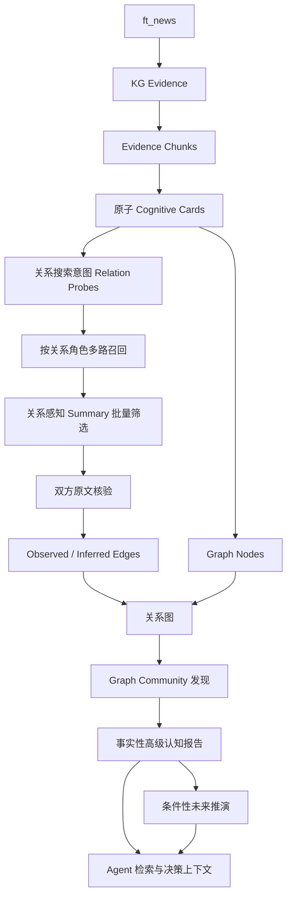
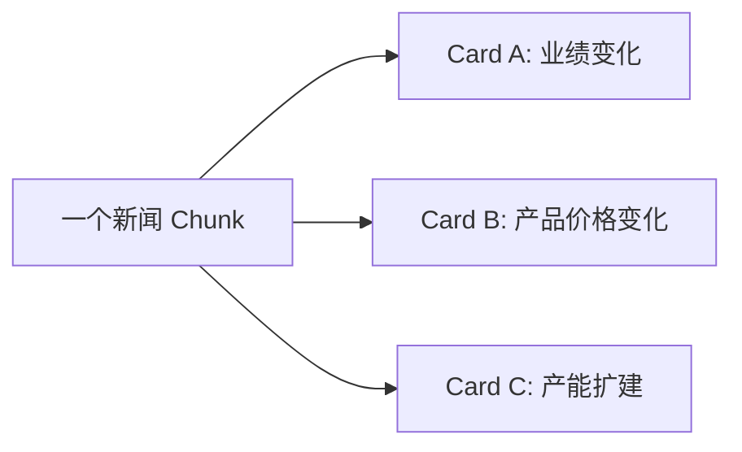
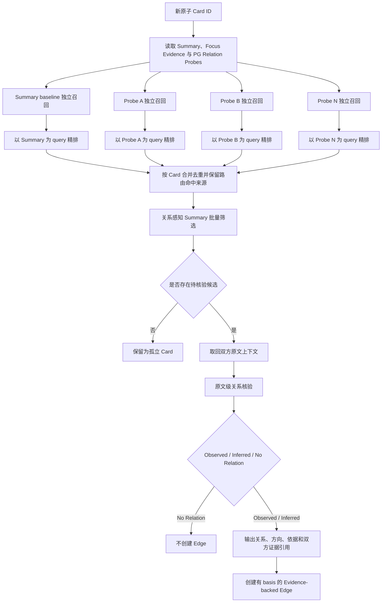
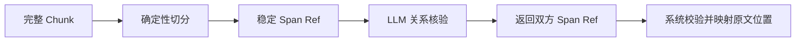
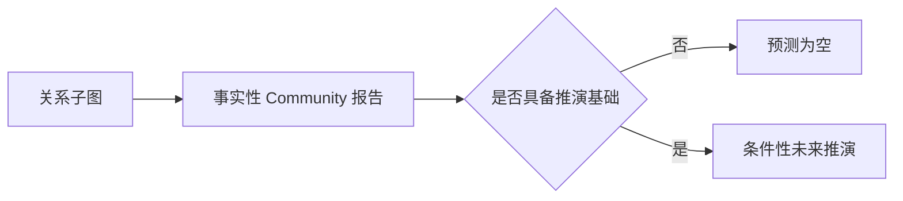
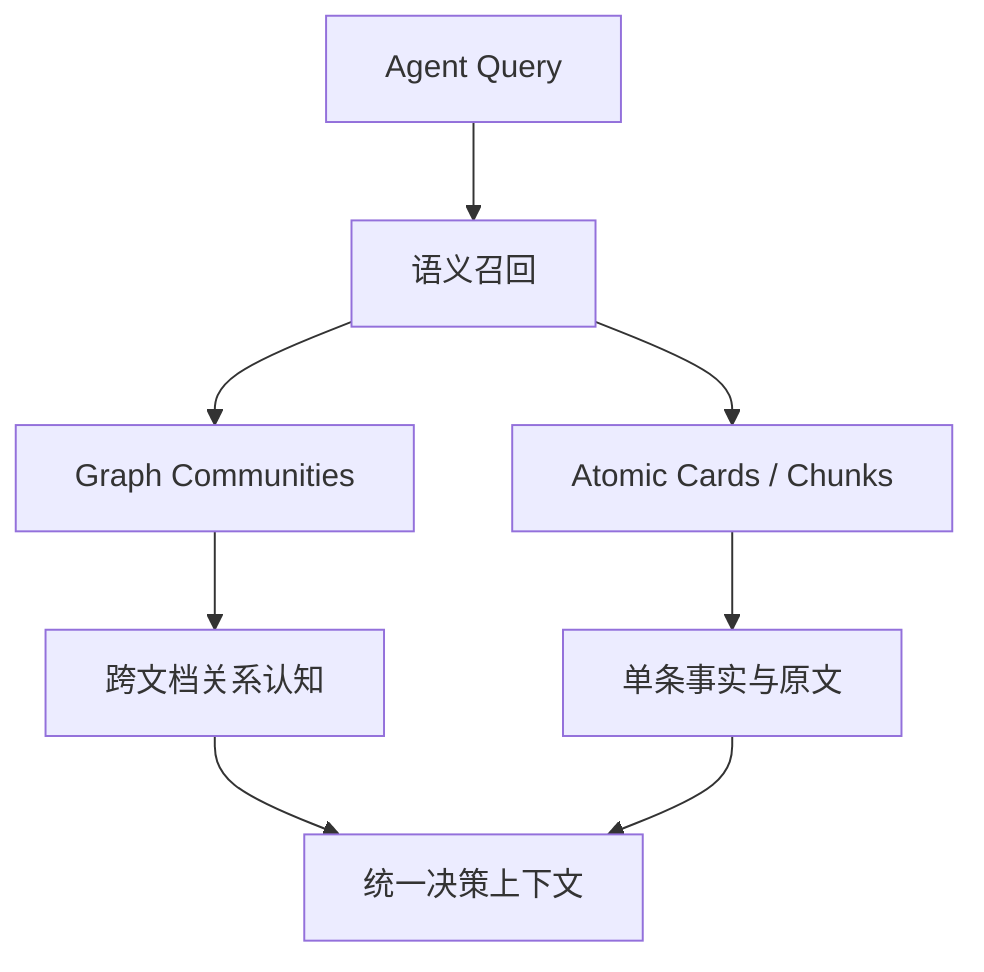

# 关系优先 Graph Community 重构设计方案

## 1. 本文定位

本文定义知识图谱高级认知链路重构后的目标形态，重点回答以下问题：

- 为什么现有“先建立主题 Community，再把 Cognitive Card 归档进去”的方向无法稳定产出高级认知；
- Cognitive Card 在新架构中应承担什么职责；
- 新材料如何通过 Relation Probe、关系角色召回、关系感知 Summary 筛选和原文核验建立可追踪关系；
- `kg_graph_communities` 如何从真实关系图中产生，而不是作为预先存在的主题收容目录；
- 已观察事实、跨材料认知和未来条件性推演如何在同一个 Graph Community 中保持边界；
- 哪些旧能力应退出，哪些历史数据不再迁移。

本文是关系优先 Graph Community 的最新设计基线。以下文档记录的是旧的主题归档路线，仅作为历史背景，不再作为目标架构：

- `16. Community Topic高维信号提取验证方案.md`
- `17. Seed Community Topic与归档Prompt优化方案.md`
- `18. Community Assignment候选上下文账本缓存优化实施方案.md`
- `20. Community Graph写入性能优化设计方案.md`
- `21. Community Insight高级认知索引设计方案.md`

本文只描述目标架构、对象职责、核心流程和验收边界。表结构、模块拆分、迁移脚本、任务注册、测试用例和运行方式应在对应实施方案中说明。

## 2. 背景问题

### 2.1 最终目标不是新闻分类

知识图谱高级认知层的目标不是把新闻整理进不同主题目录，而是帮助 Agent 获得单条文档无法独立提供的跨文档认知，包括：

- 同一事件的持续演化；
- 不同来源对同一事实的相互印证或冲突；
- 政策、供需、价格、产能、订单和企业经营之间的传导关系；
- 多个局部事件共同呈现出的阶段性状态；
- 在事实关系已经成立的基础上形成有条件、有验证指标的未来推演。

如果高级认知层只能说明“一批新闻都与半导体有关”，那么它仍然只是分类器，没有解决跨文档深层理解问题。

### 2.2 现有 Community 的证明对象错误

现有链路证明的是：

```text
Card A 与 Community C 有关
Card B 与 Community C 有关
```

但高级认知报告需要的是：

```text
Card A 与 Card B 之间存在可解释、可回溯的关系
```

前者不能推出后者。两个 Card 即使都与同一产业有关，也可能在事件主体、时间阶段、传导机制和实际影响上完全无关。

因此，现有 Community 的成员关系本质上是一个以主题为中心的星形归档关系：Card 只与主题发生联系，Card 之间没有关系证明。后续报告生成器面对的是一组主题相似但逻辑关系未知的材料，只能在最后一步临时猜测因果、递进、印证或冲突，容易形成以下问题：

- 把领域相似误写成因果关系；
- 把不同主体的事实拼成同一条事件链；
- 把局部供需变化扩大为全产业链判断；
- 把研报观点、短期行情和已发生事实混合表达；
- 为了形成完整报告而强行连接本来无关的材料。

这不是单纯的 Prompt 质量问题，而是上游数据组织方式无法提供关系事实。

### 2.3 重构原则

目标链路必须从：

```text
先建立主题目录，再把 Card 对号入座
```

调整为：

```text
先证明原子事件之间的关系，再从关系图中发现 Community
```

Community 不再是输入和收容规则，而是关系图计算后的结果。

## 3. 系统定位

重构后，知识链路分为三个层次：

1. **事实与原文层**
   - 保存新闻来源、Evidence、Chunk 和可精确取回的原文；
   - 负责事实追踪，不承担跨文档推理。

2. **原子认知与关系层**
   - 将 Chunk 提炼成一个或多个原子 Cognitive Card；
   - 从原子事件生成面向不同关系角色的搜索意图；
   - 通过关系感知候选生成和 Summary 批量筛选发现待核验对象；
   - 通过双方原文区分观测关系、推断关系和无关系；
   - Cognitive Card 构成图节点，经过核验的关系构成图边。

3. **Graph Community 高级认知层**
   - 从有效关系构成的子图中发现 Community；
   - 基于节点、边和双方证据生成可直接交付 Agent 的完整认知报告；
   - 在事实报告之外表达条件性未来推演。



## 4. 目标系统形态

### 4.1 不再保留主题目录

系统不再维护一套预先定义或逐步创建的主题 Community，也不再让新 Card 在 `attach_existing`、`create_new` 和合并动作之间做归档裁决。

重构后的 `kg_graph_communities` 只有一种来源：从已经建立关系的图节点和图边中发现。

因此系统中不再存在两种 Community，也不再区分“主题 Community”和“关系 Community”。只有关系图产生的 Graph Community 才是真实 Community。

### 4.2 不再保留独立 Insight 层

高级认知报告不再写入单独的 Community Insight 对象。

`kg_graph_communities` 本身就是最终高级认知产物，应同时表达：

- 当前关系子图包含哪些原子事件；
- 哪些经过核验的关系把这些事件连接在一起；
- 子图中哪些节点是核心节点；
- 多条材料合在一起形成了什么新增认知；
- 在事实基础上可以形成哪些条件性未来推演。

具体字段在实施设计中确定，本文不固化旧表字段，也不要求延续旧 `metrics` 结构。

### 4.3 没有有效 Edge 的 Card 不进入 Community

Card 本身没有“强关系”或“弱关系”属性。关系强度也不能由 Embedding 分数、rerank 名次或 Summary 筛选结果直接决定。系统只判断某一对 Card 是否经过原文核验形成有效 Edge。

最终关系核验只有三种业务结果：

- Observed Relation：创建带双方证据的正式 Edge；
- Inferred Relation：创建带双方证据、机制推理和明确 basis 的正式 Edge；
- No Relation：不创建 Edge。

如果一个 Cognitive Card 没有任何通过核验的 Edge，它就是孤立 Card，不参与 Graph Community 发现。它不是低质量 Card，也不代表内容不重要，只表示当前知识库中还没有找到足够可靠的关系对象。

这类材料仍然可以：

- 被后续新 Card 召回；
- 在未来出现新证据后建立关系；
- 被 Agent 通过 Card 或 Chunk 检索直接阅读。

以下情况应判定为 No Relation，而不是创造“弱 Edge”：

- 只有主题、行业、公司或关键词相似；
- 只能说可能相关，但无法描述具体关系类型和机制；
- 主体、对象、时间或事件阶段无法对齐；
- 双方证据引用不完整；
- 推断依赖无法解释或无法审计的外部假设。

因此第一版不需要额外设计 `weak_relation` 状态。系统不为了提高 Community 覆盖率而强行建立 Edge，也不为了生成报告而强制聚合孤立材料。

## 5. Cognitive Card 设计

### 5.1 一个 Card 只表达一个原子事件或事实主张

Cognitive Card 不再代表整篇新闻或整段 Chunk 的综合主题。一个 Card 必须尽量只表达一个可以独立比较、独立建立关系的事件或事实主张。

如果一篇新闻同时包含业绩增长、产品涨价和产能扩建，应提取为三个独立 Card，而不是生成一个混合 Summary。



原子化必须发生在进入语义召回之前。如果先用混合 Summary 召回，再在关系核验阶段拆分，召回和 rerank 已经被多个事件共同污染，后续无法可靠恢复。

### 5.2 Summary 是原子事件的检索表达，不是最终证据

新版本 Cognitive Card 以简洁、忠实的 Summary 为主要语义检索材料。Summary 的职责是：

- 减少新 Card 与大量历史 Card 比较时的上下文成本；
- 支持同一事件、相似事实和同义表达的直接召回；
- 作为关系搜索意图生成的事实基础；
- 支持关系感知 LLM 对候选进行低成本批量筛选。

Summary 不承担最终关系证明职责，不能直接作为正式 Edge 的事实依据。

### 5.3 Card 字段遵循按需最小化

旧 Card 中大量字段服务于主题归档，例如父主题、宽中细粒度主题、候选标题和未来收容范围。这些字段不再具有目标架构价值，应退出核心 Card。

新 Card 只保留当前链路确定需要的内容：

- 稳定 Card 身份；
- 来源、Evidence 和 Chunk 指针；
- 原子事件 Summary；
- 指向该原子事件原文依据的焦点证据引用；
- 用于跨 Chunk 关系候选发现的 Relation Probe；
其他字段只有在后续真实流程明确消费时才增加，不为可能的未来需求提前堆积标签。

### 5.4 Relation Probe 是搜索假设，不是 Card 事实

关系发现不能只用新 Card Summary 搜索相似文本。系统需要根据新 Card 的事实内容生成多个面向关系角色的搜索意图，称为 Relation Probe。

Relation Probe 在 Card 提取阶段与原子事实、同 Chunk Relation 一次生成，并作为 Card manifest 的一部分写入 PostgreSQL。这样模型可以在理解原文和划分 Card 的同一上下文中提出关系搜索方向，跨 Chunk Relation Discovery 重试时也能得到稳定输入，不需要再调用一次 Probe Planning LLM。Probe 不写入 Milvus，也不属于已经成立的事实或 Edge。

#### 5.4.1 稳定的是关系角色目录，不是固定 Probe 套餐

系统维护一组领域通用的关系搜索角色，用于约束 Relation Probe 的方向和后续召回通道。第一版关系角色包括：

| 关系角色 | 需要寻找的历史事件 |
| --- | --- |
| `same_event` | 同一事件、同一事实、状态更新、后续进展或前序披露。 |
| `upstream` | 当前事件可能依赖的原因、条件、驱动或前置事件。 |
| `downstream` | 当前事件可能带来的结果、影响、传导或状态变化。 |
| `confirmation` | 对当前事实提供独立确认、补充证据或一致口径的材料。 |
| `contradiction` | 与当前事实相反、构成反证、限制条件或失效状态的材料。 |

这些角色是稳定的搜索语义，不是要求每个 Card 必须执行的固定流程。对每个原子 Card，模型需要动态决定：

- 哪些关系角色适用于当前事件；
- 不适用的角色是否应直接跳过；
- 每个适用角色需要一个还是多个具体搜索表达；
- 某些相近搜索方向是否应合并，避免重复召回。

因此不同 Card 可以产生不同数量和组合的 Relation Probe。信息简单、缺少可扩展关系方向的 Card 可以不生成额外 Probe；复杂政策、供需变化或连续事件可以生成多个角色、多个方向的 Probe。

原始 Summary 语义召回是所有 Card 都可以使用的基础候选通道，不依赖额外 Probe。Relation Probe 负责补充普通相似度检索难以发现的上游、下游、支持和冲突关系。即使某个 Card 没有额外 Probe，它仍然可以通过 Summary 被后续 Card 召回，也不会从知识库中消失。

#### 5.4.2 Probe 在 Card 提取时生成并持久化

链路按以下顺序处理每个新 Card：

1. Card 提取模型依据当前 Card 的 Summary 与 Focus Evidence 判断哪些关系角色具有搜索价值；
2. 只为适用角色生成具体 Relation Probe，并与 Card manifest 一起写入 PG；
3. 跨 Chunk 关系发现从 PG 读取 manifest，从 Milvus 精确取回 Summary 与 Focus Evidence；
4. 建立 Summary baseline 和各条 Probe route，分别进入召回与精排。

Probe 与 Card 事实保持字段隔离。模型只能为当前 Card 规划搜索方向，不能把同 Chunk 其他 Card 的事实混入 Probe，也不能把搜索假设升级为事实。跨 Chunk 阶段只消费 Probe，不重新生成或修改 Probe。

#### 5.4.3 Probe 必须描述待寻找事件，而不是断言结果

一个合格的 Relation Probe 应描述“希望在历史 Card 中找到什么样的事件”，并保留足够具体的主体、对象、动作或传导变量。

以下表达不合格：

- “查找相关内容”；
- “查找类似新闻”；
- “查找行业影响”；
- 直接断言某个尚未核验的因果结果必然发生。

Probe 可以提出可能的关系方向，但只能作为候选搜索假设。它不能把可能影响、可能原因或可能冲突写成 Card 已经确认的事实。

在数据形态上，Card 的事实内容与 Relation Probe 必须保持逻辑隔离：

- Summary、事实锚点和焦点证据引用描述原文已经表达的内容；
- Relation Probe 描述后续可以向哪些关系方向搜索；
- Probe 可以随生成策略和模型版本重新构建，不能反向修改 Card 事实；
- Probe 应按原子 Card 分别生成，不能把同一 Chunk 中其他 Card 的事件混入当前 Probe。

Relation Probe 的角色也不等于最终 Edge 类型。通过 `downstream` Probe 召回的候选，原文核验后可能形成 Inferred Relation、Observed Relation、其他关系类型或 No Relation。最终裁决可以修正 Probe 预设的关系方向。

### 5.5 Card 本身就是图节点

所有原子 Cognitive Card 都是潜在图节点，包括暂时没有关系的孤立 Card。

第一版不需要为了图结构再复制一份语义相同的 Node 内容。关系边可以直接引用 Cognitive Card 身份。这样可以保证：

- 当前孤立的事件仍能被未来材料召回；
- Card、原文证据和图节点身份保持一致；
- 不增加 Card 与 Node 双份状态同步问题。

只有具有有效关系的 Card 才参与 Community 发现，但不存在“没有 Edge 就丢弃 Card”的行为。

## 6. 关系候选生成与两阶段裁决

### 6.1 这是 Link Prediction，不是普通文档检索

普通 RAG 和通用 reranker 主要回答“候选内容与查询是否相关”。关系发现需要回答的是“两个原子事件之间是否可能形成某种关系”。两者目标不同。

主题、词汇或语义相似适合发现同一事件和同类事实，但难以稳定发现：

- 上游变化与下游结果；
- 政策变化与远端企业经营；
- 供需变化与价格、成本、利润传导；
- 用词不同但指向同一事实的支持或冲突；
- 需要通过中间机制理解的隐含联系。

因此，普通语义检索只能作为关系候选生成的一条通道，不能作为关系发现的唯一入口。新链路应按 Link Prediction 目标设计：先提出可能的关系方向，再寻找能够填入该关系角色的历史事件。

### 6.2 总体流程

每个新原子 Card 独立执行以下关系发现流程：



### 6.3 消费按关系角色生成的 Relation Probes

Card 提取阶段应根据当前 Card Summary 与 Focus Evidence，仅生成对当前事件有意义的 Relation Probes，而不是机械地为每个 Card 生成全部关系类型。跨 Chunk 关系发现阶段读取已持久化的 Probe，并根据当前索引能力选择执行哪些通道，不再生成第二份搜索计划。

例如，一个出口限制事件可以产生以下搜索方向：

- 同一限制政策的前序公告、执行进度或范围变化；
- 促成该限制的政策、供需或安全背景；
- 供应减少、价格变化、下游成本上升或生产受限等可能结果；
- 其他来源对限制范围和执行时间的确认；
- 限制取消、放宽、未执行或实际供应未受影响的相反材料。

这些搜索方向用于改变召回目标：系统不再只搜索“与出口限制文本相似的新闻”，还会搜索“可能处于该事件上游、下游、支持面或冲突面的事件”。

Probe 应保持关系语义通用，不写死具体行业规则。它描述的是关系角色，不是预先断言关系已经成立。

### 6.4 每个 Relation Probe 独立召回和精排

每个 Relation Probe 都代表一个不同的关系搜索问题。系统应以 Probe 的搜索表达作为 query，独立执行候选召回和 rerank，再保留该 Probe 下排名靠前的历史 Card。

例如，同一个新 Card 可以形成三条独立链路：

```text
same_event_probe
  -> 召回同一政策的历史和后续 Card
  -> 以“是否回答同一事件进展”为目标精排

downstream_probe
  -> 召回供应、价格、成本和生产变化 Card
  -> 以“是否可能承接下游影响”为目标精排

contradiction_probe
  -> 召回政策放宽、执行变化和供应未受影响 Card
  -> 以“是否可能构成冲突或反证”为目标精排
```

候选生成可以使用以下互补信息：

1. **原始 Summary 语义召回**
   - 发现同一事件、相似事件和同义改写。

2. **关键词和事实锚点召回**
   - 保护主体、产品、政策、指标、数字和动作等精确信息。

3. **同一事件与更新 Probe**
   - 寻找前序报道、执行进度、状态变化和后续结果。

4. **上游原因 Probe**
   - 寻找可能构成当前事件背景、条件或驱动的历史事件。

5. **下游影响 Probe**
   - 寻找可能承接当前事件影响的价格、供给、需求、订单、成本、产能和经营变化。

6. **支持与冲突 Probe**
   - 寻找围绕同一事实对象的独立确认、不同口径、相反结论和约束条件。

7. **已有图邻居扩展**
   - 当某个历史 Card 已被召回时，补充其直接邻居，发现纯文本召回难以覆盖的局部链式关系。

各 Probe 必须先完成自己的召回和精排，再按 Card 身份合并去重。不能先把所有召回结果混在一起做一次通用精排，否则高频的同一事件和语义相似候选仍可能挤掉数量较少但更有价值的上游、下游和冲突候选。

同一个历史 Card 可能被多个 Probe 命中。合并去重时不能只保留一条结果，而应保留：

- 命中过该 Card 的 Relation Probe；
- 每个 Probe 的关系角色；
- 每个 Probe 内部的召回和 rerank 结果；
- 用于后续筛选的统一 Card Summary 和事实锚点。

这些命中来源用于告诉第一阶段 LLM“系统为什么认为该候选值得检查”，但不代表关系已经成立。

候选数量是成本预算，不是固定业务真理。具体预算应由关系召回评测确定，文档不再把单一 Top-K 写成正确性边界。

### 6.5 reranker 负责 Probe 内部排序，不负责关系裁决

reranker 的 query 是当前 Relation Probe，documents 是该 Probe 召回的历史 Card Summary。它负责回答“哪些候选更可能满足这个关系搜索问题”，用于 Probe 内部排序和候选预算控制。

reranker 仍然会影响进入后续阶段的候选范围，因此每个 Probe 需要独立保留合理候选配额。但 reranker 结果不是正式关系结论，也不能跨 Probe 使用一个统一排名作为不可逆硬门槛。

原因是通用 reranker 仍然主要优化查询与文档相关性，可能把以下真实候选排低：

- 文本主题不同但存在上下游传导；
- 主体不同但共享同一约束变量；
- 措辞相反、实际构成冲突的材料；
- 通过已有图路径才能理解的局部关系。

因此候选预算控制应保留 Probe 多样性，并允许根据分数断层和候选密度动态调整。关系感知筛选之前，不应机械地使用一个全局固定名次截断全部 Probe。

### 6.6 Summary 筛选必须以关系为判断目标

Summary 筛选以“一个新 Card”为批次单位，一次向 LLM 提供：

- 新 Card Summary；
- 候选 Card Summary；
- 候选被哪些 Relation Probe 命中，以及对应关系角色；
- 必要的事实锚点。

该阶段不再判断普通语义相关性，而是综合多个 Probe 命中信息，回答：候选事件是否可能与新事件形成指定或其他明确关系，是否值得进入昂贵的原文核验。

筛选阶段：

- 可以返回零个、一个或多个候选；
- 不强制为了继续流程而选出候选；
- 不创建正式关系；
- 不输出完整证据；
- 不输出长篇解释；
- 不把筛选判断作为最终关系事实；
- 不要求候选必须符合 Probe 的预设方向，模型可以纠正关系方向或判定无关系。

一个 Chunk 拆出的多个新 Card 应分别进行批量筛选。第一版不把多个新 Card 与各自候选组成大型交叉矩阵，避免候选串线和裁决对象混淆。

### 6.7 原文核验是正式 Edge 的唯一入口

只有原文核验阶段可以创建 Edge。

该阶段需要同时读取：

- 新 Card 的 Summary 和焦点证据位置；
- 候选 Card 的 Summary 和焦点证据位置；
- 双方 Primary Chunk 的完整文本上下文；
- 必要时双方明确依赖的相邻 Chunk 或额外支持 Chunk。

完整 Chunk 用于理解主体、否定、条件、时间和上下文，但裁决对象始终是两个指定的原子 Card，而不是 Chunk 中的全部事件。

原文取回遵循“足够理解、避免无界扩张”的原则：

1. 默认取完整 Primary Chunk；
2. 原子事件跨 Chunk 时，取其明确引用的支持 Chunk；
3. 上下文不完整时，可以补充前后相邻 Chunk；
4. 默认不读取整篇新闻的全部 Chunk；
5. 不因为同一新闻还包含其他 Card，就把其他 Card 自动加入本次裁决。

### 6.8 最终裁决必须区分三种结果

关系核验不是“解释为什么它们有关系”，而是先判断关系是否真的成立，并区分：

1. **Observed Relation**
   - 仅根据双方原文就能完成事实对齐并判定关系，不需要补充未出现的中间机制；
   - 包括同一事件、后续更新、相同事实的独立印证、直接冲突，以及原文明示的影响或约束关系。

2. **Inferred Relation**
   - 双方原文分别证明两个端点事实；
   - 关系由模型根据已有事实和可解释机制推导，但原文没有直接声明该关系；
   - 必须明确保存推理依据，不能包装成原文已经证明的事实。

3. **No Relation**
   - 原文不足以建立可靠关系；
   - 不创建 Edge。

以下情况必须输出 No Relation，不能创建正式 Edge：

- 只有行业、公司或关键词相似；
- 只是同属一个宽泛领域；
- 只有可能相关，但无法说明具体关系机制；
- 关系只能依赖无法解释或无法审计的外部常识；
- 主体、时间或对象无法对齐；
- Summary 看似相关，但原文显示含义不同。

如果外部知识能够形成清晰机制，但双方原文只证明端点事实，最多建立 Inferred Relation，不能建立 Observed Relation。

### 6.9 关系模型的演进方向

LLM 关系筛选和原文裁决不仅用于当前写入，也会持续产生关系学习数据：

- 新 Card 与候选 Card；
- 触发候选的 Relation Probe；
- Summary 阶段保留或拒绝结果；
- 原文阶段的 Observed、Inferred 或 No Relation 结论；
- 最终关系类型、方向、依据和证据引用。

这些数据经过质量审查后，可以用于训练面向关系发现的专用模型：

1. **Relation Bi-Encoder**
   - 学习两个事件是否可能形成关系；
   - 替代只学习文本相似度的通用向量召回目标。

2. **Relation Cross-Encoder**
   - 对事件对进行关系感知精排和关系类型判断；
   - 替代通用 reranker 的相关性评分目标。

在专用模型具备足够训练数据前，Relation Probe 与 LLM 批量筛选承担冷启动关系发现职责。长期方向不是无限扩大普通 RAG 候选池，而是让召回和排序目标逐步与 Link Prediction 对齐。

## 7. 证据坐标设计

### 7.1 不让 LLM 计算字符偏移量

直接要求 LLM 输出字符起止位置容易受到空格、换行、标准化和模型计数误差影响，不能作为稳定证据坐标。

系统应在发送原文前，把 Chunk 预切分为带稳定引用编号的句子或短段落。LLM 只返回引用编号，系统再映射回原文、Chunk 和真实 offset。



### 7.2 Edge 必须拥有双方证据和关系依据

一条正式 Edge 至少需要能够回答：

- 哪两个 Card 被连接；
- 关系是什么，是否有方向；
- 为什么可以建立该关系；
- 新 Card 的哪段原文支持该判断；
- 历史 Card 的哪段原文支持该判断；
- 该 Edge 属于 Observed Relation 还是 Inferred Relation；
- 裁决置信度是多少。

只保存关系理由而没有双方原文引用，不能视为可验证 Edge。只引用一侧原文也不足以建立两个事件之间的关系。

对于 Observed Relation，必须能够仅凭双方原文完成事实对齐和关系判定。对于 Inferred Relation，双方原文证明的是两个端点事实，关系本身由额外机制推理产生。系统必须保留这个差异，不能把端点证据描述成对隐含因果的直接证明。

### 7.3 关系类型是核心语义，不是可选标签

如果所有边都退化为 `related_to`，系统仍然只能知道“这些事件可能有关”，无法形成事件演化和传导链。

第一版至少需要覆盖以下通用关系语义：

- 同一事件或同一事实的延续与更新；
- 不同来源之间的支持或印证；
- 事实或观点之间的冲突；
- 时间上的先后与阶段演化；
- 原因、促进、影响或传导；
- 依赖、条件或约束。

关系类型应保持领域通用，不写死自然灾害、半导体、资金面等具体业务词。

### 7.4 关系依据与未来预测必须分离

Observed Relation 和 Inferred Relation 都描述当前已经出现的两个事实节点之间的联系，区别在于关系是否被原文直接陈述。

未来预测描述的是尚未发生的可能结果，不属于当前关系事实。三者边界如下：

| 类型 | 两端事实是否已发生 | 是否仅凭双方原文即可判定 | 是否属于预测 |
| --- | --- | --- | --- |
| Observed Relation | 是 | 是 | 否 |
| Inferred Relation | 是 | 否，由机制推导 | 否 |
| Projection | 至少一端尚未发生 | 不适用 | 是 |

Relation Probe 只负责寻找候选，既不是 Inferred Relation，也不是 Projection。只有完成原文核验后，候选才可能成为正式 Edge。

## 8. 增量关系图生命周期

### 8.1 增量证据录入完成条件

一条新闻完成高级认知写入，不等于它一定创建了 Community。第一阶段完成条件是：

- Evidence 和 Chunk 已写入；
- 原子 Cognitive Card 已提取并可检索，同 Chunk Edge 已完成写入；
- Relation Probe 已随 Card manifest 持久化，跨 Chunk Relation Discovery 已完成多路候选召回和关系裁决；
- 新 Card 已完成候选召回和关系裁决；
- 成立的关系已生成 Evidence-backed Edge；
- 不成立的候选没有留下模糊关系；
- 图发生变化时已发出后续处理事件。

没有找到关系的 Card 仍然是成功写入，不属于异常或失败。

### 8.2 图变化事件

当新增 Card 或 Edge 改变关系图时，写入链路应向异步处理链路发布图变化事件。事件用于说明受影响的节点和边，不承载完整原文。

该事件只表示“关系图发生了变化”，不直接决定 Community，也不在同步新闻写入过程中生成完整高级认知报告。

### 8.3 Community 构建异步解耦

Graph Community 的发现和报告更新由异步任务完成，避免关系核验和大范围图分析阻塞单条新闻写入。

第一版可以优先处理受新增节点或边影响的关系区域。周期性全局校验、复杂增量图算法和社区稳定性治理属于后续实施选型，不在本文固化。

## 9. Graph Community 发现

### 9.1 Community 是有效关系组成的连通子图

Graph Community 的成员必须通过经过原文核验的 Edge 连接。主题相似但没有有效 Edge 的 Card 不能仅凭相似度进入 Community。

Observed Relation 和 Inferred Relation 都可以进入关系图，但必须保留各自的 basis。Community 发现和报告不能把 Inferred Relation 降格为普通事实，也不能在汇总时抹掉其推理性质和不确定性。

Community 的基本关系形态可以是：

- 多个节点共同指向一个核心事件；
- 同一事件的连续更新；
- 多来源相互印证；
- 政策、供需、价格、产能、订单和经营结果形成的链式传导；
- 支持与反证共同构成的争议结构。

### 9.2 核心节点不等于 Community 的唯一形态

第一版可以使用唯一邻居数量识别候选核心节点，但不能规定“没有高连接中心就不能形成 Community”。

以下链式结构同样具有高级认知价值：

```text
政策发布 -> 企业扩产 -> 订单增长 -> 利润变化
```

因此：

- Community 由关系连通性决定；
- 核心节点用于排序、命名和组织报告；
- 核心节点不是 Community 存在的必要前提；
- 简单入度只有在 Edge 方向语义明确时才有意义，第一版更适合先看唯一邻居数量。

### 9.3 第一版复杂度边界

第一版暂不引入以下复杂治理能力：

- 转载和重复新闻对中心性的修正；
- 来源质量和来源多样性加权；
- 时间衰减和边老化；
- PageRank、介数中心性等复杂图指标；
- 复杂的 Community 稳定性、拆分和合并治理；
- 不同关系类型的动态权重学习。

这些能力在真实数据暴露明确问题后再引入，不作为第一版上线前置条件。

但以下底线不属于复杂优化，第一版必须满足：

- 不创建自连接；
- 不重复写入同一语义关系；
- Edge 只能来自原文核验；
- Edge 必须有双方有效证据引用；
- Edge 必须明确标识 Observed 或 Inferred basis；
- 无法确认关系时不建边；
- 孤立 Card 不强制进入 Community。

## 10. Graph Community 高级认知报告

### 10.1 报告直接属于 Community

系统不再创建独立 `kg_community_insights`。Graph Community 的报告应直接基于当前关系子图生成，并作为 Community 的可检索内容交付 Agent。

报告不是节点摘要的拼接，而是对已确认关系的自然语言表达，应说明：

- 当前子图共同揭示了什么状态；
- 核心事件是什么；
- 不同节点如何印证、更新、冲突或传导；
- 哪些关系由原文直接支持，哪些属于基于端点事实的机制推断；
- 哪些结论是明确事实，哪些只是来源观点；
- 哪些约束会改变当前关系链的解释。

由于关系已经在上游建立并具有证据，报告生成器的职责是表达和综合关系图，而不是在一组扁平材料中重新发明关系。

### 10.2 Community 报告不重新决定成员关系

报告生成阶段不能：

- 为了让报告完整而新增成员；
- 根据写作需要创造 Edge；
- 把孤立 Card 临时放进报告；
- 在报告内部重新分类或拆分主题；
- 用预测反向修改事实图。

发现关系图存在问题时，应回到关系裁决层修复，不能让报告层为上游兜底。

## 11. 条件性预测层

### 11.1 预测属于 Community，但不属于事实图

不再设置独立 Insight 后，未来推演可以作为 Graph Community 的组成部分保存和检索，但必须与已观察事实明确分离。

一个 Community 在认知上包含两个层次：

1. **已发生事实与当前关系**
   - 核心节点；
   - Observed Relation 与 Inferred Relation；
   - 事件演化和传导链；
   - 来源支持与冲突。

2. **条件性未来推演**
   - 在什么条件持续时，什么结果的概率会上升；
   - 后续可以观察哪些指标；
   - 哪些条件会使推演失效；
   - 推演适用的时间范围。

预测内容不能成为事实 Node 或事实 Edge，不能参与 Community 成员归属，也不能被后续模型当成已经发生的新闻。

### 11.2 不是所有 Community 都必须预测

只有当前关系子图已经呈现明确状态变化、阶段演化或传导机制时，才适合生成条件性推演。

以下情况应允许预测为空：

- 只有同一事实的重复确认，没有变化方向；
- 只有少量重复确认，尚未形成状态变化、传导机制或可推演方向；
- 缺少可以继续观察的条件和指标；
- 未来判断必须依赖输入之外的知识；
- 无法确定合理时间范围。

### 11.3 事实报告与预测应分阶段生成

Community 更新时，应先根据关系图生成事实性报告，再基于事实报告和已确认关系生成条件性推演。



即使由同一个异步任务调度，也应保持两个认知步骤的边界，避免预测措辞污染事实总结。

## 12. Agent 检索形态

重构后的 Agent 检索保留两类入口，不再提供主题目录入口：

1. **Graph Community 检索**
   - 面向跨文档问题、事件演化、传导关系和条件性推演；
   - 返回可以直接阅读的高级认知报告，并携带节点和 Edge 引用。

2. **Card / Chunk 检索**
   - 面向单条事实、孤立事件和原文核验；
   - 当材料尚未形成有效关系时，Agent 仍可直接获取原始 Card 或 Chunk。



Community 检索结果不一定需要自动回源到全部 Evidence 后才能交付，因为 Community 报告本身就是基于已核验 Edge 生成的派生认知。但系统必须保留节点、边和证据引用，使 Agent 在需要时可以继续展开核验。

## 13. 旧能力退出与历史数据处理

### 13.1 退出的旧能力

重构完成后，以下能力不再属于目标系统：

- Seed Community Topic；
- Community 收容规则；
- Community Assignment；
- `attach_existing`、`create_new`、`create_parent_and_absorb_existing`；
- Assignment Candidate Ledger；
- Assignment bucket planning 和相关并发写锁；
- 基于 Community 候选文档的归档召回与 rerank；
- 独立 Community Insight 扫描、刷新和存储；
- 为主题目录服务的 Cognitive Card 标签字段；
- 基于旧 Community 成员集合生成报告的链路。

### 13.2 历史数据不迁移

旧 `kg_graph_communities` 的成员缺少成员间关系证据，不能转换为新关系 Community。旧 Assignment 和 Insight 也不能作为新 Edge 的事实来源。

因此重构采用重新构建策略：

- 清除旧 Community、Assignment、Insight 及其语义索引；
- 保留仍然可信的新闻、Evidence 和 Chunk；
- 按新 Card 规范重新提取原子事件；
- 重新执行关系召回、原文核验、建边和 Community 发现；
- 不编写把旧主题归档结果直接迁移为新关系图的兼容逻辑。

## 14. 核心设计判断

### 14.1 关系成立先于 Community 成立

Card 不能因为属于同一行业或主题就进入同一个 Community。Community 只能消费已经核验的关系，不能反过来替关系背书。

### 14.2 关系搜索意图解决目标错位

普通检索寻找相似文本，关系发现寻找可能处于不同关系角色的事件。Relation Probe 将同一事件、上游原因、下游影响、支持和冲突转化为不同搜索方向，使候选生成目标从文本相关性转向关系可能性。

### 14.3 Summary 优先解决规模问题，原文负责最终真实性

Summary 和事实锚点用于降低候选比较成本；原文用于确认主体、对象、时间、限定条件和关系 basis。两者不能相互替代。

### 14.4 原子化先于召回

如果一个 Card 混合多个事件，关系搜索意图、候选召回和关系裁决都会受到污染。原子事件必须在 Card 提取阶段形成。

### 14.5 reranker 按 Probe 精排，不承担关系裁决

每个 Relation Probe 独立召回并以自己的搜索问题完成 rerank，之后才合并候选。reranker 负责 Probe 内部排序和预算控制；关系感知 Summary 筛选和原文核验才承担关系裁决职责。

### 14.6 报告表达关系，不发明关系

高级认知报告只能表达图中已有的节点、Edge 和证据。报告质量应主要由关系图质量决定，而不是依赖 Prompt 在最后一步挽救扁平材料。

### 14.7 推断关系与预测都不能伪装成事实

Inferred Relation 必须保留机制推理边界；未来推演必须保留条件、验证指标、失效条件和时间范围。两者都不能伪装成原文直接陈述的事实。

### 14.8 第一版先建立正确主链路

第一版优先保证：原子 Card、Relation Probe、多路候选生成、关系感知批量筛选、原文核验、双方证据 Edge、关系图 Community 以及 Observed、Inferred、Projection 边界完整跑通。复杂中心性、来源治理和图稳定性在真实问题出现后再优化。

## 15. 系统收益

关系优先架构带来的核心收益是：

- Community 成员之间存在真实、可解释、可回溯的联系；
- 高级认知报告不再依赖模型从扁平材料中猜测关系；
- 同一新闻中的多个事件不会作为一个混合节点污染关系图；
- Relation Probe 能发现普通相似度检索难以覆盖的上游、下游、支持和冲突候选；
- Summary 控制大规模候选筛选成本，原文核验保证关系依据可追踪；
- reranker 在每个 Probe 内发挥精排价值，但不再拥有跨 Probe 的关系裁决权；
- 没有有效 Edge 的孤立 Card 不会稀释 Community；
- Agent 可以同时获得跨文档认知和单条原文事实；
- 条件性预测有明确事实基础，不与已发生事实混淆；
- 旧主题目录相关的大量 Prompt、缓存、分桶和合并复杂度可以退出。

## 16. 验收口径

### 16.1 Card 原子性

- 一条 Card 只表达一个可以独立比较的事件或事实主张；
- 一篇新闻包含多个事件时，能够产生多个独立 Card；
- Card Summary 不混合无直接关系的多个事件；
- Card 可以通过指针回到支持该原子事件的原文位置。

### 16.2 关系质量

- 每个适用 Relation Probe 都能独立观测召回结果和真实关系覆盖率；
- 多路候选合并不会被单一语义相似通道完全占据；
- 每个 Probe 独立精排并保留候选配额，不使用跨 Probe 的统一硬截断；
- 关系感知 Summary 筛选可以批量处理候选并允许返回空结果；
- Summary 筛选结果不会直接写入 Edge；
- 每条 Edge 都来自双方原文核验；
- 每条 Edge 都能回溯双方证据引用；
- 每条 Edge 都明确区分 Observed Relation 和 Inferred Relation；
- 只有主题相似、无法说明具体关系机制的候选不会建边；
- 最终裁决可以稳定输出 No Relation。

### 16.3 Community 质量

- Community 的所有成员都位于有效关系子图中；
- 孤立 Card 不会因为行业或关键词相似被强制加入；
- Community 可以表达中心辐射结构，也可以表达链式传导结构；
- Community 报告中的关系能够回溯到正式 Edge；
- Community 报告不会把 Inferred Relation 写成原文已经证明的关系；
- 报告不创造图中不存在的成员和关系。

### 16.4 预测边界

- 事实报告和条件性预测明确分离；
- 预测不写入事实 Node 或事实 Edge；
- 缺少推演基础时允许不生成预测；
- 生成预测时能够说明成立条件、验证指标、失效条件和适用时间范围。

### 16.5 旧链路退出

- 新写入链路不再依赖 Seed Community、Assignment、Candidate Ledger 和 bucket planning；
- 新 Community 不再由主题收容规则创建；
- 不再生成独立 Community Insight；
- 旧 Community、Assignment、Insight 数据不会混入新关系图。

## 17. 关键待验证问题

以下问题需要在实施和真实数据回放中验证，但不改变本文的架构方向：

1. 一个原子 Card 的 Summary 应保留多少信息，才能兼顾召回率和语义纯度；
2. 事实锚点应保留到什么粒度，才能帮助关系搜索而不重新演变成标签堆积；
3. 不同类型 Card 应生成哪些 Relation Probe，哪些 Probe 应跳过；
4. 各关系召回通道的候选预算如何分配，才能避免单路结果挤占；
5. 关系感知 Summary 筛选应保留多少候选，才能控制原文核验成本而不过早丢失真实关系；
6. Primary Chunk 在什么情况下需要自动补充相邻 Chunk；
7. 稳定 Span Ref 的切分粒度应采用句子还是短段落；
8. Observed Relation 和 Inferred Relation 的裁决一致性是否满足要求；
9. 通用关系类型是否足以表达金融事件中的主要演化和传导；
10. 第一版按连通性形成 Community 时，是否会出现过度碎片化或超大连通分量；
11. Community 报告和条件性预测分别应在什么图变化条件下刷新；
12. Agent 如何在 Community、Edge、Card 和 Chunk 之间完成低成本展开；
13. 何时积累了足够高质量的正负样本，可以训练 Relation Bi-Encoder 和 Cross-Encoder。

这些问题应通过真实新闻回放、关系裁决 Trace 和 Agent 检索任务评估，不应使用特定领域关键词硬编码结论。

## 18. 和实施文档的关系

后续实施方案需要基于本文进一步明确：

- 原子 Cognitive Card 的提取契约；
- 事实锚点与 Relation Probe 的生成契约；
- 按关系角色组织的多路候选召回；
- Relation Probe 独立召回、精排、候选配额和合并去重规则；
- 关系感知 Summary 批量筛选链路；
- 原文上下文包络和 Span Ref 生成方式；
- Observed、Inferred、No Relation 核验契约和 Edge 生命周期；
- 关系裁决数据如何沉淀为专用关系模型训练集；
- 图变化事件与异步 Community 构建任务；
- `kg_graph_communities` 的新数据形态和 Milvus 检索材料；
- 旧 Assignment、Insight、Seed、账本和分桶代码的删除范围；
- 历史数据清理与全量重建边界；
- 单元测试、真实数据回放和 Langfuse 观测方案。

实施过程中如出现与本文不一致的降级、兼容或临时方案，必须记录在知识图谱实施目录对应的 `9. 待优化.md`，不能把部分实现表述为本文目标已经完成。
