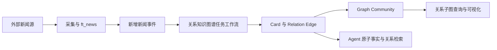
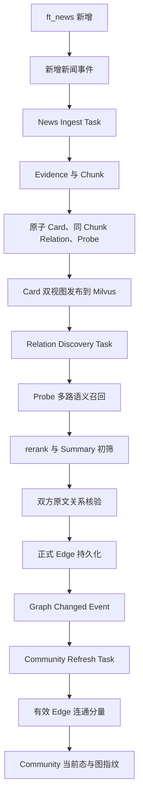
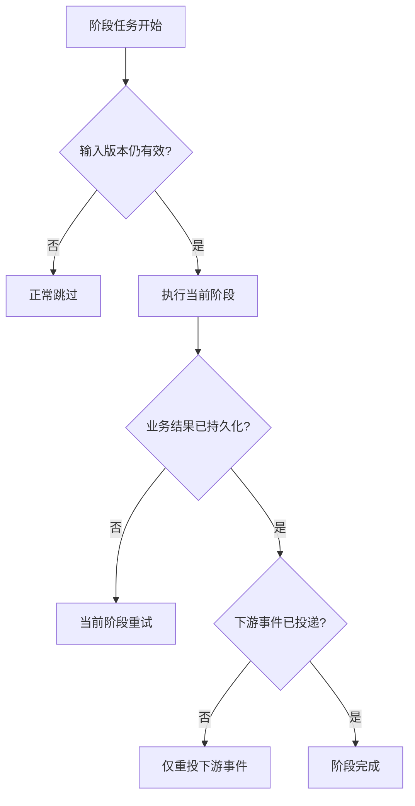

# 新增新闻驱动的关系知识图谱自动化任务工作流设计方案

## 1. 本文定位

本文定义关系优先知识图谱从新增 `ft_news` 到 Graph Community 当前态的正式异步任务工作流。

本文解决的是“当前已验证链路如何持续、可靠地运行”，不重新设计 Card、Relation Probe、跨 Chunk 关系核验或 Graph Community 算法。相关语义规则继续以《关系优先 Graph Community 重构设计方案》为准。

本期工作流以 Graph Community 当前态成功落库为终点，不触发事实报告和条件性预测。相关能力保留为未来独立阶段，待 Community 关系质量稳定后再接入。

目标不是把验证脚本直接搬进 Worker，而是让正式任务与验证流程复用同一套应用能力，并具备：

- 新闻新增后的自动触发；
- Card、Relation 和 Community 的分阶段异步执行；
- Redis 积压、投递失败和任务重试后的自动恢复；
- PostgreSQL 与 Milvus 发布状态的一致性保护；
- 完整的 Langfuse 跨任务观测；
- 与数据采集任务相互隔离的负载治理。

正式任务入口统一位于：

`src/interfaces/tasks/knowledge_tasks.py`

## 2. 背景问题

### 2.1 当前算法链路已经改变

当前经过验证的关系优先链路是：

1. 新闻进入 `ft_news`；
2. 新闻被编译为 Evidence 和 Chunk；
3. Chunk 提取原子 Cognitive Card；
4. 同 Chunk Card 关系和 Relation Probe 被提取；
5. Relation Probe 多路召回历史 Card；
6. 候选经过 rerank 和 Summary 初筛；
7. 双方原文完成关系核验；
8. 正关系写入正式 Edge；
9. 新增 Edge 触发关系连通分量 Community。

旧的“先维护主题目录，再把 Card 分配到主题 Community”的工作流不再符合当前架构，不能继续作为生产任务主链路。

### 2.2 验证脚本不是生产调度器

当前验证脚本为了方便人工测试，会同步串联 Card 提取和跨 Chunk 关系发现。这种形态适合观察结果，但不适合作为长期生产任务：

- 任一后置阶段失败都会迫使整条链路重新执行；
- LLM、Embedding、rerank 和图计算的负载特征不同，无法独立扩缩容；
- 单个长任务容易超过执行时限；
- 后续阶段会阻塞新闻采集和前置索引；
- 无法对积压、失败和重试进行阶段化诊断。

正式工作流必须保持同一套业务能力，但需要拆成可独立重试的任务阶段。

### 2.3 追加写数据可以直接事件驱动

当前新闻知识链路采用追加写模型：

- `ft_news` 入库后不修改正文；
- 已发布 Card 不通过内容更新改写；
- 新事实通过新增新闻、新 Card 和新 Relation 表达；
- Community 是有效 Edge 的关系连通分量，可以随 Edge 变化快速重算。

因此，不需要为新闻建立内容版本检测，也不需要在知识侧定时扫描新闻修订。采集任务成功写入新新闻后，直接把本轮新增的 `ft_news.id` 投递到 Redis/Jettask 即可。

Community 刷新是确定性规则计算，不调用 LLM。每次正式 Edge 新增后立即刷新受影响子图即可，不需要设置缓冲窗口。

### 2.4 知识任务不能与采集任务争抢同一个 Worker

Card 提取和关系发现包含长时间 LLM 请求；关系发现还会调用 Embedding、Milvus 和 reranker。若与新闻采集共用同一个低并发 Worker，长任务会阻塞采集任务，造成新闻时效性下降和队列头阻塞。

采集与知识加工必须异步解耦，并使用独立 Worker 资源。

## 3. 系统定位

关系知识图谱任务工作流位于原始新闻采集和 Agent 检索之间：

数据采集的完成标准是新闻已经可靠写入 `ft_news`。知识图谱加工的完成与否不影响采集事务，也不能阻塞下一轮采集。

## 4. 目标系统形态

### 4.1 一个工作流，多阶段任务

正式链路是一个业务工作流，但不是一个巨型任务：

每个阶段只负责自己的业务结果，并通过持久化结果或事件驱动下一阶段。上游任务不等待后续任务完成。

### 4.2 当前验证能力是正式任务的唯一业务实现

正式任务不得复制验证脚本中的算法，也不得保留另一套旧版处理逻辑。

验证脚本和正式任务应当共同调用同一组应用能力：

- 新闻编译和 Card 发布；
- 同 Chunk Relation 写入；
- Relation Probe 多路召回；
- rerank、初筛和原文核验；
- Edge 持久化和图变化事件；
- Community 刷新。

验证脚本负责同步串联和展示结果；正式任务负责异步调度、重试和恢复。对同一批输入，两者的持久化结果必须一致。

### 4.3 正式任务边界

`knowledge_tasks.py` 中的任务形成如下职责边界：

| 任务 | 业务职责 | 成功后触发 |
| --- | --- | --- |
| `kg_news_ingest` | 从新增新闻生成 Evidence、Chunk、Card、同 Chunk Relation 和 Probe，并发布 Card 检索材料 | 新增 Card 进入关系发现 |
| `kg_relation_discovery` | 对 Card 执行 Probe 召回、rerank、初筛和原文核验，持久化正式跨 Chunk Edge | Edge 变化事件 |
| `kg_graph_community_refresh` | 根据有效 Edge 刷新受影响的关系连通分量 Community | 工作流结束 |

`kg_news_ingest` 是新增新闻驱动的工作流入口，但它不是整个工作流的同步包装器。

## 5. 新增新闻触发

### 5.1 `ft_news.id` 是任务入口

采集任务完成新闻入库后，把本轮新增的 `ft_news.id` 直接投递到 Redis/Jettask。任务消息只传递 ID，不传递标题、正文或 Card 材料。

知识任务消费消息后，再从 PostgreSQL 读取完整新闻。这样可以避免在消息中复制大文本，也可以确保知识提取使用已经落库的数据。

### 5.2 投递成功后由 Redis 保管积压

新闻采集和知识加工相互解耦：

- 采集任务只负责入库并投递新增 ID；
- 知识 Worker 停止时，已投递消息保留在 Redis；
- 知识 Worker 恢复后继续消费积压消息；
- Card 或关系处理耗时不会阻塞下一轮新闻采集。

采集任务只有在新增 ID 已成功投递后，才认为本轮知识级联已完成。投递失败需要保留原始新增 ID 继续重试，不能重新依赖数据源返回同一条新闻。

### 5.3 重复消息由业务幂等吸收

Redis/Jettask 重试可能让同一个 `ft_news.id` 被重复消费。系统不要求消息只投递一次，而要求相同 ID 重复执行后结果不变：

- Evidence、Chunk 和 Card 使用稳定业务身份；
- Relation Edge 使用稳定关系身份；
- Community 由当前有效 Edge 确定性计算；
- 重复任务不得生成重复业务记录。

## 6. 核心任务流

### 6.1 新闻编译与 Card 发布

新闻入口任务按 `ft_news.id` 读取新增新闻，依次完成：

1. Evidence 和 Chunk 编译；
2. 原子 Card 与同 Chunk Relation 提取；
3. Relation Probe 提取；
4. Card Summary 与 Focus Evidence 两种检索视图发布。

只有 Card 的 PostgreSQL 元数据和 Milvus 可读材料都发布成功后，才允许投递跨 Chunk 关系发现。

若某个 Chunk 没有形成有效 Card，该新闻仍可以被标记为本阶段成功，不应无限重试。

### 6.2 跨 Chunk 关系发现

关系发现任务仅消费当前版本的有效 Card：

1. 每条 Relation Probe 独立执行语义召回；
2. 合并 Summary 和 Focus Evidence 两路召回结果；
3. 排除自身和同 Chunk Card；
4. 对候选 Summary 执行 rerank；
5. 使用 Summary 进行关系初筛；
6. 对初筛通过的 Card 对精确取回双方原文证据；
7. 由 LLM 完成最终关系核验；
8. 只把有证据支持的正关系写入正式 Edge。

没有召回候选或所有候选均为 `no_relation` 都属于正常成功结果。

### 6.3 Edge 写入是 Community 的唯一触发源

Community 不因新闻新增、Card 新增或候选关系出现而直接刷新。

只有正式 Edge 完成 PostgreSQL 持久化、证据引用保存和 Milvus 可读材料协调后，才发布图变化事件。这样可以保证 Community 的成员关系始终来自已经核验的 Edge。

### 6.4 Community 增量刷新

Community 刷新任务根据新增 Edge 的端点加载受影响关系闭包，并重新计算有效 Edge 形成的连通分量。

其增量含义是：

- 只重新计算受影响子图；
- 不扫描并重建全图；
- 通过图指纹判断 Community 是否真的变化；
- Community 可以随新成员加入而扩展，也可以因新增桥接 Edge 而合并；
- 没有有效 Edge 的孤立 Card 不进入 Community。

这一阶段是确定性图计算，不调用 LLM，执行成本远低于 Card 和关系抽取。因此每次正式 Edge 新增都可以立即触发一次刷新，不需要批量等待或时间缓冲。

## 7. 状态与幂等

### 7.1 分阶段完成状态

工作流不能只用一个“是否完成”布尔值。至少需要区分：

- 新增 `ft_news.id` 已投递；
- Evidence、Chunk 和 Card 已发布；
- 跨 Chunk 关系发现已完成；
- Edge 变化已传播；
- Community 已同步到当前图版本；
- 当前阶段失败并等待重试。

后续阶段是否产生数据与阶段是否成功是两个概念。例如没有正关系时，关系发现仍然是成功状态。

### 7.2 稳定幂等身份

各阶段的幂等身份分别建立在：

- `ft_news.id`；
- Card 内容和证据绑定；
- Relation 两端、关系类型和证据；
- Edge 图变化版本；
- Community 图指纹。

任务重试不得因为执行时间不同而生成新的业务身份。

### 7.3 重复和合并保护

任务开始时需要确认其业务对象仍可处理：

- 新闻任务发现同一 `ft_news.id` 已成功发布 Card 时幂等返回；
- 关系任务发现同一 Card 已完成当前关系发现时幂等返回；
- Community 任务发现图事件已被更新版本覆盖时合并处理。

幂等返回和图事件合并属于正常结果，不应进入错误重试。

## 8. 一致性边界

### 8.1 PostgreSQL 与 Milvus 的职责

PostgreSQL 保存：

- Card、Edge、Community 的结构化元数据；
- Evidence、Chunk 和 Edge 证据引用；
- Community 图指纹。

Milvus 保存：

- 可读的 Chunk 和 Card 文本；
- Card Summary 与 Focus Evidence 检索材料；
- 可供 Agent 和 rerank 使用的 Edge 检索材料。

PostgreSQL 不保存完整 Chunk 或 Card 文本。

### 8.2 发布屏障

下游任务不能只看到 PostgreSQL 已写入，就假设 Milvus 材料已经可检索。

Card 发布完成的含义必须包含：

- PostgreSQL 当前态已提交；
- Milvus 对应材料已成功 upsert；
- 按稳定 ID 可以精确取回；
- 关系发现任务才可投递。

Milvus 暂时不可见属于可重试的基础设施错误，不能被解释为“没有候选”。

### 8.3 Edge 变化的可靠传播

Edge 写入和图变化事件之间存在跨系统边界。系统需要保留待发送图事件，只有投递成功后才标记完成；投递失败时由后续重试继续发送，而不是重新调用 LLM 生成关系。

## 9. 并发与 Worker 隔离

### 9.1 采集 Worker 不消费知识任务

新闻采集 Worker 只负责采集和产生新闻变化事件。它不执行 Card 提取、关系发现或 Community 刷新。

### 9.2 知识任务按负载类型拆分 Worker

目标运行形态使用三类独立 Worker：

| Worker | 消费任务 | 主要负载 |
| --- | --- | --- |
| Card Worker | `kg_news_ingest` | LLM Card/Relation/Probe 提取、PG/Milvus 写入 |
| Relation Worker | `kg_relation_discovery` | Embedding、Milvus、reranker、LLM 核验 |
| Graph Worker | `kg_graph_community_refresh` | PostgreSQL 图读取、确定性连通分量计算 |

这种隔离避免关系核验阻塞新闻 Card 提取，也避免长时间 LLM 调用阻塞确定性图刷新。

### 9.3 并发边界

- 不同新闻可以受控并发；
- 同一 `ft_news.id` 只能有一个有效 Card 发布过程；
- 同一 Card 的关系发现重复任务应合并或幂等执行；
- Community 不做全图刷新，只加载本次 Edge 端点及其当前关系闭包；
- Community 按 `adapter_name` 获取 Redis 分布式锁，锁覆盖“读取闭包、计算连通分量、写回当前态”完整窗口；
- 同一 adapter 的多个图变化事件串行执行，不同 adapter 可以并行；
- 锁必须周期续租；续租失败后当前任务停止写入并交给 Jettask 重试；
- LLM、Embedding 和 reranker 分别按各自资源限制设置并发和背压。

当前按 adapter 串行是有意选择：两个看似不同的 Edge 事件可能通过已有路径落在同一个连通分量，事前无法仅靠端点安全判定互不相交。Community 图计算成本低于 LLM 链路，这个粒度优先保证当前态一致性。

### 9.4 有界批次

实时事件可以合并为小批次，但一个批次不能无限增长。批次中的单条新闻失败时，已成功新闻不应回滚；失败项应被独立记录并重新投递。

## 10. 失败恢复

恢复原则：

- 只重试失败阶段，不重跑已成功的昂贵阶段；
- LLM 已成功且结果已持久化后，下游投递失败只补投事件；
- 批次内失败需要隔离到具体新闻或 Card；
- 超过最大重试次数后保留明确失败状态并触发告警；
- Worker 重启后不依赖进程内状态恢复。

## 11. Langfuse 与运行观测

### 11.1 全链路关联

每批新增新闻处理需要稳定的工作流身份，并随所有异步消息传递。Langfuse 中应能从一次新增新闻投递追踪到：

- Card 提取；
- 同 Chunk Relation 和 Probe；
- Relation Probe 召回与 rerank；
- 候选初筛；
- 原文关系核验；
- Edge 写入；
- Community 刷新。

异步阶段可以是独立 Trace，但必须通过同一 Workflow Session、`ft_news.id` 和因果事件关联，不能再次出现只能看到后半段任务的情况。

### 11.2 必须观测的指标

至少需要观察：

- 各队列待处理数量和最老消息等待时间；
- 每阶段成功、失败、重试、过期跳过数量；
- 新闻到 Card、Card 到 Edge、Edge 到 Community 的端到端延迟；
- 每条新闻的 Card 数和零 Card 比例；
- Probe 数、召回数、rerank 后候选数、初筛通过数；
- `observed`、`inferred`、`no_relation` 的比例；
- Edge 新增数量；
- Community 新建、扩展和合并数量；
- LLM 模型、Provider、缓存命中、Token、费用和耗时；
- Milvus 发布失败和写后不可见重试次数。

### 11.3 告警重点

以下情况需要告警：

- `kg_news_ingest` 队列积压持续扩大；
- 某一知识队列长期无消费；
- Card 已发布但关系发现长期未完成；
- Edge 已变化但 Community 图指纹长期未同步；
- 某来源持续产生异常高的零 Card 或失败率；
- Milvus、reranker 或 LLM Provider 连续超时。

## 12. 旧能力退出

正式任务启用后，下列旧能力不再参与生产主链路：

- 基于主题目录的 Community Assignment；
- 依靠 Card 与主题相似度收容成员；
- 旧 Assignment Ledger 和候选账本压缩任务；
- 旧 Community Topic 合并任务；
- 旧 Community Insight 定时全量扫描；
- 验证脚本中的同步编排作为生产执行入口。

验证脚本继续保留，用于真实数据回放、质量对比和人工验收。

## 13. 核心设计判断

### 13.1 不建立第二套生产算法

正式任务和验证脚本只允许在调度方式上不同，不能在 Card、Relation、Edge 或 Community 逻辑上分叉。

### 13.2 不使用巨型任务

一个 Task 从新闻编译跑到 Community 看似简单，但会放大重试成本、阻塞和故障影响。业务上是一条工作流，工程上必须是阶段化事件链。

### 13.3 新增新闻直接进入 Redis

在新闻和 Card 只增不改的边界下，新增 `ft_news.id` 是充分的工作流输入。采集成功后直接投递 Redis/Jettask，可以同时保持链路简单和处理及时。

### 13.4 Edge 是图派生的唯一事实入口

Community 不能绕过正式 Edge，直接根据 Card 相似度形成成员关系。

### 13.5 “没有关系”是正常业务结果

不是每条新闻都应进入 Community。系统不能为了让任务看起来有产出而强行创建 Edge。

## 14. 系统收益

目标架构形成以下收益：

- 采集后新闻可自动进入关系知识图谱，无需人工运行脚本；
- 知识 Worker 停止时已投递消息可以在 Redis 中等待恢复；
- 当前验证效果与生产结果保持一致；
- LLM、reranker 和图计算可以独立扩缩容；
- 单阶段失败不会导致整条昂贵链路重跑；
- Agent 同时获得原子事实、可核验关系和跨文档高级认知；
- 每个阶段的质量、成本和积压都可以单独观测。

## 15. 验收口径

### 15.1 自动触发

- 新增新闻无需人工操作即可进入 Card 提取；
- 知识 Worker 停止期间，已投递 Redis 的新闻不会丢失；
- Worker 恢复后可以继续处理队列积压。

### 15.2 结果一致

- 正式异步任务和当前验证工作流处理同一批新闻时，产生相同的 Card 当前态；
- 同 Chunk 和跨 Chunk Edge 结果一致；
- Community 成员和图指纹一致。

### 15.3 幂等与恢复

- 同一 `ft_news.id` 重复投递不会产生重复 Card、Edge 或 Community；
- 新链路不得复用 `ft_news.event_extracted` 作为完成标记；该字段属于既有新闻事件抽取/分类语义；
- 任一阶段 Worker 中断后可从当前阶段恢复；
- 下游消息投递失败不会导致上游 LLM 重复调用。

### 15.4 隔离与背压

- 知识任务积压不阻塞新闻采集；
- 每类 Worker 可以独立调整并发和暂停。

### 15.5 完整观测

- 可以通过一批新增新闻和具体 `ft_news.id` 定位整条异步链路；
- Langfuse 能看到各 LLM 阶段的输入、输出、思考过程、Token、缓存和费用；
- 可以明确区分无关系、过期跳过、基础设施失败和模型失败。

### 15.6 关系优先边界

- 没有正式正关系 Edge 的 Card 不进入 Community；
- Community 成员只由当前有效 Edge 决定。

## 16. 关键待验证问题

正式实施前后的真实数据回放需要重点验证：

1. Card 发布后 Milvus 可读屏障在远程 Milvus 上的稳定性；
2. Card Worker 和 Relation Worker 的合理并发及 Provider 限流；
3. 每个 Edge 变化立即刷新时 Community 的处理吞吐；
4. 多个 Edge 事件连续到达时 Community 增量刷新的合并效率；
5. 三类 Worker 的积压分布是否符合预期；
6. 同一批数据通过同步验证和异步任务执行后的结果一致性；
7. Langfuse 跨 Jettask 阶段的上下文传播是否完整。

这些问题影响参数和运行规模，不改变本文定义的任务边界。

## 17. 与其他文档的关系

- 《关系优先 Graph Community 重构设计方案》定义 Card、Relation 和 Community 的总体语义架构；
- 《原子 Cognitive Card、同 Chunk Relation 与 Relation Probe 提取实施方案》定义第一阶段提取能力；
- 《跨 Chunk Card 召回与原文关系核验实施方案》定义关系发现和 Edge 写入；
- 《关系图 Graph Community 高级认知报告与条件性预测实施方案》保留为未来能力设计，不属于本期自动化任务范围；
- 本文只定义这些能力如何由新增新闻持续驱动，并在生产环境中可靠串联。

后续实施文档应进一步描述：

- 新增新闻投递和失败重试；
- Jettask 消息关联和阶段状态传播；
- Worker 服务拆分；
- 任务幂等、失败补偿和发布屏障；
- Langfuse 跨任务 Trace 关联；
- 从当前仅消费采集任务的部署形态切换到正式知识工作流的迁移与验收。
