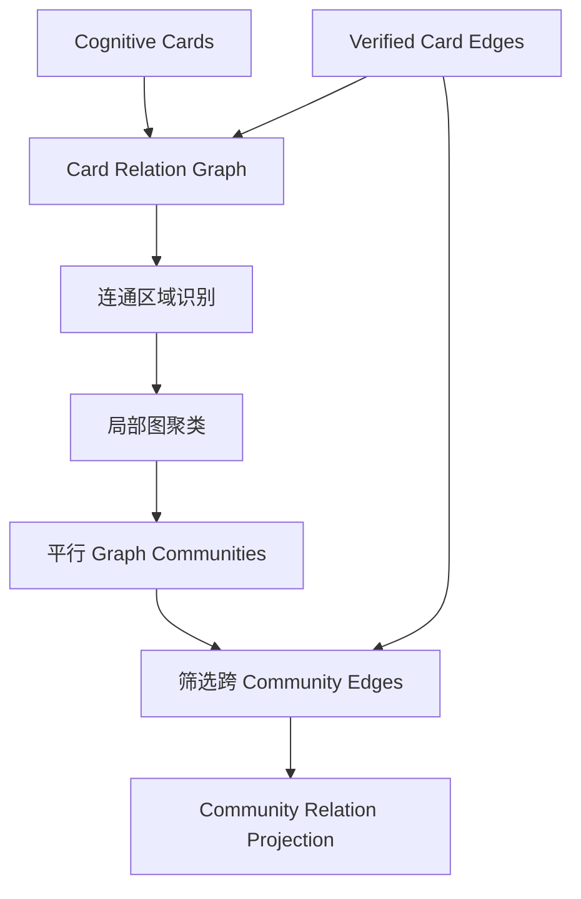
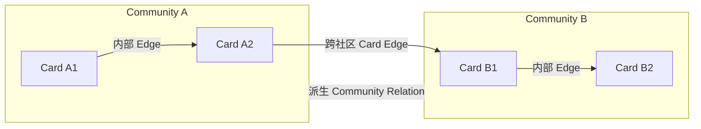
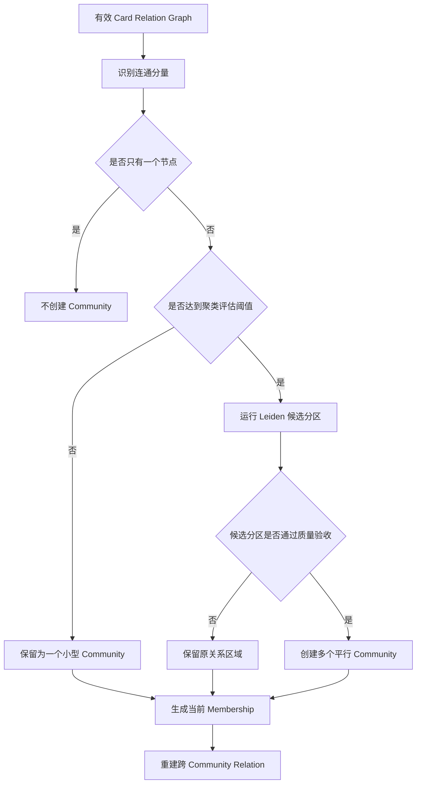
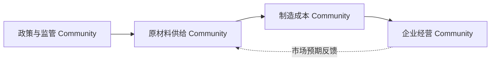
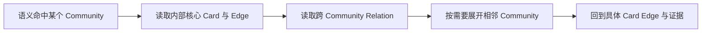
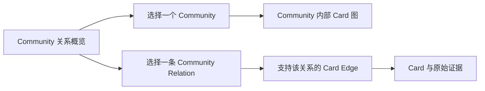

# 平行 Graph Community 图聚类与跨社区关系设计方案

## 1. 本文定位

本文定义关系优先知识图谱中 Graph Community 的最新目标形态，重点解决以下问题：

- 为什么“一个连通分量等于一个 Community”会持续制造超大社区；
- 如何从一张关系图中识别内部紧密、彼此相对独立的多个 Community；
- 为什么 Community 应保持平行，而不是建立父子层级；
- 小型 Community 如何保留，不因全局拆分策略被丢弃；
- 跨 Community 的 Card 关系如何继续表达和检索；
- Community 变化后，Community 之间的关系如何稳定刷新。

本文只讨论 Community 发现、Community 边界和跨 Community 关系，不重新设计上游 Card、Relation Probe 和原文关系核验，也不讨论高级认知报告与条件性预测。

## 2. 背景问题

### 2.1 有关系不等于属于同一个 Community

当前关系图中的 Edge 证明两个 Card 之间存在某种关系，但不能自动推出两个 Card 应永久属于同一个 Community。

例如：

```text
Community A 内部存在大量半导体供需关系
Community B 内部存在大量资本市场行情关系
A 中某个 Card 与 B 中某个 Card 存在一条市场联动 Edge
```

这条 Edge 应被保留，但不应让 A、B 的全部成员合并成一个 Community。

因此必须区分：

```text
Card Edge：两个事实节点之间存在关系
Community Membership：一组节点在当前关系图中形成相对紧密的局部结构
```

Edge 是事实关系；Community Membership 是基于整体图结构得到的组织结果。两者不是同一个概念。

### 2.2 连通性具有传递性，事件关系通常没有

无向连通分量采用的是传递规则：

```text
A 与 B 相连
B 与 C 相连
=> A、B、C 位于同一个连通分量
```

但业务关系通常不具备这种传递性：

```text
A 与 B 同属一个事件
B 与 C 存在市场联动
不能推出 A 与 C 属于同一认知主题
```

只要图持续增长，少量桥接 Edge 就会把原本独立的局部结构不断粘连。最终出现超大 Community 不是偶发问题，而是“连通分量直接作为 Community”的必然结果。

### 2.3 真实数据已经暴露超大连通分量

现有关系图中已经出现包含数百个 Card、数百条 Edge 的单一 Community。该图内部同时包含多个明显不同的局部结构，只是被少量桥接关系连接在一起。

对该图进行拓扑检查可以观察到：

- 整体密度较低；
- 存在较多桥边和割点；
- 局部节点之间连接紧密；
- 不同局部结构之间只有少量连接；
- 去掉部分弱关系仍不能彻底解决超大连通分量。

这说明问题不能只靠删除某一种 Edge 或调整一个阈值解决，Community 发现方式本身必须从“连通性判断”升级为“图聚类”。

## 3. 系统定位

新架构保留三层不同职责：

1. **Card Relation Graph**
   - 由 Cognitive Card 和经过核验的 Card Edge 组成；
   - 是关系事实的唯一来源；
   - 不依赖 Community ID。

2. **Flat Graph Communities**
   - 对当前 Card Relation Graph 进行平行分区；
   - 每个 Community 表达一个内部关系相对紧密的局部子图；
   - 不建立父子 Community。

3. **Community Relation Projection**
   - 聚合跨 Community 的有效 Card Edge；
   - 表达平行 Community 之间仍然存在的关系；
   - 是可从 Card Edge 和当前 Community Membership 重建的派生结果。



## 4. 目标数据形态

### 4.1 Card Relation 是事实源

`kg_card_relations` 继续独立表达 Card 与 Card 之间的关系。它不保存 Community ID，也不因为 Community 拆分、合并或重新编号而改写。

这一边界保证：

- Community 可以随图结构变化重新计算；
- Card Edge 不受聚类结果污染；
- Community 结果有问题时可以重新生成；
- 跨 Community 关系始终能追溯到原始 Card Edge 和证据。

### 4.2 Community 是当前图的平行分区

当前有效关系图中的一个 Card 在同一轮分区结果中只属于一个 Community。

采用平行且互斥的当前分区，目的是避免：

- 同一个 Card 被复制进多个 Community；
- Community 成员关系再次演变成模糊归档；
- 父子层级中出现多重归属和循环依赖；
- Community 报告或检索结果重复计算同一事实。

Community 之间允许存在任意方向的关系和环路，但不存在“父 Community”或“子 Community”的结构含义。

### 4.3 Community Relation 是派生投影

系统新增 `kg_graph_community_relations`，用于保存平行 Community 之间的当前关系。

该对象在语义上只需要回答：

- 哪两个 Community 被连接；
- 它们之间存在哪种关系；
- 哪些 Card Edge 支持该关系；
- 当前关系是否有效；
- 当前投影何时生成或刷新。

对应的最小字段语义包括：

- 关系自身的稳定 ID；
- 起点 Community ID；
- 终点 Community ID；
- 关系类型；
- 支持该关系的 Card Edge ID 集合；
- 当前状态；
- 创建时间和更新时间。

精确字段类型、唯一约束和索引设计由后续实施方案确定。这里明确的是：Community Relation 必须直接持有底层 Edge 引用，不能只保存无法展开的聚合描述。

同一对 Community 之间可以存在多种关系类型。每一种关系都必须能够展开到支持它的 Card Edge。

Community Relation 不重复保存新的 LLM 总结、关系理由或证据正文。其内容完全由以下数据推导：

```text
当前 Community Membership
        +
有效 kg_card_relations
```

因此它是可删除、可重建的当前状态投影，不是新的事实源。



## 5. 核心设计判断

### 5.1 连通分量只是计算边界，不是最终 Community

连通分量仍然有价值，但它只负责确定“哪些节点之间完全没有路径”，从而把全图切成可以独立计算的区域。

正确流程是：

```text
全量有效关系图
  -> 连通分量
  -> 对每个连通分量独立判断是否需要聚类
  -> 产生一个或多个平行 Community
```

连通分量不能直接作为最终 Community。

### 5.2 小型关系簇必须保留

只要两个或多个 Card 之间存在有效 Edge，它们就已经形成了可被 Agent 使用的关系结构。

因此：

- 两个 Card 和一条有效 Edge 可以形成最小 Community；
- 小型链式关系可以形成 Community；
- 小型 Community 不需要等待更多节点后才创建；
- 没有 Edge 的孤立 Card 不进入 Community，仍可按 Card 或原文直接检索。

节点数和 Edge 数阈值只能决定是否需要进一步检查或拆分，不能决定一个小型关系簇是否有资格存在。

### 5.3 超过规模阈值只触发聚类评估

当一个连通区域达到预设节点数或 Edge 数阈值时，系统必须执行局部图聚类评估。

阈值的含义是：

```text
这个关系区域已经足够复杂，需要检查是否由多个局部结构组成
```

阈值不直接意味着必须拆分，也不参与决定具体拆成几组。最终是否拆分由图结构决定。

### 5.4 使用图聚类识别局部紧密结构

大连通区域应使用图社区发现算法识别：

- Community 内部连接相对密集；
- Community 之间连接相对稀疏；
- 少量桥接 Edge 不再强制合并全部节点；
- 算法不需要预先知道主题名称和 Community 数量。

目标算法首选确定性 Leiden。它适合在无父子层级的关系图中寻找平行局部结构，并能通过固定随机种子、稳定输入顺序和固定参数降低重复运行时的无意义漂移。

算法只负责提出候选分区，系统仍需根据质量条件决定是否接受。

候选分区通过质量验收后，不能立即视为最终 Community。系统必须对每个候选分区重新检查聚类评估阈值；仍达到阈值的分区继续执行同样的确定性 Leiden 和质量验收，直到分区低于评估阈值，或无法产生满足质量条件的进一步拆分。阈值仍然只触发评估，不构成强制容量上限。

### 5.5 桥边和割点只用于诊断与辅助

桥边和割点能帮助发现“两个局部结构只靠少量连接粘在一起”的情况，但不能作为唯一拆分规则。

例如下面的有效因果链本身就是稀疏结构：

```text
政策变化 -> 原料供给下降 -> 成本上升 -> 企业利润承压
```

其中每条边都可能是桥边。如果简单删除桥边，会把一条有价值的因果链拆碎。

因此：

- 桥边和割点用于识别候选边界；
- 是否拆分仍需结合两侧内部连接、关系语义和整体分区质量；
- 不能把“是桥边”直接等同于“应切断”。

### 5.6 关系类型不采用静态硬切分

`same_event`、`causal_influence`、`common_driver`、`market_co_movement` 等关系表达不同语义，但不能简单规定某一种关系永远属于 Community 内部，另一种关系永远只能跨 Community。

原因是：

- 同一种关系在不同图结构中的作用不同；
- 市场联动可能构成一个完整局部结构，也可能只是一条跨社区桥边；
- 因果关系可能形成紧密传导链，也可能连接两个相对独立的事件簇。

第一原则是由整体拓扑决定分区。关系类型、Observed/Inferred 属性和置信度可以作为聚类权重或质量评估信号，但具体权重必须通过真实图回放校准，不能凭经验写死。

### 5.7 上游错误 Edge 仍必须治理

图聚类只能降低错误 Edge 对 Community Membership 的扩散影响，不能把错误 Edge 变成正确关系。

如果上游把同一篇新闻中互不相关的多个 Card 错误连接为 `common_driver`，新的聚类策略可能把它保留为一条跨 Community 关系。此时超大 Community 问题得到缓解，但错误关系仍然存在。

因此系统必须同时坚持：

- 上游关系抽取和原文核验负责 Edge 正确性；
- Community 聚类负责局部结构边界；
- Community Relation 只投影有效 Card Edge，不替上游关系背书。

## 6. Community 发现策略

### 6.1 总体决策流程



### 6.2 候选分区接受条件

一个候选分区只有同时满足以下原则才可接受：

- 至少形成两个非空局部结构；
- 每个输出 Community 内至少存在一条有效 Edge；
- 分区后的内部连接明显强于跨分区连接；
- 相比不拆分，整体社区结构质量有明确提升；
- 不会仅为了降低规模而产生大量孤立 Card；
- 不会把一条连贯、证据充分的短因果链机械拆开；
- 分区结果在相同输入下保持稳定。

候选算法产生的单节点分区不能直接落成 Community。系统只能在图结构支持时将该节点归入相邻 Community；无法合理归属时，应拒绝这次候选分区，不能为了完成拆分而制造无内部 Edge 的伪 Community。

如果算法不能找到满足条件的分区，即使节点数量较大，也应暂时保留为一个 Community，而不是强制按数量切块。

### 6.3 Community 数量由图结构决定

系统不预先指定“一个大 Community 必须拆成几个”，也不按固定大小平均切分。

Community 数量应由局部结构自然决定：

- 一个连通区域可能仍然保持一个 Community；
- 也可能拆成两个或多个平行 Community；
- 新 Edge 到来后，原有 Community 可能重新分区；
- 删除或失效 Edge 后，原有 Community 也可能分裂。

这是一种当前关系图视图，不是永久不变的人工目录。

## 7. Community 关系生成

### 7.1 只聚合跨分区 Edge

完成当前 Membership 后，对每条有效 Card Edge 判断：

```text
两端 Card 属于同一个 Community
  -> Community 内部关系

两端 Card 属于不同 Community
  -> Community Relation 的支持 Edge
```

系统按“起点 Community、终点 Community、关系类型”聚合跨分区 Edge，形成 Community Relation。

对于无方向关系，Community 对应顺序应规范化，避免 A-B 和 B-A 重复。对于有方向关系，必须保留原始 Edge 的方向。

### 7.2 Community Relation 不取代 Card Edge

Community Relation 只用于快速回答：

- 当前 Community 与哪些其他 Community 有联系；
- 主要通过哪些关系类型联系；
- 哪些底层 Card Edge 支持这些联系。

Agent 需要具体事实时，必须能够继续展开到底层 Card Edge 和 Card。Community Relation 不能成为无法追溯的抽象边。

### 7.3 Community 之间允许形成图

Community 之间不是树，也没有父子关系。它们可以形成：

- 单向传导；
- 双向影响；
- 共同约束；
- 多个 Community 共同连接同一 Community；
- 环状反馈关系。



这种平行关系图比父子层级更符合真实世界中多方向、可循环的事件传导。

## 8. 生命周期与稳定性

### 8.1 图变化驱动异步刷新

新增、失效或删除 Card Edge 后，关系写入链路只发布图变化事件。Community 发现由异步任务处理，不阻塞新闻写入。

聚类评估是纯图算法和确定性规则计算，不调用 LLM，因此可以高频触发。每一批 Card Edge 完成写入后，都应尽快对受影响的关系区域执行一次聚类评估，不需要等待固定时间窗口，也不需要等 Community 累积大量变化后再处理。

高频评估不等于每次都改写 Community：

- 图输入没有改变时不重复计算；
- 计算结果与当前 Membership 一致时不写数据库；
- 只有成员分区或跨 Community Edge 发生变化时，才刷新 Community 和 Community Relation；
- 同一关系区域的并发事件应合并处理，避免多个任务同时覆盖同一份 Membership；
- 计算必须基于明确的图快照，写入前确认期间没有出现更新版本，避免旧结果覆盖新图。

异步刷新应围绕受影响的连通区域工作：

1. 找到变化 Edge 两端所属的当前关系区域；
2. 读取该区域当前全部有效 Card 和 Edge；
3. 重新执行局部聚类评估；
4. 生成新的平行 Community Membership；
5. 替换受影响区域的旧 Membership；
6. 重建受影响的 Community Relation。

正常链路以高频局部评估为主，不应在每条 Edge 变化后全量重算整张关系图。低频全局校验只用于发现漏事件、任务失败或局部状态不一致，不承担日常 Community 更新。

### 8.2 Community 身份应尽量稳定

同一关系区域在输入没有变化时，重复计算必须得到相同结果。

图发生小幅变化时，应依据成员重叠和局部核心结构复用原 Community ID，避免每新增一条 Edge 就让所有 Community ID 变化。

稳定身份的目标是：

- Agent 缓存和检索引用不因无意义重算失效；
- Community 的更新时间真实反映结构变化；
- 可视化页面能够连续观察同一局部结构；
- 跨 Community Relation 不产生不必要的全量抖动。

Community ID 稳定不意味着成员永远不变。真实图结构变化时允许拆分、合并和重新归属。

### 8.3 Community Relation 随 Membership 原子刷新

Community Relation 依赖当前 Membership。任何 Community 拆分、合并或成员迁移，都可能使旧关系失效。

因此受影响区域的更新必须保证：

```text
新 Membership
        与
新 Community Relation
```

来自同一轮图快照。不能先长期保留新 Membership，再异步等待旧 Community Relation 慢慢修正，否则查询阶段会看到相互矛盾的图。

## 9. Agent 与可视化消费

### 9.1 Agent 检索

Agent 可以按以下顺序消费：



该结构允许 Agent：

- 先理解一个局部关系簇；
- 再观察它与其他关系簇的传导或联动；
- 按需扩展，不必一次加载数百个 Card；
- 最终仍能回到原始事实和证据。

### 9.2 Graph Community Explorer

Graph Community Explorer 应增加一个默认概览页。概览页展示的不是 Community 内部 Card，而是整个系统当前的 Community 关系图：



概览页的数据表达为：

- 一个 Community 对应一个图节点；
- 一条 `kg_graph_community_relations` 对应一条图边；
- 节点大小可以表达成员 Card 数或内部 Edge 数；
- 边宽可以表达底层支持 Edge 数，但不能把数量直接解释为事实强度；
- 有方向的关系显示方向，无方向的关系保持对称；
- 不同关系类型采用可区分的边样式；
- `Observed` 和 `Inferred` 的支持构成必须可以查看，不能在视觉上混成同一种事实确定性。

概览页至少提供以下浏览能力：

- 按 Community 成员数、内部 Edge 数、跨 Community 关系数和更新时间排序；
- 按关系类型、时间范围和 Community 规模过滤；
- 搜索 Community ID 或其代表 Card；
- 点击 Community 节点进入现有的内部 Card 关系图；
- 点击 Community Relation 查看支持它的底层 Card Edge；
- 从 Card Edge 继续展开到双方 Card 和原始证据；
- 快速定位节点异常多、跨社区关系异常多或近期快速扩张的 Community。

Community 尚未生成认知报告时，概览页不依赖 LLM 生成标题。节点可以使用稳定 Community ID 和确定性选出的代表 Card 摘要作为识别信息，避免为了可视化再次引入主题分类。

### 9.3 大图展示边界

概览页不能无条件一次渲染所有 Community 和关系，否则关系图增长后仍会退化成不可读的线团。

默认展示应遵循：

- 优先展示最近活跃或关系数量靠前的 Community；
- 允许按时间、规模和关系类型缩小图范围；
- 用户选择某个 Community 后，只展开有限跳数的邻接 Community；
- 没有跨 Community Relation 的小型 Community 仍保留在可排序列表中，不因概览图未展示而消失；
- 图布局应尽量保持稳定，避免数据没有实质变化时节点位置完全重排；
- 图筛选和排序只影响展示，不参与 Community 聚类和事实关系判断。

因此 Explorer 形成两个明确层级：

1. **Community 关系概览页**
   - 回答系统当前有哪些主要关系簇，以及它们之间如何连接。

2. **单 Community 详情页**
   - 回答该 Community 内部有哪些 Card、Edge、核心节点和证据。

## 10. 旧能力调整

以下旧结论退出：

- 一个连通分量直接对应一个 Community；
- 只要存在一条有效 Edge，就必须合并两侧全部 Community；
- Community 必须采用父子层级表达大类和子类；
- 达不到较大节点规模的关系簇不创建 Community；
- 跨 Community Edge 在拆分后可以直接丢弃。

保留的结论是：

- Community 必须来源于有效 Card Relation Graph；
- 主题相似不能代替关系证据；
- 孤立 Card 不进入 Community；
- Community 计算不修改 Card Edge；
- 所有跨 Community 关系必须能回溯到底层 Edge。

## 11. 系统收益

新结构带来的核心收益是：

- 避免单条桥接 Edge 形成不断扩张的超大 Community；
- 保留小型但真实的事件链和关系簇；
- 不通过父子层级强行表达现实世界中的复杂关系；
- Community 内部材料更集中，便于后续检索和认知报告生成；
- 跨 Community 的有效关系不会因拆分而丢失；
- Community Relation 可从事实图重建，不制造新的不可追溯知识；
- Agent 可以按局部结构逐层展开，而不是一次消费整个巨型连通分量；
- 上游 Edge 质量问题和下游聚类边界问题可以分别治理。

## 12. 验收口径

### 12.1 Community 边界

- 单条跨主题 Edge 不会自动合并两侧全部节点；
- 大连通区域能够识别内部紧密、外部稀疏的多个平行 Community；
- 相同图输入重复运行得到稳定分区；
- 不按固定节点数量机械切块；
- 不建立父子 Community。

### 12.2 小型关系簇

- 两个 Card 和一条有效 Edge 可以形成 Community；
- 小型链式结构不会因规模不足被丢弃；
- 孤立 Card 不强制创建 Community。

### 12.3 跨 Community 关系

- 每条跨 Community 关系都能展开到底层 Card Edge；
- 同一对 Community 的不同关系类型不会被混成模糊的 `related_to`；
- Community 拆分或合并后，旧关系投影不会残留；
- Card Edge 不因 Community 变化而被改写。

### 12.4 真实问题回放

- 当前超大 Community 在新算法下不再仅因连通性保持为一个整体；
- 拆分后各 Community 的内部关系密度和语义一致性明显提升；
- 原本连接不同局部结构的有效 Edge 被保留为 Community Relation；
- 已知错误 Edge 不会被聚类结果包装成正确关系。

### 12.5 Agent 消费

- Agent 能先检索局部 Community，再按跨 Community Relation 展开；
- 单次展开不需要加载整个超大连通区域；
- 任一关系都能回到 Card、Card Edge 和原始证据。

### 12.6 Explorer 概览

- 默认概览页能够展示 Community 节点和 Community Relation；
- 能按规模、关系数量、更新时间和关系类型进行排序或过滤；
- 点击 Community 可以进入内部 Card 关系图；
- 点击 Community Relation 可以查看底层支持 Edge；
- 没有跨 Community Relation 的小型 Community 仍可通过列表访问；
- Community 数量较大时，页面不会无条件全量渲染为不可读的关系线团。

## 13. 关键待验证问题

以下参数需要通过真实关系图回放确定，但不改变本文方向：

1. 触发聚类评估的节点数和 Edge 数阈值；
2. Leiden 的分辨率参数和稳定性参数；
3. Observed、Inferred、置信度和关系类型是否应参与边权；
4. 候选分区相对不拆分需要达到多大的结构质量提升；
5. 如何在成员重叠接近时稳定复用旧 Community ID；
6. 同一来源的重复报道是否会放大局部密度并影响分区；
7. Community Relation 默认向 Agent 展示到什么粒度；
8. 增量局部重算与周期性全局校验如何配合。

这些问题必须使用真实图数据、已知异常 Community 和 Agent 检索任务评估，不能通过特定新闻关键词硬编码。

## 14. 和其他文档的关系

- `22. 关系优先Graph Community重构设计方案.md` 定义 Card、Relation Probe、Card Edge 和关系优先主链路；
- 本文专门替代其中“连通分量直接形成 Community”的旧结论；
- 后续实施方案需要进一步明确图快照、Leiden 参数、稳定 ID 映射、并发刷新、Community Relation 数据结构、全量重建和测试回放；
- 高级认知报告与条件性预测不在本文范围内，后续只能消费本文产出的平行 Community 和可追溯跨 Community 关系。

实施过程中如果采用降级聚类算法、缺少稳定 ID、不能原子刷新 Membership 与 Community Relation，必须在知识图谱实施目录的 `9. 待优化.md` 中记录，不能将降级结果表述为本文目标已经完整实现。
