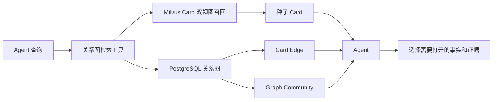
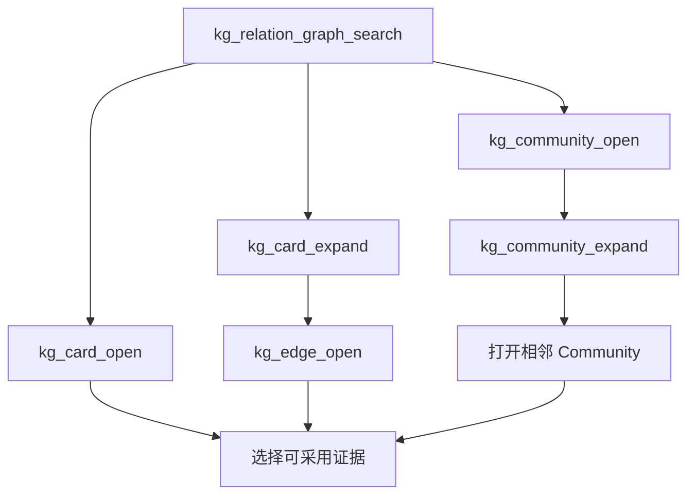

# 关系图 Agent 检索工具设计方案

## 1. 本文定位

本文定义关系优先知识图谱如何作为 Agent 可调用的金融认知检索基座。它承接原子 Cognitive Card、正式 Card Edge、平行 Graph Community，不负责生成高级认知报告，也不直接给出投资建议。

## 2. 背景问题

传统 Chunk RAG 能找到语义相近的新闻，但难以稳定回答需要跨文档关系的问题。当前系统已经形成以下基础：

- Card 表达可独立检索的原子事实；
- Edge 表达两个 Card 之间经过核验的关系；
- Community 表达关系图中相对稳定的事件群；
- Milvus 保存 Card Summary、Focus Evidence 和原始 Chunk；
- PostgreSQL 保存 Card、Edge、Community 当前态和证据指针。

下一步需要把这些对象变成 Agent 能准确选择和组合的工具，而不是把数据库表或 Explorer 展示接口直接暴露给 Agent。

## 3. 系统定位

检索工具只负责发现、导航和精确读取。Agent 决定下一步需要哪些事实；后续 Graph Context Builder 再负责把多次工具结果整理为稳定的认知上下文。

## 4. 工具边界

工具面按 Card、Edge、Community 三类对象拆分：

| 工具 | 职责 |
| --- | --- |
| `kg_relation_graph_search` | 使用自然语言召回种子 Card，并返回 Community 入口。 |
| `kg_card_expand` | 沿正式 Card Edge 展开相邻 Card。 |
| `kg_card_open` | 精确读取 Card Summary、Focus Evidence 和来源。 |
| `kg_edge_open` | 精确读取 Edge 类型、方向、依据和双方证据。 |
| `kg_community_expand` | 沿跨 Community 关系寻找相邻 Community。 |
| `kg_community_open` | 查看 Community 的成员 Card 摘要和内部 Edge。 |

Card 和 Community 不共用展开工具，Card 和 Edge 不共用打开工具。这样能让 Agent 明确表达检索意图，并限制每次调用的返回规模。

## 5. 核心设计判断

### 5.1 搜索以 Card 为入口

当前 Community 没有稳定且完整的语义报告，不能作为主要语义召回对象。自然语言搜索先同时检索 Card Summary 和 Focus Evidence，再合并和精排；Community 只作为导航入口随 Card 返回。

### 5.2 Search 不自动展开

搜索只返回种子 Card。是否沿关系展开由 Agent 根据问题决定，避免普通事实查询被无关邻居污染。

### 5.3 Edge 必须可追溯

Agent 看到的 Edge 必须来自正式有效关系，并保留：

- 关系类型和方向；
- Observed 或 Inferred；
- 关系依据；
- 双方证据引用；
- 推断机制和置信度。

### 5.4 Community 是导航结构

Community 用于发现事件群和跨社区关系，不代替原文证据。Agent 采用 Community 中的某个事实时，仍应打开对应 Card 或 Evidence。

### 5.5 工具结果必须有界

展开跳数、节点数、边数和成员数必须有上限。达到上限时明确返回截断状态，由 Agent 决定是否继续定向查询。

## 6. Agent 使用路径

事实查询通常止于 Card Open。跨文档关系问题需要 Card Expand 和 Edge Open。宏观事件群或跨领域联动问题才需要 Community Open 和 Community Expand。

## 7. 非目标

本阶段不包含：

- 批量生成 Community 报告；
- 条件性未来预测；
- 自动输出买卖建议；
- 将裸 Edge 当成最终证据；
- 让 Agent 直接操作 Milvus 或 PostgreSQL；
- 自动将全部检索结果拼成最终 Prompt。

## 8. 验收口径

1. 六个工具职责清晰且输入输出互不混淆。
2. Search 可以召回真实 Card，并支持时间范围。
3. Expand 只返回有效关系当前态，不返回失效 Edge。
4. Open 可以按 ID 精确取得 Card、Edge、Community。
5. Agent 能通过工具找到跨文档关系并回到原始证据。
6. Langfuse 可以观察完整工具调用链。
7. 可使用人工标注案例计算 Card Recall、Edge Recall、硬负样本命中和证据完整性。

## 9. 和后续能力的关系

Graph Context Builder 将建立在本工具内核之上，负责对多次调用结果进行去重、预算裁剪、时间排序和事实/推断分层。认知报告、条件预测和金融决策辅助必须消费这一层产生的证据上下文，不能绕过工具直接读取整个 Community。

