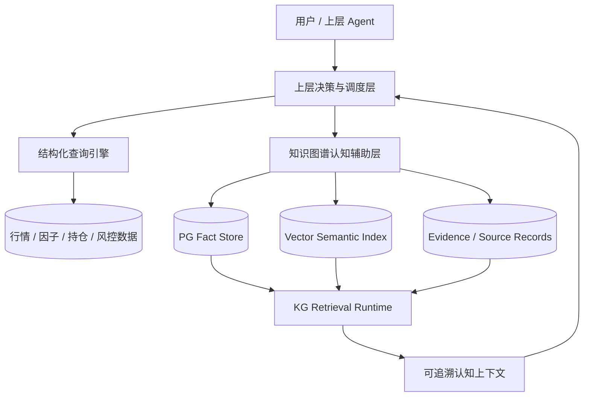
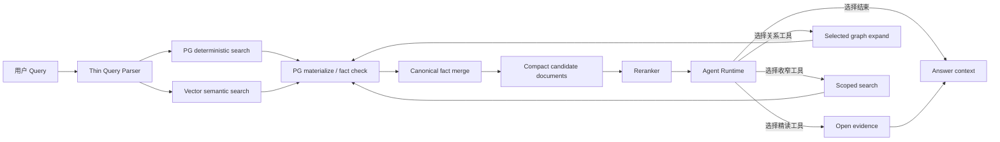
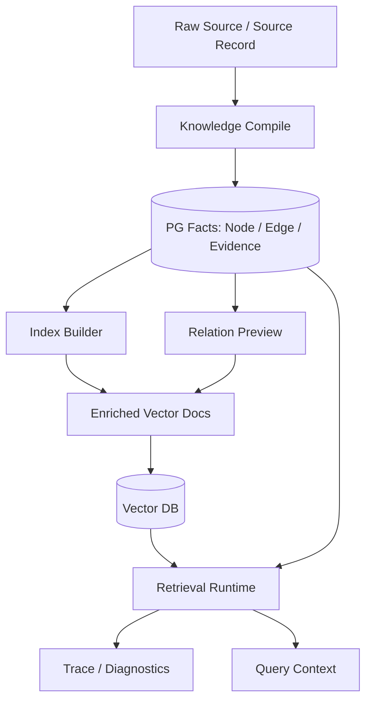
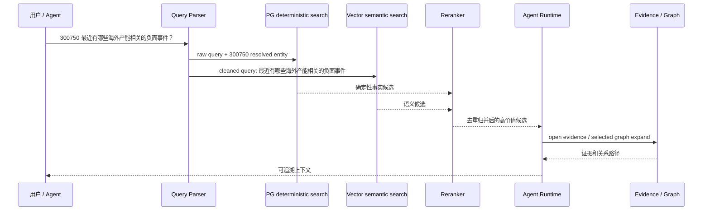

# 检索索引架构重构设计方案

> 最新收敛口径：检索存储边界已经进一步收敛到 `12. Milvus语义检索、PG关系展开与叙事图谱设计方案.md`。本文保留检索索引重构的背景和早期设计判断；涉及第一阶段召回、PG 是否参与、chunk text 存储位置、Milvus get-by-id、PG refs、叙事图谱的最终结论，以第 12 篇为准。

## 1. 本文定位

本文是知识图谱检索索引重构的设计侧文档。

它回答：

- 我们为什么要重构检索索引架构。
- 新增这部分能力后，系统应该长什么样。
- 各层能力如何分工。
- 用户和上层 Agent 会得到什么收益。
- 哪些关键问题已经形成判断。
- 哪些能力属于知识图谱认知辅助层，哪些不属于。

本文不写具体代码、不写表结构、不写接口字段，也不描述历史实现细节。实施方向放在：

`docs/3. 实施方案/4. 知识图谱/7. 检索索引架构重构实施方案.md`

## 2. 背景问题

当前知识图谱检索同时维护了 PG keyword、PG graph search、retrieval document、Wiki、向量检索、reranker、Agentic 调度等多套能力。

这些能力都在不同程度上承担“召回候选”的职责，导致几个问题：

- 检索职责不清晰：事实层、索引层、调度层互相交叉。
- 索引碎片化：PG 中出现大量服务检索的派生结构。
- debug 成本高：同一条候选可能来自 keyword、semantic、graph、wiki 多个通道，很难解释最终为什么入选。
- 重复候选多：node、edge、evidence、wiki、retrieval document 可能表达同一个事实。
- 召回质量不稳定：很多结果被 keyword 主导，但 keyword 只擅长字面匹配，不擅长语义理解。
- 图扩展容易爆炸：金融事件、行业、政策、概念高度连通，一旦全量展开就会产生大量沾边内容。

本次重构的目标不是再增加一个召回通道，而是重新划清边界。

## 3. 系统定位

知识图谱属于金融系统中的认知辅助层，不是交易决策系统，也不是结构化行情查询系统。

它负责：

- 理解新闻、公告、研报、政策、事件等弱结构化文本。
- 把主体、行业、资产、政策、事件和证据组织成可追溯事实网络。
- 为上层 Agent、投研问答、解释、复盘提供认知上下文。

它不负责：

- K 线、Tick、OrderBook、持仓、风控参数等强结构化精确数据查询。
- 最终交易决策。
- 下单执行。
- 替代结构化查询引擎。

在更大的系统中：

```text
结构化查询引擎   -> 精确数据、时间序列、指标、风控
知识图谱认知层   -> 新闻、事件、政策、语义关系、证据解释
上层决策系统     -> 判断调用哪一层，并综合结果做决策
```

因此，知识图谱内部仍然需要 PG 事实源和确定性查询能力，但它们服务的是认知层的事实追溯和结构关系，不是替代整个交易数据系统。

### 3.1 系统位置图



设计含义：

- 结构化查询引擎负责精确数据。
- 知识图谱认知层负责语义事实、事件、关系和证据。
- 上层决策系统决定什么时候调用哪一层。
- 知识图谱不直接变成交易系统，也不替代行情数据库。

## 4. 目标系统形态

新增检索索引重构能力后，系统应形成一套清晰的认知检索运行时。

核心方向：

```text
PG 负责确定性事实查询
Vector DB 负责语义自然语言查询
Graph 负责对已选结果做关系展开
Reranker 负责统一判断候选价值
Agent 负责在检索过程中选择何时使用哪种工具、采用哪种方法、执行哪种下一步动作
```

第一阶段召回应采用并行入口：

```text
用户 query
  ├─ PG deterministic search
  │    代码 / source_id / evidence_id / 标题 / alias / relation filter
  │
  └─ Vector semantic search
       自然语言语义 query -> enriched vector docs
```

两路召回互不依赖，合并后按事实身份归并去重，再交给 reranker。

这不是“先 PG 解析，再拼向量 filter”，也不是“纯向量替代一切”。PG 和 Vector 分别处理自己擅长的问题。

### 4.1 目标架构图



这张图表达几个关键变化：

- Query Parser 只做轻量解析，不承担复杂语义理解。
- PG 和 Vector 是并行入口，不互相依赖。
- 所有候选必须回到 PG 事实源校验。
- 排序前先做事实归并，避免同一事实重复出现。
- Graph 只在 Agent 选择少量 seed 后展开，不做全局召回。
- Agent 不只是判断是否继续，而是根据当前证据状态选择下一步工具和策略，例如继续语义搜索、收窄检索、精读证据、局部展开关系、调整查询方向或结束。

### 4.2 目标数据形态图



设计含义：

- PG facts 是唯一事实源。
- Vector DB 是可重建语义索引。
- enriched vector docs 从 PG facts 派生，不在 PG 中复制成 `kg_retrieval_*` 第二检索层。
- relation preview 是索引文档的一部分，用于提示关系方向，不是完整 graph 展开；它必须在写入侧生成并进入向量索引材料，详见 `10. 写入侧语义索引材料设计方案.md`。
- 查询时必须回 PG 校验，避免 stale vector hit 污染答案。

### 4.3 目标查询体验图

以问题为例：

```text
300750 最近有哪些海外产能相关的负面事件？
```

目标链路：



用户最终看到的不是“哪个通道分数最高”，而是：

- 和问题相关的事实。
- 对应原始证据。
- 关系路径。
- 哪些主体、行业、资产或政策受到影响。
- 为什么这些候选被选中。

## 5. 核心设计判断

### 5.1 PG 是事实源，也是确定性查询入口

PG 中保存的是事实网络：

- Node
- Edge
- Evidence
- Source Record
- 编译、标准化和写入后的事实状态

PG 必须保留，因为它承担：

- 唯一事实源。
- direct lookup。
- source_id / evidence_id 查找。
- 代码、标题、别名、市场等确定性识别。
- 关系、证据、状态、版本的回表校验。
- 选中结果后的 graph neighborhood 查询。

PG keyword search 也要保留，但定位必须收窄。

它不是开放语义召回入口，而是：

- deterministic search。
- exact / lexical lookup。
- graph neighborhood filter。
- debug / replay 查询工具。

当 Agent 已经知道要找什么具体对象时，PG 精确查询比向量近似更可靠。

### 5.2 Vector DB 负责语义自然语言查询

向量数据库负责处理自然语言语义问题，例如：

- 海外产能相关的负面事件。
- 哪些政策影响半导体。
- 某条新闻涉及哪些主体、行业或资产影响。
- 哪些事件可能对某类资产形成风险。

向量索引中的文档应该是面向语义检索的 enriched vector docs，例如：

- Evidence Chunk
- Node Card
- Edge Card
- Event Card
- Cluster Card
- Timeline Card

这些文档属于向量索引，不应再以 `kg_retrieval_*`、Wiki、retrieval document 等形式复制到 PG 中形成第二套检索层。

当前实现状态：

| 能力 | 当前状态 | 判断 |
| --- | --- | --- |
| Evidence Chunk | 已有基础向量索引 | 可以作为语义召回材料继续保留。 |
| Node Card | 已有基础向量索引 | 还缺少稳定 relation preview，不能算完整 Node Card。 |
| Edge Card | 已有基础向量索引 | 已包含 source、target、relation、evidence 等基础信息，但还需要统一成面向 reranker / Agent 的 card 结构。 |
| Event Card | 未完整实现 | 当前事件主要以 node/evidence 形式进入索引，缺少独立事件卡片材料。 |
| Cluster Card | 未实现 | 需要先有事件聚类或同事件合并结果。 |
| Timeline Card | 未实现 | 需要先有事件流和时间线材料。 |
| 旧 retrieval document / Wiki 作为向量输入 | 主链路已移除 | 当前语义索引构建已不再消费旧 retrieval document / Wiki。 |
| 旧 retrieval document / Wiki 写入 | 迁移期仍存在 | 写入侧仍可能生成这些派生材料，用于回放、对比和调试，后续应删除或降级。 |

所以，这一节描述的是目标形态，不是当前已经全部完成的状态。后续重点不是继续扩展旧 `kg_retrieval_*`，而是补齐写入侧 enriched vector docs 的构造能力。

### 5.3 强标识不默认进入向量查询

金融代码、内部 ID、source_id、evidence_id 不是自然语言语义。

例如：

- `300750`
- `159363`
- `HK:02276`
- `US:TSLA`
- `ft_news:83904`
- `kg_ev:...`

这些标识应由 PG deterministic search 处理，不应要求 embedding 理解。

最终规则：

```text
如果 query 检测到强标识：
  PG 使用原始 query + resolved entities
  Vector 使用去掉强标识后的 cleaned query

如果 query 没有检测到强标识：
  PG 仍可做 deterministic search
  Vector 使用原始 query
```

不默认给向量查询加 `node_ids contains ...` 这类强实体 filter。

原因：

- parser 可能漏识别或误识别。
- metadata 可能不完整。
- 很多有价值内容可能在行业、政策、上下游、二跳事件中，并不直接挂在该股票节点上。
- 默认 hard filter 会让向量召回变窄，降低语义发现能力。

`node_ids contains ...` 可以作为 Agent 明确要求收窄范围时的 scoped vector search，但不是第一阶段默认策略。

当前实现状态：

- 已实现强标识识别和 cleaned vector query。
- PG deterministic search 使用原始 query，不因为向量清洗丢失代码、source_id 或 evidence_id。
- Vector semantic search 在检测到强标识时使用 cleaned query；如果 cleaned query 为空，则回退使用原始 query，避免空检索。
- 默认不把强标识转成 `node_ids contains ...` 这类 hard filter。
- scoped vector search 已作为 Agent 明确收窄范围时的能力保留，不作为第一阶段默认策略。

### 5.4 Query Parser 必须保持很薄

Query Parser 不是复杂 query understanding 系统。

它只做：

- 代码、ticker、fund_code 识别。
- source_id / evidence_id 识别。
- 明确别名、标题、市场识别。
- 明确时间表达解析。
- 生成 cleaned vector query。
- 生成 PG deterministic search 可使用的 anchors。

它不做：

- 情绪判断。
- 事件类型判断。
- 关系意图推理。
- 风险、利好、利空分类。
- 主体、行业、资产影响拆解。
- graph seed 选择。
- 复杂 query rewrite。

这些语义判断交给向量检索、reranker 和 Agent。

### 5.5 Graph 不做全局召回，只做按需展开

PG graph 不再作为第一阶段全局召回通道。

原因是金融图高度连通，全局 graph search 容易把相关、弱相关、只是沾边的内容都带进候选池。

Graph 的正确位置是：

```text
初始召回 -> rerank -> Agent 选择少量 seed -> graph expand -> 再 rerank / open evidence
```

首次召回结果可以带 relation preview，让 Agent 和 reranker 知道候选背后有什么关系方向，但不能一开始就全量展开。

### 5.6 排序前不再使用领域类别 cap

排序前不应按 node_type、行业、source_channel 等做硬性配额。

例如：

```text
每个 node_type 最多 3 个
每个行业最多 2 个
每个 source_channel 最多 5 个
```

这类规则容易错过真正相关内容。

排序前只做：

- stale / inactive 过滤。
- canonical fact merge。
- 完全重复候选删除。
- 基础预算控制。

类别分布只作为 trace 诊断，不作为硬过滤。

### 5.7 同一事实必须归并

PG deterministic search、Vector semantic search、Graph expand 可能命中同一事实的不同视角。

例如：

- PG 命中某条 edge。
- Vector 命中包含该 edge 的 event card。
- Graph expand 又展开出同一关系。

这些不应作为三条候选进入 reranker，而应合并为一个事实候选，并保留多通道来源信息。

目标不是减少信息，而是减少重复表达。

## 6. 新能力带来的系统收益

### 6.1 对用户和上层 Agent 的收益

重构后的检索结果应该更像“可追溯事实集合”，而不是一堆 node、edge、wiki、chunk 的混杂列表。

上层 Agent 将获得：

- 更少重复的候选。
- 更稳定的代码、source_id、标题等确定性查询结果。
- 更强的自然语言语义召回能力。
- 更克制的关系展开。
- 可解释的候选来源。
- 可回读的证据。
- 可追踪的关系路径。
- 不被 stale vector hit 污染的答案上下文。

### 6.2 对系统架构的收益

重构后，系统职责会更清晰：

- PG 不再同时扮演事实源和复杂语义检索层。
- Vector DB 不再被迫理解金融代码和内部 ID。
- Graph 不再做全局候选泛化，只做已选结果的局部关系补充。
- Reranker 不再面对大量重复候选，而是面对归并后的事实候选。
- Agent 不再被固定工作流绑死，可以根据候选质量、证据缺口和问题目标选择下一步工具、方法和停止时机。
- trace 可以清楚说明 PG、Vector、Graph 各自贡献了什么。

### 6.3 对数据治理的收益

重构后，事实和索引的关系变成：

```text
PG facts 是事实
Vector docs 是索引
Graph expand 是查询动作
Trace 是解释材料
```

这样可以避免把派生检索材料长期堆在 PG 中，减少 `kg_retrieval_*`、Wiki、retrieval document 这类中间层带来的维护成本。

典型例子：

```text
300750 最近有哪些海外产能相关的负面事件？
```

系统应该：

- 用 PG 解析 `300750`，找到宁德时代及其确定性事实。
- 用 Vector 查询“最近有哪些海外产能相关的负面事件”。
- 合并两路结果。
- 通过 reranker 判断哪些候选真正回答问题。
- 必要时再围绕高价值 seed 展开关系。

而不是：

- 把 `300750` 交给 embedding 猜。
- 默认用 `node_ids contains 300750` 限死向量搜索空间。
- 把所有和宁德时代沾边的 graph 全量展开。

## 7. 应退出的旧能力定位

以下能力不应作为长期检索架构保留：

- `kg_retrieval_*` 检索表。
- 独立 Wiki 检索层。
- 独立 retrieval document 检索层。
- 多通道手写 rank fusion。
- PG graph 全局召回。
- 领域类别 cap。

迁移期说明：

- 写入侧可能仍会构建 `kg_retrieval_*`、Wiki、retrieval document，用于回放、对比和调试。
- 这些产物不再处于核心检索链路中，也不应作为新向量索引材料的上游。
- 目标是后续按写入侧语义索引材料方案删除或降级这些旧派生产物。

这些能力中的有效信息应迁移为：

- PG facts。
- enriched vector docs。
- relation preview。
- reranker features。
- Agent 工具。
- trace diagnostics。

## 8. 验收口径

重构方向是否正确，至少看这些指标：

- 同一事实重复进入候选池的比例下降。
- PG deterministic 命中和 Vector semantic 命中能在 trace 中分清。
- 强标识 query 不再污染 vector query。
- 带代码 query 的召回仍能稳定命中直接事实。
- 不带代码 query 的语义召回质量不下降。
- Graph expand 的候选数量受控，且展开结果能带来新增证据。
- Reranker 前候选更紧凑、更可解释。
- stale vector hit 能被回表校验拦截。
- A/B 回放中上下文准确率、证据覆盖、候选重复率优于旧链路。

## 9. 关键待验证问题

仍需要通过实现和回放验证：

- cleaned vector query 的清理力度如何控制，避免清理过度。
- PG deterministic search 和 Vector semantic search 并行后，候选归并策略是否足够稳定。
- relation preview 多短才合适，既能提示关系方向，又不占用太多 token。
- scoped vector search 是否需要作为 Agent 显式工具开放。
- 向量索引 stale hit 的比例是否可控。
- 删除 `kg_retrieval_*` 后，debug 体验是否需要新的 trace 补齐。

## 10. 和实施文档的关系

本文只描述“为什么这样做”和“最终应该做成什么样”。

实施文档只承接最终结论，不再重复头脑风暴过程：

`docs/3. 实施方案/4. 知识图谱/7. 检索索引架构重构实施方案.md`
