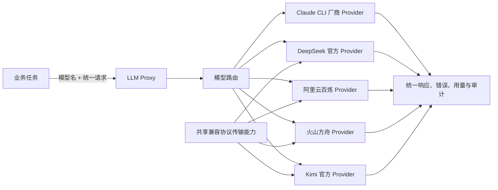

# 多模型厂商接入设计方案

## 1. 本文定位

本文定义 LLM Proxy 从少数固定后端演进为多模型厂商统一入口后的目标形态。它关注系统边界、扩展方式和验收口径，不描述具体代码与部署命令。

对应实施文档见 `docs/3. 实施方案/5. LLM Proxy/4. OpenAI兼容多厂商Provider技术实施方案.md`。

## 2. 背景问题

当前网关已有模型路由、Provider 注册、缓存、重试和审计能力，但公网模型调用最初按 DeepSeek 的特性实现。若每接入一个厂商都复制一套 HTTP、错误处理和响应归一化逻辑，将产生以下问题：

- 同一种兼容协议出现多份实现，行为逐渐分叉；
- 厂商专有参数进入业务层，业务任务与供应商耦合；
- 模型快速上新时必须修改代码才能路由；
- 重试、限流、密钥保护和审计规则难以保持一致。

## 3. 系统定位

业务层只选择模型，不选择 SDK，不感知厂商认证和接口地址。LLM Proxy 负责把模型解析为候选 Provider，并将统一请求转换为上游兼容协议。

## 4. 目标系统形态

### 4.1 稳定内核

网关内核统一承担路由、缓存、fallback、调用日志和错误语义，不因新增厂商而变化。

### 4.2 厂商是扩展和配置单元

每个厂商 Provider 独立拥有认证、服务地址、超时/限流策略、协议差异和模型目录。模型目录保存网关统一模型名到该厂商上游模型 ID 的映射。同一个统一模型名可以同时存在于多个厂商目录中，上游 ID 不要求相同。

### 4.3 协议复用

采用 OpenAI Chat Completions 兼容协议的厂商共享一套传输能力，包括：

- 消息、工具、结构化输出请求转换；
- 超时、重试、限流冷却；
- token 与推理内容归一化；
- 密钥脱敏和健康状态输出。

协议相同只意味着厂商 Provider 可以复用传输实现，不意味着多个厂商被合并成一个 Provider。

### 4.4 能力特化

通用协议不等于能力完全一致。厂商特有的推理开关、续写接口或附加参数留在 Provider 边界内，通过能力配置或轻量特化表达，禁止扩散到业务服务。

### 4.5 声明式扩展

新增 OpenAI-compatible 厂商时，优先声明厂商地址、密钥来源、默认模型、模型目录与映射、超时和模型匹配规则。只有厂商协议确有差异时才新增特化实现。

## 5. 核心设计判断

### 5.1 模型名是业务选择，Provider 是基础设施选择

知识图谱等业务方案继续只保存模型名。模型到厂商的映射由网关统一维护，避免业务代码出现阿里云、火山或 Kimi 分支。

调用方未指定厂商时，网关依据候选厂商优先级和各厂商模型目录选择；调用方需要确定性、灰度或对比测试时，可以显式指定厂商，但仍使用相同的统一模型名。

### 5.2 路由策略不拥有模型定义

路由只保存候选厂商及优先级。某厂商是否支持模型、实际向上游发送什么模型 ID，由该厂商自己的目录决定。这样同一个 DeepSeek 模型可以在官方、阿里云和火山目录中分别映射。

### 5.3 密钥只来自运行环境

源码、测试 fixture、健康检查和调用日志均不得包含真实密钥。声明式配置只引用密钥所在的环境变量。

### 5.4 按 API 类型划分能力

本阶段统一的是文本 Chat Completions。Embedding、Realtime Audio、图像和视频属于不同请求与响应契约，不伪装成聊天模型，后续应作为独立能力接口接入同一网关治理体系。

## 6. 系统收益

- 阿里云百炼上的 Qwen、Kimi、GLM、MiniMax 等文本模型可复用同一接入链路；
- 火山方舟上的豆包、DeepSeek、Kimi 等文本模型以独立厂商目录接入；
- 新厂商的基础接入由代码开发降为配置变更；
- DeepSeek 已有的专有续写能力得以保留，不污染其他厂商；
- 所有厂商继续共享现有缓存、审计和故障处理语义；
- 后续可在统一观测数据上比较模型质量、时延与成本。

## 7. 应调整的旧能力定位

DeepSeek Provider 不再拥有通用 OpenAI-compatible 传输职责，只保留 DeepSeek 专属差异。模型前缀判断不再硬编码为少数厂商，改由可配置的精确和通配路由共同决定。

## 8. 验收口径

- 默认配置中可将 Qwen、Kimi 和新版本 GLM 文本模型路由到阿里云 Provider；
- 阿里云调用使用官方 OpenAI-compatible 地址和 Bearer 认证；
- 火山调用使用方舟北京地域地址，可调用 Model ID 或配置的 Endpoint ID；
- 同一个 DeepSeek canonical model 可分别映射到阿里云与火山的上游模型 ID；
- DeepSeek 既有单元测试全部通过，专有行为不回退；
- 新增通用 Provider 的请求、错误、用量、健康检查均符合网关统一契约；
- 显式指定厂商时只从该厂商模型目录解析；未指定时可在多个厂商间按优先级选择；
- 响应和审计能区分统一模型名与厂商上游模型 ID；
- 无真实 API Key 进入仓库或测试输出；
- 新增其他兼容厂商无需复制网络调用实现。

## 9. 关键待验证问题

- 阿里云聚合的不同模型对 JSON mode、工具调用和推理参数的支持范围并不完全一致，需要逐步建设模型级能力目录；
- 不同计费计划和地域的 Base URL、API Key 必须配套使用；
- Embedding 与 Realtime 等非聊天能力需要独立契约，不能由当前文本 Provider 直接覆盖。

## 10. 和实施文档的关系

实施文档负责说明通用 Provider、DeepSeek 特化、阿里云配置、模型路由、测试和迁移方式；本文作为后续接入火山方舟、Kimi 官方 API 及其他兼容厂商时的架构边界。
