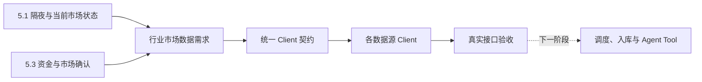

# 行业市场数据 Client 能力完善实施方案

## 1. 文档定位

本文定义行业市场数据改造的第一阶段：先确定投资观点形成所需的数据，再完善外部
数据 Client，并通过真实接口调用确认 Client 返回的数据满足要求。

本阶段是
[Research Agent（研究智能体）投资观点形成与持续演化设计方案](../../5.%20设计方案/4.%20Agent工具/4.%20Research%20Agent研究智能体设计方案.md)
中以下两个环节的数据基础：

- `5.1 隔夜与当前市场状态`；
- `5.3 资金与市场确认`。

本阶段不为其他业务泛化建设完整行情平台，也不直接实现市场观点生成。数据需求、
Client 方法和验收标准都必须能够追溯到上述两个环节。

本阶段完成后，系统应获得一组经过真实验证、语义清楚、字段稳定的行业市场数据
Client。任务调度、检查点、数据库设计、入库、查询服务、MCP Tool 和 Agent 编排在
下一阶段单独设计与实施。

## 2. 本阶段边界

### 2.1 本阶段包含

1. 明确市场和行业研究需要哪些原始数据。
2. 盘点现有 `SinaClient`、`EastmoneyClient`、`THSClient`、`TencentClient`、
   `PBOCClient` 的能力，并补充交易所 ETF 份额、市场估值和中债指数 Client。
3. 通过真实外部接口验证现有方法，不以“代码中存在方法”代替可用性验收。
4. 定义 Client 层统一返回契约和失败语义。
5. 修复失效接口，补充缺失的 Client 方法。
6. 为行业、概念、ETF 和跨市场数据建立可重复执行的 Client 验证脚本与测试。

### 2.2 本阶段不包含

- 不修改 `collection_tasks.py` 和 Schedule。
- 不新增或修改数据库表。
- 不设计增量检查点、回填和任务并发。
- 不把行业行情转换成 Card、Edge 或 Community。
- 不新增 REST API 或 MCP Tool。
- 不修改 OpenAI Agents SDK 的提示词和运行流程。
- 不在 Client 内完成跨来源融合、行业名称归一化和行业到 ETF 的最终映射。

Client 只负责准确访问一个外部来源并返回稳定结果。跨来源选择、合并、持久化和
下游查询属于后续环节。

### 2.3 与观点形成环节的对应关系

| 观点形成环节 | 本阶段提供的 Client 数据 | 本阶段不负责 |
|---|---|---|
| `5.1 隔夜与当前市场状态` | 主要指数、海外指数、期货、商品、外汇、利率与流动性、市场广度、行业与概念实时快照、ETF 行情 | 判断核心驱动、更新 Current Research Report、解释涨跌原因 |
| `5.3 资金与市场确认` | 行业与概念资金流、板块及 ETF 历史行情、成交量、成交额、换手率、上涨与下跌家数 | 计算正式投资信号、跨来源融合、判断观点成立或失效 |

Client 返回的是可核验的市场事实，不输出“行业值得买入”“资金已经确认某个观点”
等业务结论。

除了两个直接数据章节，本阶段还需要满足观点方案中对这些数据的使用要求：

- `6.1 定时市场扫描` 需要可靠的交易日历和交易时段；
- `6.3 行情和资金触发` 需要足够计算异常波动的历史行情，而不是 Client 直接给出
  “异常”结论；
- `8. View Research Candidate` 需要明确当前市场、交易时段和数据新鲜度；
- `9.4 检查市场响应` 需要板块、ETF、标的、商品和库存的原始观测数据；
- `12. 每日市场复盘与机会清单` 需要可比较、可持续更新的市场与资金序列。

## 3. 为什么必须先完善 Client

当前代码已经定义市场和资金采集任务，但 Client 的真实能力与代码注释并不一致：

1. 部分接口能够返回概念板块，却没有在定时链路中同时获取行业板块。
2. 东方财富板块目录和板块 K 线方法已经存在，但真实调用返回空或失败。
3. 部分方法只返回排行榜前若干项，不能当成完整行业目录。
4. 部分数据只有板块名称，没有稳定的来源代码，无法跨日期识别同一板块。
5. 当前板块多日涨幅使用领涨股 K 线估算，不等于板块自身表现。
6. 上游返回空数据时可能被当作成功，导致任务状态正常但实际没有数据。

如果在这些问题解决前直接设计调度和表结构，会把错误的数据边界固化到后续系统。

## 4. 观点系统需要回答的问题

行业市场数据不是为了完整复制行情终端，而是为了让研究 Agent 能够回答以下问题：

### 4.1 当前市场状态

- A 股主要指数当前处于上涨、下跌还是震荡状态？
- 隔夜海外指数、商品、期货和汇率是否形成明显风险偏好变化？
- 当前上涨和下跌是否具有市场广度，还是由少数权重资产驱动？
- 哪些行业和概念正在领涨、领跌或出现异常成交？

### 4.2 行业相对强弱

- 某行业相对大盘和其他行业是一日脉冲还是连续走强？
- 行业最近 1、3、5、20 个交易日的收益、成交和波动如何？
- 行业内上涨和下跌公司数量是否支持板块指数表现？
- 行业表现是否由单一龙头推动？

### 4.3 资金确认

- 哪些行业或概念正在获得主力资金净流入？
- 资金流入是否连续，还是只在一个时点出现？
- 价格上涨和资金流入是否同时出现？
- 新闻叙事对应的行业、代表 ETF 和相关标的是否发生一致响应？

### 4.4 ETF 与可交易载体

- 某行业有哪些可交易的代表 ETF？
- ETF 的价格、成交额、换手率和份额变化是否确认行业信号？
- 行业指数上涨时，代表 ETF 是否同步，还是存在明显背离？

### 4.5 时间、交易状态与数据新鲜度

- 当前日期对目标市场是否为交易日？
- 市场处于盘前、连续竞价、午间休市、盘后还是休市状态？
- 行情时间是来源观测时间、交易所时间还是本地抓取时间？
- 标的是否停牌、退市、处于集合竞价或没有有效报价？
- 当前结果是否足够新鲜，可以参与本轮观点研究？

Client 只返回交易日历、交易时段、行情状态和来源时间。是否过期以及是否触发研究，
由后续服务根据运行场景判断。

### 4.6 上游商品与库存验证

- 影响行业成本或供需的商品当前价格和历史趋势是什么？
- 期货价格变化是单点报价还是连续趋势？
- 来源是否提供库存、仓单、期限结构或现货价格？
- 新闻叙事所引用的价格与市场可观测数据是否一致？

不同产业依赖不同上游指标。本阶段先建立可扩展契约并跑通代表性商品，不要求一次
覆盖所有产业。

## 5. 目标数据范围

### 5.1 P0：第一阶段必须跑通

| 数据对象 | 需要的数据 | 用途 |
|---|---|---|
| 交易日历与交易时段 | 市场、交易日期、开闭市状态、盘前/盘中/午休/盘后、时区 | 正确执行盘前、盘中和盘后观察 |
| 市场总览 | 主要指数、涨跌家数、成交额、涨跌停数量 | 判断市场方向和广度 |
| 跨市场快照 | 海外指数、国内外期货、商品、外汇 | 判断隔夜和跨市场环境 |
| 基准指数历史 | A股宽基、大小盘、港股、美股等基准的日 K 线 | 计算相对强弱和跨市场一致性 |
| 利率与流动性快照 | Shibor、LPR、可获得的中外基准国债收益率及对应时间 | 判断利率与流动性环境 |
| 市场估值历史 | 上证、深证市场长期 PE/PB，保留第三方来源标识 | 判断整体估值位置 |
| 债券指数历史 | 中债新综合全价、净价、财富指数 | 观察债券价格和总回报变化 |
| 盘中异动事件 | 集合竞价、快速拉升、跳水、大笔买卖、封板等来源事件 | 回放盘中异常 |
| 板块目录 | 来源板块代码、名称、行业/概念类型 | 建立所有后续查询的稳定入口 |
| 板块实时快照 | 涨跌幅、成交额、换手率、上涨/下跌家数、领涨股 | 判断当前行业强弱 |
| 板块日 K 线 | 日期、OHLC、成交量、成交额 | 计算持续性、相对强弱和波动 |
| 板块资金流 | 主力净流入及超大/大/中/小单数据 | 判断资金是否确认价格变化 |
| ETF 目录与身份 | 代码、名称、市场、基金类型、跟踪指数 | 建立板块到可交易载体的候选入口 |
| ETF 行情 | 价格、涨跌幅、成交量、成交额、换手率、交易状态 | 判断可交易载体是否响应 |
| ETF 日 K 线 | OHLC、成交量、成交额 | 判断 ETF 响应的持续性 |
| 商品与期货历史 | 代表性国内外商品和期货的快照及日 K 线 | 检查上游价格变化和持续性 |

### 5.2 P1：P0 稳定后补充

| 数据对象 | 需要的数据 | 用途 |
|---|---|---|
| 板块分钟 K 线 | 1分钟或5分钟 OHLC、成交量、成交额 | 判断盘中异常与事件窗口 |
| 板块成分股 | 板块代码、成分股代码、权重或成员关系 | 计算行业广度并解释龙头贡献 |
| ETF 份额变化 | 交易所日份额、上一交易日份额和确认份额变化 | 区分价格上涨与日级份额净变化 |
| ETF 盘中预估申购净流入 | 同花顺深市 ETF 分钟预估总额、趋势和合作 ETF 池流入榜首 | 观察盘中 ETF 资金方向，必须标记为估算值 |
| 融资融券等资金 | 行业维度融资余额及变化 | 补充杠杆资金确认 |
| 商品库存与仓单 | 交易所库存、注册仓单、可获得的现货库存 | 验证供需叙事 |
| 期货期限结构 | 不同合约价格、到期日和主力合约标记 | 区分现货压力与远期预期 |

### 5.3 暂不纳入

- 交易所逐笔成交和 Level-2 委托簿；东方财富异动事件流不等同于该能力。
- 全市场 ETF 真实盘中申购、赎回确认；当前同花顺公开口径只按深市
  `（申购量-赎回量）× IOPV` 估算，最终事实仍以交易所日份额变化为准。
- 期权隐含波动率曲面。
- 所有券商行业分类体系的完整映射。
- 无法确认口径的“热度分”“资金关注度”等黑盒指标。
- 由行情序列派生的异常分、趋势、相对强弱和观点确认结论。

## 6. Client 统一返回契约

统一契约用于约束语义，不要求所有来源提供相同字段。来源无法提供的字段返回
`null`，禁止根据常识、其他接口或代理标的自行补值。

### 6.1 通用元数据

所有结果都应包含：

| 字段 | 含义 |
|---|---|
| `provider` | 数据来源，例如 `sina`、`eastmoney`、`ths` |
| `observed_at` | 数据实际对应或抓取的时间 |
| `market` | 市场，例如 `cn`、`hk`、`us`、`global` |
| `status` | `ok`、`empty`、`upstream_error`、`parse_error` |
| `provider_metadata` | 来源特有但不参与统一语义的必要信息 |

`status=empty` 只能表示上游明确返回了合法空集合。网络异常、响应结构改变和解析失败
必须返回错误状态，不能伪装为空集合。

时间字段还必须区分：

- `source_time`：来源或交易所声明的数据时间；
- `fetched_at`：本系统完成请求的时间；
- `trade_date`：数据所属交易日；
- `timezone`：来源时间使用的时区；
- `market_session`：盘前、盘中、午休、盘后或休市。

不能只返回没有日期和时区的 `time` 字符串。

### 6.2 交易日历与行情状态

交易日历至少包含市场、日期、是否交易日、开盘和收盘时间、盘中休市区间及时区。

实时行情还应保留：

- `trading_status`；
- `previous_close`；
- `source_time`；
- 停牌或无有效报价标记；
- 来源能够提供时的涨跌停价格。

Client 不根据本地星期几推断法定交易日，也不根据价格不变推断停牌。

### 6.3 板块身份

| 字段 | 要求 |
|---|---|
| `provider_sector_code` | 来源内稳定板块代码；不能用列表下标代替 |
| `sector_name` | 来源返回的板块名称 |
| `sector_type` | 只能是 `industry` 或 `concept` |
| `classification` | 来源分类体系，未知时明确为 `provider_defined` |

Client 阶段不生成全局行业 ID。不同来源的代码和名称映射在后续标准化阶段处理。

### 6.4 板块快照

核心字段包括：

- 板块身份；
- 最新值或板块指数值；
- 涨跌额、涨跌幅；
- 成交量、成交额、换手率；
- 上涨家数、下跌家数；
- 领涨股代码、名称和涨跌幅；
- 主力净流入；
- 数据对应交易时间。

不能使用领涨股的 3 日或 5 日涨跌幅替代板块自身涨跌幅。

### 6.5 板块 K 线

每根 Bar 至少包含：

- 板块身份；
- `interval`；
- 交易日期或时间；
- `open`、`high`、`low`、`close`；
- `volume`、`turnover`；
- 复权或口径说明。

请求 N 根 Bar 时应返回来源实际可用的最近 N 根，并明确总数和时间范围。

### 6.6 板块资金流

至少包含：

- 板块身份或可用于后续匹配的来源名称；
- 数据日期或时间；
- 主力净流入；
- 超大单、大单、中单、小单的流入和流出；
- 单位和币种；
- 来源的统计口径。

不同来源的“主力”口径可能不同，Client 必须保留来源与单位，不能在 Client 内直接
相加。

### 6.7 ETF 数据

ETF 行情和 K 线沿用标的市场数据契约，但必须保留：

- 标准证券代码和市场；
- ETF 名称；
- 行情时间；
- 成交量、成交额和换手率；
- 价格与涨跌幅；
- 日 K 线；
- 跟踪指数或基金分类；
- 如果来源支持，基金份额和规模。

行业到 ETF 的选择不由 Client 决定。

### 6.8 商品、期货与库存

商品和期货行情至少保留：

- 来源品种代码、名称、交易所和币种；
- 合约代码、主力合约标记和到期日；
- 最新价、结算价、涨跌幅、成交量、持仓量；
- 数据所属交易日和来源时间；
- 日 K 线。

库存和仓单必须保留统计对象、单位、地区或仓库范围、统计日期和来源口径。不同来源
或不同口径的库存不能直接拼接。

## 7. 改造前 Client 实测基线

以下结果是本轮编码前的实测基线，用于说明改造起点。编码后的最终状态以第 13 章
为准。

### 7.1 SinaClient

| 方法 | 行业 | 概念 | 当前判断 |
|---|---:|---:|---|
| `get_sector_ranking` | 可用，来源总数84 | 可用，来源总数175 | 可作为涨跌排行来源 |
| `get_sector_money_flow` | 可用 | 可用 | 可作为分单资金流来源 |
| `get_global_index` | 可用 | 不适用 | 保留 |
| `get_futures` | 可用 | 不适用 | 保留 |
| `get_forex` | 可用 | 不适用 | 保留 |

现存问题：

1. 排行方法只返回前 N 个上涨和前 N 个下跌板块，不是完整板块目录。
2. 资金流只返回排序后的前 N 项。
3. 资金流结果没有稳定板块代码，主要依赖名称。
4. 返回格式使用来源字段命名，缺少统一状态和时间语义。

### 7.2 EastmoneyClient

| 方法 | 实测结果 | 当前判断 |
|---|---|---|
| `get_sector_list` | 行业和概念均返回0项 | 当前不可用 |
| `get_sector_kline` | 使用已知 BK 代码仍请求失败 | 当前不可用 |
| `get_sector_minute_kline` | 与日 K 线使用同一失效来源 | 未达到可用标准 |
| 个股、指数和 ETF K 线 | 已有其他生产使用 | 继续作为标的数据来源 |

现存问题：

1. `get_sector_list` 使用的 `getTopicBKDaily` 接口已经不能提供有效目录。
2. `push2his.eastmoney.com` 板块历史 K 线在当前运行环境请求失败。
3. 方法把异常压缩为“空列表”或简单错误消息，缺少可诊断的失败类型。

### 7.3 THSClient

`get_hot_board` 实际访问东方财富 Push2 接口，而不是同花顺接口。真实调用中：

- `industry` 可返回板块代码、涨跌幅、成交额、资金净流入、涨跌家数和5日涨跌幅；
- `concept` 可返回相同结构；
- 当前方法最多返回30项，不能作为完整板块目录。

该方法的数据来源归属和代码位置不一致。目标状态应把东方财富 Push2 板块能力迁移
到 `EastmoneyClient`，`THSClient` 只保留真正属于同花顺的数据接口。

`get_hot_plate` 和 `get_hot_etf` 可作为热度线索，但热度不是价格和资金事实，不能
替代行业行情及 ETF 行情。

### 7.4 TencentClient

现有能力主要面向具体标的：

- A股、港股和美股实时行情；
- 个股资金流；
- 分时与部分 K 线；
- 个股所属行业、概念和地域；
- 个股行业排名。

它适合补充“行业到公司”和“代表标的确认”，但不能提供完整行业板块目录、板块
行情和板块资金历史。

### 7.5 PBOCClient 与现有利率代理

`PBOCClient` 已存在 Shibor、LPR、公开市场操作和政策公告等方法，但本轮尚未对
这些方法执行完整的真实接口验收，不能直接认定已经满足 `5.1`。

现有 `AggregatorClient.get_market_environment` 使用十年国债 ETF 价格变化代理
国债收益率方向。该信号可以作为市场代理指标，但不能冒充真实国债收益率。Client
阶段需要分别返回原始 ETF 行情和真实利率数据；是否把二者组合成市场环境判断，
属于后续聚合与观点形成阶段。

#### 7.5.1 MarketValuationClient

`MarketValuationClient` 从乐咕公开接口取得上证、深证市场长期 PE/PB。PE 保留来源
发布频率，PB 保留整体、加权和中位数口径；结果明确标记为第三方市场数据，不能
表述为交易所或指数公司的正式授权口径。CSRF 与 Cookie 会话在 Client 内串行化，
避免并发市场请求互相覆盖。

#### 7.5.2 ChinaBondClient

`ChinaBondClient` 从中债官方接口读取中债-新综合指数总值口径的全价、净价和财富
指数。三条序列独立返回并保留指标代码，不能用国债收益率或债券 ETF 价格替代。

### 7.6 跨 Client 的能力缺口

根据整份观点方案反查，当前还存在以下缺口：

1. **缺少可靠交易日历。** 当前部分代码只按星期一至星期五判断交易日，无法处理
   法定节假日、临时休市和不同市场时区。
2. **行情状态语义不统一。** 多数实时行情只返回一个无时区的 `time` 字段，没有
   统一的交易状态、来源时间、停牌和无有效报价标记。
3. **基准历史数据分散。** A股指数、港美股和全球指数分别来自不同方法，字段和
   时间口径不统一，尚不能稳定计算跨市场和板块相对强弱。
4. **ETF 能力碎片化。** 现有方法覆盖基金搜索、净值、部分行情、持仓、规模和热度，
   但缺少经过验收的完整 ETF 目录、跟踪指数、实时行情、历史行情与份额序列闭环。
5. **商品只有有限快照。** 新浪和腾讯可以返回部分国内外期货快照，但尚无统一的
   商品历史行情、合约身份、主力合约切换、库存和仓单数据。
6. **原始事实与派生判断混合。** `AggregatorClient` 会直接输出趋势、情绪和
   `signals`，并使用十年国债 ETF 代理真实收益率。这些结论不能作为 Client 原始
   数据契约的一部分。

### 7.7 整份观点方案需要、但不属于本阶段的 Client

以下能力也来自外部系统，但不应塞进行业市场数据 Client：

| 能力 | 当前情况 | 后续归属 |
|---|---|---|
| 真实账户持仓 | `TianTianClient` 只覆盖特定基金账户，不能代表股票券商账户 | 独立账户与券商 Client |
| 基金穿透数据 | `THSClient` 已有持仓、资产配置、规模等方法，但需针对 ETF/基金真实验收 | 标的持续跟踪 Client |
| 上市公司正式公告 | 当前主要依赖新闻和东方财富数据，缺少交易所或法定披露源的统一公告 Client | 公司事实与公告 Client |
| 观点、持仓理由和失效条件 | 属于系统内部业务状态，不是外部数据 | View/Portfolio 服务 |

这些能力不阻塞本阶段完成 5.1 和 5.3 的市场数据基础，但在实现持仓安全检查和公司级
观点前必须单独补齐。

## 8. Client 改造方案

### 8.1 EastmoneyClient

1. 使用当前可访问的 Push2 板块列表接口替换失效的 `getTopicBKDaily`。
2. 分别支持 `industry` 和 `concept`，并支持遍历完整结果而不是只取前30项。
3. 将现有 `THSClient.get_hot_board` 中属于东方财富的能力迁入。
4. 返回稳定 BK 代码和统一板块快照字段。
5. 调研并恢复板块日 K 线和分钟 K 线：
   - 优先确认可访问的官方历史行情域名或备用子域；
   - 若当前网络对域名存在限制，验证是否可以通过同源可用节点访问；
   - 找不到真实板块 K 线来源时明确判定不支持，不能使用领涨股或代表 ETF 伪装。
6. 区分网络错误、HTTP错误、上游空数据和解析错误。

### 8.2 SinaClient

1. 保留行业和概念的涨跌排行、资金流能力。
2. 返回来源可提供的稳定 key；无法确认其跨日稳定性时标记为来源临时标识。
3. 补充 `observed_at`、单位、币种和资金口径。
4. 支持明确的分页或数量参数；方法名称和文档必须说明返回排行而非完整目录。
5. 对响应字段变化增加解析契约测试。

### 8.3 THSClient

1. 移除或迁移内部访问东方财富 Push2 的板块行情方法。
2. 保留同花顺热板块和热 ETF 数据，并将其定位为热度线索。
3. 验证热度接口是否包含稳定代码、榜单时间和排名变化；不满足时不得承担行情职责。
4. 真实验证 ETF 基础信息、跟踪指数、规模、份额、持仓和净值方法，明确哪些接口
   支持 ETF，哪些只支持场外基金。

### 8.4 ExchangeFundClient

1. 直接访问上交所和深交所公开基金规模接口，不通过第三方行情口径推导 ETF 份额。
2. 上交所按指定交易日返回全部 ETF 份额，深交所支持六个月以内日期范围。
3. 统一返回交易所、证券市场、交易日、ETF 代码、名称、基金份额和份额单位。
4. 提供沪深指定交易日合并查询；任一交易所失败时不得将结果标记为完整市场数据。
5. 只返回交易所披露的日级份额存量，不生成申购额、赎回额或资金净流入。
6. 日份额净变化及其对应资金规模由后续计算层使用相邻交易日份额和 ETF 净值计算，
   并明确标记为计算值。

### 8.5 TencentClient

1. 验证行业代表股票和 ETF 的实时行情、分时及 K 线字段完整性。
2. 保留个股所属板块方法，为后续成分关系补充提供候选。
3. 为 A股、港股、美股和国际期货行情补充统一来源时间与交易状态。
4. 不扩展为板块主数据来源。

### 8.6 PBOCClient

1. 真实验证 Shibor、LPR 和公开市场操作方法的可用性与更新时间。
2. 为利率结果补充期限、数值、单位、发布日期和数据对应日期。
3. 调研能够稳定提供中外基准国债收益率的来源；无法取得时明确记录缺口。
4. 不使用国债 ETF 价格替代真实收益率字段。

### 8.7 市场日历、基准与商品数据

1. 选择能够返回真实交易所日历和交易时段的来源，覆盖第一阶段实际使用的 A股、
   港股和美股市场。
2. 统一验证 A股、港股、美股主要基准指数的实时行情和日 K 线。
3. 在现有国内外期货快照基础上补充代表性品种日 K 线和合约身份。
4. 调研交易所库存、仓单或稳定现货库存来源；本阶段至少形成可用性结论和代表性
   品种验证，不能用新闻中的库存数字冒充行情 Client 数据。

### 8.8 新增统一契约模型

Client 层应为交易日历、行情状态、板块身份、板块快照、板块 Bar、板块资金流、
ETF 行情、基准指数和商品行情建立共享契约。各来源 Client 返回契约对象或可验证的
等价字典。

共享契约只统一语义和类型，不负责：

- 合并多个来源；
- 决定来源优先级；
- 生成全局行业 ID；
- 计算投资信号；
- 写数据库。

## 9. 真实验证脚本

新增独立的行业 Client 验证脚本，串行或受控并发执行以下检查：

1. 获取 A股、港股和美股的交易日历与当前交易时段。
2. 获取完整行业目录。
3. 获取完整概念目录。
4. 分别获取行业和概念的实时快照。
5. 对目录中至少两个行业和两个概念获取日 K 线。
6. 对其中一个板块获取分钟 K 线。
7. 分别获取行业和概念资金流。
8. 获取完整或可分页的 ETF 候选目录，并对至少两只 ETF 获取行情和日 K 线。
9. 获取 A股、港股和美股代表基准的实时行情与日 K 线。
10. 获取全球指数、国内外期货、外汇、利率与流动性快照。
11. 对至少一个国内商品和一个国际商品获取快照及日 K 线。
12. 验证至少一个库存或仓单来源；无法获取时输出明确的不支持结论。
13. 输出字段完整度、时间范围、空值、重复代码和错误分类报告。

验证脚本只调用 Client，不读取或写入业务数据库，不投递任务。

## 10. 验收标准

### 10.1 功能验收

1. A股、港股和美股交易日历能够正确区分交易日、休市日和交易时段。
2. 行业和概念均能获取非空完整目录。
3. 每个板块具有来源稳定代码、名称和正确类型。
4. 行业和概念均能获取实时快照，不再只支持默认概念类型。
5. 板块日 K 线真实来自板块指数，不使用领涨股或 ETF 代理。
6. 至少一个来源能够提供行业和概念资金流。
7. ETF 身份、行情和 K 线能够通过统一标的契约关联。
8. A股、港股和美股代表基准均有可比较的实时与历史行情。
9. 全球指数、期货、外汇和利率结果包含明确时间。
10. 代表性商品同时具备快照和历史行情；库存缺失时明确标记不支持。
11. 国债 ETF 价格和真实国债收益率使用不同字段与数据类型。

### 10.2 质量验收

1. 相同来源的目录、快照和 K 线可以通过来源板块代码关联。
2. 返回数量与来源声明的总数一致，或明确说明分页和截断。
3. 所有金额包含单位，所有时间包含时区或市场时区说明。
4. OHLC 满足基本价格约束，交易日期单调且无重复。
5. `industry` 和 `concept` 不混用。
6. 上游失败不会被记录为成功空集合。
7. 不使用单只股票表现替代板块表现。
8. 交易状态不通过本地星期几或价格是否变化进行猜测。
9. Client 结果不包含趋势、异常、情绪、观点确认等业务判断。

### 10.3 测试用例

| 用例 | 验证内容 |
|---|---|
| 交易日历 | 节假日、周末和正常交易日返回正确状态 |
| 跨市场交易时段 | A股、港股和美股时区及盘前/盘中/盘后状态正确 |
| 行业目录真实调用 | 返回稳定代码、名称、类型和完整数量 |
| 概念目录真实调用 | 与行业目录分离且可分页遍历 |
| 行业快照契约 | 核心价格、成交、广度字段类型正确 |
| 概念快照契约 | 返回类型为 `concept`，不依赖默认参数 |
| 板块日 K 线 | 最近交易日、OHLC、成交量和成交额有效 |
| 板块分钟 K 线 | 时间有序且属于指定交易日 |
| 行业资金流 | 金额单位与超大/大/中/小单字段明确 |
| 概念资金流 | 不与行业结果混合 |
| ETF 行情与 K 线 | 证券代码、市场、时间和成交字段完整 |
| ETF 身份关联 | ETF 代码、基金类型、跟踪指数、行情和历史序列可关联 |
| 基准指数历史 | A股、港股和美股代表基准字段与日期口径一致 |
| 跨市场快照 | 海外指数、期货和外汇时间语义明确 |
| 利率与流动性快照 | Shibor、LPR、国债收益率的期限、单位和日期明确 |
| 利率代理隔离 | 国债 ETF 行情不会被标记为真实国债收益率 |
| 市场估值历史 | 上证、深证 PE/PB 日期有序，来源明确为第三方 |
| 中债指数历史 | 全价、净价和财富指数均非空且指标身份独立 |
| 商品快照与 K 线 | 品种、交易所、合约、币种和时间字段完整 |
| 库存与仓单 | 统计对象、单位、地区、日期和来源口径明确 |
| 行情状态 | 停牌、休市或无有效报价不会被当成正常零涨跌 |
| 合法空结果 | 返回 `empty` 且保留来源响应语义 |
| 网络异常 | 返回 `upstream_error`，不得伪装为空集合 |
| 响应结构变化 | 返回 `parse_error` 并暴露可诊断信息 |
| 字段契约回归 | 使用脱敏 Fixture 验证解析结果 |

## 11. 实施顺序

1. 建立共享返回契约和错误分类。
2. 跑通交易日历、交易时段和行情状态。
3. 修复东方财富完整板块目录。
4. 迁移错误归属在 `THSClient` 中的东方财富板块方法。
5. 跑通行业和概念实时快照。
6. 恢复真实板块日 K 线，再处理分钟 K 线。
7. 完善新浪行业/概念资金流返回契约。
8. 验证 ETF 目录、身份、行情、历史和份额能力。
9. 验证利率、基准指数和跨市场现有方法。
10. 跑通代表性商品快照与历史行情，形成库存来源结论。
11. 完成真实验证脚本、Fixture 和契约测试。
12. 形成 Client 能力验收报告后，才进入调度与入库设计。

## 12. 下一阶段输入

本阶段应向后续“行业市场数据采集与入库”方案交付：

- 已验收的 Client 方法清单；
- 每种数据的统一返回契约；
- 每个来源的实际覆盖范围和限制；
- 真实调用的字段完整度与错误率；
- 板块来源代码和名称样例；
- 可用的历史深度和更新频率；
- 仍然无法获取的数据及原因。

下一阶段的采集频率、历史表与快照表、回填、幂等键、健康检查和 Agent 查询方式见：

- `docs/3. 实施方案/2. 数据聚合/11. 行业市场数据调度、快照与入库实施方案.md`

## 13. 实施结果

### 13.1 已完成能力

截至 2026-07-31，本轮已完成以下 Client 能力：

| 能力 | 实现 |
|---|---|
| 统一返回契约 | 新增 `MarketDataStatus`、`MarketSession`、`TradingStatus` 和统一结果构造器 |
| 错误语义 | 合法空结果、上游错误和解析错误分别返回 `empty`、`upstream_error`、`parse_error` |
| 缓存错误标记 | Client 缓存根据统一状态记录成功或失败，不再把上游错误当成成功空集合 |
| 交易日历 | `MarketCalendarClient` 支持 A股、港股和美股交易日、时区、开收盘及午休状态 |
| 市场广度 | `EastmoneyClient.get_market_breadth` 单次请求返回沪深北 A 股涨跌家数、成交额、主要指数及来源时间；实时源失败时显式标记延时备源，新浪逐股计算保留为校验备用 |
| 成交额同时刻对比 | `EastmoneyClient.get_market_intraday_turnover_comparison` 聚合沪、深、北最近两个交易日的分钟成交额，直接取得上一交易日同一分钟累计成交额 |
| 涨跌停统计 | `THSClient.get_market_limit_counts` 返回涨停、跌停数量和截断样本，不生成情绪判断 |
| 板块目录 | 同花顺行业和概念完整目录 |
| 板块快照 | 同花顺行业快照及新浪行业/概念排行快照 |
| 板块日 K 线 | 同花顺真实行业和概念板块指数日 K 线 |
| 东方财富板块日 K 线 | 日级任务优先访问稳定的 `push2delay` 历史接口，并在失败时回退其他 Push2 域；返回实际选中域和延时标记 |
| 板块盘中序列 | 同花顺板块指数当日 1 分钟价格、成交额、均价和成交量，共 241 个交易时点 |
| 板块成分 | 新浪按来源板块代码分页返回全部成分股；不伪造来源未提供的权重 |
| 板块资金流 | 新浪行业和概念分单资金流，保留来源单位与统计口径 |
| 行业融资融券 | 东方财富直接行业统计，支持 1、3、5、10 日融资余额、净买入、融券和两融余额 |
| ETF | 新浪 ETF 目录和日 K 线、腾讯实时行情、同花顺身份/跟踪指数及季度申购赎回、沪深交易所官方日级 ETF 份额 |
| 跨市场基准 | A股、港股和美股代表基准日 K 线及实时行情 |
| 利率 | Shibor、LPR 和中美国债收益率，国债 ETF 不再冒充真实收益率 |
| 商品 | 国内主力连续和国际商品日 K 线、国内期货快照 |
| 库存 | 东方财富代表性期货库存序列，保留单位和统计范围 |
| 期限结构 | SHFE/INE 使用交易所合约目录结合新浪逐合约报价；DCE 使用新浪全量在市合约；均返回价格、成交量、持仓量和主力合约标记 |

实现没有修改调度、入库、标准行业映射和 Agent Tool，符合本阶段边界。

### 13.2 真实接口验收

真实验证脚本位于：

`scripts/数据源/01_industry_market_client_validation.py`

2026-07-31 完整验收共执行 48 项，48 项均返回 `ok`。核心有效结果包括：

| 检查 | 实测结果 |
|---|---|
| 行业目录 | 90 个 |
| 概念目录 | 374 个 |
| 行业快照 | 90 个 |
| 概念快照 | 175 个 |
| 全 A 股市场广度 | 单次请求覆盖 5,528 个沪深北 A 股状态；上涨 1,768、下跌 3,635、平盘 125 |
| 涨跌停统计 | 接口真实返回涨停和跌停总数 |
| 行业/概念日 K 线 | 每个样本 138 根 |
| 半导体板块盘中序列 | 241 个 1 分钟价格点 |
| 第三代半导体概念盘中序列 | 241 个 1 分钟价格点 |
| 新浪板块成分 | 样本行业 16 个成员 |
| 行业融资融券 | 1 日和 5 日样本均返回 127 个行业 |
| 概念融资融券 | 3 日样本完整分页返回 503 个概念 |
| ETF 目录 | 1,612 个 |
| ETF 份额历史 | 沪深 300 ETF 59 期 |
| 上交所 ETF 日级份额 | 2026-07-30 返回 884 只 |
| 深交所 ETF 日级份额 | 2026-07-28 至 2026-07-30 返回 2,109 条 |
| 沪深 ETF 日级份额 | 2026-07-30 合并返回 1,588 只，其中上交所 884 只、深交所 704 只 |
| A股/港股/美股基准 | 每个样本 60 根日 K 线 |
| 中美国债收益率 | 900 条期限观测 |
| 国内/国际商品 | 每个样本 120 根日 K 线 |
| 黄金期限结构 | 6 个有效合约，按返回曲线内最大持仓量标记主力 |
| 豆粕期限结构 | 6 个 DCE 在市合约，夜盘正确归属下一交易日 |
| 原油期限结构 | 6 个 INE 有效合约，当日目录不可达时回退最近可用交易日 |
| 沪铜库存 | 69 条 |

完整运行没有出现 `empty`、`upstream_error`、`parse_error` 或未捕获异常。该结果
只证明样本接口在验收时可调用，不代表所有结果已经满足字段完整度、新鲜度、历史
连续性和跨来源一致性要求。东方财富 Push2 仍保留为备用能力，但主验收链路不再
依赖其板块目录和分钟接口。

### 13.3 测试结果

- 行业市场 Client、统一契约和交易日历聚焦测试：29 项通过。
- 既有采集与回填回归测试：59 项通过。
- Python 编译检查通过。
- `git diff --check` 通过。

### 13.4 尚未完成

以下内容没有被伪装为已完成，具体整改条件记录在同目录
`9. 待优化.md`：

1. 同花顺板块盘中接口提供分钟价格点，不提供每分钟真实 OHLC。
2. 东方财富实时市场广度域名在当前出口断连，回退结果会明确标记为延时行情。
3. DCE 新浪在市合约来源不提供精确最后交易日和交割日。
4. INE 官方合约目录需要交易日回退，极端情况下响应耗时仍可能接近 20 秒。
5. 交易日历依赖 `exchange-calendars` 内置交易所日程，临时休市需要依赖包更新。
6. 行业快照、概念快照和新浪板块资金流缺少可靠的来源时间，不能只依靠
   `fetched_at` 判断盘中新鲜度。
7. 新浪板块资金流只提供当前排序快照，不能回填历史，连续流入需要在后续采集层
   按固定频率保存快照后计算。
8. 真实验证脚本当前主要验证调用状态、数量和耗时，尚未覆盖全部必填字段、空值率、
   来源时间、新鲜度和跨来源口径一致性。

## 14. 下一阶段快照采集约束

本阶段只完成 Client，不实现调度和入库。下一阶段应使用当前快照接口主动积累盘中
序列，而不是要求上游必须提供完整的盘中历史。

本章约束已经纳入：

- `docs/3. 实施方案/2. 数据聚合/11. 行业市场数据调度、快照与入库实施方案.md`

### 14.1 市场广度

- 仅在目标市场交易时段运行，盘前和收盘后各保存一次状态。
- 连续竞价阶段每 30 秒获取一次沪深北上涨、下跌、平盘家数、成交额和主要指数。
- “较上一交易日同时刻成交额”直接使用沪深北最近两日分钟成交额聚合结果，不要求
  本地快照先运行满一个交易日。
- 同时保存本地 `fetched_at` 与来源 `source_time`，不能用前者替代后者。
- 内容未变化时不重复写入业务快照，但必须更新采集健康状态。
- `source_time` 缺失时标记 `freshness_unknown`；来源延迟超过 3 分钟时，不参与盘中
  异常触发，但仍可用于盘后研究。
- 该快照序列用于判断市场广度扩大、收缩、改善和恶化，不追求逐笔或逐秒行情。
- 30 秒快照仍须保留，因为外部分时接口只提供指数价格、成交量和成交额历史，
  不提供上涨、下跌、平盘家数的历史分钟序列。

### 14.2 行业与概念资金流

- 每次采集来源能够返回的完整资金流集合，不能只保存当前 Top 20。
- 2026-07-31 实测将新浪请求上限设为 500 后，一次返回 48 个行业和 181 个概念；
  后续调度应保存该来源完整返回集合。
- 快照应保留主力及各档订单资金流原值、排名、抓取时间、来源时间和来源口径。
- 连续流入、连续流出、排名变化和量价一致性由后续计算层基于多期快照产生，不在
  Client 内生成。
- 新浪资金流响应缺少稳定板块代码，入库前必须通过标准化层映射到统一板块 ID；
  映射失败的记录保留来源名称并进入待映射状态，不能静默合并。
- 快照只能从任务启用后开始积累连续序列，不能替代部署前历史回填。

### 14.3 快照策略解决与不解决的问题

快照采集能够解决：

- 没有盘中历史接口时自行形成连续序列；
- 判断市场广度和资金流的持续变化；
- 为行情异常、资金确认和盘后复盘提供同一口径的观测点。

快照采集不能解决：

- 上游本身返回延时数据；
- 来源没有声明数据时间；
- 部署前历史不存在；
- 不同来源行业分类和资金统计口径不一致。
