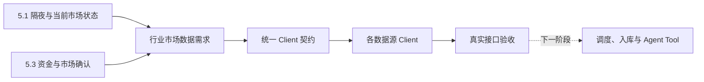

# 行业市场数据 Client 能力完善实施方案

## 1. 文档定位

本文定义行业市场数据改造的第一阶段：先确定投资观点形成所需的数据，再完善外部
数据 Client，并通过真实接口调用确认 Client 返回的数据满足要求。

本阶段是
[Agent 投资观点形成与持续演化设计方案](../../5.%20设计方案/4.%20Agent工具/3.%20Agent投资观点形成与持续演化设计方案.md)
中以下两个环节的数据基础：

- `5.1 隔夜与当前市场状态`；
- `5.3 资金与市场确认`。

本阶段不为其他业务泛化建设完整行情平台，也不直接实现市场观点生成。数据需求、
Client 方法和验收标准都必须能够追溯到上述两个环节。

本阶段完成后，系统应获得一组经过真实验证、语义清楚、字段稳定的行业市场数据
Client。任务调度、检查点、数据库设计、入库、查询服务、MCP Tool 和 Agent 编排在
下一阶段单独设计与实施。

## 2. 本阶段边界

### 2.1 本阶段包含

1. 明确市场和行业研究需要哪些原始数据。
2. 盘点现有 `SinaClient`、`EastmoneyClient`、`THSClient`、`TencentClient`、
   `PBOCClient` 的能力。
3. 通过真实外部接口验证现有方法，不以“代码中存在方法”代替可用性验收。
4. 定义 Client 层统一返回契约和失败语义。
5. 修复失效接口，补充缺失的 Client 方法。
6. 为行业、概念、ETF 和跨市场数据建立可重复执行的 Client 验证脚本与测试。

### 2.2 本阶段不包含

- 不修改 `collection_tasks.py` 和 Schedule。
- 不新增或修改数据库表。
- 不设计增量检查点、回填和任务并发。
- 不把行业行情转换成 Card、Edge 或 Community。
- 不新增 REST API 或 MCP Tool。
- 不修改 OpenAI Agents SDK 的提示词和运行流程。
- 不在 Client 内完成跨来源融合、行业名称归一化和行业到 ETF 的最终映射。

Client 只负责准确访问一个外部来源并返回稳定结果。跨来源选择、合并、持久化和
下游查询属于后续环节。

### 2.3 与观点形成环节的对应关系

| 观点形成环节 | 本阶段提供的 Client 数据 | 本阶段不负责 |
|---|---|---|
| `5.1 隔夜与当前市场状态` | 主要指数、海外指数、期货、商品、外汇、利率与流动性、市场广度、行业与概念实时快照、ETF 行情 | 判断核心驱动、生成 Market Briefing、解释涨跌原因 |
| `5.3 资金与市场确认` | 行业与概念资金流、板块及 ETF 历史行情、成交量、成交额、换手率、上涨与下跌家数 | 计算正式投资信号、跨来源融合、判断观点成立或失效 |

Client 返回的是可核验的市场事实，不输出“行业值得买入”“资金已经确认某个观点”
等业务结论。

## 3. 为什么必须先完善 Client

当前代码已经定义市场和资金采集任务，但 Client 的真实能力与代码注释并不一致：

1. 部分接口能够返回概念板块，却没有在定时链路中同时获取行业板块。
2. 东方财富板块目录和板块 K 线方法已经存在，但真实调用返回空或失败。
3. 部分方法只返回排行榜前若干项，不能当成完整行业目录。
4. 部分数据只有板块名称，没有稳定的来源代码，无法跨日期识别同一板块。
5. 当前板块多日涨幅使用领涨股 K 线估算，不等于板块自身表现。
6. 上游返回空数据时可能被当作成功，导致任务状态正常但实际没有数据。

如果在这些问题解决前直接设计调度和表结构，会把错误的数据边界固化到后续系统。

## 4. 观点系统需要回答的问题

行业市场数据不是为了完整复制行情终端，而是为了让研究 Agent 能够回答以下问题：

### 4.1 当前市场状态

- A 股主要指数当前处于上涨、下跌还是震荡状态？
- 隔夜海外指数、商品、期货和汇率是否形成明显风险偏好变化？
- 当前上涨和下跌是否具有市场广度，还是由少数权重资产驱动？
- 哪些行业和概念正在领涨、领跌或出现异常成交？

### 4.2 行业相对强弱

- 某行业相对大盘和其他行业是一日脉冲还是连续走强？
- 行业最近 1、3、5、20 个交易日的收益、成交和波动如何？
- 行业内上涨和下跌公司数量是否支持板块指数表现？
- 行业表现是否由单一龙头推动？

### 4.3 资金确认

- 哪些行业或概念正在获得主力资金净流入？
- 资金流入是否连续，还是只在一个时点出现？
- 价格上涨和资金流入是否同时出现？
- 新闻叙事对应的行业、代表 ETF 和相关标的是否发生一致响应？

### 4.4 ETF 与可交易载体

- 某行业有哪些可交易的代表 ETF？
- ETF 的价格、成交额、换手率和份额变化是否确认行业信号？
- 行业指数上涨时，代表 ETF 是否同步，还是存在明显背离？

## 5. 目标数据范围

### 5.1 P0：第一阶段必须跑通

| 数据对象 | 需要的数据 | 用途 |
|---|---|---|
| 市场总览 | 主要指数、涨跌家数、成交额、涨跌停数量 | 判断市场方向和广度 |
| 跨市场快照 | 海外指数、国内外期货、商品、外汇 | 判断隔夜和跨市场环境 |
| 利率与流动性快照 | Shibor、LPR、可获得的中外基准国债收益率及对应时间 | 判断利率与流动性环境 |
| 板块目录 | 来源板块代码、名称、行业/概念类型 | 建立所有后续查询的稳定入口 |
| 板块实时快照 | 涨跌幅、成交额、换手率、上涨/下跌家数、领涨股 | 判断当前行业强弱 |
| 板块日 K 线 | 日期、OHLC、成交量、成交额 | 计算持续性、相对强弱和波动 |
| 板块资金流 | 主力净流入及超大/大/中/小单数据 | 判断资金是否确认价格变化 |
| ETF 行情 | 价格、涨跌幅、成交量、成交额、换手率 | 判断可交易载体是否响应 |
| ETF 日 K 线 | OHLC、成交量、成交额 | 判断 ETF 响应的持续性 |

### 5.2 P1：P0 稳定后补充

| 数据对象 | 需要的数据 | 用途 |
|---|---|---|
| 板块分钟 K 线 | 1分钟或5分钟 OHLC、成交量、成交额 | 判断盘中异常与事件窗口 |
| 板块成分股 | 板块代码、成分股代码、权重或成员关系 | 计算行业广度并解释龙头贡献 |
| ETF 份额变化 | 基金份额、规模和份额增减 | 区分价格上涨与真实申购资金流入 |
| 融资融券等资金 | 行业维度融资余额及变化 | 补充杠杆资金确认 |

### 5.3 暂不纳入

- 逐笔成交和 Level-2 委托簿。
- 期权隐含波动率曲面。
- 所有券商行业分类体系的完整映射。
- 无法确认口径的“热度分”“资金关注度”等黑盒指标。

## 6. Client 统一返回契约

统一契约用于约束语义，不要求所有来源提供相同字段。来源无法提供的字段返回
`null`，禁止根据常识、其他接口或代理标的自行补值。

### 6.1 通用元数据

所有结果都应包含：

| 字段 | 含义 |
|---|---|
| `provider` | 数据来源，例如 `sina`、`eastmoney`、`ths` |
| `observed_at` | 数据实际对应或抓取的时间 |
| `market` | 市场，例如 `cn`、`hk`、`us`、`global` |
| `status` | `ok`、`empty`、`upstream_error`、`parse_error` |
| `provider_metadata` | 来源特有但不参与统一语义的必要信息 |

`status=empty` 只能表示上游明确返回了合法空集合。网络异常、响应结构改变和解析失败
必须返回错误状态，不能伪装为空集合。

### 6.2 板块身份

| 字段 | 要求 |
|---|---|
| `provider_sector_code` | 来源内稳定板块代码；不能用列表下标代替 |
| `sector_name` | 来源返回的板块名称 |
| `sector_type` | 只能是 `industry` 或 `concept` |
| `classification` | 来源分类体系，未知时明确为 `provider_defined` |

Client 阶段不生成全局行业 ID。不同来源的代码和名称映射在后续标准化阶段处理。

### 6.3 板块快照

核心字段包括：

- 板块身份；
- 最新值或板块指数值；
- 涨跌额、涨跌幅；
- 成交量、成交额、换手率；
- 上涨家数、下跌家数；
- 领涨股代码、名称和涨跌幅；
- 主力净流入；
- 数据对应交易时间。

不能使用领涨股的 3 日或 5 日涨跌幅替代板块自身涨跌幅。

### 6.4 板块 K 线

每根 Bar 至少包含：

- 板块身份；
- `interval`；
- 交易日期或时间；
- `open`、`high`、`low`、`close`；
- `volume`、`turnover`；
- 复权或口径说明。

请求 N 根 Bar 时应返回来源实际可用的最近 N 根，并明确总数和时间范围。

### 6.5 板块资金流

至少包含：

- 板块身份或可用于后续匹配的来源名称；
- 数据日期或时间；
- 主力净流入；
- 超大单、大单、中单、小单的流入和流出；
- 单位和币种；
- 来源的统计口径。

不同来源的“主力”口径可能不同，Client 必须保留来源与单位，不能在 Client 内直接
相加。

### 6.6 ETF 数据

ETF 行情和 K 线沿用标的市场数据契约，但必须保留：

- 标准证券代码和市场；
- ETF 名称；
- 行情时间；
- 成交量、成交额和换手率；
- 价格与涨跌幅；
- 日 K 线；
- 如果来源支持，基金份额和规模。

行业到 ETF 的选择不由 Client 决定。

## 7. 现有 Client 实测结果

以下结果基于 2026-07-30 的真实接口调用，不以注释和历史文档状态为依据。

### 7.1 SinaClient

| 方法 | 行业 | 概念 | 当前判断 |
|---|---:|---:|---|
| `get_sector_ranking` | 可用，来源总数84 | 可用，来源总数175 | 可作为涨跌排行来源 |
| `get_sector_money_flow` | 可用 | 可用 | 可作为分单资金流来源 |
| `get_global_index` | 可用 | 不适用 | 保留 |
| `get_futures` | 可用 | 不适用 | 保留 |
| `get_forex` | 可用 | 不适用 | 保留 |

现存问题：

1. 排行方法只返回前 N 个上涨和前 N 个下跌板块，不是完整板块目录。
2. 资金流只返回排序后的前 N 项。
3. 资金流结果没有稳定板块代码，主要依赖名称。
4. 返回格式使用来源字段命名，缺少统一状态和时间语义。

### 7.2 EastmoneyClient

| 方法 | 实测结果 | 当前判断 |
|---|---|---|
| `get_sector_list` | 行业和概念均返回0项 | 当前不可用 |
| `get_sector_kline` | 使用已知 BK 代码仍请求失败 | 当前不可用 |
| `get_sector_minute_kline` | 与日 K 线使用同一失效来源 | 未达到可用标准 |
| 个股、指数和 ETF K 线 | 已有其他生产使用 | 继续作为标的数据来源 |

现存问题：

1. `get_sector_list` 使用的 `getTopicBKDaily` 接口已经不能提供有效目录。
2. `push2his.eastmoney.com` 板块历史 K 线在当前运行环境请求失败。
3. 方法把异常压缩为“空列表”或简单错误消息，缺少可诊断的失败类型。

### 7.3 THSClient

`get_hot_board` 实际访问东方财富 Push2 接口，而不是同花顺接口。真实调用中：

- `industry` 可返回板块代码、涨跌幅、成交额、资金净流入、涨跌家数和5日涨跌幅；
- `concept` 可返回相同结构；
- 当前方法最多返回30项，不能作为完整板块目录。

该方法的数据来源归属和代码位置不一致。目标状态应把东方财富 Push2 板块能力迁移
到 `EastmoneyClient`，`THSClient` 只保留真正属于同花顺的数据接口。

`get_hot_plate` 和 `get_hot_etf` 可作为热度线索，但热度不是价格和资金事实，不能
替代行业行情及 ETF 行情。

### 7.4 TencentClient

现有能力主要面向具体标的：

- A股、港股和美股实时行情；
- 个股资金流；
- 分时与部分 K 线；
- 个股所属行业、概念和地域；
- 个股行业排名。

它适合补充“行业到公司”和“代表标的确认”，但不能提供完整行业板块目录、板块
行情和板块资金历史。

### 7.5 PBOCClient 与现有利率代理

`PBOCClient` 已存在 Shibor、LPR、公开市场操作和政策公告等方法，但本轮尚未对
这些方法执行完整的真实接口验收，不能直接认定已经满足 `5.1`。

现有 `AggregatorClient.get_market_environment` 使用十年国债 ETF 价格变化代理
国债收益率方向。该信号可以作为市场代理指标，但不能冒充真实国债收益率。Client
阶段需要分别返回原始 ETF 行情和真实利率数据；是否把二者组合成市场环境判断，
属于后续聚合与观点形成阶段。

## 8. Client 改造方案

### 8.1 EastmoneyClient

1. 使用当前可访问的 Push2 板块列表接口替换失效的 `getTopicBKDaily`。
2. 分别支持 `industry` 和 `concept`，并支持遍历完整结果而不是只取前30项。
3. 将现有 `THSClient.get_hot_board` 中属于东方财富的能力迁入。
4. 返回稳定 BK 代码和统一板块快照字段。
5. 调研并恢复板块日 K 线和分钟 K 线：
   - 优先确认可访问的官方历史行情域名或备用子域；
   - 若当前网络对域名存在限制，验证是否可以通过同源可用节点访问；
   - 找不到真实板块 K 线来源时明确判定不支持，不能使用领涨股或代表 ETF 伪装。
6. 区分网络错误、HTTP错误、上游空数据和解析错误。

### 8.2 SinaClient

1. 保留行业和概念的涨跌排行、资金流能力。
2. 返回来源可提供的稳定 key；无法确认其跨日稳定性时标记为来源临时标识。
3. 补充 `observed_at`、单位、币种和资金口径。
4. 支持明确的分页或数量参数；方法名称和文档必须说明返回排行而非完整目录。
5. 对响应字段变化增加解析契约测试。

### 8.3 THSClient

1. 移除或迁移内部访问东方财富 Push2 的板块行情方法。
2. 保留同花顺热板块和热 ETF 数据，并将其定位为热度线索。
3. 验证热度接口是否包含稳定代码、榜单时间和排名变化；不满足时不得承担行情职责。

### 8.4 TencentClient

1. 验证行业代表股票和 ETF 的实时行情、分时及 K 线字段完整性。
2. 保留个股所属板块方法，为后续成分关系补充提供候选。
3. 不扩展为板块主数据来源。

### 8.5 PBOCClient

1. 真实验证 Shibor、LPR 和公开市场操作方法的可用性与更新时间。
2. 为利率结果补充期限、数值、单位、发布日期和数据对应日期。
3. 调研能够稳定提供中外基准国债收益率的来源；无法取得时明确记录缺口。
4. 不使用国债 ETF 价格替代真实收益率字段。

### 8.6 新增统一契约模型

Client 层应为板块身份、板块快照、板块 Bar、板块资金流和 ETF 行情建立共享契约。
各来源 Client 返回契约对象或可验证的等价字典。

共享契约只统一语义和类型，不负责：

- 合并多个来源；
- 决定来源优先级；
- 生成全局行业 ID；
- 计算投资信号；
- 写数据库。

## 9. 真实验证脚本

新增独立的行业 Client 验证脚本，串行或受控并发执行以下检查：

1. 获取完整行业目录。
2. 获取完整概念目录。
3. 分别获取行业和概念的实时快照。
4. 对目录中至少两个行业和两个概念获取日 K 线。
5. 对其中一个板块获取分钟 K 线。
6. 分别获取行业和概念资金流。
7. 获取至少两只 ETF 的行情和日 K 线。
8. 获取全球指数、国内外期货、外汇、利率与流动性快照。
9. 输出字段完整度、时间范围、空值、重复代码和错误分类报告。

验证脚本只调用 Client，不读取或写入业务数据库，不投递任务。

## 10. 验收标准

### 10.1 功能验收

1. 行业和概念均能获取非空完整目录。
2. 每个板块具有来源稳定代码、名称和正确类型。
3. 行业和概念均能获取实时快照，不再只支持默认概念类型。
4. 板块日 K 线真实来自板块指数，不使用领涨股或 ETF 代理。
5. 至少一个来源能够提供行业和概念资金流。
6. ETF 行情和 K 线能够通过统一标的契约返回。
7. 全球指数、期货、外汇和利率结果包含明确时间。
8. 国债 ETF 价格和真实国债收益率使用不同字段与数据类型。

### 10.2 质量验收

1. 相同来源的目录、快照和 K 线可以通过来源板块代码关联。
2. 返回数量与来源声明的总数一致，或明确说明分页和截断。
3. 所有金额包含单位，所有时间包含时区或市场时区说明。
4. OHLC 满足基本价格约束，交易日期单调且无重复。
5. `industry` 和 `concept` 不混用。
6. 上游失败不会被记录为成功空集合。
7. 不使用单只股票表现替代板块表现。

### 10.3 测试用例

| 用例 | 验证内容 |
|---|---|
| 行业目录真实调用 | 返回稳定代码、名称、类型和完整数量 |
| 概念目录真实调用 | 与行业目录分离且可分页遍历 |
| 行业快照契约 | 核心价格、成交、广度字段类型正确 |
| 概念快照契约 | 返回类型为 `concept`，不依赖默认参数 |
| 板块日 K 线 | 最近交易日、OHLC、成交量和成交额有效 |
| 板块分钟 K 线 | 时间有序且属于指定交易日 |
| 行业资金流 | 金额单位与超大/大/中/小单字段明确 |
| 概念资金流 | 不与行业结果混合 |
| ETF 行情与 K 线 | 证券代码、市场、时间和成交字段完整 |
| 跨市场快照 | 海外指数、期货和外汇时间语义明确 |
| 利率与流动性快照 | Shibor、LPR、国债收益率的期限、单位和日期明确 |
| 利率代理隔离 | 国债 ETF 行情不会被标记为真实国债收益率 |
| 合法空结果 | 返回 `empty` 且保留来源响应语义 |
| 网络异常 | 返回 `upstream_error`，不得伪装为空集合 |
| 响应结构变化 | 返回 `parse_error` 并暴露可诊断信息 |
| 字段契约回归 | 使用脱敏 Fixture 验证解析结果 |

## 11. 实施顺序

1. 建立共享返回契约和错误分类。
2. 修复东方财富完整板块目录。
3. 迁移错误归属在 `THSClient` 中的东方财富板块方法。
4. 跑通行业和概念实时快照。
5. 恢复真实板块日 K 线，再处理分钟 K 线。
6. 完善新浪行业/概念资金流返回契约。
7. 验证利率、ETF 和跨市场现有方法。
8. 完成真实验证脚本、Fixture 和契约测试。
9. 形成 Client 能力验收报告后，才进入调度与入库设计。

## 12. 下一阶段输入

本阶段应向后续“行业市场数据采集与入库”方案交付：

- 已验收的 Client 方法清单；
- 每种数据的统一返回契约；
- 每个来源的实际覆盖范围和限制；
- 真实调用的字段完整度与错误率；
- 板块来源代码和名称样例；
- 可用的历史深度和更新频率；
- 仍然无法获取的数据及原因。

下一阶段再决定采集频率、历史表与快照表、回填、幂等键、健康检查、MCP Tool 和
Agent 查询方式。
