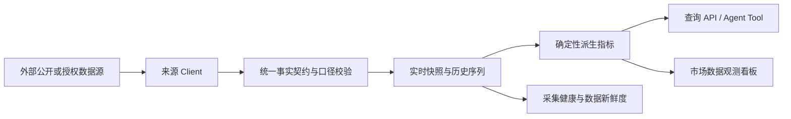
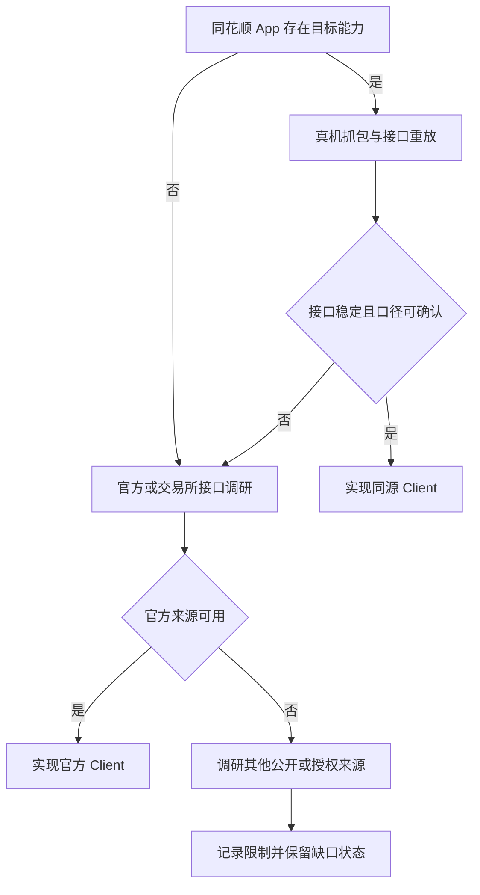

# 客观市场数据缺口补全与验收跟踪实施方案

## 1. 文档定位

本文用于持续跟踪自动化金融研究与交易系统仍然缺少的客观市场数据能力，并作为后续
Client 调研、采集任务、历史回填、查询接口和看板验收的统一清单。

本文承接[行业市场数据 Client 能力完善实施方案](./10.%20行业市场数据Client能力完善实施方案.md)，
不再以“代码中已有方法”或“已经取得部分字段”作为完成标准。只有数据源、自动采集、
持久化、查询和质量验收均通过后，能力才可以标记为完成。

本文记录所有已确认缺口。公开接口暂时无法满足的能力标记为“受限”，但不能从清单中
删除。

同花顺 App 真实接口、字段口径和重放结果见
[同花顺 App 客观市场数据接口逆向调研记录](./12.%20同花顺App客观市场数据接口逆向调研记录.md)。
该调研记录只表示接口已发现或已重放，不表示对应能力已经完成生产接入。

## 2. 范围与完成定义

### 2.1 纳入范围

- 行情、成交、资金、异动、情绪、估值、利率、债券、外汇和跨市场客观数据；
- 从客观原始数据确定性计算的历史分位、期限利差、连续流入和次日表现；
- 数据进入自动化研究前必需的来源时间、交易状态、单位、口径和新鲜度；
- Agent、查询 API 和观测看板需要使用但当前无法稳定读取的数据。

### 2.2 不纳入范围

- 新闻复盘、市场点评、投资建议和人工观点；
- 由 LLM 生成的涨跌原因、交易机会和未来预测；
- 无法解释计算口径的黑盒热度分。

### 2.3 单项能力完成条件

一项能力只有同时满足以下条件才标记为“完成”：

1. Client 已通过真实上游接口验收，不依赖测试夹具冒充可用性；
2. 字段语义、单位、覆盖市场、更新时间和数据口径明确；
3. 定时任务可自动运行，非交易时段、补采和首次初始化行为明确；
4. 数据已幂等持久化，并能够按对象和时间范围查询；
5. 空数据、延时、权限错误和上游失败不会被记录为成功；
6. API、Agent Tool 或观测看板至少有一个正式消费入口；
7. 单元测试、集成测试和一次生产真实数据验收均通过。

## 3. 状态定义

| 状态 | 含义 |
|---|---|
| 完成 | 满足全部完成条件 |
| 部分完成 | 已有部分来源、字段或时间范围，但不足以交付目标能力 |
| 缺失 | 尚无可用数据源或正式采集链路 |
| 受限 | 已确认业务需要，但受公开数据权限、授权或市场披露机制限制 |
| 待派生 | 原始数据已存在，但目标指标和时间序列尚未生成 |
| 待展示 | 数据和查询能力已存在，但正式消费入口尚未呈现 |

## 4. 当前生产基线

截至 2026-08-01，以下能力已经完成真实入库，可作为后续补全工作的基础：

| 数据 | 当前生产基线 |
|---|---|
| A 股市场广度 | 30 秒快照；覆盖沪深北，上涨、下跌、平盘、成交额及 13 个主要指数 |
| 大盘异动原始事件 | 已强制验收并入库 3,772 条当日异动事件 |
| 市场情绪日级信号 | 已物化 2026-07-31 数据，市场温度 70，等级 `hot` |
| ETF 日份额 | 沪深交易所日级份额已持续入库 |
| ETF 盘中估算 | 已接入深市 ETF 分钟预估净流入 |
| 市场估值 | 上证、深证 PE/PB 历史已入库 |
| 国债收益率 | 中国和美国 2 年、5 年、10 年、30 年收益率 |
| 中债指数 | 中债新综合净价、全价、财富指数，首次历史回填 18,438 条 |
| 跨市场快照 | 全球指数、国内外商品期货、人民币交叉汇率分钟快照 |
| 利率与流动性 | Shibor、LPR、公开市场操作净投放等历史数据 |
| 同花顺原生指标 | A50 期指 750 点、道指期货 1,367 点、美元/人民币 1,051 点、逆回购 63 点 |
| 指数情绪 | 上证 50 情绪 1,837 点、创成长情绪 1,795 点 |
| 债市期货 | 十年和二年国债期货连续合约快照 |

上述“已有”只表示基础数据存在，不代表对应的连续指标、Agent 能力和看板表达已经完成。

## 5. 目标数据链路

补全工作必须从左到右验收。不得只增加前端占位，也不得用新闻或 LLM 判断替代缺失的
客观行情数据。

### 5.1 数据源发现优先级

对于已经在同花顺 App 中稳定展示的能力，默认采用以下顺序寻找数据源：

1. 使用已 Root 的测试手机对对应页面进行运行时抓包，确认 App 实际请求；
2. 分析 App 内的接口路由、请求参数、分页方式、鉴权上下文和响应字段；
3. 在隔离测试环境重放真实请求，验证接口能否脱离页面稳定调用；
4. 将响应字段与 App 页面显示值逐项对照，确认单位、时间和统计口径；
5. 接口无法稳定复用时，再调研交易所、官方机构或其他公开 API；
6. 不得在尚未检查 App 请求前，凭字段名称猜测或优先寻找非同源第三方接口。

同花顺 App 已明确展示、应优先抓包确认的页面包括：

- 大盘异动、竞价异动；
- ETF 资金、北向资金、大盘资金；
- 大盘、上证50、创成长市场情绪；
- A50 期指、道琼斯期指；
- 逆回购、美元/人民币；
- 上证指数、深证成指估值；
- 长期国债、短期国债。

### 5.2 App 接口证据包

每个逆向得到的接口都必须保存一份可复核证据包，至少包括：

- 对应 App 页面、页签和 UI 字段；
- 请求方法、URL、Query、Body 和必要 Header；
- 脱敏后的响应样本；
- App 显示值与响应字段的映射；
- 来源时间、交易日期、单位和覆盖市场；
- 分页、排序、历史范围和刷新频率；
- 登录态、Cookie、Token 的生命周期及刷新方式；
- 无登录、登录过期、非交易时段和上游空数据时的行为；
- 接口重放结果和最小稳定请求条件。

认证信息不得写入代码、文档或 Git。正式 Client 只能从运行环境或独立认证服务读取。
抓包发现的接口仍需经过稳定性和口径验收，不能因为 App 能显示就直接判定生产可用。

### 5.3 数据源降级顺序

使用其他来源降级时必须记录为什么不能使用 App 同源接口，以及替代来源与 App 口径的
差异。

## 6. 缺口总表

### 6.1 大盘、异动与个股排行

| 能力 | 当前状态 | 当前基础 | 需要补全 | 优先级 |
|---|---|---|---|---|
| 大盘异动时间线 | 部分完成 | 原有异动事件及同花顺原生 Bridge、Client、30 秒任务均已接入 | 下一个交易日完成原生事件生产连续验收；后续再做确定性聚合 | P0 |
| 集合竞价异动 | 部分完成 | 原生 Bridge、Client、30 秒任务和入库已完成 | 下一个交易日完成 09:15-09:25 生产连续验收；未确认数组不强行命名 | P0 |
| 涨幅榜与跌幅榜 | 缺失 | 只有热门股票和涨停池 | 全市场代码、名称、价格、涨跌幅、来源时间 | P0 |
| 成交额榜 | 缺失 | 单个跟踪标的有成交数据 | 全市场成交额排序及分页能力 | P0 |
| 量比与换手率榜 | 缺失 | 部分涨停池带换手率 | 全市场统一口径排行 | P1 |
| 快速涨跌榜 | 部分完成 | 异动事件包含部分快速变化 | 形成稳定排行、窗口涨跌幅和事件时间 | P1 |
| 昨日涨停今日表现 | 待派生 | 有昨日涨停名单和今日行情 | 开盘溢价、收盘收益、连板率、炸板率和组合均值 | P0 |
| Level-2 逐笔与委托簿 | 受限 | 当前只有公开异动事件 | 评估授权行情源，不能使用异动事件冒充 Level-2 | P2 |

### 6.2 资金流向

| 能力 | 当前状态 | 当前基础 | 需要补全 | 优先级 |
|---|---|---|---|---|
| 深市 ETF 盘中估算 | 完成 | 同花顺分钟估算及榜首 ETF | 持续监控口径变化和来源稳定性 | - |
| 沪市 ETF 盘中估算 | 缺失 | 只有沪市日份额 | 寻找可解释公式和稳定来源，明确覆盖 ETF 池 | P0 |
| 全市场 ETF 盘中真实申赎 | 受限 | 盘后可由日份额确认 | 调研授权来源；估算值与真实申赎必须严格区分 | P2 |
| ETF 日级资金确认 | 待派生 | 沪深日份额和 ETF 行情已存在 | 计算份额变化及对应资金规模，保留确认日期 | P0 |
| 北向成交额 | 完成 | 已有日级成交额历史 | 修正历史字段中将 `DEAL_AMT` 命名为 `net_flow` 的语义错误 | P0 |
| 北向净买入/净卖出 | 受限 | 当前来源不提供该口径 | 调研仍可公开获得的方向性数据或授权源 | P1 |
| 大盘资金当前值 | 完成 | 同花顺原生大盘资金指标已标准化并入库 | 持续监控来源协议和单位 | - |
| 大盘资金历史曲线 | 完成 | 原生分钟曲线已按时间点幂等持久化 | 持续补采新交易日分钟点 | - |
| 行业与概念资金连续性 | 待派生 | 已有分钟板块资金快照 | 连续流入天数、盘中变化和价格资金背离 | P1 |

### 6.3 市场情绪

| 能力 | 当前状态 | 当前基础 | 需要补全 | 优先级 |
|---|---|---|---|---|
| 大盘日级情绪 | 完成 | `ft_sentiment_signal` 已可读写并完成首次物化 | 持续盘后物化和历史回填 | - |
| 大盘盘中情绪 | 待派生 | 有市场广度、涨跌停和异动快照 | 定义可解释公式并形成分钟序列 | P0 |
| 上证50情绪 | 完成 | 同花顺公开接口历史情绪与指数价格已回填 1,837 点 | 黑盒指标只按来源事实展示，不冒充自有公式 | - |
| 创成长行情 | 缺失 | 当前主要指数集合未覆盖 | 接入指数身份、实时行情和历史 K 线 | P0 |
| 创成长情绪 | 完成 | 同花顺公开接口历史情绪与指数价格已回填 1,795 点 | 黑盒指标只按来源事实展示，不冒充自有公式 | - |
| 情绪贡献解释 | 待派生 | 日级信号保存部分贡献数据 | 对外返回广度、涨跌停、量能和异动的贡献拆分 | P1 |

### 6.4 全球市场与货币风向

| 能力 | 当前状态 | 当前基础 | 需要补全 | 优先级 |
|---|---|---|---|---|
| 全球主要现货指数 | 完成 | 道指、纳指、标普、恒指、日经、韩国及欧洲指数 | 保持来源时间和市场状态准确 | - |
| A50 期指 | 完成 | 同花顺原生分钟序列已回填 750 点 | 页面未声明具体合约和换月规则，按来源指标展示 | - |
| 道琼斯期指 | 完成 | 同花顺原生分钟序列已回填 1,367 点 | 页面未声明具体合约和换月规则，按来源指标展示 | - |
| 跨市场分时曲线 | 待展示 | 已有分钟快照 | 提供历史查询和同时间轴对比 | P1 |
| 逆回购 | 完成 | 同花顺 63 点历史与人民银行 OMO 序列并存，来源和口径隔离 | 继续核对正负号和公告口径 | - |
| 美元/人民币 | 完成 | 同花顺原生分钟序列已回填 1,051 点，原有在岸人民币来源保留 | 继续核验同花顺指标是 CNY 还是 CNH | - |
| 离岸人民币 | 缺失 | 无稳定序列 | 接入 USD/CNH 实时和历史数据 | P1 |
| 人民币中间价 | 缺失 | 当前未形成正式序列 | 接入官方每日中间价 | P1 |
| 美元指数 | 缺失 | 无 DXY 行情 | 接入实时快照和日 K 线 | P1 |

### 6.5 市场估值与债市风向

| 能力 | 当前状态 | 当前基础 | 需要补全 | 优先级 |
|---|---|---|---|---|
| 上证市场 PE/PB | 完成 | 长期历史已入库 | 持续日级更新并监控第三方来源 | - |
| 深证市场 PE/PB | 完成 | 长期历史已入库 | 持续日级更新并监控第三方来源 | - |
| 估值历史分位 | 待派生 | 已有 PE/PB 历史 | 计算 1/3/5/10 年分位及样本区间 | P0 |
| 长期国债 | 完成 | 10 年、30 年国债收益率 | 保持日级更新 | - |
| 短期国债 | 完成 | 2 年、5 年国债收益率 | 保持日级更新 | - |
| 中债价格指数 | 完成 | 净价、全价、财富指数已回填 | 持续日级更新 | - |
| 国债期货主连 | 完成 | 新浪十年、二年国债期货连续合约快照已接入 | 与收益率和中债指数保持独立口径 | - |
| 国债期限利差 | 待派生 | 期限收益率已存在 | 2Y-10Y、5Y-30Y 等可解释期限利差 | P1 |
| 股债性价比 | 待派生 | 市场估值和国债收益率已存在 | 明确盈利收益率口径并生成历史序列 | P1 |

## 7. 实施优先级

### 7.1 P0：形成截图对应的基本闭环

1. 大盘异动聚合与集合竞价异动；
2. 全市场涨跌幅、成交额排行榜；
3. 昨日涨停今日表现；
4. 沪市 ETF 盘中估算及 ETF 日级资金确认；
5. 大盘资金分钟历史；
6. 大盘盘中情绪；
7. 创成长行情；
8. A50 期指和道琼斯期指；
9. 逆回购正式查询与展示；
10. 上证、深证估值历史分位；
11. 修正北向成交额字段语义。

### 7.2 P1：增强连续研究能力

1. 量比、换手率和快速涨跌排行；
2. 上证50、创成长情绪；
3. 行业资金连续性与价格资金背离；
4. 离岸人民币、人民币中间价和美元指数；
5. 跨市场同时间轴对比；
6. 国债期限利差和股债性价比。

### 7.3 P2：受限数据调研

1. 全市场 ETF 真实盘中申购、赎回；
2. 北向真实净买入、净卖出；
3. Level-2 逐笔成交、逐笔委托和盘口队列。

P2 能力不能以不可获得为由删除。每次调研需要记录来源、授权条件、价格、覆盖范围和
不能采用的原因。

## 8. 数据契约要求

所有新增数据至少保留：

- 来源 Provider 和来源对象 ID；
- 市场、标的或指标身份；
- 交易日期和来源观测时间；
- 本地抓取时间；
- 数值、单位、币种和统计口径；
- 实时、延时、仅抓取时间或时间未知状态；
- 原始值与派生值标识；
- 估算值、官方确认值和模型结果的明确区分；
- 上游为空、截断、降级或部分覆盖状态。

禁止将成交额命名为净流入，禁止将 ETF 预估申购标记为官方确认，禁止使用现货指数
冒充对应期货合约。

## 9. 自动运行与历史补全要求

1. 盘中数据必须按照交易日历运行，首次部署后允许人工强制验收；
2. 强制验收不能绕过非交易日，且必须在运行记录中标明；
3. 日级数据错过定时点后，应在下一次启动时自动补采；
4. 历史接口必须记录最新完整交易日，避免每次全量回填；
5. 写入使用稳定业务主键幂等更新；
6. 数据源权限错误必须进入采集健康状态，不能只在数据资产页面表现为空；
7. 生产部署后必须立即执行一次真实验收，不能以等待下个交易日代替验收。

## 10. 验收指标

| 指标 | 验收要求 |
|---|---|
| 数据可用性 | 交易时段计划任务成功率不低于 99%，受上游故障影响时明确降级 |
| 新鲜度 | 盘中快照满足对应计划周期，收盘后显示交易状态而非误报延时 |
| 时间正确性 | 来源时间、抓取时间和交易日期能够相互校验 |
| 口径正确性 | 成交额、净流入、估算申购和官方确认不得混用 |
| 幂等性 | 同一批数据重复执行不产生重复记录 |
| 历史连续性 | 交易日序列缺口可发现、可补采、可解释 |
| 查询能力 | 能按指标、对象、交易日期和时间范围读取 |
| 可观测性 | 每个来源均有最近运行状态、数量、耗时和错误信息 |

## 11. 测试用例

### 11.1 单元测试

| 用例 | 验证内容 |
|---|---|
| 来源时间规范化 | 不同时区和时间格式转换后交易日期正确 |
| 口径隔离 | 成交额不会写入净流入字段，估算值不会标记为官方值 |
| 排行稳定性 | 涨跌、成交额、量比排序和并列处理正确 |
| 竞价窗口判断 | 只接受规定竞价时间，人工强制仍不绕过非交易日 |
| 情绪派生 | 输入广度、涨跌停和异动后结果可重复且贡献可解释 |
| 估值分位 | 不同历史窗口、空值和样本不足处理正确 |
| 期限利差 | 期限、单位和方向计算正确 |
| 幂等写入 | 相同业务主键重复执行不会新增重复行 |

### 11.2 Client 真实接口测试

| 用例 | 验证内容 |
|---|---|
| A50 与道指期货 | 返回真实合约、价格、变动、合约时间和来源时间 |
| 创成长行情 | 指数身份、实时行情和历史 K 线一致 |
| 全市场个股排行 | 涨跌榜与成交额榜覆盖数量、分页和来源时间有效 |
| 集合竞价 | 竞价金额、涨跌幅和未匹配量字段真实可用 |
| ETF 资金 | 深沪覆盖范围、估算公式和榜单范围明确 |
| 货币指标 | USD/CNH、中间价和美元指数日期及单位正确 |
| App 接口重放 | 同一时间窗口内响应字段与 App 页面显示值一致 |
| 认证生命周期 | 登录态有效、失效和刷新后的行为均可观测，认证信息不落库不入 Git |

### 11.3 集成测试

| 用例 | 验证内容 |
|---|---|
| 首次初始化 | 空库能够完成必要历史回填并写入检查点 |
| 错过调度补采 | 服务停机后恢复能够补齐日级数据 |
| 盘中连续采集 | 一个完整交易日内快照间隔和数量符合计划 |
| 收盘状态 | 收盘最终快照不会因时间增长被误标为采集卡死 |
| 权限异常 | 数据表无权限时任务失败且观测面板明确报警 |
| Agent 查询 | Agent 能读取最新值、历史序列、口径和新鲜度 |

### 11.4 生产验收

每项能力从“部分完成/缺失”调整为“完成”前，必须记录：

- 真实运行日期和交易时段；
- 实际返回、有效和入库数量；
- 最新来源时间与采集延迟；
- 数据库历史数量和最新日期；
- API 或 Agent Tool 查询结果；
- 对照另一公开行情终端的抽样结果；
- 已知口径差异和仍未解决的问题。

## 12. 跟踪规则

1. 每完成一项，更新本文状态、生产基线和验收记录；
2. “部分完成”不能因为存在一条数据而改为“完成”；
3. 新发现的客观数据缺口直接加入本文，不以截图是否展示为判断依据；
4. 数据源失效后将状态退回“部分完成”或“缺失”；
5. 受限能力保留在 P2，直到取得授权来源或明确永久退出的产品决策；
6. 实现与本文存在偏差时，同步记录到本目录的 `9. 待优化.md`。
## 13. 2026-08-01 同花顺客观数据覆盖验收

本轮以同花顺 App 页面实际展示口径为目标，采集、持久化、查询 API 和观测看板均纳入验收。最终覆盖如下：

| 页面能力 | 系统数据类型 | 粒度 | 当前结论 |
|---|---|---|---|
| 大盘异动 | `market_anomaly` | 盘中事件流 | 已接入原生协议；交易时段每 30 秒采集 |
| 集合竞价异动 | `call_auction` | 竞价热点、涨停、板块及轨迹 | 已接入原生协议；交易日 09:15-09:30 采集 |
| ETF 资金 | `etf_estimated_net_inflow`、`etf_daily_share` | 分钟估算、日份额确认 | 已覆盖同花顺页面估算口径；不得表述为交易所确认的盘中净申购 |
| 北向资金 | `northbound_capital` | 241 个分钟点 | 总成交额及沪深拆分已覆盖；上游当前净流入字段为空时保持 `null` |
| 大盘资金 | `market_capital` | 241 个分钟点 | 已覆盖 |
| 大盘情绪 | `market_sentiment` | 241 个分钟点 | 已覆盖同花顺市场温度口径 |
| 上证 50 情绪 | `index_sentiment` | 日线 | 已覆盖 |
| 创成长情绪 | `index_sentiment` | 日线 | 已覆盖 |
| A50 期指 | `futures_intraday` | 分钟 | 已覆盖 |
| 道指期指 | `futures_intraday` | 分钟 | 已覆盖 |
| 逆回购 | `reverse_repo` | 日线 | 已覆盖，并保留央行公开市场数据作为交叉验证 |
| 美元/人民币 | `forex_intraday` | 分钟 | 已覆盖 |
| 上证估值 | `market_pe`、`market_pb`、`market_valuation_threshold` | 日线 | 当前 PE/PB 与同花顺风险/机会阈值分别存储，避免口径混用 |
| 深证估值 | `market_pe`、`market_pb`、`market_valuation_threshold` | 日线 | 当前 PE/PB 与同花顺风险/机会阈值分别存储，避免口径混用 |
| 长期国债 | `bond_market_price` | 十年国债主连日线 | 已覆盖，同花顺页面口径是期货价格而非收益率 |
| 短期国债 | `bond_market_price` | 二年国债主连日线 | 已覆盖，同花顺页面口径是期货价格而非收益率 |

生产首次回填结果：市场估值与阈值 766 条，长短债价格及中债指数 492 条，北向资金 241 个分钟点。休市日无法产生大盘异动和集合竞价事件；看板固定展示这两项的等待状态，下一个交易时段由定时任务自动写入，不能用伪造快照完成验收。

“全部覆盖”表示同花顺页面的功能类别均有正式链路，不表示上游没有提供的数据可以被推测补齐。北向资金方向字段和 ETF 盘中官方净申购均遵循上游可用口径，缺失值不得写成 0，估算值必须显式标注为估算。

## 14. 2026-08-12 同花顺原生指数与板块日 K 线补全

本轮确认同花顺 Android 原生 Unified 协议 `1234/2312` 可通用于指数、行业板块和概念
板块日 K 线。请求参数为 `stockcode`、`marketcode`、`klineperiod=5`、
`klinebegintime`、`klinecount` 和 `nopush=1`；响应字段 `1/7/8/9/11/13` 分别表示
日期、开盘、最高、最低、收盘和成交量。

正式入库类型如下：

| 数据类型 | 身份 | 覆盖 | 生产首次回填 |
|---|---|---|---|
| `ths_index_daily` | `cn:index:{canonical_code}` | 14 个主要 A 股指数 | 14×120，共1,680条，2026-02-11至2026-08-12 |
| `ths_sector_daily` | `ths:{industry|concept}:{provider_sector_code}` | 479 个同花顺行业/概念板块 | 57,161条，2026-02-11至2026-08-12 |

首次全量采集耗时263.32秒，473个板块首轮成功，6个瞬时失败板块定向重试后均成功。
板块详情可按同花顺 `881xxx/886xxx` 身份直接获得120个交易日 OHLCV，不再通过名称拼接
东方财富 `BKxxxx` 历史。东方财富历史只保留为显式交叉验证来源，不能混入同花顺序列。

Agent 的 `market_instrument_history` 已允许实时研究读取这些持久化历史事实；实时最新价仍应
使用实时行情工具，历史记录不能冒充实时行情。北向历史当前可提供122个交易日的成交额，
方向性净买入/净卖出仍因上游不可用而保持 `null`。
