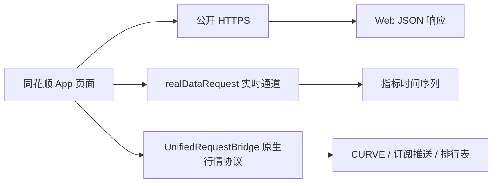

# 同花顺 App 客观市场数据接口逆向调研记录

## 1. 文档定位

本文记录第一阶段的数据源调研结果：先明确自动化金融研究需要哪些客观市场数据，再通过
同花顺 App 真机运行时分析，确认页面实际使用的接口、请求参数、响应字段和业务口径。

本文最初用于接口发现与重放验证，现同步记录已经落地的 Client、调度、入库、查询 API 和
看板状态。接口被 App 使用仍不等于具备稳定生产能力；未完成交易时段连续验收或字段口径
确认的能力会明确标为部分完成。

本文承接：

- [行业市场数据 Client 能力完善实施方案](./10.%20行业市场数据Client能力完善实施方案.md)
- [客观市场数据缺口补全与验收跟踪实施方案](./11.%20客观市场数据缺口补全与验收跟踪实施方案.md)

## 2. 调研边界

### 2.1 本阶段目标

1. 罗列市场研究和观点形成所需的客观数据；
2. 在 App 中定位每项数据对应的页面和真实请求；
3. 对代表性接口进行隔离重放；
4. 核对 App 展示值与响应字段的单位、时间和覆盖范围；
5. 区分公开 HTTP、App 原生协议、估算值和官方确认值；
6. 记录尚未确认的字段和生产接入风险。

### 2.2 持续约束

- 不保存 Cookie、Token、设备标识或账户信息；
- 不将字段名相似当作口径已经确认；
- 不使用 App 页面文案替代接口响应证据。

## 3. 目标数据清单

### 3.1 核心数据

| 模块 | 需要的数据 | 目标用途 | 本次接口定位 |
|---|---|---|---|
| 大盘状态 | 主要指数、涨跌家数、平盘家数、涨跌停家数、成交额 | 判断整体风险偏好和市场广度 | 已定位并重放 |
| 大盘异动 | 盘中异动时间线、方向、关联板块和个股 | 识别盘中结构变化 | 已定位并重放 |
| 集合竞价 | 竞价指数轨迹、涨跌分布、热点股、涨停股和热点板块 | 判断开盘前资金方向 | 已定位并重放 |
| 个股排行 | 涨跌幅、涨速、成交额、量比、换手率、主力净流入、振幅 | 发现市场领导者和异常标的 | 已定位并重放 |
| ETF 资金 | 全市场 ETF 估算流入、单只 ETF 估算流入、榜首 ETF | 确认资金是否通过 ETF 表达主题偏好 | 已定位并重放 |
| 北向资金 | 当日及历史成交额；若可得则方向性资金 | 观察外资参与度 | 已定位，方向性字段为空 |
| 大盘资金 | 大盘主力资金分钟曲线 | 观察价格和资金是否背离 | 已定位并重放 |
| 市场情绪 | 大盘、上证 50、创成长情绪 | 观察情绪温度和历史位置 | 已定位并重放 |
| 全球联动 | 富时 A50 期指、道琼斯股指期货 | 观察 A 股外部定价环境 | 已定位并重放 |
| 货币风向 | 逆回购净投放、美元/人民币 | 观察流动性和汇率压力 | 已定位并重放 |
| 市场估值 | 上证、深证、创业板估值风险与机会阈值 | 判断估值所处区间 | 已定位并重放 |
| 债市风向 | 长期、短期国债期货连续合约 | 观察股债风险偏好 | 已定位并重放 |

### 3.2 后续仍需保留的数据缺口

以下能力不能因为 App 没有直接展示或本次尚未确认而删除：

- 沪市 ETF 盘中可解释估算；
- 全市场 ETF 官方盘中申购、赎回确认；
- 北向净买入、净卖出；
- 离岸人民币、人民币中间价和美元指数；
- 主要指数当前 PE/PB，而非只有历史阈值；
- 国债现券价格指数和收益率曲线；
- Level-2 逐笔成交、逐笔委托和盘口队列。

## 4. 逆向环境与页面结构

### 4.1 验证环境

| 项目 | 结果 |
|---|---|
| 调研日期 | 2026-07-31 |
| App 包名 | `com.hexin.plat.android` |
| App 版本 | `11.51.03`（`versionCode=5205`） |
| 目标页面 | `https://eq.10jqka.com.cn/hxapp/hqMarket/index.html` |
| 页面标题 | 五维分析 |
| 运行环境 | 已 Root Android 真机，App 原生壳内 WebView |

认证参数、设备 ID、Cookie 和账户信息不进入本文。

### 4.2 页面结构

目标页面不是纯网页。外层为 App 原生滚动容器，数据卡片由 WebView 渲染，部分行情通过
原生行情协议回传给 WebView。只观察浏览器 Network 无法覆盖全部数据。



### 4.3 三类传输通道

| 通道 | 特征 | 是否可脱离 App 直接请求 |
|---|---|---|
| 公开 HTTPS | 标准 GET/POST JSON | 本次样本可无登录直接重放，但仍需长期稳定性验证 |
| `realDataRequest` | App 原生实时指标通道；页面通过 WebView Bridge 调用，但底层可直接反射调用 | 已脱离页面和 WebView；仍依赖 App 进程、原生类和通信服务 |
| `UnifiedRequestBridge` | 同花顺原生行情协议，包含协议号、页面号和订阅参数 | 当前需依赖 App Bridge |

### 4.4 请求包结构

`realDataRequest` 的页面请求由三部分组成：

| 字段 | 规则 |
|---|---|
| `key` | 指标 Key，例如 `sjdp_market_capital` |
| `requestParam` | `{key} data` |
| `requestChannel` | `{key}_channel` |

`UnifiedRequestBridge` 的页面请求至少包含：

| 字段 | 作用 |
|---|---|
| `onlineId` | WebView 区分并路由响应的请求 ID |
| `protocolId` | 同花顺原生行情协议号 |
| `pageId` | 协议页面号 |
| `requestDic` | 换行分隔的业务参数，包括标的、排序、分页或订阅 Key |
| `requestType` | 原生请求类型；本页 Android 请求为 `262144` |

原生协议响应存在三种常见形态：行情曲线、字段列式表和 Base64 包装的订阅 JSON。第二阶段
若实现协议适配，必须按响应类型分别解析，不能仅对最外层 JSON 做通用字段读取。

### 4.5 `realDataRequest` 脱离页面验证

运行时分析已经定位 `realDataRequest` 的底层调用链：

```text
RealTimeDataRequestJsInterface
  -> ro9（请求模型）
  -> qo9（请求协调与回调）
  -> uo9（全量请求）
  -> to9（订阅请求）
  -> CommunicationService（原生行情连接）
```

其中全量请求使用 `frame=6004`、`page=1006`，订阅请求使用 `frame=6005`、
`page=1007`，请求类型均为 `262144`。请求文本由 `method`、`userid` 和 `param`
组成。回调对象可读取状态、响应类型、Key 和正文；一次性查询只应将
`response_type=0` 的全量数据作为最终结果，不能把 `response_type=1` 的订阅确认回包
误当成业务数据。

真机已验证以下运行边界：

1. 不打开目标 WebView，也不调用官方 JavaScript Bridge，可以直接构造原生请求对象；
2. 不保留前台 Activity，仅启动 `CommunicationService`，可以获取实时指标；
3. 服务启动后必须将 App 阶段切换到活跃状态，否则通信层不会正常处理请求；
4. 原生 Client 的创建、启动和清理需要在 Android 主线程执行；
5. 固定协议页的请求必须串行执行，完成后立即清理 Client；
6. 连续请求 `sjdp_temperature_hs`、`sjdp_reverse_repurchase`、
   `sjdp_ftse_a50` 和 `sjdp_market_capital` 均返回有效数据。

该结果证明 `realDataRequest` 不再依赖页面和 WebView，但仍不是可直接部署在普通服务器上的
独立 HTTP 协议实现。当前调用仍使用同花顺 App 包内的原生类、身份信息、通信服务和运行态，
因此应称为“无页面的 App 进程内调用”，不能称为“完全脱离 App”。

在 ColorOS 真机息屏测试中，Oplus Hans 会冻结 App UID。前台 Service 和
`PARTIAL_WAKE_LOCK` 不能阻止该冻结。已经确认 Hans 调试接口可以将指定 UID 从管理集合
移除，但冻结期间已失效的行情长连接仍需重新建立；在完成白名单持久化、断线重连和长时间
息屏验收前，该链路不具备生产稳定性。

## 5. 大盘状态与市场广度

### 5.1 市场广度分钟序列

| 项目 | 内容 |
|---|---|
| Bridge Handler | `hqMarketZdt` |
| 请求参数 | 空对象 |
| 返回主字段 | `zt`、`dt`、`time`、`all` |
| 时间范围 | 09:30-15:00 |
| 时间点数量 | 241 个分钟点 |

已验证返回不仅包含当前涨跌家数，还包含完整盘中分钟轨迹。最后一个汇总点包括：

- 上涨总数：4,691；
- 下跌总数：728；
- 平盘：109；
- 涨停：101；
- 跌停：0；
- 炸板或触板相关汇总：102。

响应中的 `z7`、`z03`、`z35`、`d30`、`d53`、`d7`、`d75` 等字段是涨跌幅分桶，
但本阶段未找到完整字段字典，不能直接写死为某个涨跌区间。

### 5.2 主要指数与成交

页面还会请求：

| `onlineId` | 协议 | 用途 |
|---|---|---|
| `profile_yester` | `protocolId=4052`，`pageId=2312` | 昨日涨停表现等市场概况 |
| `profile_dxp` | `protocolId=1264`，`pageId=2312` | 沪深 300、中证 1000 等指数行情 |
| `kpstatus` | `protocolId=4051`，`pageId=9001` | 开盘状态 |

该部分用于页面顶部市场状态，但本文优先记录缺口数据；现有系统已有主要指数和成交额来源，
第二阶段需要对比同花顺口径后再决定是否替换。

## 6. 大盘异动与集合竞价

### 6.1 大盘异动

| `onlineId` | 协议参数 | 作用 |
|---|---|---|
| `dpydLine` | `protocolId=1229`，`pageId=2312`，`stockcode=1A0001`，`marketcode=16` | 上证指数盘中曲线和行情字段 |
| `marketLabel` | `protocolId=1002`，`pageId=6000`，订阅 `mobiledpyd` | 大盘异动事件时间线 |
| `ggList` | `protocolId=1004`，`pageId=6002`，订阅 `dxjl_free` | 个股异动补充列表 |

`marketLabel` 返回的事件包含：

- 事件时间；
- 标题；
- 情绪方向；
- 重要点及资金字段；
- 关联股票代码、名称、涨跌幅和资金流；
- 事件分类 ID。

`ggList` 已重放得到个股代码、名称、市场、事件时间、事件数据 ID 和事件值。数据 ID 到
“大额成交、快速涨跌”等业务名称的完整映射仍需从前端映射表或更多样本确认。

### 6.2 集合竞价

| `onlineId` | 订阅 Key | 返回内容 |
|---|---|---|
| `jjData` | `dpjjyd_stock` | 竞价热点股、竞价涨停股、热点板块和阶段状态 |
| `jjLine` | `dpjjyd_cas_1A0001` | 集合竞价期间指数与涨跌分布轨迹 |

`jjData` 已确认字段包括：

- 热点股：代码、名称、市场、竞价涨幅、竞价量、热度排名、标签、涨停原因；
- 竞价涨停股：代码、名称、竞价涨幅、涨停原因；
- 热点板块：板块代码、名称、竞价涨幅及代表股票；
- 竞价阶段和是否仍处于竞价状态。

`jjLine` 本次返回 61 个阶段点，包含：

- `cas_position`：竞价阶段序号；
- `bidding_direction`：页面竞价指数轨迹值；
- `rise_percent`：竞价涨跌幅；
- `rise_fall`：三项市场数量数组；
- `zhangfu_range`：十档涨跌分布数组。

`rise_fall` 三项的顺序和 `zhangfu_range` 十档边界尚未从字段字典得到确认，第二阶段不能
仅按数值大小猜测。

## 7. 全市场个股排行

排行统一使用 `UnifiedRequestBridge`：

- `protocolId=1208`；
- `pageId=2312`；
- `startrow`、`rowcount` 控制分页；
- `sortid` 选择指标；
- `sortorder` 选择升降序。

### 7.1 已确认排行

| 排行 | `sortid` | 排序 |
|---|---:|---:|
| 涨幅榜 | `34818` | `0` |
| 跌幅榜 | `34818` | `1` |
| 快速涨幅 | `48` | `0` |
| 成交额 | `19` | `0` |
| 大单净量 | `34370` | `0` |
| 量比 | `34311` | `0` |
| 换手率 | `34312` | `0` |
| 主力净流入 | `34391` | `0` |
| 振幅 | `34819` | `0` |

### 7.2 已确认返回字段

| 字段 ID | 页面语义 |
|---:|---|
| `4` | 股票代码 |
| `10` | 最新价 |
| `19` | 成交额 |
| `48` | 涨速 |
| `55` | 股票名称 |
| `34311` | 量比 |
| `34312` | 换手率 |
| `34370` | 大单净量 |
| `34391` | 主力净流入 |
| `34818` | 涨跌幅 |
| `34819` | 振幅 |
| `36072` | 行业板块 |

同一个请求会同时返回上述多列，`sortid` 只决定排序指标。因此第二阶段可以复用一次响应
构建多个榜单，但仍需确认全量分页上限、退市/北交所/新股范围和停牌过滤规则。

## 8. 资金流向

### 8.1 ETF 资金

#### 全市场盘中估算

| 项目 | 内容 |
|---|---|
| 趋势接口 | `/quotation/data/query/gateway/cache/v1/line/{code}/{index}/TREND/{timestamp}/-240` |
| 当前值接口 | `/quotation/data/query/v1/table` |
| 基准代码 | `48:883957`，同花顺全 A（沪深京） |
| 指标 | `estimation_net_inflow_ths_all_a` |
| 单位 | 元 |

当前值接口已无登录重放成功。趋势接口需要传入有效交易时间戳，使用 `0` 会返回空时间序列，
因此不能将空结果误判为市场没有资金流。

#### ETF 榜首与单只 ETF 估算

接口：`POST /quotation/fund_pool/v2/query`。

已确认元数据直接声明：

- 指标名：场内基金 ETF 预估申购净流入；
- 计算公式：`(申购量 - 赎回量) * IOPV`；
- 数据说明：根据深市数据计算；
- 单位：元；
- 本次返回池数量：456。

因此页面中的 ETF 资金是盘中**估算值**，不是交易所确认的实时净申购。当前证据也不能
证明其覆盖沪市 ETF，第二阶段必须继续与沪深交易所日份额确认数据隔离。

### 8.2 北向资金

#### 实时页面通道

`realDataRequest` 使用 Key `sjdp_north_capital`，返回 241 个分钟点，主要字段包括：

- 总、沪、深成交额；
- 总、沪、深净买入；
- 总、沪、深净流入；
- 沪深港通额度状态。

本次响应中的 `net_purchase` 和 `net_inflow` 均为空，成交额字段有值。页面也显示方向性
数据待更新，说明接口结构保留旧字段不代表当前仍有公开数据。

#### 公开历史接口

`GET https://eq.10jqka.com.cn/open/api/dapan_v3/chart/sjdp_north_turnover.json`

已无登录重放成功，返回日级 `date`、`turnover` 和 `szzz`，本次样本 115 个交易日。
该数据只能命名为北向成交额，不能写入净流入或净买入字段。

### 8.3 大盘资金

`realDataRequest` 使用 Key `sjdp_market_capital`，返回字段：

- `time`；
- `net_inflow`；
- `szzz`；
- `x_index`。

本次返回 241 个分钟点。页面以“亿元”展示，但原始响应没有独立单位字段，第二阶段需要
通过页面格式化逻辑或多日对照确认缩放规则。

## 9. 市场情绪

### 9.1 大盘盘中情绪

`realDataRequest` 使用 Key `sjdp_temperature_hs`：

| 字段 | 含义 |
|---|---|
| `time` | 来源时间 |
| `temperature` | 市场温度 |
| `x_index` | 页面横轴时间 |

本次返回 241 个分钟点，覆盖 09:30-15:00。该值是同花顺自有综合指标；在获得明确公式前，
只能作为第三方黑盒情绪信号，不能代替系统基于广度、量能和异动计算的可解释情绪指标。

### 9.2 上证 50 与创成长情绪

公开接口：`GET https://eq.10jqka.com.cn/open/api/etf_sentiment/v1/sentiment_index?code={code}`。

配置接口：`GET https://eq.10jqka.com.cn/open/api/etf_sentiment/v1/config`。

已确认：

| 指标 | 代码 | 关联 ETF | 数据粒度 |
|---|---|---|---|
| 上证 50 | `1B0016` | `510100` | 日级 |
| 创成长 | `399296` | `159967` | 日级 |

接口返回历史情绪值和指数价格，但不返回可复核计算公式。配置还包含科创 50、创业板指、
中证红利、深证 100 和中证 1000 等可选情绪指标。

## 10. 全球市场联动

### 10.1 富时 A50 期指

`realDataRequest` Key：`sjdp_ftse_a50`。

返回字段：`time`、`a50`、`zdf`。本次样本包含分钟序列和涨跌幅。

### 10.2 道琼斯股指期货

`realDataRequest` Key：`sjdp_us_dog`。

返回字段：`time`、`dog`、`zdf`。序列跨越境外交易时段，时间从前一自然日 17:00 等时点
开始。页面没有在响应中给出交易所时区、具体合约和换月规则，第二阶段必须补齐：

- 合约身份；
- 连续合约或近月合约口径；
- 来源时区；
- 夜盘交易日归属；
- 换月处理。

在这些信息明确前，不能把页面名称直接当成标准期货合约。

## 11. 货币风向

### 11.1 逆回购

`realDataRequest` Key：`sjdp_reverse_repurchase`，返回：

- `date`；
- `jtf`：页面净投放值；
- `szzz`：上证指数对照值。

本次返回 63 个日级点。页面单位为亿元，但仍需与人民银行公告对照，确认是投放、到期还是
净投放的正负号规则。

### 11.2 美元/人民币

`realDataRequest` Key：`sjdp_dollar_rmb`，返回 `time`、`dollar_rmb`、`x_index`，本次得到
分钟序列。接口名未明确区分在岸 `USD/CNY` 与离岸 `USD/CNH`，需通过报价值、交易时段和
页面文案进一步核验，不能仅凭字段名认定。

## 12. 市场估值

公开接口：

`GET https://eq.10jqka.com.cn/open/api/dapan_v3/chart/sjdp_valuation_hs.json`

本次无登录重放成功，返回 2021-08-06 至 2026-07-30 共 254 个历史点，主要字段包括：

- 上证、深证、创业板指数价格；
- 三个市场的 PE 风险线与机会线；
- 三个市场的 PB 风险线与机会线。

字段示例为 `szzz_risk_pe`、`szzz_chance_pe`、`szzz_risk_pb`、`szzz_chance_pb`。

重要口径：该接口返回的是页面使用的“风险/机会阈值”历史，不是明确标注的每日当前 PE/PB。
因此它不能直接替代现有市场 PE/PB 数据源，也不能据此计算真实估值分位。第二阶段需继续
确认阈值算法及当前估值字段是否由另一接口提供。

## 13. 债市风向

页面通过 `UnifiedRequestBridge` 请求 K 线：

| 页面名称 | 标的 | 市场 | 协议 |
|---|---|---:|---|
| 长期国债 | `T9999` | `128` | `protocolId=1234` |
| 短期国债 | `TS9999` | `128` | `protocolId=1234` |
| 对照指数 | `883957` | `48` | `protocolId=1234` |

本次重放每个标的得到 243 个历史点，响应扩展信息确认：

- `T9999` 为十年国债主连；
- `TS9999` 为二年国债主连；
- `883957` 为同花顺全 A（沪深京）。

因此 App 的“长期国债/短期国债”是国债期货连续合约价格，不是 10 年和 2 年国债收益率。
它与现有收益率曲线是互补数据，不能互相替代。原生协议返回数字字段 ID，本阶段尚未完成
开、高、低、收、成交和持仓字段的逐项映射。

## 14. 接口复用分级

### 14.1 A 级：已可独立 HTTP 重放

| 接口能力 | 当前结论 |
|---|---|
| 北向历史成交额 | 无登录重放成功 |
| 市场估值阈值 | 无登录重放成功 |
| 上证 50、创成长情绪历史 | 无登录重放成功 |
| ETF 估算当前值和榜单 | 无登录重放成功 |

这只证明当前测试时间可访问，不代表接口稳定、授权允许或字段不会变化。

### 14.2 B 级：依赖 App 原生运行时

- 大盘广度分钟序列；
- 大盘异动与集合竞价；
- 全市场排行；
- 大盘资金分钟曲线；
- 大盘盘中情绪；
- A50 和道指期货分钟曲线；
- 逆回购与美元/人民币；
- 国债期货主连历史。

`realDataRequest` 和 `UnifiedRequestBridge` 两类能力均已脱离页面 Bridge，可由注入代码直接调用
底层原生对象；服务端 `THSClient` 已封装大盘异动、集合竞价、大盘资金、市场温度、A50、
道指期货、逆回购和美元/人民币方法，并解析 App 返回的图表或 Base64 正文。
宿主机通过 `127.0.0.1:49301` 的恢复代理串行调用；代理可识别原生超时、重启 App、等待通信初始化
并重放原请求一次。它们仍依赖 App 运行态、原生协议和设备侧通信环境，因此不是纯 Linux 数据接口。

### 14.3 C 级：结构存在但业务数据受限

| 能力 | 限制 |
|---|---|
| 北向净买入/净流入 | 字段存在但本次全部为空 |
| ETF 真实盘中申赎 | App 提供的是估算值，不是官方确认 |
| 当前市场 PE/PB | 已发现接口只提供风险/机会阈值 |
| 国债收益率 | App 该卡片展示的是期货主连价格 |

## 15. 关键结论

1. **App-first 路线有效。** 多项此前认为只能自建快照的数据，App 已有分钟历史或原生推送。
2. **市场广度可直接获得盘中历史。** `hqMarketZdt` 返回 241 个分钟点，自建 30 秒快照仍可
   作为独立可控来源，但不再是获得历史广度的唯一办法。
3. **ETF 资金必须标记为估算。** 页面元数据明确给出了估算公式和深市数据口径。
4. **北向资金当前只能可靠使用成交额。** 保留的净买入字段为空，不能因字段存在而交付。
5. **估值卡片不是每日 PE/PB。** 当前接口提供的是风险线和机会线。
6. **债市卡片是国债期货价格。** 不能与国债收益率或中债价格指数混用。
7. **竞价和大盘异动不是普通 Web API。** 当前已经通过进程内 HTTP 桥接实现无页面调用，但仍
   依赖原生订阅协议和 Android App 运行时，必须持续验证稳定性和授权边界。
8. **实时指标已经脱离页面，但没有脱离 App。** 当前可在无 Activity、无 WebView 的后台
   进程中直接调用 `realDataRequest` 和 `UnifiedRequestBridge`。Linux 虚拟机环境已通过 systemd、
   loopback 恢复代理和 App 重启重放实现无人值守运行；仍需继续验证长时间稳定性和升级兼容性。
9. **Unified 请求清理存在路由竞态。** `removeRequest()` 会异步发送取消订阅帧，当前必须在主线程
   清理完成后等待 800ms 才能安全复用固定 frame/page。该时长属于当前 App 版本的实测兼容策略。

## 16. 未确认问题

| 问题 | 影响 | 下一步验证 |
|---|---|---|
| 广度涨跌分桶字段缺少字典 | 无法准确还原各涨跌幅区间 | 对照页面图例和多个时点响应 |
| 竞价数组顺序和档位边界未确认 | 可能反转上涨/下跌或错配区间 | 结合前端格式化函数和开盘时实时页面核对 |
| 异动事件数据 ID 映射不完整 | 无法稳定生成事件类型枚举 | 收集多种事件并核对页面标题 |
| 大盘资金单位未由响应声明 | 可能出现 1e8 缩放错误 | 对照页面值与原始数值 |
| A50、道指期货合约身份不明确 | 换月和交易日可能错误 | 捕获详情跳转及合约元数据请求 |
| 美元/人民币在岸/离岸口径不明确 | 会混淆 CNY 与 CNH | 对照交易时段和独立行情 |
| 估值阈值算法未知 | 无法解释风险/机会线 | 搜索页面配置和计算逻辑 |
| 国债原生数字字段未完整映射 | 无法生成标准 OHLCV | 对照详情页和另一个行情源 |
| App 原生协议授权和服务端复用边界 | 决定能否生产使用 | 完成合规和稳定性评审 |
| 接口版本与降级行为未知 | 上游变更可能静默破坏 | 多日、非交易日、弱网和未登录回放 |
| Oplus Hans 息屏冻结 | 后台长连接中断，请求超时 | 验证单应用白名单持久性、主动重连和多小时息屏运行 |

## 17. 第二阶段进入条件

某项接口只有满足以下条件，才进入 Client 设计与实现：

1. 字段语义、单位、市场和来源时间已确认；
2. 至少完成交易中、收盘后和非交易日三种状态重放；
3. 明确是否需要 App 登录态、原生 Bridge 或设备在线；
4. 明确授权和生产使用边界；
5. 与 App 页面或另一可信数据源完成抽样对照；
6. 定义上游为空、延时、字段变化时的失败行为；
7. 确认不会把估算值、成交额、期货价格错误标成官方净流入或现券收益率。

## 18. 调研验收用例

### 18.1 真机捕获

| 用例 | 验证内容 |
|---|---|
| 页面模块覆盖 | 目标页面所有卡片均被实际加载并触发请求 |
| 三类通道识别 | HTTPS、`realDataRequest`、`UnifiedRequestBridge` 均可区分 |
| 敏感信息检查 | 文档和证据中不存在 Cookie、Token、设备 ID 和账户信息 |

### 18.2 接口重放

| 用例 | 验证内容 |
|---|---|
| 市场广度 | 返回 09:30-15:00 分钟序列和当日汇总 |
| 集合竞价 | 返回竞价热点、板块和竞价阶段轨迹 |
| 个股排行 | 不同 `sortid` 返回对应排序且字段一致 |
| ETF 资金 | 当前值、趋势和榜单接口的单位及估算口径一致 |
| 北向资金 | 成交额可得，方向性字段为空时不得伪造 |
| 市场情绪 | 大盘分钟数据与上证 50、创成长日级数据粒度明确区分 |
| 全球与货币 | 时间、交易时段和最新值可读取 |
| 估值 | 风险/机会阈值与当前 PE/PB 不混用 |
| 债市 | 国债期货主连与收益率数据不混用 |

### 18.3 后续多日稳定性验收

| 用例 | 验证内容 |
|---|---|
| 交易时段 | 开盘、午间、尾盘和收盘最终点均正常 |
| 非交易日 | 返回最近交易日或明确闭市状态，不伪造当前数据 |
| 未登录状态 | 公开接口和 App 原生接口行为被分别记录 |
| App 重启 | Bridge 重新注册后请求可恢复 |
| 接口变更 | 字段缺失或类型变化能够被发现而不是静默吞掉 |
| 无页面运行 | 不启动 Activity 和 WebView 时，后台 Service 可连续完成多项查询 |
| 息屏运行 | 息屏、系统冻结和网络切换后可自动恢复连接并继续返回数据 |

## 19. 当前实施结论

截至 2026-08-01，核心逆向结果已经形成正式数据链路：

1. `THSClient` 已接入大盘异动、集合竞价、大盘资金、市场温度、A50、道指期货、逆回购和
   美元/人民币；
2. 上证 50、创成长情绪通过同花顺公开接口接入；
3. 原生分钟或日级图表按来源时间拆成独立快照幂等入库，首次部署在休市状态下也能完成一次
   历史引导回填；
4. 大盘异动与集合竞价只在交易窗口采集，不把周末缓存伪装成实时事件；
5. A50、道指期货、美元/人民币以及十年、二年国债主连历史已在生产回填；
6. API 和行情观测看板已经能够消费新增序列。

仍需继续完成交易时段连续验收、原生字段字典核对、协议升级兼容性验证，以及 App 原生协议
生产使用边界评审。未确认的合约、单位和 CNY/CNH 口径不会由程序猜测补齐。
## 20. 生产接入结论

截至 2026-08-01，调研确认的客观数据已按页面语义接入 `THSClient` 和市场观测链路：

- `realDataRequest`：大盘资金、市场温度、北向资金、A50 期指、道指期指、逆回购、美元/人民币；
- `UnifiedRequestBridge`：大盘与个股异动、集合竞价、十年国债主连、二年国债主连；
- 同花顺公开接口：上证 50/创成长情绪、估值风险和机会阈值、ETF 估算资金；
- 交易所或公开权威来源：ETF 日份额、国债收益率、中债指数，用于补足或交叉验证同花顺页面口径。

服务端通过 `127.0.0.1:49301` 的无人值守 Bridge 串行调用 Android 原生能力。大盘异动和集合竞价只在对应交易阶段产生业务数据；休市返回空结果是正常状态，不允许回填虚构事件。

同花顺估值接口返回的是风险/机会阈值，不是当日当前 PE/PB；长短债返回的是国债期货主连价格，不是国债收益率；ETF 盘中资金是估算值。三类数据必须使用独立 `data_type`，下游不得混用。

## 21. 板块页面原生数据链路

### 21.1 页面配置与模块清单

真机 `11.51.03` 已下载的板块页面配置位于：

```text
/data/user/0/com.hexin.plat.android/files/hexinApp/hx_native_pkg/
  AStockSector/2.0/AStockSector/AStockSector.json
```

该配置不是展示截图，而是页面运行时使用的数据源契约。当前版本明确包含：

| 页面模块 | 页面组件或数据源 | 当前逆向状态 |
|---|---|---|
| 热门板块 | `SecuritiesListCard` + `SIFHurricane` | 真机与生产虚拟机均已无页面重放 |
| 板块统计 | `PlateCard` | 原生协议已重放并接入 Bridge |
| 板块主力净流入 | `SectorMainFlow` | 行业、概念、地域三类参数和字段已确认 |
| 热点轮动 | `mobileweb_PlateChangeChart@1.0.3` | App HTTP 通道已独立重放 |
| 行业机会榜 | `EtfIndustryOpportunityCard` | App HTTP 通道已独立重放 |
| 板块景气度 | `SectorProsperity` | 原生协议已重放并接入 Bridge |
| 商品联动 | `SectorCommodityLinkage` | 原生协议已重放并接入 Bridge |

`SectorMainFlow` 的 `sortorder=1` 不会返回净流出榜。App 实际口径是按 `34391` 降序请求完整列表，再同时展示列表前三名和末三名。生产行业样本共 90 条，前三为半导体 `+139.51`、元件 `+101.02`、通信设备 `+61.87`，末三为银行 `-5.66`、电池 `-7.56`、化学制药 `-12.41`，与 App 页面一致。因此 Client 使用最多 500 行的完整请求，不能继续使用 50 行 Top-N，也不能额外构造反向排序请求。

热点轮动接口本身返回按日期组织的 `data_list[].block_list[]`，且 `type=con/industry` 必须分别请求。此前数据虽已全量入库，但概览读取使用 `list_latest` 后按指标扁平分组，丢失了历史日期矩阵并混合了概念、行业。正式读取契约改为 `sector_type → metric → periods[] → items[]`，其中主力净流入 `zljlr` 原始单位为元，展示时除以 `1e8` 转为亿元；`zf/zf5/riseRate` 按百分比显示。

### 21.2 热门板块

热门板块不是旧行情协议的单一排行。页面先由 Hurricane 数据源生成板块列表和热度，再由
`SIFMobihq1264` 补充涨跌幅。已确认的页面请求契约为：

| 分类 | `hurricaneId` | 排序指标 | 排序方向 | `Source-Id` |
|---|---|---|---:|---|
| 概念板块 | `cn_concept` | `ths-hot-data-minute-attention-rate` | `0` | `AStockSector` |
| 行业板块 | `industry_l1` | `ths-hot-data-minute-attention-rate` | `0` | `AStockSector` |
| 指数板块 | `POST https://dq.10jqka.com.cn/fuyao/fund_fe_tools/fund/v1/index_sector` | `ths-hot-data-minute-attention-rate` | 接口原生顺序 | `ths-hot-list/index_sector` |

页面展示列为排名、板块名称、涨幅和热度。当前页面样本中，板块名称、代码和涨幅可以从行情表
获得；热度必须来自 Hurricane 指标，禁止用成交额、涨幅或本地规则近似替代。

`tszs` 返回的是昨日成交前十、昨日资金前十、沪股通成交前十等板块统计分类，不是热门板块页面的“指数板块”，禁止用于该 Tab。真实指数榜由 `index_sector` 返回，字段包括指数代码、名称、涨跌幅和热度；生产样本可返回机器人、新能源、证券公司、半导体材料设备等条目。读取层在存在 `ths_app_http` 指数快照时必须排除历史 `tszs` 快照，防止旧数据混入。

### 21.3 板块统计

板块统计旧行情协议使用 `frame=2312`。真机逐个点击分类页并结合 Hook 捕获后，确认页面号为：

| 分类 | page |
|---|---:|
| 全部 | `1358` |
| 行业 | `1209` |
| 概念 | `1297` |
| 风格 | `4046` |
| 地域 | `1337` |

已完成全部页面的直接回调重放，默认请求为：

```text
rowcount=9
startrow=0
adddata=1
sortorder=0
sortid=34818
```

页面配置确认需要覆盖以下分类和排序，不允许只保存默认 Tab：

- 分类：`all`、`industry`、`concept`、`style`、`region`；
- 涨幅：`34818`；
- 涨速：`36251`；
- 量比：`34311`；
- 涨停数：`up_down_limit_up_num`，通过 Hurricane 通道获取。

`PlateCard` 每行同时返回板块的领涨股信息，不能只保存板块指标：

| 字段 | 含义 |
|---|---|
| `275` | 领涨股代码 |
| `35284` | 领涨股名称 |
| `35286` | 领涨股涨幅 |

例如生产样本 `AI视频 +8.10%` 对应 `中文在线 +20.01%`。三个字段随板块统计快照一起保存，不再通过成分股排序二次推测。

涨停数的 Hurricane 分类必须使用页面实际参数：

| 分类 | hurricaneId |
|---|---|
| 全部 | `cn_concept,industry_l1,region,tszs` |
| 行业 | `industry_l1` |
| 概念 | `cn_concept` |
| 风格 | `tszs` |
| 地域 | `region` |

对应 `Source-Id` 为 `sif-quoter-dataapi-sector-statistics`。不能用默认页、名称匹配或本地聚合代替上述分类请求。

### 21.4 板块景气度

板块景气度使用 `frame=2312`、`page=4104`：

```text
rowcount=5
startrow=0
sortorder=0
sortid=36151
push=1
sorttype=sector_3_0
sortname=sector_prosperity_all
```

当前已确认字段包括：板块代码、板块名称、涨跌幅、景气度值和景气度百分位。真机样本返回了
注册制次新股、新股与次新股、其他电子、种子生产和大气治理等页面当前条目，响应值与页面一致。

### 21.5 商品联动

商品联动由三个来源共同组成，对应 App 的三个 Tab：

| Tab | 来源 | 主要内容 |
|---|---|---|
| 期股联动 | 原生 `frame=2312`、`page=4104`、`sector_goods_futures` | 期货名称、涨跌幅、关联板块和 ETF |
| 现货联动 | `GET https://eq.10jqka.com.cn/open/api/block_quote/v1/commodity/list/spot/start_row/desc/{start}/{size}` | 现货名称、涨跌幅、关联板块和 ETF |
| 产业联动 | `GET https://eq.10jqka.com.cn/open/api/block_quote/v1/commodity/list/industry/start_row/desc/{start}/{size}` | 产业指标、变化率、关联板块和 ETF |

期股联动请求为：

```text
rowcount=5
startrow=0
sortorder=0
sortid=33001
push=1
sorttype=sector_3_0
sortname=sector_goods_futures
```

现货和产业接口单页上限为 20；请求 50 或 100 会返回“请求参数错误”，Client 必须按 20 条分页拉取到 `total`。关联板块和 ETF 的名称、代码及涨跌幅通过 `UnifiedRequestBridge` 协议 `1264`、字段 `34818|4|55|` 批量补齐。数据库以商品代码、名称和关联资产映射共同生成稳定身份，同一商品对应不同板块时不得互相覆盖；上游完全相同的重复行按语义身份幂等合并。

来源映射属于同花顺派生信号，不代表系统已经独立确认商品价格与板块表现之间存在因果关系。

### 21.6 真机和虚拟机验收边界

上述协议和字段由 Root 真机负责发现、页面核对和语义确认。生产 Android 虚拟机必须使用相同
请求完成以下验收后，才允许 Client 和采集任务依赖：

1. 冷启动后不人工进入板块页也能返回数据；
2. 同一请求连续执行无串包、无残留订阅；
3. App 或 Bridge 重启后自动恢复；
4. 返回结构、字段单位和排序与真机一致；
5. 热门板块 Hurricane 指标与旧行情涨跌补充可以稳定合并；
6. 页面组件接口不得由 WebUI 同步调用，必须由后台任务采集并落库。

### 21.7 生产虚拟机无人值守重放结果

生产 Android 虚拟机通过宿主机 `127.0.0.1:49301` 调用进程内 Bridge，已经在不进入板块页面、
不依赖 WebView 和人工点击的条件下完成以下重放：

- 概念、行业热门板块使用 Hurricane 排名与涨跌幅合并，指数热门板块使用 `index_sector`；
- 板块统计 `page=1358`；
- 行业、概念、地域主力净流入 `page=1348/1349/1362`；
- 热点轮动 App HTTP 接口；
- 行业机会榜 App HTTP 接口；
- 板块景气度、期股联动 `page=4104`，以及现货、产业联动公开接口和关联资产原生行情补充。

LSPosed 入口会以 `null` 传入本地 so 路径；该模式复用 Xposed Bridge，不需要再次
`System.load` Pine。生产模块已经按运行模式跳过空路径加载，并通过虚拟机冷启动验证。

正式 Client 批量验收覆盖五种分类的涨跌幅和涨停数、三种资金分类以及概念、行业、指数热门榜，共 16 组真实请求，全部返回成功。正式入库验收的快照数量随榜单和分类返回规模变化，不作为固定契约。完整核心批次实测约四分钟，因此生产调度周期为五分钟，禁止使用一分钟周期持续堆积任务。

旧行情固定路由在订阅释放尚未完成时可能丢失下一次回调。因此服务端 Client 必须串行调用，
每次成功后保留清理静默期，并对单次回调超时重试一次。连续批量验收中曾在行业资金、地域资金
和商品联动出现一次瞬时回调超时；单项重放成功，重试后恢复，不能把该现象解释成业务空数据。
# ETF 专区（2026-08-05）

同花顺 App ETF 专区 WebView 地址为 `thsjj-jj-fe-etf-zone`。生产抓包确认页面由以下数据域组合：ETF 市场涨跌家数与成交额、ETF/热门 A 股/热门概念/热门行业/热门港股/热门美股六类热榜、运营配置、基金赛道树、ETF 全量排行池和行情快照。

服务端通过 App HTTP Bridge 复用 App 网络环境，新增 `get_native_etf_zone_snapshot()`。每次采集保存：

- ETF 专区整页原始响应；
- 六类热门榜独立快照；
- 全量 ETF 池、12 套排行定义、基金赛道树及最新/涨幅/成交额/涨速行情；
- 市场上涨、下跌、平盘家数、总成交额和较昨日变化。

调度 `collect_ths_etf_zone_15s` 每 15 秒全天执行，不进行 A 股交易时间判断。单轮生产实测为 1.8～4.5 秒，任务使用既有防重叠锁；原因是 ETF 热度、跨境映射和运营配置在闭市后仍可能更新。Web ETF 页在可见状态下每 10 秒读取一次最新快照。

## 测试用例

- `test_app_http_proxy_forwards_post_json_body`：验证 App Bridge 正确透传 ETF POST JSON。
- `test_ths_etf_zone_runs_all_day_every_minute`：验证 ETF 专区调度周期、队列及 Worker 注册。
- 生产验收：2026-08-05 01:01 首轮落库 186 只 ETF、12 套排行定义、6 类热门榜。

# 期货综合页（2026-08-05）

同花顺 App 原生 DSL 页面标识为 `FuturesSynthesis`。采集范围包括市场交易状态与资金净流入、热门主连、期货指数、品种资金流和主力合约排行。

主力合约覆盖全部、夜盘、能源化工、有色金属、贵金属、黑色金属、农产品、金融及六个交易所共 14 个分类；字段覆盖名称、最新、涨幅、涨跌、成交量、持仓量、日增仓、昨结和结算。任务 `collect_ths_futures_zone_120s` 全天每 120 秒运行，覆盖日盘和夜盘。

## 测试用例

- `test_ths_futures_zone_runs_all_day_every_two_minutes`：验证期货全量快照调度和 Worker 注册。
- 生产验收：热门主连 6 条、期货指数 10 条、14 个排行分类、全部主力合约 90 条、资金流入/流出各 74 条。

# ETF、期货、黄金、美股 UI 数据就绪审计（2026-08-05）

本节以《市场观测看板 ETF、期货、黄金、美股 UI 设计规格》为唯一验收范围。数据源必须是同花顺 App 原生协议、App WebView 接口或 App HTTP Bridge；第三方行情不能作为缺口兜底。

| 一级页 | UI 模块 | 当前状态 | 同花顺来源 |
|---|---|---|---|
| ETF | 行业主题、宽基指数、T+0 精选及涨幅/涨速/成交额排序 | 修复中 | ETF 专区赛道树、基金池、行情聚合接口 |
| 期货 | 市场状态、热门主连、期货指数、品种资金流向、14 类主力合约排行 | 已覆盖 | `FuturesSynthesis` 原生协议 |
| 黄金 | 实时行情、四类投资机会、ETF 聪明资金、AI 事件 | 已覆盖 | `goldZone` WebView 接口与行情聚合接口 |
| 黄金 | 银行/金条/回收/珠宝线下价格、历史价差、官方储备、季节性、黄金股相关性、金银比 | 修复中 | `gold_zone/offline/price`、`his_gold_spread_detail`、`reserve/*`、指标查询和运营配置接口 |
| 美股 | 当日和近一月涨跌统计 | 已覆盖 | `us_stocks/home_page/quote_change` |
| 美股 | 9 个指数、行业板块、概念板块、ETF 板块、股票排行 | 已接入、待拆分调度 | 原生 `4119/4115/21208/4026/1361/1360` 与 App HTTP 接口 |

审计发现 ETF 行情聚合旧实现按“市场数量”切批，实际单个市场一次发送超过 100 只 ETF，接口返回 `fail_params`，`quote_data` 为零条。现改为每个市场按 40 只切片；完整性以实际行情行数等于 ETF 池标的数判定，禁止仅凭 HTTP 成功标记完整。

黄金页面新增接口也必须保留原始响应。官方储备曲线的 `index_id`、金银相关性指标和金银比产品代码需要从同花顺配置响应动态解析后请求，不能硬编码页面展示值。在这三项完成生产重放前，`ths_gold_zone.provider_metadata.complete` 必须为 `false`。

美股生产逆向确认 App 当前返回 9 个指数：道琼斯、纳斯达克、标普 500、纳斯达克 100、
纳指金龙中国、纳指全球、纳指金融 100、纳指电脑股和纳指互联网。股票排行七个 Tab 的
原生标识为 `all/us24hremen/zhonggaigu/djg/redianmeigu/ssxg/redianetf`。ETF 板块配置由
空请求体的协议 `1361` 动态返回 9 类 BlockID，再由 `1360` 获取各分类行情；Hook 已允许
合法空请求体，正文按 GB18030 解码，不能硬编码截图中的三个分类。

2026-08-05 生产完整重放取得 8 组行业/概念周期、7 个股票排行、9 个 ETF 配置和 9 个 ETF
详情请求；其中跨区域分类 `D30B` 一次瞬时失败，所以完整性保持为假。整页耗时约 220 秒，
超过现有 120 秒调度周期，必须按模块拆分任务后才算完成，不得通过放宽完整性判断掩盖失败。

### 美股页面推送边界核验

美股首页的原生表格协议没有 A 股异动协议使用的 `action=subscribe`，但生产探针确认在请求字典
加入 `push=1` 后可以持续收到 Unified 回调；`ispush=1` 无效。`4119` 指数以及 `4115` 行业、
概念当前排名已经作为常驻订阅接入 `THSSTREAM/1`，并与原有 A 股订阅共同完成 15 路初始化和
持续落库。此前不带 `push=1` 的 `4119` 探针返回 `-131`，不能再据此判断该协议不支持推送。

`21208/4026` 的七类股票排行单独携带 `push=1` 时也能取得首帧，但七个 500 行表格同时作为
常驻订阅会竞争 App 唯一的全局初始化帧：前三个可成功，其余出现 `errorCode=-131`，并阻塞整条
实时服务进入稳定运行态。因此不能把“单条支持回调”直接推导为“七条可以同时常驻”。生产当前
仅保留已连续验证稳定的指数与当前板块订阅，七类排行恢复为逐表串行采集，单个 Tab 失败不会
覆盖其余成功快照。ETF 分类仍由 `1361/1360` 动态请求。

下一阶段的实时架构拆成两层：常驻指数和当前板块继续直接消费表格推送；排名成员、ETF 分类和
中长期排序采用轮转订阅或定期校准。首次取得成员代码集合后，最新价、涨跌幅等行情字段进入
独立证券行情长订阅，推送更新只合并到当前成员快照。成员排名必须按页面真实协议校准，不能用
价格推送自行推测排名。

## 测试用例

- `test_ths_etf_quote_requests_are_chunked_per_market`：单市场超过 40 只 ETF 时生成多个请求，所有响应行情行数与基金池一致。
- `test_ths_etf_snapshot_is_incomplete_when_quote_rows_are_missing`：存在 `fail_params` 或行情数不足时不得标记完整。
- `test_ths_gold_zone_preserves_all_ui_module_raw_responses`：黄金新增的线下价格、价差、储备、季节性、相关性和金银比响应均进入整页与模块快照。
- `test_ths_us_zone_is_not_complete_without_native_modules`：8 指数、三类板块和股票排行未齐时完整性为假。
- 生产集成验收：逐模块比较同一来源时间下 App 页面值与入库快照，名称、代码、值、单位、排序和更新时间全部一致。

### 美股全模块生产性能验收（2026-08-05）

使用 `scripts/benchmark_ths_us_market.py` 在生产服务器、生产 Bridge 和正常调度并存条件下验收：

| 模块 | 轮数 | 完整率 | 单轮耗时 | 返回规模 |
|---|---:|---:|---:|---|
| 涨跌统计总览 | 5 | 5/5 | 平均 0.012 秒，最大 0.028 秒 | 当日 5 组、近月 20 组 |
| 行业/概念中期榜 | 3 | 3/3 | 平均 0.607 秒，最大 1.317 秒 | 行业每周期 66 条，概念每周期 246 条 |
| 七类股票排行 | 1 | 1/1 | 55.440 秒 | 7/7 Tab，共 2167 条 |
| ETF 板块 | 1 | 1/1 | 83.897 秒 | 动态配置 9 类，详情 9/9 |

七类排行三轮连续压测在 115 秒测试上限内未完成，证明正常调度与额外原生探针并存时，全局
Unified 队列会产生明显排队。生产审计中七类排行出现 65.518 秒和 152.437 秒完整运行；后者
发生在压测竞争期间。ETF 正常完整运行曾为 48.228 秒，压测竞争期间增加到 204.337 秒。
服务器负载约 1.70，Bridge 仅维持一个实时会话且服务正常，因此瓶颈位于 App 全局原生请求
通道，而不是服务器 CPU 或内存。

验收结束后最新快照保持完整：七类排行 7/7、ETF 9/9、行业/概念全部周期齐全。指数、行业
当前榜、概念当前榜的长订阅在闭市无上游变化时不会产生新回调，最后回调时间保持不变属于正常
行为，不能用本地抓取时间伪造更新。

### 美股排行与 ETF 动态长订阅（2026-08-05）

生产进一步确认 `1360` 携带 `push=1` 可取得 ETF 分类行情首帧并保持回调。实时服务现采用
两阶段初始化：原有 A 股与美股指数/当前板块 15 路先完成并对外服务；ETF 配置、七类排行在
后台每 10 秒激活一条。ETF 配置 `1361` 成功后动态读取当前 9 个 BlockID，再注册对应 `1360`
订阅，不硬编码分类目录。

单项返回 `-131` 时只保留该项为待激活状态并在下一轮重试，不再断开已成功订阅，也不阻塞
命令通道。生产首次验收中基础连接于 05:25:03 可用，ETF 配置第一次失败、第二次成功；七类
排行最终 7/7 成功，ETF 分类于 05:28:48 达到 9/9。逐步激活耗时仅属于冷启动和断线恢复；
常态数据更新直接消费 App 回调。

原 `collect_ths_us_stock_rankings_60s` 和 `collect_ths_us_etf_sectors_300s` 整批主动重拉调度已
删除，避免每轮 55～84 秒继续占用 App 全局 Unified 帧。ETF 保留每 10 分钟一次的目录物化与
缺口修复任务：它从 `etf_config_stream` 和九个 `etf_sector_<BlockID>_stream` 最新成功快照组装
完整目录，并以最近一次完整目录兜底；只有新增分类或数据库中从未保存的分类才调用 Native
Client 定向补采。正常情况下不向 App 重拉任何 ETF 分类，单个 App 回调超时也不会再把已有
完整目录判为失败。

2026-08-10 生产验收中，九个分类全部来自推送快照，去重得到 2732 只 ETF，Native 定向补采为
零；正式任务完成 2 份快照持久化，耗时 115ms，`complete=true`、`failed_modules=[]`。

### 美股证券级增量行情通道（2026-08-05）

协议 `1264` 携带 `push=1` 可为美股证券持续返回名称、最新价、涨跌幅和涨速。服务从七类排行
及 ETF 表格首帧的字段 `4`（代码）和 `34338/36103`（市场号）自动生成证券集合，全局去重后
每 40 只建立一组行情订阅。行情按证券独立保存为 `ths_us_security_quote`，身份为
`us:{market_id}:{code}`，无需重新拉取 500 行排行表。

证券行情不能继续塞入承载 A 股事件、指数、排行和 ETF 的主 Unified 会话：生产实测主会话再
加入 100 只行情时被 App 主动关闭。正式实现使用第二条 `THSSTREAM/1` 持久会话隔离证券行情，
两条会话共享订阅初始化互斥锁，避免同时争用 App 全局帧；初始化完成后回调读取相互独立。
独立会话探针 10 只和 40 只均在 25 秒窗口收到两次成功回调，主会话保持存活。

生产正式运行中首批 500 个成员拆为 13 组，行情会话首帧一次落库 40 只；成员集合继续随其他
排行首帧扩展。单组 `-131` 不影响已激活组，后台仅重试缺失组。行情快照在闭市阶段也只保存
上游实际回调，不人为刷新来源时间。

双会话正式验收最终从七类排行和 ETF 中去重得到 1899 只证券，当前运行全部取得证券级行情
首帧，覆盖率 1899/1899。主表格动态订阅保持 10 秒激活间隔；证券专用会话在主表格初始化
结束后使用 2 秒间隔。快速阶段部分分组首次返回 `-131`，缺失组自动轮转重试后达到 100%，
期间已成功分组持续提供数据，没有整批等待或覆盖。

后续冷启动优化不再等待排行和 ETF 表格重新发现成员：服务从最新
`ths_us_market_module` 与 `ths_us_security_quote` 快照恢复成员集合，并优先排列最新全市场
排行、24 小时热门、美股热门和热门 ETF 的可见标的。证券专用会话在主 Bridge 握手后只抢先
初始化首批 40 只，其余批次延迟到 A 股基础通道就绪后释放，避免为了美股全量恢复拖慢 A 股。
主表格和证券行情的后台激活间隔统一为 2 秒，失败组继续轮转重试。

2026-08-05 生产冷启动验收：服务于 07:16:17 载入 1914 个缓存成员，07:16:20 首批 40 只
入库，首屏约 3 秒可用；A 股基础通道于 07:16:49 就绪，约 32 秒；全部 1914 只于
07:19:29 取得本轮首帧，覆盖率 100%，全量恢复约 3 分 12 秒。相较优化前首屏约 94 秒、
全量约 7 分 12 秒，首屏减少约 97.0%，全量减少约 55.6%。闭市状态下该验收衡量首帧恢复，
实际交易变更到落库延迟仍需在美股开市期间测量。

### A 股主要指数主动推送（2026-08-07）

生产已验证 Unified 协议 `1264`、页面 `2312` 在请求中携带 `push=1` 后，可用一条订阅同时维护
市场总览所需的 13 个指数和同花顺全 A 汇总。字段为 `55|4|34338|10|34818|48|13|19`，分别
覆盖名称、同花顺内部代码、市场号、最新价、涨跌幅、涨速及成交额。订阅代码与市场号如下：

- 上海及中证指数：`1A0001`、`1B0680`、`1B0688`、`1B0510`、`1B0300`、`1B0852`、
  `1B0016`、`1B0905`、`1B0698`，市场号均为 `16`；
- 深证指数：`399001`、`399006`、`399330`，市场号均为 `32`；
- 北证 50：`899050`，市场号为 `144`。
- 同花顺全 A（沪深京）：`883957`，市场号为 `48`；字段 `19` 是全市场累计成交额。

正式订阅 ID 为 `cn_indices`，由多 App 网关绑定到一个 App，不向全部 App 广播。回调按指数拆分为
`ths_cn_index_quote` 证券级一秒快照，`883957` 另存为 `ths_cn_market_summary`。市场总览只读取不
早于广度快照 90 秒的同花顺指数行情和全市场成交额；推送断流时明确显示缺失或延迟，不使用
东方财富静默回填。

快照 UPSERT 已增加上游观测时间单调保护：同一来源、对象和时间桶内，晚到的旧帧不能覆盖已经
保存的新帧；观测时间相同才以抓取时间决定顺序。这同时覆盖断线重连首帧重放场景。

测试用例：

- `test_cn_index_push_definition_and_snapshot_mapping`：验证 13 指数订阅契约及字段映射；
- `test_ths_index_push_overlays_fresher_quote_without_losing_breadth`：验证推送只覆盖指数、不丢失广度；
- `test_market_snapshot_rejects_older_frame_in_same_bucket`：验证晚到旧帧被数据库拒绝。

### A 股上涨、下跌和平盘家数主动推送（2026-08-07）

进入行情首页的涨跌家数详情后，WebView 发起的只是 JSBridge 调用，数据本身不走 HTTP。
实际请求为 Unified 原生推送协议 `1002`、页面 `6001`、在线标识
`hs_datacenter_ztdt`，订阅参数为 `action=subscribe`、`key=hs_datacenter_ztdt`、
`stockcode=1A0001`、`marketcode=16`。返回值中的 `all.total` 直接提供 `up`、`down`、
`deuce`，分别对应上涨、下跌和平盘家数；`all.data` 还提供涨停、跌停和分档分布，
`time/zt/dt` 提供分钟序列。

正式订阅 ID 为 `cn_market_breadth`，与 A 股指数一样作为基础长连接初始订阅，不依赖
Activity 或 WebView，也不经过 30 秒轮询。快照保存为 `ths_cn_market_breadth`，Web 总览在
来源时间不早于广度快照 90 秒时组合三类家数。东方财富 30 秒广度调度已经删除，不能用其他
供应商数据掩盖同花顺推送故障。

生产午休首帧验收值为上涨 `2353`、下跌 `3046`、平盘 `136`，与同一时刻同花顺 App
详情返回完全一致，同时取得涨停 `60`、跌停 `4` 及 121 个分钟点。

测试用例：

- `test_cn_market_breadth_push_definition_and_snapshot_mapping`：验证协议契约、三类家数、涨跌停及分钟序列映射；
- `test_ths_index_push_overlays_fresher_quote_without_losing_breadth`：验证指数、成交额和广度推送可同时覆盖且字段不互相丢失。
