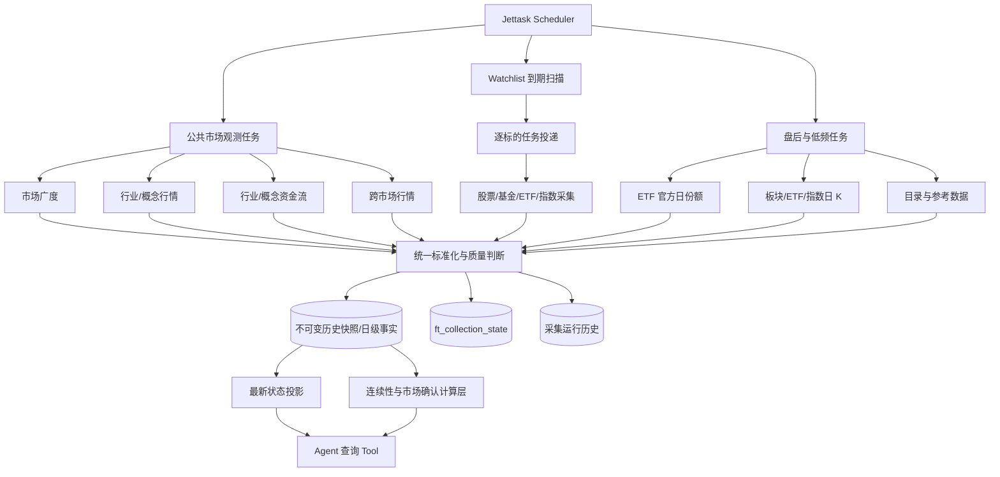
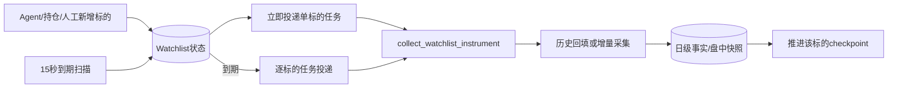
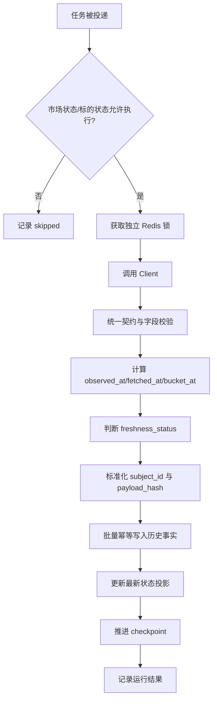

# 行业市场数据调度、快照与入库实施方案

## 1. 本文定位

本文定义已经通过真实接口验收的行业、市场、ETF、跨市场和标的 Client 能力，如何正式接入任务调度、快照存储、历史回填、采集健康检查和 Agent 查询链路。

本文承接：

- `docs/3. 实施方案/1. 数据源对接/10. 行业市场数据Client能力完善实施方案.md`；
- `docs/5. 设计方案/4. Agent工具/4. Research Agent研究智能体设计方案.md`。

本文不重新定义 Client 接口，也不负责生成 Investment View、Current Research Report、交易信号、仓位或订单。

## 2. 模块目标

本模块需要形成两条相互独立、共同服务金融 Agent 的连续数据链路。

### 2.1 全市场公共观测

系统主动、持续采集不依赖 Agent Watchlist 的公共市场数据，包括：

- A 股市场广度；
- 行业和概念实时行情；
- 行业和概念资金流；
- 主要境内外指数、期货、商品、外汇和利率；
- ETF 目录、行情、日 K 线和交易所官方日级份额；
- 板块目录、成分、日 K 线和其他低频参考数据。

这条链路用于回答“当前市场正在发生什么”和“资金是否持续确认某个方向”。

### 2.2 Agent 标的持续跟踪

系统根据 Agent、持仓、人工操作或事件规则维护具体金融标的，并持续采集：

- 股票；
- 场外基金；
- ETF/LOF；
- 境内指数。

这条链路用于回答“某个被关注标的之后发生了什么”和“市场表现是否验证原有研究理由”。

### 2.3 共同目标

两条链路最终都必须满足：

- 数据具有明确的观测时间和抓取时间；
- 高频快照不会被日级唯一键覆盖；
- 相同任务重复执行保持幂等；
- 单个来源或标的失败不阻断其他任务；
- 数据延迟、来源时间缺失和采集失败对下游可见；
- 服务停机后，能够回填的数据自动追赶，无法回填的数据明确记录缺口；
- Agent 能区分最新值、历史序列、延时数据和不可用数据。

## 3. 当前实现不能直接承载目标状态

现有调度任务能够周期运行，但当前表结构主要面向最新缓存和日级结果。

| 现有对象 | 当前定位 | 不能满足的能力 |
|---|---|---|
| `ft_market_cache` | 每种 `data_type` 只保留最新值 | 不能形成盘中连续历史 |
| `ft_market_flow` | 北向、板块、个股资金和龙虎榜日级结果 | 板块资金按交易日去重，无法保存多期盘中快照 |
| `ft_watchlist_data` | 标的各维度日级数据 | 同一标的、维度和交易日会覆盖，无法保存盘中状态变化 |
| `ft_collection_state` | 来源和标的的最新断点、健康状态 | 只能看到最近状态，不能还原每次采集和历史缺口 |
| `collect_market` | 多个市场来源串行处理 | 慢速板块全量请求可能拖延高频市场广度 |
| `collect_fund_flow` | 资金流和 Watchlist 到期扫描混合 | 公共市场数据和 Agent 标的生命周期耦合 |

因此，本阶段不能只提高现有任务频率。必须同时调整任务边界、历史快照表和幂等语义。

## 4. 加入新能力后的整体架构



核心原则：

1. Scheduler 只负责投递，不直接请求外部数据；
2. 公共市场、低频日级数据和 Agent 标的使用不同任务；
3. 任务先持久化业务数据，再推进 checkpoint；
4. 历史事实是权威数据，最新缓存只是查询投影；
5. 采集层不生成市场观点和交易结论。

## 5. 任务职责与调度策略

### 5.1 公共市场观测任务

| 任务 | 默认频率 | 运行窗口 | 主要数据 |
|---|---:|---|---|
| `collect_market_breadth_snapshot` | 30 秒 | A 股有效交易阶段 | 涨跌平家数、成交额、13 个核心指数、上一交易日同时刻成交额 |
| `collect_stock_change_events` | 30 秒 | 交易日 09:15-15:05 | 集合竞价、拉升、跳水、大笔交易、封板等来源异动事件 |
| `collect_sector_market_snapshot` | 60 秒 | A 股有效交易阶段 | 行业/概念涨跌、成交、广度和领涨对象 |
| `collect_sector_fund_flow_snapshot` | 60 秒 | A 股有效交易阶段 | 行业/概念完整资金流集合 |
| `collect_cross_market_snapshot` | 1 至 3 分钟 | 对应市场开放阶段 | 海外指数、期货、商品、外汇 |
| `collect_rate_liquidity_snapshot` | 按来源更新频率 | 交易日及数据发布窗口 | Shibor、LPR、国债收益率等 |

市场日历负责判断：

- 是否交易日；
- 当前处于盘前、连续竞价、午休、盘后还是休市；
- 不同市场使用哪个时区；
- 夜盘归属哪个交易日。

仅依靠 Scheduler 的固定时间表达式不足以处理午休、临时休市和跨市场时区。Worker 在真正请求 Client 前必须再次执行市场状态判断。

成交额同时刻对比不依赖本地快照回填：任务并行读取沪、深、北最近两个交易日的
分钟成交额，按当前可用分钟累计并写入本次市场广度快照。30 秒快照继续用于记录
上涨、下跌、平盘家数的盘中变化；外部分时接口失败时，本地上一交易日快照只作为
对比数据的后备来源，不影响当前市场广度入库。

### 5.2 盘前和盘后边界快照

A 股公共市场任务除了连续竞价阶段，还应保留：

- 盘前最后一个可用状态；
- 上午收盘状态；
- 下午开盘后的首个状态；
- 收盘后的最终状态。

边界快照用于区分隔夜变化、上午走势和下午走势。它们不能通过简单删除非交易时段请求来替代。

### 5.3 盘后与低频任务

| 任务 | 建议时点 | 说明 |
|---|---|---|
| `collect_etf_daily_shares` | 盘后数据发布后 | 获取沪深交易所官方 ETF 份额 |
| `collect_etf_estimated_net_inflow` | 交易时段每 60 秒 | 保存同花顺深市 ETF 预估申购净流入分钟点及合作 ETF 池流入榜首 |
| `collect_market_daily_bars` | 收盘并完成行情落定后 | 板块、ETF、指数和商品日 K |
| `collect_market_reference_data` | 每日低频或目录变更时 | 板块目录、ETF 目录、成分和身份 |
| `collect_market_daily_catchup` | 每日启动检查 | 补齐停机期间可回填的日级数据 |
| `collect_market_valuation` | 北京时间 16:10 | 上证、深证长期 PE/PB；首次全量、后续按最新交易日刷新 |
| `collect_bond_index` | 北京时间 16:20 | 中债新综合全价、净价、财富指数；首次全量、后续增量 |

ETF 日份额必须按交易所真实发布时间设置调度。首次请求不完整时进入有限重试，不得把部分交易所成功包装成完整成功。

### 5.4 Agent 标的任务

标的跟踪采用“扫描器+逐标的任务”：



要求：

- 每条任务只处理一个规范化标的；
- 每个标的使用独立 Redis 锁；
- 新建或重新启用时立即投递；
- 普通更新不无条件重复采集；
- 停用后扫描器不再投递；
- 单个标的失败只重试自身；
- 标的频率和断点独立保存。

当前全局 Watchlist 采集锁需要改为标的级锁，不能让一个慢基金阻塞其他股票和指数。

### 5.5 调度频率与实际采集频率

扫描频率、标的优先级和数据维度频率必须分开。不能再使用一个
`config.interval` 控制某个标的的全部数据。

Watchlist 到期扫描器每 15 秒运行一次。扫描本身只读取状态并投递到期任务，不请求
外部行情，因此可以使用高于真实采集的频率。

盘中实时维度的目标频率为：

| 优先级 | 典型对象 | `quote`、`realtime`、`minute_data`、`stock_flow` |
|---|---|---:|
| `critical` | 当前持仓、正在执行风险检查的标的 | 30 秒 |
| `standard` | Agent 当前有效观点和机会清单中的标的 | 60 秒 |
| `low` | 背景观察、暂未获得市场确认的标的 | 180 秒 |

默认新增标的使用 `standard`，不能再把 3 分钟作为默认。当前持仓自动提升为
`critical`；Agent 可以基于观点状态调整优先级，但必须保留调整原因。

低频维度使用独立频率：

| 数据维度 | 目标频率 |
|---|---|
| 日 K 最终值 | 盘后一次，缺失时自动追赶 |
| 场外基金净值 | 来源公布后采集，交易日内不重复高频请求 |
| ETF 官方份额 | 盘后交易所数据发布后一次 |
| 估值、基金详情 | 每日或数据过期时 |
| 持仓、规模、资产配置 | 按来源更新周期检查，不跟随盘中行情轮询 |

非交易时段停止无意义的盘中报价轮询，只保留收盘边界快照、日级任务、回填任务和
跨市场仍在交易的对象。

任务到期判断以 `ft_collection_state` 为权威，不使用 Worker 内存计时。

Watchlist 配置需要从单一 `interval` 演进为：

- `priority`：`critical`、`standard` 或 `low`；
- `realtime_interval_seconds`：盘中实时维度间隔；
- `daily_policy`：日级数据是否完整；
- `reference_refresh_policy`：低频资料更新时间；
- `reason` 和 `priority_reason`：跟踪及优先级原因。

## 6. 数据存储设计

### 6.1 通用市场快照

新增不可变历史快照表 `ft_market_snapshots`，承载公共市场和盘中标的观测。

核心字段：

| 字段 | 语义 |
|---|---|
| `id` | 快照主键 |
| `data_type` | `market_breadth`、`sector_quote`、`sector_flow`、`index_quote` 等 |
| `subject_type` | `market`、`sector`、`instrument`、`commodity`、`rate` |
| `subject_id` | 统一市场、板块、标的、品种或期限标识 |
| `market` | `CN`、`HK`、`US` 或具体交易所 |
| `provider` | 来源 Client 标识 |
| `trade_date` | 按目标市场日历计算的业务交易日 |
| `observed_at` | 来源明确声明的数据时间 |
| `fetched_at` | 本系统完成抓取的时间 |
| `bucket_at` | 按该任务频率归一后的时间桶 |
| `freshness_status` | `realtime`、`delayed`、`unknown` |
| `source_latency_seconds` | 能够计算时记录来源延迟 |
| `payload_hash` | 标准化业务内容指纹 |
| `data` | 该类型的标准化原始观测字段 |
| `created_at` | 入库时间 |

幂等键为：

```text
(data_type, subject_id, provider, bucket_at)
```

同一个时间桶重复执行时覆盖该桶，不产生重复行。跨时间桶内容未变化时可以跳过业务快照写入，但必须更新采集健康状态。

### 6.2 ETF 日级份额

新增 `ft_etf_daily_shares` 保存沪深交易所官方日级份额。

关键语义：

- 唯一身份由交易所、ETF 代码和交易日组成；
- 原始份额、份额单位和基金名称必须保留；
- 上交所和深交所完成后才能标记该交易日全市场采集完整；
- 入库时保存上一交易日份额、确认份额变化和变化率；
- 该变化是日级份额确认，不是盘中真实申购、赎回成交；
- 交易所原始份额不能被第三方估算值覆盖。

### 6.3 日级和低频标的数据

`ft_watchlist_data` 继续保存：

- 基金净值；
- 日 K；
- 基金持仓；
- 基金规模；
- 估值和其他日级或低频维度。

同一交易日需要保留多个观测点的 `quote`、`realtime`、`minute_data` 和盘中资金数据迁移到 `ft_market_snapshots`，不能再被日级唯一键覆盖。

### 6.4 最新状态投影

`ft_market_cache` 保留为最新状态投影，但不再作为历史事实来源。

写入顺序：

1. 写入历史快照或日级事实；
2. 事务成功后更新最新状态投影；
3. 最后推进 checkpoint 和采集健康状态。

Agent 查询最新状态可以读取投影；历史趋势、资金连续性和复盘必须读取历史事实。

### 6.5 采集运行历史

新增 `ft_collection_runs` 采集运行历史表，用于记录每次真实执行，而不是只保留
`ft_collection_state` 的最后一次状态。

每次运行至少记录：

- 任务和来源；
- 调度触发时间、开始时间和结束时间；
- 成功、部分成功、跳过或失败；
- 抓取数量、有效数量、写入数量和跳过数量；
- 来源时间范围和新鲜度统计；
- checkpoint 前后状态；
- 错误类型和错误摘要；
- Jettask 事件标识和重试次数。

`ft_collection_state` 只负责当前断点、回填进度和最后执行结果，不再负责调度周期。
JetTask Schedule 的 `interval_seconds` / cron 是唯一调度控制；运行历史负责审计、
告警和缺口分析。

Watchlist 逐标的任务必须区分“无新增数据”和“采集失败”：

- `collected`：至少一个维度生成了可入库的新行；
- `no_new_data`：至少一个目标维度得到有效响应，但按 checkpoint 过滤后没有
  更新的数据，任务记为成功并保留 `outcome=no_new_data`；
- `partial_success` / `partial_no_new_data`：部分维度成功、部分维度真实失败，
  任务记为部分成功并保留各维度诊断；
- `failed`：所有目标维度均发生请求、解析或上游状态错误。

日线尚未收盘、净值尚未发布或供应商最新日期等于本地 checkpoint，均不能被记为
采集失败。Worker 启动时需要关闭上次进程中断遗留的 `running` 审计记录，避免看板
长期显示一个实际上已经不存在的任务。

公共市场任务的 Redis 锁租约不能使用数据采集周期推导。日级任务的调度周期虽然是
一天，但单次执行锁采用 10 分钟短租约并在任务运行期间续租；分钟级任务采用
2 至 5 分钟短租约。这样长任务运行时仍能防止并发，Worker 异常退出后也不会遗留
数天无法执行的锁。

## 7. 快照写入和幂等流程



约束：

- Client 返回成功不等于业务写入成功；
- 只有历史事实写入成功后才能更新 `last_success_at`；
- 部分来源成功必须保留已成功数据，但整体状态标记为 `partial_success`；
- 空结果必须区分合法休市、上游错误、解析错误和不支持；
- payload 去重只消除无变化快照，不能跨越发生变化后又恢复原值的状态；
- 同一批板块记录使用批量 UPSERT，不逐行往返数据库。

## 8. 标准身份和板块映射

板块快照和资金流必须先绑定统一板块身份。

优先级：

1. 来源稳定板块代码；
2. 已审核的来源代码映射；
3. 来源类型和规范化名称组合；
4. 无法可靠映射时保留来源身份并标记 `mapping_pending`。

禁止：

- 仅因为名称相似就自动合并两个板块；
- 把行业和概念同名对象合并；
- 使用领涨股或代表 ETF 冒充板块指数；
- 为了让数据入库而伪造稳定板块代码。

映射完成前的数据仍可保存，但不能进入跨来源资金连续性合并。

## 9. 新鲜度和数据质量

### 9.1 双时间语义

所有快照必须区分：

- `observed_at`：数据实际代表的市场时间；
- `fetched_at`：本系统获取数据的时间。

来源未提供时间时：

- `observed_at` 为空；
- `freshness_status=unknown`；
- 不得把 `fetched_at` 伪装成来源时间。

### 9.2 延时数据

市场广度等盘中数据来源延迟超过 3 分钟时：

- 仍然保存；
- 标记 `delayed`；
- 可以用于盘后复盘；
- 不参与实时异常触发和持仓安全触发。

### 9.3 完整性

全市场集合需要记录预期覆盖和实际覆盖。例如：

- 市场广度是否包含沪、深、北；
- 行业和概念分别返回多少对象；
- ETF 份额是否同时完成沪市和深市；
- 跨市场快照中哪些市场处于休市，哪些来源失败。

数量明显异常时不得覆盖一份完整的最新投影。

### 9.4 来源口径

板块资金流、成交额、份额和价格必须保留：

- 原始单位；
- 来源统计口径；
- 币种；
- 市场；
- 复权方式；
- 合约或指数身份。

不同来源口径没有完成标准化前，不能直接相加或比较。

## 10. 停机恢复与历史回填

### 10.1 可以自动回填的数据

以下数据在服务恢复后，根据 checkpoint 自动追赶：

- 日 K 和可查询历史 Bar；
- ETF 官方日级份额；
- 利率和宏观时间序列；
- 可按日期查询的库存、融资融券和其他日级数据；
- Watchlist 标的可用历史维度。

回填应保留少量日期重叠，利用幂等键吸收上游补录和修订。

### 10.2 无法回填的数据

以下数据如果来源只提供当前快照，停机期间通常无法恢复：

- 历史市场广度快照；
- 新浪板块资金流盘中快照；
- 缺少历史接口的盘中排行和即时状态。

系统必须记录：

- 缺口开始时间；
- 缺口结束时间；
- 影响的数据类型和市场；
- 原因是服务停机、来源不可达还是接口不支持历史。

不得通过复制恢复后的第一条数据伪造缺失时段。

### 10.3 首次部署

首次部署时：

1. 先建立目录和统一身份；
2. 回填可获得的日级历史；
3. 从启用时刻开始积累盘中快照；
4. 记录每类盘中数据的 `coverage_started_at`；
5. 在连续性计算中禁止跨越覆盖起点或缺口。

## 11. Agent 标的读取和即时刷新

标的读取继续沿用现有新鲜度机制：

1. 读取跟踪状态和最新数据；
2. 根据请求的数据类型判断完整性；
3. 实时维度按目标采集间隔判断是否过期；
4. 过期时投递单标的即时采集；
5. 最多等待 100 秒；
6. 成功后返回新数据；
7. 超时或失败时返回旧数据并明确标记。

实时数据过期阈值不能固定为 3 分钟：

- `critical` 超过 90 秒没有成功观测即视为过期；
- `standard` 超过 120 秒即视为过期；
- `low` 超过 360 秒即视为过期。

低优先级数据不能用于需要实时性的持仓安全判断；进入正式风险检查前必须先提升
优先级或触发即时刷新。

公共市场数据读取采用类似语义，但不应为每个 Agent 请求同步抓取全市场。正常情况下由公共任务持续更新；公共快照过期时：

- 返回最后可用快照和明确的新鲜度；
- 投递一次幂等刷新任务；
- 是否等待刷新由具体 Tool 的时效要求决定。

## 12. 连续性计算层边界

采集和入库完成后，再由独立计算层生成：

- 市场广度改善、恶化和扩散速度；
- 行业和概念连续流入、流出；
- 资金排名变化；
- 价格、成交和资金是否一致；
- ETF 份额变化和估算净申购；
- 板块、ETF和成分股之间的响应一致性；
- 观点预期与市场表现的背离。

这些结论不能写入 Client 返回值，也不能在采集任务中即时硬编码产生。采集层保存可重算事实，计算层保存带版本的派生结果。

## 13. 迁移路径

### 13.1 第一阶段：建立新存储

- 新增通用市场快照、ETF 日份额和采集运行历史；
- 建立 ORM、Schema DDL、Repository 和批量写入能力；
- 保留现有表和查询，避免在新表未形成数据前丢失服务能力。

### 13.2 第二阶段：接入公共观测任务

- 市场广度；
- 行业和概念行情；
- 行业和概念资金流；
- 跨市场快照；
- ETF 日份额；
- 日级和低频参考数据。

每类任务独立验收后，再从旧 `collect_market` 和 `collect_fund_flow` 中移除对应来源。

### 13.3 第三阶段：改造标的跟踪

- Watchlist 扫描与实际采集分离；
- 每个标的独立任务和锁；
- 日级事实与盘中快照分流；
- Agent 即时刷新读取新快照；
- 对已有跟踪标的执行一次数据完整性检查。

### 13.4 第四阶段：退出旧定位

- `ft_market_cache` 只保留最新投影；
- `ft_market_flow` 不再承载板块盘中快照；
- `ft_watchlist_data` 不再承载会在同一交易日发生多次变化的数据；
- 旧聚合任务中的重复来源下线；
- 文档和 Agent Tool 统一切换到新数据语义。

迁移期间禁止新旧任务同时以不同口径写同一种业务事实。

## 14. 可观测性与告警

至少需要监控：

- 每个任务最近一次运行和成功时间；
- 运行耗时和重试次数；
- 来源返回数量、有效数量和写入数量；
- 来源时间延迟分布；
- 连续空结果和连续失败次数；
- 板块、ETF等全量集合的覆盖率异常；
- 数据库写入延迟；
- Watchlist 待处理标的数量和单标的等待时间；
- 盘中快照缺口；
- 日级回填积压。

告警应区分：

- 数据源不可用；
- 数据延时；
- 返回数量异常；
- 标准身份映射失败；
- 数据库写入失败；
- Worker 堆积；
- 市场正常休市。

## 15. 技术风险与评审关注点

### 15.1 数据量

行业和概念全量快照按 60 秒保存后，每个交易日会产生大量行。必须使用：

- 批量 UPSERT；
- 合理的时间和身份索引；
- 按时间清理或分区策略；
- payload 无变化抑制；
- 最新投影避免 Agent 读取历史表做全表扫描。

不能为了减少数据量重新退回只保存 Top N，否则会失去行业轮动和排名变化的基础。

### 15.2 上游限流

任务拆分后并发能力提高，也可能放大上游请求压力。每个 Provider 需要统一限流，不允许各任务绕过 Client 层自行请求。

### 15.3 时间语义

跨市场、夜盘、午休和来源时间缺失是最容易造成错误结论的部分。交易日必须由目标市场日历计算，不能统一使用服务器自然日。

### 15.4 最新缓存与历史事实不一致

历史写入成功、最新投影失败时，系统应允许稍后重建投影。不能因为投影失败回滚已经成功保存的真实历史。

## 16. 测试与验收

### 16.1 单元测试

| 用例 | 验证内容 |
|---|---|
| 市场时段判断 | 盘前、上午、午休、下午、盘后和休市行为正确 |
| 跨市场交易日 | A股、港股、美股和夜盘使用正确业务日期 |
| 快照时间桶 | 30秒和60秒任务生成稳定 `bucket_at` |
| 快照幂等 | 同一时间桶重试不产生重复行 |
| 状态恢复 | payload 变化后恢复旧值时仍能保存新的观测 |
| 新鲜度判断 | `realtime`、`delayed`、`unknown` 正确 |
| 部分成功 | 沪深ETF仅一侧成功时不标记全量完成 |
| 板块身份 | 行业、概念和待映射对象不会错误合并 |
| 标的到期扫描 | 只投递启用且到期标的 |
| 标的锁隔离 | 一个标的占锁不阻断其他标的 |
| 日频/盘中分流 | 日级数据和盘中数据写入正确存储 |
| checkpoint顺序 | 业务写入失败时不推进成功断点 |
| Watchlist空增量 | 来源正常但没有更新行时记录 `no_new_data`，不产生失败告警 |
| Watchlist真实失败 | 所有维度异常时仍记录失败，并保留逐维度错误 |
| Worker中断恢复 | Worker 重启后遗留 `running` 记录被明确关闭为中断失败 |
| 日级任务锁恢复 | 日级任务异常退出后短租约自动释放，不会按日级周期锁死 |

### 16.2 集成测试

| 用例 | 验证内容 |
|---|---|
| 市场广度连续采集 | 模拟多个时间桶后可查询完整变化序列 |
| 板块全量快照 | 行业和概念完整集合批量写入且可按板块查询 |
| 板块资金连续性 | 多期快照保留，不被交易日唯一键覆盖 |
| ETF日份额 | 沪深合并、重复执行和相邻交易日数据正确 |
| ETF日份额变化 | 保存上一交易日份额和确认变化，不标记为盘中实时申赎 |
| ETF盘中预估流 | 首次同步完整日内趋势、后续分钟幂等增量；明确标记深市估算和非官方确认 |
| 异动事件幂等 | 重复轮询同一事件时间、证券和类型不制造重复记录 |
| 估值历史增量 | 首次全量写入，后续只刷新最新边界日期 |
| 中债指数增量 | 三条指标独立写入且按最新日期增量更新 |
| 情绪表迁移 | 全量迁移脚本可重复执行，`ft_sentiment_signal` 表可物化 |
| 复盘新闻分类去重 | 同日归一化标题、完整正文和复盘类型稳定 |
| 公共任务异常隔离 | 慢速日K任务不阻塞市场广度 |
| Watchlist即时采集 | 新标的新增后立即产生首轮数据 |
| Watchlist并发 | 多个标的可并行采集且失败互不影响 |
| 即时刷新等待 | 数据过期时触发刷新，100秒超时语义正确 |
| 停机日级追赶 | 恢复后自动补齐可回填日期 |
| 盘中缺口记录 | 无法回填的时间范围被明确记录 |
| 最新投影重建 | 根据历史事实恢复最新缓存 |
| 运行历史 | 成功、跳过、部分成功和失败均可审计 |

### 16.3 真实环境验收

至少连续运行五个交易日，验证：

- 市场广度在交易时段形成稳定序列；
- 行业和概念资金流每天有完整覆盖；
- 延时源不会触发实时异常判断；
- ETF官方份额每日完成并能计算相邻日变化；
- Worker 重启后日级数据自动追赶；
- 盘中停机缺口被识别而不是伪造；
- Watchlist 标的新增、停用、重启和即时读取闭环正常；
- 慢任务、失败来源和单个坏标的不影响其他采集；
- Agent 能明确看到数据时间、新鲜度和覆盖范围。

## 17. 当前实施状态

截至 2026-07-31，本文定义的采集与入库主链路已经实现：

- `ft_market_snapshots`、`ft_etf_daily_shares`、`ft_collection_runs` 的 ORM、
  Schema 和批量 Repository；
- A 股市场广度 30 秒快照及四个交易边界快照；
- 行业/概念行情与资金流 60 秒全量快照；
- 全球指数、期货、外汇 60 秒快照和利率流动性小时任务；
- 大盘与集合竞价异动事件 30 秒幂等采集；
- 上证、深证 PE/PB 与中债新综合三类指数的盘后增量任务；
- 板块、ETF、基准指数、商品的盘后日级采集；
- 板块目录、成分和 ETF 参考目录任务；
- ETF 官方份额主采、补偿采集和最近交易日停机追赶；
- Watchlist 15 秒到期扫描、逐标的任务、逐标的 Redis 锁；
- `critical=30秒`、`standard=60秒`、`low=180秒` 的优先级策略；
- Watchlist `realtime`、`daily`、`reference` 三类采集范围及独立检查点；
- 盘中标的快照写入 `ft_market_snapshots`，同时维护
  `ft_watchlist_data` 最新投影；
- Agent 标的读取优先使用时间桶快照，实时历史查询不再读取日级覆盖表；
- 每次公共市场和逐标的真实执行写入采集运行历史；
- Watchlist 逐维度诊断可区分新增、正常空增量、部分成功和全部失败；
- Worker 启动时自动关闭上次进程中断遗留的运行中审计记录；
- 行情采集观测看板直接读取历史快照、运行审计、ETF 份额和 Watchlist 状态，
  展示市场广度、行业轮动、跨市场行情、数据新鲜度及异常任务；
- 看板页面每 30 秒自动刷新，只读取数据库，不会触发额外 Provider 请求。

旧 `collect_news`、`collect_fund_flow`、`collect_sentiment`、`collect_macro` 聚合
调度已拆成 40 条来源级 JetTask Schedule；旧聚合调度和 `collect_market_1min`
均不再参与生产定时调度。

## 18. 实施完成标准

只有同时满足以下条件，才能认为本方案完成：

1. 公共市场和 Agent 标的使用独立调度生命周期；
2. 盘中数据具有不可变历史快照，不再被日级唯一键覆盖；
3. ETF 官方日份额形成正式日级表和自动任务；
4. 每个 Watchlist 标的独立投递、锁定、失败和推进断点；
5. 数据时间、抓取时间、延迟和来源口径完整保留；
6. 停机恢复对可回填和不可回填数据使用不同语义；
7. 最新投影和历史事实职责分离；
8. 采集运行可以按来源和任务审计；
9. Agent 查询能够识别旧数据、延时数据和不完整数据；
10. 连续运行验收证明数据可支撑市场状态和资金确认计算。
