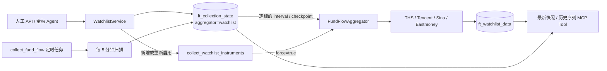

# 自选标的持续跟踪实施方案

## 1. 模块目标

本模块为人工操作和金融 Agent 提供统一的股票、场外基金、ETF/LOF 与境内指数持续跟踪能力。标的进入跟踪名单后，系统立即执行首轮采集，此后按照标的自己的频率和断点持续补充行情、净值、资金流、持仓及其他可用数据。

核心目标：

- 新增标的不等待下一轮定时扫描，立即采集；
- 每个标的独立维护采集断点、频率、失败状态和跟踪原因；
- 重复新增保持幂等，已停用标的再次新增时重新启用并立即采集；
- Agent 能查看跟踪状态、最新快照和指定维度的历史序列；
- 单个无效标的不会阻断同批其他标的的首次采集。

## 2. 模块边界

本模块负责：

- 标的代码与类型规范化；
- 跟踪名单状态管理；
- 立即采集任务投递；
- 定时扫描与逐标的到期判断；
- 数据采集和 `ft_watchlist_data` 入库；
- Agent MCP 工具与 HTTP 管理接口。

本模块不负责：

- 根据市场数据直接生成买卖指令；
- 替代知识图谱的新闻关系检索；
- 提供交易所级逐笔实时行情；
- 自动删除历史采集数据。

## 3. 整体架构

## 4. 核心数据

### 4.1 跟踪状态

`ft_collection_state` 使用 `aggregator=watchlist`、`source_name=规范化代码` 表示一个跟踪标的。

每个标的独立保存：

- `mode`：首次或重新启用时为 `backfill`，完成后为 `incremental`；
- `target_time`、`newest_time`、`oldest_time`、`backfill_status`；
- `last_run_at`、`last_success_at`、`last_error`；
- `enabled`、`interval_override`；
- `config`：名称、类型、来源、跟踪原因、间隔、回填天数、是否场内交易。

跟踪来源固定为：

- `manual`：人工维护；
- `position`：由实际持仓同步；
- `event`：由事件规则加入；
- `agent`：由金融 Agent 研究后加入。

### 4.2 采集数据

`ft_watchlist_data` 按 `(code, data_type, trade_date)` 幂等写入，包含：

- `code`：规范化标的代码；
- `data_type`：数据维度；
- `trade_date`：数据日期；
- `data`：对应维度的结构化内容；
- `created_at`：首次入库时间；
- `updated_at`：最近一次采集覆盖时间。

标的整体的新鲜度以 `ft_collection_state.last_success_at` 为准；具体数据行的覆盖时间以 `updated_at` 为准。

## 5. 标的规范化

支持的输入类型为 `auto`、`stock`、`fund`、`etf`、`index`。`etf` 在内部统一归为 `fund`，并标记 `exchange_traded=true`。

规范化规则：

- 股票和指数保存市场前缀，如 `sh600036`、`sz300750`、`sh000001`；
- 场外基金和场内基金保存六位代码，如 `007380`、`159915`；
- 未带前缀的股票根据代码规则推断沪、深、北市场；
- `auto` 无法可靠区分股票和场外基金时拒绝写入，要求调用方明确类型；
- 代码与显式类型不符合市场规则时拒绝写入；
- 当前支持上证 `000xxx` 和深证 `399xxx` 指数，暂不支持北交所指数。

## 6. 状态写入

### 6.1 批量新增

批量新增使用 PostgreSQL multi-row upsert。

状态语义：

- `created`：首次创建，投递立即采集；
- `reactivated`：此前已停用，重置为回填模式并投递立即采集；
- `updated`：已启用但配置有变化，只更新配置；
- `unchanged`：输入和当前状态一致，不重复投递。

同一请求中的重复代码只处理一次。启用标的总数上限为 500。

### 6.2 批量更新

更新使用批量 upsert，支持：

- 修改名称、类型、采集间隔、回填天数、来源和原因；
- `enabled=false` 停止后续采集，但保留已有历史数据；
- `enabled=true` 重新启用时重置回填状态并立即采集。

更新类型时重新执行代码和类型一致性校验。
采集间隔最小为 300 秒，与定时扫描分辨率一致；更小的配置会被拒绝，
避免调用方误以为系统能够提供更高频率。

### 6.3 持仓同步

持仓同步把当前持仓批量写入跟踪名单，来源为 `position`。其中新建或重新启用的标的同样立即投递采集任务。

## 7. 采集流程

### 7.1 首轮立即采集

每个需要立即采集的代码独立投递一条 `collect_watchlist_instruments` 消息。这样一个标的失败时只重试自身，不会使同批其他标的重复执行。

立即任务与定时任务共用 `fund_flow:watchlist_data` Redis 锁，避免同一批数据并发写入。立即任务使用 `force=true`，不受标的正常间隔限制。

### 7.2 定时扫描

`collect_fund_flow` 每 5 分钟检查一次 watchlist，但是否真正采集由每个标的自己的状态决定：

1. 停用标的直接跳过；
2. 回填模式或从未成功采集的标的立即执行；
3. 增量模式根据 `last_run_at + config.interval` 判断是否到期；
4. 只采集到期标的；
5. 数据成功写入后再推进该标的断点；
6. 全部维度无有效数据时记录该标的失败状态，不推进断点。

全局 `fund_flow:watchlist_data` 断点只控制扫描任务自身，不再作为所有标的共享的数据进度。

### 7.3 采集维度

| 类型 | 主要维度 |
|---|---|
| 场外基金 | `nav`、`nav_sina`、`realtime`、`nav_technical`、`performance`、`flow_trend`、`holdings`、`scale`、`fund_detail` 等 |
| ETF/LOF | 基金维度，并追加 `stock_flow`、`quote`、`minute_data`、`kline` |
| 股票 | `stock_flow`、`quote`、`minute_data`、`kline`、`valuation`、`plates`、`guba_posts` |
| 指数 | `quote`、`minute_data`、`kline` |

高频、日频和低频维度根据标的断档长度选择。首次回填执行全部维度；当天已采时只执行高频维度。

## 8. 对外接口

### 8.1 HTTP

| 方法 | 路径 | 用途 |
|---|---|---|
| `GET` | `/api/watchlist` | 列出跟踪标的 |
| `GET` | `/api/watchlist/{code}` | 查看单个规范化代码的状态 |
| `POST` | `/api/watchlist/batch` | 批量新增、更新或重新启用 |
| `PUT` | `/api/watchlist/batch` | 批量更新、启用或停用 |
| `DELETE` | `/api/watchlist/batch` | 批量删除跟踪配置 |
| `POST` | `/api/watchlist/sync-positions` | 同步当前持仓并触发首次采集 |

### 8.2 MCP

| Tool | 用途 |
|---|---|
| `market_watchlist_add` | Agent 批量新增或重新启用标的 |
| `market_watchlist_list` | 查看跟踪名单、断点、新鲜度和错误 |
| `market_watchlist_update` | 批量修改配置或停用、重新启用 |
| `market_instrument_open` | 获取最多 8 个标的的最新决策相关维度 |
| `market_instrument_history` | 获取一个标的一个维度的历史序列 |

Agent 新增标的时必须填写明确的 `reason`，便于后续判断为什么持续消耗采集资源。

## 9. 失败与幂等

- 新增、更新和数据写入均为 upsert；
- 重复新增已启用且配置相同的标的不会重复触发；
- 每个首次采集任务只包含一个代码；
- 任务失败由 Jettask 独立重试；
- 数据保存成功后才更新标的断点；
- 停用不删除历史数据；
- 重新启用会重新回填设定时间范围；
- 无效代码在进入跟踪表前被格式和类型规则拒绝；
- 上游接口返回空数据时保留跟踪状态并记录错误，便于 Agent 和运维查看。

## 10. 测试用例

### 10.1 单元测试

| 用例 | 验证内容 |
|---|---|
| 标的代码规范化 | 股票、基金、ETF、指数得到稳定规范代码 |
| 模糊类型拒绝 | 无法自动区分时要求显式类型 |
| 首次采集计划 | 无断点标的执行全量维度 |
| 标的间隔控制 | 未到期跳过，强制任务不跳过 |
| 新增任务投递 | 只投递 `created` 和 `reactivated` |
| 标的任务隔离 | 每个代码生成独立 Jettask 消息 |
| MCP 工具注册 | 五个市场跟踪工具具有正确读写注解 |

### 10.2 集成测试

| 用例 | 验证内容 |
|---|---|
| 状态完整生命周期 | 新建、重复新增、停用、重新启用和断点重置 |
| 数据幂等写入 | 同代码、维度、日期更新数据且刷新 `updated_at` |
| 最新快照读取 | 每个代码和维度只返回最新一行 |
| 历史序列读取 | 日期范围、排序和返回上限正确 |
| 真实指数首采 | 新增指数后立即获得 quote、minute 或 kline 数据 |
| 生产 MCP 验收 | Agent 可新增、查看、停用和重新启用真实标的 |
