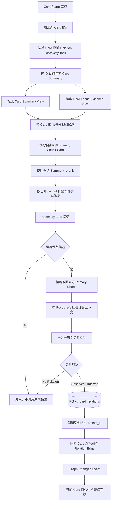

# 跨 Chunk Card 召回与原文关系核验实施方案

## 1. 模块目标

本文承接原子 Cognitive Card 与同 Chunk Relation 提取阶段。Card 发布后，沿用现有跨 Chunk 关系发现流程：

1. 使用当前 Card Summary 建立基础召回路由，并读取 PG 中已持久化的 Relation Probe 建立关系角色路由；
2. 每条 route 分别检索 Milvus Card Summary View 和 Focus Evidence View；
3. 按 Card ID 合并双视图候选；
4. 只使用候选 Summary 执行 rerank 和 LLM 初筛；
5. 只为初筛保留的候选精确取回双方完整 Primary Chunk；
6. 结合 Focus Evidence refs 一对一核验原文关系；
7. 将 Observed / Inferred 正关系幂等写入 `kg_card_relations` 和 Milvus Edge 索引；
8. 根据有效、Observed 的 `same_fact` Edge 刷新受影响 Card 的 `fact_id`；
9. 发布图变化事件供后续 Graph Community 消费。

本阶段不额外调用 `kg_relation_probe_planning`。Relation Probe 已由 Card 提取阶段生成并保存在 PG，本阶段只负责消费。

生产任务按单 Card 分片。每张 Card 完成关系核验后立即执行 Edge、事实投影、
Milvus 和图变化事件的完整持久化闭环，不等待同批其他 Card 完成。

## 2. 阶段边界

### 2.1 Card 提取阶段负责

- 将当前 Chunk 提取为零个、一个或多个原子 Card；
- 为每张 Card 生成 Summary 和 Focus Evidence 引用；
- 在同一次 LLM 调用中判断当前 Chunk 内不同 Card 的正关系；
- 将同 Chunk 正关系直接写入 `kg_card_relations`；
- 发布 Card Summary View 和 Focus Evidence View。

### 2.2 跨 Chunk 关系发现负责

- 只比较当前 Card 与其他 Primary Chunk 的历史 Card；
- 排除当前 Card 自身及同 Primary Chunk 的兄弟 Card；
- 沿用 Summary 召回、rerank、Summary 初筛和原文核验流程；
- 不重复核验已经由 Card 提取阶段处理的同 Chunk Card 对。

### 2.3 不覆盖范围

- 不重新拆分 Card；
- 不修复同 Chunk Relation 漏判；
- 不创建主题目录或 Community Assignment；
- 不生成 Community 报告和条件性预测；
- 不把检索分数交给 LLM 判断事实关系。

## 3. 输入与存储契约

每张 Card 至少包含：

- `cognitive_card_id`；
- `fact_id`；
- `source_id`、`evidence_id`、`primary_chunk_id`；
- `focus_evidence_refs` 和 `focus_span_offsets`；
- schema version、generator version 和状态。

可读 Summary、Focus Evidence 和完整 Chunk 文本由 Milvus 保存。PostgreSQL 只保存 Card manifest、证据引用和关系当前态，不保存完整 Card/Chunk 文本。

跨 Chunk 召回依赖 Card manifest 中的 `relation_probes` 字段；Summary 基线路由保证零 Probe Card 仍可参与关系发现。新 Card 初始使用稳定的单例 `fact_id`，后续只由当前有效、Observed 的 `same_fact` 关系增量投影为等价事实组。

## 4. 处理流程

## 5. 候选召回与排序

### 5.1 双视图召回

Summary baseline 与每条 Relation Probe route 都并发搜索：

- Card Summary View：偏向低噪声语义匹配；
- Card Focus Evidence View：保留原文实体、数字、限定条件和措辞。

两个视图使用相同的稳定 `VARCHAR target_id=cognitive_card_id`。结果按 Card ID 合并去重，并保留视图命中信息用于运行诊断。

### 5.2 同 Chunk 排除

候选召回后、rerank 和 LLM 调用前，必须排除：

- 当前 Card 自身；
- 与当前 Card 拥有相同 `primary_chunk_id` 的兄弟 Card。

同 Chunk Card 对已由 Card 提取调用在完整上下文中处理，不能再次进入昂贵的跨 Chunk 核验链路。

### 5.3 Summary-only rerank

- query 使用当前 Card Summary；
- document 只使用候选 Card Summary；
- Focus Evidence 和完整 Chunk 不进入 reranker；
- rerank score 低于 `KG_RELATION_RERANK_MIN_SCORE` 的候选直接丢弃，默认阈值为 `0`；
- 通过阈值的 rerank score 只用于候选排序，不进入 LLM 初筛或最终关系置信度；
- 所有候选均低于阈值时，不调用 Summary 初筛 LLM。

### 5.4 已知等价事实候选折叠

多路 rerank 结果按 Card 合并后，读取候选 Card manifest 中的 `fact_id`。同一已知等价事实组只保留综合排序最高的一张候选 Card 进入 Summary 初筛，其余 Card 仍保存在数据库和 Milvus 中。

该步骤发生在候选预算截断前，目的是避免同一事实的重复报道占满初筛和原文核验名额。`same_event` 不参与候选折叠，因此同一事件的不同事实侧面仍能分别参与关系发现。

## 6. LLM 初筛与原文核验

### 6.1 Summary 初筛

初筛输入只包含：

- 当前 Card Summary 和材料发布时间；
- 候选 Card ID、Summary 和材料发布时间。

初筛只返回值得读取原文继续核验的候选 ID。没有候选时不调用初筛 LLM；全部拒绝时不调用原文核验 LLM。

### 6.2 原文关系核验

每次只核验一个 source/candidate Card 对。双方输入均包含：

- Card ID；
- 材料发布时间；
- 按原文顺序排列的完整 Primary Chunk 片段；
- 对应 Card Focus Evidence ref 标记。

核验结果只能是：

- `observed`：原文直接证明关系；
- `inferred`：双方原文证明端点事实，且最短连接不需要补充外部事实；
- `no_relation`：只有主题或关键词相似，或者必须依赖输入之外的信息。

稳定关系枚举包含 `market_co_movement`，用于表示同一市场对象或直接资产暴露在不同市场载体上的同步或背离。它只表达跨市场表现关系，不表示因果、传导或共同驱动，统一使用 `inferred` 裁决。

稳定关系枚举同时包含 `same_fact` 和 `same_event`。`same_fact` 要求双方原子事实可双向、完整、无损互相替代；一方 Card Summary 是另一方的子集或超集时不得使用 `same_fact`。`same_event` 表示同一个可唯一识别事件中的不同事实侧面。两者只能裁决为 Observed，但只有 `same_fact` 参与 `fact_id` 投影。仅共享交易日、市场、行业、行情方向或宏观叙事时禁止输出 `same_event`。

原文核验输入中的三个信息层次必须同时保留并严格分工：

- Card Summary 定义当前关系端点的原子主张；
- Focus Evidence 证明该主张，但其中与 Card Summary 无关的并列事实不得扩大端点语义；
- Chunk Summary 只用于消解主体、指代和背景，不得单独作为关系证据。

即使两张 Card 的 Focus Evidence 完全相同，只要 Card Summary 分别选择了同一段话中的不同主张，就应使用 `same_event` 或其他业务关系，禁止使用 `same_fact`。

通用关系核验输出 `same_fact` 后，必须再经过职责单一的事实身份门禁。门禁只读取双方 Card Summary，先分别列出最小独立主张，再检查每个动作、状态、指标、条件、目标时间和影响结论是否双向完整等价，不重新判断其他业务关系。完全等价时保留 `same_fact`；属于同一现实事件但存在额外独立事实时降级为 `same_event`；连同一现实事件也无法确认时删除该身份关系。门禁使用 AIClient 的 `glm-5.2` 非思考模式，输出双方主张清单、等价裁决、同事件裁决和短依据，避免通用多关系提示词把“共享核心子句”误判为完整事实等价。

`no_relation` 只输出裁决类型，不输出 basis、证据引用或其他冗余字段。

## 7. 关系写入与幂等

Observed / Inferred 正关系写入 `kg_card_relations`。关系身份由规范化 Card 对、relation kind 和关系方向稳定生成，重复投递执行 upsert。

每张 source Card 是一个独立的持久化检查点，写入顺序为：

1. PostgreSQL 正式关系当前态；
2. 根据当前有效、Observed 的 `same_fact` Edge 对受影响 Card 闭包重新计算 `fact_id`；
3. 将变更后的 `fact_id` 同步到 Card Summary / Focus Evidence 两个 Milvus 视图；
4. Milvus Edge 可读语义投影；
5. 图变化事件。

只有上述步骤全部完成，当前 Card 才算关系发现成功。随后才可处理下一张
Card。没有候选或全部为 `no_relation` 时不产生 Edge 写入，但仍属于当前
Card 的正常完成状态。

正式调度器为每张 Card 创建独立 Jettask 消息，使失败和重试天然隔离到单张
Card。服务层继续兼容验证脚本和历史积压中的多 Card 输入，但会在内部逐 Card
调用持久化服务；后续 Card 抛出异常时，之前检查点已经提交的结果不会丢失。

事实投影按受影响 Card 的旧事实组和当前 `same_fact` 关系闭包计算，并对 Card 行加锁。删除或失效 `same_fact` Edge 后，同一个事实组可以重新拆分。任何一步失败都由 jettask-rs 重试；重试时会比较 PG `fact_id` 与两个 Milvus Card 视图的元数据，即使 PG 已提交也能继续修复 Milvus。

历史迁移不能把旧 `same_event` 直接转换成 `same_fact`。升级时先把全部 Card 重置为单例 `fact_id`，立即停止错误传递闭包；随后对全部未使用当前核验契约处理的 active `same_fact` / `same_event` Card 对，直接取回双方 Card Summary、Focus Evidence 和 Chunk Summary 重新核验，不重复执行 RAG 和 rerank。新裁决可以是 `same_fact`、`same_event`、其他业务关系或无关系，并通过现有 Pair 当前态同步覆盖旧 Edge。单个历史 Card 对缺少材料或调用失败时必须隔离记录，不能阻塞其他 Card 对；失败项保持非去重状态并允许后续幂等重试。

生产迁移由 `schema/20_card_fact_identity.sql` 和 `scripts/知识图谱/05_card_fact_projection_backfill.py` 执行。回填脚本按 `relation_kind + prompt_version` 选择尚未使用当前契约核验的 identity Edge，批内延迟 Community 事件，全部关系和 Milvus 双视图完成后只发布一次全图重建事件。脚本中断后重新执行时只处理剩余旧 Edge。仅新增或升级事实身份门禁时使用 `--same-fact-only`，只重判当前 active `same_fact`，无需再次处理全部 `same_event`。

## 8. Langfuse 观测

完整链路至少记录：

- `kg.relation.plan_routes`：当前 Summary route；
- `kg.relation.route_recall`：两个 Milvus 视图的召回结果；
- `kg.relation.route_rerank`：Summary rerank 结果；
- `kg.relation.screen_batch`：Summary 初筛；
- `kg.relation.load_pair_evidence`：原文精确取回与完整性检查；
- `llm:kg_relation_evidence_verify`：单 Card 对原文核验；
- Edge PG、Milvus 和事件发布结果。

链路中不应出现 `llm:kg_relation_probe_planning`。

## 9. 测试用例

### 9.1 单元测试

| 用例 | 验证内容 |
| --- | --- |
| Summary route | 每张 Card 只建立一个 Summary 召回 route。 |
| Dual-view recall | 同一 query 分别检索 Summary 与 Focus Evidence 视图。 |
| Candidate merge | 双视图命中的同一 Card 只保留一个候选。 |
| Fact candidate grouping | 同一 `fact_id` 的多个历史 Card 在初筛前只保留综合排序最高的一张。 |
| Same chunk exclusion | 自身和同 Primary Chunk Card 在 rerank 前被排除。 |
| No candidate | 没有召回候选时不调用任何 LLM。 |
| Summary-only rerank | reranker document 不包含 Focus Evidence 或完整 Chunk。 |
| Negative rerank cutoff | 所有 rerank score 小于阈值时不调用初筛 LLM。 |
| Sparse screening | 初筛只返回候选 ID，不接收检索分数。 |
| Pair verification | 原文核验一次只处理一个 Card 对。 |
| Market co-movement | 商品现货与对应权益板块同步或背离时保留 inferred 对称 Edge，普通同向涨跌不建边。 |
| No relation contract | `no_relation` 不输出冗余字段。 |
| Edge idempotency | 重复正关系覆盖同一正式 Edge。 |
| Per-card checkpoint | 第二张 Card 处理失败时，第一张 Card 的 Edge 已经完成持久化。 |
| Checkpoint aggregation | 兼容多 Card 调用时，返回值稳定合并各 Card 的持久化结果。 |
| Fact merge and split | 新增 `same_fact` Edge 合并事实组，Edge 失效后事实组可逆拆分。 |
| Same-event retention | `same_event` 不触发折叠，并作为业务 Edge 参与 Community。 |
| Card dual-view sync | `fact_id` 变化后 Summary 和 Focus Evidence 两个 Milvus 视图均达到当前值。 |

### 9.2 集成测试

| 用例 | 验证内容 |
| --- | --- |
| Real ft_news workflow | 从真实 `ft_news` 完成 Card、同 Chunk Edge、跨 Chunk 召回和关系写入。 |
| Langfuse stage audit | Trace 中能观察 Summary baseline 和各 Probe route，且不存在额外 Probe Planning LLM；候选为空时不存在初筛和核验请求。 |
| Single-card dispatch | 多张 Card 发布后生成多条单 Card 关系任务消息。 |
| Duplicate dispatch | 同一 Card 重复投递不产生重复 Edge。 |
| Worker recovery | 强制中断只重试未完成的 Card；已完成检查点保持可见并达到一致状态。 |

## 10. 验收标准

1. Card 提取阶段可以输出同 Chunk `relations` 并直接写入正式 Edge；
2. 跨 Chunk 服务不调用 `kg_relation_probe_planning`，直接读取 PG Probe；
3. 跨 Chunk 召回同时使用当前 Card Summary baseline 和各 Probe query；
4. Summary 和 Focus Evidence 两个 Milvus 视图均参与候选召回；
5. 同 Primary Chunk Card 不进入 rerank、初筛和原文核验；
6. 候选为空或 rerank 后全部低于阈值时不会产生额外 LLM 费用；
7. rerank 与初筛不读取完整原文；
8. 最终关系必须经过双方原文一对一核验；
9. 正关系在 PG 与 Milvus 中幂等一致；
10. `same_fact` 与 `same_event` 语义分离，只有前者可稳定投影为可逆 `fact_id`；
11. 重复事实不占用多个候选初筛名额，同一事件的不同事实不被折叠；
12. 生产关系任务按单 Card 投递，并在每张 Card 后完成持久化检查点；
13. Langfuse 能观察每个 `kg.relation.card_checkpoint` 的 Edge、事实投影和图事件结果；
14. Langfuse 能完整观察真实调用阶段和成本。
