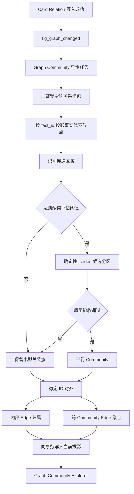
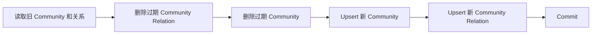

# 平行 Graph Community 图聚类与跨社区关系实施方案

## 1. 模块目标

本模块把关系优先知识图谱中的 Community 生成方式从“一个连通分量等于一个 Community”升级为“连通区域内的平行图聚类”，并生成可追溯到 Card Edge 的跨 Community 关系投影。

实现后必须满足：

- 小型有效关系簇仍然直接形成 Community；
- 大型连通区域只作为聚类计算边界，不再直接落成超大 Community；
- 每个等价事实代表 Card 在同一轮当前分区中最多属于一个 Community；
- 同一原子事实的重复来源 Card 不重复占用 Community 节点；
- Community 之间不存在父子层级；
- 跨 Community 关系可以展开到底层 `kg_card_relations`；
- 相同输入重复计算时，Community ID、成员和跨社区关系保持稳定；
- Community 成员、内部 Edge 和跨社区关系在同一个数据库事务中更新。

本模块不生成事实报告和条件性预测，也不调用 LLM。

## 2. 模块边界

输入：

- active Cognitive Card；
- Card 当前 `fact_id` 投影；
- active、已核验且端点有效的 Card Relation；
- 受当前图变更影响的 Card ID；
- 受影响区域内已有 Community 的 ID、身份锚点和成员。

输出：

- 当前有效的平行 `kg_graph_communities`；
- 当前有效的 `kg_graph_community_relations`；
- Community 与 Community Relation 的创建、更新、未变化和删除结果。

Card Relation 是事实源，Community 和 Community Relation 都是可重建的当前状态投影。

## 3. 加入新能力后的整体系统架构

## 4. 模块职责架构

### 4.1 Domain

`src/domain/knowledge/relation_graph_community.py`

职责：

- 校验参与聚类的 Card Edge；
- 计算无向连通区域；
- 对超过阈值的区域运行确定性 Leiden；
- 验收候选分区；
- 将已有 Community ID 稳定映射到新分区；
- 计算 Community 图指纹；
- 将跨分区 Card Edge 聚合为 Community Relation。

Domain 只处理内存数据，不访问 PostgreSQL、Redis、Milvus 或 LLM。

### 4.2 Application Service

`src/application/services/relation_graph_community_service.py`

职责：

- 响应 `kg_graph_changed`；
- 使用 Adapter 级 Redis 锁串行化 Community 刷新；
- 加载受影响关系闭包；
- 调用 Domain 生成当前分区；
- 将 Community 和 Community Relation 一次性交给 Repository；
- 记录 Langfuse 阶段统计。

当前采用 Adapter 级锁而不是连通区域级锁。它牺牲部分并行度，但避免两个任务同时改写相互重叠的 Community。

### 4.3 Persistence

`src/infrastructure/persistence/repositories/relation_graph_community_repository.py`

职责：

- 从变化 Card 出发加载完整有效关系闭包；
- 将 `same_fact` 关系用于等价事实身份闭包，但不作为 Community 业务 Edge；
- 把其他 Edge 端点投影到稳定事实代表 Card，并保留 `same_event` 等原始 Edge ID；
- 加载与该闭包相交的已有 Community；
- 在同一个 SQLAlchemy 事务中删除过期投影；
- 幂等 upsert 新 Community；
- 幂等 upsert 跨 Community Relation；
- 仅在图指纹变化时提升 Community 图版本并清空旧认知产物状态。

### 4.4 Explorer

涉及：

- `src/infrastructure/persistence/repositories/relation_graph_explorer_repository.py`
- `src/application/services/relation_graph_explorer_service.py`
- `src/interfaces/api/routes/knowledge.py`
- `static/kg_graph_explorer.*`

Explorer 默认展示 Community 级关系图：

- 节点是平行 Community；
- Edge 是聚合后的 Community Relation；
- 节点大小反映 Community Card 数量；
- Edge 宽度反映底层支撑 Card Edge 数量；
- 点击 Community 进入原有 Card 子图；
- 点击 Community Relation 展开底层 Card Edge、Card 摘要和关系依据。

## 5. 关键流程

### 5.1 受影响关系闭包

每次在线任务从 `affected_card_ids` 出发，通过正规化
`kg_graph_community_memberships` 定位变化端点已有 Community。刷新范围包含：

- 变化端点所在 Community 的完整成员；
- 尚未分配 Community 的新端点；
- 新端点一跳 active Edge 直接连接的已有 Community。

在线任务不会再沿既有跨 Community Edge 递归扩展完整连通分量。全图遍历只保留给显式离线重建和一致性校验。

同时把与这些 Card 相交的当前 Community 纳入更新范围。这样无论发生新增连接、社区合并还是大社区拆分，都能删除受影响区域中的过期投影。

完整闭包加载后执行等价事实投影：

1. 根据 Card 的当前 `fact_id`，选择该事实组中最早创建且仍 active 的 Card 作为代表节点；
2. `same_fact` Edge 不进入待聚类业务图；
3. 其他 Edge 的两个端点映射为各自事实代表 Card，`same_event` 继续参与聚类；
4. 投影后两端相同的 Edge 属于同一等价事实组内部证据，不进入 Community；
5. 投影后仍跨事实的 Edge 保留原始 Edge ID、关系类型、决策等级和内容版本。

因此 Community 成员是等价事实代表 Card，`member_edge_ids` 仍指向可追溯的原始 `kg_card_relations`。多个来源重复陈述同一事实时不会增加节点；同一事件的不同事实侧面仍由 `same_event` 连接。

### 5.2 连通区域与聚类评估

连通区域只用于隔离互不相连的计算范围。

默认聚类触发参数：

- Card 数量阈值：40；
- Edge 数量阈值：80。

只要任一阈值达到，就运行 Leiden。阈值只触发评估，不是 Community 最大容量，也不强制拆分。

Leiden 默认参数：

- resolution：1.0；
- randomness：0.001；
- iterations：2；
- trials：3；
- seed：42。

除固定随机种子外，还必须按 Card ID 排序节点，将每条无向 Edge 的两个端点
按 Card ID 规范化后再排序，并为每个节点显式分配 singleton 初始 Community。
不能依赖 NetworkX 子图或 Leiden 内部生成的节点顺序，否则无向 Edge 的方向和
底层 HashMap 迭代顺序可能导致相同图在不同进程中产生不同分区。

一轮 Leiden 候选分区通过验收后，必须逐个复检候选分区。候选分区仍达到 Card
或 Edge 评估阈值时，对其内部子图继续执行相同的确定性 Leiden 与质量验收。
递归在以下任一条件成立时停止：

- 当前分区同时低于 Card 和 Edge 评估阈值；
- Leiden 不能产生至少两个候选分区；
- 候选分区未通过本节定义的质量验收。

因此阈值会作用于每一层候选分区，但不会为了满足固定容量而强行拆开一条不可分
的有效关系链。

### 5.3 候选分区验收

候选分区必须同时满足：

- 至少两个分区；
- 每个分区至少两个 Card；
- 每个分区至少一条内部有效 Edge；
- 每个分区内部连通；
- 加权跨分区 Edge 占比不高于 0.35；
- NetworkX modularity 不低于 0.05。

如果不满足，保留原连通区域为一个 Community。系统不会为了控制大小强行切块，也不会创建无内部 Edge 的单节点 Community。

### 5.4 稳定 Community ID

新分区和已有 Community 按以下顺序匹配：

1. 原身份锚点仍位于该分区；
2. 新旧成员 Jaccard 重叠率更高；
3. 新旧成员交集更大；
4. Community ID 和分区顺序用于确定性消歧。

一个旧 ID 最多分配给一个新分区。未匹配分区使用其最小 Card ID 作为身份锚点生成稳定 ID。

### 5.5 跨 Community 关系投影

完成 Membership 后遍历受影响区域的全部有效 Card Edge：

- 两端属于同一 Community：写入该 Community 的内部 Edge 清单；
- 两端属于不同 Community：按起点 Community、终点 Community、`relation_kind` 聚合。

对称关系先规范化 Community 端点顺序；有向关系保留原 Card Edge 方向。

每条 Community Relation 保存：

- 稳定 ID；
- 起点和终点 Community ID；
- `relation_kind`；
- 支撑 Card Edge ID 清单；
- observed / inferred 支撑 Edge 数量；
- 由端点、类型、Edge ID、决策类型和 Edge 内容版本生成的指纹。

它不保存新的总结和证据正文。

Community 报告读取快照时，同样把原始 Edge 端点映射回 Community 中的事实代表 Card。报告只读取代表 Card Summary，同时接收该事实的 `fact_card_count` 并可以引用全部原始 Edge ID；不能因为追溯关系证据而把同一事实的重复来源 Card 再次展开为报告节点。`fact_card_count` 只表示材料覆盖，不自动等于市场热度或事实可信度。

## 6. 数据与状态生命周期

新增表：`kg_graph_community_relations`。

对应 schema：

- `schema/06_knowledge.sql`：完整知识库 schema；
- `schema/18_relation_graph_communities.sql`：现有库升级和关系图 Community 重建。
- `schema/20_card_fact_identity.sql`：丢弃旧 `event_id` 投影，为现有 Card 建立单例 `fact_id`，再由 active observed `same_fact` Edge 回填等价事实组。

刷新事务顺序：

任何异常都会回滚整个事务。Explorer 不会读到只更新 Membership、尚未更新跨社区关系的中间状态。

Community Relation 是派生投影。发现状态不一致时可以整表清理后从 active Card Edge 重建，不影响 Card Relation 事实。

## 7. 并发与最终一致性

Community 刷新任务使用 Adapter 级 Redis 分布式锁，并定时续租。相同 Adapter 的两个任务不会并发写 Community。

Card Relation 写入不持有 Community 锁，因此刷新计算期间仍可能新增 Edge。该 Edge 在写入成功后会独立投递新的 `kg_graph_changed` 事件；等待锁的后续任务会重新加载最新关系闭包并修正当前投影。

这意味着：

- 同一刷新事务内部强一致；
- Card Relation 与 Community 投影之间采用事件驱动最终一致；
- 部署新版代码前，必须停止仍按旧算法写 Community 的旧 worker；
- 新版 worker 启动后执行一次全量重建，清除旧分区和旧跨社区投影。

## 8. 配置

环境变量：

- `KG_GRAPH_COMMUNITY_CLUSTER_NODE_THRESHOLD`
- `KG_GRAPH_COMMUNITY_CLUSTER_EDGE_THRESHOLD`
- `KG_GRAPH_COMMUNITY_LEIDEN_RESOLUTION`
- `KG_GRAPH_COMMUNITY_LEIDEN_MIN_MODULARITY`
- `KG_GRAPH_COMMUNITY_MAX_CROSS_EDGE_RATIO`

这些参数用于真实图回放校准。除非已有明确评测结果，不应把阈值解释为业务主题边界。

## 9. 迁移路径

1. 应用 `schema/18_relation_graph_communities.sql`，创建跨 Community 关系表。
2. 部署包含新 Domain、Service、Repository 和任务代码的 worker。
3. 确认旧 worker 已停止，防止旧连通分量算法覆盖新投影。
4. 使用 `scripts/知识图谱/02_relation_graph_community_validation.py --dry-run` 检查分区统计。
5. 执行一次不带 `--dry-run` 的全量重建。
6. 再执行一次全量重放；在没有新 Card Edge 写入时，Community 和 Community Relation 应全部为 unchanged。
7. 部署 API/static 后检查 Explorer 概览与详情。

## 10. 验证结果与指标

单元测试覆盖：

- 最小两 Card Community；
- 小型链和星型关系不丢叶子；
- 互不连通关系形成独立 Community；
- 大型稠密子图被弱桥边拆成平行 Community；
- 跨 Community Edge 正确聚合；
- 旧身份锚点所在分区复用旧 Community ID；
- Adapter 级任务锁串行化；
- Explorer Community 概览、关系详情和 API。

2026-07-27 真实图只读回放：

- 原最大 Community：462 Card、1370 Edge；
- 连通区域数：1；
- 输出平行 Community：17；
- 输出跨 Community Relation：37；
- 输出 Community 规模：6 至 54 Card；
- 没有生成单节点 Community。

全量写入回放：

- 有效 Card Edge：2289；
- 连通区域：214；
- 触发聚类区域：1；
- 最终 Community：230；
- 跨 Community Relation：37；
- 当时最大 Community：52 Card。

验收时至少检查：

- Card 重复 Membership 数量为 0；
- 每条 active Edge 恰好属于内部 Edge 或跨 Community Relation；
- Community Relation 的底层 Edge 均为 active；
- Community Relation 两端均为 active Community；
- 无新 Edge 写入时重复运行不产生版本变化；
- Explorer 能从 Community Relation 展开到底层 Card Edge。

## 11. 已知运行边界

当前图仍在被线上旧 worker 更新时，无法用连续两次全量重放证明静态幂等：第二次运行期间出现的新 Edge 会合法改变分区。正式验收必须在新版 worker 已部署且旧 writer 已退出后执行。

本轮只实现平行图聚类和关系投影，不恢复旧的 Community Insight、事实报告或条件性预测自动任务。
