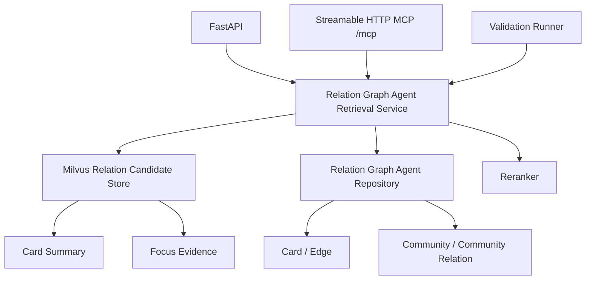
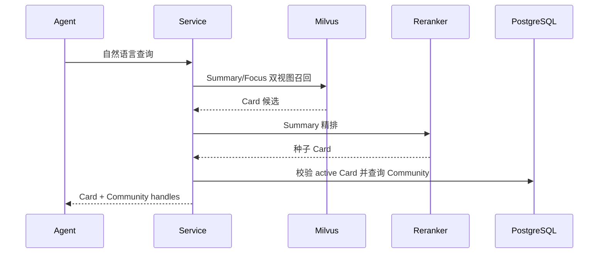
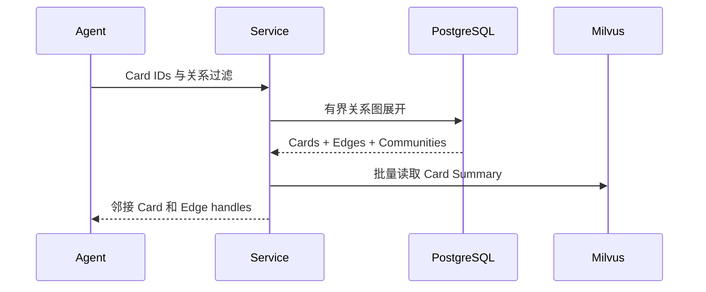

# 关系图 Agent 检索工具实施方案

## 1. 模块目标

将原子 Card、正式 Edge、平行 Community 封装为六个稳定的 Agent 工具，同时提供 Streamable HTTP MCP、等价 REST API、Langfuse 可观测链路和批量质量评测入口。

## 2. 模块边界

本模块读取：

- Milvus Card Summary；
- Milvus Card Focus Evidence；
- PostgreSQL Card manifest；
- PostgreSQL 有效 Card Edge；
- PostgreSQL 当前 Graph Community 和跨 Community 关系。

本模块不修改知识图谱，不生成报告或预测，不调用 LLM 判断关系。

## 3. 整体架构

MCP Tool、REST API 和验证脚本必须复用同一 Service，不能各自实现检索逻辑。MCP 作为现有 FastAPI 的 ASGI 子应用运行，共用端口、进程和生命周期；MCP Tool 不再通过 HTTP 回调本服务。

## 4. 模块职责

### 4.1 Milvus 双视图召回

同一查询并行检索 Summary 和 Focus Evidence，以 Card ID 合并，并通过 rank fusion 建立候选池。候选 Card 的最终排序使用 Summary rerank，Focus Evidence 只用于补充召回，不直接作为精排长文本。

### 4.2 Card 子图读取

从一组种子 Card 出发，按有效 Edge 做有界宽度优先展开。读取时应用：

- adapter 隔离；
- Card 和 Edge active 状态；
-关系类型过滤；
- Observed/Inferred 过滤；
-最低置信度；
-跳数、节点数和边数预算。

### 4.3 Community 图读取

Community Expand 只沿正式跨 Community Relation 展开，不读取成员 Card。Community Open 才读取成员摘要和内部 Edge。

### 4.4 精确打开

- Card Open 同时读取 PG manifest、Milvus Summary 和 Focus Evidence；
- Edge Open 读取 Edge 及双方 Card 的可读证据；
- Community Open 返回成员摘要和内部 Edge，不默认取回全部原始 Chunk。

## 5. MCP 与 API 映射

| HTTP 操作 | Agent Tool |
| --- | --- |
| 关系图 Card 搜索 | `kg_relation_graph_search` |
| Card 邻接展开 | `kg_card_expand` |
| Community 邻接展开 | `kg_community_expand` |
| Card 精确打开 | `kg_card_open` |
| Edge 精确打开 | `kg_edge_open` |
| Community 精确打开 | `kg_community_open` |

所有 ID 输入均使用批量数组。Open 操作保持只读和幂等。

MCP 使用无状态 Streamable HTTP，固定挂载在 `/mcp`。六个工具均为只读且不依赖服务端会话，无状态模式可以避免远程 Agent 维持额外 GET/SSE 连接。数据目标和 adapter 由服务端的 `SMART_FUND_MCP_TARGET`、`SMART_FUND_MCP_ADAPTER_NAME` 控制，不作为 Tool 参数暴露。生产环境通过 `SMART_FUND_MCP_BEARER_TOKEN` 启用只读 Bearer 鉴权。

六个工具必须在 MCP Schema 中声明 `readOnlyHint=true`、`destructiveHint=false`、`idempotentHint=true` 和 `openWorldHint=false`。Codex 项目配置使用 `default_tools_approval_mode="writes"`，从而允许只读查询在非交互任务中直接执行，同时为未来可能出现的写工具保留审批边界。

MCP 返回结果在接口层做上下文投影：

- Search 不返回原文和检索诊断；
- Expand 返回 Card 摘要和 Edge Handle；
- Card Open 返回焦点原文；
- Edge Open 返回双方 Card 证据和关系依据；
- Community Open 返回有界成员摘要和内部 Edge；
- 完整 ID 不截断，便于后续精确 Open。

## 6. 关键流程

### 6.1 Search

### 6.2 Card Expand

### 6.3 Open

Open 按 ID 精确读取，不再做语义召回。找不到或已经失效的对象进入 `missing_*_ids`，不能用模糊搜索替代。

## 7. 可观测性

REST 请求使用可选 Session ID，MCP 请求使用 MCP Session ID 建立 Langfuse Trace。六个 Service 操作分别记录 Tool Span，至少包含：

- 输入 ID 和预算；
- 返回对象数量；
- 截断状态；
- 缺失或失效 ID；
- Search 候选数和最终种子数。

Agent 通过 HTTP Tool 调用时复用同一 Service Span。

## 8. 质量评测

验证脚本支持自然语言单例和 JSON 评测集。评测集可以声明：

- `expected_seed_card_ids`，用于评估语义检索直接返回的种子 Card；
- `expected_card_ids`，用于评估图展开后应出现的 Card；
- `expected_edge_ids`；
- `expected_relation_kinds`；
- `forbidden_card_ids`。

输出指标包括：

- Seed Card Recall@K 与 Precision@K；
- Expanded Card Recall；
- Edge Recall；
- Relation Kind Recall；
- 种子层与展开层的 Forbidden Card 命中数；
- Card Focus Evidence 完整率；
- Edge Basis 完整率。

没有人工预期集合的案例标记为 `exploratory`，只用于观察检索结果和证据完整性，不计算语义质量通过率，也不把缺失金标解释为 Recall 100%。

## 9. 测试用例

### 9.1 单元测试

| 用例 | 验证内容 |
| --- | --- |
| Search 不自动展开 | 只返回种子 Card 和 Community，不返回 Edge。 |
| Card Expand | 跳数、关系过滤、Observed/Inferred 和截断行为正确。 |
| Card Open | Summary、Focus Evidence、来源和关系 handles 完整。 |
| Edge Open | 两端 Card、方向、Basis 和证据完整。 |
| Community Open | 返回内部成员和 Edge。 |
| Community Expand | 只返回 Community 与跨社区关系，不混入成员。 |
| API 契约 | 六个 HTTP 入口映射到正确 Service 操作。 |
| MCP Tool Schema | 六个 Tool 参数正确，服务端 Context 不进入 Tool Schema。 |
| MCP 结果投影 | 检索诊断不进入 Agent 上下文，Open 操作保留证据。 |
| MCP Bearer | 正确 Token 可访问，错误或缺失 Token 被拒绝。 |

### 9.2 集成测试

| 用例 | 验证内容 |
| --- | --- |
| Milvus 双视图 | Summary 与 Focus 命中按 Card ID 合并且可精确回读。 |
| PG 子图展开 | 只返回 active Card/Edge，adapter 不串数据。 |
| 真实查询回放 | 使用生产只读数据运行标注案例并写入 Langfuse。 |
| Agent Tool 调用 | Agent 能通过六个 HTTP Tool 获得标准 JSON。 |
| MCP 协议握手 | 客户端可通过 `/mcp` 初始化、获得 Session 并列出六个 Tool。 |

## 10. 验收标准

1. 六个关系图 Agent MCP Tool 和等价 REST API 均可调用。
2. Search、Expand、Open 三种职责没有隐式混用。
3. 失效对象和跨 adapter 对象不会进入结果。
4. 所有展开结果均受预算约束并报告截断。
5. Card 与 Edge 可以回到可读证据。
6. 自动化测试通过，真实只读验证可运行并进入 Langfuse。
