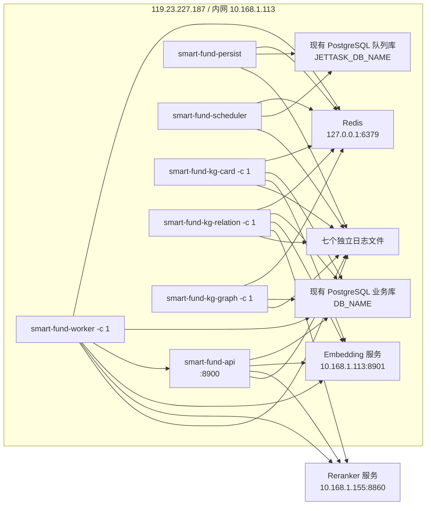
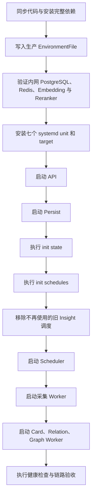

# systemd 数据采集服务部署方案

## 1. 文档定位

本文定义 `smart-fund-server` 在 `119.23.227.187:1113` 服务器上的生产部署方式，作为后续改造
`/home/yuyang/frida-test/.claude/skills/deploy_113.sh` 的实施依据。

本次部署的核心目标是让以下七个进程长期在后台运行，并由 systemd 分别管理：

| systemd 服务 | 启动命令 | 职责 |
|---|---|---|
| `smart-fund-api.service` | `python -m src.interfaces.cli api` | FastAPI、Browser Spy、Graph Community Explorer、LLM Proxy |
| `smart-fund-persist.service` | `python -m src.interfaces.cli persist` | 消费 jettask `_commands` 并持久化调度及任务元数据 |
| `smart-fund-scheduler.service` | `python -m src.interfaces.cli scheduler` | 按已注册 Schedule 向 Redis 队列投递任务 |
| `smart-fund-worker.service` | `python -m src.interfaces.cli worker -c 1` | 消费采集任务并写入业务数据库 |
| `smart-fund-kg-card.service` | `python -m src.interfaces.cli knowledge-worker --stage card -c 1` | Evidence、Chunk、Card、同 Chunk Relation 和 Probe |
| `smart-fund-kg-relation.service` | `python -m src.interfaces.cli knowledge-worker --stage relation -c 1` | 跨 Chunk 召回、rerank、原文关系核验和 Edge 写入 |
| `smart-fund-kg-graph.service` | `python -m src.interfaces.cli knowledge-worker --stage graph -c 1` | 增量刷新受影响的关系连通分量 Community |

本文只定义部署目标和实施细节，暂不修改服务器、不安装 systemd unit，也不执行数据库迁移。

## 2. 当前问题

现有 `deploy_113.sh` 仍按旧部署形态工作：

1. 只创建一个 `smart-fund-server.service`，无法独立观察和重启各类常驻进程。
2. 旧服务通过 `uvicorn main:app` 只启动 API，没有启动 `persist`、`scheduler` 和 `worker`。
3. `--init` 会安装本机 PostgreSQL 并创建数据库，与生产环境改走内网 PostgreSQL 的目标冲突。
4. 所有日志写入单一 `server.log`，无法区分调度、执行、持久化和 API 故障。
5. 默认部署还会重启 `smart-router`，扩大了数据采集服务发布的影响范围。
6. 当前 `pyproject.toml` 中的 `jettask-python` 指向开发机绝对路径下的 wheel。首次部署不能假设该路径在服务器存在。

这些问题必须在正式部署前解决，不能继续复用旧的单进程 service。

## 3. 目标架构



七个进程共享同一份代码和生产环境配置，但拥有独立的进程生命周期与日志。任一服务崩溃时，
systemd 只重启该服务，不把其他服务合并到同一个进程中。

## 4. 部署目录

服务器目录统一规划为：

```text
/home/yuyangruan/smart-fund/
├── smart-fund-server/     # rsync 同步的应用代码
├── config/
│   └── smart-fund-server.env             # 生产环境变量，不进入 rsync 和 Git
├── logs/smart-fund-server/
│   ├── api.log
│   ├── persist.log
│   ├── scheduler.log
│   ├── worker.log
│   ├── kg-card.log
│   ├── kg-relation.log
│   └── kg-graph.log
└── data/smart-fund-server/                # 不随代码发布删除的运行时数据
```

生产配置和运行时数据必须位于代码同步目录之外，避免 `rsync --delete` 删除密钥、日志或本地索引。
日志目录由部署脚本首次创建，并交给 `yuyangruan` 用户维护。

## 5. 生产配置

### 5.1 配置文件

七个 unit 统一读取：

```text
/home/yuyangruan/smart-fund/config/smart-fund-server.env
```

systemd 使用 `EnvironmentFile=` 注入配置。unit 文件中不得包含数据库密码、模型密钥或其他凭据。
配置文件权限应为 `0600`。

### 5.2 内网 PostgreSQL

当前开发机通过公网地址 `119.23.227.187` 访问数据库。该 PostgreSQL 就运行在
`deploy_113.sh` 的目标服务器上，生产服务部署后必须继续使用这一个现有数据库实例，不能新建、
复制或迁移出另一套“生产数据库”。

两种环境只改变连接路径：

| 调用方 | 数据库实例 | 连接地址 |
|---|---|---|
| 当前开发机 | `119.23.227.187` 上的现有 PostgreSQL | 公网 `119.23.227.187:5432` |
| 服务器上的七个 systemd 服务 | 同一个 PostgreSQL | 内网 `10.168.1.113:5432` |

服务器部署前必须通过 `pg_isready` 和真实 Python 连接确认 `10.168.1.113` 与公网地址指向同一实例，
并确认业务库、队列库、账号和现有数据完全一致。生产配置不再经过公网地址访问本机 PostgreSQL。

建议配置项：

```dotenv
DB_HOST=10.168.1.113
DB_PORT=5432
DB_NAME=jettask
DB_USER=jettask
DB_PASSWORD=<生产数据库密码>
JETTASK_DB_NAME=jettask_queue
```

业务数据通过现有 `DB_NAME=jettask` 连接；`persist` 和 `scheduler` 使用现有
`JETTASK_DB_NAME=jettask_queue`。两者共用同一 PostgreSQL 实例、端口和账号。除非以后队列库迁移到
其他实例，否则不要单独设置 `PG_URL`，由应用根据以上配置生成，避免在多个位置重复维护数据库地址和凭据。

本次部署不修改、不清空现有数据库，也不重置 `ft_collection_state`、jettask Schedule、任务历史或知识图谱
数据。数据库公网访问规则维持当前开发机所需范围，不因本次部署新增公网放行；服务器内部访问统一走内网。

### 5.3 Redis 与 API 内部调用

如果 Redis 与应用位于同一服务器：

```dotenv
REDIS_URL=redis://127.0.0.1:6379/0
JETTASK_PREFIX=fund_aggregator_prod
```

生产环境必须使用独立 `JETTASK_PREFIX`，避免和开发环境消费同一批任务。

API 与 Worker 之间走本机回环地址：

```dotenv
SERVER_HOST=0.0.0.0
SERVER_PORT=8900
SERVICE_BASE_URL=http://127.0.0.1:8900
```

`SERVICE_BASE_URL` 不能填写公网地址。雪球采集依赖 Worker 调用 API 中的 Browser Spy，API 未启动时，
雪球 Cookie 初始化会失败。

### 5.4 运行时文件

生产环境使用独立 Milvus Standalone，业务进程通过服务器本机端口访问：

```dotenv
KG_MILVUS_URI=http://127.0.0.1:19530
LLM_PROXY_FILE_CACHE_DIR=/home/yuyangruan/smart-fund/data/smart-fund-server/llm_proxy_cache
EMBEDDING_FILE_CACHE_DIR=/home/yuyangruan/smart-fund/data/smart-fund-server/embedding_cache
```

Milvus 数据卷、LLM 文件缓存和 Embedding 文件缓存必须位于
`/home/yuyangruan/smart-fund/data`，不能放入会被 `rsync --delete` 清理的代码目录。

为支持开发机直接验收生产向量数据，`deploy_126.sh --milvus-tunnel` 在
`10.168.1.126` 上安装 Supervisor 管理的 FRP Client，将
`10.168.1.113:19530` 映射为 `119.23.227.187:19530`。本地项目可配置：

```dotenv
KG_MILVUS_URI=http://119.23.227.187:19530
```

当前 Milvus 未启用认证，因此该公网入口同时具备读写能力。正式长期开放前必须增加 Milvus 鉴权或
公网来源 IP 白名单；在完成访问控制前，只用于受控开发验收，不得向第三方分发地址。

### 5.5 Embedding 与 Reranker 内网连接

生产服务部署到服务器后，Embedding 和 Reranker 也必须使用内网地址：

```dotenv
EMBEDDING_URL=http://10.168.1.113:8901
RERANKER_URL=http://10.168.1.155:8860
```

其中：

| 服务 | 当前公网访问方式 | 生产内网访问方式 |
|---|---|---|
| Embedding | 不需要经过公网 | `http://10.168.1.113:8901` |
| Reranker | `http://119.23.227.187:8860` | `http://10.168.1.155:8860` |

应用服务器、Embedding 和 Reranker 位于可互通的内网。生产 EnvironmentFile 中不得继续保留公网
`RERANKER_URL`。部署前需要分别检查端口、HTTP 接口和一次真实请求，不能只凭 TCP 端口可达判断服务可用。

当前默认采集队列不一定会调用 Embedding 或 Reranker，但知识图谱入库、关系发现及相关 API
会使用这些服务，因此它们属于完整生产环境健康检查的一部分。

## 6. systemd 服务设计

### 6.1 公共配置

七个服务采用相同的运行身份和基础参数：

```ini
[Unit]
PartOf=smart-fund-collector.target

[Service]
Type=simple
User=yuyangruan
Group=yuyangruan
WorkingDirectory=/home/yuyangruan/smart-fund/smart-fund-server
EnvironmentFile=/home/yuyangruan/smart-fund/config/smart-fund-server.env
Environment=PYTHONUNBUFFERED=1
Restart=always
RestartSec=5
TimeoutStopSec=60
KillSignal=SIGTERM
UMask=0027
```

Python 必须显式使用 Conda 环境：

```text
/home/yuyangruan/anaconda3/envs/smart-fund/bin/python
```

不能依赖 systemd 的 `PATH` 查找 `python`，也不再通过 `/usr/local/bin/python` 符号链接间接选择环境。

### 6.2 API

```ini
[Unit]
Description=Smart Fund API
Wants=network-online.target
After=network-online.target

[Service]
ExecStart=/home/yuyangruan/anaconda3/envs/smart-fund/bin/python -m src.interfaces.cli api
StandardOutput=append:/home/yuyangruan/smart-fund/logs/smart-fund-server/api.log
StandardError=append:/home/yuyangruan/smart-fund/logs/smart-fund-server/api.log

[Install]
WantedBy=smart-fund-collector.target
```

API 是 Browser Spy、Graph Community Explorer 和 LLM Proxy 的统一 HTTP 服务，不再为这些能力启动第二个
Uvicorn 实例。

### 6.3 Persist

```ini
[Unit]
Description=Smart Fund Jettask Persist
Wants=network-online.target
After=network-online.target

[Service]
ExecStart=/home/yuyangruan/anaconda3/envs/smart-fund/bin/python -m src.interfaces.cli persist
StandardOutput=append:/home/yuyangruan/smart-fund/logs/smart-fund-server/persist.log
StandardError=append:/home/yuyangruan/smart-fund/logs/smart-fund-server/persist.log

[Install]
WantedBy=smart-fund-collector.target
```

Persist 启动时会检查 jettask 月分区，因此必须具备队列数据库连接和相应 DDL 权限。

### 6.4 Scheduler

```ini
[Unit]
Description=Smart Fund Jettask Scheduler
Wants=network-online.target smart-fund-persist.service
After=network-online.target smart-fund-persist.service

[Service]
ExecStart=/home/yuyangruan/anaconda3/envs/smart-fund/bin/python -m src.interfaces.cli scheduler
StandardOutput=append:/home/yuyangruan/smart-fund/logs/smart-fund-server/scheduler.log
StandardError=append:/home/yuyangruan/smart-fund/logs/smart-fund-server/scheduler.log

[Install]
WantedBy=smart-fund-collector.target
```

`Wants` 和 `After` 只控制推荐启动顺序，不把 Scheduler 和 Persist 合并为一个故障域。

### 6.5 Worker

```ini
[Unit]
Description=Smart Fund Collection Worker
Wants=network-online.target smart-fund-api.service smart-fund-persist.service
After=network-online.target smart-fund-api.service smart-fund-persist.service

[Service]
ExecStart=/home/yuyangruan/anaconda3/envs/smart-fund/bin/python -m src.interfaces.cli worker -c 1
StandardOutput=append:/home/yuyangruan/smart-fund/logs/smart-fund-server/worker.log
StandardError=append:/home/yuyangruan/smart-fund/logs/smart-fund-server/worker.log

[Install]
WantedBy=smart-fund-collector.target
```

默认 Worker 只消费 CLI 当前启用的采集队列：

```text
collect_news
collect_fund_flow
collect_market
collect_macro
collect_sentiment
```

采集 Worker 不消费知识任务。知识任务由三个独立 Worker 消费，避免长时间 LLM 或 reranker 请求阻塞采集。

### 6.6 知识图谱 Worker

三个知识 Worker 分别使用以下命令：

```text
python -m src.interfaces.cli knowledge-worker --stage card -c 1
python -m src.interfaces.cli knowledge-worker --stage relation -c 1
python -m src.interfaces.cli knowledge-worker --stage graph -c 1
```

Graph Worker 只计算受影响的关系闭包，不做全图重建。同一 adapter 的刷新由带续租的 Redis 锁串行化，因此
即使重复投递或存在多个 Graph Worker 实例，也不会并发覆盖同一个 Community 当前态。

### 6.7 统一操作入口

七个 unit 保持独立，同时增加 `smart-fund-collector.target` 作为统一操作入口：

```ini
[Unit]
Description=Smart Fund Collection Stack
Wants=smart-fund-api.service smart-fund-persist.service smart-fund-scheduler.service smart-fund-worker.service smart-fund-kg-card.service smart-fund-kg-relation.service smart-fund-kg-graph.service
After=network-online.target

[Install]
WantedBy=multi-user.target
```

七个服务通过 `PartOf=smart-fund-collector.target` 接受 target 发起的统一停止和重启；单个服务异常退出时，
只由自身的 `Restart=always` 恢复，不会连带重启其他服务。这样既保留统一操作入口，也保留独立故障域。

## 7. 启动与初始化顺序

首次部署必须遵循以下顺序：



关键约束：

1. `init schedules` 前必须先启动 Persist，否则注册命令无法可靠落库。
2. Worker 前必须先启动 API，否则雪球采集第一次获取 Cookie 会失败。
3. `init state` 和 `init schedules` 是部署初始化动作，不应作为每次服务重启的 `ExecStartPre`。
4. 后续代码发布只重启七个进程，不重复重建数据库、不清空采集状态。
5. 首次切换到当前采集调度清单时，删除已废弃的 `kg_community_insight_refresh_1min`；否则它会持续
   向本次部署没有消费的旧队列投递消息。

### 7.1 同库部署与历史回填

生产服务和当前开发机共用同一个 PostgreSQL，因此服务器 Worker 启动后会继续使用已有
`ft_collection_state`：

- 已处于 `incremental` 的数据源继续从 `newest_time` 后采集；
- 正在 `backfill` 的数据源继续使用原有 `target_time` 和 `cursor`；
- systemd 重启和代码发布不会重新执行全量历史回填；
- `init state` 对已有记录只做缺失项初始化，不会用当前代码中的 `SOURCE_CONFIGS` 覆盖既有 checkpoint。

这是保证多台调用方不会重复全量抓取的必要行为。生产部署过程中禁止执行 `init state --reset`，否则会同时
重置全部采集源，造成重复抓取、接口压力和 checkpoint 丢失。

需要主动补齐更早历史时，使用已经提供的一次性受控回填命令：

```bash
python -m src.interfaces.cli collection backfill-sources
python -m src.interfaces.cli collection backfill news ths --start-date 2026-05-01 --dry-run
python -m src.interfaces.cli collection backfill news ths --start-date 2026-05-01
```

该命令只调整选中 source，保留已有 `newest_time`，并通过源级 Redis 锁避免与 Worker 并发修改 checkpoint。
达到目标日期或上游历史上限后会自动切回 `incremental`。

对于服务停止一周后重新启动的情况，支持历史追赶的新闻源和北向资金会根据 `last_success_at` 自动识别断档：

1. 停止时间超过 `max(两倍 source interval, 1 小时)` 时进入临时追赶；
2. 以停机前 `newest_time` 为边界，并额外重叠一天回抓；
3. 依靠唯一键或 fingerprint 去除重叠数据；
4. 追赶完成后自动恢复增量。

没有历史接口的市场快照和部分情绪源无法补造停机期间的瞬时数据。上游接口历史保留不足时，也只能补到接口
上限并以 `backfill_status=ceiling` 明确结束。

历史回填属于独立的数据治理任务，不作为本次七个 systemd 服务部署成功的前置条件。

## 8. `deploy_113.sh` 改造范围

后续实施时，脚本需要完成以下调整。

### 8.1 保留

- SSH 和 rsync 到 `119.23.227.187:1113` 的能力。
- `--init`、`--sync-only`、`--restart`、`--status`、`--logs`、`--test` 的总体操作形式。
- 代码目录 `/home/yuyangruan/smart-fund/smart-fund-server`。
- rsync 必须显式排除 `.env`、`.env.*`、日志目录、`data/` 和其他运行时文件，禁止把开发机凭据同步到服务器。

### 8.2 删除或退出默认流程

- 从日常部署和重复执行的 `--init` 中删除 PostgreSQL 安装、建用户和建库逻辑。现有 PostgreSQL、
  `jettask` 业务库和 `jettask_queue` 队列库必须原样保留，只执行连接与结构完整性检查。
- 删除旧 `smart-fund-server.service` 的生成和启停逻辑。
- 默认部署不再重启 `smart-router`；Router 保持独立部署。
- 不再把所有输出写入 `server.log`。
- 不再创建 `/usr/local/bin/python` 符号链接。

### 8.3 新增

- 安装和更新七个独立 service 以及一个 collector target。
- 创建配置、日志和持久化数据目录。
- 校验生产 EnvironmentFile 存在且权限正确，但不自动生成虚假密钥。
- 依次重启 `api -> persist -> scheduler -> worker -> kg-card -> kg-relation -> kg-graph`。
- `--status` 同时展示七个 unit 状态和 API 健康检查。
- `--logs <api|persist|scheduler|worker|kg-card|kg-relation|kg-graph> [N]` 查看指定服务日志。
- `--test` 检查进程、端口、Redis、内网 PostgreSQL、Embedding、Reranker、API、Spy 和最新采集状态。
- 发布失败时停止后续步骤，并输出失败服务对应日志。

### 8.4 Python 依赖

当前 `pyproject.toml` 中 `jettask-python` 使用开发机绝对路径 wheel。部署脚本采用受控制品方式解决：

1. 同步代码时将经过验证的 `jettask_python-0.1.0-py3-none-any.whl` 单独上传到
   `/home/yuyangruan/smart-fund/artifacts/`；
2. 生产环境先安装该 wheel，再安装项目声明的运行时依赖；
3. wheel 不放入代码 rsync 目录，不依赖服务器存在开发机绝对路径。

后续如果 jettask 发布到私有 Python 仓库，可再将部署制品切换为固定版本仓库依赖。

## 9. 日志治理

七个日志文件必须独立：

| 服务 | 日志文件 |
|---|---|
| API | `logs/smart-fund-server/api.log` |
| Persist | `logs/smart-fund-server/persist.log` |
| Scheduler | `logs/smart-fund-server/scheduler.log` |
| Worker | `logs/smart-fund-server/worker.log` |
| KG Card Worker | `logs/smart-fund-server/kg-card.log` |
| KG Relation Worker | `logs/smart-fund-server/kg-relation.log` |
| KG Graph Worker | `logs/smart-fund-server/kg-graph.log` |

生产部署同时配置 logrotate：

- 每日检查；
- 单文件达到 `100 MB` 时也触发轮转；
- 保留 14 份；
- 压缩历史日志；
- 使用 `copytruncate` 兼容 systemd 的 `StandardOutput=append:` 文件句柄；
- 使用 `su yuyangruan yuyangruan` 在业务用户身份下轮转，避免 logrotate 因日志父目录非 root 所有而跳过；
- 日志权限为 `0640`，归属 `yuyangruan:yuyangruan`。

systemd journal 仍保留 unit 生命周期和启动失败信息，但业务日志以以上本地文件为主要排查入口。

## 10. 发布与回滚

### 10.1 常规发布

1. 同步代码。
2. 更新 Python 依赖。
3. 对现有数据库执行必要但非破坏性的结构检查或迁移，不创建第二套数据库。
4. 按顺序重启 API、Persist、Scheduler、采集 Worker 和三个知识 Worker。
5. 完成健康检查和采集增量检查。

同步期间不删除生产 EnvironmentFile、日志和持久化数据。

### 10.2 失败处理

任一服务启动失败时：

1. 不继续启动依赖它的后续服务。
2. 输出该服务最近日志及 `systemctl status`。
3. 保留数据库、Redis 队列和采集 checkpoint，不做清理。
4. 回退到上一个已验证代码版本后重新启动。

Worker 和 Scheduler 停止期间，Redis 与 jettask 数据库中的待处理任务不能被部署脚本删除。

## 11. 健康检查

部署成功至少满足以下条件：

### 11.1 systemd

```bash
systemctl is-active smart-fund-api
systemctl is-active smart-fund-persist
systemctl is-active smart-fund-scheduler
systemctl is-active smart-fund-worker
systemctl is-active smart-fund-kg-card
systemctl is-active smart-fund-kg-relation
systemctl is-active smart-fund-kg-graph
```

七项都应返回 `active`。

### 11.2 API

```bash
curl --fail http://127.0.0.1:8900/health
curl --fail http://127.0.0.1:8900/api/spy/status
```

`/health` 应返回正常状态；Spy 的 `available=true` 表示浏览器能力可用。首次雪球请求前
`started=false` 属于正常状态。

### 11.3 依赖

```bash
pg_isready -h 10.168.1.113 -p 5432
redis-cli -u redis://127.0.0.1:6379/0 ping
curl --fail http://10.168.1.113:8901/v1/models
curl --fail http://10.168.1.155:8860/health
```

Reranker 的实际健康检查路径应以该服务当前实现为准；如果没有 `/health`，部署脚本应调用一个最小
`/v1/rerank` 请求。Embedding 同样需要执行一个最小 `/v1/embeddings` 请求。

只验证端口可达还不够，部署脚本还应：

1. 使用项目 Python 环境分别建立业务库和 jettask 队列库连接；
2. 向 Embedding 发送最小向量请求并校验返回维度；
3. 向 Reranker 发送最小排序请求并校验结果结构；
4. 确认请求目标均为内网地址。

### 11.4 数据采集

验收时手动触发一次低风险采集任务，并确认：

1. Scheduler 或手动 Trigger 成功投递。
2. Worker 日志出现任务开始和完成记录。
3. 对应业务表产生新增或幂等更新。
4. `ft_collection_state` 的 `last_success_at` 更新。
5. `consecutive_failures=0`，`last_error` 为空。
6. 雪球采集首次运行后 Spy 获得 Cookie，且雪球数据真实写入，而不是空结果假成功。

## 12. 测试用例

### 12.1 部署脚本测试

| 用例 | 验证内容 |
|---|---|
| 首次初始化 | 能创建目录、安装 unit、启用 target，并按正确顺序完成初始化 |
| 重复执行 `--init` | 不安装或重建 PostgreSQL，不重复建库，不破坏配置和历史数据，unit 更新保持幂等 |
| 仅同步代码 | 不重启服务，不删除配置、日志和持久化数据 |
| 独立重启 | 重启单个服务不影响其他服务 |
| 批量重启 | 七个服务按依赖顺序恢复 |
| 状态检查 | 能准确报告七个 unit、API、Redis 和 PostgreSQL 状态 |
| 日志查看 | 能按服务读取对应日志，不混入其他进程输出 |
| 发布失败 | 任一步失败后立即终止，输出对应日志且不清理队列和 checkpoint |

### 12.2 systemd 集成测试

| 用例 | 验证内容 |
|---|---|
| 服务器重启 | collector target 自动拉起七个服务 |
| Worker 异常退出 | systemd 在 5 秒后自动重启 Worker |
| API 异常退出 | API 自动恢复；其他采集源不因 API 故障被整体杀死 |
| Persist 异常退出 | Persist 自动恢复，已注册 Schedule 不丢失 |
| Scheduler 异常退出 | Scheduler 自动恢复，不产生重复 Schedule 定义 |
| SIGTERM 停止 | 七个进程能在 `TimeoutStopSec` 内正常退出 |
| 日志轮转 | 轮转后七个服务继续写入各自当前日志 |

### 12.3 数据链路验收

| 用例 | 验证内容 |
|---|---|
| 新闻采集 | `collect_news` 能写入 `ft_news` 并更新 checkpoint |
| 市场采集 | `collect_market` 在交易时段按分钟执行 |
| 资金流采集 | `collect_fund_flow` 按计划执行并保持幂等 |
| 宏观采集 | `collect_macro` 按小时执行 |
| 情绪采集 | `collect_sentiment` 能写入股吧、涨跌停池和雪球数据 |
| 雪球首次访问 | API Browser Spy 被懒启动，Worker 成功取得 `xq_a_token` |
| 数据库一致性 | 开发机公网连接与服务器内网连接读取的是同一个业务库和队列库 |
| 数据库内网连接 | 服务器服务日志和连接信息中不再出现公网 PostgreSQL 地址 |
| Embedding 内网连接 | 生产服务通过 `10.168.1.113:8901` 完成真实向量请求 |
| Reranker 内网连接 | 生产服务通过 `10.168.1.155:8860` 完成真实排序请求 |
| 重启恢复 | Worker 重启后继续使用原 checkpoint，不重复全量采集 |
| 停机断档追赶 | 模拟支持回填的数据源停机一周；Worker 重启后自动补到停机前边界并恢复 `incremental` |
| 历史接口触顶 | 上游不能返回目标日期时以 `backfill_status=ceiling` 结束，不重复死循环 |
| 知识任务级联 | 新增 `ft_news` 自动经过 Card、Relation、Edge 和 Community |
| Community 并发 | 同一 adapter 的并发图事件串行刷新，锁续租失败时任务重试且不继续写入 |

## 13. 验收标准

本次部署只有同时满足以下条件才算完成：

1. 七个进程分别由独立 systemd service 托管并设置开机启动。
2. API、Persist、Scheduler、采集 Worker 和三个知识 Worker 均可独立启停、查看状态和查看日志。
3. 服务器上的 PostgreSQL 连接使用 `10.168.1.113` 内网地址，并与当前开发机连接的是同一数据库实例。
4. Embedding 使用 `10.168.1.113:8901`，Reranker 使用 `10.168.1.155:8860`，均不经过公网。
5. 生产凭据不写入 unit、部署脚本和 Git。
6. 七个日志文件持续落盘并有轮转策略。
7. 服务器重启后七个服务能自动恢复。
8. 定时任务能持续投递，Worker 能持续消费并真实写入数据。
9. 雪球 Browser Spy 链路能够在 API 与 Worker 分进程部署下正常工作。
10. 部署和重启不会重建数据库，也不会清空 Redis 队列、数据库 checkpoint、Milvus 或文件缓存。
11. `deploy_113.sh` 的状态、日志和测试命令覆盖七个服务，而不是只检查旧 API 服务。
