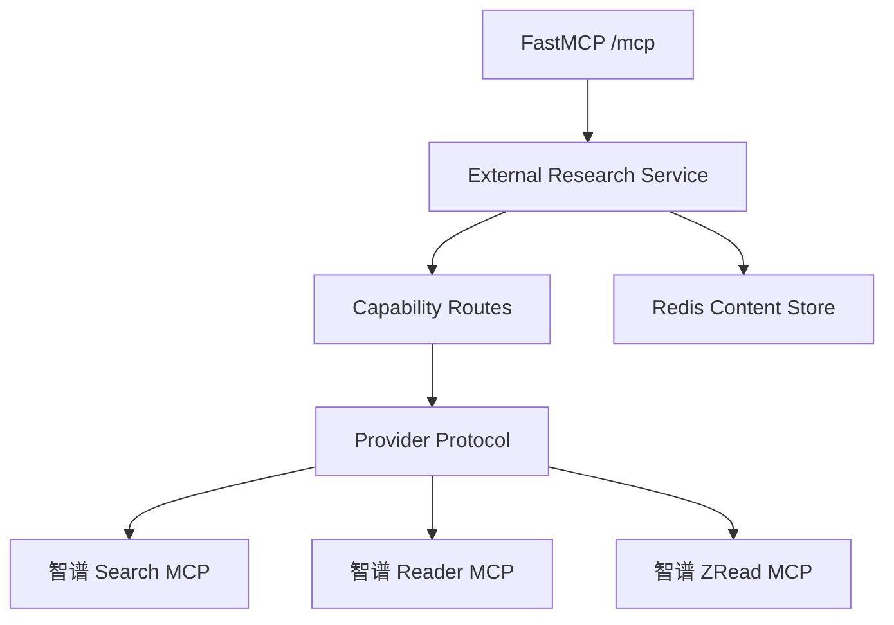
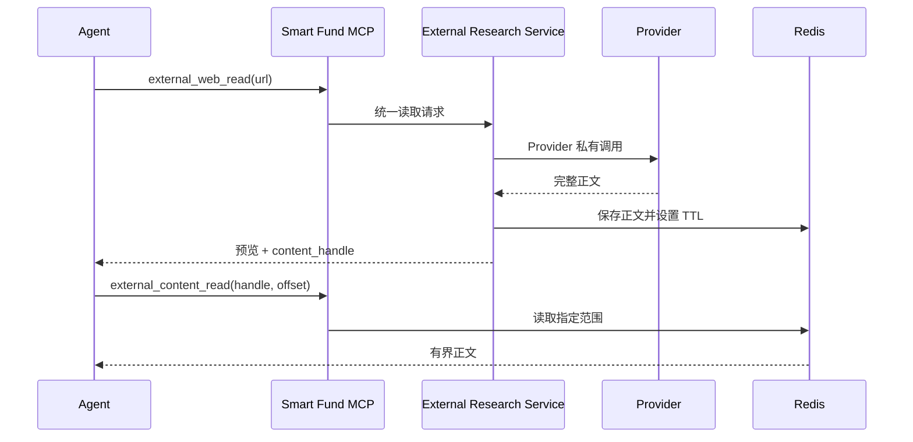

# 多厂商外部研究工具网关实施方案

## 1. 模块目标

在现有 FastAPI `/mcp` 中增加供应商中立的外部研究工具，通过统一应用服务调用智谱 Coding Plan Remote MCP，并为后续 OpenAI、阿里云 Provider 保留稳定扩展点。

## 2. 模块边界

模块负责：

- 按 capability 路由外部研究 Provider；
- 适配供应商认证、工具名和返回结构；
- 对长正文建立 Redis 临时句柄；
- 通过现有 MCP 暴露稳定只读工具；
- 记录 Langfuse 调用链。

模块不负责把外部结果写入 Card、Edge 或 Community，也不负责访问 Agent 本地文件。

## 3. 整体架构

## 4. 模块职责

### 4.1 External Research Service

维护统一输入校验、Provider 选择、标准结果投影、预览大小和内容分页。MCP 接口不直接处理供应商私有字段。

### 4.2 Provider Adapter

首个 Provider 适配智谱 Coding Plan：

- `web_search_prime` 转为统一搜索结果；
- `webReader` 转为 Markdown 内容；
- `search_doc`、`get_repo_structure`、`read_file` 转为统一仓库内容。

后续 Provider 只需实现相同能力协议，并加入 capability route。

### 4.3 Redis Content Store

网页或仓库正文写入带 TTL 的临时对象，返回不可推导的 `external_content:*` 句柄。多 Worker 共享同一 Redis，因此任意 API Worker 都能继续读取。

### 4.4 MCP 工具

新增稳定只读工具：

- `external_web_search`
- `external_web_read`
- `external_repo_search`
- `external_repo_structure`
- `external_repo_read`
- `external_content_read`

前五个工具声明 `openWorldHint=true`；句柄读取只访问 Smart Fund 已缓存内容，声明 `openWorldHint=false`。

## 5. 关键流程

## 6. 配置与生命周期

每种 capability 独立配置 Provider 名称。智谱密钥和 Remote MCP 地址只在服务端环境中配置。内容句柄 TTL、预览字符数和单页最大字符数均可独立调整。

Provider 返回的长内容不写 PostgreSQL 和 Milvus；它是一次研究任务中的临时上下文，不属于知识库当前态。

## 7. 方案边界

OpenAI 原生搜索并不是一个可直接转发的独立 MCP。后续接入时应在 OpenAI Provider 内调用其模型工具协议，再转为当前统一契约。阿里云同理。

智谱 Vision MCP 是本地 stdio 工具，依赖调用机器可读的图片路径。中央服务版本必须先完成 URL 或上传句柄协议，不能直接复用本地路径参数。

## 8. 验证

验证分为三层：

1. 单元测试：Service 路由、结果投影、预览和分页、智谱私有字段适配。
2. 真实 Provider 集成测试：Search、Reader、ZRead 和 Redis 句柄。
3. MCP 协议测试：通过 `/mcp` 握手、列出 12 个工具，并实际调用统一工具。

## 9. 当前实现状态

智谱 Search、Reader、ZRead 已完成真实调用验证；Redis 句柄分页和 MCP 协议入口已通过。OpenAI、阿里云 Provider 及视觉上传协议属于后续 Provider 扩展，不影响现有稳定工具契约。
